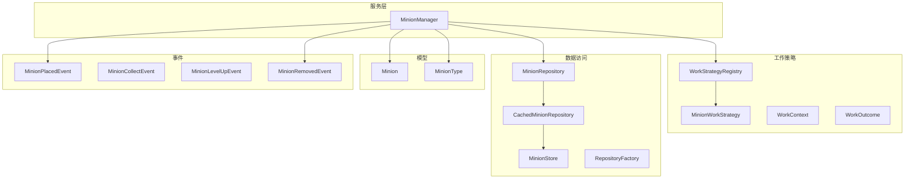
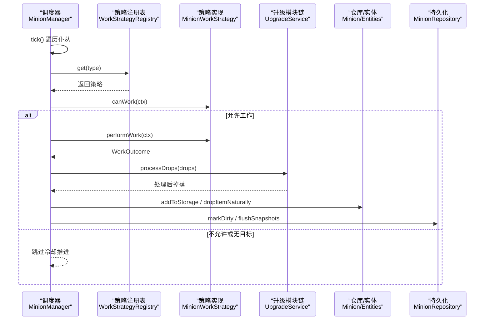
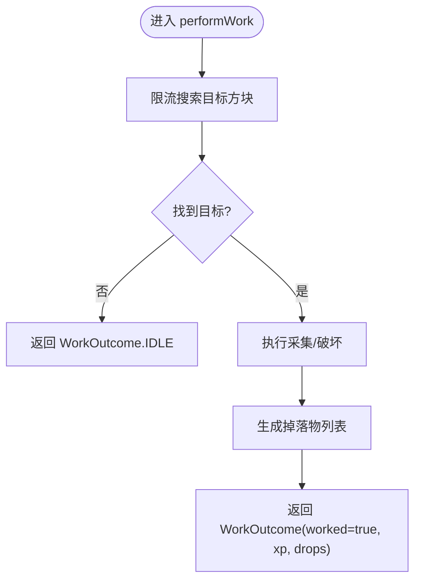
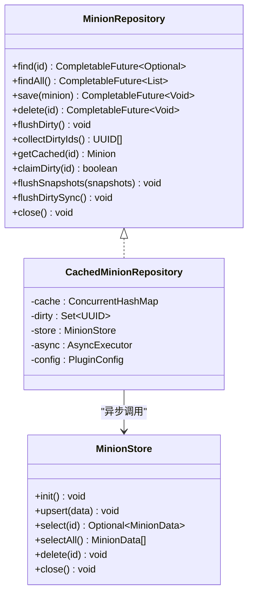
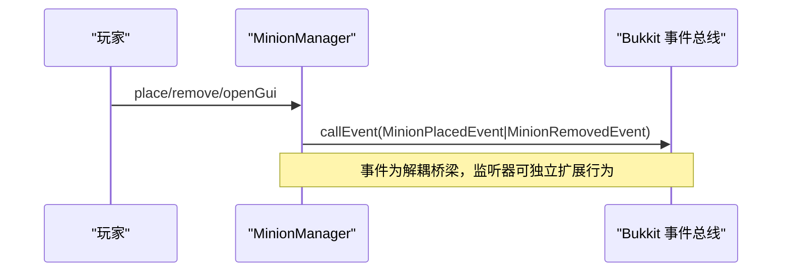
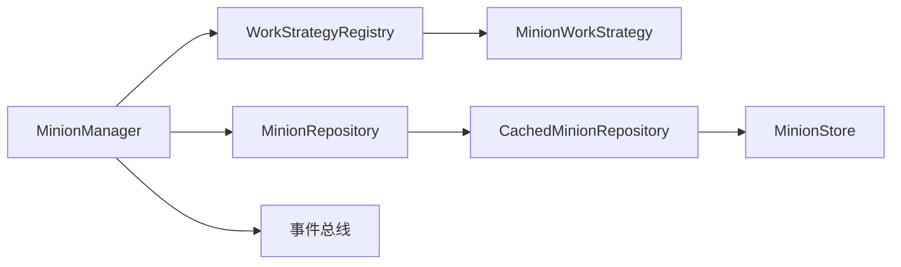

# API 参考文档

<cite>
**本文引用的文件**
- [MinionWorkStrategy.java](file://src/main/java/com/hcs/minions/work/MinionWorkStrategy.java)
- [WorkContext.java](file://src/main/java/com/hcs/minions/work/WorkContext.java)
- [WorkOutcome.java](file://src/main/java/com/hcs/minions/work/WorkOutcome.java)
- [WorkStrategyRegistry.java](file://src/main/java/com/hcs/minions/work/WorkStrategyRegistry.java)
- [MinionRepository.java](file://src/main/java/com/hcs/minions/repository/MinionRepository.java)
- [MinionStore.java](file://src/main/java/com/hcs/minions/repository/MinionStore.java)
- [CachedMinionRepository.java](file://src/main/java/com/hcs/minions/repository/CachedMinionRepository.java)
- [RepositoryFactory.java](file://src/main/java/com/hcs/minions/repository/RepositoryFactory.java)
- [MinionPlacedEvent.java](file://src/main/java/com/hcs/minions/event/MinionPlacedEvent.java)
- [MinionCollectEvent.java](file://src/main/java/com/hcs/minions/event/MinionCollectEvent.java)
- [MinionLevelUpEvent.java](file://src/main/java/com/hcs/minions/event/MinionLevelUpEvent.java)
- [MinionRemovedEvent.java](file://src/main/java/com/hcs/minions/event/MinionRemovedEvent.java)
- [MinionType.java](file://src/main/java/com/hcs/minions/model/MinionType.java)
- [Minion.java](file://src/main/java/com/hcs/minions/model/Minion.java)
- [MinionManager.java](file://src/main/java/com/hcs/minions/service/MinionManager.java)
- [README.md](file://README.md)
</cite>

## 目录
1. [简介](#简介)
2. [项目结构](#项目结构)
3. [核心组件](#核心组件)
4. [架构总览](#架构总览)
5. [详细组件分析](#详细组件分析)
6. [依赖关系分析](#依赖关系分析)
7. [性能考量](#性能考量)
8. [故障排查指南](#故障排查指南)
9. [结论](#结论)
10. [附录：版本兼容与迁移](#附录版本兼容与迁移)

## 简介
本 API 参考文档面向扩展 SkyMinions 插件的开发者，聚焦公共接口与关键工作流。重点覆盖：
- MinionWorkStrategy 策略模式：方法定义、实现要求、使用方式
- MinionRepository 数据访问：CRUD、事务与错误处理、缓存与落库机制
- 事件系统：MinionPlacedEvent、MinionCollectEvent、MinionLevelUpEvent、MinionRemovedEvent 的触发时机、携带数据、监听方式
- 完整调用链与示例模式，帮助正确集成与扩展

## 项目结构
SkyMinions 采用分层与模块化组织：
- model：运行时模型（Minion、MinionType）
- work：工作策略（MinionWorkStrategy、WorkContext、WorkOutcome、WorkStrategyRegistry）
- repository：数据访问抽象与实现（MinionRepository、MinionStore、CachedMinionRepository、RepositoryFactory）
- service：调度与服务（MinionManager 等）
- event：自定义事件（放置、收取、升级、移除）
- config/util/gui/listener：配置、工具、GUI、监听器

图表来源
- [MinionManager.java:44-86](file://src/main/java/com/hcs/minions/service/MinionManager.java#L44-L86)
- [WorkStrategyRegistry.java:14-33](file://src/main/java/com/hcs/minions/work/WorkStrategyRegistry.java#L14-L33)
- [MinionRepository.java:16-47](file://src/main/java/com/hcs/minions/repository/MinionRepository.java#L16-L47)
- [CachedMinionRepository.java:29-42](file://src/main/java/com/hcs/minions/repository/CachedMinionRepository.java#L29-L42)
- [Minion.java:38-102](file://src/main/java/com/hcs/minions/model/Minion.java#L38-L102)
- [MinionType.java:13-52](file://src/main/java/com/hcs/minions/model/MinionType.java#L13-L52)

章节来源
- [README.md:80-108](file://README.md#L80-L108)

## 核心组件
- MinionWorkStrategy：定义“可工作判断”“执行一次工作”“冷却时间”“服务对象类型”，通过 WorkStrategyRegistry 按类型查表调用，避免 if-else 堆砌。
- WorkContext：单次工作上下文，封装 Minion、World、锚点方块、半径、随机源、BlockSearcher，供策略只读使用。
- WorkOutcome：工作结果，包含是否实际工作、经验值、掉落物列表；IDLE 表示无目标不推进冷却。
- WorkStrategyRegistry：类型到策略的只读映射（EnumMap），未注册类型抛出异常，保证开闭原则。
- MinionRepository：持久化抽象，提供异步 CRUD、脏标记收集、快照批量落库、主线程同步冲刷等能力。
- MinionStore：底层存储接口（SQLite/MySQL），被 CachedMinionRepository 通过虚拟线程异步调用。
- MinionManager：全局调度器，负责遍历、委派区域线程执行工作、掉落入仓、自动售卖、事件发布等。

章节来源
- [MinionWorkStrategy.java:5-26](file://src/main/java/com/hcs/minions/work/MinionWorkStrategy.java#L5-L26)
- [WorkContext.java:10-21](file://src/main/java/com/hcs/minions/work/WorkContext.java#L10-L21)
- [WorkOutcome.java:7-21](file://src/main/java/com/hcs/minions/work/WorkOutcome.java#L7-L21)
- [WorkStrategyRegistry.java:10-33](file://src/main/java/com/hcs/minions/work/WorkStrategyRegistry.java#L10-L33)
- [MinionRepository.java:11-47](file://src/main/java/com/hcs/minions/repository/MinionRepository.java#L11-L47)
- [MinionStore.java:9-27](file://src/main/java/com/hcs/minions/repository/MinionStore.java#L9-L27)
- [MinionManager.java:39-86](file://src/main/java/com/hcs/minions/service/MinionManager.java#L39-L86)

## 架构总览
MinionManager 作为编排中心，每 tick 遍历内存中的仆从集合，仅做轻量判断（区块加载、坐标转换），将真正触碰世界状态的操作委派给对应区域的线程执行。工作过程通过 WorkStrategyRegistry 查找具体策略，执行后统一处理掉落、稀有掉落、升级模块链、自动售卖与脏标记。

图表来源
- [MinionManager.java:191-250](file://src/main/java/com/hcs/minions/service/MinionManager.java#L191-L250)
- [MinionManager.java:252-322](file://src/main/java/com/hcs/minions/service/MinionManager.java#L252-L322)
- [WorkStrategyRegistry.java:26-32](file://src/main/java/com/hcs/minions/work/WorkStrategyRegistry.java#L26-L32)
- [MinionRepository.java:22-43](file://src/main/java/com/hcs/minions/repository/MinionRepository.java#L22-L43)

## 详细组件分析

### MinionWorkStrategy 工作策略模式
- 设计要点
  - 以接口隔离不同仆从类型的采集逻辑，新增类型只需新增实现并注册。
  - 调度器仅依赖接口，禁止在调度器中写死类型分支。
  - 所有对世界状态的修改必须在区域线程执行（内部含 setType 等方块操作）。
- 方法说明
  - type(): 返回该策略服务的 MinionType。
  - canWork(WorkContext): 判断当前周期是否允许工作（燃料与环境由 Manager 统一判断，此处侧重语义检查）。
  - performWork(WorkContext): 执行一次限流搜索 + 破坏，返回 WorkOutcome。
  - cooldownTicks(): 基础冷却 tick，最终冷却会结合效率与燃料加成计算。
- 实现要求
  - 不得持有外部引用（如 Manager），仅通过 WorkContext 获取所需上下文。
  - 必须返回不可变或受保护的 drops 列表（WorkOutcome 已复制）。
  - 若本次无目标，返回 IDLE，调度器不会推进冷却或消耗燃料。
- 使用示例（模式）
  - 在策略中基于 WorkContext 的 BlockSearcher 进行邻接+随机搜索，限制最大尝试次数。
  - 对找到的方块执行破坏/采集，生成新的 ItemStack 放入 drops。
  - 根据策略语义决定是否 worked=true 以及 xp/drops。

图表来源
- [MinionWorkStrategy.java:15-25](file://src/main/java/com/hcs/minions/work/MinionWorkStrategy.java#L15-L25)
- [WorkOutcome.java:7-21](file://src/main/java/com/hcs/minions/work/WorkOutcome.java#L7-L21)

章节来源
- [MinionWorkStrategy.java:5-26](file://src/main/java/com/hcs/minions/work/MinionWorkStrategy.java#L5-L26)
- [WorkContext.java:10-21](file://src/main/java/com/hcs/minions/work/WorkContext.java#L10-L21)
- [WorkOutcome.java:7-21](file://src/main/java/com/hcs/minions/work/WorkOutcome.java#L7-L21)

### MinionRepository 数据访问模式
- 职责边界
  - 业务层唯一依赖的持久化入口，屏蔽 IO 细节。
  - 内部维护内存缓存（ConcurrentHashMap）与脏标记集合，驱动批量异步落库。
  - 所有阻塞 SQL 经由虚拟线程执行，主线程零阻塞。
- 主要方法
  - find(id)/findAll(): 异步查询单个/全部。
  - save(minion): 写入缓存并异步落库（write-through）。
  - delete(id): 删除记录。
  - collectDirtyIds()/claimDirty(id): 收集并认领脏 ID（CAS）。
  - flushDirty()/flushSnapshots(...): 批量异步落库。
  - getCached(id): 取缓存对象（供 region 线程生成快照）。
  - flushDirtySync(): 主线程同步冲刷（onDisable 路径安全）。
  - close(): 释放资源。
- 事务与一致性
  - 通过 claimDirty CAS 确保同一对象在同一时刻仅被一个任务抓取生成快照。
  - 快照在 region 线程生成，避免 Inventory 并发读取不一致。
  - 批量落库减少数据库往返。
- 错误处理
  - 加载失败时记录日志并继续启动（不影响其他功能）。
  - 关闭时先关闭 GUI，再同步冲刷，最后清理内存与实体。

图表来源
- [MinionRepository.java:16-47](file://src/main/java/com/hcs/minions/repository/MinionRepository.java#L16-L47)
- [CachedMinionRepository.java:29-42](file://src/main/java/com/hcs/minions/repository/CachedMinionRepository.java#L29-L42)
- [MinionStore.java:13-27](file://src/main/java/com/hcs/minions/repository/MinionStore.java#L13-L27)

章节来源
- [MinionRepository.java:11-47](file://src/main/java/com/hcs/minions/repository/MinionRepository.java#L11-L47)
- [RepositoryFactory.java:11-30](file://src/main/java/com/hcs/minions/repository/RepositoryFactory.java#L11-L30)
- [MinionManager.java:117-180](file://src/main/java/com/hcs/minions/service/MinionManager.java#L117-L180)

### 事件系统
- MinionPlacedEvent
  - 触发时机：成功放置仆从后。
  - 携带数据：Minion、Player（放置者）。
  - 用途：第三方扩展统计、联动空岛、权限校验等。
- MinionCollectEvent
  - 触发时机：玩家点击 GUI “收集全部”或交互收取时。
  - 携带数据：Minion、Player、List<ItemStack> collected。
  - 用途：经济联动、审计、成就触发。
- MinionLevelUpEvent
  - 触发时机：仆从升级完成。
  - 携带数据：Minion、newLevel。
  - 用途：升级特效、奖励发放。
- MinionRemovedEvent
  - 触发时机：移除仆从后。
  - 携带数据：Minion、Player（操作者）。
  - 用途：清理关联资源、统计回收。

图表来源
- [MinionManager.java:356-384](file://src/main/java/com/hcs/minions/service/MinionManager.java#L356-L384)
- [MinionPlacedEvent.java:9-39](file://src/main/java/com/hcs/minions/event/MinionPlacedEvent.java#L9-L39)
- [MinionRemovedEvent.java:9-40](file://src/main/java/com/hcs/minions/event/MinionRemovedEvent.java#L9-L40)
- [MinionCollectEvent.java:12-49](file://src/main/java/com/hcs/minions/event/MinionCollectEvent.java#L12-L49)
- [MinionLevelUpEvent.java:8-39](file://src/main/java/com/hcs/minions/event/MinionLevelUpEvent.java#L8-L39)

章节来源
- [MinionPlacedEvent.java:9-39](file://src/main/java/com/hcs/minions/event/MinionPlacedEvent.java#L9-L39)
- [MinionCollectEvent.java:12-49](file://src/main/java/com/hcs/minions/event/MinionCollectEvent.java#L12-L49)
- [MinionLevelUpEvent.java:8-39](file://src/main/java/com/hcs/minions/event/MinionLevelUpEvent.java#L8-L39)
- [MinionRemovedEvent.java:9-40](file://src/main/java/com/hcs/minions/event/MinionRemovedEvent.java#L9-L40)

### 模型与类型
- MinionType：枚举，承载 key、显示名、图标，并提供 fromKey 解析。
- Minion：运行时对象，包含所有者、类型、等级、位置、燃料、存储、皮肤、升级模块、工作调度等；提供 GUI 刷新、存储读写、升级、拾取等能力。

章节来源
- [MinionType.java:8-52](file://src/main/java/com/hcs/minions/model/MinionType.java#L8-L52)
- [Minion.java:28-102](file://src/main/java/com/hcs/minions/model/Minion.java#L28-L102)

## 依赖关系分析
- MinionManager 依赖 WorkStrategyRegistry 获取策略，依赖 MinionRepository 持久化，依赖 Minion 模型与事件总线。
- WorkStrategyRegistry 依赖 MinionType 与 MinionWorkStrategy 集合构建只读映射。
- MinionRepository 由 RepositoryFactory 根据配置创建具体 Store（SQLite/MySQL），并由 CachedMinionRepository 包装缓存与异步落库。
- 事件由 MinionManager 在关键生命周期节点触发，供外部监听。

图表来源
- [MinionManager.java:44-86](file://src/main/java/com/hcs/minions/service/MinionManager.java#L44-L86)
- [WorkStrategyRegistry.java:14-33](file://src/main/java/com/hcs/minions/work/WorkStrategyRegistry.java#L14-L33)
- [RepositoryFactory.java:20-29](file://src/main/java/com/hcs/minions/repository/RepositoryFactory.java#L20-L29)

章节来源
- [MinionManager.java:44-86](file://src/main/java/com/hcs/minions/service/MinionManager.java#L44-L86)
- [WorkStrategyRegistry.java:14-33](file://src/main/java/com/hcs/minions/work/WorkStrategyRegistry.java#L14-L33)
- [RepositoryFactory.java:20-29](file://src/main/java/com/hcs/minions/repository/RepositoryFactory.java#L20-L29)

## 性能考量
- 区域线程安全：所有涉及方块/实体/Inventory 的操作均在 RegionScheduler 上执行，避免 Folia 下的线程安全问题。
- 批量落库：通过 collectDirtyIds + flushSnapshots 减少数据库往返。
- 懒加载与短路：tick 前检查区块加载与附近玩家，快速跳过无效工作。
- 冷却与效率：最终冷却 = ceil(基础冷却 / (效率 × 燃料加成))，避免过频工作。
- 自动售卖：仅在 GlobalRegionScheduler 轮询并委派到区域线程执行，避免直接访问 Inventory。

章节来源
- [MinionManager.java:191-250](file://src/main/java/com/hcs/minions/service/MinionManager.java#L191-L250)
- [MinionManager.java:324-350](file://src/main/java/com/hcs/minions/service/MinionManager.java#L324-L350)
- [MinionRepository.java:22-43](file://src/main/java/com/hcs/minions/repository/MinionRepository.java#L22-L43)

## 故障排查指南
- 工作异常
  - 现象：策略执行抛异常，日志记录“仆从工作异常”。
  - 处理：检查策略中对世界状态的访问是否在区域线程；确认 BlockSearcher 限流与目标有效性。
- 数据不一致
  - 现象：快照读到不一致中间态。
  - 处理：确保在 region 线程生成快照并通过 claimDirty 独占；关闭时先关闭 GUI 再同步冲刷。
- 加载失败
  - 现象：初始化加载仆从失败。
  - 处理：查看日志定位数据库连接或序列化问题；必要时回滚配置或修复数据。
- 孤儿实体
  - 现象：存在无对应数据的盔甲架。
  - 处理：调用 purgeOrphans 清理；检查实体销毁逻辑与持久化流程。

章节来源
- [MinionManager.java:252-322](file://src/main/java/com/hcs/minions/service/MinionManager.java#L252-L322)
- [MinionManager.java:117-180](file://src/main/java/com/hcs/minions/service/MinionManager.java#L117-L180)
- [MinionManager.java:397-413](file://src/main/java/com/hcs/minions/service/MinionManager.java#L397-L413)

## 结论
SkyMinions 通过清晰的策略模式与数据访问抽象，实现了可扩展、线程安全且高性能的仆从系统。开发者可通过实现 MinionWorkStrategy 扩展新类型，通过 MinionRepository 进行数据持久化，并通过事件系统与业务侧解耦集成。遵循区域线程约束与批量落库最佳实践，可获得稳定可靠的运行体验。

## 附录：版本兼容与迁移
- 版本兼容
  - 目标平台：Paper 1.21+（Folia 兼容，区域线程调度）。
  - 可选依赖：Vault（经济）、SuperiorSkyblock2（空岛）、LuckPerms（权限）。
- 迁移建议
  - 旧版策略：若存在 if-else 类型分支，请迁移至 MinionWorkStrategy 并通过 WorkStrategyRegistry 注册。
  - 数据访问：替换直连数据库为 MinionRepository，利用缓存与异步落库提升性能。
  - 事件接入：使用 MinionPlacedEvent/MinionCollectEvent/MinionLevelUpEvent/MinionRemovedEvent 替代硬编码回调。
  - 线程安全：确保所有方块/实体/Inventory 操作在区域线程执行，避免在主线程或异步线程直接访问。

章节来源
- [README.md:1-7](file://README.md#L1-L7)
- [README.md:67-76](file://README.md#L67-L76)
- [README.md:80-108](file://README.md#L80-L108)