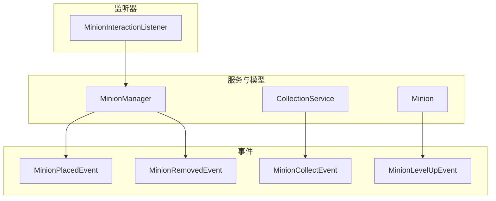
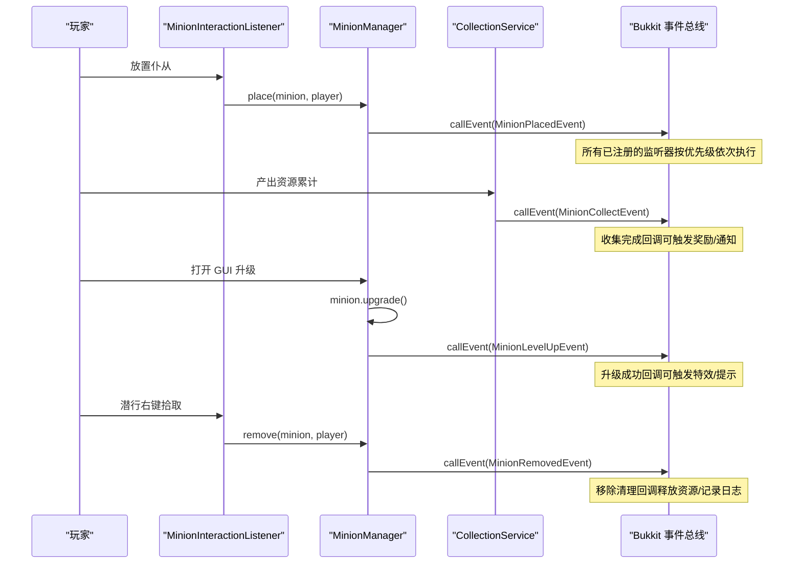
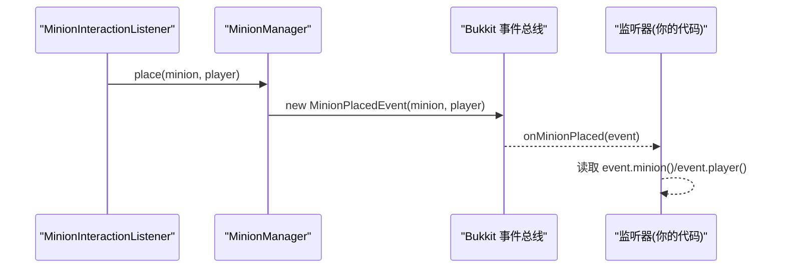
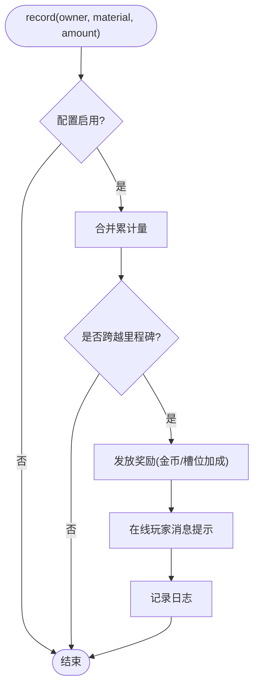
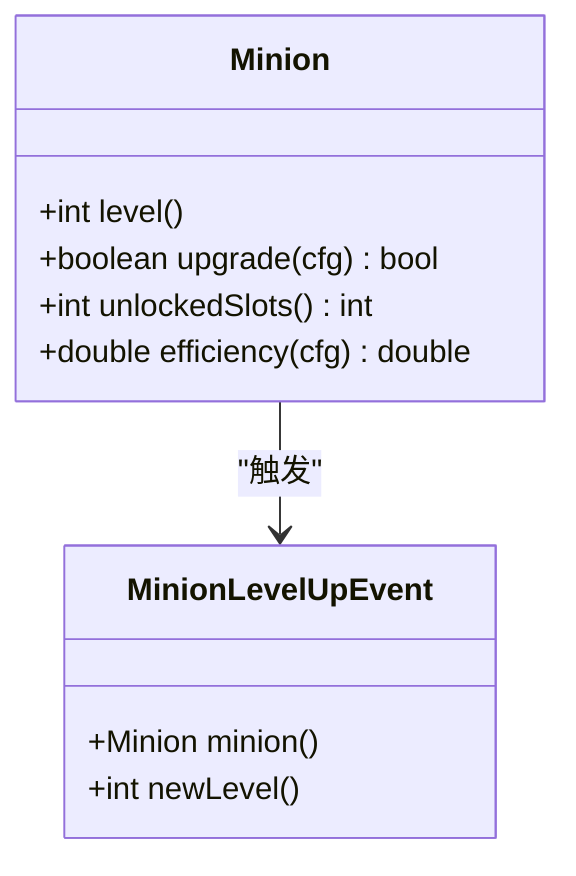
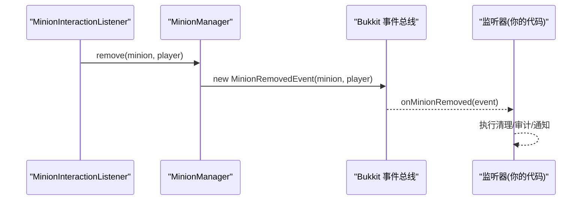
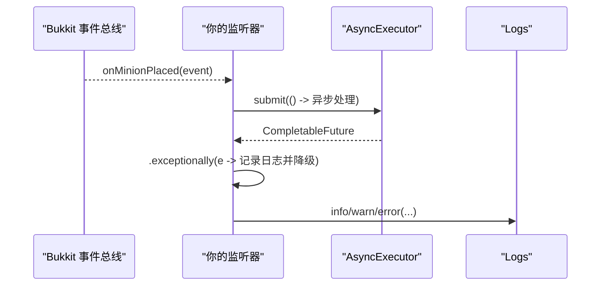
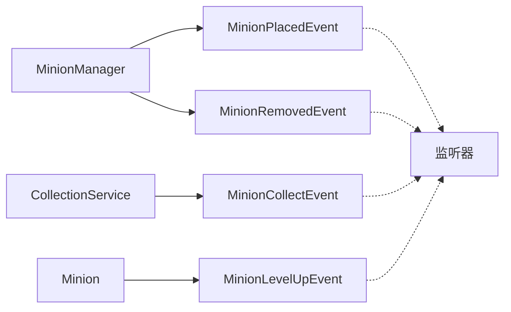

# 事件系统 API

<cite>
**本文引用的文件**
- [MinionPlacedEvent.java](file://src/main/java/com/hcs/minions/event/MinionPlacedEvent.java)
- [MinionCollectEvent.java](file://src/main/java/com/hcs/minions/event/MinionCollectEvent.java)
- [MinionLevelUpEvent.java](file://src/main/java/com/hcs/minions/event/MinionLevelUpEvent.java)
- [MinionRemovedEvent.java](file://src/main/java/com/hcs/minions/event/MinionRemovedEvent.java)
- [MinionManager.java](file://src/main/java/com/hcs/minions/service/MinionManager.java)
- [CollectionService.java](file://src/main/java/com/hcs/minions/service/CollectionService.java)
- [MinionInteractionListener.java](file://src/main/java/com/hcs/minions/listener/MinionInteractionListener.java)
- [Minion.java](file://src/main/java/com/hcs/minions/model/Minion.java)
- [AsyncExecutor.java](file://src/main/java/com/hcs/minions/util/AsyncExecutor.java)
- [Logs.java](file://src/main/java/com/hcs/minions/util/Logs.java)
- [CollectionConfig.java](file://src/main/java/com/hcs/minions/config/CollectionConfig.java)
</cite>

## 目录
1. [简介](#简介)
2. [项目结构](#项目结构)
3. [核心组件](#核心组件)
4. [架构总览](#架构总览)
5. [详细组件分析](#详细组件分析)
6. [依赖关系分析](#依赖关系分析)
7. [性能考量](#性能考量)
8. [故障排查指南](#故障排查指南)
9. [结论](#结论)
10. [附录](#附录)

## 简介
本文件面向插件开发者，系统化说明仆从（Minion）模块的事件系统 API。重点包括：
- 自定义事件的触发时机、携带数据与监听方法
- MinionPlacedEvent（放置）、MinionCollectEvent（收集）、MinionLevelUpEvent（升级）、MinionRemovedEvent（移除）的使用场景与数据结构
- 完整的事件监听器实现示例（含异步处理与异常捕获）
- 事件优先级设置与取消机制
- 事件调试与日志记录最佳实践

## 项目结构
事件系统围绕四个核心事件类展开，由服务层在关键业务节点触发；监听器通过 Bukkit 事件总线订阅并处理。

图表来源
- [MinionManager.java:356-383](file://src/main/java/com/hcs/minions/service/MinionManager.java#L356-L383)
- [CollectionService.java:125-161](file://src/main/java/com/hcs/minions/service/CollectionService.java#L125-L161)
- [Minion.java:279-286](file://src/main/java/com/hcs/minions/model/Minion.java#L279-L286)
- [MinionInteractionListener.java:54-94](file://src/main/java/com/hcs/minions/listener/MinionInteractionListener.java#L54-L94)

章节来源
- [MinionManager.java:356-383](file://src/main/java/com/hcs/minions/service/MinionManager.java#L356-L383)
- [MinionInteractionListener.java:54-94](file://src/main/java/com/hcs/minions/listener/MinionInteractionListener.java#L54-L94)

## 核心组件
- 事件基类：均继承自 Bukkit Event，提供 HandlerList 注册与获取
- 事件载体：封装触发上下文（如 Minion、Player、收集物品列表、新等级等）
- 触发点：MinionManager（放置/移除）、CollectionService（收集里程碑）、Minion（升级）
- 监听器：通过 @EventHandler 订阅事件，执行回调逻辑

章节来源
- [MinionPlacedEvent.java:12-39](file://src/main/java/com/hcs/minions/event/MinionPlacedEvent.java#L12-L39)
- [MinionCollectEvent.java:15-48](file://src/main/java/com/hcs/minions/event/MinionCollectEvent.java#L15-L48)
- [MinionLevelUpEvent.java:11-38](file://src/main/java/com/hcs/minions/event/MinionLevelUpEvent.java#L11-L38)
- [MinionRemovedEvent.java:12-39](file://src/main/java/com/hcs/minions/event/MinionRemovedEvent.java#L12-L39)

## 架构总览
下图展示事件从触发到监听的调用链，以及与服务、模型的交互关系。

图表来源
- [MinionInteractionListener.java:54-94](file://src/main/java/com/hcs/minions/listener/MinionInteractionListener.java#L54-L94)
- [MinionManager.java:356-383](file://src/main/java/com/hcs/minions/service/MinionManager.java#L356-L383)
- [CollectionService.java:125-161](file://src/main/java/com/hcs/minions/service/CollectionService.java#L125-L161)
- [Minion.java:279-286](file://src/main/java/com/hcs/minions/model/Minion.java#L279-L286)

## 详细组件分析

### MinionPlacedEvent（仆从放置事件）
- 触发条件：当玩家成功放置一个仆从时，由 MinionManager.place 触发
- 携带数据：
  - minion：被放置的 Minion 实例
  - player：放置者 Player
- 典型用途：
  - 统计放置次数、记录日志
  - 联动权限或区域校验后的二次确认
  - 发放放置奖励或提示

图表来源
- [MinionManager.java:356-373](file://src/main/java/com/hcs/minions/service/MinionManager.java#L356-L373)
- [MinionPlacedEvent.java:12-39](file://src/main/java/com/hcs/minions/event/MinionPlacedEvent.java#L12-L39)

章节来源
- [MinionPlacedEvent.java:12-39](file://src/main/java/com/hcs/minions/event/MinionPlacedEvent.java#L12-L39)
- [MinionManager.java:356-373](file://src/main/java/com/hcs/minions/service/MinionManager.java#L356-L373)

### MinionCollectEvent（收集事件）
- 触发条件：当 CollectionService.record 累计一次产出并达到里程碑阈值时触发
- 携带数据：
  - minion：关联的仆从（用于定位所有者、类型等）
  - player：拥有者 Player（在线时可发消息）
  - collected：本次收集到的物品列表（ItemStack），可用于统计或额外处理
- 使用场景：
  - 资源收集完成时的回调处理（如发放里程碑奖励、播放音效、发送消息）
  - 结合 EconomyService 进行异步入账（Vault）
  - 更新 UI 或进度面板

图表来源
- [CollectionService.java:125-161](file://src/main/java/com/hcs/minions/service/CollectionService.java#L125-L161)
- [CollectionConfig.java:17-62](file://src/main/java/com/hcs/minions/config/CollectionConfig.java#L17-L62)

章节来源
- [MinionCollectEvent.java:15-48](file://src/main/java/com/hcs/minions/event/MinionCollectEvent.java#L15-L48)
- [CollectionService.java:125-161](file://src/main/java/com/hcs/minions/service/CollectionService.java#L125-L161)
- [CollectionConfig.java:17-62](file://src/main/java/com/hcs/minions/config/CollectionConfig.java#L17-L62)

### MinionLevelUpEvent（升级事件）
- 触发条件：当 Minion.upgrade 成功提升等级后触发
- 携带数据：
  - minion：升级的仆从
  - newLevel：新的等级
- 数据结构要点：
  - 等级变化可通过 newLevel 与 minion.level() 对比得到
  - 属性提升（效率、存储格数、模块槽解锁）可由 Minion 相关方法推导
- 使用场景：
  - 升级特效、提示、成就解锁
  - 根据新等级调整工作半径、冷却时间等策略

图表来源
- [Minion.java:279-286](file://src/main/java/com/hcs/minions/model/Minion.java#L279-L286)
- [MinionLevelUpEvent.java:11-38](file://src/main/java/com/hcs/minions/event/MinionLevelUpEvent.java#L11-L38)

章节来源
- [MinionLevelUpEvent.java:11-38](file://src/main/java/com/hcs/minions/event/MinionLevelUpEvent.java#L11-L38)
- [Minion.java:279-286](file://src/main/java/com/hcs/minions/model/Minion.java#L279-L286)

### MinionRemovedEvent（移除事件）
- 触发条件：当 MinionManager.remove 删除仆从时触发
- 携带数据：
  - minion：被移除的仆从
  - player：操作者 Player
- 清理逻辑与资源释放：
  - 实体销毁（盔甲架）
  - 内存索引清理（byLocation、ownerCount）
  - 持久化删除
  - 事件触发供外部做审计、回收、统计

图表来源
- [MinionManager.java:376-383](file://src/main/java/com/hcs/minions/service/MinionManager.java#L376-L383)
- [MinionRemovedEvent.java:12-39](file://src/main/java/com/hcs/minions/event/MinionRemovedEvent.java#L12-L39)

章节来源
- [MinionRemovedEvent.java:12-39](file://src/main/java/com/hcs/minions/event/MinionRemovedEvent.java#L12-L39)
- [MinionManager.java:376-383](file://src/main/java/com/hcs/minions/service/MinionManager.java#L376-L383)

### 事件监听器实现示例（含异步与异常捕获）
以下示例展示了如何为上述事件编写监听器，包含：
- 事件优先级设置
- 异步任务提交（使用 AsyncExecutor）
- 异常捕获与日志记录（使用 Logs）
- 对在线玩家的提示与离线用户的延迟处理

注意事项
- 主线程/区域线程限制：涉及 Inventory、世界状态的操作必须在对应线程执行；IO、经济加款等可异步
- 异常必须记录并优雅降级，避免吞掉异常导致状态不一致
- 对于可能频繁触发的事件（如收集），注意节流与批量处理

章节来源
- [AsyncExecutor.java:34-67](file://src/main/java/com/hcs/minions/util/AsyncExecutor.java#L34-L67)
- [Logs.java:20-31](file://src/main/java/com/hcs/minions/util/Logs.java#L20-L31)

### 事件优先级与取消机制
- 优先级：监听器可使用 @EventHandler(priority = ...) 控制执行顺序，建议将“前置校验”设为较高优先级，“后置处理”设为较低优先级
- 取消机制：当前事件类未暴露 setCancelled 方法，因此无法通过事件取消业务流程；若需拦截，请在触发前于业务层判断（如权限、区域限制）

章节来源
- [MinionInteractionListener.java:54-94](file://src/main/java/com/hcs/minions/listener/MinionInteractionListener.java#L54-L94)

### 事件调试与日志记录最佳实践
- 统一日志出口：使用 Logs.info/warn/error 输出结构化信息，便于集中检索
- 关键路径打点：在放置、收集、升级、移除等关键节点记录必要上下文（ID、坐标、数量、等级）
- 调试开关：结合配置项控制调试日志频率，避免刷屏
- 异常堆栈：捕获异常时记录完整堆栈，便于定位问题

章节来源
- [Logs.java:20-31](file://src/main/java/com/hcs/minions/util/Logs.java#L20-L31)
- [MinionManager.java:261-304](file://src/main/java/com/hcs/minions/service/MinionManager.java#L261-L304)

## 依赖关系分析
- MinionManager 负责放置/移除流程，并在相应节点触发 MinionPlacedEvent 与 MinionRemovedEvent
- CollectionService 负责资源累计与里程碑判定，并在达成里程碑时触发 MinionCollectEvent
- Minion 在升级成功后触发 MinionLevelUpEvent
- 监听器通过 Bukkit 事件总线订阅以上事件，执行回调逻辑

图表来源
- [MinionManager.java:356-383](file://src/main/java/com/hcs/minions/service/MinionManager.java#L356-L383)
- [CollectionService.java:125-161](file://src/main/java/com/hcs/minions/service/CollectionService.java#L125-L161)
- [Minion.java:279-286](file://src/main/java/com/hcs/minions/model/Minion.java#L279-L286)

章节来源
- [MinionManager.java:356-383](file://src/main/java/com/hcs/minions/service/MinionManager.java#L356-L383)
- [CollectionService.java:125-161](file://src/main/java/com/hcs/minions/service/CollectionService.java#L125-L161)
- [Minion.java:279-286](file://src/main/java/com/hcs/minions/model/Minion.java#L279-L286)

## 性能考量
- 事件触发频率：收集事件可能在高频产出时触发，建议在监听器中做节流或批量处理
- 异步边界：仅 IO、经济加款等允许离主线程的任务走异步；涉及 Inventory、世界状态的操作必须在主线程/区域线程
- 日志开销：生产环境关闭冗余调试日志，保留关键错误与告警
- 并发安全：CollectionService 使用并发容器与原子操作保证并发正确性

[本节为通用指导，不直接分析具体文件]

## 故障排查指南
常见问题与建议
- 事件未触发：检查是否在正确位置触发（MinionManager/CollectionService/Minion），并确保监听器已注册
- 异步异常：查看 AsyncExecutor 中的异常捕获与 Logs 输出，定位失败原因
- 性能问题：减少同步阻塞操作，避免在主线程执行耗时任务
- 数据不一致：确保 Inventory 访问在正确的线程；使用快照落库机制避免中间态

章节来源
- [AsyncExecutor.java:34-67](file://src/main/java/com/hcs/minions/util/AsyncExecutor.java#L34-L67)
- [Logs.java:20-31](file://src/main/java/com/hcs/minions/util/Logs.java#L20-L31)

## 结论
本事件系统以清晰的分层设计实现了仆从模块的核心生命周期事件。通过 MinionPlacedEvent、MinionCollectEvent、MinionLevelUpEvent、MinionRemovedEvent，插件可以灵活扩展功能，如奖励、通知、统计与清理。遵循异步边界、异常捕获与日志规范，可显著提升稳定性与可维护性。

[本节为总结，不直接分析具体文件]

## 附录
- 事件类参考路径
  - [MinionPlacedEvent.java](file://src/main/java/com/hcs/minions/event/MinionPlacedEvent.java)
  - [MinionCollectEvent.java](file://src/main/java/com/hcs/minions/event/MinionCollectEvent.java)
  - [MinionLevelUpEvent.java](file://src/main/java/com/hcs/minions/event/MinionLevelUpEvent.java)
  - [MinionRemovedEvent.java](file://src/main/java/com/hcs/minions/event/MinionRemovedEvent.java)
- 触发点参考路径
  - [MinionManager.java](file://src/main/java/com/hcs/minions/service/MinionManager.java)
  - [CollectionService.java](file://src/main/java/com/hcs/minions/service/CollectionService.java)
  - [Minion.java](file://src/main/java/com/hcs/minions/model/Minion.java)
- 工具与配置参考路径
  - [AsyncExecutor.java](file://src/main/java/com/hcs/minions/util/AsyncExecutor.java)
  - [Logs.java](file://src/main/java/com/hcs/minions/util/Logs.java)
  - [CollectionConfig.java](file://src/main/java/com/hcs/minions/config/CollectionConfig.java)