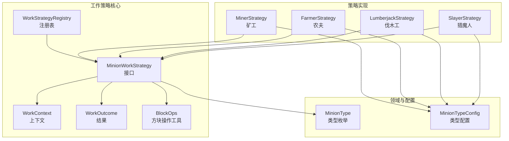
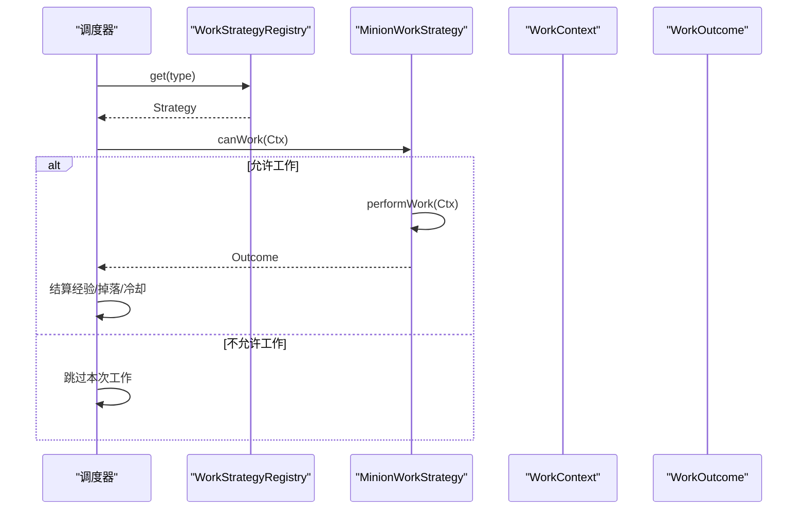
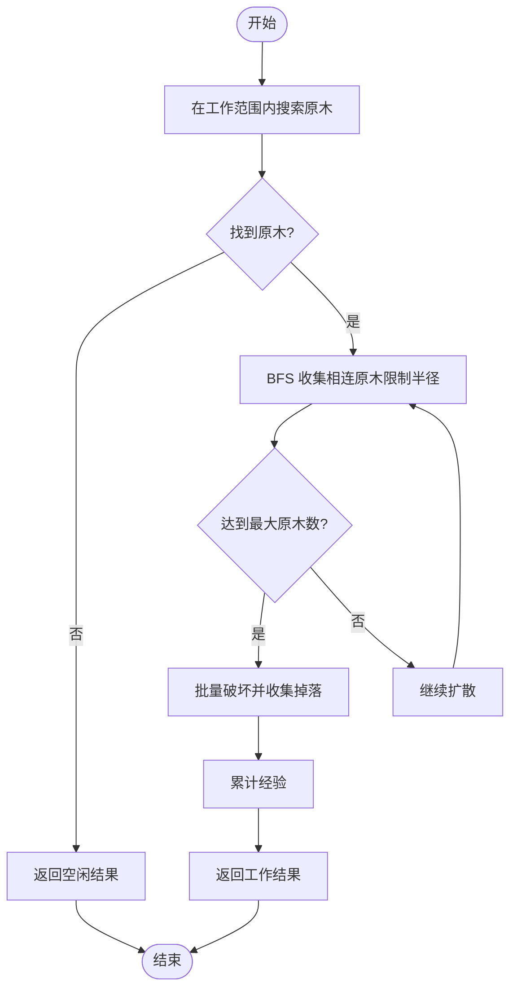
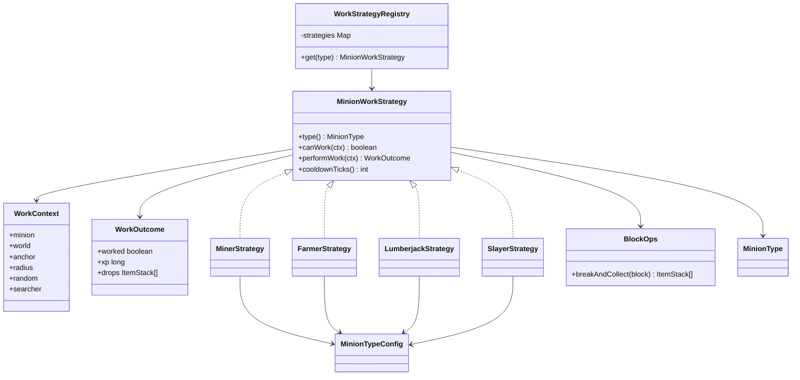

# 工作策略 API

<cite>
**本文引用的文件**
- [MinionWorkStrategy.java](file://src/main/java/com/hcs/minions/work/MinionWorkStrategy.java)
- [WorkContext.java](file://src/main/java/com/hcs/minions/work/WorkContext.java)
- [WorkOutcome.java](file://src/main/java/com/hcs/minions/work/WorkOutcome.java)
- [WorkStrategyRegistry.java](file://src/main/java/com/hcs/minions/work/WorkStrategyRegistry.java)
- [MinerStrategy.java](file://src/main/java/com/hcs/minions/work/miner/MinerStrategy.java)
- [FarmerStrategy.java](file://src/main/java/com/hcs/minions/work/farmer/FarmerStrategy.java)
- [LumberjackStrategy.java](file://src/main/java/com/hcs/minions/work/lumberjack/LumberjackStrategy.java)
- [SlayerStrategy.java](file://src/main/java/com/hcs/minions/work/slayer/SlayerStrategy.java)
- [BlockOps.java](file://src/main/java/com/hcs/minions/work/BlockOps.java)
- [MinionType.java](file://src/main/java/com/hcs/minions/model/MinionType.java)
- [MinionTypeConfig.java](file://src/main/java/com/hcs/minions/config/MinionTypeConfig.java)
</cite>

## 目录
1. [简介](#简介)
2. [项目结构](#项目结构)
3. [核心组件](#核心组件)
4. [架构总览](#架构总览)
5. [详细组件分析](#详细组件分析)
6. [依赖关系分析](#依赖关系分析)
7. [性能考量](#性能考量)
8. [故障排查指南](#故障排查指南)
9. [结论](#结论)
10. [附录](#附录)

## 简介
本文件面向“仆从工作策略”API，系统性说明 MinionWorkStrategy 接口的设计模式与实现要求，详解 WorkContext 上下文对象、WorkOutcome 结果对象，以及 WorkStrategyRegistry 的注册与查找机制。并通过矿工、农夫、伐木工、猎魔人等具体策略实现，展示不同类型仆从的工作模式与最佳实践。最后给出性能优化建议与常见问题排查指引。

## 项目结构
工作策略相关代码集中在 work 包及其子包中：
- 接口与基础类型：MinionWorkStrategy、WorkContext、WorkOutcome、WorkStrategyRegistry、BlockOps
- 策略实现：miner、farmer、lumberjack、slayer 等子包下的具体策略类
- 领域模型与配置：MinionType（枚举）、MinionTypeConfig（类型配置）

图表来源
- [MinionWorkStrategy.java:10-25](file://src/main/java/com/hcs/minions/work/MinionWorkStrategy.java#L10-L25)
- [WorkContext.java:13-20](file://src/main/java/com/hcs/minions/work/WorkContext.java#L13-L20)
- [WorkOutcome.java:14-20](file://src/main/java/com/hcs/minions/work/WorkOutcome.java#L14-L20)
- [WorkStrategyRegistry.java:14-32](file://src/main/java/com/hcs/minions/work/WorkStrategyRegistry.java#L14-L32)
- [MinerStrategy.java:18-55](file://src/main/java/com/hcs/minions/work/miner/MinerStrategy.java#L18-L55)
- [FarmerStrategy.java:20-69](file://src/main/java/com/hcs/minions/work/farmer/FarmerStrategy.java#L20-L69)
- [LumberjackStrategy.java:24-109](file://src/main/java/com/hcs/minions/work/lumberjack/LumberjackStrategy.java#L24-L109)
- [SlayerStrategy.java:16-49](file://src/main/java/com/hcs/minions/work/slayer/SlayerStrategy.java#L16-L49)
- [MinionType.java:13-20](file://src/main/java/com/hcs/minions/model/MinionType.java#L13-L20)
- [MinionTypeConfig.java:21-37](file://src/main/java/com/hcs/minions/config/MinionTypeConfig.java#L21-L37)

章节来源
- [MinionWorkStrategy.java:10-25](file://src/main/java/com/hcs/minions/work/MinionWorkStrategy.java#L10-L25)
- [WorkContext.java:13-20](file://src/main/java/com/hcs/minions/work/WorkContext.java#L13-L20)
- [WorkOutcome.java:14-20](file://src/main/java/com/hcs/minions/work/WorkOutcome.java#L14-L20)
- [WorkStrategyRegistry.java:14-32](file://src/main/java/com/hcs/minions/work/WorkStrategyRegistry.java#L14-L32)
- [MinionType.java:13-20](file://src/main/java/com/hcs/minions/model/MinionType.java#L13-L20)
- [MinionTypeConfig.java:21-37](file://src/main/java/com/hcs/minions/config/MinionTypeConfig.java#L21-L37)

## 核心组件
- MinionWorkStrategy：定义策略模式的核心方法 type()、canWork()、performWork()、cooldownTicks()。调度器仅面向该接口编程，禁止 if-else 堆砌类型判断。
- WorkContext：单次工作周期的不可变上下文，包含仆从、世界、锚点、半径、随机数、搜索器等。
- WorkOutcome：一次策略执行的结果，包含是否工作、经验值、掉落物列表；提供 IDLE 常量表示空闲。
- WorkStrategyRegistry：类型到策略的只读映射，构造时收集所有策略并对外暴露 get(type) 查找。
- BlockOps：方块破坏与掉落采集的工具，确保物理更新以支持刷石机等机制。
- MinionType / MinionTypeConfig：类型枚举与各类型的强类型配置（目标方块集合、冷却时间、稀有掉落等）。

章节来源
- [MinionWorkStrategy.java:10-25](file://src/main/java/com/hcs/minions/work/MinionWorkStrategy.java#L10-L25)
- [WorkContext.java:13-20](file://src/main/java/com/hcs/minions/work/WorkContext.java#L13-L20)
- [WorkOutcome.java:14-20](file://src/main/java/com/hcs/minions/work/WorkOutcome.java#L14-L20)
- [WorkStrategyRegistry.java:14-32](file://src/main/java/com/hcs/minions/work/WorkStrategyRegistry.java#L14-L32)
- [BlockOps.java:20-39](file://src/main/java/com/hcs/minions/work/BlockOps.java#L20-L39)
- [MinionType.java:13-20](file://src/main/java/com/hcs/minions/model/MinionType.java#L13-L20)
- [MinionTypeConfig.java:21-37](file://src/main/java/com/hcs/minions/config/MinionTypeConfig.java#L21-L37)

## 架构总览
工作策略采用“策略模式 + 注册表”解耦调度与实现：
- 调度器通过 WorkStrategyRegistry.get(type) 获取对应策略实例。
- 对每个周期调用 canWork(ctx) 判定是否允许工作。
- 若允许则调用 performWork(ctx) 执行一次限流搜索与破坏，返回 WorkOutcome。
- 根据 cooldownTicks() 控制两次工作之间的基础冷却。

图表来源
- [WorkStrategyRegistry.java:18-32](file://src/main/java/com/hcs/minions/work/WorkStrategyRegistry.java#L18-L32)
- [MinionWorkStrategy.java:12-25](file://src/main/java/com/hcs/minions/work/MinionWorkStrategy.java#L12-L25)
- [WorkContext.java:13-20](file://src/main/java/com/hcs/minions/work/WorkContext.java#L13-L20)
- [WorkOutcome.java:14-20](file://src/main/java/com/hcs/minions/work/WorkOutcome.java#L14-L20)

## 详细组件分析

### MinionWorkStrategy 接口设计
- type()：声明该策略服务的仆从类型，用于注册表键匹配。
- canWork(WorkContext ctx)：当前周期是否允许工作。注意燃料与环境由 Manager 统一判断，此处侧重类型语义。
- performWork(WorkContext ctx)：执行一次限流搜索+破坏，必须在主线程/区域线程调用（内部含方块 setType 等操作）。
- cooldownTicks()：两次工作之间的基础冷却 tick。

实现要点
- 保持无副作用或最小副作用，避免在 canWork 中修改世界状态。
- performWork 应使用 WorkContext.searcher 进行范围搜索，并使用 BlockOps.breakAndCollect 安全破坏与收集掉落。
- 返回 WorkOutcome.IDLE 表示本次无目标，调度器不推进冷却/不扣燃料。

章节来源
- [MinionWorkStrategy.java:12-25](file://src/main/java/com/hcs/minions/work/MinionWorkStrategy.java#L12-L25)
- [BlockOps.java:20-39](file://src/main/java/com/hcs/minions/work/BlockOps.java#L20-L39)

### WorkContext 上下文对象
- minion：当前仆从实体引用。
- world：所在世界。
- anchor：锚点方块（通常为仆从放置位置），作为搜索中心。
- radius：工作半径。
- random：随机数源，供策略内随机选择掉落或数量时使用。
- searcher：方块搜索器，按谓词在工作范围内查找目标。

使用建议
- 策略不应反向持有 Manager 或插件主类，仅通过 WorkContext 访问必要信息。
- 使用 searcher.find(world, anchor, radius, predicate, minion) 进行高效范围查询。

章节来源
- [WorkContext.java:13-20](file://src/main/java/com/hcs/minions/work/WorkContext.java#L13-L20)

### WorkOutcome 结果对象
- worked：是否实际工作。false 表示本次无目标，调度器据此不推进冷却/不扣燃料。
- xp：本次获得的经验（由 Manager 统一结算升级）。
- drops：采集到的掉落物列表（ItemStack 为本次创建、尚未进入虚拟背包，移交时需深拷贝）。
- IDLE：静态常量，表示空闲结果。

处理建议
- 将 drops 列表视为只读，交由上层统一处理入库或分发。
- 计算经验时可基于掉落数量或固定规则，参考各策略实现。

章节来源
- [WorkOutcome.java:14-20](file://src/main/java/com/hcs/minions/work/WorkOutcome.java#L14-L20)

### WorkStrategyRegistry 注册机制与查找逻辑
- 构造时接收所有 MinionWorkStrategy 实例，构建 EnumMap<MinionType, MinionWorkStrategy> 只读映射。
- get(type) 若未找到对应策略，抛出 IllegalStateException，提示“未注册的仆从类型”。
- 新增类型只需实现策略并在构造时注册，符合开闭原则。

章节来源
- [WorkStrategyRegistry.java:14-32](file://src/main/java/com/hcs/minions/work/WorkStrategyRegistry.java#L14-L32)

### 策略实现示例

#### 矿工策略（MinerStrategy）
- 行为：在工作范围内搜索可采矿块，破坏并采集掉落，经验基于掉落数量。
- 关键点：使用 BlockOps.breakAndCollect 保证物理更新，便于刷石机等工作面刷新。
- 冷却：来自 MinionTypeConfig.cooldownTicks()。

章节来源
- [MinerStrategy.java:18-55](file://src/main/java/com/hcs/minions/work/miner/MinerStrategy.java#L18-L55)
- [BlockOps.java:20-39](file://src/main/java/com/hcs/minions/work/BlockOps.java#L20-L39)
- [MinionTypeConfig.java:21-37](file://src/main/java/com/hcs/minions/config/MinionTypeConfig.java#L21-L37)

#### 农夫策略（FarmerStrategy）
- 行为：只收割成熟作物，收割后原地补种（设置回原类型）。
- 关键点：通过 Ageable 数据判断成熟度；targets 限定可收割作物类型。
- 冷却：来自 MinionTypeConfig.cooldownTicks()。

章节来源
- [FarmerStrategy.java:20-69](file://src/main/java/com/hcs/minions/work/farmer/FarmerStrategy.java#L20-L69)
- [MinionTypeConfig.java:21-37](file://src/main/java/com/hcs/minions/config/MinionTypeConfig.java#L21-L37)

#### 伐木工策略（LumberjackStrategy）
- 行为：找到一根原木后，用 BFS 收集相连原木（整树），一次性砍光。
- 关键点：BFS 限制在工作半径内，避免“虚空砍视野外木头”；最大原木数限制防止极端情况。
- 冷却：来自 MinionTypeConfig.cooldownTicks()。

章节来源
- [LumberjackStrategy.java:24-109](file://src/main/java/com/hcs/minions/work/lumberjack/LumberjackStrategy.java#L24-L109)
- [MinionTypeConfig.java:21-37](file://src/main/java/com/hcs/minions/config/MinionTypeConfig.java#L21-L37)

#### 猎魔人策略（SlayerStrategy）
- 行为：模拟击杀怪物，产出随机掉落（不生成实体，避免刷怪负担）。
- 关键点：使用 WorkContext.random 随机选择掉落种类与数量。
- 冷却：来自 MinionTypeConfig.cooldownTicks()。

章节来源
- [SlayerStrategy.java:16-49](file://src/main/java/com/hcs/minions/work/slayer/SlayerStrategy.java#L16-L49)
- [MinionTypeConfig.java:21-37](file://src/main/java/com/hcs/minions/config/MinionTypeConfig.java#L21-L37)

#### 复杂逻辑流程图（伐木工整树采集）

图表来源
- [LumberjackStrategy.java:45-103](file://src/main/java/com/hcs/minions/work/lumberjack/LumberjackStrategy.java#L45-L103)

## 依赖关系分析
- 策略依赖 WorkContext 提供的世界、锚点、半径、随机数与搜索器。
- 策略通过 BlockOps 进行安全的方块破坏与掉落收集。
- 策略读取 MinionTypeConfig 中的 targets、cooldownTicks 等配置。
- 调度器通过 WorkStrategyRegistry 按 MinionType 查表获取策略。

图表来源
- [MinionWorkStrategy.java:12-25](file://src/main/java/com/hcs/minions/work/MinionWorkStrategy.java#L12-L25)
- [WorkContext.java:13-20](file://src/main/java/com/hcs/minions/work/WorkContext.java#L13-L20)
- [WorkOutcome.java:14-20](file://src/main/java/com/hcs/minions/work/WorkOutcome.java#L14-L20)
- [WorkStrategyRegistry.java:14-32](file://src/main/java/com/hcs/minions/work/WorkStrategyRegistry.java#L14-L32)
- [MinerStrategy.java:18-55](file://src/main/java/com/hcs/minions/work/miner/MinerStrategy.java#L18-L55)
- [FarmerStrategy.java:20-69](file://src/main/java/com/hcs/minions/work/farmer/FarmerStrategy.java#L20-L69)
- [LumberjackStrategy.java:24-109](file://src/main/java/com/hcs/minions/work/lumberjack/LumberjackStrategy.java#L24-L109)
- [SlayerStrategy.java:16-49](file://src/main/java/com/hcs/minions/work/slayer/SlayerStrategy.java#L16-L49)
- [BlockOps.java:20-39](file://src/main/java/com/hcs/minions/work/BlockOps.java#L20-L39)
- [MinionType.java:13-20](file://src/main/java/com/hcs/minions/model/MinionType.java#L13-L20)
- [MinionTypeConfig.java:21-37](file://src/main/java/com/hcs/minions/config/MinionTypeConfig.java#L21-L37)

章节来源
- [MinionWorkStrategy.java:12-25](file://src/main/java/com/hcs/minions/work/MinionWorkStrategy.java#L12-L25)
- [WorkStrategyRegistry.java:14-32](file://src/main/java/com/hcs/minions/work/WorkStrategyRegistry.java#L14-L32)

## 性能考量
- 使用 WorkContext.searcher 进行范围搜索，避免全图遍历。
- 使用 BlockOps.breakAndCollect 确保物理更新，减少因状态不一致导致的重复计算。
- 伐木工策略限制 BFS 范围与最大原木数，防止极端场景的性能退化。
- 策略内尽量使用本地缓存与轻量数据结构，避免频繁对象分配。
- 冷却时间由配置驱动，合理设置 cooldownTicks 可降低调度频率。

[本节为通用指导，无需特定文件来源]

## 故障排查指南
- 未注册类型异常：当 WorkStrategyRegistry.get(type) 找不到策略时会抛出异常，需检查构造时是否注册了对应策略。
- 无目标导致空闲：performWork 返回 WorkOutcome.IDLE 时，调度器不会推进冷却或消耗燃料，确认搜索谓词是否正确。
- 刷石机卡死：确保使用 BlockOps.breakAndCollect（applyPhysics=true），否则可能抑制邻居更新导致机制失效。
- 范围越界问题：伐木工策略已限制 BFS 范围，如自定义策略需自行约束工作半径。

章节来源
- [WorkStrategyRegistry.java:26-32](file://src/main/java/com/hcs/minions/work/WorkStrategyRegistry.java#L26-L32)
- [WorkOutcome.java:14-20](file://src/main/java/com/hcs/minions/work/WorkOutcome.java#L14-L20)
- [BlockOps.java:20-39](file://src/main/java/com/hcs/minions/work/BlockOps.java#L20-L39)
- [LumberjackStrategy.java:55-103](file://src/main/java/com/hcs/minions/work/lumberjack/LumberjackStrategy.java#L55-L103)

## 结论
工作策略 API 通过清晰的接口与上下文抽象，实现了可扩展、可维护的仆从工作体系。策略模式配合注册表消除了硬编码分支，WorkContext 与 WorkOutcome 明确了数据边界与职责划分。结合 BlockOps 与配置系统，能够稳定支撑多种工作场景。遵循本文的最佳实践与性能建议，可进一步提升稳定性与效率。

[本节为总结性内容，无需特定文件来源]

## 附录
- 类型枚举 MinionType 定义了支持的仆从类型（矿工、农夫、伐木工、钓鱼郎、猎魔人、牧民、圆石匠）。
- 类型配置 MinionTypeConfig 提供 targets、cooldownTicks、baseRadius、rareDrop 等关键参数，策略据此决定行为与节奏。

章节来源
- [MinionType.java:13-20](file://src/main/java/com/hcs/minions/model/MinionType.java#L13-L20)
- [MinionTypeConfig.java:21-37](file://src/main/java/com/hcs/minions/config/MinionTypeConfig.java#L21-L37)