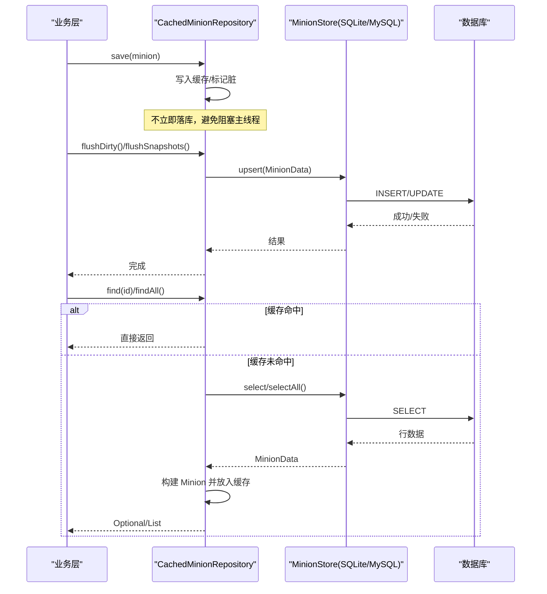
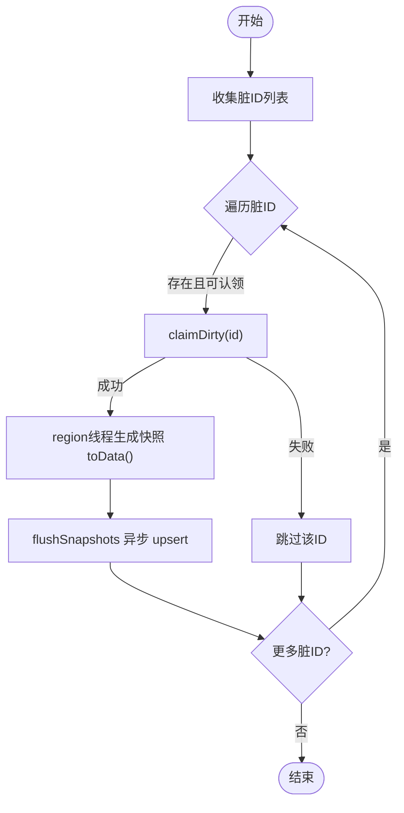
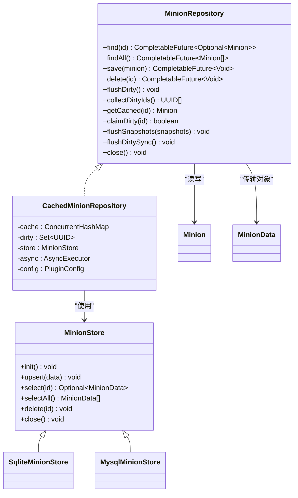

# 数据访问 API

<cite>
**本文引用的文件**
- [MinionRepository.java](file://src/main/java/com/hcs/minions/repository/MinionRepository.java)
- [MinionStore.java](file://src/main/java/com/hcs/minions/repository/MinionStore.java)
- [CachedMinionRepository.java](file://src/main/java/com/hcs/minions/repository/CachedMinionRepository.java)
- [RepositoryFactory.java](file://src/main/java/com/hcs/minions/repository/RepositoryFactory.java)
- [SqliteMinionStore.java](file://src/main/java/com/hcs/minions/repository/sqlite/SqliteMinionStore.java)
- [MysqlMinionStore.java](file://src/main/java/com/hcs/minions/repository/mysql/MysqlMinionStore.java)
- [MinionData.java](file://src/main/java/com/hcs/minions/model/MinionData.java)
- [Minion.java](file://src/main/java/com/hcs/minions/model/Minion.java)
- [DatabaseConfig.java](file://src/main/java/com/hcs/minions/config/DatabaseConfig.java)
</cite>

## 目录
1. [简介](#简介)
2. [项目结构](#项目结构)
3. [核心组件](#核心组件)
4. [架构总览](#架构总览)
5. [详细组件分析](#详细组件分析)
6. [依赖关系分析](#依赖关系分析)
7. [性能考量](#性能考量)
8. [故障排查指南](#故障排查指南)
9. [结论](#结论)
10. [附录：数据库配置与迁移](#附录数据库配置与迁移)

## 简介
本文件面向插件的数据访问层，聚焦 MinionRepository 接口及其实现、工厂装配、缓存策略、数据模型与序列化、以及 SQLite/MySQL 后端差异。目标是帮助开发者在不感知 IO 细节的前提下，完成仆从（Minion）数据的增删改查、批量落库、事务与错误处理，并理解版本兼容与迁移要点。

## 项目结构
数据访问层采用“接口 + 工厂 + 缓存装饰器 + 具体存储”的分层设计：
- 接口层：MinionRepository（对外）、MinionStore（对内阻塞式存储）
- 缓存层：CachedMinionRepository（内存缓存、脏标记、异步落库）
- 工厂层：RepositoryFactory（按配置选择 SQLite 或 MySQL）
- 存储实现：SqliteMinionStore、MysqlMinionStore
- 数据模型：Minion（运行时对象）、MinionData（持久化快照）

```mermaid
graph TB
Client["业务调用方"] --> Repo["MinionRepository<br/>CachedMinionRepository"]
Repo --> Store["MinionStore<br/>SqliteMinionStore / MysqlMinionStore"]
Factory["RepositoryFactory"] --> Repo
Factory --> Store
Model["Minion / MinionData"] < --> Repo
```

图表来源
- [MinionRepository.java:16-46](file://src/main/java/com/hcs/minions/repository/MinionRepository.java#L16-L46)
- [CachedMinionRepository.java:29-42](file://src/main/java/com/hcs/minions/repository/CachedMinionRepository.java#L29-L42)
- [MinionStore.java:13-26](file://src/main/java/com/hcs/minions/repository/MinionStore.java#L13-L26)
- [RepositoryFactory.java:20-29](file://src/main/java/com/hcs/minions/repository/RepositoryFactory.java#L20-L29)

章节来源
- [MinionRepository.java:16-46](file://src/main/java/com/hcs/minions/repository/MinionRepository.java#L16-L46)
- [MinionStore.java:13-26](file://src/main/java/com/hcs/minions/repository/MinionStore.java#L13-L26)
- [RepositoryFactory.java:20-29](file://src/main/java/com/hcs/minions/repository/RepositoryFactory.java#L20-L29)

## 核心组件
- MinionRepository：定义 find、findAll、save、delete、flushDirty、collectDirtyIds、getCached、claimDirty、flushSnapshots、flushDirtySync、close 等能力，统一对外暴露异步/同步落库入口。
- MinionStore：底层存储抽象，提供 init、upsert、select、selectAll、delete、close。
- CachedMinionRepository：基于 ConcurrentHashMap 的内存缓存与脏集合，结合 AsyncExecutor 将 SQL 操作虚拟化线程执行；两阶段落库保证 Inventory 线程安全。
- RepositoryFactory：根据 DatabaseConfig 选择 SqliteMinionStore 或 MysqlMinionStore，并包装为带缓存的实现返回。
- Minion 与 MinionData：前者是运行时对象（含 Inventory），后者是纯数据记录（便于 SQL 映射）。两者通过 toData/fromData 互相转换。

章节来源
- [MinionRepository.java:16-46](file://src/main/java/com/hcs/minions/repository/MinionRepository.java#L16-L46)
- [MinionStore.java:13-26](file://src/main/java/com/hcs/minions/repository/MinionStore.java#L13-L26)
- [CachedMinionRepository.java:29-215](file://src/main/java/com/hcs/minions/repository/CachedMinionRepository.java#L29-L215)
- [RepositoryFactory.java:20-29](file://src/main/java/com/hcs/minions/repository/RepositoryFactory.java#L20-L29)
- [MinionData.java:11-28](file://src/main/java/com/hcs/minions/model/MinionData.java#L11-L28)
- [Minion.java:718-743](file://src/main/java/com/hcs/minions/model/Minion.java#L718-L743)

## 架构总览
数据流遵循“读优先走缓存、写先入缓存+脏标记、定时/事件触发批量异步落库”的模式。工厂负责装配不同后端，业务层仅依赖 MinionRepository。



图表来源
- [CachedMinionRepository.java:44-87](file://src/main/java/com/hcs/minions/repository/CachedMinionRepository.java#L44-L87)
- [CachedMinionRepository.java:134-153](file://src/main/java/com/hcs/minions/repository/CachedMinionRepository.java#L134-L153)
- [MinionStore.java:15-23](file://src/main/java/com/hcs/minions/repository/MinionStore.java#L15-L23)

## 详细组件分析

### MinionRepository 接口与 CRUD
- find(UUID): 异步返回 Optional<Minion>，优先命中缓存，否则回源查询并回填缓存。
- findAll(): 异步返回 List<Minion>，若缓存为空则全量加载并填充缓存。
- save(Minion): 将对象写入缓存并标记脏，实际落库由 flushDirty/flushSnapshots 异步批量执行。
- delete(UUID): 移除缓存并异步删除底层数据。
- flushDirty()/flushDirtySync(): 收集脏数据并落库；同步版用于关闭路径。
- collectDirtyIds()/claimDirty(): 两阶段落库中的“认领”机制，确保同一 ID 不被重复落库。
- getCached(UUID): 供 region 线程生成快照时读取当前状态。
- flushSnapshots(List<MinionData>): 接收已生成的快照并异步批量 upsert。

使用场景建议
- 高频读取：优先依赖缓存，减少数据库压力。
- 变更写入：调用 save 后交由调度器周期性 flush，或在关闭时 flushDirtySync。
- 删除：调用 delete 后立即失效缓存，避免脏读。

章节来源
- [MinionRepository.java:16-46](file://src/main/java/com/hcs/minions/repository/MinionRepository.java#L16-L46)
- [CachedMinionRepository.java:44-87](file://src/main/java/com/hcs/minions/repository/CachedMinionRepository.java#L44-L87)
- [CachedMinionRepository.java:100-171](file://src/main/java/com/hcs/minions/repository/CachedMinionRepository.java#L100-L171)
- [CachedMinionRepository.java:190-213](file://src/main/java/com/hcs/minions/repository/CachedMinionRepository.java#L190-L213)

### RepositoryFactory 工厂模式与数据源切换
- 依据 DatabaseConfig.type 判断 sqlite 或 mysql。
- 创建对应 MinionStore 实例并初始化。
- 将底层存储封装为 CachedMinionRepository 返回，业务层对后端无感知。

配置项说明
- type: "sqlite" 或其他值（如 mysql）
- sqliteFile: SQLite 文件路径
- host/port/database/user/password/poolSize: MySQL 连接参数

章节来源
- [RepositoryFactory.java:20-29](file://src/main/java/com/hcs/minions/repository/RepositoryFactory.java#L20-L29)
- [DatabaseConfig.java:6-19](file://src/main/java/com/hcs/minions/config/DatabaseConfig.java#L6-L19)

### CachedMinionRepository 缓存与并发策略
- 缓存：ConcurrentHashMap<UUID, Minion>，O(1) 平均查找。
- 脏集合：ConcurrentHashMap.newKeySet()，驱动批量落库。
- 异步执行：所有阻塞 SQL 通过 AsyncExecutor（虚拟线程）提交，主线程零阻塞。
- 两阶段落库：
  - 阶段一：collectDirtyIds 收集脏 ID（任意线程安全，不触碰 Inventory）。
  - 阶段二：在 region 线程生成快照（toData），再调用 flushSnapshots 异步 upsert。
- 认领机制：claimDirty 使用 CAS 防止重复落库。
- 关闭流程：flushDirtySync 同步冲刷后再关闭底层存储，避免丢数据。



图表来源
- [CachedMinionRepository.java:100-171](file://src/main/java/com/hcs/minions/repository/CachedMinionRepository.java#L100-L171)

章节来源
- [CachedMinionRepository.java:29-215](file://src/main/java/com/hcs/minions/repository/CachedMinionRepository.java#L29-L215)

### MinionData 数据模型与序列化
- MinionData：包含 id、owner、type、level、xp、world、坐标、燃料、最后活跃时间、islandId、升级槽位、皮肤、inventory（字节数组）等字段，全部为原始类型，便于 SQL 映射。
- 序列化：Minion.toData() 将运行时对象转换为 MinionData；Minion.fromData() 反序列化为运行时对象，其中 inventory 通过 ItemCodec 进行序列化/反序列化。

章节来源
- [MinionData.java:11-28](file://src/main/java/com/hcs/minions/model/MinionData.java#L11-L28)
- [Minion.java:718-743](file://src/main/java/com/hcs/minions/model/Minion.java#L718-L743)

### SQLite 与 MySQL 后端差异与配置
- 选择机制：RepositoryFactory 根据 DatabaseConfig.type 决定使用 SqliteMinionStore 或 MysqlMinionStore。
- SQLite：适合单机/小体量部署，配置文件指定 sqliteFile。
- MySQL：适合多节点共享数据，需配置 host、port、database、user、password、poolSize。
- 共同点：均实现 MinionStore 接口，提供 init/upsert/select/selectAll/delete/close。

章节来源
- [RepositoryFactory.java:20-29](file://src/main/java/com/hcs/minions/repository/RepositoryFactory.java#L20-L29)
- [DatabaseConfig.java:6-19](file://src/main/java/com/hcs/minions/config/DatabaseConfig.java#L6-L19)
- [SqliteMinionStore.java](file://src/main/java/com/hcs/minions/repository/sqlite/SqliteMinionStore.java)
- [MysqlMinionStore.java](file://src/main/java/com/hcs/minions/repository/mysql/MysqlMinionStore.java)

## 依赖关系分析
- 业务层仅依赖 MinionRepository，屏蔽了缓存与后端细节。
- CachedMinionRepository 依赖 MinionStore、AsyncExecutor、PluginConfig。
- MinionStore 被 SQLite/MySQL 具体实现，提供一致的阻塞式操作。
- Minion 与 MinionData 双向转换，构成运行时与持久化的桥梁。



图表来源
- [MinionRepository.java:16-46](file://src/main/java/com/hcs/minions/repository/MinionRepository.java#L16-L46)
- [CachedMinionRepository.java:29-42](file://src/main/java/com/hcs/minions/repository/CachedMinionRepository.java#L29-L42)
- [MinionStore.java:13-26](file://src/main/java/com/hcs/minions/repository/MinionStore.java#L13-L26)
- [SqliteMinionStore.java](file://src/main/java/com/hcs/minions/repository/sqlite/SqliteMinionStore.java)
- [MysqlMinionStore.java](file://src/main/java/com/hcs/minions/repository/mysql/MysqlMinionStore.java)
- [Minion.java:718-743](file://src/main/java/com/hcs/minions/model/Minion.java#L718-L743)
- [MinionData.java:11-28](file://src/main/java/com/hcs/minions/model/MinionData.java#L11-L28)

## 性能考量
- 读路径优化：缓存命中直接返回，避免数据库往返。
- 写路径优化：save 仅更新内存与脏标记，批量异步 upsert，降低主线程延迟。
- 并发安全：ConcurrentHashMap 与原子标记，配合 claimDirty 避免重复落库。
- I/O 隔离：所有阻塞 SQL 通过虚拟线程执行，主线程零阻塞。
- 关闭保障：onDisable 前同步冲刷，确保数据不丢失。

[本节为通用性能指导，无需特定文件引用]

## 故障排查指南
- 落库失败重试：flushSnapshots 捕获异常后将对应 ID 重新置脏，等待下次调度重试。
- 关闭期异常：flushDirtySync 捕获异常并记录日志，确保资源释放。
- 线程安全：确保 Inventory 访问仅在 region 线程进行，通过两阶段落库规避竞态。
- 常见问题定位：检查 AsyncExecutor 是否可用、数据库连接是否正常、脏集合是否被正确清理。

章节来源
- [CachedMinionRepository.java:134-153](file://src/main/java/com/hcs/minions/repository/CachedMinionRepository.java#L134-L153)
- [CachedMinionRepository.java:190-213](file://src/main/java/com/hcs/minions/repository/CachedMinionRepository.java#L190-L213)

## 结论
本数据访问层通过接口抽象、工厂装配、缓存装饰与异步落库，实现了高性能、线程安全、易扩展的持久化方案。业务层仅需关注 MinionRepository，即可在不同后端间无缝切换，并获得一致的性能与可靠性保障。

[本节为总结性内容，无需特定文件引用]

## 附录：数据库配置与迁移
- 配置方法
  - SQLite：设置 type=sqlite，并指定 sqliteFile 路径。
  - MySQL：设置 type=mysql，并填写 host、port、database、user、password、poolSize。
- 迁移与兼容性
  - 表结构演进：新增字段时应向后兼容，旧客户端仍可读取必要字段。
  - 数据迁移：在插件启动时检测版本，必要时执行增量迁移脚本，确保存量数据可用。
  - 回滚策略：迁移前备份关键数据，失败时回滚到上一版本。
- 示例流程（概念性）
  - 启动 -> 读取配置 -> 选择后端 -> 初始化存储 -> 加载缓存 -> 运行服务 -> 关闭前冲刷并释放资源。

[本节为概念性指导，无需特定文件引用]