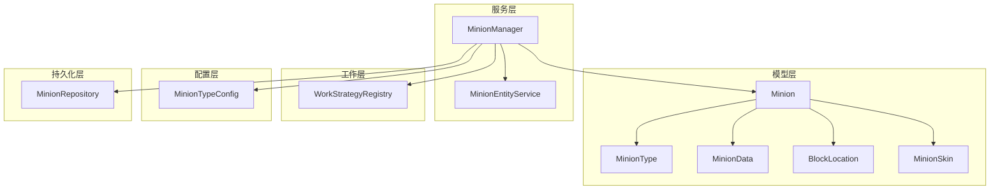
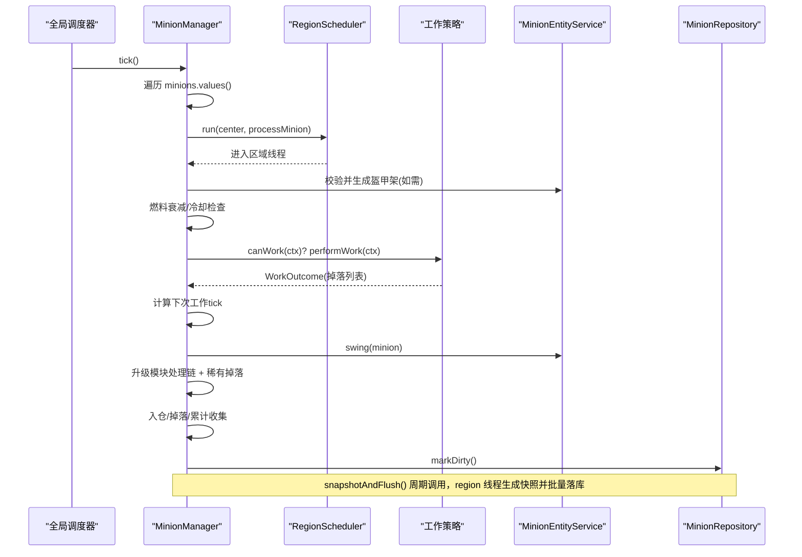
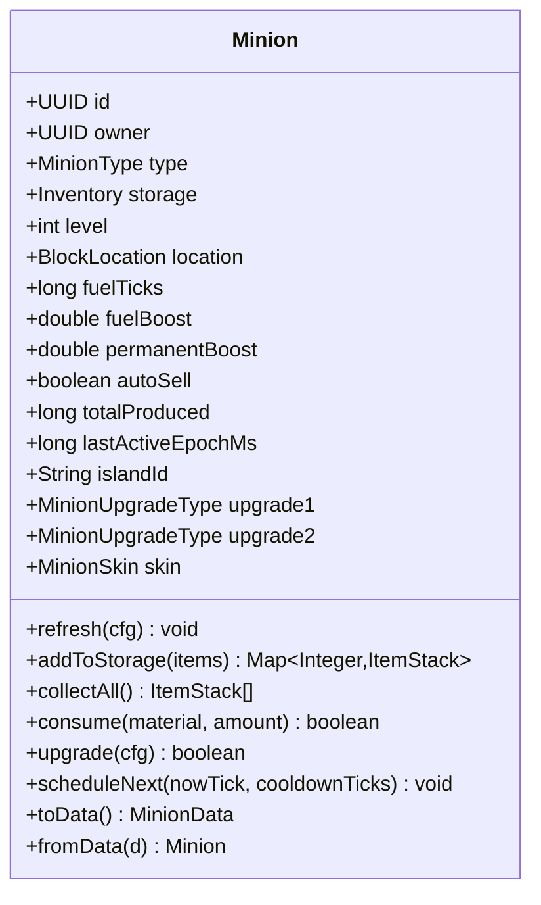
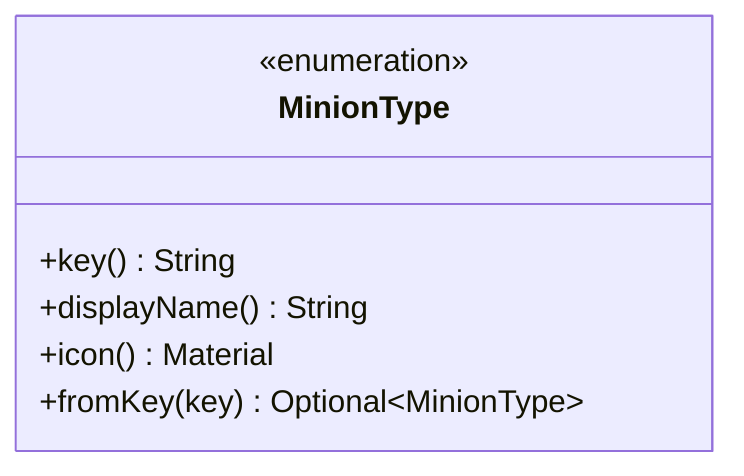
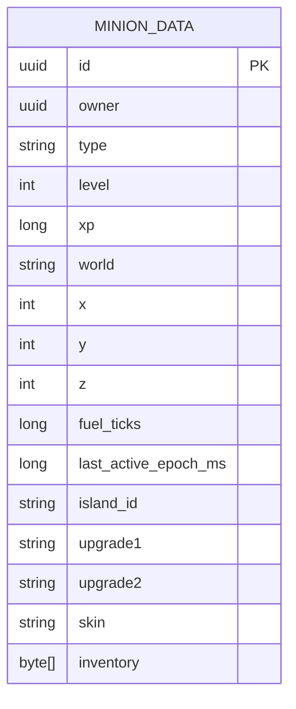
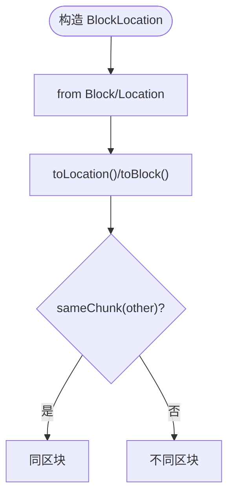
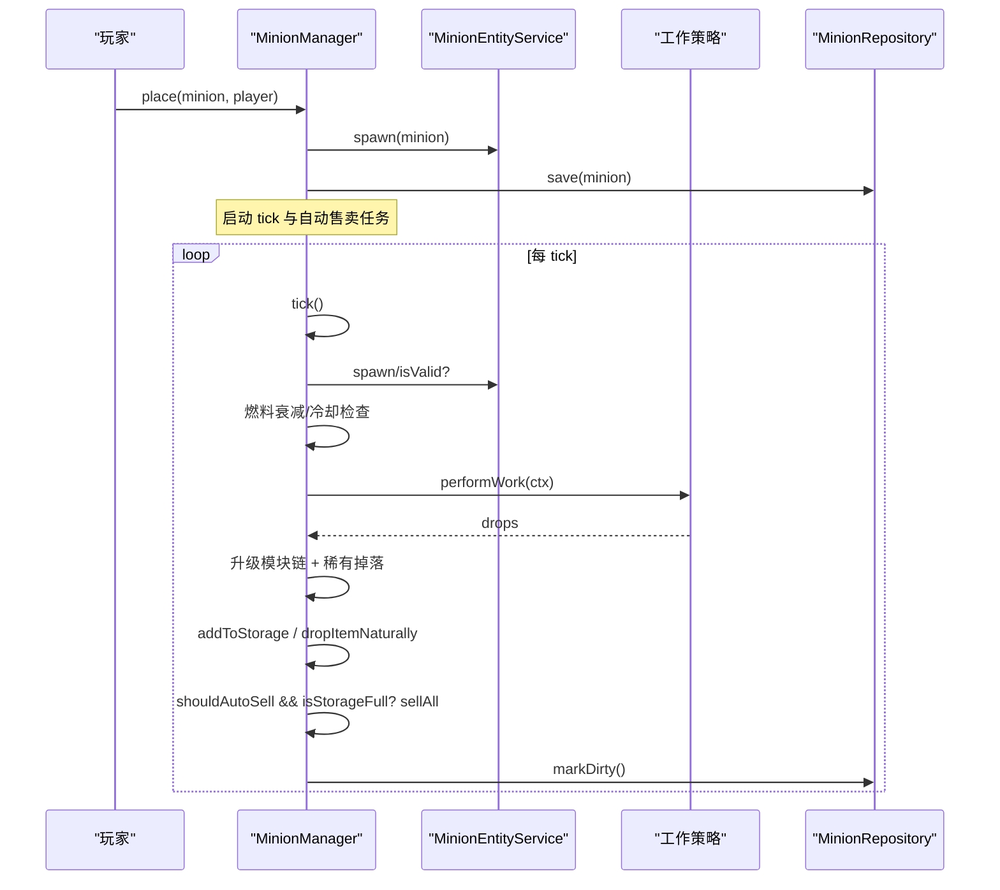
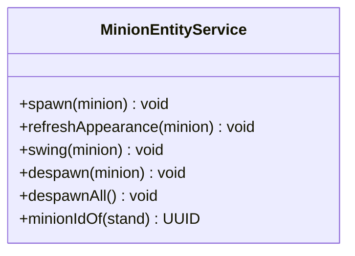
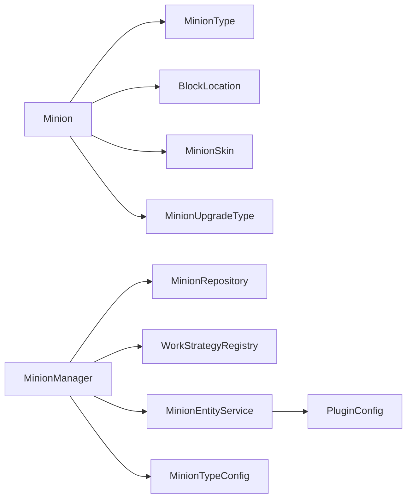

# 模型实体 API

<cite>
**本文引用的文件**
- [Minion.java](file://src/main/java/com/hcs/minions/model/Minion.java)
- [MinionType.java](file://src/main/java/com/hcs/minions/model/MinionType.java)
- [MinionData.java](file://src/main/java/com/hcs/minions/model/MinionData.java)
- [BlockLocation.java](file://src/main/java/com/hcs/minions/model/BlockLocation.java)
- [MinionSkin.java](file://src/main/java/com/hcs/minions/model/MinionSkin.java)
- [MinionManager.java](file://src/main/java/com/hcs/minions/service/MinionManager.java)
- [MinionEntityService.java](file://src/main/java/com/hcs/minions/service/MinionEntityService.java)
- [MinionRepository.java](file://src/main/java/com/hcs/minions/repository/MinionRepository.java)
- [WorkStrategyRegistry.java](file://src/main/java/com/hcs/minions/work/WorkStrategyRegistry.java)
- [MinionTypeConfig.java](file://src/main/java/com/hcs/minions/config/MinionTypeConfig.java)
</cite>

## 目录
1. [简介](#简介)
2. [项目结构](#项目结构)
3. [核心组件](#核心组件)
4. [架构总览](#架构总览)
5. [详细组件分析](#详细组件分析)
6. [依赖关系分析](#依赖关系分析)
7. [性能考量](#性能考量)
8. [故障排查指南](#故障排查指南)
9. [结论](#结论)
10. [附录：操作示例与最佳实践](#附录操作示例与最佳实践)

## 简介
本文件面向插件开发者，系统化说明“仆从（Minion）”模型实体的 API 设计、数据模型结构与操作方法。重点覆盖：
- Minion 实体的属性与方法：GUI 布局管理、仓库操作、状态控制、工作调度等
- MinionType 枚举定义与扩展方式，以及七种仆从类型的特性差异
- MinionData 持久化数据模型的字段与序列化机制
- BlockLocation 位置封装与坐标计算方法
- 实体间关系映射与数据同步机制
- 实体验证与业务规则检查的实现方法
- 完整的创建、更新、删除等操作示例

## 项目结构
围绕模型实体 API 的核心代码分布在 model、service、repository、work、config 等包中：
- model：定义运行时实体与数据载体（Minion、MinionType、MinionData、BlockLocation、MinionSkin）
- service：MinionManager 负责全局调度与工作编排；MinionEntityService 负责盔甲架实体渲染
- repository：MinionRepository 抽象持久化接口，屏蔽底层存储细节
- work：WorkStrategyRegistry 按类型分发工作策略
- config：MinionTypeConfig 描述每种类型的配置参数（效率、冷却、稀有掉落等）

**图表来源**
- [Minion.java:41-105](file://src/main/java/com/hcs/minions/model/Minion.java#L41-L105)
- [MinionManager.java:44-86](file://src/main/java/com/hcs/minions/service/MinionManager.java#L44-L86)
- [MinionEntityService.java:28-41](file://src/main/java/com/hcs/minions/service/MinionEntityService.java#L28-L41)
- [WorkStrategyRegistry.java:14-24](file://src/main/java/com/hcs/minions/work/WorkStrategyRegistry.java#L14-L24)
- [MinionTypeConfig.java:21-37](file://src/main/java/com/hcs/minions/config/MinionTypeConfig.java#L21-L37)
- [MinionRepository.java:16-47](file://src/main/java/com/hcs/minions/repository/MinionRepository.java#L16-L47)

**章节来源**
- [Minion.java:41-105](file://src/main/java/com/hcs/minions/model/Minion.java#L41-L105)
- [MinionManager.java:44-86](file://src/main/java/com/hcs/minions/service/MinionManager.java#L44-L86)

## 核心组件
- Minion：运行时实体，承载 GUI、仓库、状态、工作调度、皮肤与升级模块槽位等
- MinionType：七种仆从类型枚举，提供 key、显示名、图标
- MinionData：持久化快照（record），用于 SQL 映射与传输
- BlockLocation：跨世界不可变坐标封装，支持 Location/Block 转换与区块判断
- MinionSkin：皮肤枚举，包含 base64 纹理，用于头盔渲染
- MinionManager：全局调度器，负责 tick 循环、工作编排、自动售卖、实体生成/销毁、事件发布
- MinionEntityService：盔甲架小人实体服务，负责 spawn/despawn、外观刷新、挥臂动画
- WorkStrategyRegistry：按 MinionType 查找对应工作策略，实现开闭原则
- MinionTypeConfig：单类型配置，含效率曲线、冷却、稀有掉落、升级成本等

**章节来源**
- [Minion.java:41-105](file://src/main/java/com/hcs/minions/model/Minion.java#L41-L105)
- [MinionType.java:13-52](file://src/main/java/com/hcs/minions/model/MinionType.java#L13-L52)
- [MinionData.java:11-28](file://src/main/java/com/hcs/minions/model/MinionData.java#L11-L28)
- [BlockLocation.java:12-41](file://src/main/java/com/hcs/minions/model/BlockLocation.java#L12-L41)
- [MinionSkin.java:12-53](file://src/main/java/com/hcs/minions/model/MinionSkin.java#L12-L53)
- [MinionManager.java:44-86](file://src/main/java/com/hcs/minions/service/MinionManager.java#L44-L86)
- [MinionEntityService.java:28-41](file://src/main/java/com/hcs/minions/service/MinionEntityService.java#L28-L41)
- [WorkStrategyRegistry.java:14-24](file://src/main/java/com/hcs/minions/work/WorkStrategyRegistry.java#L14-L24)
- [MinionTypeConfig.java:21-37](file://src/main/java/com/hcs/minions/config/MinionTypeConfig.java#L21-L37)

## 架构总览
MinionManager 作为中枢，周期性遍历内存中的 Minion，在各自 region 线程执行工作逻辑；通过 WorkStrategyRegistry 获取具体策略执行产出；产物经 UpgradeService 处理链后入仓或掉落；自动售卖由独立任务轮询触发；脏标记机制配合 MinionRepository 异步批量落库。

**图表来源**
- [MinionManager.java:92-115](file://src/main/java/com/hcs/minions/service/MinionManager.java#L92-L115)
- [MinionManager.java:191-215](file://src/main/java/com/hcs/minions/service/MinionManager.java#L191-L215)
- [MinionManager.java:217-322](file://src/main/java/com/hcs/minions/service/MinionManager.java#L217-L322)
- [MinionEntityService.java:43-75](file://src/main/java/com/hcs/minions/service/MinionEntityService.java#L43-L75)
- [MinionRepository.java:27-43](file://src/main/java/com/hcs/minions/repository/MinionRepository.java#L27-L43)

## 详细组件分析

### Minion 实体
- GUI 布局：固定 54 格，顶行燃料/信息卡/头颅/升级/皮肤，存储区 36 格随等级解锁，底行模块槽/收集/自动售卖/理想布局/拾取/关闭
- 仓库操作：addToStorage、collectAll、consume、removeItems、isStorageFull、storageItems/setStorageItems
- 状态控制：level、fuelTicks、fuelBoost、permanentBoost、autoSell、totalProduced、lastActiveEpochMs、upgrade1/upgrade2、skin
- 工作调度：canWorkNow/scheduleNext/nextWorkInTicks/nextWorkSeconds
- 持久化：toData/fromData 与 MinionData 互转，内部使用 ItemCodec 序列化背包

**图表来源**
- [Minion.java:41-105](file://src/main/java/com/hcs/minions/model/Minion.java#L41-L105)
- [Minion.java:152-286](file://src/main/java/com/hcs/minions/model/Minion.java#L152-L286)
- [Minion.java:288-507](file://src/main/java/com/hcs/minions/model/Minion.java#L288-L507)
- [Minion.java:509-743](file://src/main/java/com/hcs/minions/model/Minion.java#L509-L743)

**章节来源**
- [Minion.java:41-105](file://src/main/java/com/hcs/minions/model/Minion.java#L41-L105)
- [Minion.java:152-286](file://src/main/java/com/hcs/minions/model/Minion.java#L152-L286)
- [Minion.java:288-507](file://src/main/java/com/hcs/minions/model/Minion.java#L288-L507)
- [Minion.java:509-743](file://src/main/java/com/hcs/minions/model/Minion.java#L509-L743)

### MinionType 枚举与扩展
- 内置七种类型：矿工、农夫、伐木工、钓鱼郎、猎魔人、牧民、圆石匠
- 每个类型携带 key、displayName、icon
- 扩展方式：新增枚举项并在 WorkStrategyRegistry 注册对应策略，即可无缝接入

**图表来源**
- [MinionType.java:13-52](file://src/main/java/com/hcs/minions/model/MinionType.java#L13-L52)

**章节来源**
- [MinionType.java:13-52](file://src/main/java/com/hcs/minions/model/MinionType.java#L13-L52)
- [WorkStrategyRegistry.java:14-33](file://src/main/java/com/hcs/minions/work/WorkStrategyRegistry.java#L14-L33)

### MinionData 数据模型与序列化
- record 字段：id、owner、type、level、xp、world、x/y/z、fuelTicks、lastActiveEpochMs、islandId、upgrade1、upgrade2、skin、inventory(BLOB)
- 与 Minion 的 toData/fromData 互转，inventory 通过 ItemCodec 序列化为字节数组

**图表来源**
- [MinionData.java:11-28](file://src/main/java/com/hcs/minions/model/MinionData.java#L11-L28)
- [Minion.java:718-743](file://src/main/java/com/hcs/minions/model/Minion.java#L718-L743)

**章节来源**
- [MinionData.java:11-28](file://src/main/java/com/hcs/minions/model/MinionData.java#L11-L28)
- [Minion.java:718-743](file://src/main/java/com/hcs/minions/model/Minion.java#L718-L743)

### BlockLocation 位置封装与坐标计算
- 不可变 record，包含 world、x、y、z
- 提供 of(Block)/of(Location) 构造
- 转换为 bukkitWorld()/toLocation()/toBlock()
- sameChunk(other) 快速判断是否同区块

**图表来源**
- [BlockLocation.java:12-41](file://src/main/java/com/hcs/minions/model/BlockLocation.java#L12-L41)

**章节来源**
- [BlockLocation.java:12-41](file://src/main/java/com/hcs/minions/model/BlockLocation.java#L12-L41)

### MinionManager 调度与工作流
- start：加载所有 Minion，启动全局 tick 与自动售卖任务，定时快照落库
- tick：遍历 minions，仅做纯内存只读判断，区域绑定操作委派到 RegionScheduler
- processMinion：生成/修复盔甲架，燃料衰减，冷却检查，执行工作策略，处理掉落与稀有掉落，入仓/掉落，自动售卖，标记脏
- place/remove/openGui/save：放置、移除、打开 GUI、保存

**图表来源**
- [MinionManager.java:92-115](file://src/main/java/com/hcs/minions/service/MinionManager.java#L92-L115)
- [MinionManager.java:191-215](file://src/main/java/com/hcs/minions/service/MinionManager.java#L191-L215)
- [MinionManager.java:217-322](file://src/main/java/com/hcs/minions/service/MinionManager.java#L217-L322)
- [MinionManager.java:356-395](file://src/main/java/com/hcs/minions/service/MinionManager.java#L356-L395)

**章节来源**
- [MinionManager.java:92-115](file://src/main/java/com/hcs/minions/service/MinionManager.java#L92-L115)
- [MinionManager.java:191-215](file://src/main/java/com/hcs/minions/service/MinionManager.java#L191-L215)
- [MinionManager.java:217-322](file://src/main/java/com/hcs/minions/service/MinionManager.java#L217-L322)
- [MinionManager.java:356-395](file://src/main/java/com/hcs/minions/service/MinionManager.java#L356-L395)

### MinionEntityService 实体渲染
- spawn：生成小盔甲架，设置外观（头盔/皮革甲/手持物品）、PDC 标记 UUID、锁定装备
- refreshAppearance：仅刷新外观（头盔/护甲颜色）
- swing：工作手臂摆动动画
- despawn/despawnAll：清理实体
- minionIdOf：从 PDC 反查 UUID

**图表来源**
- [MinionEntityService.java:28-41](file://src/main/java/com/hcs/minions/service/MinionEntityService.java#L28-L41)
- [MinionEntityService.java:43-127](file://src/main/java/com/hcs/minions/service/MinionEntityService.java#L43-L127)

**章节来源**
- [MinionEntityService.java:28-41](file://src/main/java/com/hcs/minions/service/MinionEntityService.java#L28-L41)
- [MinionEntityService.java:43-127](file://src/main/java/com/hcs/minions/service/MinionEntityService.java#L43-L127)

### MinionTypeConfig 配置与业务规则
- 关键参数：maxLevel、baseEfficiency、efficiencyPerLevel、cooldownTicks、sellPricePerUnit、product、upgradeItem、upgradeCost、baseRadius、targets、rareDrop、rareDropChance
- 业务规则：
  - efficiencyAt(level) = baseEfficiency + efficiencyPerLevel * max(0, level-1)
  - upgradeCostFor(level) = upgradeCost * level
  - radiusFor(level) 固定为 baseRadius（范围扩展由升级模块提供）
  - hasRareDrop() 判定是否启用专属稀有掉落

**章节来源**
- [MinionTypeConfig.java:21-63](file://src/main/java/com/hcs/minions/config/MinionTypeConfig.java#L21-L63)

## 依赖关系分析
- Minion 依赖 MinionType、BlockLocation、MinionSkin、MinionUpgradeType、ItemCodec、GuiText 等
- MinionManager 依赖 MinionRepository、WorkStrategyRegistry、MinionEntityService、MinionTypeConfig、SkyblockHook、PermissionService、UpgradeService、CollectionService、AsyncExecutor
- MinionEntityService 依赖 PluginConfig、Bukkit API（ArmorStand、SkullMeta、PlayerProfile）
- WorkStrategyRegistry 依赖 MinionType 与工作策略集合

**图表来源**
- [Minion.java:41-105](file://src/main/java/com/hcs/minions/model/Minion.java#L41-L105)
- [MinionManager.java:44-86](file://src/main/java/com/hcs/minions/service/MinionManager.java#L44-L86)
- [MinionEntityService.java:28-41](file://src/main/java/com/hcs/minions/service/MinionEntityService.java#L28-L41)
- [WorkStrategyRegistry.java:14-24](file://src/main/java/com/hcs/minions/work/WorkStrategyRegistry.java#L14-L24)

**章节来源**
- [Minion.java:41-105](file://src/main/java/com/hcs/minions/model/Minion.java#L41-L105)
- [MinionManager.java:44-86](file://src/main/java/com/hcs/minions/service/MinionManager.java#L44-L86)
- [MinionEntityService.java:28-41](file://src/main/java/com/hcs/minions/service/MinionEntityService.java#L28-L41)
- [WorkStrategyRegistry.java:14-24](file://src/main/java/com/hcs/minions/work/WorkStrategyRegistry.java#L14-L24)

## 性能考量
- 区域线程安全：所有涉及 Inventory/World/Entity 的操作均通过 RegionScheduler 委派，避免 Folia 兼容问题
- 批量落库：snapshotAndFlush 收集脏 ID，在各自 region 线程生成快照后批量异步写入，减少 IO 次数
- 扫描半径与玩家存在性：仅在附近玩家存在时执行工作，降低空转开销
- 存储优化：超级压缩模块可显著减少占用空间；自动售卖在仓库满时触发，避免无限堆积
- 调试日志节流：对未找到目标的调试日志进行时间间隔限制，避免刷屏

[本节为通用性能讨论，不直接分析具体文件]

## 故障排查指南
- 工作异常：捕获策略执行异常并记录日志，便于定位问题
- 实体孤儿：purgeOrphans 清理内存中无对应数据的盔甲架，防止资源泄漏
- GUI 交互冲突：stop 时先关闭所有打开的 GUI，避免冲刷期间玩家仍在交互导致不一致
- 区块未加载：异步加载区块并记录错误日志，确保后续流程健壮

**章节来源**
- [MinionManager.java:261-269](file://src/main/java/com/hcs/minions/service/MinionManager.java#L261-L269)
- [MinionManager.java:397-413](file://src/main/java/com/hcs/minions/service/MinionManager.java#L397-L413)
- [MinionManager.java:162-180](file://src/main/java/com/hcs/minions/service/MinionManager.java#L162-L180)
- [MinionManager.java:201-206](file://src/main/java/com/hcs/minions/service/MinionManager.java#L201-L206)

## 结论
本 API 以 Minion 为核心，结合 MinionType、MinionData、BlockLocation 等模型，构建了可扩展、线程安全、高性能的仆从系统。MinionManager 统一调度工作流，MinionEntityService 负责可视化呈现，WorkStrategyRegistry 实现策略解耦，MinionRepository 屏蔽持久化细节。通过配置驱动的 MinionTypeConfig 与升级模块体系，实现了高度可定制的业务规则与玩法。

[本节为总结性内容，不直接分析具体文件]

## 附录：操作示例与最佳实践

### 创建仆从
- 构造 Minion 实例（指定 id、owner、type、level、location、fuelTicks、lastActiveEpochMs、islandId）
- 调用 MinionManager.place(minion, player) 完成放置、实体生成、持久化保存与事件发布

**章节来源**
- [Minion.java:93-105](file://src/main/java/com/hcs/minions/model/Minion.java#L93-L105)
- [MinionManager.java:356-373](file://src/main/java/com/hcs/minions/service/MinionManager.java#L356-L373)

### 更新仆从
- 修改状态：setFuelTicks/addFuel/addPermanentFuel/setAutoSell/setUpgrade1/setUpgrade2/setSkin/setLocation 等
- 仓库操作：addToStorage/collectAll/consume/removeItems
- 调用 MinionManager.save(minion) 标记脏并异步落库

**章节来源**
- [Minion.java:509-630](file://src/main/java/com/hcs/minions/model/Minion.java#L509-L630)
- [Minion.java:152-286](file://src/main/java/com/hcs/minions/model/Minion.java#L152-L286)
- [MinionManager.java:392-395](file://src/main/java/com/hcs/minions/service/MinionManager.java#L392-L395)

### 删除仆从
- 调用 MinionManager.remove(minion, player) 移除内存索引、销毁实体、删除持久化数据并发布事件

**章节来源**
- [MinionManager.java:376-384](file://src/main/java/com/hcs/minions/service/MinionManager.java#L376-L384)

### 打开 GUI
- 调用 MinionManager.openGui(player, minion) 刷新 GUI 并打开玩家界面

**章节来源**
- [MinionManager.java:386-390](file://src/main/java/com/hcs/minions/service/MinionManager.java#L386-L390)

### 实体间关系映射与数据同步
- Minion ↔ MinionData：toData/fromData 互转，inventory 通过 ItemCodec 序列化
- Minion ↔ ArmorStand：MinionEntityService 通过 PDC 关联 UUID，支持自愈
- Minion ↔ Repository：脏标记机制 + 批量快照落库，保证一致性

**章节来源**
- [Minion.java:718-743](file://src/main/java/com/hcs/minions/model/Minion.java#L718-L743)
- [MinionEntityService.java:43-127](file://src/main/java/com/hcs/minions/service/MinionEntityService.java#L43-L127)
- [MinionManager.java:117-160](file://src/main/java/com/hcs/minions/service/MinionManager.java#L117-L160)

### 实体验证与业务规则检查
- 工作前检查：canWorkNow、skyblock.canWorkAt、策略 canWork
- 升级上限：level >= cfg.maxLevel() 阻止继续升级
- 稀有掉落：cfg.hasRareDrop() 与概率判定
- 自动售卖：shouldAutoSell 与 isStorageFull 组合触发

**章节来源**
- [MinionManager.java:246-249](file://src/main/java/com/hcs/minions/service/MinionManager.java#L246-L249)
- [Minion.java:279-286](file://src/main/java/com/hcs/minions/model/Minion.java#L279-L286)
- [MinionTypeConfig.java:46-49](file://src/main/java/com/hcs/minions/config/MinionTypeConfig.java#L46-L49)
- [MinionManager.java:318-327](file://src/main/java/com/hcs/minions/service/MinionManager.java#L318-L327)