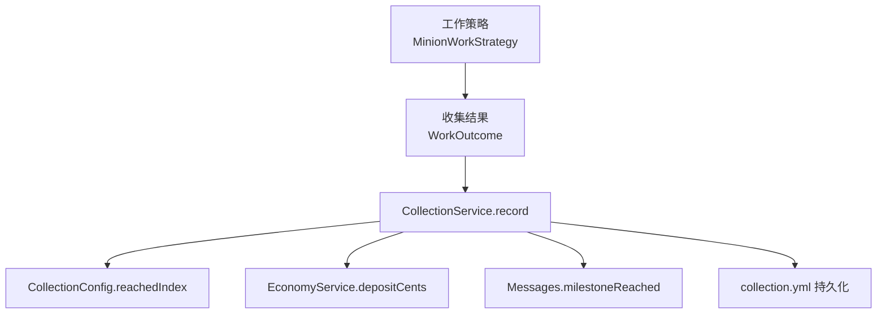
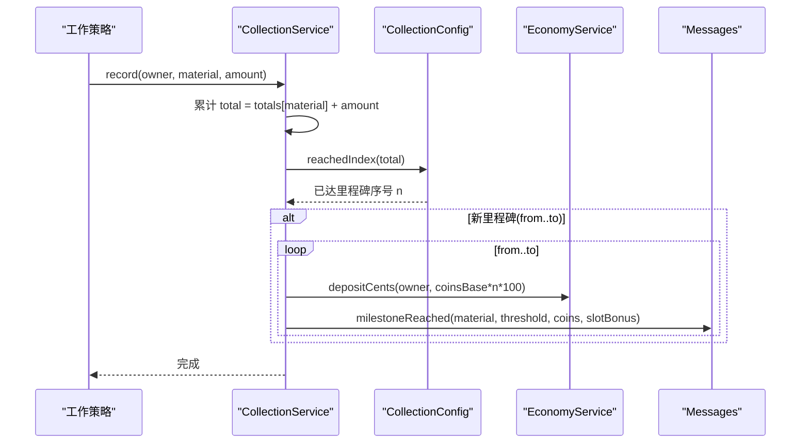
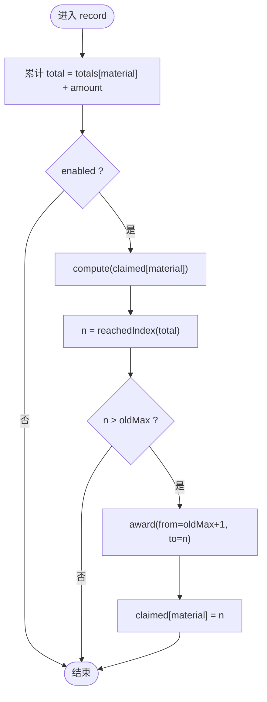
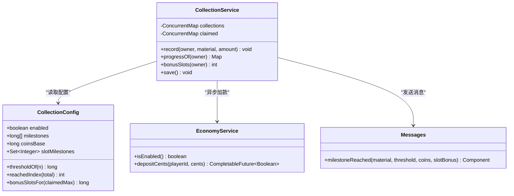
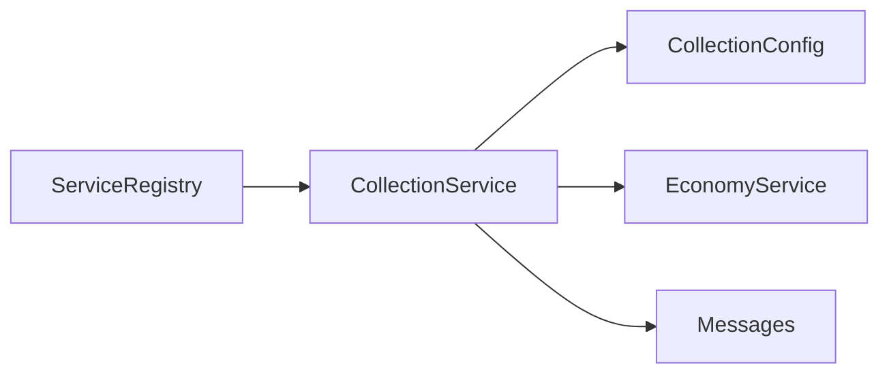

# Collection 里程碑系统

<cite>
**本文引用的文件**
- [CollectionService.java](file://src/main/java/com/hcs/minions/service/CollectionService.java)
- [CollectionConfig.java](file://src/main/java/com/hcs/minions/config/CollectionConfig.java)
- [config.yml](file://src/main/resources/config.yml)
- [EconomyService.java](file://src/main/java/com/hcs/minions/service/EconomyService.java)
- [Messages.java](file://src/main/java/com/hcs/minions/util/Messages.java)
- [MinionWorkStrategy.java](file://src/main/java/com/hcs/minions/work/MinionWorkStrategy.java)
- [WorkOutcome.java](file://src/main/java/com/hcs/minions/work/WorkOutcome.java)
- [MinerStrategy.java](file://src/main/java/com/hcs/minions/work/miner/MinerStrategy.java)
- [OfflineRewardService.java](file://src/main/java/com/hcs/minions/service/OfflineRewardService.java)
- [ServiceRegistry.java](file://src/main/java/com/hcs/minions/core/ServiceRegistry.java)
</cite>

## 目录
1. [简介](#简介)
2. [项目结构](#项目结构)
3. [核心组件](#核心组件)
4. [架构总览](#架构总览)
5. [详细组件分析](#详细组件分析)
6. [依赖关系分析](#依赖关系分析)
7. [性能考量](#性能考量)
8. [故障排除指南](#故障排除指南)
9. [结论](#结论)
10. [附录：配置示例与使用指南](#附录：配置示例与使用指南)

## 简介
本系统实现“资源累计 + 里程碑奖励”的玩法，对齐 Hypixel SkyBlock 采集里程碑机制。每种资源独立累计，跨过阈值即达成里程碑；第 n 个里程碑奖励金币 coins-base × n；命中配置的 slot-milestones 序号时额外奖励仆从槽位 +1（多资源可叠加）。系统提供内存缓存、异步经济结算、持久化落盘与进度查询等能力。

## 项目结构
- 配置层：config.yml 中的 collections 段定义里程碑阈值、金币基数、槽位加成序号等。
- 配置模型：CollectionConfig 将配置反序列化为强类型记录，并提供阈值计算、槽位加成计算等纯函数。
- 服务层：CollectionService 负责累计、里程碑检测、奖励发放、进度查询与持久化。
- 经济层：EconomyService 通过 Vault 异步加款，保证线程安全与错误处理。
- 消息层：Messages 提供里程碑达成文案渲染。
- 工作策略：MinionWorkStrategy 及其实现产出物品后，由上层统一调用 CollectionService.record 累计并触发里程碑。

图表来源
- [MinionWorkStrategy.java:10-26](file://src/main/java/com/hcs/minions/work/MinionWorkStrategy.java#L10-L26)
- [WorkOutcome.java:1-22](file://src/main/java/com/hcs/minions/work/WorkOutcome.java#L1-L22)
- [CollectionService.java:121-162](file://src/main/java/com/hcs/minions/service/CollectionService.java#L121-L162)
- [CollectionConfig.java:43-62](file://src/main/java/com/hcs/minions/config/CollectionConfig.java#L43-L62)
- [EconomyService.java:66-86](file://src/main/java/com/hcs/minions/service/EconomyService.java#L66-L86)
- [Messages.java:257-261](file://src/main/java/com/hcs/minions/util/Messages.java#L257-L261)

章节来源
- [config.yml:38-45](file://src/main/resources/config.yml#L38-L45)
- [CollectionConfig.java:17-62](file://src/main/java/com/hcs/minions/config/CollectionConfig.java#L17-L62)
- [CollectionService.java:21-47](file://src/main/java/com/hcs/minions/service/CollectionService.java#L21-L47)

## 核心组件
- CollectionConfig：不可变配置记录，提供里程碑阈值数组、金币基数、槽位加成集合；包含 reachedIndex、thresholdOf、bonusSlotsFor 等纯函数。
- CollectionService：线程安全的累计与里程碑系统，维护玩家-资源-累计量与已领取里程碑序号；支持加载/保存 collection.yml、并发安全地发放里程碑奖励、查询进度与槽位加成。
- EconomyService：Vault 经济对接，内部以分（cents）为单位，异步加款并校验返回状态。
- Messages：MiniMessage 文案模板，提供里程碑达成消息渲染。

章节来源
- [CollectionConfig.java:17-62](file://src/main/java/com/hcs/minions/config/CollectionConfig.java#L17-L62)
- [CollectionService.java:21-47](file://src/main/java/com/hcs/minions/service/CollectionService.java#L21-L47)
- [EconomyService.java:17-86](file://src/main/java/com/hcs/minions/service/EconomyService.java#L17-L86)
- [Messages.java:257-261](file://src/main/java/com/hcs/minions/util/Messages.java#L257-L261)

## 架构总览
- 数据流：工作策略产出物品 → 上层调度器/管理器汇总掉落 → 调用 CollectionService.record(owner, material, amount) → 内存累计 → 检测是否跨越里程碑 → 若跨越则发放金币与提示 → 异步写入 economy 账户 → 定期持久化到 collection.yml。
- 跨服务器数据共享：当前实现为单服内存+本地 YAML 持久化；如需跨服共享，可将底层存储替换为远程数据库或外部存储，并在 save/load 处适配。
- 奖励机制：金币 = coins-base × n；slot-milestones 中命中的序号会额外授予仆从槽位 +1（多资源可叠加）。

图表来源
- [CollectionService.java:121-162](file://src/main/java/com/hcs/minions/service/CollectionService.java#L121-L162)
- [CollectionConfig.java:43-54](file://src/main/java/com/hcs/minions/config/CollectionConfig.java#L43-L54)
- [EconomyService.java:66-86](file://src/main/java/com/hcs/minions/service/EconomyService.java#L66-L86)
- [Messages.java:257-261](file://src/main/java/com/hcs/minions/util/Messages.java#L257-L261)

## 详细组件分析

### 资源累计算法与阈值检测
- 数据结构：ConcurrentHashMap<UUID, ConcurrentHashMap<String, Long>> 存储玩家-资源-累计量；ConcurrentHashMap<UUID, ConcurrentHashMap<String, Integer>> 存储玩家-资源-已领取的最高里程碑序号（1-based）。
- 累计与并发安全：record 使用 merge 原子累加；claimed 使用 compute 原子比较并更新，避免并发下重复或漏发里程碑。
- 阈值检测：reachedIndex 遍历严格递增的 milestones 数组，返回已达成的最高里程碑序号；nextThreshold 用于 UI 展示下一目标。
- 槽位加成：bonusSlotsFor 统计 claimedMax 以内命中 slot-milestones 的数量；bonusSlots 对所有资源的加成求和。

图表来源
- [CollectionService.java:121-162](file://src/main/java/com/hcs/minions/service/CollectionService.java#L121-L162)
- [CollectionConfig.java:43-62](file://src/main/java/com/hcs/minions/config/CollectionConfig.java#L43-L62)

章节来源
- [CollectionService.java:121-216](file://src/main/java/com/hcs/minions/service/CollectionService.java#L121-L216)
- [CollectionConfig.java:38-62](file://src/main/java/com/hcs/minions/config/CollectionConfig.java#L38-L62)

### 里程碑奖励系统
- 金币奖励：第 n 个里程碑奖励 coins-base × n；通过 EconomyService.depositCents 异步加款（单位分），失败不结算且记录日志。
- 槽位加成：当 n ∈ slot-milestones 时，额外授予仆从槽位 +1；多资源可叠加，最终上限受插件全局限制。
- 消息反馈：通过 Messages.milestoneReached 输出彩色文本，附带槽位加成尾注。

图表来源
- [CollectionConfig.java:17-62](file://src/main/java/com/hcs/minions/config/CollectionConfig.java#L17-L62)
- [CollectionService.java:21-47](file://src/main/java/com/hcs/minions/service/CollectionService.java#L21-L47)
- [EconomyService.java:17-86](file://src/main/java/com/hcs/minions/service/EconomyService.java#L17-L86)
- [Messages.java:257-261](file://src/main/java/com/hcs/minions/util/Messages.java#L257-L261)

章节来源
- [CollectionService.java:147-162](file://src/main/java/com/hcs/minions/service/CollectionService.java#L147-L162)
- [EconomyService.java:66-86](file://src/main/java/com/hcs/minions/service/EconomyService.java#L66-L86)
- [Messages.java:257-261](file://src/main/java/com/hcs/minions/util/Messages.java#L257-L261)

### 配置文件设置方法
- 位置：config.yml 的 collections 段。
- 关键选项：
  - enabled：是否启用里程碑奖励（关闭仅累计不发放）。
  - milestones：严格递增的阈值数组，如 [50, 100, 250, 500, 1000, 2500, 5000, 10000]。
  - coins-base：金币基数，第 n 个里程碑奖励 coins-base × n。
  - slot-milestones：命中这些序号（1-based）的里程碑额外奖励仆从槽位 +1，如 [3, 5, 7]。
- 其他相关：
  - max-minions-per-player：全局仆从槽位上限（默认 5）。
  - economy.enabled：是否启用 Vault 经济模块。

章节来源
- [config.yml:38-45](file://src/main/resources/config.yml#L38-L45)
- [config.yml:7](file://src/main/resources/config.yml#L7)
- [config.yml:23-27](file://src/main/resources/config.yml#L23-L27)

### 数据持久化与跨服务器共享
- 持久化：collection.yml 存储 totals 与 claimed 两个节点；load 兼容旧版顶层 UUID 格式；save 将内存合并后的数据写回磁盘。
- 跨服共享：当前为本地文件；如需跨服共享，可在 save/load 处替换为远程存储（例如 MySQL/Redis），并保持 totals/claimed 结构一致。

章节来源
- [CollectionService.java:49-119](file://src/main/java/com/hcs/minions/service/CollectionService.java#L49-L119)
- [CollectionService.java:218-238](file://src/main/java/com/hcs/minions/service/CollectionService.java#L218-L238)

### 与仆从工作系统的集成
- 工作策略产出物品后，由上层统一汇总 WorkOutcome.drops，再按材料名称与数量调用 CollectionService.record 累计。
- 该设计使里程碑系统与具体工作策略解耦，新增策略无需修改里程碑逻辑。

章节来源
- [MinionWorkStrategy.java:10-26](file://src/main/java/com/hcs/minions/work/MinionWorkStrategy.java#L10-L26)
- [WorkOutcome.java:1-22](file://src/main/java/com/hcs/minions/work/WorkOutcome.java#L1-L22)
- [MinerStrategy.java:36-55](file://src/main/java/com/hcs/minions/work/miner/MinerStrategy.java#L36-L55)

## 依赖关系分析
- CollectionService 依赖：
  - CollectionConfig：读取阈值、基数、槽位加成集合。
  - EconomyService：异步加款。
  - Messages：文案渲染。
  - JavaPlugin/Bukkit：文件读写、在线玩家获取。
- ServiceRegistry 暴露 collection() 供其他模块注入使用。

图表来源
- [ServiceRegistry.java:142-148](file://src/main/java/com/hcs/minions/core/ServiceRegistry.java#L142-L148)
- [CollectionService.java:21-47](file://src/main/java/com/hcs/minions/service/CollectionService.java#L21-L47)

章节来源
- [ServiceRegistry.java:142-148](file://src/main/java/com/hcs/minions/core/ServiceRegistry.java#L142-L148)

## 性能考量
- 并发安全：使用 ConcurrentHashMap 与 compute 原子操作，避免并发下的重复/漏发里程碑。
- 异步经济：Vault 加款在虚拟线程异步执行，不阻塞主循环。
- 内存合并+定期落盘：累计与里程碑判定在内存中进行，减少 IO；save 按需调用，降低磁盘压力。
- 离线收益参考：OfflineRewardService 提供时间折算与上限截断思路，可用于扩展离线累计场景。

章节来源
- [CollectionService.java:121-162](file://src/main/java/com/hcs/minions/service/CollectionService.java#L121-L162)
- [EconomyService.java:66-86](file://src/main/java/com/hcs/minions/service/EconomyService.java#L66-L86)
- [OfflineRewardService.java:83-94](file://src/main/java/com/hcs/minions/service/OfflineRewardService.java#L83-L94)

## 故障排除指南
- 未收到金币：
  - 检查 economy.enabled 与 Vault 是否启用；查看 EconomyService 日志确认 depositCents 是否 SUCCESS。
- 里程碑未触发：
  - 确认 enabled=true 且 milestones 严格递增；核对累计量是否达到阈值；检查 claimed 是否被正确更新。
- 槽位加成异常：
  - 核对 slot-milestones 序号是否与里程碑序号对应；确认 bonusSlots 对多资源求和逻辑。
- 数据丢失：
  - 确认 save 被调用；检查 collection.yml 权限与磁盘空间；必要时手动备份 totals/claimed 节点。
- 文案显示异常：
  - 检查 messages.yml 是否存在对应键；确认 MiniMessage 模板语法正确。

章节来源
- [EconomyService.java:66-86](file://src/main/java/com/hcs/minions/service/EconomyService.java#L66-L86)
- [CollectionService.java:49-119](file://src/main/java/com/hcs/minions/service/CollectionService.java#L49-L119)
- [Messages.java:128-144](file://src/main/java/com/hcs/minions/util/Messages.java#L128-L144)

## 结论
Collection 里程碑系统以轻量、线程安全的方式实现了资源累计与里程碑奖励，支持金币与槽位加成双轨奖励，并通过异步经济、内存合并与持久化保障性能与可靠性。通过合理配置 milestones、coins-base、slot-milestones，即可快速定制不同服务器的里程碑节奏与奖励强度。

## 附录：配置示例与使用指南
- 基础配置（config.yml）：
  - collections.enabled: true
  - collections.milestones: [50, 100, 250, 500, 1000, 2500, 5000, 10000]
  - collections.coins-base: 100
  - collections.slot-milestones: [3, 5, 7]
  - economy.enabled: true
  - max-minions-per-player: 5
- 使用流程：
  - 放置并运行仆从，产出物品后自动累计。
  - 达到里程碑时获得金币与可能的槽位加成提示。
  - 通过 /minion collection 查看各资源累计与下一里程碑目标。
- 扩展建议：
  - 跨服共享：将 save/load 替换为远程存储，保持 totals/claimed 结构不变。
  - 离线累计：参考 OfflineRewardService 的时间折算与上限截断，结合 CollectionService 进行离线里程碑判定。

章节来源
- [config.yml:38-45](file://src/main/resources/config.yml#L38-L45)
- [config.yml:7](file://src/main/resources/config.yml#L7)
- [config.yml:23-27](file://src/main/resources/config.yml#L23-L27)
- [OfflineRewardService.java:83-94](file://src/main/java/com/hcs/minions/service/OfflineRewardService.java#L83-L94)