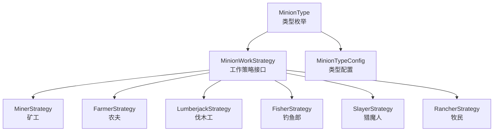
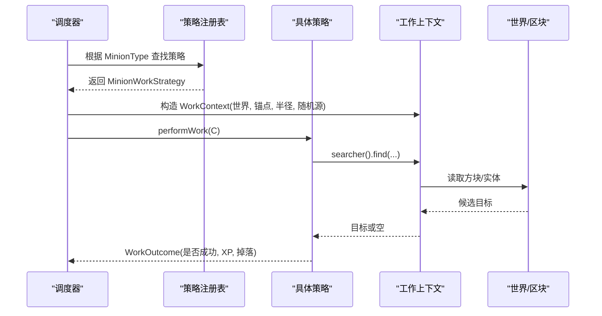
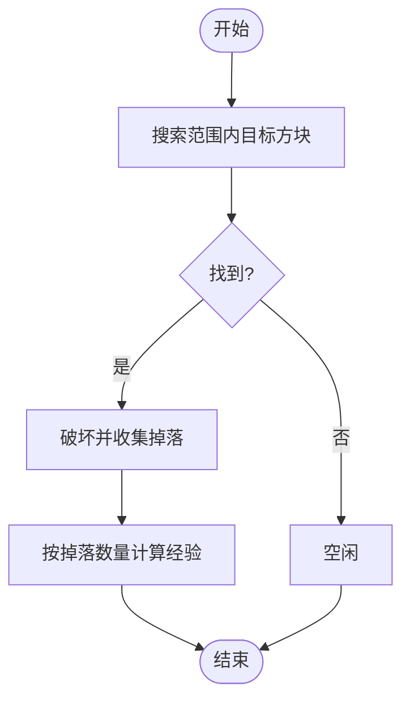
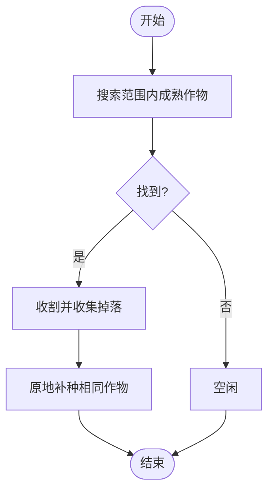
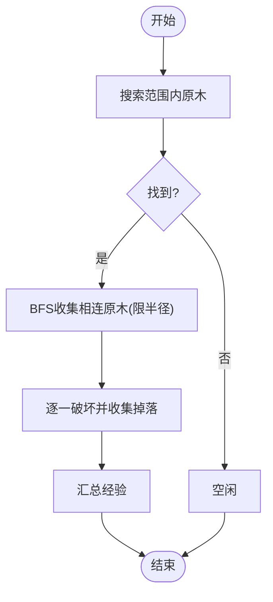
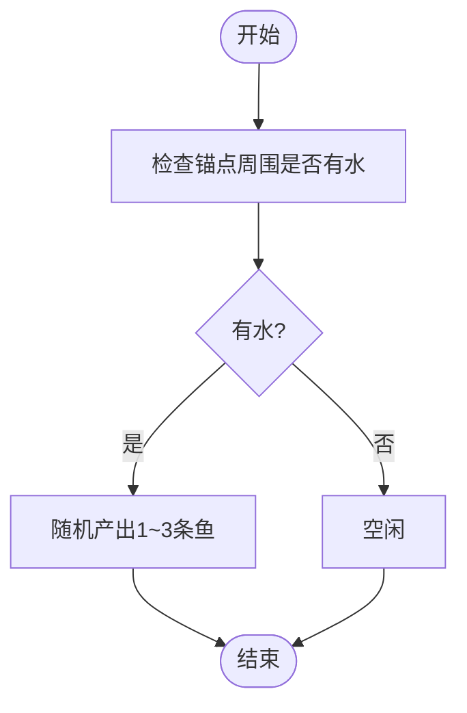
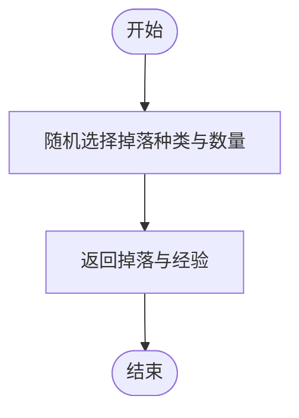
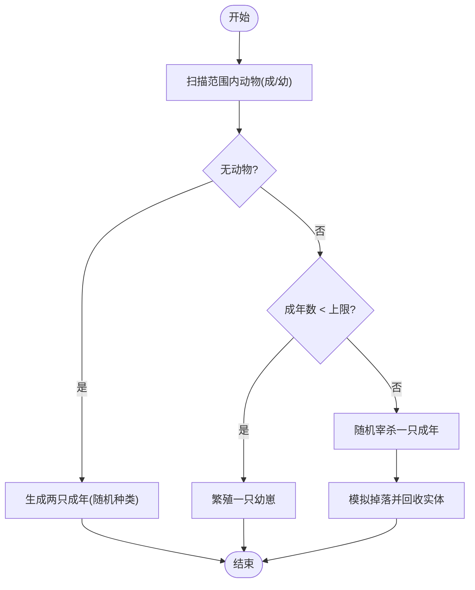
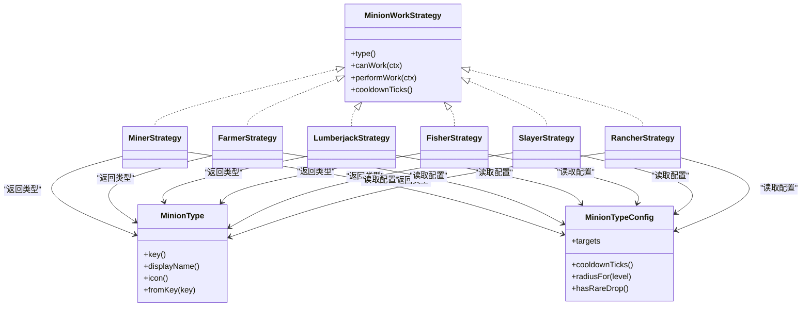

# 仆从类型详解

<cite>
**本文引用的文件**
- [MinionType.java](file://src/main/java/com/hcs/minions/model/MinionType.java)
- [MinionWorkStrategy.java](file://src/main/java/com/hcs/minions/work/MinionWorkStrategy.java)
- [MinionTypeConfig.java](file://src/main/java/com/hcs/minions/config/MinionTypeConfig.java)
- [MinerStrategy.java](file://src/main/java/com/hcs/minions/work/miner/MinerStrategy.java)
- [FarmerStrategy.java](file://src/main/java/com/hcs/minions/work/farmer/FarmerStrategy.java)
- [LumberjackStrategy.java](file://src/main/java/com/hcs/minions/work/lumberjack/LumberjackStrategy.java)
- [FisherStrategy.java](file://src/main/java/com/hcs/minions/work/fisher/FisherStrategy.java)
- [SlayerStrategy.java](file://src/main/java/com/hcs/minions/work/slayer/SlayerStrategy.java)
- [RancherStrategy.java](file://src/main/java/com/hcs/minions/work/rancher/RancherStrategy.java)
</cite>

## 目录
1. [简介](#简介)
2. [项目结构](#项目结构)
3. [核心组件](#核心组件)
4. [架构总览](#架构总览)
5. [详细组件分析](#详细组件分析)
6. [依赖关系分析](#依赖关系分析)
7. [性能考量](#性能考量)
8. [故障排查指南](#故障排查指南)
9. [结论](#结论)
10. [附录：扩展新仆从类型的开发指南与最佳实践](#附录：扩展新仆从类型的开发指南与最佳实践)

## 简介
本文件系统性梳理 SkyMinions 中的七种仆从类型，围绕其特性、工作范围、产出物品与特殊机制展开，并解释 MinionType 枚举的设计模式与类型标识系统。同时给出每种类型的配置项说明、性能影响、使用场景，以及扩展新仆从类型的开发指南与最佳实践，帮助开发者与服务端管理员高效理解与定制该模块。

## 项目结构
SkyMinions 的仆从系统采用“策略模式 + 类型注册”的解耦设计：
- 类型定义：MinionType 枚举集中声明所有内置仆从类型及其元数据（键名、显示名、图标）。
- 策略接口：MinionWorkStrategy 统一抽象“能否工作、执行一次工作、冷却时间”等能力。
- 具体实现：每个 work/* 子包对应一种仆从的具体工作逻辑（矿工、农夫、伐木工、钓鱼郎、猎魔人、牧民、圆石匠）。
- 配置模型：MinionTypeConfig 为每种类型提供强类型配置（最大等级、效率曲线、燃料、冷却、目标方块集、稀有掉落等）。

图表来源
- [MinionType.java:13-20](file://src/main/java/com/hcs/minions/model/MinionType.java#L13-L20)
- [MinionWorkStrategy.java:10-26](file://src/main/java/com/hcs/minions/work/MinionWorkStrategy.java#L10-L26)
- [MinerStrategy.java:18-56](file://src/main/java/com/hcs/minions/work/miner/MinerStrategy.java#L18-L56)
- [FarmerStrategy.java:20-70](file://src/main/java/com/hcs/minions/work/farmer/FarmerStrategy.java#L20-L70)
- [LumberjackStrategy.java:24-110](file://src/main/java/com/hcs/minions/work/lumberjack/LumberjackStrategy.java#L24-L110)
- [FisherStrategy.java:17-59](file://src/main/java/com/hcs/minions/work/fisher/FisherStrategy.java#L17-L59)
- [SlayerStrategy.java:16-50](file://src/main/java/com/hcs/minions/work/slayer/SlayerStrategy.java#L16-L50)
- [RancherStrategy.java:30-135](file://src/main/java/com/hcs/minions/work/rancher/RancherStrategy.java#L30-L135)

章节来源
- [MinionType.java:13-20](file://src/main/java/com/hcs/minions/model/MinionType.java#L13-L20)
- [MinionWorkStrategy.java:10-26](file://src/main/java/com/hcs/minions/work/MinionWorkStrategy.java#L10-L26)
- [MinionTypeConfig.java:21-63](file://src/main/java/com/hcs/minions/config/MinionTypeConfig.java#L21-L63)

## 核心组件
- 类型枚举 MinionType：以 key/displayName/icon 三元组描述类型，并提供 fromKey 解析，确保类型在配置与运行时可双向映射。
- 策略接口 MinionWorkStrategy：统一 canWork/performWork/cooldownTicks 三要素，屏蔽具体实现差异，调度器仅面向接口编程。
- 类型配置 MinionTypeConfig：封装每种类型的行为参数（目标方块集、稀有掉落、效率与升级成本、基础半径、冷却等），便于服主调参与平衡。

章节来源
- [MinionType.java:22-51](file://src/main/java/com/hcs/minions/model/MinionType.java#L22-L51)
- [MinionWorkStrategy.java:12-25](file://src/main/java/com/hcs/minions/work/MinionWorkStrategy.java#L12-L25)
- [MinionTypeConfig.java:21-63](file://src/main/java/com/hcs/minions/config/MinionTypeConfig.java#L21-L63)

## 架构总览
下图展示“类型 → 策略 → 工作上下文”的调用关系。调度器通过 WorkContext 获取搜索器、世界、锚点、半径、随机源等环境信息，交由具体策略完成一次工作循环。

图表来源
- [MinionWorkStrategy.java:15-25](file://src/main/java/com/hcs/minions/work/MinionWorkStrategy.java#L15-L25)
- [MinerStrategy.java:37-50](file://src/main/java/com/hcs/minions/work/miner/MinerStrategy.java#L37-L50)
- [FarmerStrategy.java:39-53](file://src/main/java/com/hcs/minions/work/farmer/FarmerStrategy.java#L39-L53)
- [LumberjackStrategy.java:45-63](file://src/main/java/com/hcs/minions/work/lumberjack/LumberjackStrategy.java#L45-L63)
- [FisherStrategy.java:49-53](file://src/main/java/com/hcs/minions/work/fisher/FisherStrategy.java#L49-L53)
- [SlayerStrategy.java:40-44](file://src/main/java/com/hcs/minions/work/slayer/SlayerStrategy.java#L40-L44)
- [RancherStrategy.java:64-96](file://src/main/java/com/hcs/minions/work/rancher/RancherStrategy.java#L64-L96)

## 详细组件分析

### 矿工（MINER）
- 工作范围：基于 WorkContext.radius() 的切比雪夫范围，由搜索器按目标方块集筛选。
- 产出物品：破坏目标方块后获得的掉落物；经验值按掉落数量累计。
- 特殊机制：确定性螺旋搜索（由搜索器实现），命中即破坏并采集。
- 配置要点：targets 指定可开采方块集合；cooldownTicks 控制工作频率；baseRadius 固定为 5x5（不随等级变化）。
- 性能影响：每次工作进行一次有限范围的方块查询与破坏，开销较低。
- 使用场景：自动化矿石采集、资源型服务器的基础资源产出。

图表来源
- [MinerStrategy.java:37-50](file://src/main/java/com/hcs/minions/work/miner/MinerStrategy.java#L37-L50)

章节来源
- [MinerStrategy.java:18-56](file://src/main/java/com/hcs/minions/work/miner/MinerStrategy.java#L18-L56)
- [MinionTypeConfig.java:21-63](file://src/main/java/com/hcs/minions/config/MinionTypeConfig.java#L21-L63)

### 农夫（FARMER）
- 工作范围：同矿工，基于 radius 与 targets。
- 产出物品：成熟作物的掉落；收割后原地补种同一作物。
- 特殊机制：仅对 Ageable 且达到最大年龄的作物进行收割；非 Ageable 的可成熟作物直接视为成熟。
- 配置要点：targets 包含各类农作物；cooldownTicks 控制收割频率。
- 性能影响：单次工作一次搜索 + 一次破坏 + 一次设置方块状态，开销低。
- 使用场景：农场自动化、食物与材料稳定产出。

图表来源
- [FarmerStrategy.java:39-64](file://src/main/java/com/hcs/minions/work/farmer/FarmerStrategy.java#L39-L64)

章节来源
- [FarmerStrategy.java:20-70](file://src/main/java/com/hcs/minions/work/farmer/FarmerStrategy.java#L20-L70)

### 伐木工（LUMBERJACK）
- 工作范围：基于 radius 的目标原木集合。
- 产出物品：整棵树的原木及附属掉落（由游戏机制决定）。
- 特殊机制：BFS 收集相连原木，但严格限制在工作半径内，避免“虚空砍树”。支持多种原木类型与 2x2 树形。
- 配置要点：targets 包含各类原木；cooldownTicks 控制砍树频率。
- 性能影响：BFS 遍历受 MAX_TREE_LOGS 与工作半径双重限制，内存与 CPU 可控。
- 使用场景：木材自动化、大型建筑资源供应。

图表来源
- [LumberjackStrategy.java:45-104](file://src/main/java/com/hcs/minions/work/lumberjack/LumberjackStrategy.java#L45-L104)

章节来源
- [LumberjackStrategy.java:24-110](file://src/main/java/com/hcs/minions/work/lumberjack/LumberjackStrategy.java#L24-L110)

### 钓鱼郎（FISHER）
- 工作范围：锚点周围 5x5 平面检测是否有水。
- 产出物品：随机鱼类（鱼、河豚、热带鱼等），数量为 1~3。
- 特殊机制：不破坏方块，纯模拟钓鱼产出；若附近无水则不工作。
- 配置要点：cooldownTicks 控制钓鱼频率；无需 targets。
- 性能影响：极轻量，仅方块类型检查与随机数生成。
- 使用场景：无矿/无树环境的稳定食物产出。

图表来源
- [FisherStrategy.java:35-53](file://src/main/java/com/hcs/minions/work/fisher/FisherStrategy.java#L35-L53)

章节来源
- [FisherStrategy.java:17-59](file://src/main/java/com/hcs/minions/work/fisher/FisherStrategy.java#L17-L59)

### 猎魔人（SLAYER）
- 工作范围：无环境限制，始终可工作。
- 产出物品：怪物掉落（腐肉、骨头、蜘蛛眼、火药、线、末影珍珠等），数量为 1~2。
- 特殊机制：不生成实体，纯模拟击杀掉落，避免刷怪负担。
- 配置要点：cooldownTicks 控制战斗频率；无需 targets。
- 性能影响：极低，仅随机数与物品创建。
- 使用场景：通用资源产出、打怪收益替代方案。

图表来源
- [SlayerStrategy.java:40-44](file://src/main/java/com/hcs/minions/work/slayer/SlayerStrategy.java#L40-L44)

章节来源
- [SlayerStrategy.java:16-50](file://src/main/java/com/hcs/minions/work/slayer/SlayerStrategy.java#L16-L50)

### 牧民（RANCHER）
- 工作范围：以锚点为中心的立方体区域（半径+0.5）。
- 产出物品：宰杀成年动物后的主副产物（如牛肉/皮革、羊肉/羊毛、鸡肉/羽毛、猪肉），数量近似原版区间。
- 特殊机制：
  - 空场引种：生成两只成年动物（随机种类），本次无产出。
  - 繁殖：当成年不足上限时，随机选取现有种群种类生成幼崽。
  - 宰杀：成年达到上限时，随机宰杀一只并模拟掉落。
  - 生成的动物设为“远离不消失”，保证区块卸载存活。
- 配置要点：cooldownTicks 控制管理频率；无需 targets。
- 性能影响：涉及实体扫描与生成/移除，需关注服务器负载与实体上限。
- 使用场景：畜牧自动化、肉类与材料稳定产出。

图表来源
- [RancherStrategy.java:64-135](file://src/main/java/com/hcs/minions/work/rancher/RancherStrategy.java#L64-L135)

章节来源
- [RancherStrategy.java:30-135](file://src/main/java/com/hcs/minions/work/rancher/RancherStrategy.java#L30-L135)

### 圆石匠（COBBLE）
- 工作范围：以锚点为中心的区域（半径由配置决定）。
- 产出物品：自动生成的圆石（由生成器策略实现）。
- 特殊机制：周期性生成圆石块，无需外部资源与环境条件。
- 配置要点：cooldownTicks 控制生成频率；baseRadius 控制生成区域大小。
- 性能影响：方块放置操作，开销较低。
- 使用场景：无矿环境下的基础建材产出。

章节来源
- [MinionTypeConfig.java:21-63](file://src/main/java/com/hcs/minions/config/MinionTypeConfig.java#L21-L63)

## 依赖关系分析
- MinionType 作为领域内一等公民，提供稳定的类型标识（key/displayName/icon），并通过 fromKey 进行字符串到枚举的安全转换。
- 各策略均依赖 MinionTypeConfig 获取行为参数（targets、cooldown、rareDrop 等），从而将“配置驱动”与“逻辑实现”解耦。
- 策略间无直接耦合，仅通过统一的 MinionWorkStrategy 接口与 WorkContext 交互，降低复杂度与回归风险。

图表来源
- [MinionType.java:22-51](file://src/main/java/com/hcs/minions/model/MinionType.java#L22-L51)
- [MinionWorkStrategy.java:12-25](file://src/main/java/com/hcs/minions/work/MinionWorkStrategy.java#L12-L25)
- [MinerStrategy.java:27-56](file://src/main/java/com/hcs/minions/work/miner/MinerStrategy.java#L27-L56)
- [FarmerStrategy.java:29-70](file://src/main/java/com/hcs/minions/work/farmer/FarmerStrategy.java#L29-L70)
- [LumberjackStrategy.java:35-110](file://src/main/java/com/hcs/minions/work/lumberjack/LumberjackStrategy.java#L35-L110)
- [FisherStrategy.java:29-59](file://src/main/java/com/hcs/minions/work/fisher/FisherStrategy.java#L29-L59)
- [SlayerStrategy.java:29-50](file://src/main/java/com/hcs/minions/work/slayer/SlayerStrategy.java#L29-L50)
- [RancherStrategy.java:53-135](file://src/main/java/com/hcs/minions/work/rancher/RancherStrategy.java#L53-L135)
- [MinionTypeConfig.java:21-63](file://src/main/java/com/hcs/minions/config/MinionTypeConfig.java#L21-L63)

章节来源
- [MinionType.java:22-51](file://src/main/java/com/hcs/minions/model/MinionType.java#L22-L51)
- [MinionWorkStrategy.java:12-25](file://src/main/java/com/hcs/minions/work/MinionWorkStrategy.java#L12-L25)
- [MinionTypeConfig.java:21-63](file://src/main/java/com/hcs/minions/config/MinionTypeConfig.java#L21-L63)

## 性能考量
- 搜索与破坏：矿工、农夫、伐木工会进行方块查询与破坏，建议合理设置 cooldownTicks 与 baseRadius，避免高频全图扫描。
- 实体操作：牧民生成/移除实体，注意服务器实体上限与 TPS 波动；在高并发或多实例环境下应谨慎调整。
- 随机与内存：伐木工的 BFS 有 MAX_TREE_LOGS 与工作半径限制，防止极端情况下的内存与 CPU 峰值。
- 稀有掉落：开启 rareDrop 会增加额外判定与物品创建开销，建议仅在必要时启用。

## 故障排查指南
- 农夫不工作：确认目标方块是否为 Ageable 且达到最大年龄；检查 targets 是否包含对应作物。
- 伐木工“虚空砍树”：确认工作半径配置是否正确；BFS 已限制在半径内，若仍异常请检查锚点位置与区块加载状态。
- 钓鱼郎不工作：检查锚点周围 5x5 平面是否存在水；若无水则不会触发。
- 猎魔人不产出：确认服务端的随机源可用；如无其他限制，应能稳定产出。
- 牧民不繁殖/不宰杀：检查区域内动物数量与种类；确认成年上限与 spawn 位点是否满足条件。
- 圆石匠不生成：确认生成器策略已正确注册；检查冷却时间与半径配置。

章节来源
- [FarmerStrategy.java:56-64](file://src/main/java/com/hcs/minions/work/farmer/FarmerStrategy.java#L56-L64)
- [LumberjackStrategy.java:65-104](file://src/main/java/com/hcs/minions/work/lumberjack/LumberjackStrategy.java#L65-L104)
- [FisherStrategy.java:35-46](file://src/main/java/com/hcs/minions/work/fisher/FisherStrategy.java#L35-L46)
- [RancherStrategy.java:75-96](file://src/main/java/com/hcs/minions/work/rancher/RancherStrategy.java#L75-L96)

## 结论
SkyMinions 通过 MinionType 枚举与 MinionWorkStrategy 策略模式实现了高内聚、低耦合的仆从系统。七种类型覆盖资源采集、农业、林业、渔业、战斗模拟、畜牧与自动方块生成等常见需求，配合强类型配置可实现灵活调参与扩展。遵循本文档的配置与开发建议，可在保障性能的前提下快速搭建稳定的自动化生产链。

## 附录：扩展新仆从类型的开发指南与最佳实践
- 新增类型
  - 在 MinionType 中增加枚举项，提供 key、displayName、icon。
  - 在 work 下新建子包与策略类，实现 MinionWorkStrategy，并在注册表中注册（由框架负责）。
  - 在 MinionTypeConfig 中为该类型配置 targets、cooldown、rareDrop 等参数。
- 工作逻辑
  - canWork：轻量前置判断（如环境检查）。
  - performWork：基于 WorkContext 的 searcher/anchor/radius/random 完成一次工作，返回 WorkOutcome。
  - cooldownTicks：依据类型语义设定合理冷却。
- 性能与安全
  - 避免无界搜索与无限循环；对 BFS/DFS 设置上限。
  - 减少不必要的实体生成与频繁方块更新。
  - 合理使用随机源，保证结果可复现与可测试。
- 配置与平衡
  - 通过 baseEfficiency、efficiencyPerLevel、upgradeCost 等调节成长曲线。
  - 稀有掉落 rareDropChance 需谨慎开启，避免经济失衡。
- 测试与验证
  - 针对边界条件（无目标、满产、极端地形）编写用例。
  - 验证不同版本/平台下的行为一致性。

章节来源
- [MinionType.java:13-20](file://src/main/java/com/hcs/minions/model/MinionType.java#L13-L20)
- [MinionWorkStrategy.java:12-25](file://src/main/java/com/hcs/minions/work/MinionWorkStrategy.java#L12-L25)
- [MinionTypeConfig.java:21-63](file://src/main/java/com/hcs/minions/config/MinionTypeConfig.java#L21-L63)