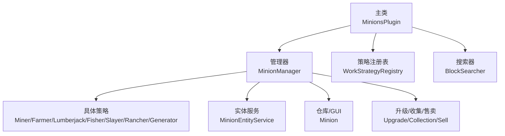
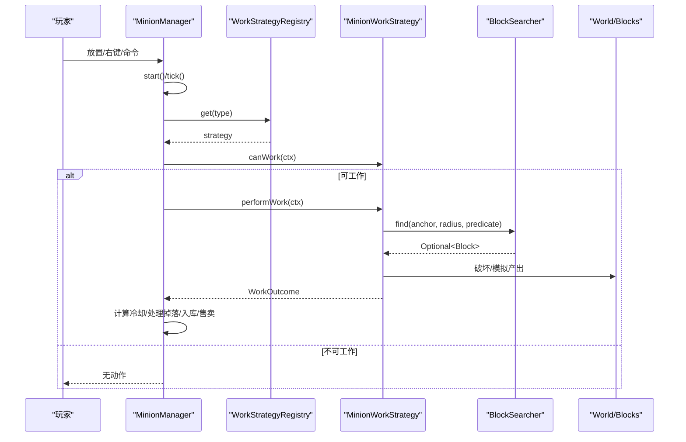
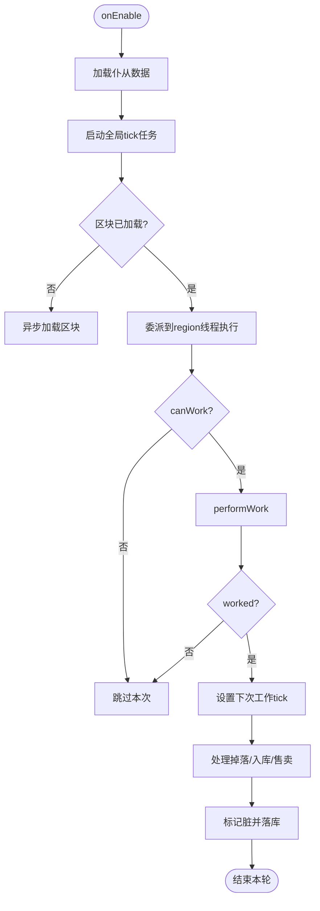
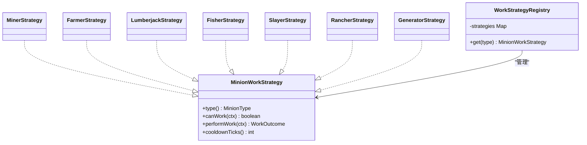
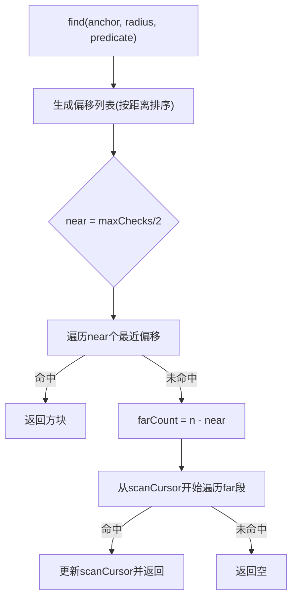
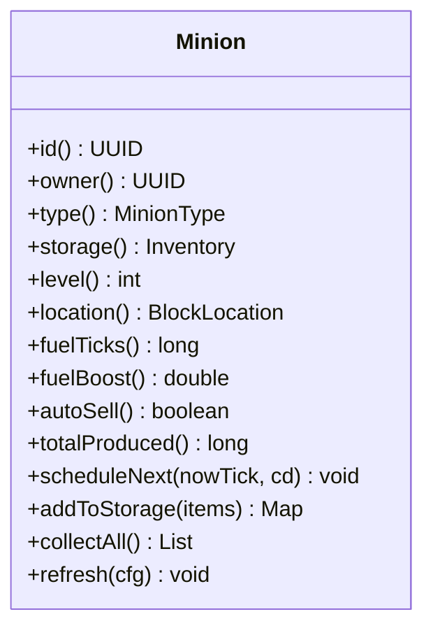
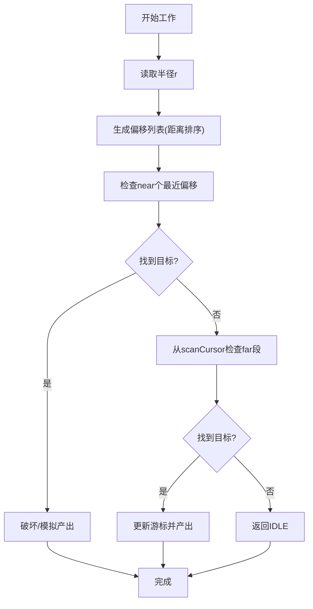
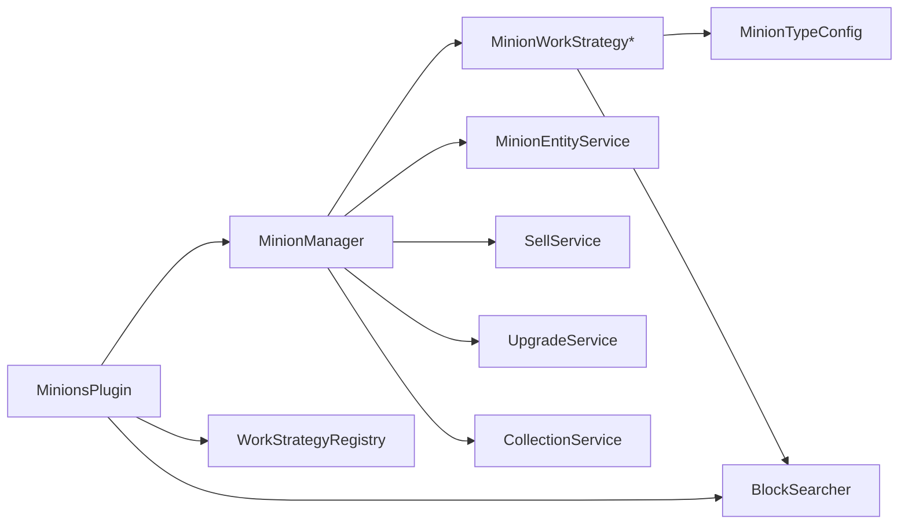

# 仆从系统

<cite>
**本文引用的文件**
- [MinionsPlugin.java](file://src/main/java/com/hcs/minions/MinionsPlugin.java)
- [MinionManager.java](file://src/main/java/com/hcs/minions/service/MinionManager.java)
- [MinionWorkStrategy.java](file://src/main/java/com/hcs/minions/work/MinionWorkStrategy.java)
- [WorkStrategyRegistry.java](file://src/main/java/com/hcs/minions/work/WorkStrategyRegistry.java)
- [MinionType.java](file://src/main/java/com/hcs/minions/model/MinionType.java)
- [Minion.java](file://src/main/java/com/hcs/minions/model/Minion.java)
- [BlockSearcher.java](file://src/main/java/com/hcs/minions/service/BlockSearcher.java)
- [WorkContext.java](file://src/main/java/com/hcs/minions/work/WorkContext.java)
- [WorkOutcome.java](file://src/main/java/com/hcs/minions/work/WorkOutcome.java)
- [MinerStrategy.java](file://src/main/java/com/hcs/minions/work/miner/MinerStrategy.java)
- [FarmerStrategy.java](file://src/main/java/com/hcs/minions/work/farmer/FarmerStrategy.java)
- [LumberjackStrategy.java](file://src/main/java/com/hcs/minions/work/lumberjack/LumberjackStrategy.java)
- [FisherStrategy.java](file://src/main/java/com/hcs/minions/work/fisher/FisherStrategy.java)
- [SlayerStrategy.java](file://src/main/java/com/hcs/minions/work/slayer/SlayerStrategy.java)
- [RancherStrategy.java](file://src/main/java/com/hcs/minions/work/rancher/RancherStrategy.java)
</cite>

## 目录
1. [简介](#简介)
2. [项目结构](#项目结构)
3. [核心组件](#核心组件)
4. [架构总览](#架构总览)
5. [详细组件分析](#详细组件分析)
6. [依赖关系分析](#依赖关系分析)
7. [性能考量](#性能考量)
8. [故障排查指南](#故障排查指南)
9. [结论](#结论)
10. [附录：扩展新仆从类型指南](#附录：扩展新仆从类型指南)

## 简介
本插件实现了一个“仆从”自动化采集与产出系统，支持七种仆从类型（矿工、农夫、伐木工、钓鱼、猎魔、牧民、圆石生成器）。系统通过策略模式将不同工作逻辑解耦，使用限流搜索算法在固定范围内高效寻找目标，结合 GUI 仓库、升级模块、自动售卖与离线收益等特性，提供完整的生产循环。

## 项目结构
- 入口与装配：主类负责加载配置、注册服务、装配策略、启动调度与事件监听。
- 管理器：全局单调度器，按 tick 遍历并委派到区域线程执行工作。
- 策略层：每种仆从类型一个策略实现，统一接口 MinionWorkStrategy。
- 搜索器：BlockSearcher 提供两阶段螺旋扫描，限制每周期检查次数。
- 模型与数据：Minion 持有状态、GUI 仓库、冷却与燃料；MinionType 枚举定义类型。
- 交互与事件：GUI 监听、放置/移除事件、玩家加入离线奖励。

图表来源
- [MinionsPlugin.java:52-118](file://src/main/java/com/hcs/minions/MinionsPlugin.java#L52-L118)
- [MinionManager.java:92-115](file://src/main/java/com/hcs/minions/service/MinionManager.java#L92-L115)

章节来源
- [MinionsPlugin.java:52-118](file://src/main/java/com/hcs/minions/MinionsPlugin.java#L52-L118)
- [MinionManager.java:92-115](file://src/main/java/com/hcs/minions/service/MinionManager.java#L92-L115)

## 核心组件
- 策略接口与注册表：MinionWorkStrategy 定义 canWork/performWork/cooldownTicks；WorkStrategyRegistry 以 EnumMap 维护类型到策略的映射，新增类型无需修改调度逻辑。
- 管理器：MinionManager 维护仆从集合、全局 tick 任务、快照落库、自动售卖轮询、放置/移除、打开 GUI 等。
- 搜索器：BlockSearcher 两阶段扫描，近处优先、远处游标推进，单周期最多检查固定数量方块。
- 模型：Minion 管理等级、存储槽位、燃料、冷却、皮肤、模块槽、GUI 渲染与仓库操作。
- 上下文与结果：WorkContext 封装单次工作所需环境；WorkOutcome 返回是否工作、经验与掉落。

章节来源
- [MinionWorkStrategy.java:10-26](file://src/main/java/com/hcs/minions/work/MinionWorkStrategy.java#L10-L26)
- [WorkStrategyRegistry.java:14-33](file://src/main/java/com/hcs/minions/work/WorkStrategyRegistry.java#L14-L33)
- [MinionManager.java:44-86](file://src/main/java/com/hcs/minions/service/MinionManager.java#L44-L86)
- [BlockSearcher.java:14-66](file://src/main/java/com/hcs/minions/service/BlockSearcher.java#L14-L66)
- [Minion.java:28-138](file://src/main/java/com/hcs/minions/model/Minion.java#L28-L138)
- [WorkContext.java:10-21](file://src/main/java/com/hcs/minions/work/WorkContext.java#L10-L21)
- [WorkOutcome.java:7-21](file://src/main/java/com/hcs/minions/work/WorkOutcome.java#L7-L21)

## 架构总览
系统采用“管理器 + 策略 + 搜索器”的分层设计：
- 管理器负责生命周期与调度，不关心具体工作细节。
- 策略只关注自身类型的语义判断与工作执行。
- 搜索器提供统一的限流寻址能力，避免全量扫描。

图表来源
- [MinionManager.java:191-322](file://src/main/java/com/hcs/minions/service/MinionManager.java#L191-L322)
- [WorkStrategyRegistry.java:18-32](file://src/main/java/com/hcs/minions/work/WorkStrategyRegistry.java#L18-L32)
- [BlockSearcher.java:34-66](file://src/main/java/com/hcs/minions/service/BlockSearcher.java#L34-L66)

## 详细组件分析

### 管理器与生命周期
- 启动：加载所有仆从数据，注册全局 tick 任务与快照落库任务，启动自动售卖轮询。
- 遍历：tick 仅做内存与区块加载判断，真正触碰世界/库存的操作全部委派到对应 region 线程。
- 工作：根据类型查表获取策略，构建 WorkContext，调用 canWork/performWork，计算冷却并处理掉落。
- 持久化：定期收集脏标记仆从，在其 region 线程生成快照并批量落库。
- 停止：关闭任务、关闭 GUI、冲刷数据、清理实体。

图表来源
- [MinionManager.java:92-115](file://src/main/java/com/hcs/minions/service/MinionManager.java#L92-L115)
- [MinionManager.java:191-322](file://src/main/java/com/hcs/minions/service/MinionManager.java#L191-L322)

章节来源
- [MinionManager.java:92-115](file://src/main/java/com/hcs/minions/service/MinionManager.java#L92-L115)
- [MinionManager.java:191-322](file://src/main/java/com/hcs/minions/service/MinionManager.java#L191-L322)

### 工作策略模式
- 接口设计：MinionWorkStrategy 暴露 type/canWork/performWork/cooldownTicks，屏蔽 if-else 类型分支。
- 注册表：WorkStrategyRegistry 使用 EnumMap 维护类型到策略的映射，get 未注册类型抛异常，保证开闭原则。
- 具体策略：每个类型一个类，内部依赖 MinionTypeConfig 与 BlockSearcher，遵循相同流程。

图表来源
- [MinionWorkStrategy.java:10-26](file://src/main/java/com/hcs/minions/work/MinionWorkStrategy.java#L10-L26)
- [WorkStrategyRegistry.java:14-33](file://src/main/java/com/hcs/minions/work/WorkStrategyRegistry.java#L14-L33)
- [MinerStrategy.java:18-56](file://src/main/java/com/hcs/minions/work/miner/MinerStrategy.java#L18-L56)
- [FarmerStrategy.java:20-70](file://src/main/java/com/hcs/minions/work/farmer/FarmerStrategy.java#L20-L70)
- [LumberjackStrategy.java:24-110](file://src/main/java/com/hcs/minions/work/lumberjack/LumberjackStrategy.java#L24-L110)
- [FisherStrategy.java:17-59](file://src/main/java/com/hcs/minions/work/fisher/FisherStrategy.java#L17-L59)
- [SlayerStrategy.java:16-50](file://src/main/java/com/hcs/minions/work/slayer/SlayerStrategy.java#L16-L50)
- [RancherStrategy.java:30-135](file://src/main/java/com/hcs/minions/work/rancher/RancherStrategy.java#L30-L135)

章节来源
- [MinionWorkStrategy.java:10-26](file://src/main/java/com/hcs/minions/work/MinionWorkStrategy.java#L10-L26)
- [WorkStrategyRegistry.java:14-33](file://src/main/java/com/hcs/minions/work/WorkStrategyRegistry.java#L14-L33)

### 搜索算法与工作范围
- 范围限制：半径 r 表示以锚点为中心的切比雪夫距离 r，形成 (2r+1)x(2r+1) 的工作面。默认基础半径为 2，即 5x5 固定区域。
- 搜索策略：两阶段螺旋扫描，近处优先命中，远处游标推进，单周期最多检查 HARD_LIMIT 个偏移。
- 复杂度：每次 find 最多 O(maxChecks) 次方块访问，避免全量扫描。

图表来源
- [BlockSearcher.java:34-66](file://src/main/java/com/hcs/minions/service/BlockSearcher.java#L34-L66)
- [BlockSearcher.java:68-91](file://src/main/java/com/hcs/minions/service/BlockSearcher.java#L68-L91)

章节来源
- [BlockSearcher.java:14-66](file://src/main/java/com/hcs/minions/service/BlockSearcher.java#L14-L66)

### 七种仆从类型与工作机制
- 矿工：查找可采矿块，破坏并采集掉落。
- 农夫：仅收割成熟作物，收割后原地补种。
- 伐木工：找到原木后用 BFS 收集相连原木（限制在工作半径内），一次性砍光。
- 钓鱼：附近有水即工作，随机产出鱼类（不破坏方块）。
- 猎魔：模拟击杀怪物，随机产出怪物掉落（不生成实体）。
- 牧民：照看牧场动物——空场引种、成年不足繁殖、达到上限宰杀产出。
- 圆石生成器：由配置驱动，按类型策略工作（同其他策略接口）。

章节来源
- [MinerStrategy.java:18-56](file://src/main/java/com/hcs/minions/work/miner/MinerStrategy.java#L18-L56)
- [FarmerStrategy.java:20-70](file://src/main/java/com/hcs/minions/work/farmer/FarmerStrategy.java#L20-L70)
- [LumberjackStrategy.java:24-110](file://src/main/java/com/hcs/minions/work/lumberjack/LumberjackStrategy.java#L24-L110)
- [FisherStrategy.java:17-59](file://src/main/java/com/hcs/minions/work/fisher/FisherStrategy.java#L17-L59)
- [SlayerStrategy.java:16-50](file://src/main/java/com/hcs/minions/work/slayer/SlayerStrategy.java#L16-L50)
- [RancherStrategy.java:30-135](file://src/main/java/com/hcs/minions/work/rancher/RancherStrategy.java#L30-L135)

### 状态管理与 GUI 交互
- 状态字段：等级、位置、燃料（限时/永久）、效率、冷却时间戳、自动售卖开关、累计产出、皮肤、模块槽等。
- GUI 布局：54 格界面，顶栏显示燃料/信息卡/头颅/升级/皮肤，存储区 36 格随等级解锁，底栏包含收集全部/自动售卖/理想布局/拾取/关闭。
- 仓库操作：添加物品、合并堆叠、清空收集、消耗指定物料、删除匹配物品。
- 交互：右键小人打开 GUI，点击按钮触发升级、切换皮肤、收集、开启自动售卖、拾取仆从等。

图表来源
- [Minion.java:28-138](file://src/main/java/com/hcs/minions/model/Minion.java#L28-L138)
- [Minion.java:285-588](file://src/main/java/com/hcs/minions/model/Minion.java#L285-L588)
- [Minion.java:606-799](file://src/main/java/com/hcs/minions/model/Minion.java#L606-L799)

章节来源
- [Minion.java:28-138](file://src/main/java/com/hcs/minions/model/Minion.java#L28-L138)
- [Minion.java:285-588](file://src/main/java/com/hcs/minions/model/Minion.java#L285-L588)
- [Minion.java:606-799](file://src/main/java/com/hcs/minions/model/Minion.java#L606-L799)

### 工作范围与搜索流程图
- 范围：半径 r 决定工作面的边长 (2r+1)。
- 搜索：先近后远，游标推进确保公平性。
- 失败：返回 IDLE，不推进冷却与燃料。

图表来源
- [BlockSearcher.java:34-66](file://src/main/java/com/hcs/minions/service/BlockSearcher.java#L34-L66)

章节来源
- [BlockSearcher.java:34-66](file://src/main/java/com/hcs/minions/service/BlockSearcher.java#L34-L66)

## 依赖关系分析
- 主类依赖：配置、异步执行器、仓库、经济、权限、升级、收集、实体、售卖、策略注册表、搜索器、管理器。
- 管理器依赖：策略注册表、搜索器、实体服务、售卖、升级、收集、权限、异步执行器。
- 策略依赖：MinionTypeConfig、BlockSearcher、BlockOps（破坏与收集）。
- 模型依赖：Inventory、Material、NamespacedKey、PersistenceDataContainer（燃料提示）。

图表来源
- [MinionsPlugin.java:52-118](file://src/main/java/com/hcs/minions/MinionsPlugin.java#L52-L118)
- [MinionManager.java:44-86](file://src/main/java/com/hcs/minions/service/MinionManager.java#L44-L86)

章节来源
- [MinionsPlugin.java:52-118](file://src/main/java/com/hcs/minions/MinionsPlugin.java#L52-L118)
- [MinionManager.java:44-86](file://src/main/java/com/hcs/minions/service/MinionManager.java#L44-L86)

## 性能考量
- 线程安全：tick 仅在 GlobalRegionScheduler 上做轻量判断，所有区域绑定操作通过 RegionScheduler 委派，兼容 Folia。
- 搜索限流：BlockSearcher 硬限制每周期检查数，避免卡顿。
- 快照落库：异步收集脏标记，在各自 region 线程生成快照并批量写入，减少竞争。
- 自动售卖：轮询在 GlobalRegionScheduler 上执行，逐个委派到 region 线程进行 Inventory 操作。
- 实体管理：盔甲架按需生成，卸载后自愈，异常时清理孤儿实体。

[本节为通用性能建议，不直接分析具体文件]

## 故障排查指南
- 未找到目标：调试日志会记录未找到目标的 anchor 坐标与半径，检查工作范围与目标方块配置。
- 线程问题：若出现 Inventory 或方块操作异常，确认是否在 region 线程执行；管理器已强制委派。
- 实体残留：重载后若有孤立盔甲架，管理器提供清理方法。
- 数据不一致：快照落库前会在 region 线程生成快照，避免并发读写导致中间态。

章节来源
- [MinionManager.java:266-280](file://src/main/java/com/hcs/minions/service/MinionManager.java#L266-L280)
- [MinionManager.java:397-413](file://src/main/java/com/hcs/minions/service/MinionManager.java#L397-L413)
- [MinionManager.java:124-160](file://src/main/java/com/hcs/minions/service/MinionManager.java#L124-L160)

## 结论
SkyMinions 通过清晰的职责划分与策略模式实现了可扩展的仆从系统。管理器专注调度与持久化，策略专注业务逻辑，搜索器保障性能。配合 GUI 仓库、升级模块、自动售卖与离线收益，形成了完整的自动化生产闭环。

[本节为总结性内容，不直接分析具体文件]

## 附录：扩展新仆从类型指南
- 步骤一：在 MinionType 中新增枚举项（key、displayName、icon）。
- 步骤二：创建新策略类实现 MinionWorkStrategy，实现 type/canWork/performWork/cooldownTicks。
- 步骤三：在 MinionsPlugin.onEnable 中通过 addStrategy 注册新策略。
- 步骤四：在 MinionTypeConfig 中配置该类型的目标方块、冷却、效率、稀有掉落等。
- 最佳实践：
  - 保持 canWork 轻量，复杂条件放入 performWork。
  - 使用 BlockSearcher.find 限定范围，避免全量扫描。
  - 掉落物通过 WorkOutcome 返回，交由管理器统一入库与售卖。
  - 如需与环境交互（如生成实体），注意线程安全与区域绑定。

章节来源
- [MinionType.java:13-51](file://src/main/java/com/hcs/minions/model/MinionType.java#L13-L51)
- [MinionWorkStrategy.java:10-26](file://src/main/java/com/hcs/minions/work/MinionWorkStrategy.java#L10-L26)
- [MinionsPlugin.java:70-79](file://src/main/java/com/hcs/minions/MinionsPlugin.java#L70-L79)