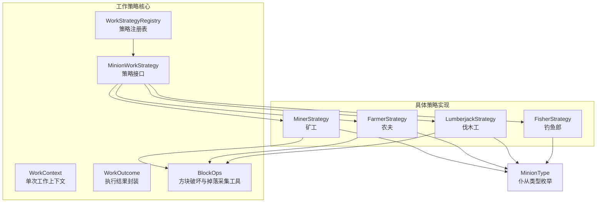
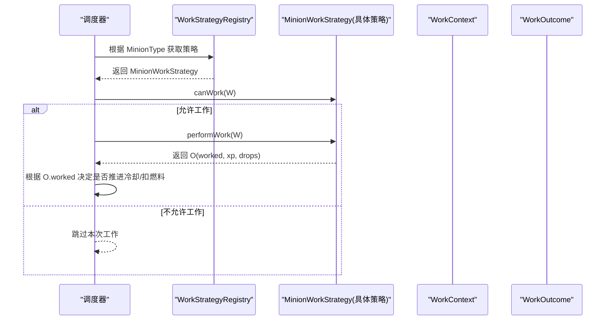
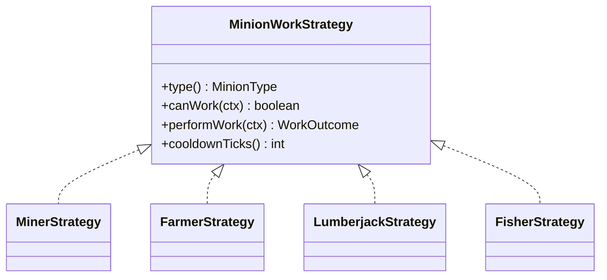
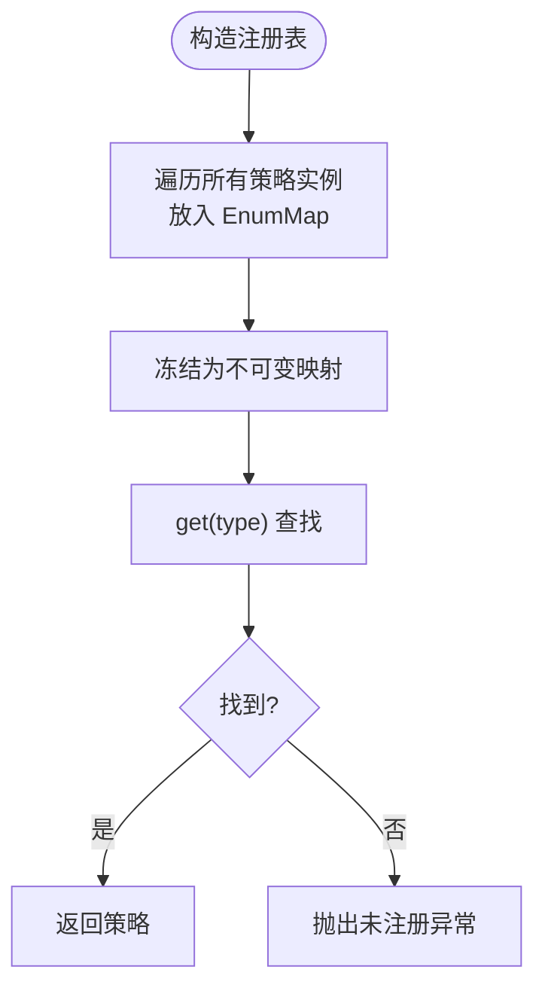
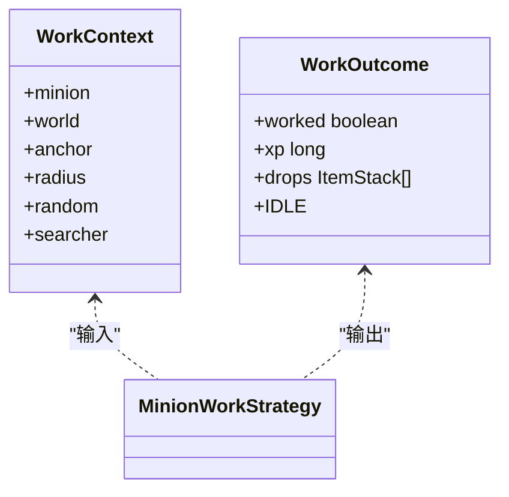
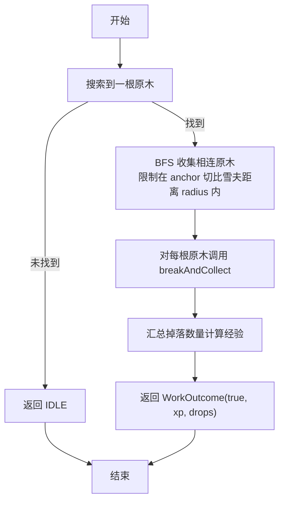
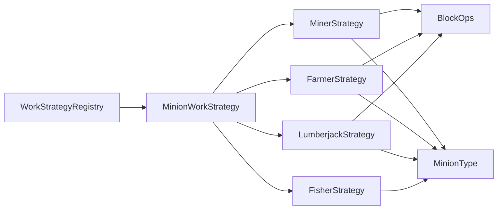

# 工作策略模式

<cite>
**本文引用的文件**
- [MinionWorkStrategy.java](file://src/main/java/com/hcs/minions/work/MinionWorkStrategy.java)
- [WorkStrategyRegistry.java](file://src/main/java/com/hcs/minions/work/WorkStrategyRegistry.java)
- [WorkContext.java](file://src/main/java/com/hcs/minions/work/WorkContext.java)
- [WorkOutcome.java](file://src/main/java/com/hcs/minions/work/WorkOutcome.java)
- [BlockOps.java](file://src/main/java/com/hcs/minions/work/BlockOps.java)
- [MinerStrategy.java](file://src/main/java/com/hcs/minions/work/miner/MinerStrategy.java)
- [FarmerStrategy.java](file://src/main/java/com/hcs/minions/work/farmer/FarmerStrategy.java)
- [LumberjackStrategy.java](file://src/main/java/com/hcs/minions/work/lumberjack/LumberjackStrategy.java)
- [FisherStrategy.java](file://src/main/java/com/hcs/minions/work/fisher/FisherStrategy.java)
- [MinionType.java](file://src/main/java/com/hcs/minions/model/MinionType.java)
</cite>

## 目录
1. [简介](#简介)
2. [项目结构](#项目结构)
3. [核心组件](#核心组件)
4. [架构总览](#架构总览)
5. [详细组件分析](#详细组件分析)
6. [依赖关系分析](#依赖关系分析)
7. [性能考量](#性能考量)
8. [故障排查指南](#故障排查指南)
9. [结论](#结论)
10. [附录：自定义策略开发指南](#附录自定义策略开发指南)

## 简介
本技术文档聚焦 SkyMinions 中的“工作策略模式”，围绕 MinionWorkStrategy 接口、WorkStrategyRegistry 注册表、WorkContext 上下文与 WorkOutcome 结果封装，系统阐述其设计原则、数据流、扩展点与性能优化。同时提供自定义工作策略的开发指南，包括实现规范、测试方法与调试技巧，帮助读者在不破坏现有调度逻辑的前提下，安全地扩展新的仆从工作类型。

## 项目结构
工作策略相关代码集中在 work 包中，按“策略接口 + 注册表 + 上下文/结果 + 通用工具 + 具体策略”组织，各具体策略（矿工、农夫、伐木工、钓鱼等）位于独立子包，便于隔离领域行为与配置。

图表来源
- [MinionWorkStrategy.java:1-27](file://src/main/java/com/hcs/minions/work/MinionWorkStrategy.java#L1-L27)
- [WorkStrategyRegistry.java:1-34](file://src/main/java/com/hcs/minions/work/WorkStrategyRegistry.java#L1-L34)
- [WorkContext.java:1-22](file://src/main/java/com/hcs/minions/work/WorkContext.java#L1-L22)
- [WorkOutcome.java:1-22](file://src/main/java/com/hcs/minions/work/WorkOutcome.java#L1-L22)
- [BlockOps.java:1-41](file://src/main/java/com/hcs/minions/work/BlockOps.java#L1-L41)
- [MinerStrategy.java:1-57](file://src/main/java/com/hcs/minions/work/miner/MinerStrategy.java#L1-L57)
- [FarmerStrategy.java:1-71](file://src/main/java/com/hcs/minions/work/farmer/FarmerStrategy.java#L1-L71)
- [LumberjackStrategy.java:1-111](file://src/main/java/com/hcs/minions/work/lumberjack/LumberjackStrategy.java#L1-L111)
- [FisherStrategy.java:1-60](file://src/main/java/com/hcs/minions/work/fisher/FisherStrategy.java#L1-L60)
- [MinionType.java:1-53](file://src/main/java/com/hcs/minions/model/MinionType.java#L1-L53)

章节来源
- [MinionWorkStrategy.java:1-27](file://src/main/java/com/hcs/minions/work/MinionWorkStrategy.java#L1-L27)
- [WorkStrategyRegistry.java:1-34](file://src/main/java/com/hcs/minions/work/WorkStrategyRegistry.java#L1-L34)
- [WorkContext.java:1-22](file://src/main/java/com/hcs/minions/work/WorkContext.java#L1-L22)
- [WorkOutcome.java:1-22](file://src/main/java/com/hcs/minions/work/WorkOutcome.java#L1-L22)
- [BlockOps.java:1-41](file://src/main/java/com/hcs/minions/work/BlockOps.java#L1-L41)
- [MinerStrategy.java:1-57](file://src/main/java/com/hcs/minions/work/miner/MinerStrategy.java#L1-L57)
- [FarmerStrategy.java:1-71](file://src/main/java/com/hcs/minions/work/farmer/FarmerStrategy.java#L1-L71)
- [LumberjackStrategy.java:1-111](file://src/main/java/com/hcs/minions/work/lumberjack/LumberjackStrategy.java#L1-L111)
- [FisherStrategy.java:1-60](file://src/main/java/com/hcs/minions/work/fisher/FisherStrategy.java#L1-L60)
- [MinionType.java:1-53](file://src/main/java/com/hcs/minions/model/MinionType.java#L1-L53)

## 核心组件
- MinionWorkStrategy：定义策略契约，包含 type()、canWork(ctx)、performWork(ctx)、cooldownTicks() 四个方法，确保调度器仅面向接口编程，避免 if-else 分支。
- WorkStrategyRegistry：以 EnumMap 维护“类型 -> 策略”的只读映射，提供 get(type) 查找；未注册类型将抛出异常，保证开闭原则与可维护性。
- WorkContext：不可变记录对象，承载单次工作所需的最小信息：Minion、World、锚点 Block、搜索半径、随机源与 BlockSearcher，策略不反向引用 Manager。
- WorkOutcome：不可变记录对象，封装 worked、xp、drops；IDLE 表示无目标，调度器据此不推进冷却与不扣燃料；drops 使用不可变列表，防止外部篡改。
- BlockOps：线程安全的方块破坏与掉落采集工具，强制在主线程/区域线程调用，并启用物理更新以保证刷石机等机制正常刷新。

章节来源
- [MinionWorkStrategy.java:1-27](file://src/main/java/com/hcs/minions/work/MinionWorkStrategy.java#L1-L27)
- [WorkStrategyRegistry.java:1-34](file://src/main/java/com/hcs/minions/work/WorkStrategyRegistry.java#L1-L34)
- [WorkContext.java:1-22](file://src/main/java/com/hcs/minions/work/WorkContext.java#L1-L22)
- [WorkOutcome.java:1-22](file://src/main/java/com/hcs/minions/work/WorkOutcome.java#L1-L22)
- [BlockOps.java:1-41](file://src/main/java/com/hcs/minions/work/BlockOps.java#L1-L41)

## 架构总览
策略模式在 SkyMinions 中的职责划分清晰：
- 调度层：通过 WorkStrategyRegistry 按 MinionType 获取策略，调用 canWork 与 performWork，依据 WorkOutcome 决定是否推进冷却与结算资源。
- 策略层：每个 MinionWorkStrategy 实现一种工作语义（如挖矿、收割、砍树、钓鱼），内部复用 BlockOps 与 BlockSearcher 完成世界交互。
- 数据层：WorkContext 作为纯数据载体传递上下文；WorkOutcome 作为纯结果返回，避免副作用泄露。

图表来源
- [WorkStrategyRegistry.java:1-34](file://src/main/java/com/hcs/minions/work/WorkStrategyRegistry.java#L1-L34)
- [MinionWorkStrategy.java:1-27](file://src/main/java/com/hcs/minions/work/MinionWorkStrategy.java#L1-L27)
- [WorkContext.java:1-22](file://src/main/java/com/hcs/minions/work/WorkContext.java#L1-L22)
- [WorkOutcome.java:1-22](file://src/main/java/com/hcs/minions/work/WorkOutcome.java#L1-L22)

## 详细组件分析

### 策略接口与实现规范
- 设计原则
  - 单一职责：每个策略只负责一种工作语义。
  - 无副作用：performWork 仅通过 BlockSearcher 与 BlockOps 与世界交互，不直接持有全局状态。
  - 可测试性：通过 WorkContext 注入依赖，便于单元测试模拟 World、Block 与随机源。
- 方法签名与约定
  - type()：声明策略对应的 MinionType，用于注册表索引。
  - canWork(ctx)：轻量检查是否允许工作（如环境条件）。
  - performWork(ctx)：限流搜索 + 破坏/产出，返回 WorkOutcome。
  - cooldownTicks()：基础冷却 tick，由配置驱动。
- 实现示例要点
  - 矿工：基于 BlockSearcher 查找可采矿块，使用 BlockOps.breakAndCollect 收集掉落并计算经验。
  - 农夫：仅收割成熟作物，收割后原地补种。
  - 伐木工：BFS 收集相连原木（限制在工作半径内），批量破坏并汇总掉落。
  - 钓鱼郎：检测附近水域，生成鱼类掉落，不破坏方块。

图表来源
- [MinionWorkStrategy.java:1-27](file://src/main/java/com/hcs/minions/work/MinionWorkStrategy.java#L1-L27)
- [MinerStrategy.java:1-57](file://src/main/java/com/hcs/minions/work/miner/MinerStrategy.java#L1-L57)
- [FarmerStrategy.java:1-71](file://src/main/java/com/hcs/minions/work/farmer/FarmerStrategy.java#L1-L71)
- [LumberjackStrategy.java:1-111](file://src/main/java/com/hcs/minions/work/lumberjack/LumberjackStrategy.java#L1-L111)
- [FisherStrategy.java:1-60](file://src/main/java/com/hcs/minions/work/fisher/FisherStrategy.java#L1-L60)

章节来源
- [MinerStrategy.java:1-57](file://src/main/java/com/hcs/minions/work/miner/MinerStrategy.java#L1-L57)
- [FarmerStrategy.java:1-71](file://src/main/java/com/hcs/minions/work/farmer/FarmerStrategy.java#L1-L71)
- [LumberjackStrategy.java:1-111](file://src/main/java/com/hcs/minions/work/lumberjack/LumberjackStrategy.java#L1-L111)
- [FisherStrategy.java:1-60](file://src/main/java/com/hcs/minions/work/fisher/FisherStrategy.java#L1-L60)

### 策略注册与管理机制
- 数据结构：使用 EnumMap<MinionType, MinionWorkStrategy> 存储，键为枚举无需装箱，查找 O(1)。
- 生命周期：构造时一次性构建只读映射，运行时不可变，避免并发问题。
- 查找与错误处理：get(type) 未命中时抛出非法状态异常，便于启动期暴露配置缺失或注册遗漏。
- 扩展点：新增 MinionType 只需新增策略实现并在构造时传入集合即可，符合开闭原则。

图表来源
- [WorkStrategyRegistry.java:1-34](file://src/main/java/com/hcs/minions/work/WorkStrategyRegistry.java#L1-L34)

章节来源
- [WorkStrategyRegistry.java:1-34](file://src/main/java/com/hcs/minions/work/WorkStrategyRegistry.java#L1-L34)

### 上下文对象与工作结果
- WorkContext：record 类型，字段包括 minion、world、anchor、radius、random、searcher，保证不可变与最小化依赖。
- WorkOutcome：record 类型，字段 worked、xp、drops；IDLE 常量用于表达“无目标”；drops 使用不可变列表，避免外部修改。
- 数据流：调度器创建 WorkContext，传递给策略；策略返回 WorkOutcome，调度器据此推进冷却、结算经验与掉落。

图表来源
- [WorkContext.java:1-22](file://src/main/java/com/hcs/minions/work/WorkContext.java#L1-L22)
- [WorkOutcome.java:1-22](file://src/main/java/com/hcs/minions/work/WorkOutcome.java#L1-L22)
- [MinionWorkStrategy.java:1-27](file://src/main/java/com/hcs/minions/work/MinionWorkStrategy.java#L1-L27)

章节来源
- [WorkContext.java:1-22](file://src/main/java/com/hcs/minions/work/WorkContext.java#L1-L22)
- [WorkOutcome.java:1-22](file://src/main/java/com/hcs/minions/work/WorkOutcome.java#L1-L22)

### 复杂逻辑流程：伐木工整树采集
伐木工策略采用 BFS 收集相连原木，限制在工作半径内，避免“虚空砍树”。

图表来源
- [LumberjackStrategy.java:1-111](file://src/main/java/com/hcs/minions/work/lumberjack/LumberjackStrategy.java#L1-L111)
- [BlockOps.java:1-41](file://src/main/java/com/hcs/minions/work/BlockOps.java#L1-L41)

章节来源
- [LumberjackStrategy.java:1-111](file://src/main/java/com/hcs/minions/work/lumberjack/LumberjackStrategy.java#L1-L111)
- [BlockOps.java:1-41](file://src/main/java/com/hcs/minions/work/BlockOps.java#L1-L41)

## 依赖关系分析
- 松耦合：策略仅依赖 MinionWorkStrategy 接口、WorkContext、WorkOutcome、BlockOps 与 MinionType；不直接依赖插件主类或 Manager。
- 高内聚：每种策略自包含业务逻辑，易于独立测试与维护。
- 外部依赖：BlockSearcher 由上下文注入，支持不同实现（如范围搜索、过滤条件）。
- 潜在循环依赖：当前结构无循环依赖；注册表在构造阶段消费策略集合，运行期只读。

图表来源
- [WorkStrategyRegistry.java:1-34](file://src/main/java/com/hcs/minions/work/WorkStrategyRegistry.java#L1-L34)
- [MinionWorkStrategy.java:1-27](file://src/main/java/com/hcs/minions/work/MinionWorkStrategy.java#L1-L27)
- [MinerStrategy.java:1-57](file://src/main/java/com/hcs/minions/work/miner/MinerStrategy.java#L1-L57)
- [FarmerStrategy.java:1-71](file://src/main/java/com/hcs/minions/work/farmer/FarmerStrategy.java#L1-L71)
- [LumberjackStrategy.java:1-111](file://src/main/java/com/hcs/minions/work/lumberjack/LumberjackStrategy.java#L1-L111)
- [FisherStrategy.java:1-60](file://src/main/java/com/hcs/minions/work/fisher/FisherStrategy.java#L1-L60)
- [BlockOps.java:1-41](file://src/main/java/com/hcs/minions/work/BlockOps.java#L1-L41)
- [MinionType.java:1-53](file://src/main/java/com/hcs/minions/model/MinionType.java#L1-L53)

章节来源
- [WorkStrategyRegistry.java:1-34](file://src/main/java/com/hcs/minions/work/WorkStrategyRegistry.java#L1-L34)
- [MinionWorkStrategy.java:1-27](file://src/main/java/com/hcs/minions/work/MinionWorkStrategy.java#L1-L27)
- [MinerStrategy.java:1-57](file://src/main/java/com/hcs/minions/work/miner/MinerStrategy.java#L1-L57)
- [FarmerStrategy.java:1-71](file://src/main/java/com/hcs/minions/work/farmer/FarmerStrategy.java#L1-L71)
- [LumberjackStrategy.java:1-111](file://src/main/java/com/hcs/minions/work/lumberjack/LumberjackStrategy.java#L1-L111)
- [FisherStrategy.java:1-60](file://src/main/java/com/hcs/minions/work/fisher/FisherStrategy.java#L1-L60)
- [BlockOps.java:1-41](file://src/main/java/com/hcs/minions/work/BlockOps.java#L1-L41)
- [MinionType.java:1-53](file://src/main/java/com/hcs/minions/model/MinionType.java#L1-L53)

## 性能考量
- 查找复杂度：EnumMap 查找 O(1)，适合高频策略选择。
- 搜索成本：BlockSearcher 负责范围与条件筛选，策略应避免重复扫描；可通过缓存搜索结果或增量更新降低开销。
- 世界操作：BlockOps.breakAndCollect 必须在线程安全上下文中调用，且启用物理更新；批量破坏时应合并以减少世界状态变更次数。
- 内存占用：WorkContext 与 WorkOutcome 为 record，不可变且轻量；drops 使用不可变列表，避免额外拷贝但需注意调用方深拷贝需求。
- 算法优化：伐木工 BFS 限制队列大小与范围，防止大树的无限扩散；建议设置合理的 MAX_TREE_LOGS 上限。

[本节为通用性能讨论，不直接分析具体文件]

## 故障排查指南
- 未注册类型异常：当 WorkStrategyRegistry.get(type) 找不到策略时会抛出非法状态异常，通常由配置错误或缺少策略实现导致。
- 无目标工作：若 canWork 返回 false 或搜索器未找到目标，策略返回 WorkOutcome.IDLE，调度器不会推进冷却与扣燃料；需检查环境条件与搜索半径。
- 掉落物为空：确认 BlockOps.breakAndCollect 是否正确触发物理更新；某些机制（如水+岩浆刷石机）需要 applyPhysics=true。
- 线程问题：确保 performWork 在主线程或区域线程执行；若在异步线程调用可能导致世界状态不一致。
- 日志定位：结合 MinionTypeConfig.targets 与 cooldownTicks 配置，核对策略行为是否符合预期。

章节来源
- [WorkStrategyRegistry.java:1-34](file://src/main/java/com/hcs/minions/work/WorkStrategyRegistry.java#L1-L34)
- [WorkOutcome.java:1-22](file://src/main/java/com/hcs/minions/work/WorkOutcome.java#L1-L22)
- [BlockOps.java:1-41](file://src/main/java/com/hcs/minions/work/BlockOps.java#L1-L41)

## 结论
SkyMinions 的工作策略模式通过清晰的接口契约、不可变的上下文与结果对象、以及高效的注册表机制，实现了高内聚、低耦合的可扩展架构。新增工作类型只需实现 MinionWorkStrategy 并注册，无需改动调度逻辑。配合合理的搜索与线程模型，可在保证性能的同时提升可维护性与可测试性。

[本节为总结性内容，不直接分析具体文件]

## 附录：自定义策略开发指南
- 步骤
  1. 新建策略类实现 MinionWorkStrategy，并在 type() 中返回对应 MinionType。
  2. 实现 canWork(ctx)：进行轻量前置检查（如环境、资源）。
  3. 实现 performWork(ctx)：使用 ctx.searcher() 查找目标，必要时调用 BlockOps.breakAndCollect 收集掉落，计算经验并返回 WorkOutcome。
  4. 实现 cooldownTicks()：从配置读取基础冷却 tick。
  5. 在应用启动时将策略实例加入集合，供 WorkStrategyRegistry 构造使用。
- 测试方法
  - 使用 Mock 的 World、Block、BlockSearcher 与 Random，构造 WorkContext。
  - 验证 canWork 在不同环境下返回正确布尔值。
  - 断言 performWork 返回的 WorkOutcome 中 worked、xp、drops 是否符合预期。
  - 针对边界情况（无目标、满经验、掉落为空）编写用例。
- 调试技巧
  - 打印 WorkContext 的关键字段（anchor、radius、world）以确认搜索范围。
  - 检查 BlockOps 的物理更新是否生效（特别是刷石机、水流农场）。
  - 若出现“无目标”现象，逐步缩小搜索半径或调整 targets 配置。
  - 对于伐木工等复杂策略，增加日志输出 BFS 过程与队列长度，避免过大树导致的性能问题。

章节来源
- [MinionWorkStrategy.java:1-27](file://src/main/java/com/hcs/minions/work/MinionWorkStrategy.java#L1-L27)
- [WorkContext.java:1-22](file://src/main/java/com/hcs/minions/work/WorkContext.java#L1-L22)
- [WorkOutcome.java:1-22](file://src/main/java/com/hcs/minions/work/WorkOutcome.java#L1-L22)
- [BlockOps.java:1-41](file://src/main/java/com/hcs/minions/work/BlockOps.java#L1-L41)
- [MinerStrategy.java:1-57](file://src/main/java/com/hcs/minions/work/miner/MinerStrategy.java#L1-L57)
- [FarmerStrategy.java:1-71](file://src/main/java/com/hcs/minions/work/farmer/FarmerStrategy.java#L1-L71)
- [LumberjackStrategy.java:1-111](file://src/main/java/com/hcs/minions/work/lumberjack/LumberjackStrategy.java#L1-L111)
- [FisherStrategy.java:1-60](file://src/main/java/com/hcs/minions/work/fisher/FisherStrategy.java#L1-L60)
- [MinionType.java:1-53](file://src/main/java/com/hcs/minions/model/MinionType.java#L1-L53)