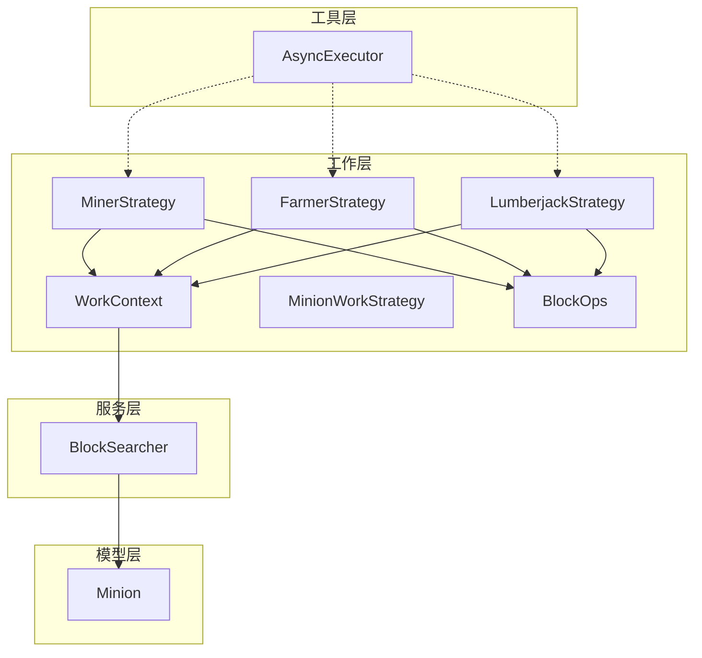
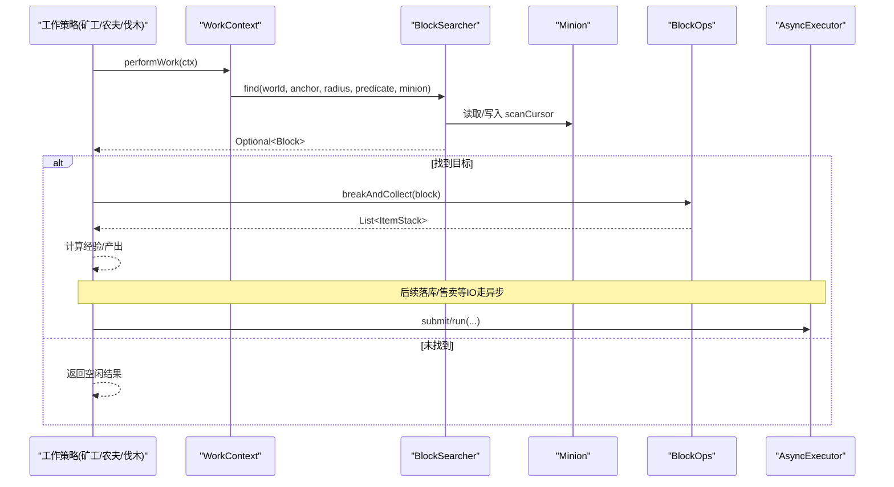
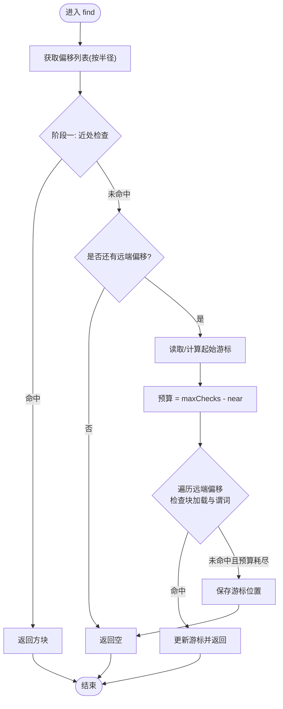
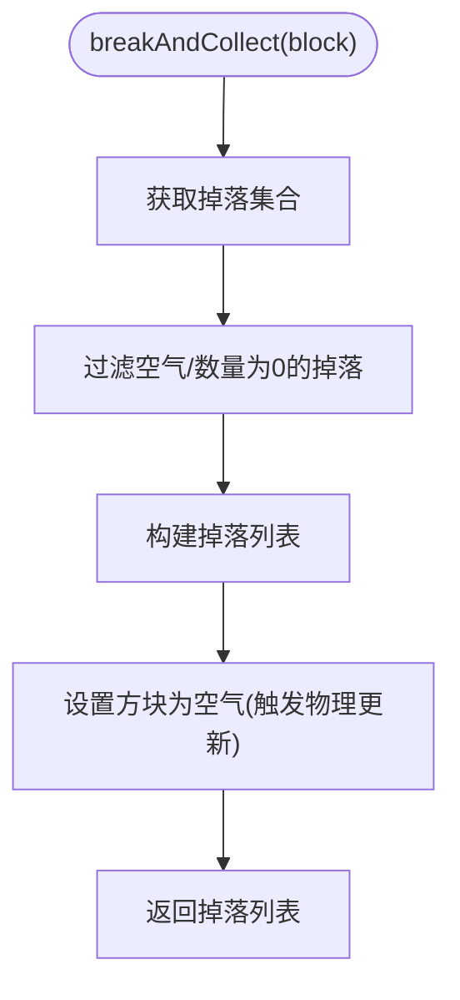
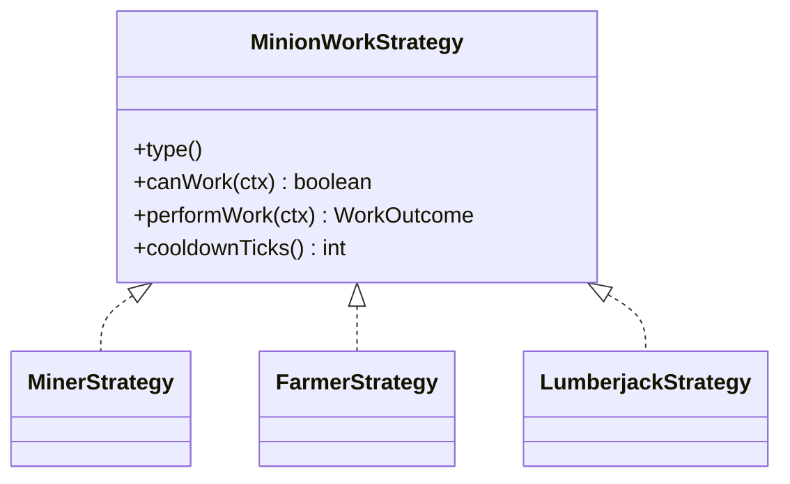
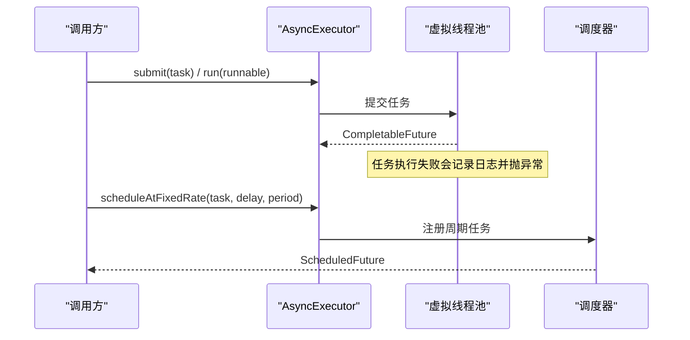
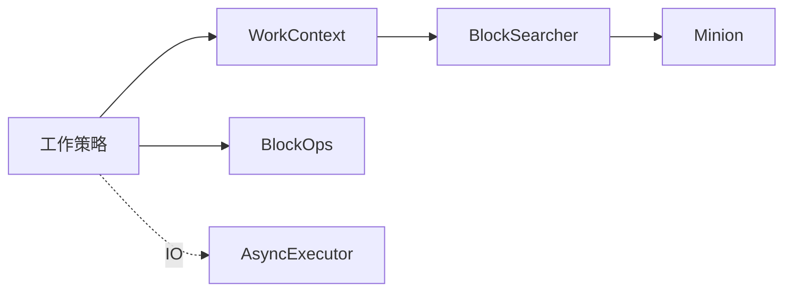

# 搜索算法与性能优化

<cite>
**本文引用的文件**
- [BlockSearcher.java](file://src/main/java/com/hcs/minions/service/BlockSearcher.java)
- [Minion.java](file://src/main/java/com/hcs/minions/model/Minion.java)
- [BlockOps.java](file://src/main/java/com/hcs/minions/work/BlockOps.java)
- [AsyncExecutor.java](file://src/main/java/com/hcs/minions/util/AsyncExecutor.java)
- [WorkContext.java](file://src/main/java/com/hcs/minions/work/WorkContext.java)
- [WorkOutcome.java](file://src/main/java/com/hcs/minions/work/WorkOutcome.java)
- [MinionWorkStrategy.java](file://src/main/java/com/hcs/minions/work/MinionWorkStrategy.java)
- [MinerStrategy.java](file://src/main/java/com/hcs/minions/work/miner/MinerStrategy.java)
- [FarmerStrategy.java](file://src/main/java/com/hcs/minions/work/farmer/FarmerStrategy.java)
- [LumberjackStrategy.java](file://src/main/java/com/hcs/minions/work/lumberjack/LumberjackStrategy.java)
- [BlockSearcherTest.java](file://src/test/java/com/hcs/minions/service/BlockSearcherTest.java)
</cite>

## 目录
1. [简介](#简介)
2. [项目结构](#项目结构)
3. [核心组件](#核心组件)
4. [架构总览](#架构总览)
5. [详细组件分析](#详细组件分析)
6. [依赖关系分析](#依赖关系分析)
7. [性能考量](#性能考量)
8. [故障诊断指南](#故障诊断指南)
9. [结论](#结论)
10. [附录](#附录)

## 简介
本技术文档聚焦 SkyMinions 中的方块搜索机制与性能优化策略，围绕以下关键点展开：
- BlockSearcher 的限流搜索算法：固定半径（如 5x5x5）内的两阶段螺旋扫描、近处优先命中、远处游标推进，以及单周期检查上限保护。
- BlockOps 的方块操作优化：批量掉落收集、物理更新触发与内存友好实现。
- AsyncExecutor 的异步任务调度：基于 Java 21 虚拟线程的任务执行、单线程调度器与错误处理。
- 时间复杂度、空间复杂度与瓶颈分析，并提供监控、调优与排障实践建议。

## 项目结构
与搜索和性能相关的代码主要分布在 service、work、util、model 四个包中：
- service：BlockSearcher 提供限流搜索能力。
- work：工作策略接口与具体实现（矿工、农夫、伐木工），以及 BlockOps 工具类。
- util：AsyncExecutor 提供异步执行与调度。
- model：Minion 持有扫描游标等运行时状态。

图表来源
- [BlockSearcher.java:14-92](file://src/main/java/com/hcs/minions/service/BlockSearcher.java#L14-L92)
- [MinionWorkStrategy.java:5-26](file://src/main/java/com/hcs/minions/work/MinionWorkStrategy.java#L5-L26)
- [MinerStrategy.java:15-57](file://src/main/java/com/hcs/minions/work/miner/MinerStrategy.java#L15-L57)
- [FarmerStrategy.java:17-71](file://src/main/java/com/hcs/minions/work/farmer/FarmerStrategy.java#L17-L71)
- [LumberjackStrategy.java:20-111](file://src/main/java/com/hcs/minions/work/lumberjack/LumberjackStrategy.java#L20-L111)
- [BlockOps.java:11-40](file://src/main/java/com/hcs/minions/work/BlockOps.java#L11-L40)
- [AsyncExecutor.java:12-79](file://src/main/java/com/hcs/minions/util/AsyncExecutor.java#L12-L79)
- [Minion.java:88-92](file://src/main/java/com/hcs/minions/model/Minion.java#L88-L92)

章节来源
- [BlockSearcher.java:14-92](file://src/main/java/com/hcs/minions/service/BlockSearcher.java#L14-L92)
- [MinionWorkStrategy.java:5-26](file://src/main/java/com/hcs/minions/work/MinionWorkStrategy.java#L5-L26)
- [MinerStrategy.java:15-57](file://src/main/java/com/hcs/minions/work/miner/MinerStrategy.java#L15-L57)
- [FarmerStrategy.java:17-71](file://src/main/java/com/hcs/minions/work/farmer/FarmerStrategy.java#L17-L71)
- [LumberjackStrategy.java:20-111](file://src/main/java/com/hcs/minions/work/lumberjack/LumberjackStrategy.java#L20-L111)
- [BlockOps.java:11-40](file://src/main/java/com/hcs/minions/work/BlockOps.java#L11-L40)
- [AsyncExecutor.java:12-79](file://src/main/java/com/hcs/minions/util/AsyncExecutor.java#L12-L79)
- [Minion.java:88-92](file://src/main/java/com/hcs/minions/model/Minion.java#L88-L92)

## 核心组件
- BlockSearcher：提供“两阶段螺旋扫描”的限流搜索，保证每周期最多检查 HARD_LIMIT 个偏移，并维护 Minion 的扫描游标以在多次调用间推进远端区域。
- BlockOps：封装破坏与掉落收集，强制触发物理更新以保证刷石机等机制正常。
- AsyncExecutor：基于虚拟线程的异步执行器，统一 IO 与外部交互；提供单线程调度器用于周期性任务。
- WorkContext/WorkOutcome/MinionWorkStrategy：将搜索与工作解耦，策略只依赖上下文，不反向引用 Manager。
- Minion：持有 scanCursor 等运行时状态，供搜索器跨周期推进。

章节来源
- [BlockSearcher.java:14-92](file://src/main/java/com/hcs/minions/service/BlockSearcher.java#L14-L92)
- [BlockOps.java:11-40](file://src/main/java/com/hcs/minions/work/BlockOps.java#L11-L40)
- [AsyncExecutor.java:12-79](file://src/main/java/com/hcs/minions/util/AsyncExecutor.java#L12-L79)
- [WorkContext.java:10-22](file://src/main/java/com/hcs/minions/work/WorkContext.java#L10-L22)
- [WorkOutcome.java:7-22](file://src/main/java/com/hcs/minions/work/WorkOutcome.java#L7-L22)
- [MinionWorkStrategy.java:5-26](file://src/main/java/com/hcs/minions/work/MinionWorkStrategy.java#L5-L26)
- [Minion.java:88-92](file://src/main/java/com/hcs/minions/model/Minion.java#L88-L92)

## 架构总览
下图展示了从工作策略到搜索与操作的完整调用链，以及异步任务的边界。

图表来源
- [MinerStrategy.java:36-50](file://src/main/java/com/hcs/minions/work/miner/MinerStrategy.java#L36-L50)
- [FarmerStrategy.java:38-54](file://src/main/java/com/hcs/minions/work/farmer/FarmerStrategy.java#L38-L54)
- [LumberjackStrategy.java:44-63](file://src/main/java/com/hcs/minions/work/lumberjack/LumberjackStrategy.java#L44-L63)
- [BlockSearcher.java:34-66](file://src/main/java/com/hcs/minions/service/BlockSearcher.java#L34-L66)
- [BlockOps.java:28-39](file://src/main/java/com/hcs/minions/work/BlockOps.java#L28-L39)
- [AsyncExecutor.java:34-67](file://src/main/java/com/hcs/minions/util/AsyncExecutor.java#L34-L67)

## 详细组件分析

### BlockSearcher 限流搜索算法
- 搜索范围：按半径 r 生成 (2r+1)^3 的立方体偏移列表，排除原点并按距离排序。典型配置下 r=2 对应 5x5x5 区域。
- 两阶段扫描：
  - 阶段一：每个周期必查最近的 maxChecks/2 个偏移，确保“新出现”的近处目标快速命中。
  - 阶段二：使用 Minion.scanCursor 作为游标，在剩余偏移上推进，保证远处目标最终被扫到。
- 限流保护：maxChecks 被限制在 [1, HARD_LIMIT]，单周期总检查数 <50，避免主线程卡顿。
- 缓存：OFFSET 列表按半径缓存于静态 Map，避免重复生成。

图表来源
- [BlockSearcher.java:34-66](file://src/main/java/com/hcs/minions/service/BlockSearcher.java#L34-L66)
- [BlockSearcher.java:68-91](file://src/main/java/com/hcs/minions/service/BlockSearcher.java#L68-L91)
- [Minion.java:686-692](file://src/main/java/com/hcs/minions/model/Minion.java#L686-L692)

章节来源
- [BlockSearcher.java:14-92](file://src/main/java/com/hcs/minions/service/BlockSearcher.java#L14-L92)
- [Minion.java:686-692](file://src/main/java/com/hcs/minions/model/Minion.java#L686-L692)
- [BlockSearcherTest.java:14-43](file://src/test/java/com/hcs/minions/service/BlockSearcherTest.java#L14-L43)

### BlockOps 方块操作优化
- 批量掉落收集：先获取掉落集合，过滤无效项后构建列表，再破坏方块。
- 物理更新：破坏时启用 applyPhysics=true，确保水/岩浆流动、刷石机刷新等邻居更新生效。
- 线程约束：必须在主线程/区域线程调用，避免并发世界状态竞争。

图表来源
- [BlockOps.java:28-39](file://src/main/java/com/hcs/minions/work/BlockOps.java#L28-L39)

章节来源
- [BlockOps.java:11-40](file://src/main/java/com/hcs/minions/work/BlockOps.java#L11-L40)

### 工作策略与搜索集成
- MinerStrategy：查找可采矿方块，破坏并采集掉落，统计经验。
- FarmerStrategy：仅收割成熟作物，收割后原地补种。
- LumberjackStrategy：找到原木后用 BFS 收集整棵树（受工作半径限制），一次性砍光。

图表来源
- [MinionWorkStrategy.java:5-26](file://src/main/java/com/hcs/minions/work/MinionWorkStrategy.java#L5-L26)
- [MinerStrategy.java:15-57](file://src/main/java/com/hcs/minions/work/miner/MinerStrategy.java#L15-L57)
- [FarmerStrategy.java:17-71](file://src/main/java/com/hcs/minions/work/farmer/FarmerStrategy.java#L17-L71)
- [LumberjackStrategy.java:20-111](file://src/main/java/com/hcs/minions/work/lumberjack/LumberjackStrategy.java#L20-L111)

章节来源
- [MinerStrategy.java:15-57](file://src/main/java/com/hcs/minions/work/miner/MinerStrategy.java#L15-L57)
- [FarmerStrategy.java:17-71](file://src/main/java/com/hcs/minions/work/farmer/FarmerStrategy.java#L17-L71)
- [LumberjackStrategy.java:20-111](file://src/main/java/com/hcs/minions/work/lumberjack/LumberjackStrategy.java#L20-L111)

### AsyncExecutor 异步任务调度
- 虚拟线程池：所有 IO（数据库、Vault 售卖、离线结算）通过 newVirtualThreadPerTaskExecutor 执行，降低线程创建开销。
- 单线程调度器：用于周期任务（脏数据批量落库、自动售卖轮询），避免为单个仆从开定时器。
- 错误处理：捕获异常并记录日志，同时抛出 RuntimeException 由调用方处理，防止吞错。

图表来源
- [AsyncExecutor.java:24-67](file://src/main/java/com/hcs/minions/util/AsyncExecutor.java#L24-L67)

章节来源
- [AsyncExecutor.java:12-79](file://src/main/java/com/hcs/minions/util/AsyncExecutor.java#L12-L79)

## 依赖关系分析
- BlockSearcher 依赖 Minion 的 scanCursor 进行跨周期推进；偏移列表按半径缓存，减少重复计算。
- 工作策略依赖 WorkContext 提供的 world、anchor、radius、searcher，保持低耦合。
- BlockOps 被各策略复用，统一破坏与掉落逻辑。
- AsyncExecutor 独立于工作流，仅在 IO 路径使用，避免阻塞主线程。

图表来源
- [WorkContext.java:10-22](file://src/main/java/com/hcs/minions/work/WorkContext.java#L10-L22)
- [BlockSearcher.java:34-66](file://src/main/java/com/hcs/minions/service/BlockSearcher.java#L34-L66)
- [Minion.java:686-692](file://src/main/java/com/hcs/minions/model/Minion.java#L686-L692)
- [BlockOps.java:28-39](file://src/main/java/com/hcs/minions/work/BlockOps.java#L28-L39)
- [AsyncExecutor.java:34-67](file://src/main/java/com/hcs/minions/util/AsyncExecutor.java#L34-L67)

章节来源
- [WorkContext.java:10-22](file://src/main/java/com/hcs/minions/work/WorkContext.java#L10-L22)
- [BlockSearcher.java:34-66](file://src/main/java/com/hcs/minions/service/BlockSearcher.java#L34-L66)
- [Minion.java:686-692](file://src/main/java/com/hcs/minions/model/Minion.java#L686-L692)
- [BlockOps.java:28-39](file://src/main/java/com/hcs/minions/work/BlockOps.java#L28-L39)
- [AsyncExecutor.java:34-67](file://src/main/java/com/hcs/minions/util/AsyncExecutor.java#L34-L67)

## 性能考量
- 时间复杂度
  - BlockSearcher.generateOffsets：O((2r+1)^3)，按半径生成并排序，但结果被缓存，实际每次 find 不再重复计算。
  - BlockSearcher.find：每周期最多检查 HARD_LIMIT 个偏移，近似 O(HARD_LIMIT)。
  - LumberjackStrategy.collectTree：BFS 访问相连原木，受 MAX_TREE_LOGS 与工作半径限制，最坏 O(k)，k 为范围内原木数量。
  - BlockOps.breakAndCollect：掉落集合大小线性，整体 O(d)，d 为掉落项数。
- 空间复杂度
  - OFFSETS 缓存：按半径存储偏移数组，空间 O((2r+1)^3)，常驻内存但可控。
  - collectTree：队列与 visited 集合，空间 O(k)。
- 性能瓶颈与保护
  - 主线程阻塞风险：通过 HARD_LIMIT 与 maxChecks 限制单次检查量；方块操作严格在主线程/区域线程执行。
  - 大范围 BFS：LumberjackStrategy 对工作半径与最大原木数做双重限制，避免无界扩散。
  - 异步 IO：所有 IO 走虚拟线程，避免阻塞主循环。
- 调优建议
  - 根据服务器 TPS 调整 maxChecks（默认上限 48），在高负载下可降低近处比例或总预算。
  - 合理设置工作半径 r，平衡命中率与检查成本。
  - 对高频 IO 场景使用 AsyncExecutor 的 scheduleAtFixedRate 合并写盘与售卖。
- 监控指标
  - 每周期检查次数、命中延迟、BFS 扩展步数、异步任务排队长度与失败率。
  - 关注主线程 tick 耗时峰值与 GC 压力。

[本节为通用性能讨论，不直接分析具体文件]

## 故障诊断指南
- 常见问题
  - 刷石机卡死：确认破坏方块时启用了物理更新（applyPhysics=true）。
  - 虚空砍树：检查 LumberjackStrategy 的范围约束与 MAX_TREE_LOGS 限制。
  - 异步任务失败：查看日志输出，确保调用方正确处理 CompletableFuture 的异常分支。
- 定位步骤
  - 打印 BlockSearcher 的 near/far 预算分配与命中情况。
  - 在工作策略中记录 find 返回为空的原因（未加载/谓词不匹配）。
  - 对 AsyncExecutor 的周期任务增加重试与告警。
- 修复要点
  - 确保方块操作在主线程/区域线程执行。
  - 对大对象（掉落列表、BFS 队列）控制容量，避免内存抖动。
  - 对 IO 失败进行幂等重试与降级。

章节来源
- [BlockOps.java:28-39](file://src/main/java/com/hcs/minions/work/BlockOps.java#L28-L39)
- [LumberjackStrategy.java:55-103](file://src/main/java/com/hcs/minions/work/lumberjack/LumberjackStrategy.java#L55-L103)
- [AsyncExecutor.java:34-67](file://src/main/java/com/hcs/minions/util/AsyncExecutor.java#L34-L67)

## 结论
SkyMinions 通过 BlockSearcher 的两阶段限流搜索、BlockOps 的批量操作与物理更新、以及 AsyncExecutor 的虚拟线程异步化，实现了高效、稳定且可扩展的方块工作流。配合工作策略模式与严格的线程边界管理，系统在大规模仆从并发下仍能保持良好性能与可维护性。建议在部署中结合监控指标持续调优搜索预算与工作半径，并对 IO 路径实施健壮的错误处理与重试机制。

[本节为总结性内容，不直接分析具体文件]

## 附录
- 关键类与方法路径参考
  - 限流搜索：BlockSearcher.find、generateOffsets
  - 方块操作：BlockOps.breakAndCollect
  - 异步执行：AsyncExecutor.submit、run、scheduleAtFixedRate
  - 工作策略：MinerStrategy.performWork、FarmerStrategy.performWork、LumberjackStrategy.performWork
  - 状态管理：Minion.scanCursor、setScanCursor

[本节为索引性内容，不直接分析具体文件]