# 生命周期管理

<cite>
**本文引用的文件**
- [MinionManager.java](file://src/main/java/com/hcs/minions/service/MinionManager.java)
- [Minion.java](file://src/main/java/com/hcs/minions/model/Minion.java)
- [MinionPlacedEvent.java](file://src/main/java/com/hcs/minions/event/MinionPlacedEvent.java)
- [MinionEntityService.java](file://src/main/java/com/hcs/minions/service/MinionEntityService.java)
- [CachedMinionRepository.java](file://src/main/java/com/hcs/minions/repository/CachedMinionRepository.java)
- [MinionData.java](file://src/main/java/com/hcs/minions/model/MinionData.java)
- [MinionInteractionListener.java](file://src/main/java/com/hcs/minions/listener/MinionInteractionListener.java)
- [WorkStrategyRegistry.java](file://src/main/java/com/hcs/minions/work/WorkStrategyRegistry.java)
- [OfflineRewardService.java](file://src/main/java/com/hcs/minions/service/OfflineRewardService.java)
</cite>

## 目录
1. [简介](#简介)
2. [项目结构](#项目结构)
3. [核心组件](#核心组件)
4. [架构总览](#架构总览)
5. [详细组件分析](#详细组件分析)
6. [依赖关系分析](#依赖关系分析)
7. [性能与并发](#性能与并发)
8. [故障排除指南](#故障排除指南)
9. [结论](#结论)
10. [附录：状态机与流程图](#附录状态机与流程图)

## 简介
本文件围绕“仆从”（Minion）的完整生命周期展开，覆盖从创建、放置、激活、工作、暂停/恢复、离线收益到销毁的全流程。重点解析 MinionManager 的核心调度能力、Minion 实体的状态管理与数据持久化、事件驱动的生命周期控制（如 MinionPlacedEvent）、以及并发安全、线程调度与性能优化策略。文末提供监控、调试与故障排除的技术指南。

## 项目结构
本项目采用分层组织：
- 服务层：MinionManager 负责全局调度、工作编排、自动售卖；MinionEntityService 负责实体生成/销毁/外观刷新；仓库层 CachedMinionRepository 提供内存缓存与异步落库。
- 模型层：Minion 为运行时对象，持有 GUI、状态、冷却时间等；MinionData 为持久化快照。
- 事件与监听：MinionPlacedEvent 用于模块解耦；MinionInteractionListener 处理放置与交互。
- 工作策略：WorkStrategyRegistry 按类型分发具体工作逻辑。

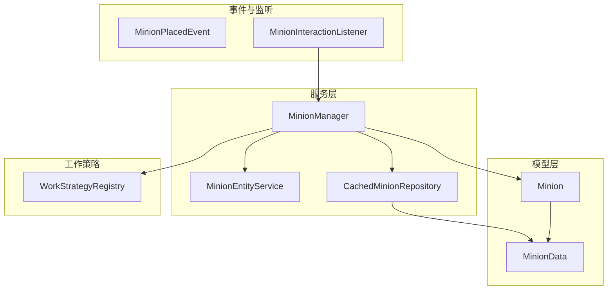

图表来源
- [MinionManager.java:92-115](file://src/main/java/com/hcs/minions/service/MinionManager.java#L92-L115)
- [MinionEntityService.java:43-75](file://src/main/java/com/hcs/minions/service/MinionEntityService.java#L43-L75)
- [CachedMinionRepository.java:44-80](file://src/main/java/com/hcs/minions/repository/CachedMinionRepository.java#L44-L80)
- [Minion.java:718-743](file://src/main/java/com/hcs/minions/model/Minion.java#L718-L743)
- [MinionPlacedEvent.java:12-39](file://src/main/java/com/hcs/minions/event/MinionPlacedEvent.java#L12-L39)
- [MinionInteractionListener.java:54-94](file://src/main/java/com/hcs/minions/listener/MinionInteractionListener.java#L54-L94)
- [WorkStrategyRegistry.java:14-32](file://src/main/java/com/hcs/minions/work/WorkStrategyRegistry.java#L14-L32)

章节来源
- [MinionManager.java:92-115](file://src/main/java/com/hcs/minions/service/MinionManager.java#L92-L115)
- [MinionInteractionListener.java:54-94](file://src/main/java/com/hcs/minions/listener/MinionInteractionListener.java#L54-L94)

## 核心组件
- MinionManager：全局单例调度器，维护内存索引（按 UUID、位置、主人），启动 tick 任务与自动售卖任务，负责仆从的工作派发、掉落处理、升级链、自动售卖触发、孤儿实体清理。
- Minion：运行时实体，包含等级、燃料、冷却、GUI、存储、皮肤、升级槽位、扫描游标、是否脏标记等；提供状态变更、GUI 渲染、数据序列化/反序列化。
- MinionEntityService：以盔甲架小人呈现仆从，支持生成、刷新外观、挥臂动画、销毁、全量清理；通过 PDC 绑定 UUID。
- CachedMinionRepository：内存缓存 + 脏标记集合 + 异步落库；两阶段快照收集确保 Inventory 访问在 region 线程安全。
- MinionPlacedEvent：自定义事件，用于模块间解耦（例如统计、成就、扩展钩子）。
- WorkStrategyRegistry：按 MinionType 分派工作策略，实现开闭原则。
- OfflineRewardService：离线收益计算，基于 lastActiveEpochMs 累计离线时长并产出物品。

章节来源
- [MinionManager.java:44-86](file://src/main/java/com/hcs/minions/service/MinionManager.java#L44-L86)
- [Minion.java:70-92](file://src/main/java/com/hcs/minions/model/Minion.java#L70-L92)
- [MinionEntityService.java:28-41](file://src/main/java/com/hcs/minions/service/MinionEntityService.java#L28-L41)
- [CachedMinionRepository.java:19-42](file://src/main/java/com/hcs/minions/repository/CachedMinionRepository.java#L19-L42)
- [MinionPlacedEvent.java:9-39](file://src/main/java/com/hcs/minions/event/MinionPlacedEvent.java#L9-L39)
- [WorkStrategyRegistry.java:10-32](file://src/main/java/com/hcs/minions/work/WorkStrategyRegistry.java#L10-L32)
- [OfflineRewardService.java:38-74](file://src/main/java/com/hcs/minions/service/OfflineRewardService.java#L38-L74)

## 架构总览
MinionManager 作为中枢，协调以下关键路径：
- 启动时加载所有仆从到内存，注册全局 tick 与自动售卖任务。
- 每 tick 遍历内存中的仆从，检查区块加载与玩家半径，委派到对应 region 线程执行工作。
- 工作完成后更新冷却、挥臂动画、掉落处理、升级链、自动售卖、标记脏数据。
- 定期快照收集并在 region 线程生成快照后批量异步落库。
- 停止时关闭任务、关闭 GUI、同步冲刷脏数据、销毁实体、清空内存索引。

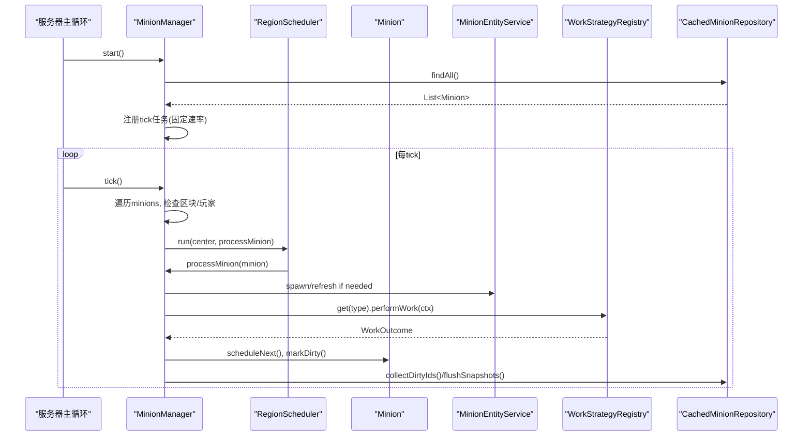

图表来源
- [MinionManager.java:92-115](file://src/main/java/com/hcs/minions/service/MinionManager.java#L92-L115)
- [MinionManager.java:191-250](file://src/main/java/com/hcs/minions/service/MinionManager.java#L191-L250)
- [MinionManager.java:252-322](file://src/main/java/com/hcs/minions/service/MinionManager.java#L252-L322)
- [CachedMinionRepository.java:100-153](file://src/main/java/com/hcs/minions/repository/CachedMinionRepository.java#L100-L153)

## 详细组件分析

### MinionManager：核心调度与生命周期编排
- 启动与停止：start() 加载全部仆从、注册 tick 与自动售卖任务；stop() 取消任务、关闭 GUI、同步冲刷、销毁实体、清空索引。
- 全局遍历与区域调度：tick() 仅做纯内存与轻量判断，将实际工作委派到 RegionScheduler 在对应 world/chunk 线程执行，保证 Folia 兼容。
- 工作执行：processMinion() 校验附近玩家、按需生成盔甲架、燃料衰减、冷却与 Skyblock 限制；performWork() 调用策略、处理掉落、升级链、稀有掉落、自动售卖、标记脏。
- 自动售卖：sweepAutoSell() 轮询满足条件的仆从并售卖，避免在主线程直接操作 Inventory。
- 放置与移除：place() 校验上限、加入索引、生成实体、保存、触发 MinionPlacedEvent；remove() 清理索引、销毁实体、删除记录、触发移除事件。
- 孤儿清理：purgeOrphans() 扫描世界内盔甲架，移除无对应内存数据的实体。

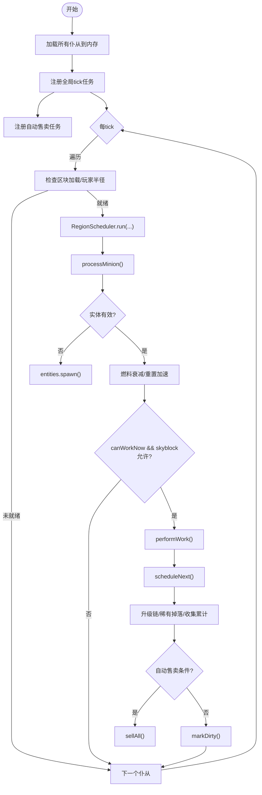

图表来源
- [MinionManager.java:92-115](file://src/main/java/com/hcs/minions/service/MinionManager.java#L92-L115)
- [MinionManager.java:191-250](file://src/main/java/com/hcs/minions/service/MinionManager.java#L191-L250)
- [MinionManager.java:252-322](file://src/main/java/com/hcs/minions/service/MinionManager.java#L252-L322)
- [MinionManager.java:333-350](file://src/main/java/com/hcs/minions/service/MinionManager.java#L333-L350)

章节来源
- [MinionManager.java:92-115](file://src/main/java/com/hcs/minions/service/MinionManager.java#L92-L115)
- [MinionManager.java:191-250](file://src/main/java/com/hcs/minions/service/MinionManager.java#L191-L250)
- [MinionManager.java:252-322](file://src/main/java/com/hcs/minions/service/MinionManager.java#L252-L322)
- [MinionManager.java:356-384](file://src/main/java/com/hcs/minions/service/MinionManager.java#L356-L384)
- [MinionManager.java:401-413](file://src/main/java/com/hcs/minions/service/MinionManager.java#L401-L413)

### Minion：状态管理、GUI与数据持久化
- 状态字段：等级、位置、燃料、永久加速、自动售卖开关、总产出、最后活跃时间、岛屿ID、两个升级槽位、皮肤、扫描游标、下一次工作时间（AtomicLong）、是否脏（AtomicBoolean）。
- 存储与GUI：54格 GUI，存储区随等级解锁；提供 addToStorage、collectAll、consume、removeItems、isStorageFull 等方法；refresh() 渲染信息卡、燃料显示、升级按钮、模块槽等。
- 冷却与调度：nextWorkTick 使用 AtomicLong 保证并发安全；canWorkNow/scheduleNext/nextWorkInTicks/nextWorkSeconds 提供冷却查询与设置。
- 数据持久化：toData() 将运行时状态序列化为 MinionData；fromData() 反序列化并重建 GUI；标记脏/干净与 tryClaimFlush 配合仓库两阶段落库。

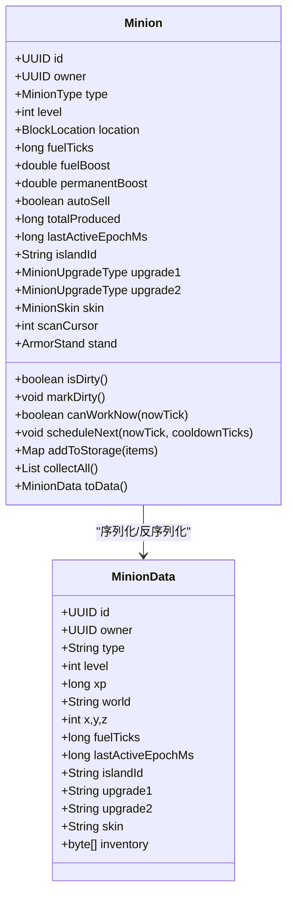

图表来源
- [Minion.java:70-92](file://src/main/java/com/hcs/minions/model/Minion.java#L70-L92)
- [Minion.java:175-226](file://src/main/java/com/hcs/minions/model/Minion.java#L175-L226)
- [Minion.java:279-286](file://src/main/java/com/hcs/minions/model/Minion.java#L279-L286)
- [Minion.java:510-583](file://src/main/java/com/hcs/minions/model/Minion.java#L510-L583)
- [Minion.java:670-684](file://src/main/java/com/hcs/minions/model/Minion.java#L670-L684)
- [Minion.java:718-743](file://src/main/java/com/hcs/minions/model/Minion.java#L718-L743)
- [MinionData.java:11-28](file://src/main/java/com/hcs/minions/model/MinionData.java#L11-L28)

章节来源
- [Minion.java:70-92](file://src/main/java/com/hcs/minions/model/Minion.java#L70-L92)
- [Minion.java:175-226](file://src/main/java/com/hcs/minions/model/Minion.java#L175-L226)
- [Minion.java:279-286](file://src/main/java/com/hcs/minions/model/Minion.java#L279-L286)
- [Minion.java:510-583](file://src/main/java/com/hcs/minions/model/Minion.java#L510-L583)
- [Minion.java:670-684](file://src/main/java/com/hcs/minions/model/Minion.java#L670-L684)
- [Minion.java:718-743](file://src/main/java/com/hcs/minions/model/Minion.java#L718-L743)
- [MinionData.java:11-28](file://src/main/java/com/hcs/minions/model/MinionData.java#L11-L28)

### MinionEntityService：实体生成、外观与动画
- 生成：spawn() 在锚点方块上方生成小盔甲架，设置名称、PDC 绑定 UUID、头盔、皮革护甲颜色、手持图标、手臂姿势，并锁定装备防止玩家改动。
- 外观刷新：refreshAppearance() 根据皮肤/类型更新头盔与护甲颜色。
- 动画：swing() 每次工作随机摆动右臂角度。
- 销毁：despawn()/despawnAll() 移除实体或全量清理。
- 反查：minionIdOf() 从盔甲架 PDC 读取 UUID。

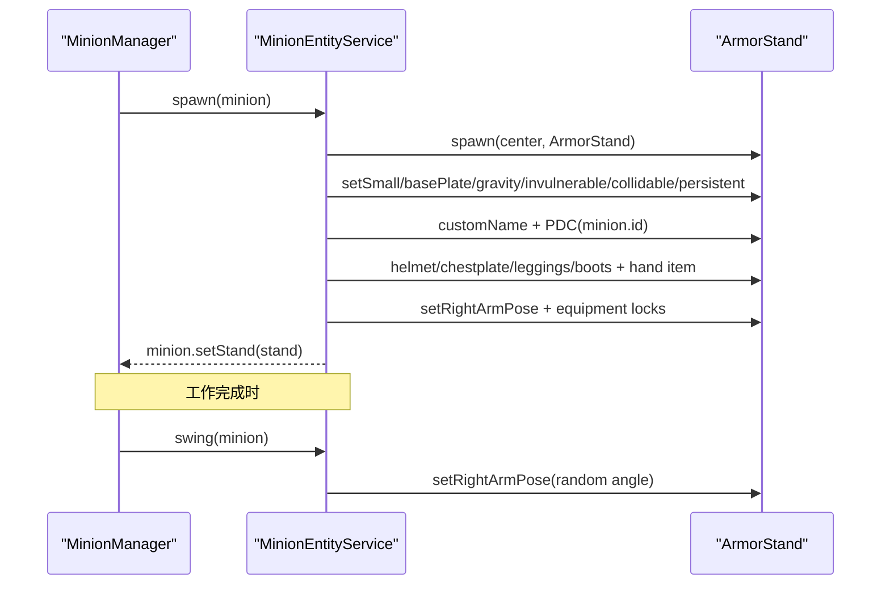

图表来源
- [MinionEntityService.java:43-75](file://src/main/java/com/hcs/minions/service/MinionEntityService.java#L43-L75)
- [MinionEntityService.java:77-96](file://src/main/java/com/hcs/minions/service/MinionEntityService.java#L77-L96)
- [MinionEntityService.java:98-127](file://src/main/java/com/hcs/minions/service/MinionEntityService.java#L98-L127)

章节来源
- [MinionEntityService.java:43-75](file://src/main/java/com/hcs/minions/service/MinionEntityService.java#L43-L75)
- [MinionEntityService.java:77-96](file://src/main/java/com/hcs/minions/service/MinionEntityService.java#L77-L96)
- [MinionEntityService.java:98-127](file://src/main/java/com/hcs/minions/service/MinionEntityService.java#L98-L127)

### 事件驱动：MinionPlacedEvent 与交互监听
- MinionPlacedEvent：在 place() 成功后由 MinionManager 触发，携带 Minion 与 Player，供其他模块监听（如统计、成就、扩展功能）。
- MinionInteractionListener：处理 BlockPlaceEvent（放置仆从）与 PlayerInteractAtEntityEvent（右键盔甲架打开 GUI、潜行拾取、注入燃料）。

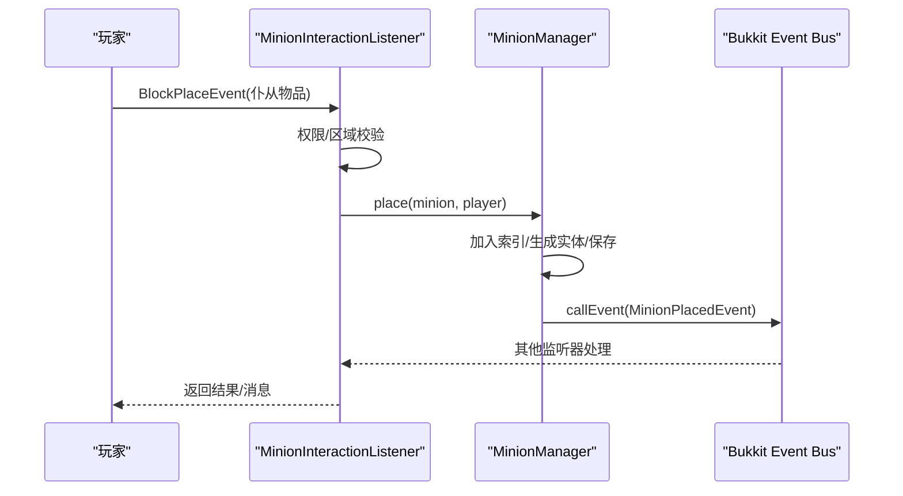

图表来源
- [MinionInteractionListener.java:54-94](file://src/main/java/com/hcs/minions/listener/MinionInteractionListener.java#L54-L94)
- [MinionManager.java:356-374](file://src/main/java/com/hcs/minions/service/MinionManager.java#L356-L374)
- [MinionPlacedEvent.java:12-39](file://src/main/java/com/hcs/minions/event/MinionPlacedEvent.java#L12-L39)

章节来源
- [MinionInteractionListener.java:54-94](file://src/main/java/com/hcs/minions/listener/MinionInteractionListener.java#L54-L94)
- [MinionManager.java:356-374](file://src/main/java/com/hcs/minions/service/MinionManager.java#L356-L374)
- [MinionPlacedEvent.java:12-39](file://src/main/java/com/hcs/minions/event/MinionPlacedEvent.java#L12-L39)

### 工作策略与升级链
- WorkStrategyRegistry：按 MinionType 获取策略，新增类型只需注册新策略，符合开闭原则。
- 升级链：MinionManager.performWork() 中调用 UpgradeService.processDrops() 进行自动熔炼/压缩/钻石散布等处理，随后 roll 稀有掉落，再累计 Collection 与存入存储。

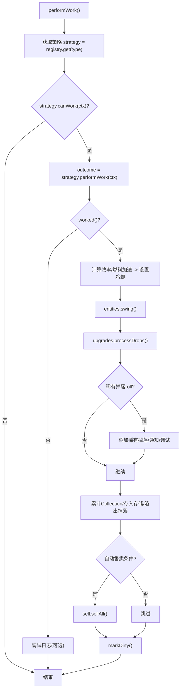

图表来源
- [WorkStrategyRegistry.java:14-32](file://src/main/java/com/hcs/minions/work/WorkStrategyRegistry.java#L14-L32)
- [MinionManager.java:252-322](file://src/main/java/com/hcs/minions/service/MinionManager.java#L252-L322)

章节来源
- [WorkStrategyRegistry.java:14-32](file://src/main/java/com/hcs/minions/work/WorkStrategyRegistry.java#L14-L32)
- [MinionManager.java:252-322](file://src/main/java/com/hcs/minions/service/MinionManager.java#L252-L322)

### 数据持久化与内存管理
- 内存缓存：CachedMinionRepository 使用 ConcurrentHashMap 缓存 Minion，O(1) 查找；dirty 集合驱动批量落库。
- 两阶段快照：collectDirtyIds() 仅收集 ID；claimDirty() CAS 认领；region 线程生成快照；flushSnapshots() 异步批量 upsert。
- 关闭路径：stop() 先关闭 GUI，再 flushDirtySync() 同步冲刷，最后 despawnAll() 清理实体。
- 离线收益：OfflineRewardService 基于 lastActiveEpochMs 计算离线时长并产出物品，写入存储并更新时间戳。

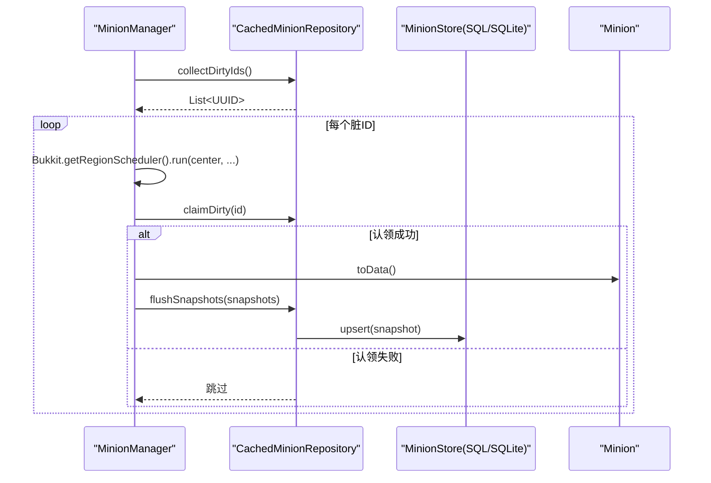

图表来源
- [MinionManager.java:124-160](file://src/main/java/com/hcs/minions/service/MinionManager.java#L124-L160)
- [CachedMinionRepository.java:100-153](file://src/main/java/com/hcs/minions/repository/CachedMinionRepository.java#L100-L153)
- [Minion.java:718-743](file://src/main/java/com/hcs/minions/model/Minion.java#L718-L743)

章节来源
- [CachedMinionRepository.java:44-80](file://src/main/java/com/hcs/minions/repository/CachedMinionRepository.java#L44-L80)
- [CachedMinionRepository.java:100-153](file://src/main/java/com/hcs/minions/repository/CachedMinionRepository.java#L100-L153)
- [MinionManager.java:124-160](file://src/main/java/com/hcs/minions/service/MinionManager.java#L124-L160)
- [OfflineRewardService.java:38-74](file://src/main/java/com/hcs/minions/service/OfflineRewardService.java#L38-L74)

## 依赖关系分析
- MinionManager 依赖：ConfigProvider、MinionRepository、WorkStrategyRegistry、BlockSearcher、MinionEntityService、SellService、SkyblockHook、PermissionService、AsyncExecutor、UpgradeService、CollectionService。
- Minion 依赖：MinionTypeConfig、GuiText、ItemCodec、MaterialNames、Bukkit API（Inventory、ItemStack、ArmorStand）。
- MinionEntityService 依赖：PluginConfig、Bukkit API（ArmorStand、PlayerProfile、PersistentDataContainer）。
- Repository 层：MinionStore 接口被 SQLite/MySQL 实现，业务层不直接接触。

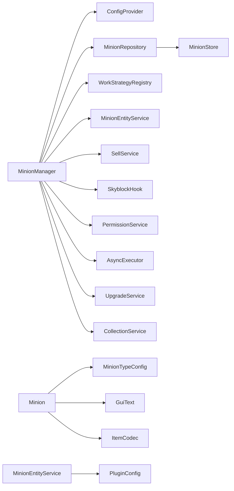

图表来源
- [MinionManager.java:44-86](file://src/main/java/com/hcs/minions/service/MinionManager.java#L44-L86)
- [Minion.java:3-8](file://src/main/java/com/hcs/minions/model/Minion.java#L3-L8)
- [MinionEntityService.java:3-21](file://src/main/java/com/hcs/minions/service/MinionEntityService.java#L3-L21)
- [CachedMinionRepository.java:1-18](file://src/main/java/com/hcs/minions/repository/CachedMinionRepository.java#L1-L18)

章节来源
- [MinionManager.java:44-86](file://src/main/java/com/hcs/minions/service/MinionManager.java#L44-L86)
- [Minion.java:3-8](file://src/main/java/com/hcs/minions/model/Minion.java#L3-L8)
- [MinionEntityService.java:3-21](file://src/main/java/com/hcs/minions/service/MinionEntityService.java#L3-L21)
- [CachedMinionRepository.java:1-18](file://src/main/java/com/hcs/minions/repository/CachedMinionRepository.java#L1-L18)

## 性能与并发
- 线程模型：GlobalRegionScheduler 用于全局遍历与定时任务；RegionScheduler 用于具体工作逻辑，确保对 World/Inventory 的访问在 region 线程安全。
- 并发安全：Minion.nextWorkTick 使用 AtomicLong；dirty 标记使用 AtomicBoolean；内存索引使用 ConcurrentHashMap；快照收集与认领使用 CAS 避免竞态。
- 性能优化：
  - 只读遍历只做轻量判断（区块加载、坐标转换），避免跨线程访问。
  - 燃料衰减与冷却计算在 region 线程内进行，减少锁竞争。
  - 自动售卖轮询仅在 GlobalRegionScheduler 上遍历，逐个委派到 region 线程判断并售卖。
  - 批量异步落库减少数据库压力，失败重试机制保障数据一致性。
  - 孤儿实体清理避免异常关闭后的残留实体占用资源。

[本节为通用性能讨论，无需特定文件引用]

## 故障排除指南
- 放置失败：检查权限（LuckPerms 类型/限制）、Skyblock 区域限制、仆从数量上限；确认放置位置合法。
- 无法工作：确认附近有玩家且在扫描半径内；检查区块是否加载；核对冷却时间与燃料；查看 Skyblock 工作限制。
- 数据丢失风险：确保快照收集路径正确（region 线程生成快照）；避免在异步线程直接遍历 Inventory；关闭前关闭 GUI 并同步冲刷。
- 实体异常：若出现无对应内存数据的盔甲架，运行 purgeOrphans() 清理；重载后实体按数据自愈。
- 离线收益异常：检查 lastActiveEpochMs 是否正确更新；确认离线时长计算与产物堆叠上限。

章节来源
- [MinionInteractionListener.java:54-94](file://src/main/java/com/hcs/minions/listener/MinionInteractionListener.java#L54-L94)
- [MinionManager.java:191-250](file://src/main/java/com/hcs/minions/service/MinionManager.java#L191-L250)
- [MinionManager.java:124-160](file://src/main/java/com/hcs/minions/service/MinionManager.java#L124-L160)
- [MinionManager.java:401-413](file://src/main/java/com/hcs/minions/service/MinionManager.java#L401-L413)
- [OfflineRewardService.java:38-74](file://src/main/java/com/hcs/minions/service/OfflineRewardService.java#L38-L74)

## 结论
本系统通过 MinionManager 统一调度、Minion 精细状态管理、MinionEntityService 实体呈现、CachedMinionRepository 高效持久化，实现了仆从从创建到销毁的完整生命周期管理。借助事件驱动（MinionPlacedEvent）与工作策略注册表，系统具备良好的扩展性与解耦性。并发与线程模型严格遵循 Folia 规范，确保在高并发与多区域环境下稳定运行。结合离线收益、自动售卖、升级链与调试日志，提供了完善的运维与用户体验。

[本节为总结，无需特定文件引用]

## 附录：状态机与流程图

### 仆从状态机
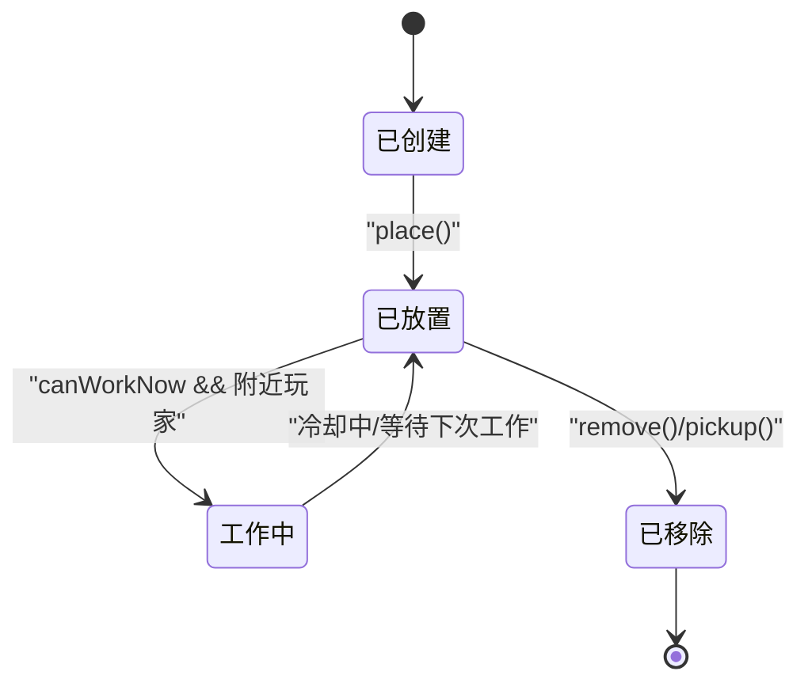

图表来源
- [MinionManager.java:356-384](file://src/main/java/com/hcs/minions/service/MinionManager.java#L356-L384)
- [MinionManager.java:191-250](file://src/main/java/com/hcs/minions/service/MinionManager.java#L191-L250)

### 放置与交互流程
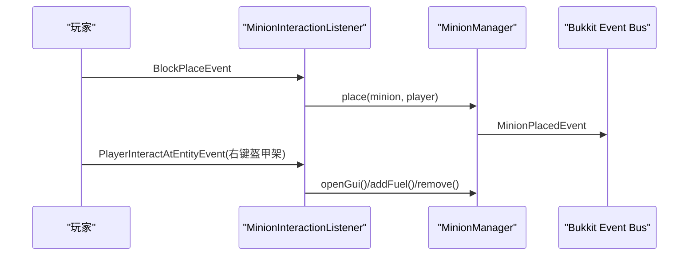

图表来源
- [MinionInteractionListener.java:54-94](file://src/main/java/com/hcs/minions/listener/MinionInteractionListener.java#L54-L94)
- [MinionInteractionListener.java:98-142](file://src/main/java/com/hcs/minions/listener/MinionInteractionListener.java#L98-L142)
- [MinionManager.java:356-390](file://src/main/java/com/hcs/minions/service/MinionManager.java#L356-L390)
- [MinionPlacedEvent.java:12-39](file://src/main/java/com/hcs/minions/event/MinionPlacedEvent.java#L12-L39)