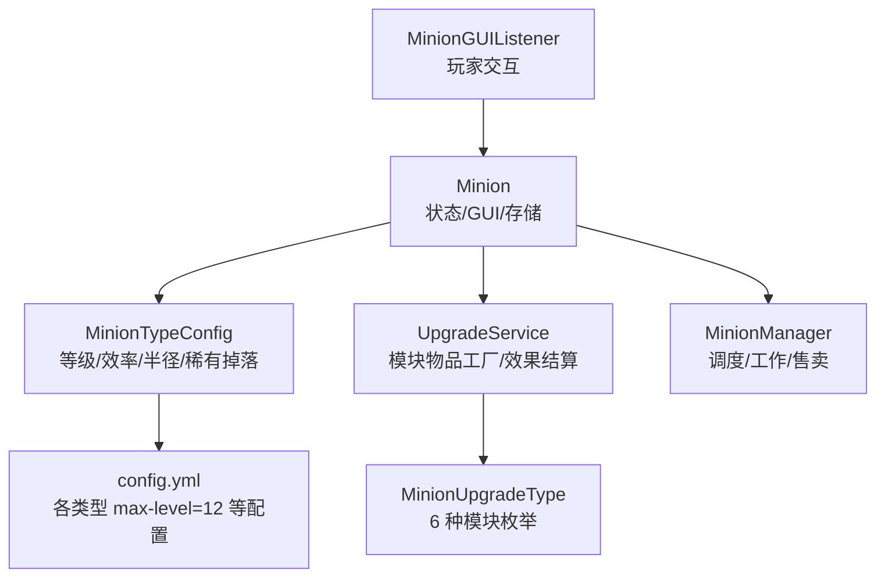
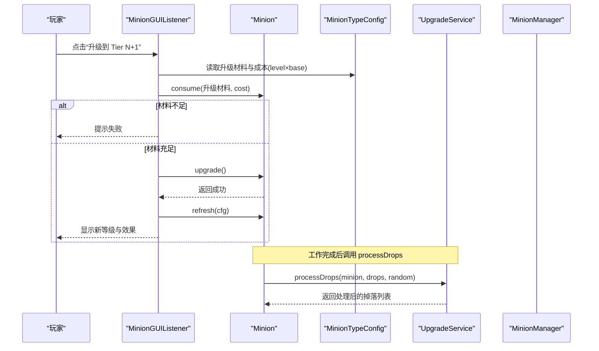
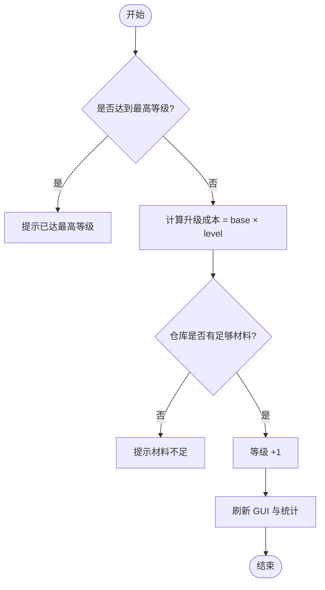
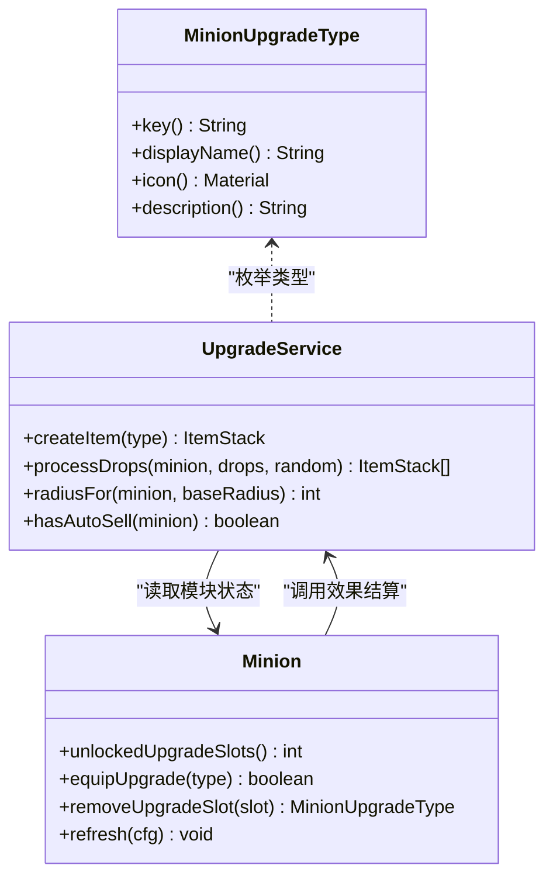
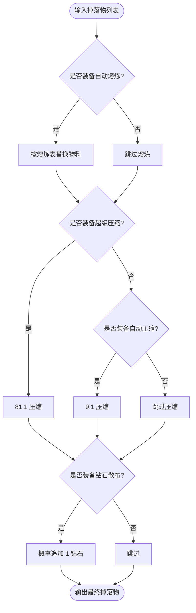
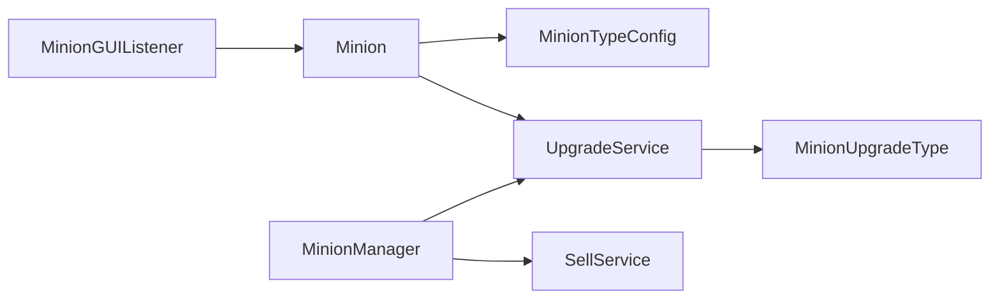

# 升级与模块系统

<cite>
**本文引用的文件**
- [MinionUpgradeType.java](file://src/main/java/com/hcs/minions/upgrade/MinionUpgradeType.java)
- [UpgradeService.java](file://src/main/java/com/hcs/minions/upgrade/UpgradeService.java)
- [Minion.java](file://src/main/java/com/hcs/minions/model/Minion.java)
- [MinionTypeConfig.java](file://src/main/java/com/hcs/minions/config/MinionTypeConfig.java)
- [config.yml](file://src/main/resources/config.yml)
- [MinionManager.java](file://src/main/java/com/hcs/minions/service/MinionManager.java)
- [MinionGUIListener.java](file://src/main/java/com/hcs/minions/gui/MinionGUIListener.java)
- [UpgradeServiceTest.java](file://src/test/java/com/hcs/minions/upgrade/UpgradeServiceTest.java)
</cite>

## 目录
1. [简介](#简介)
2. [项目结构](#项目结构)
3. [核心组件](#核心组件)
4. [架构总览](#架构总览)
5. [详细组件分析](#详细组件分析)
6. [依赖关系分析](#依赖关系分析)
7. [性能考量](#性能考量)
8. [故障排查指南](#故障排查指南)
9. [结论](#结论)
10. [附录：配置与扩展](#附录：配置与扩展)

## 简介
本文件系统性说明 SkyMinions 的“等级提升”与“模块系统”。内容涵盖：
- 12 级等级体系的设计、升级条件、成本计算与属性增强效果。
- 6 种模块槽位的功能、获取方式、装备机制与效果叠加规则。
- 升级系统的平衡性设计（材料消耗、效率提升、解锁条件）。
- 升级策略建议与性能优化指导。
- 配置选项说明与自定义扩展指南。

## 项目结构
围绕升级与模块的核心代码主要分布在以下位置：
- 升级类型定义：upgrade/MinionUpgradeType.java
- 升级服务与效果结算：upgrade/UpgradeService.java
- 仆从模型与 GUI：model/Minion.java
- 类型配置与等级上限：config/MinionTypeConfig.java
- 全局调度与工作编排：service/MinionManager.java
- GUI 交互与升级触发：gui/MinionGUIListener.java
- 单元测试验证压缩与面积算法：upgrade/UpgradeServiceTest.java

图表来源
- [MinionGUIListener.java:220-235](file://src/main/java/com/hcs/minions/gui/MinionGUIListener.java#L220-L235)
- [Minion.java:276-283](file://src/main/java/com/hcs/minions/model/Minion.java#L276-L283)
- [MinionTypeConfig.java:21-63](file://src/main/java/com/hcs/minions/config/MinionTypeConfig.java#L21-L63)
- [UpgradeService.java:113-187](file://src/main/java/com/hcs/minions/upgrade/UpgradeService.java#L113-L187)
- [MinionUpgradeType.java:23-30](file://src/main/java/com/hcs/minions/upgrade/MinionUpgradeType.java#L23-L30)
- [config.yml:47-153](file://src/main/resources/config.yml#L47-L153)

章节来源
- [MinionGUIListener.java:220-235](file://src/main/java/com/hcs/minions/gui/MinionGUIListener.java#L220-L235)
- [Minion.java:276-283](file://src/main/java/com/hcs/minions/model/Minion.java#L276-L283)
- [MinionTypeConfig.java:21-63](file://src/main/java/com/hcs/minions/config/MinionTypeConfig.java#L21-L63)
- [UpgradeService.java:113-187](file://src/main/java/com/hcs/minions/upgrade/UpgradeService.java#L113-L187)
- [MinionUpgradeType.java:23-30](file://src/main/java/com/hcs/minions/upgrade/MinionUpgradeType.java#L23-L30)
- [config.yml:47-153](file://src/main/resources/config.yml#L47-L153)

## 核心组件
- 升级类型枚举：定义 6 种模块及其图标、描述与键值，用于物品生成与识别。
- 升级服务：提供模块物品工厂、掉落物处理链（自动熔炼→自动压缩/超级压缩→钻石散布）、范围扩展计算、自动售卖检测。
- 仆从模型：维护等级、存储格、模块槽、燃料、自动售卖开关、累计产出等；提供升级、装备模块、刷新 GUI 等方法。
- 类型配置：每个仆从类型的最大等级、基础效率、每级效率增量、冷却时间、升级材料与成本、工作半径、稀有掉落等。
- 管理器：全局调度、工作执行、自动售卖轮询、快照落库等。

章节来源
- [MinionUpgradeType.java:23-30](file://src/main/java/com/hcs/minions/upgrade/MinionUpgradeType.java#L23-L30)
- [UpgradeService.java:19-28](file://src/main/java/com/hcs/minions/upgrade/UpgradeService.java#L19-L28)
- [Minion.java:28-83](file://src/main/java/com/hcs/minions/model/Minion.java#L28-L83)
- [MinionTypeConfig.java:21-63](file://src/main/java/com/hcs/minions/config/MinionTypeConfig.java#L21-L63)
- [MinionManager.java:39-86](file://src/main/java/com/hcs/minions/service/MinionManager.java#L39-L86)

## 架构总览
升级与模块系统在运行时的工作流如下：
- 玩家在 GUI 点击“升级”，校验当前等级是否已达上限，检查仓库是否有足够升级材料，扣除后提升等级并刷新界面。
- 模块通过 UpgradeService 创建物品，携带 PDC 标识类型；在 GUI 中手持模块点击模块槽进行装备，或空手点击卸下。
- 每次工作完成后，掉落物进入 UpgradeService.processDrops 处理链：按顺序应用自动熔炼、自动压缩或超级压缩、钻石散布概率加成。
- 若装备了范围扩展模块，则根据面积放大比例反推新的工作半径。
- 若开启自动售卖或装备自动售卖漏斗模块，仓库满时触发售卖流程。

图表来源
- [MinionGUIListener.java:220-235](file://src/main/java/com/hcs/minions/gui/MinionGUIListener.java#L220-L235)
- [Minion.java:276-283](file://src/main/java/com/hcs/minions/model/Minion.java#L276-L283)
- [MinionTypeConfig.java:55-57](file://src/main/java/com/hcs/minions/config/MinionTypeConfig.java#L55-L57)
- [UpgradeService.java:174-187](file://src/main/java/com/hcs/minions/upgrade/UpgradeService.java#L174-L187)

## 详细组件分析

### 12 级等级体系与升级机制
- 等级上限：所有内置类型在配置中设置 max-level 为 12，形成统一的 12 级体系。
- 升级成本：实际消耗 = 配置中的 upgrade-cost × 当前等级。例如第 1→2 级消耗 base×1，第 11→12 级消耗 base×11。
- 效率提升：效率 = baseEfficiency + efficiencyPerLevel × (level - 1)。等级越高，单次工作耗时越短，单位时间产出越高。
- 工作范围：基础半径固定为 baseRadius（默认 2，即 5x5），不随等级增长；范围扩展由模块提供。
- 稀有掉落：可配置每种类型的专属稀有掉落与概率，增加收益多样性。

图表来源
- [MinionGUIListener.java:220-235](file://src/main/java/com/hcs/minions/gui/MinionGUIListener.java#L220-L235)
- [MinionTypeConfig.java:55-57](file://src/main/java/com/hcs/minions/config/MinionTypeConfig.java#L55-L57)
- [Minion.java:276-283](file://src/main/java/com/hcs/minions/model/Minion.java#L276-L283)

章节来源
- [config.yml:47-153](file://src/main/resources/config.yml#L47-L153)
- [MinionTypeConfig.java:51-62](file://src/main/java/com/hcs/minions/config/MinionTypeConfig.java#L51-L62)
- [MinionGUIListener.java:220-235](file://src/main/java/com/hcs/minions/gui/MinionGUIListener.java#L220-L235)
- [Minion.java:276-283](file://src/main/java/com/hcs/minions/model/Minion.java#L276-L283)

### 模块系统与 6 种模块槽位
- 模块槽位数量：Tier 4 解锁第 1 个模块槽，Tier 8 解锁第 2 个模块槽。低 Tier 无模块槽。
- 模块类型与功能：
  - 自动熔炼：将矿石/沙子映射为对应熔炼产物（如铁矿→铁锭、沙→玻璃）。
  - 自动压缩：散装资源以 9:1 合成为方块形态（如煤炭→煤块）。
  - 超级压缩：散装资源以 81:1 合成为附魔形态占位（方块作为占位符），极大提升存储密度。
  - 钻石散布：每次工作有概率额外产出 1 颗钻石（概率常量控制）。
  - 范围扩展：工作面积 +5%，通过面积放大反推新的奇数边长与半径。
  - 自动售卖漏斗：仓库满时自动出售产物（与全局自动售卖开关协同）。
- 模块物品：通过 UpgradeService.createItem 生成，携带 PDC 标识类型，支持跨重启安全识别。
- 装备机制：在 GUI 中手持模块点击模块槽进行装备；空手点击已装备槽位可卸下。
- 效果叠加规则：
  - 自动熔炼优先于压缩类模块。
  - 超级压缩优先于普通压缩（二者互斥）。
  - 钻石散布独立于熔炼/压缩，按概率追加。
  - 范围扩展影响工作区域大小，不影响掉落物转换。
  - 自动售卖漏斗与 GUI 中的“自动售卖”开关共同决定满仓行为。

图表来源
- [MinionUpgradeType.java:23-67](file://src/main/java/com/hcs/minions/upgrade/MinionUpgradeType.java#L23-L67)
- [UpgradeService.java:113-187](file://src/main/java/com/hcs/minions/upgrade/UpgradeService.java#L113-L187)
- [Minion.java:125-138](file://src/main/java/com/hcs/minions/model/Minion.java#L125-L138)
- [Minion.java:710-765](file://src/main/java/com/hcs/minions/model/Minion.java#L710-L765)

章节来源
- [MinionUpgradeType.java:23-67](file://src/main/java/com/hcs/minions/upgrade/MinionUpgradeType.java#L23-L67)
- [UpgradeService.java:33-103](file://src/main/java/com/hcs/minions/upgrade/UpgradeService.java#L33-L103)
- [Minion.java:125-138](file://src/main/java/com/hcs/minions/model/Minion.java#L125-L138)
- [Minion.java:481-510](file://src/main/java/com/hcs/minions/model/Minion.java#L481-L510)

### 掉落物处理链与算法
- 处理顺序：自动熔炼 → 超级压缩（若存在）或自动压缩（否则） → 钻石散布。
- 压缩换算：
  - 自动压缩：9:1 比例，余量保留原物料。
  - 超级压缩：81:1 比例，余量保留原物料。
- 范围扩展：面积放大 1.05 倍，计算新边长并保证奇数以维持对称，再反推半径。
- 测试覆盖：单元测试验证压缩换算与面积扩半径逻辑的正确性。

图表来源
- [UpgradeService.java:174-187](file://src/main/java/com/hcs/minions/upgrade/UpgradeService.java#L174-L187)
- [UpgradeService.java:190-232](file://src/main/java/com/hcs/minions/upgrade/UpgradeService.java#L190-L232)
- [UpgradeServiceTest.java:11-44](file://src/test/java/com/hcs/minions/upgrade/UpgradeServiceTest.java#L11-L44)

章节来源
- [UpgradeService.java:174-232](file://src/main/java/com/hcs/minions/upgrade/UpgradeService.java#L174-L232)
- [UpgradeServiceTest.java:11-44](file://src/test/java/com/hcs/minions/upgrade/UpgradeServiceTest.java#L11-L44)

### 自动售卖与仓库管理
- 自动售卖开关：GUI 中“自动售卖”按钮可切换状态；当仓库满时停止工作（或结合全局经济配置自动售卖）。
- 自动售卖漏斗模块：当仓库满时自动出售产物，与全局经济模块联动。
- 仓库容量：存储格随等级解锁（Tier 1 解锁 9 格，每级 +3 格），最多 36 格。
- 收集全部：一键清空仓库到玩家背包。

章节来源
- [Minion.java:120-123](file://src/main/java/com/hcs/minions/model/Minion.java#L120-L123)
- [Minion.java:215-232](file://src/main/java/com/hcs/minions/model/Minion.java#L215-L232)
- [Minion.java:524-545](file://src/main/java/com/hcs/minions/model/Minion.java#L524-L545)
- [config.yml:23-27](file://src/main/resources/config.yml#L23-L27)

## 依赖关系分析
- MinionGUIListener 依赖 Minion 与 MinionTypeConfig 完成升级操作与界面刷新。
- Minion 依赖 UpgradeService 进行模块效果结算与范围扩展计算。
- UpgradeService 依赖 MinionUpgradeType 枚举与配置常量实现模块逻辑。
- MinionManager 负责调度与售卖，与 UpgradeService 和 SellService 协作。

图表来源
- [MinionGUIListener.java:220-235](file://src/main/java/com/hcs/minions/gui/MinionGUIListener.java#L220-L235)
- [Minion.java:276-283](file://src/main/java/com/hcs/minions/model/Minion.java#L276-L283)
- [UpgradeService.java:113-187](file://src/main/java/com/hcs/minions/upgrade/UpgradeService.java#L113-L187)
- [MinionManager.java:39-86](file://src/main/java/com/hcs/minions/service/MinionManager.java#L39-L86)

章节来源
- [MinionGUIListener.java:220-235](file://src/main/java/com/hcs/minions/gui/MinionGUIListener.java#L220-L235)
- [Minion.java:276-283](file://src/main/java/com/hcs/minions/model/Minion.java#L276-L283)
- [UpgradeService.java:113-187](file://src/main/java/com/hcs/minions/upgrade/UpgradeService.java#L113-L187)
- [MinionManager.java:39-86](file://src/main/java/com/hcs/minions/service/MinionManager.java#L39-L86)

## 性能考量
- 掉落物处理链为纯函数式处理，不修改入参，避免引用泄漏与并发问题。
- 压缩换算使用整型除法与取模，时间复杂度 O(n)，n 为掉落物种类数。
- 范围扩展通过平方根与向上取整计算新边长，保持奇数以维持对称布局。
- 自动售卖轮询间隔可配置，避免频繁访问 Inventory。
- 全局调度器周期与每周期最大检查次数可配置，防止服务器卡顿。

章节来源
- [UpgradeService.java:174-232](file://src/main/java/com/hcs/minions/upgrade/UpgradeService.java#L174-L232)
- [config.yml:4-7](file://src/main/resources/config.yml#L4-L7)
- [config.yml:23-27](file://src/main/resources/config.yml#L23-L27)

## 故障排查指南
- 升级失败：检查仓库是否具备足够的升级材料；确认当前等级未达上限。
- 模块无效：确认模块物品是否正确携带 PDC 标识；检查模块槽是否已解锁。
- 范围异常：确认是否装备范围扩展模块；核对面积放大比例与半径计算。
- 自动售卖不生效：检查 GUI 中“自动售卖”开关与全局经济配置；确认仓库已满。

章节来源
- [MinionGUIListener.java:220-235](file://src/main/java/com/hcs/minions/gui/MinionGUIListener.java#L220-L235)
- [Minion.java:125-138](file://src/main/java/com/hcs/minions/model/Minion.java#L125-L138)
- [UpgradeService.java:147-168](file://src/main/java/com/hcs/minions/upgrade/UpgradeService.java#L147-L168)
- [config.yml:23-27](file://src/main/resources/config.yml#L23-L27)

## 结论
SkyMinions 的升级与模块系统以清晰的 12 级等级体系与 6 种模块为核心，提供了高效、可扩展且平衡的资源采集体验。通过配置化的升级成本与效率曲线，以及模块效果的组合叠加，玩家可以在不同阶段选择最优策略。同时，系统在设计上注重性能与稳定性，确保在大服环境下也能流畅运行。

## 附录：配置与扩展
- 等级上限：在 config.yml 的 types.*.max-level 设置为 12，统一 12 级体系。
- 升级成本：types.*.upgrade-cost 为基础消耗，实际消耗 = base × level。
- 效率曲线：types.*.base-efficiency 与 types.*.efficiency-per-level 决定速度提升。
- 工作半径：types.*.base-radius 固定为 2（5x5），范围扩展由模块提供。
- 稀有掉落：types.*.rare-drop 与 types.*.rare-drop-chance 控制稀有产出。
- 自动售卖：economy.enabled 与 economy.auto-sell-on-full 控制全局售卖行为；模块“自动售卖漏斗”可在仓库满时触发售卖。
- 扩展指南：
  - 新增模块类型：在 MinionUpgradeType 中添加枚举项，并在 UpgradeService 中实现效果逻辑。
  - 调整压缩比例：修改 UpgradeService 中的 COMPACT_MAP 与 SUPER_COMPACT_RATIO。
  - 自定义升级材料：在 config.yml 中修改 types.*.upgrade-item 与 upgrade-cost。
  - 调整稀有掉落：修改 types.*.rare-drop 与 rare-drop-chance。

章节来源
- [config.yml:47-153](file://src/main/resources/config.yml#L47-L153)
- [MinionUpgradeType.java:23-30](file://src/main/java/com/hcs/minions/upgrade/MinionUpgradeType.java#L23-L30)
- [UpgradeService.java:56-97](file://src/main/java/com/hcs/minions/upgrade/UpgradeService.java#L56-L97)
- [MinionTypeConfig.java:21-63](file://src/main/java/com/hcs/minions/config/MinionTypeConfig.java#L21-L63)