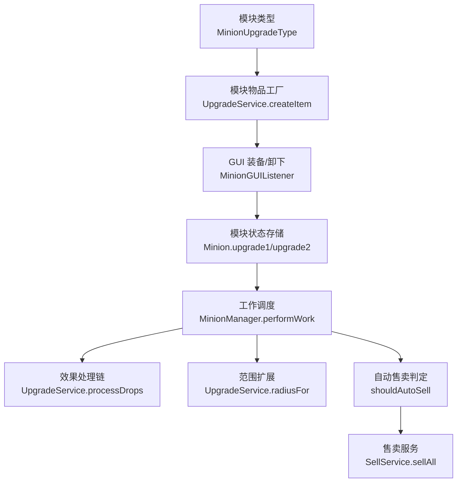
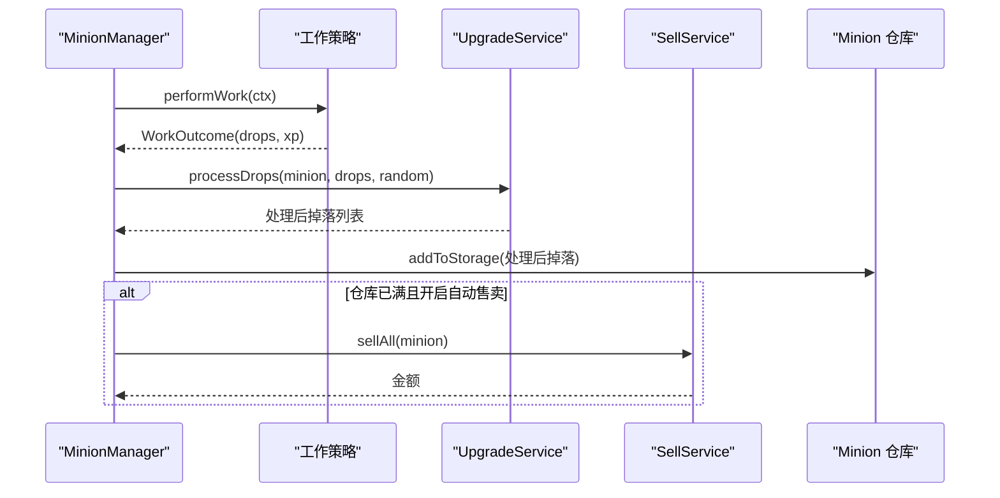
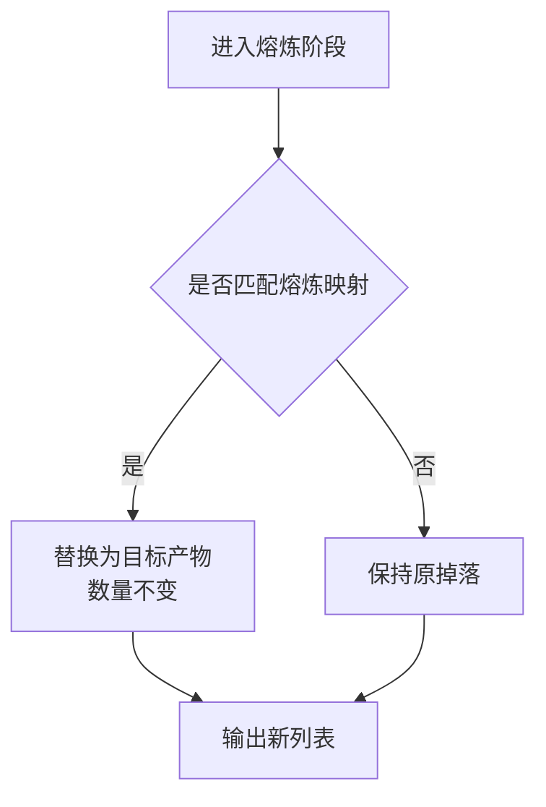
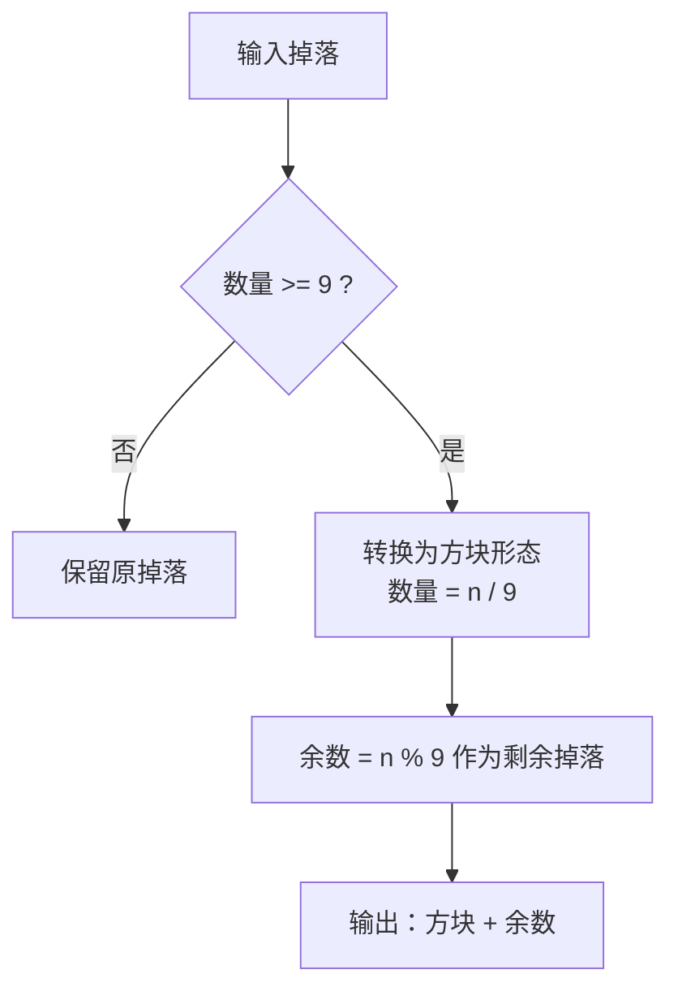
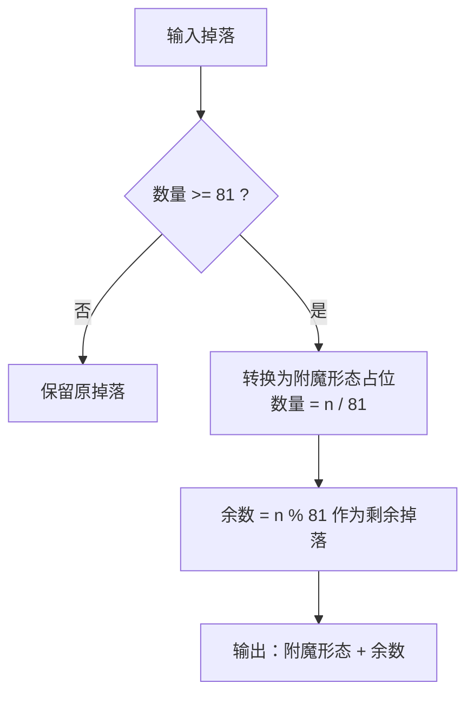
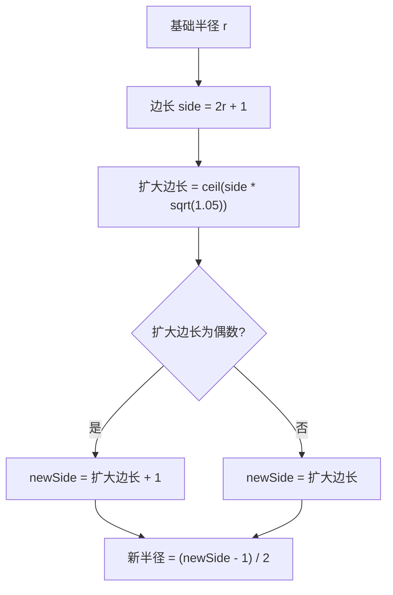
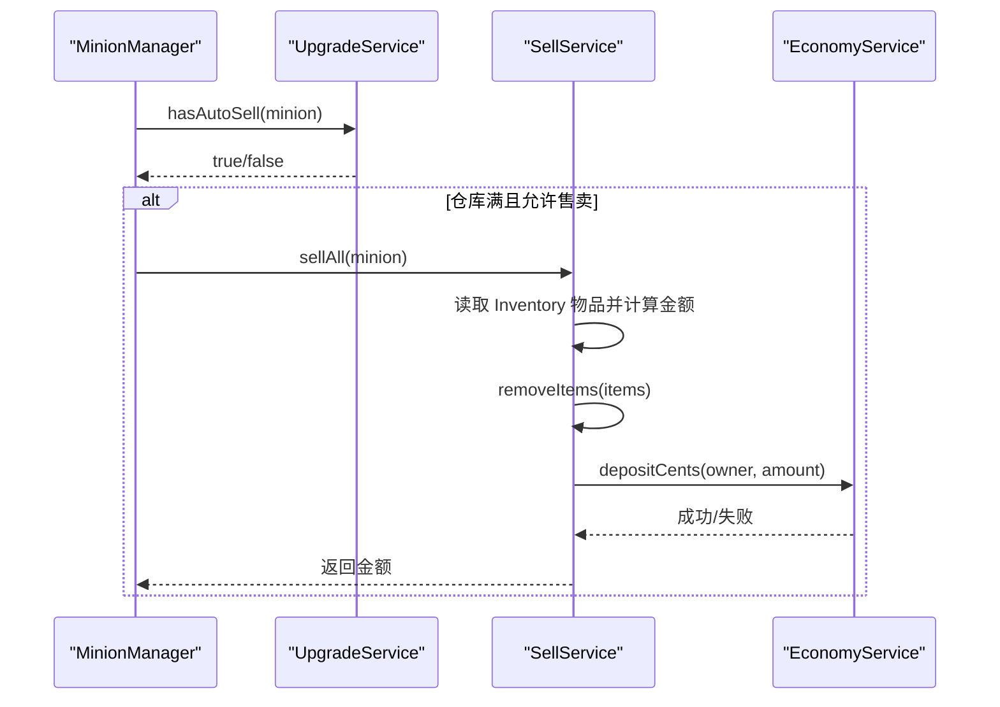
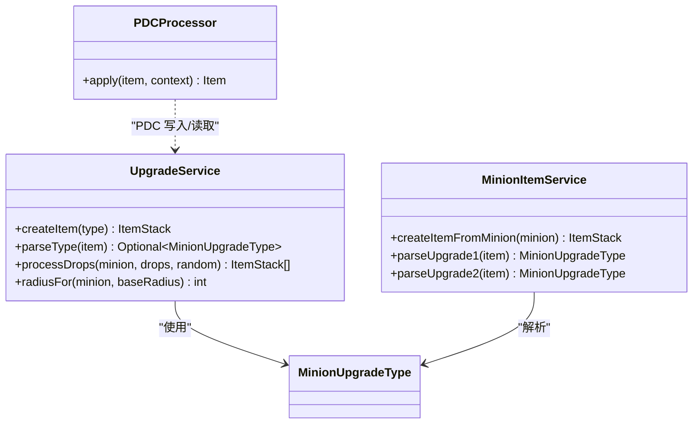
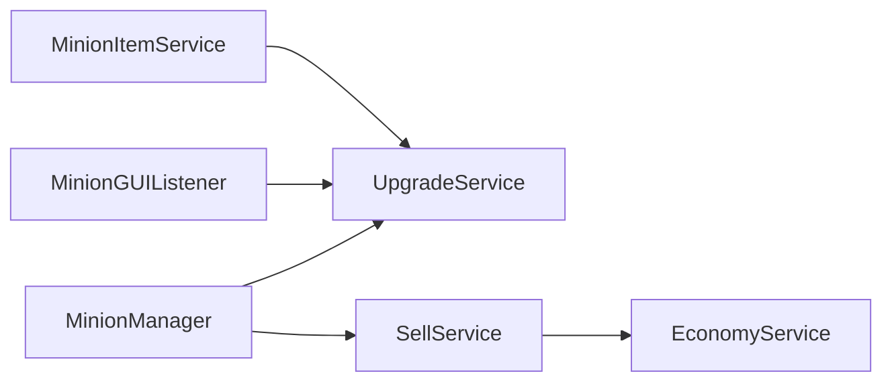

# 模块系统功能

<cite>
**本文引用的文件**
- [MinionUpgradeType.java](file://src/main/java/com/hcs/minions/upgrade/MinionUpgradeType.java)
- [UpgradeService.java](file://src/main/java/com/hcs/minions/upgrade/UpgradeService.java)
- [MinionItemService.java](file://src/main/java/com/hcs/minions/service/MinionItemService.java)
- [MinionGUIListener.java](file://src/main/java/com/hcs/minions/gui/MinionGUIListener.java)
- [MinionManager.java](file://src/main/java/com/hcs/minions/service/MinionManager.java)
- [SellService.java](file://src/main/java/com/hcs/minions/service/SellService.java)
- [EconomyConfig.java](file://src/main/java/com/hcs/minions/config/EconomyConfig.java)
- [EconomyService.java](file://src/main/java/com/hcs/minions/service/EconomyService.java)
- [PDCProcessor.java](file://craft-engine/core/src/main/java/net/momirealms/craftengine/core/item/processor/PDCProcessor.java)
</cite>

## 目录
1. [简介](#简介)
2. [项目结构](#项目结构)
3. [核心组件](#核心组件)
4. [架构总览](#架构总览)
5. [详细组件分析](#详细组件分析)
6. [依赖关系分析](#依赖关系分析)
7. [性能考量](#性能考量)
8. [故障排查指南](#故障排查指南)
9. [结论](#结论)
10. [附录](#附录)

## 简介
本文件系统性说明 SkyMinions 的模块系统，覆盖 6 种模块槽位与效果、装备机制、获取方式、叠加规则与优先级、物品工厂实现（含 PDC 数据与跨重启安全）、以及组合优化建议与性能影响。文档以源码为依据，提供可视化图示帮助理解。

## 项目结构
模块系统由“类型定义 + 物品工厂 + GUI 交互 + 效果结算 + 工作调度 + 自动售卖”组成：
- 类型定义：枚举集中声明 6 种模块及其元信息
- 物品工厂：生成带 PDC 的模块物品，支持跨重启识别
- GUI 交互：玩家通过 GUI 将模块装入两个升级槽位
- 效果结算：在每次工作后对掉落物执行处理链（熔炼/压缩/散布）
- 工作调度：管理器统一编排工作、范围扩展、稀有掉落、入仓与售卖
- 自动售卖：仓库满时按配置或模块触发出售

图表来源
- [MinionUpgradeType.java:23-30](file://src/main/java/com/hcs/minions/upgrade/MinionUpgradeType.java#L23-L30)
- [UpgradeService.java:114-128](file://src/main/java/com/hcs/minions/upgrade/UpgradeService.java#L114-L128)
- [MinionGUIListener.java:155-184](file://src/main/java/com/hcs/minions/gui/MinionGUIListener.java#L155-L184)
- [MinionManager.java:252-327](file://src/main/java/com/hcs/minions/service/MinionManager.java#L252-L327)
- [SellService.java:41-79](file://src/main/java/com/hcs/minions/service/SellService.java#L41-L79)

章节来源
- [MinionUpgradeType.java:23-30](file://src/main/java/com/hcs/minions/upgrade/MinionUpgradeType.java#L23-L30)
- [UpgradeService.java:114-128](file://src/main/java/com/hcs/minions/upgrade/UpgradeService.java#L114-L128)
- [MinionGUIListener.java:155-184](file://src/main/java/com/hcs/minions/gui/MinionGUIListener.java#L155-L184)
- [MinionManager.java:252-327](file://src/main/java/com/hcs/minions/service/MinionManager.java#L252-L327)
- [SellService.java:41-79](file://src/main/java/com/hcs/minions/service/SellService.java#L41-L79)

## 核心组件
- 模块类型枚举：定义 6 种模块键名、显示名、图标与描述，并提供 fromKey 解析
- 升级服务：模块物品工厂、模块识别、效果处理链、范围扩展计算、自动售卖检测
- 仆从模型：维护两个模块槽位、GUI 布局、解锁条件、刷新渲染
- GUI 监听器：模块槽点击事件处理（装备/卸下/提示）
- 管理器：工作调度、调用升级服务处理掉落、范围扩展、自动售卖触发
- 售卖服务：经济集成、先扣物后加款的安全流程
- 物品工厂（仆从）：将仆从完整状态（含模块）序列化到物品 PDC，跨重启安全

章节来源
- [MinionUpgradeType.java:23-67](file://src/main/java/com/hcs/minions/upgrade/MinionUpgradeType.java#L23-L67)
- [UpgradeService.java:30-108](file://src/main/java/com/hcs/minions/upgrade/UpgradeService.java#L30-L108)
- [Minion.java:41-66](file://src/main/java/com/hcs/minions/model/Minion.java#L41-L66)
- [MinionGUIListener.java:155-184](file://src/main/java/com/hcs/minions/gui/MinionGUIListener.java#L155-L184)
- [MinionManager.java:252-327](file://src/main/java/com/hcs/minions/service/MinionManager.java#L252-L327)
- [SellService.java:41-79](file://src/main/java/com/hcs/minions/service/SellService.java#L41-L79)
- [MinionItemService.java:104-125](file://src/main/java/com/hcs/minions/service/MinionItemService.java#L104-L125)

## 架构总览
模块系统在“工作流”中接入：策略产出掉落 -> 升级服务处理链 -> 稀有掉落追加 -> 入仓 -> 若满足条件则自动售卖。范围扩展在工作前生效，影响搜索半径。

图表来源
- [MinionManager.java:252-327](file://src/main/java/com/hcs/minions/service/MinionManager.java#L252-L327)
- [UpgradeService.java:173-191](file://src/main/java/com/hcs/minions/upgrade/UpgradeService.java#L173-L191)
- [SellService.java:41-79](file://src/main/java/com/hcs/minions/service/SellService.java#L41-L79)

## 详细组件分析

### 模块类型与槽位
- 6 种模块：自动熔炼、自动压缩、超级压缩、钻石散布、范围扩展、自动售卖漏斗
- 每个模块具备唯一 key、显示名、图标、描述；可通过字符串 key 反查枚举
- 模块槽位：两个升级槽（第 1 槽在第 4 级解锁，第 2 槽在第 8 级解锁），未解锁时 GUI 显示锁定提示

章节来源
- [MinionUpgradeType.java:23-30](file://src/main/java/com/hcs/minions/upgrade/MinionUpgradeType.java#L23-L30)
- [MinionUpgradeType.java:61-67](file://src/main/java/com/hcs/minions/upgrade/MinionUpgradeType.java#L61-L67)
- [Minion.java:128-141](file://src/main/java/com/hcs/minions/model/Minion.java#L128-L141)
- [Minion.java:441-456](file://src/main/java/com/hcs/minions/model/Minion.java#L441-L456)

### 自动熔炼模块（矿石自动转化为锭）
- 作用：将特定矿石/沙子映射为对应产物（如各类 ore -> ingot/glass 等）
- 实现：内置映射表，遍历掉落进行类型替换，数量不变
- 优先级：在处理链最前端，优先于压缩类模块

图表来源
- [UpgradeService.java:34-55](file://src/main/java/com/hcs/minions/upgrade/UpgradeService.java#L34-L55)
- [UpgradeService.java:193-200](file://src/main/java/com/hcs/minions/upgrade/UpgradeService.java#L193-L200)

章节来源
- [UpgradeService.java:34-55](file://src/main/java/com/hcs/minions/upgrade/UpgradeService.java#L34-L55)
- [UpgradeService.java:193-200](file://src/main/java/com/hcs/minions/upgrade/UpgradeService.java#L193-L200)

### 自动压缩模块（散装资源 9:1 压缩）
- 作用：将散装资源按 9:1 合成为方块形态（如铁锭 -> 铁块）
- 实现：映射表 + 比例换算，不足 9 个不转换
- 优先级：仅在未装备超级压缩时生效

图表来源
- [UpgradeService.java:57-78](file://src/main/java/com/hcs/minions/upgrade/UpgradeService.java#L57-L78)
- [UpgradeService.java:202-204](file://src/main/java/com/hcs/minions/upgrade/UpgradeService.java#L202-L204)
- [UpgradeService.java:210-230](file://src/main/java/com/hcs/minions/upgrade/UpgradeService.java#L210-L230)

章节来源
- [UpgradeService.java:57-78](file://src/main/java/com/hcs/minions/upgrade/UpgradeService.java#L57-L78)
- [UpgradeService.java:202-204](file://src/main/java/com/hcs/minions/upgrade/UpgradeService.java#L202-L204)
- [UpgradeService.java:210-230](file://src/main/java/com/hcs/minions/upgrade/UpgradeService.java#L210-L230)

### 超级压缩模块（81:1 附魔形态压缩）
- 作用：将散装资源以 81:1 的比例压缩为“附魔形态”（代码中以方块作为占位目标）
- 实现：映射表 + 81:1 比例换算，不足 81 个不转换
- 优先级：高于普通压缩，二者互斥（同时存在时仅超级压缩生效）

图表来源
- [UpgradeService.java:80-98](file://src/main/java/com/hcs/minions/upgrade/UpgradeService.java#L80-L98)
- [UpgradeService.java:206-208](file://src/main/java/com/hcs/minions/upgrade/UpgradeService.java#L206-L208)
- [UpgradeService.java:210-230](file://src/main/java/com/hcs/minions/upgrade/UpgradeService.java#L210-L230)

章节来源
- [UpgradeService.java:80-98](file://src/main/java/com/hcs/minions/upgrade/UpgradeService.java#L80-L98)
- [UpgradeService.java:206-208](file://src/main/java/com/hcs/minions/upgrade/UpgradeService.java#L206-L208)
- [UpgradeService.java:210-230](file://src/main/java/com/hcs/minions/upgrade/UpgradeService.java#L210-L230)

### 钻石散布模块（10% 概率额外产出钻石）
- 作用：每次工作有 10% 概率额外获得 1 个钻石
- 实现：随机判断，独立于熔炼/压缩阶段，直接追加掉落
- 注意：该效果发生在处理链末尾，不影响其他模块的转换结果

章节来源
- [UpgradeService.java:100-101](file://src/main/java/com/hcs/minions/upgrade/UpgradeService.java#L100-L101)
- [UpgradeService.java:187-189](file://src/main/java/com/hcs/minions/upgrade/UpgradeService.java#L187-L189)

### 范围扩展模块（+5% 搜索面积）
- 作用：工作面积增加 5%，非半径 +1，而是基于 (2r+1)^2 的面积放大后反推新半径
- 实现：根据基础半径计算扩大后的边长并取整，保证对称奇数边长
- 使用：在工作上下文创建时传入扩大后的半径，影响搜索范围

图表来源
- [UpgradeService.java:146-166](file://src/main/java/com/hcs/minions/upgrade/UpgradeService.java#L146-L166)
- [MinionManager.java:257-258](file://src/main/java/com/hcs/minions/service/MinionManager.java#L257-L258)

章节来源
- [UpgradeService.java:146-166](file://src/main/java/com/hcs/minions/upgrade/UpgradeService.java#L146-L166)
- [MinionManager.java:257-258](file://src/main/java/com/hcs/minions/service/MinionManager.java#L257-L258)

### 自动售卖漏斗模块（仓库满时自动售卖）
- 作用：当仓库满时，自动触发售卖逻辑（与 GUI 中的“自动售卖”开关等效）
- 实现：管理器在每次工作后与定时轮询中检查 shouldAutoSell，若满足则调用售卖服务
- 售卖流程：先在区域线程读取真实物品并计算金额，扣物成功后异步加款，失败记录日志

图表来源
- [MinionManager.java:318-327](file://src/main/java/com/hcs/minions/service/MinionManager.java#L318-L327)
- [SellService.java:41-79](file://src/main/java/com/hcs/minions/service/SellService.java#L41-L79)
- [EconomyService.java:55-64](file://src/main/java/com/hcs/minions/service/EconomyService.java#L55-L64)

章节来源
- [MinionManager.java:318-327](file://src/main/java/com/hcs/minions/service/MinionManager.java#L318-L327)
- [SellService.java:41-79](file://src/main/java/com/hcs/minions/service/SellService.java#L41-L79)
- [EconomyService.java:55-64](file://src/main/java/com/hcs/minions/service/EconomyService.java#L55-L64)

### 模块的获取方式与装备机制
- 获取方式：通过 UpgradeService.createItem(type) 生成模块物品，携带 PDC 标识类型
- 装备机制：在 GUI 中手持模块点击模块槽位进行装备；已装备槽位再次点击可卸下
- 解锁限制：低于等级门槛的槽位不可操作，GUI 会显示锁定提示
- 状态持久化：模块类型以字符串 key 存储在 Minion 对象中，随 Minion 数据一起保存

章节来源
- [UpgradeService.java:114-128](file://src/main/java/com/hcs/minions/upgrade/UpgradeService.java#L114-L128)
- [MinionGUIListener.java:155-184](file://src/main/java/com/hcs/minions/gui/MinionGUIListener.java#L155-L184)
- [Minion.java:128-141](file://src/main/java/com/hcs/minions/model/Minion.java#L128-L141)
- [Minion.java:613-634](file://src/main/java/com/hcs/minions/model/Minion.java#L613-L634)

### 效果叠加规则与优先级
- 处理链顺序：自动熔炼 -> 自动压缩/超级压缩（互斥） -> 钻石散布
- 互斥规则：超级压缩与普通压缩不同时生效，超级压缩优先级更高
- 叠加规则：熔炼与压缩可叠加；钻石散布独立追加；范围扩展影响搜索半径但不改变掉落
- 自动售卖：与 GUI 开关等效，满足条件即触发

章节来源
- [UpgradeService.java:173-191](file://src/main/java/com/hcs/minions/upgrade/UpgradeService.java#L173-L191)
- [MinionManager.java:289-327](file://src/main/java/com/hcs/minions/service/MinionManager.java#L289-L327)

### 模块物品工厂的实现细节（PDC 与跨重启安全）
- PDC 存储：模块物品通过 PersistentDataContainer 写入 NamespacedKey 与类型 key，用于识别模块类型
- 跨重启安全：模块类型以字符串 key 持久化，重启后可通过 fromKey 恢复为枚举
- 仆从物品工厂：拾取仆从时将仓库内容、燃料、模块、皮肤等全部编码进物品 PDC，重新放置即可恢复
- 引擎侧 PDC 处理器：在 1.20.5+ 版本下将 PDC 写入 CUSTOM_DATA 组件，兼容旧版本的 tag 存储

图表来源
- [UpgradeService.java:114-140](file://src/main/java/com/hcs/minions/upgrade/UpgradeService.java#L114-L140)
- [MinionItemService.java:104-125](file://src/main/java/com/hcs/minions/service/MinionItemService.java#L104-L125)
- [PDCProcessor.java:22-32](file://craft-engine/core/src/main/java/net/momirealms/craftengine/core/item/processor/PDCProcessor.java#L22-L32)

章节来源
- [UpgradeService.java:114-140](file://src/main/java/com/hcs/minions/upgrade/UpgradeService.java#L114-L140)
- [MinionItemService.java:104-125](file://src/main/java/com/hcs/minions/service/MinionItemService.java#L104-L125)
- [PDCProcessor.java:22-32](file://craft-engine/core/src/main/java/net/momirealms/craftengine/core/item/processor/PDCProcessor.java#L22-L32)

## 依赖关系分析
- MinionManager 依赖 UpgradeService 进行掉落处理与范围扩展
- GUI 监听器依赖 UpgradeService 解析模块物品类型
- SellService 依赖 EconomyService 完成计价与加款
- MinionItemService 依赖 UpgradeService 解析模块类型，确保拾取/放置时的状态一致性

图表来源
- [MinionManager.java:252-327](file://src/main/java/com/hcs/minions/service/MinionManager.java#L252-L327)
- [MinionGUIListener.java:155-184](file://src/main/java/com/hcs/minions/gui/MinionGUIListener.java#L155-L184)
- [SellService.java:41-79](file://src/main/java/com/hcs/minions/service/SellService.java#L41-L79)
- [EconomyService.java:55-64](file://src/main/java/com/hcs/minions/service/EconomyService.java#L55-L64)
- [MinionItemService.java:104-125](file://src/main/java/com/hcs/minions/service/MinionItemService.java#L104-L125)

章节来源
- [MinionManager.java:252-327](file://src/main/java/com/hcs/minions/service/MinionManager.java#L252-L327)
- [MinionGUIListener.java:155-184](file://src/main/java/com/hcs/minions/gui/MinionGUIListener.java#L155-L184)
- [SellService.java:41-79](file://src/main/java/com/hcs/minions/service/SellService.java#L41-L79)
- [EconomyService.java:55-64](file://src/main/java/com/hcs/minions/service/EconomyService.java#L55-L64)
- [MinionItemService.java:104-125](file://src/main/java/com/hcs/minions/service/MinionItemService.java#L104-L125)

## 性能考量
- 处理链效率：熔炼/压缩均为线性遍历，复杂度 O(n)，n 为掉落数量；避免重复修改入参，减少 GC 压力
- 范围扩展：基于数学公式计算，常数时间开销
- 自动售卖：仅在仓库满时触发，且先扣物后加款，避免并发刷钱窗口
- 线程安全：所有 Inventory 访问均在区域线程执行，全局调度只做只读判断，符合 Folia 安全要求
- 存储序列化：批量快照落库，减少频繁 IO 开销

[本节为通用指导，无需具体文件引用]

## 故障排查指南
- 模块无法装备：检查模块槽是否已解锁（等级门槛），确认手持物品是否为有效模块（PDC 包含类型 key）
- 自动售卖未触发：确认应满足“仓库满 + 开启自动售卖（GUI 开关或模块）”，并检查经济插件是否启用
- 压缩未生效：确认数量达到比例阈值（9 或 81），且未与其他互斥模块冲突
- 范围扩展无效：确认已装备范围扩展模块，并在工作上下文中正确传入扩大后的半径
- 数据丢失：检查 Minion 数据是否标记脏并成功快照落库；确认拾取/放置时 PDC 字段完整

章节来源
- [MinionGUIListener.java:155-184](file://src/main/java/com/hcs/minions/gui/MinionGUIListener.java#L155-L184)
- [MinionManager.java:318-327](file://src/main/java/com/hcs/minions/service/MinionManager.java#L318-L327)
- [UpgradeService.java:173-191](file://src/main/java/com/hcs/minions/upgrade/UpgradeService.java#L173-L191)
- [SellService.java:41-79](file://src/main/java/com/hcs/minions/service/SellService.java#L41-L79)

## 结论
SkyMinions 的模块系统以清晰的类型定义、安全的 PDC 存储、严格的工作调度与售卖流程为核心，实现了与 Hypixel 原版一致的体验。通过模块化设计，各效果解耦且可组合，兼顾了易用性与性能。推荐在生产环境中合理搭配模块以获得最佳收益与稳定性。

[本节为总结性内容，无需具体文件引用]

## 附录
- 模块类型键名与用途速查：
  - auto_smelter：矿石/沙子 -> 熔炼产物
  - compactor：散装 -> 9:1 方块形态
  - super_compactor：散装 -> 81:1 附魔形态（代码中以方块占位）
  - diamond_spreading：10% 概率额外钻石
  - minion_expander：工作面积 +5%
  - auto_seller：仓库满时自动售卖

章节来源
- [MinionUpgradeType.java:23-30](file://src/main/java/com/hcs/minions/upgrade/MinionUpgradeType.java#L23-L30)