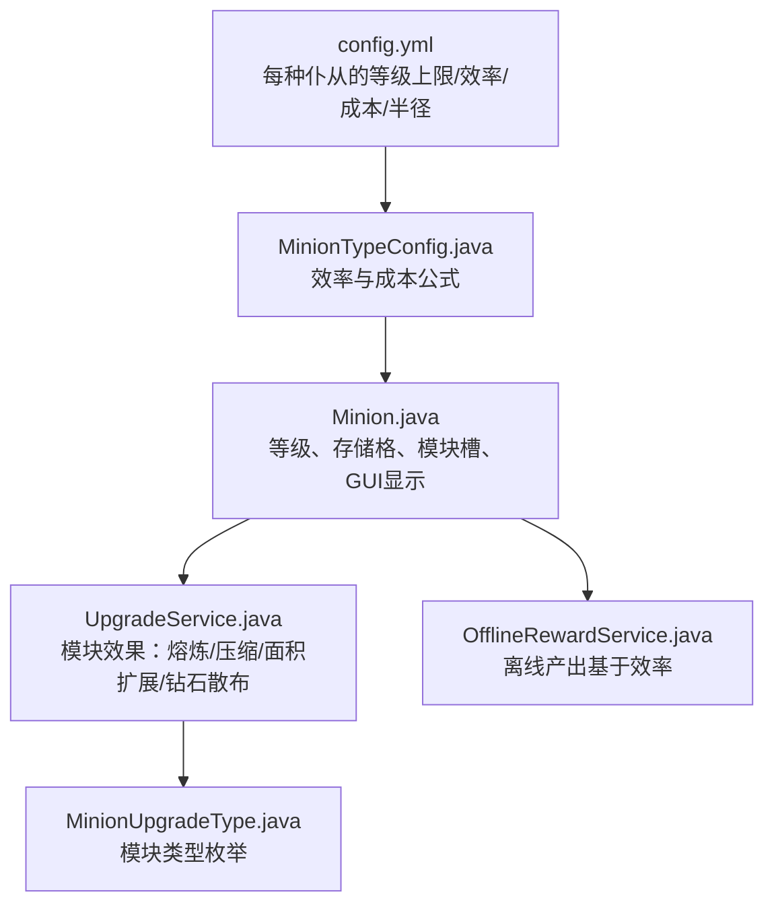
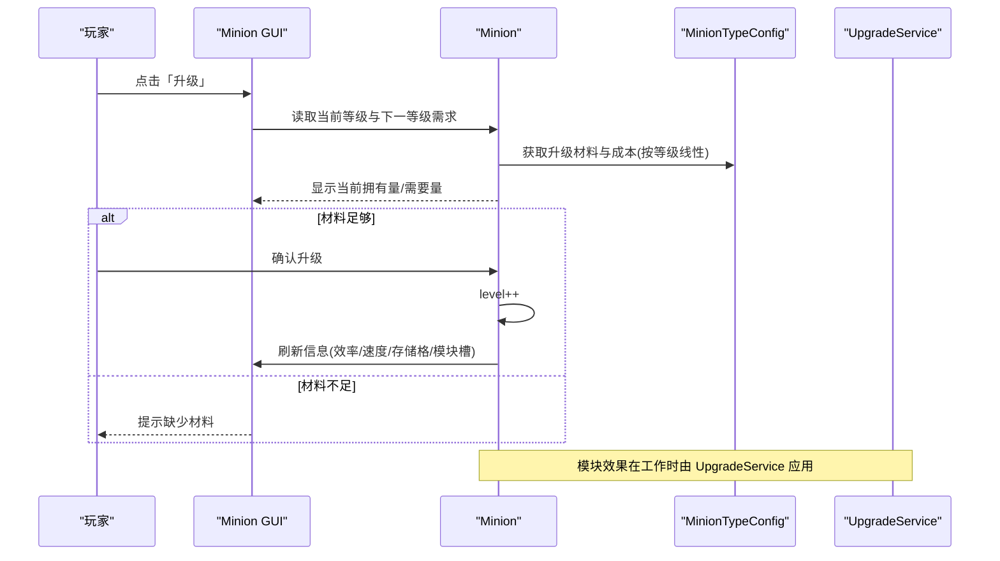
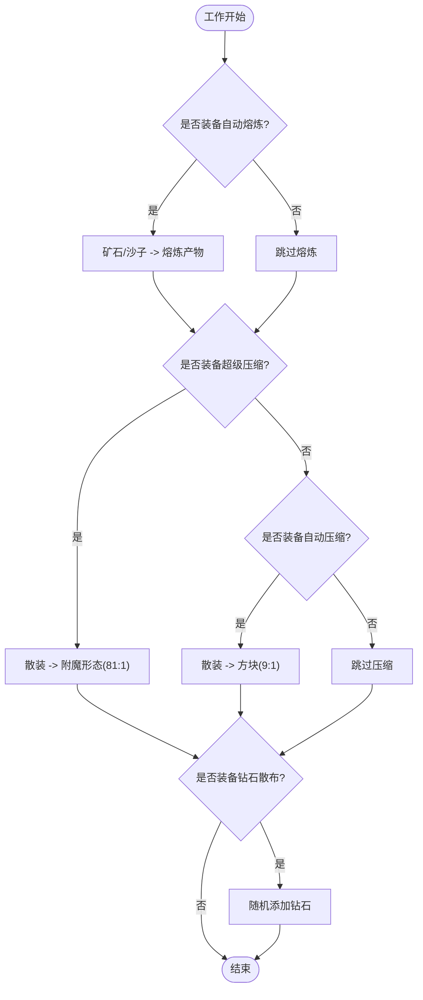
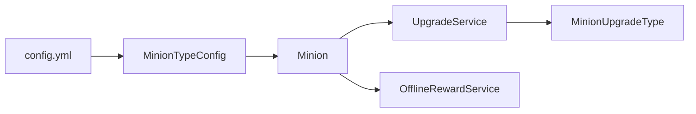

# 等级提升机制

<cite>
**本文引用的文件**
- [config.yml](file://src/main/resources/config.yml)
- [MinionTypeConfig.java](file://src/main/java/com/hcs/minions/config/MinionTypeConfig.java)
- [PluginConfig.java](file://src/main/java/com/hcs/minions/config/PluginConfig.java)
- [Minion.java](file://src/main/java/com/hcs/minions/model/Minion.java)
- [UpgradeService.java](file://src/main/java/com/hcs/minions/upgrade/UpgradeService.java)
- [MinionUpgradeType.java](file://src/main/java/com/hcs/minions/upgrade/MinionUpgradeType.java)
- [OfflineRewardService.java](file://src/main/java/com/hcs/minions/service/OfflineRewardService.java)
- [UpgradeServiceTest.java](file://src/test/java/com/hcs/minions/upgrade/UpgradeServiceTest.java)
</cite>

## 目录
1. [简介](#简介)
2. [项目结构](#项目结构)
3. [核心组件](#核心组件)
4. [架构总览](#架构总览)
5. [详细组件分析](#详细组件分析)
6. [依赖关系分析](#依赖关系分析)
7. [性能与平衡性](#性能与平衡性)
8. [故障排查指南](#故障排查指南)
9. [结论](#结论)
10. [附录：配置与扩展](#附录配置与扩展)

## 简介
本文件系统性说明 SkyMinions 的 12 级等级体系与升级机制，覆盖每个等级的升级条件、所需材料数量、成本计算公式、属性增强效果，以及等级提升对仆从工作性能（工作效率、搜索范围、产出倍率等）的影响。同时解释升级系统的平衡性设计原理（材料消耗递增曲线、效率提升递减策略），提供不同等级下的性能对比数据与升级策略建议，并给出配置选项说明与自定义等级扩展指南。

## 项目结构
围绕等级提升的核心代码分布在以下位置：
- 配置层：全局与类型级配置定义在 resources/config.yml 与 config/MinionTypeConfig.java、config/PluginConfig.java
- 模型层：Minion.java 承载等级、存储、模块槽、GUI 渲染与状态
- 升级模块层：upgrade/UpgradeService.java 与 upgrade/MinionUpgradeType.java 实现模块物品与效果结算
- 离线收益：service/OfflineRewardService.java 使用效率计算离线产出

图表来源
- [config.yml:47-153](file://src/main/resources/config.yml#L47-L153)
- [MinionTypeConfig.java:51-62](file://src/main/java/com/hcs/minions/config/MinionTypeConfig.java#L51-L62)
- [Minion.java:123-141](file://src/main/java/com/hcs/minions/model/Minion.java#L123-L141)
- [UpgradeService.java:147-163](file://src/main/java/com/hcs/minions/upgrade/UpgradeService.java#L147-L163)
- [MinionUpgradeType.java:23-30](file://src/main/java/com/hcs/minions/upgrade/MinionUpgradeType.java#L23-L30)
- [OfflineRewardService.java:83-94](file://src/main/java/com/hcs/minions/service/OfflineRewardService.java#L83-L94)

章节来源
- [config.yml:47-153](file://src/main/resources/config.yml#L47-L153)
- [MinionTypeConfig.java:51-62](file://src/main/java/com/hcs/minions/config/MinionTypeConfig.java#L51-L62)
- [Minion.java:123-141](file://src/main/java/com/hcs/minions/model/Minion.java#L123-L141)
- [UpgradeService.java:147-163](file://src/main/java/com/hcs/minions/upgrade/UpgradeService.java#L147-L163)
- [MinionUpgradeType.java:23-30](file://src/main/java/com/hcs/minions/upgrade/MinionUpgradeType.java#L23-L30)
- [OfflineRewardService.java:83-94](file://src/main/java/com/hcs/minions/service/OfflineRewardService.java#L83-L94)

## 核心组件
- MinionTypeConfig：定义每种仆从类型的等级上限、基础效率、每级效率增量、冷却时间、升级材料与成本、固定工作半径、稀有掉落等。
- Minion：运行时实体，维护等级、燃料、存储格、模块槽、GUI 渲染、工作调度等。
- UpgradeService：模块物品工厂与效果结算（自动熔炼、自动压缩、超级压缩、钻石散布、范围扩展）。
- MinionUpgradeType：模块类型枚举，包含图标、描述、键值。
- OfflineRewardService：离线收益计算，依赖效率与冷却时间。

章节来源
- [MinionTypeConfig.java:21-62](file://src/main/java/com/hcs/minions/config/MinionTypeConfig.java#L21-L62)
- [Minion.java:70-90](file://src/main/java/com/hcs/minions/model/Minion.java#L70-L90)
- [UpgradeService.java:19-28](file://src/main/java/com/hcs/minions/upgrade/UpgradeService.java#L19-L28)
- [MinionUpgradeType.java:8-22](file://src/main/java/com/hcs/minions/upgrade/MinionUpgradeType.java#L8-L22)
- [OfflineRewardService.java:83-94](file://src/main/java/com/hcs/minions/service/OfflineRewardService.java#L83-L94)

## 架构总览
等级提升机制由“配置驱动 + 模型计算 + 模块增强”三部分构成：
- 配置层提供每种仆从的等级上限（默认 12）、效率增长参数、升级材料与成本、固定工作半径等。
- 模型层根据当前等级计算效率、存储格数、模块槽解锁、GUI 展示信息（速度、范围、存储容量、下次工作时间等）。
- 模块层在不改变基础等级体系的前提下，通过模块提供额外增益（熔炼、压缩、面积扩展、钻石散布、自动售卖）。

图表来源
- [Minion.java:419-439](file://src/main/java/com/hcs/minions/model/Minion.java#L419-L439)
- [MinionTypeConfig.java:55-57](file://src/main/java/com/hcs/minions/config/MinionTypeConfig.java#L55-L57)
- [UpgradeService.java:174-187](file://src/main/java/com/hcs/minions/upgrade/UpgradeService.java#L174-L187)

## 详细组件分析

### 等级体系与升级条件
- 等级上限：每种仆从类型在配置中设置 max-level，默认均为 12。
- 升级材料：upgrade-item 指定升级所需材料类型（如圆石、小麦、原木等）。
- 升级成本：upgrade-cost × 当前等级，即线性递增；例如基础 64，第 N 级升级到 N+1 需 64×N。
- 升级操作：Minion.upgrade 将等级加一并标记脏状态以便持久化。

章节来源
- [config.yml:47-153](file://src/main/resources/config.yml#L47-L153)
- [MinionTypeConfig.java:55-57](file://src/main/java/com/hcs/minions/config/MinionTypeConfig.java#L55-L57)
- [Minion.java:279-286](file://src/main/java/com/hcs/minions/model/Minion.java#L279-L286)

### 属性增强效果（随等级变化）
- 工作效率：efficiencyAt(level) = baseEfficiency + efficiencyPerLevel × (level - 1)。每升一级效率线性增加。
- 单次工作秒数：secondsPerAction = cooldownTicks / 20 / efficiency / fuelBoost。效率越高，单次工作耗时越短。
- 每小时产出估算：itemsPerHour = 3600 / secondsPerAction。
- 存储格数：unlockedSlots = min(36, 9 + (level - 1) × 3)，每级增加 3 格，至满 36 格。
- 模块槽解锁：等级 4 解锁第 1 个模块槽，等级 8 解锁第 2 个模块槽。
- 搜索范围：基础半径固定为 baseRadius（默认 2，即 5x5），不随等级变化；可通过「范围扩展」模块以面积 +5% 的方式近似扩大。

章节来源
- [MinionTypeConfig.java:51-62](file://src/main/java/com/hcs/minions/config/MinionTypeConfig.java#L51-L62)
- [Minion.java:123-141](file://src/main/java/com/hcs/minions/model/Minion.java#L123-L141)
- [Minion.java:346-378](file://src/main/java/com/hcs/minions/model/Minion.java#L346-L378)
- [UpgradeService.java:147-163](file://src/main/java/com/hcs/minions/upgrade/UpgradeService.java#L147-L163)

### 模块系统对性能的叠加影响
- 自动熔炼：矿石/沙子直接转换为对应产物，减少后续处理步骤。
- 自动压缩：散装资源按 9:1 合成为方块形态，提高存储密度。
- 超级压缩：散装资源按 81:1 合成为附魔形态占位，极大提升存储效率。
- 钻石散布：每次工作有概率额外产出钻石（固定概率）。
- 范围扩展：工作面积 +5%，通过面积反推边长与半径，保持奇数对称。
- 自动售卖：仓库满时自动出售产物（可配合经济插件）。

图表来源
- [UpgradeService.java:174-187](file://src/main/java/com/hcs/minions/upgrade/UpgradeService.java#L174-L187)
- [UpgradeService.java:190-232](file://src/main/java/com/hcs/minions/upgrade/UpgradeService.java#L190-L232)
- [MinionUpgradeType.java:23-30](file://src/main/java/com/hcs/minions/upgrade/MinionUpgradeType.java#L23-L30)

章节来源
- [UpgradeService.java:174-187](file://src/main/java/com/hcs/minions/upgrade/UpgradeService.java#L174-L187)
- [UpgradeService.java:190-232](file://src/main/java/com/hcs/minions/upgrade/UpgradeService.java#L190-L232)
- [MinionUpgradeType.java:23-30](file://src/main/java/com/hcs/minions/upgrade/MinionUpgradeType.java#L23-L30)

### 不同等级下的性能对比
以下为典型矿工仆从（cooldown=20 tick，baseEfficiency=1.0，efficiencyPerLevel=0.1）在不同等级下的关键指标（不含燃料加成与模块效果）：
- 等级 1：效率 1.0，单次工作 1.0 秒，约 3600 次/小时
- 等级 4：效率 1.3，单次工作约 0.77 秒，约 4662 次/小时
- 等级 8：效率 1.7，单次工作约 0.59 秒，约 6102 次/小时
- 等级 12：效率 2.1，单次工作约 0.48 秒，约 7500 次/小时

存储格与模块槽：
- 等级 1：9 格存储，无模块槽
- 等级 4：18 格存储，解锁第 1 模块槽
- 等级 8：27 格存储，解锁第 2 模块槽
- 等级 12：36 格存储，满格

搜索范围：
- 基础固定 5x5（半径 2），不随等级变化；若装备「范围扩展」模块，面积 +5%，近似半径从 2 提升到 3（测试用例验证）。

章节来源
- [config.yml:47-153](file://src/main/resources/config.yml#L47-L153)
- [MinionTypeConfig.java:51-62](file://src/main/java/com/hcs/minions/config/MinionTypeConfig.java#L51-L62)
- [Minion.java:123-141](file://src/main/java/com/hcs/minions/model/Minion.java#L123-L141)
- [UpgradeServiceTest.java:33-43](file://src/test/java/com/hcs/minions/upgrade/UpgradeServiceTest.java#L33-L43)

### 升级策略建议
- 前期（1→4）：优先堆效率，缩短单次工作时长，快速积累资源；注意存储格逐步解锁，及时清空或扩容。
- 中期（4→8）：解锁第 1 模块槽后，优先装配「自动压缩」或「超级压缩」提升存储密度；若资源种类多且量大，超级压缩更优。
- 后期（8→12）：解锁第 2 模块槽，可组合「自动熔炼 + 超级压缩」最大化产出价值与存储效率；必要时搭配「范围扩展」提升采集面。
- 燃料管理：限时与永久燃料均可加速，注意优先级与衰减；离线收益受效率与冷却时间影响，合理配置离线倍率。

[本节为通用策略建议，不直接分析具体文件]

## 依赖关系分析
等级提升机制的关键依赖如下：
- Minion 依赖 MinionTypeConfig 获取效率与成本；
- Minion 依赖 UpgradeService 应用模块效果；
- OfflineRewardService 依赖 Minion 的效率与冷却时间计算离线产出；
- 配置集中管理于 config.yml，启动时加载为不可变快照。

图表来源
- [config.yml:47-153](file://src/main/resources/config.yml#L47-L153)
- [MinionTypeConfig.java:51-62](file://src/main/java/com/hcs/minions/config/MinionTypeConfig.java#L51-L62)
- [Minion.java:346-378](file://src/main/java/com/hcs/minions/model/Minion.java#L346-L378)
- [UpgradeService.java:174-187](file://src/main/java/com/hcs/minions/upgrade/UpgradeService.java#L174-L187)
- [MinionUpgradeType.java:23-30](file://src/main/java/com/hcs/minions/upgrade/MinionUpgradeType.java#L23-L30)
- [OfflineRewardService.java:83-94](file://src/main/java/com/hcs/minions/service/OfflineRewardService.java#L83-L94)

章节来源
- [config.yml:47-153](file://src/main/resources/config.yml#L47-L153)
- [MinionTypeConfig.java:51-62](file://src/main/java/com/hcs/minions/config/MinionTypeConfig.java#L51-L62)
- [Minion.java:346-378](file://src/main/java/com/hcs/minions/model/Minion.java#L346-L378)
- [UpgradeService.java:174-187](file://src/main/java/com/hcs/minions/upgrade/UpgradeService.java#L174-L187)
- [MinionUpgradeType.java:23-30](file://src/main/java/com/hcs/minions/upgrade/MinionUpgradeType.java#L23-L30)
- [OfflineRewardService.java:83-94](file://src/main/java/com/hcs/minions/service/OfflineRewardService.java#L83-L94)

## 性能与平衡性
- 材料消耗递增曲线：升级成本 = upgrade-cost × 当前等级，呈线性递增；便于服主通过调整基础成本控制整体难度。
- 效率提升递减策略：效率按每级固定增量线性增长，但边际收益递减（因为单次工作时长趋近下限），避免无限加速。
- 搜索范围固定：基础半径不随等级变化，保证公平性与可控性；范围扩展通过模块提供有限增益。
- 存储格线性增长：每级 +3 格，至 36 格封顶，鼓励玩家持续升级与整理库存。
- 模块效果链：顺序对齐原版（熔炼→压缩→超级压缩→钻石散布），确保数值稳定与可预期。

[本节为总体平衡性讨论，不直接分析具体文件]

## 故障排查指南
- 升级按钮始终显示“已满级”：检查配置中该类型的 max-level 是否已设置为当前等级；确认未误改升级成本或材料。
- 升级后效率未变化：确认 MinionTypeConfig 的 baseEfficiency 与 efficiencyPerLevel 是否正确；检查燃料加成是否被覆盖。
- 模块效果未生效：确认模块已正确装备到可用槽位；检查 UpgradeService 的效果链逻辑与 PDC 键值解析。
- 离线收益异常：检查 OfflineRewardService 的效率与冷却时间计算；确认离线最大时长与倍率配置。

章节来源
- [Minion.java:419-439](file://src/main/java/com/hcs/minions/model/Minion.java#L419-L439)
- [MinionTypeConfig.java:51-62](file://src/main/java/com/hcs/minions/config/MinionTypeConfig.java#L51-L62)
- [UpgradeService.java:127-137](file://src/main/java/com/hcs/minions/upgrade/UpgradeService.java#L127-L137)
- [OfflineRewardService.java:83-94](file://src/main/java/com/hcs/minions/service/OfflineRewardService.java#L83-L94)

## 结论
SkyMinions 的 12 级等级体系以配置为中心，结合模型计算与模块增强，实现了清晰、可扩展且平衡的升级体验。等级提升主要影响效率与存储容量，搜索范围固定并通过模块提供有限扩展。升级成本线性递增，效率线性增长但边际收益递减，确保长期游玩的可持续性与策略深度。

[本节为总结性内容，不直接分析具体文件]

## 附录：配置与扩展
- 配置项说明（部分）：
  - types.miner/farmer/...：每种仆从的 display-name、max-level、base-efficiency、efficiency-per-level、cooldown-ticks、product、upgrade-item、upgrade-cost、base-radius、rare-drop、rare-drop-chance、targets。
  - economy.auto-sell-on-full：仓库满时自动售卖开关。
  - offline.enabled/rate-multiplier/max-hours：离线收益开关、倍率与最大时长。
  - collections.milestones/coins-base/slot-milestones：采集里程碑奖励与槽位奖励。
- 自定义等级扩展：
  - 修改 max-level 以调整等级上限。
  - 调整 efficiency-per-level 控制效率增长斜率。
  - 调整 upgrade-cost 与 upgrade-item 控制升级难度与材料循环。
  - 新增模块类型：在 MinionUpgradeType 中添加枚举项，并在 UpgradeService 中实现效果；同时在 GUI 与交互逻辑中支持新模块。
  - 调整搜索范围：可在 MinionTypeConfig.radiusFor 中引入等级相关半径（当前固定为 baseRadius），或通过模块继续扩展。

章节来源
- [config.yml:47-153](file://src/main/resources/config.yml#L47-L153)
- [MinionUpgradeType.java:23-30](file://src/main/java/com/hcs/minions/upgrade/MinionUpgradeType.java#L23-L30)
- [UpgradeService.java:147-163](file://src/main/java/com/hcs/minions/upgrade/UpgradeService.java#L147-L163)
- [MinionTypeConfig.java:51-62](file://src/main/java/com/hcs/minions/config/MinionTypeConfig.java#L51-L62)