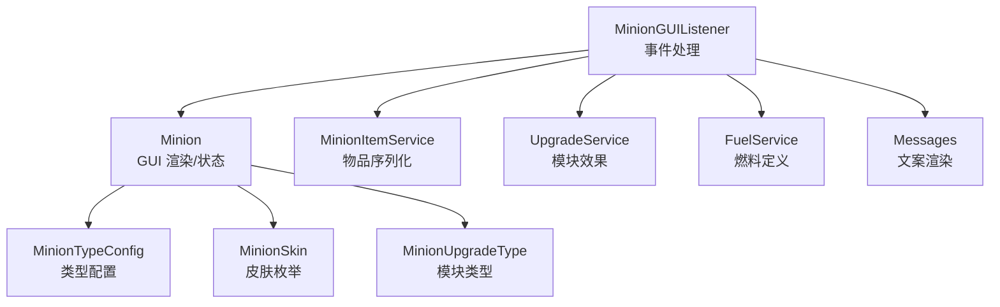
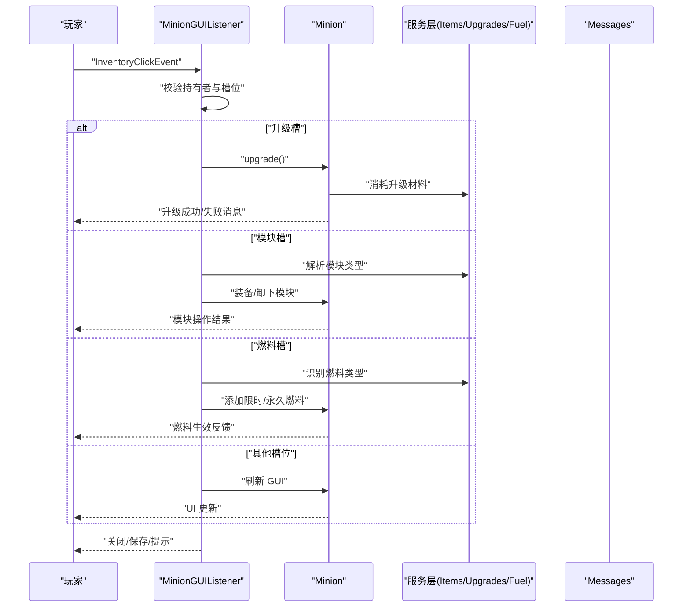
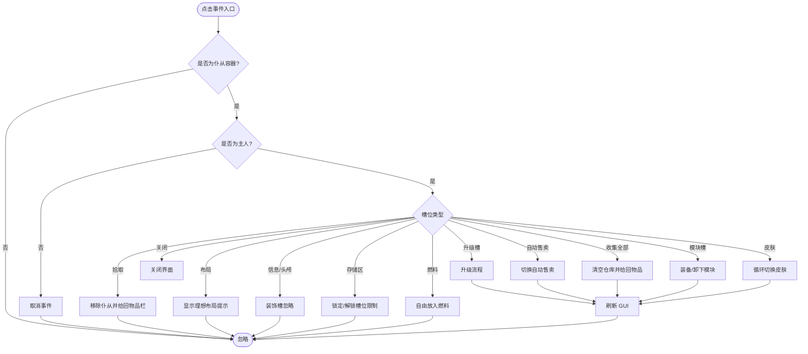
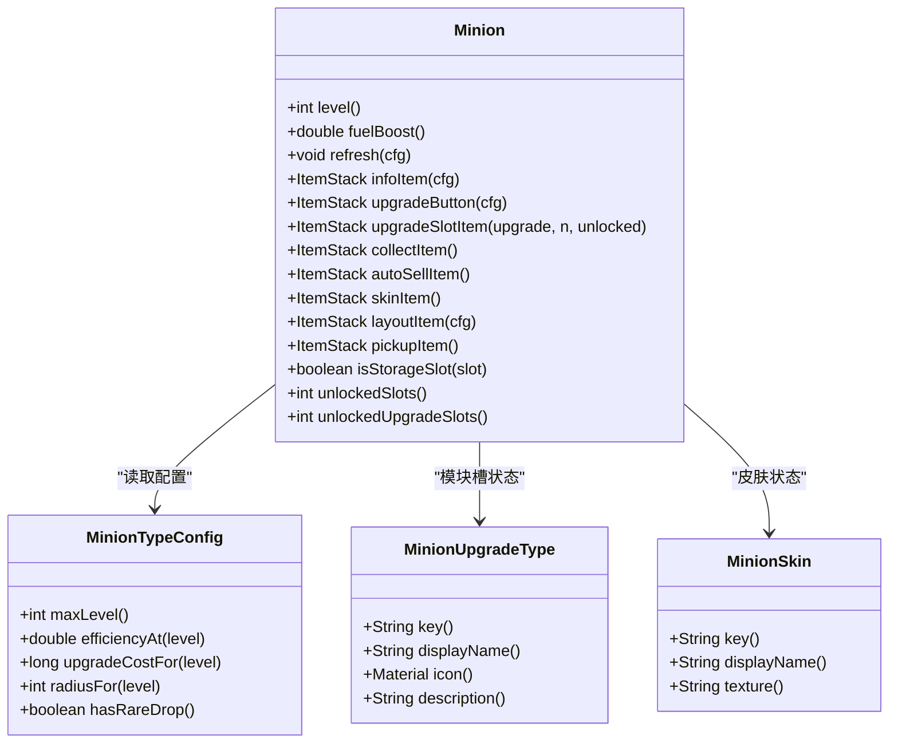
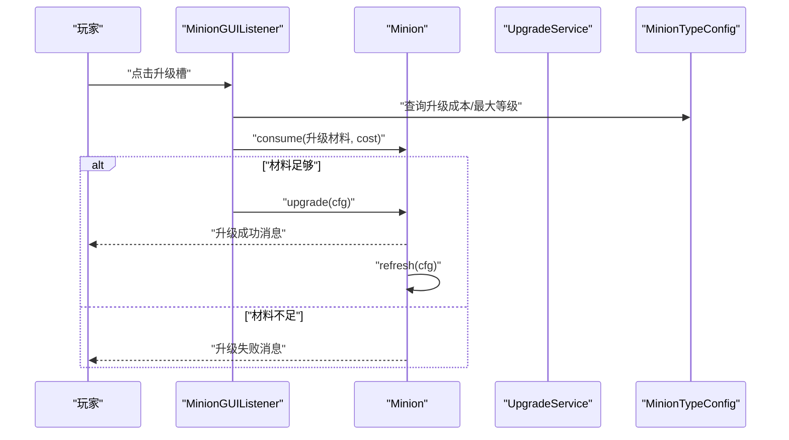
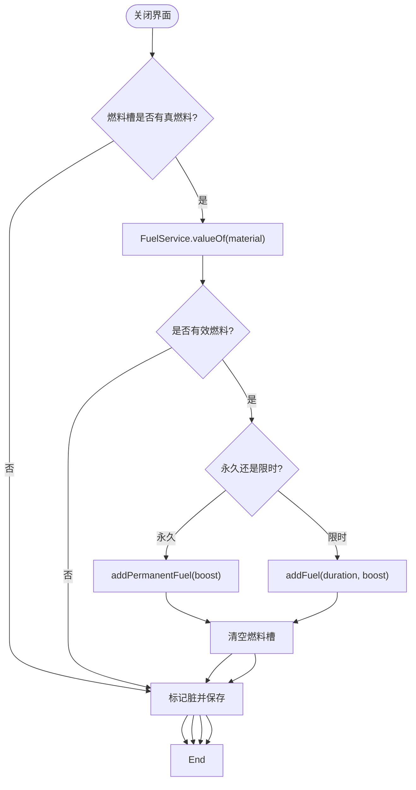
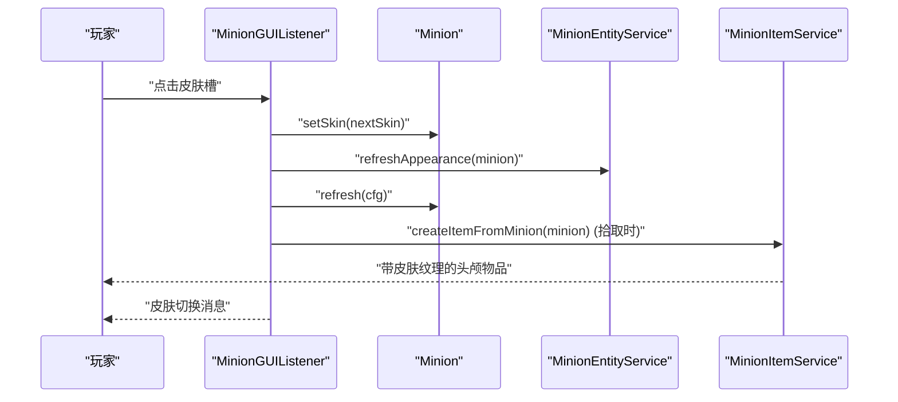
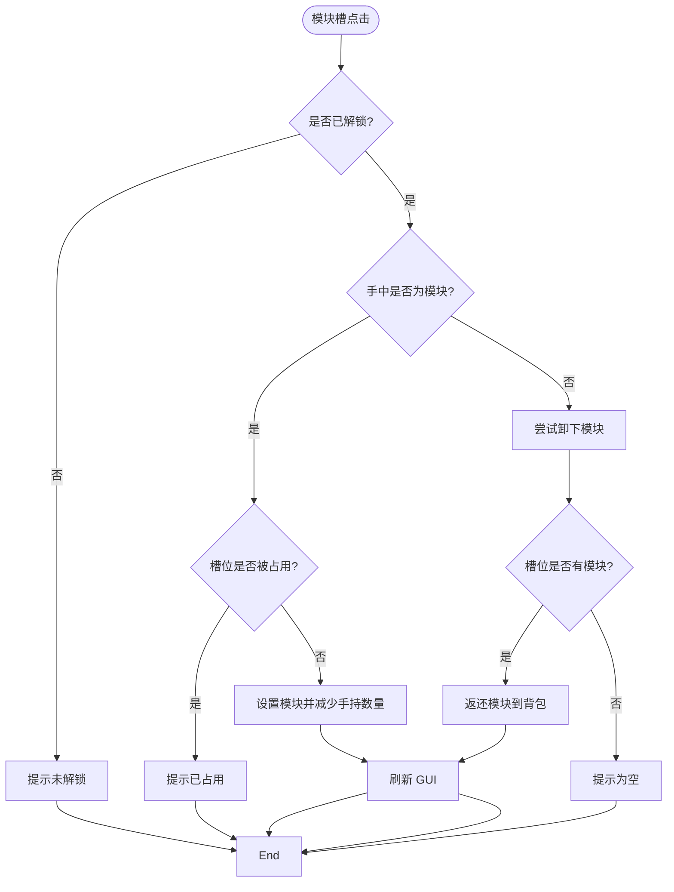
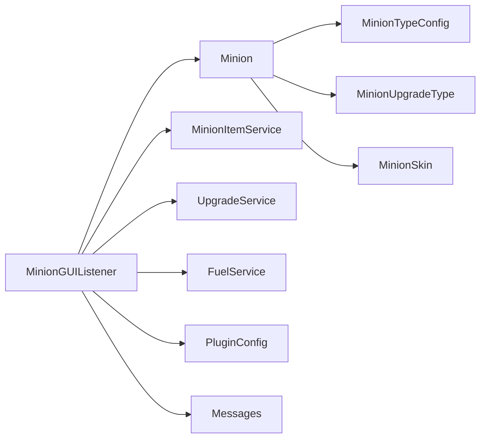

# 图形界面系统

<cite>
**本文引用的文件**
- [MinionGUIListener.java](file://src/main/java/com/hcs/minions/gui/MinionGUIListener.java)
- [Minion.java](file://src/main/java/com/hcs/minions/model/Minion.java)
- [MinionType.java](file://src/main/java/com/hcs/minions/model/MinionType.java)
- [MinionItemService.java](file://src/main/java/com/hcs/minions/service/MinionItemService.java)
- [UpgradeService.java](file://src/main/java/com/hcs/minions/upgrade/UpgradeService.java)
- [MinionTypeConfig.java](file://src/main/java/com/hcs/minions/config/MinionTypeConfig.java)
- [MinionSkin.java](file://src/main/java/com/hcs/minions/model/MinionSkin.java)
- [FuelService.java](file://src/main/java/com/hcs/minions/service/FuelService.java)
- [MinionUpgradeType.java](file://src/main/java/com/hcs/minions/upgrade/MinionUpgradeType.java)
- [Messages.java](file://src/main/java/com/hcs/minions/util/Messages.java)
</cite>

## 目录
1. [简介](#简介)
2. [项目结构](#项目结构)
3. [核心组件](#核心组件)
4. [架构总览](#架构总览)
5. [详细组件分析](#详细组件分析)
6. [依赖关系分析](#依赖关系分析)
7. [性能与响应式优化](#性能与响应式优化)
8. [故障排查指南](#故障排查指南)
9. [结论](#结论)
10. [附录：自定义开发指南](#附录自定义开发指南)

## 简介
本章节概述 SkyMinions 的图形界面（GUI）系统设计理念与实现目标。该系统采用 Hypixel 风格单界面设计，使用 54 格真实 Inventory 布局，提供物品展示、交互逻辑、状态同步与用户体验优化。核心能力包括：
- 54 格真实 Inventory 布局：顶行用于燃料、信息卡、头颅、升级按钮与皮肤切换；中间为存储区（按等级解锁）；底行包含模块槽、收集全部、自动售卖、理想布局、拾取与关闭等控制项。
- 事件处理机制：通过 MinionGUIListener 统一拦截点击、拖拽与关闭事件，区分功能槽位并执行对应业务逻辑。
- 动态生成与状态同步：Minion.refresh 负责渲染所有 GUI 元素，确保显示与内存状态一致。
- 功能特性：升级按钮、模块槽位、燃料管理、皮肤切换、自动售卖开关、理想布局提示等。
- 最佳实践：响应式设计、性能优化、错误处理与可配置文案。

## 项目结构
SkyMinions 的 GUI 系统由模型层、服务层、监听器与配置/工具类组成，职责清晰、耦合度低：
- 模型层：Minion 定义 GUI 布局常量、存储区、渲染方法与状态字段；MinionType、MinionSkin、MinionUpgradeType 提供类型化枚举。
- 服务层：MinionItemService 负责仆从物品序列化/反序列化；UpgradeService 负责模块效果与掉落物处理；FuelService 定义燃料属性。
- 监听器：MinionGUIListener 处理 InventoryClickEvent、InventoryCloseEvent，驱动 UI 交互与状态变更。
- 配置与工具：MinionTypeConfig 提供类型级配置；Messages 提供可热重载的文案渲染。

图表来源
- [MinionGUIListener.java:49-125](file://src/main/java/com/hcs/minions/gui/MinionGUIListener.java#L49-L125)
- [Minion.java:285-321](file://src/main/java/com/hcs/minions/model/Minion.java#L285-L321)
- [MinionItemService.java:101-118](file://src/main/java/com/hcs/minions/service/MinionItemService.java#L101-L118)
- [UpgradeService.java:170-188](file://src/main/java/com/hcs/minions/upgrade/UpgradeService.java#L170-L188)
- [FuelService.java:29-41](file://src/main/java/com/hcs/minions/service/FuelService.java#L29-L41)
- [MinionTypeConfig.java:21-63](file://src/main/java/com/hcs/minions/config/MinionTypeConfig.java#L21-L63)
- [MinionSkin.java:12-53](file://src/main/java/com/hcs/minions/model/MinionSkin.java#L12-L53)
- [MinionUpgradeType.java:23-67](file://src/main/java/com/hcs/minions/upgrade/MinionUpgradeType.java#L23-L67)
- [Messages.java:128-171](file://src/main/java/com/hcs/minions/util/Messages.java#L128-L171)

章节来源
- [MinionGUIListener.java:49-125](file://src/main/java/com/hcs/minions/gui/MinionGUIListener.java#L49-L125)
- [Minion.java:285-321](file://src/main/java/com/hcs/minions/model/Minion.java#L285-L321)

## 核心组件
- MinionGUIListener：集中处理 GUI 点击、关闭事件，校验权限、槽位映射与业务调用。
- Minion：维护 54 格 Inventory、槽位常量、存储区访问、刷新渲染、状态字段（等级、燃料、皮肤、模块槽）。
- MinionItemService：将 Minion 完整状态编码进玩家头颅物品，支持跨重启安全与皮肤纹理应用。
- UpgradeService：模块效果链（熔炼/压缩/超级压缩/钻石散布）、范围扩展计算。
- FuelService：燃料映射表，区分限时与永久燃料。
- MinionTypeConfig：每个类型的最大等级、效率曲线、升级材料/成本、工作半径、稀有掉落等。
- MinionSkin：皮肤枚举，携带 base64 纹理与显示名。
- MinionUpgradeType：模块类型枚举，图标与描述。
- Messages：可配置文案模板，MiniMessage 渲染，支持热重载。

章节来源
- [MinionGUIListener.java:49-125](file://src/main/java/com/hcs/minions/gui/MinionGUIListener.java#L49-L125)
- [Minion.java:285-321](file://src/main/java/com/hcs/minions/model/Minion.java#L285-L321)
- [MinionItemService.java:101-118](file://src/main/java/com/hcs/minions/service/MinionItemService.java#L101-L118)
- [UpgradeService.java:170-188](file://src/main/java/com/hcs/minions/upgrade/UpgradeService.java#L170-L188)
- [FuelService.java:29-41](file://src/main/java/com/hcs/minions/service/FuelService.java#L29-L41)
- [MinionTypeConfig.java:21-63](file://src/main/java/com/hcs/minions/config/MinionTypeConfig.java#L21-L63)
- [MinionSkin.java:12-53](file://src/main/java/com/hcs/minions/model/MinionSkin.java#L12-L53)
- [MinionUpgradeType.java:23-67](file://src/main/java/com/hcs/minions/upgrade/MinionUpgradeType.java#L23-L67)
- [Messages.java:128-171](file://src/main/java/com/hcs/minions/util/Messages.java#L128-L171)

## 架构总览
下图展示了 GUI 事件流与数据流：玩家点击触发 MinionGUIListener，根据槽位路由到具体方法，调用 Minion 进行状态更新与刷新，必要时调用服务层完成持久化或效果结算。

图表来源
- [MinionGUIListener.java:49-125](file://src/main/java/com/hcs/minions/gui/MinionGUIListener.java#L49-L125)
- [Minion.java:285-321](file://src/main/java/com/hcs/minions/model/Minion.java#L285-L321)
- [MinionItemService.java:101-118](file://src/main/java/com/hcs/minions/service/MinionItemService.java#L101-L118)
- [UpgradeService.java:170-188](file://src/main/java/com/hcs/minions/upgrade/UpgradeService.java#L170-L188)
- [FuelService.java:29-41](file://src/main/java/com/hcs/minions/service/FuelService.java#L29-L41)
- [Messages.java:128-171](file://src/main/java/com/hcs/minions/util/Messages.java#L128-L171)

## 详细组件分析

### MinionGUIListener 事件处理机制
- 点击事件分发：根据 rawSlot 判断槽位类型，分别处理升级、自动售卖、拾取、收集全部、关闭、模块槽、皮肤、布局、信息/头颅装饰槽、存储区与燃料槽。
- 权限与归属校验：仅允许所有者操作，非所有者直接取消事件。
- 模块槽交互：遵循 Hypixel 原版——手持模块点击装备，空手点击已装备槽卸下。
- 关闭事件处理：检查燃料槽是否放入真燃料，转换为限时或永久加速，并保存状态。

图表来源
- [MinionGUIListener.java:49-125](file://src/main/java/com/hcs/minions/gui/MinionGUIListener.java#L49-L125)
- [Minion.java:285-321](file://src/main/java/com/hcs/minions/model/Minion.java#L285-L321)

章节来源
- [MinionGUIListener.java:49-125](file://src/main/java/com/hcs/minions/gui/MinionGUIListener.java#L49-L125)

### Minion GUI 渲染与状态同步
- 布局常量：定义 54 格 GUI 的槽位分布，存储区 36 格，顶行/底行功能槽。
- 刷新方法：统一设置装饰槽、锁定槽、燃料占位符、信息卡、头颅、升级按钮、模块槽、收集/自动售卖/布局/拾取/关闭按钮。
- 信息卡：显示状态、速度、产出速率、范围、存储计数、稀有掉落、累计产出与下次工作时间。
- 升级按钮：对比当前与下一级速度，显示需求材料与已有数量，颜色提示是否满足条件。
- 模块槽：未解锁显示锁定提示，已装备显示“已装备”与卸下指引，空槽显示可用获取方式。
- 燃料槽：显示永久/限时加速剩余时间、可用燃料列表，避免误吞占位提示。
- 皮肤切换：循环切换皮肤并刷新盔甲架外观。

图表来源
- [Minion.java:285-321](file://src/main/java/com/hcs/minions/model/Minion.java#L285-L321)
- [MinionTypeConfig.java:21-63](file://src/main/java/com/hcs/minions/config/MinionTypeConfig.java#L21-L63)
- [MinionUpgradeType.java:23-67](file://src/main/java/com/hcs/minions/upgrade/MinionUpgradeType.java#L23-L67)
- [MinionSkin.java:12-53](file://src/main/java/com/hcs/minions/model/MinionSkin.java#L12-L53)

章节来源
- [Minion.java:285-321](file://src/main/java/com/hcs/minions/model/Minion.java#L285-L321)

### 升级按钮与模块槽位
- 升级按钮：基于 MinionTypeConfig 计算升级成本与速度对比，若材料不足则显示提示；点击后消费材料并提升等级，触发升级事件与刷新。
- 模块槽位：随等级解锁（Tier 4 解锁第 1 槽，Tier 8 解锁第 2 槽），支持装备/卸下；模块效果在 UpgradeService 中统一处理。

图表来源
- [MinionGUIListener.java:220-235](file://src/main/java/com/hcs/minions/gui/MinionGUIListener.java#L220-L235)
- [Minion.java:276-283](file://src/main/java/com/hcs/minions/model/Minion.java#L276-L283)
- [MinionTypeConfig.java:55-63](file://src/main/java/com/hcs/minions/config/MinionTypeConfig.java#L55-L63)

章节来源
- [MinionGUIListener.java:220-235](file://src/main/java/com/hcs/minions/gui/MinionGUIListener.java#L220-L235)
- [Minion.java:276-283](file://src/main/java/com/hcs/minions/model/Minion.java#L276-L283)
- [MinionTypeConfig.java:55-63](file://src/main/java/com/hcs/minions/config/MinionTypeConfig.java#L55-L63)

### 燃料管理
- 燃料槽：放置真燃料时，关闭界面后识别类型并转换为限时或永久加速；占位提示通过 PDC 标记避免误吞。
- 燃料定义：FuelService 提供材料到 FuelValue 的映射，区分限时与永久属性。

图表来源
- [MinionGUIListener.java:127-153](file://src/main/java/com/hcs/minions/gui/MinionGUIListener.java#L127-L153)
- [FuelService.java:29-41](file://src/main/java/com/hcs/minions/service/FuelService.java#L29-L41)
- [Minion.java:408-446](file://src/main/java/com/hcs/minions/model/Minion.java#L408-L446)

章节来源
- [MinionGUIListener.java:127-153](file://src/main/java/com/hcs/minions/gui/MinionGUIListener.java#L127-L153)
- [FuelService.java:29-41](file://src/main/java/com/hcs/minions/service/FuelService.java#L29-L41)
- [Minion.java:408-446](file://src/main/java/com/hcs/minions/model/Minion.java#L408-L446)

### 皮肤切换
- 循环切换：MinionGUIListener.cycleSkin 遍历 MinionSkin 枚举，设置新皮肤并刷新实体外观与 GUI。
- 纹理应用：MinionItemService.applyHeadTexture 为玩家头颅物品设置皮肤纹理，保证拾取后显示正确。

图表来源
- [MinionGUIListener.java:196-206](file://src/main/java/com/hcs/minions/gui/MinionGUIListener.java#L196-L206)
- [MinionItemService.java:68-84](file://src/main/java/com/hcs/minions/service/MinionItemService.java#L68-L84)
- [Minion.java:700-708](file://src/main/java/com/hcs/minions/model/Minion.java#L700-L708)

章节来源
- [MinionGUIListener.java:196-206](file://src/main/java/com/hcs/minions/gui/MinionGUIListener.java#L196-L206)
- [MinionItemService.java:68-84](file://src/main/java/com/hcs/minions/service/MinionItemService.java#L68-L84)
- [Minion.java:700-708](file://src/main/java/com/hcs/minions/model/Minion.java#L700-L708)

### 模块槽位交互流程
- 装备模块：手持模块点击模块槽，校验槽位是否解锁与占用，成功后设置模块并刷新 GUI。
- 卸下模块：空手点击已装备槽，返回模块物品并清空槽位。

图表来源
- [MinionGUIListener.java:155-194](file://src/main/java/com/hcs/minions/gui/MinionGUIListener.java#L155-L194)
- [Minion.java:710-765](file://src/main/java/com/hcs/minions/model/Minion.java#L710-L765)

章节来源
- [MinionGUIListener.java:155-194](file://src/main/java/com/hcs/minions/gui/MinionGUIListener.java#L155-L194)
- [Minion.java:710-765](file://src/main/java/com/hcs/minions/model/Minion.java#L710-L765)

### 理想布局提示
- 显示工作范围与布置建议，帮助玩家最大化产出。

章节来源
- [MinionGUIListener.java:208-218](file://src/main/java/com/hcs/minions/gui/MinionGUIListener.java#L208-L218)
- [Minion.java:562-576](file://src/main/java/com/hcs/minions/model/Minion.java#L562-L576)

## 依赖关系分析
- MinionGUIListener 依赖 Minion、MinionItemService、MinionEntityService、PluginConfig、UpgradeService、Messages。
- Minion 依赖 MinionTypeConfig、MinionUpgradeType、MinionSkin、Bukkit API。
- UpgradeService 依赖 MinionUpgradeType 与 Material 映射表。
- FuelService 提供燃料映射，供 MinionGUIListener 与 Minion 使用。
- Messages 提供可配置文案，贯穿所有用户可见反馈。

图表来源
- [MinionGUIListener.java:34-47](file://src/main/java/com/hcs/minions/gui/MinionGUIListener.java#L34-L47)
- [Minion.java:67-88](file://src/main/java/com/hcs/minions/model/Minion.java#L67-L88)
- [UpgradeService.java:105-107](file://src/main/java/com/hcs/minions/upgrade/UpgradeService.java#L105-L107)
- [FuelService.java:29-41](file://src/main/java/com/hcs/minions/service/FuelService.java#L29-L41)
- [MinionTypeConfig.java:21-63](file://src/main/java/com/hcs/minions/config/MinionTypeConfig.java#L21-L63)
- [MinionSkin.java:12-53](file://src/main/java/com/hcs/minions/model/MinionSkin.java#L12-L53)
- [Messages.java:128-171](file://src/main/java/com/hcs/minions/util/Messages.java#L128-L171)

章节来源
- [MinionGUIListener.java:34-47](file://src/main/java/com/hcs/minions/gui/MinionGUIListener.java#L34-L47)
- [Minion.java:67-88](file://src/main/java/com/hcs/minions/model/Minion.java#L67-L88)

## 性能与响应式优化
- 批量刷新：Minion.refresh 一次性设置所有槽位，减少多次网络包发送。
- 锁定槽位：存储区未解锁槽位以灰玻璃填充，避免无效交互。
- 文案渲染：Messages 使用 MiniMessage 与缓存模板，支持热重载，降低字符串拼接开销。
- 物品序列化：MinionItemService 使用 PDC 与 ItemCodec 高效编码/解码仓库内容，避免大对象传递。
- 模块效果链：UpgradeService 对掉落物进行不可变处理，不修改入参，防止引用泄漏与重复计算。
- 燃料识别：通过 PDC 标记区分占位提示与真燃料，避免误操作导致的资源丢失。

[本节为通用指导，无需特定文件来源]

## 故障排查指南
- 权限问题：确认点击者是否为仆从所有者，否则事件被取消。
- 槽位锁定：存储区未解锁槽位无法交互，需升级仆从解锁更多格子。
- 模块槽冲突：已装备槽位需先卸下再装备新模块；未解锁槽位会提示升级门槛。
- 燃料误吞：确保燃料槽放置的是真燃料而非占位提示；关闭界面时会识别并应用。
- 升级失败：检查仓库中升级材料是否充足，升级按钮会显示需求与已有数量对比。
- 文案异常：检查 messages.yml 是否正确加载，缺失键会回退到默认文案。

章节来源
- [MinionGUIListener.java:49-125](file://src/main/java/com/hcs/minions/gui/MinionGUIListener.java#L49-L125)
- [Minion.java:285-321](file://src/main/java/com/hcs/minions/model/Minion.java#L285-L321)
- [Messages.java:128-171](file://src/main/java/com/hcs/minions/util/Messages.java#L128-L171)

## 结论
SkyMinions 的 GUI 系统以 Hypixel 风格为核心，通过 54 格真实 Inventory 布局与精细的事件处理机制，实现了高度一致的交互体验。MinionGUIListener 作为中枢，协调 Minion 的状态渲染与服务层的能力，确保界面与数据的一致性。通过模块化设计（升级、燃料、皮肤、模块槽），系统具备良好的可扩展性与可维护性。配合可配置文案与性能优化策略，提供了稳定且友好的用户体验。

[本节为总结，无需特定文件来源]

## 附录：自定义开发指南
- 新增槽位：在 Minion 中定义槽位常量，并在 MinionGUIListener.onClick 中添加分支处理；同时在 Minion.refresh 中设置默认显示。
- 自定义模块：扩展 MinionUpgradeType 枚举，并在 UpgradeService 中实现效果链；在 MinionGUIListener.handleUpgradeSlot 中支持装备/卸下。
- 燃料扩展：在 FuelService 中添加新材料到 FuelValue 的映射，支持限时或永久加速。
- 文案定制：编辑 messages.yml，覆盖默认模板；使用 /minion reload 热重载。
- 皮肤扩展：在 MinionSkin 中添加新皮肤枚举，提供 base64 纹理；确保 MinionItemService.applyHeadTexture 能正确应用。

[本节为通用指导，无需特定文件来源]