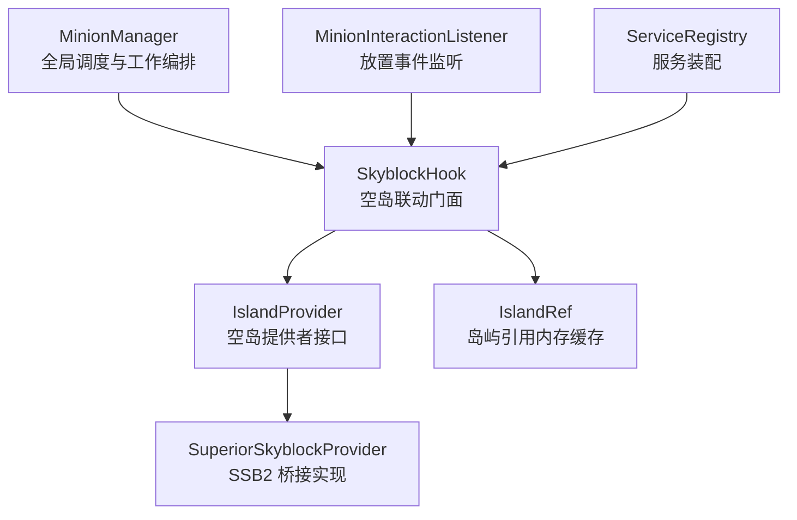
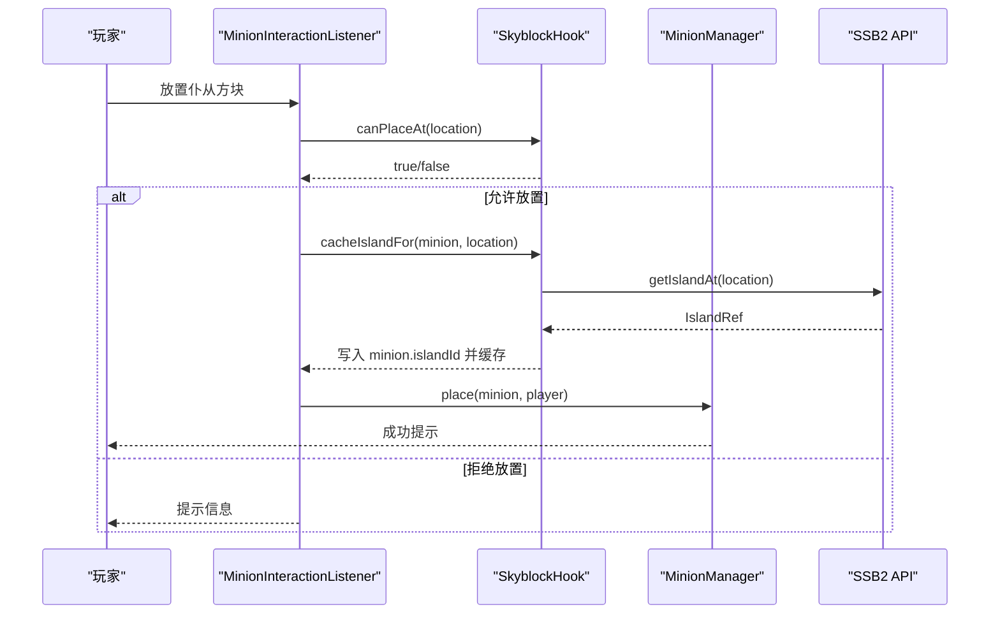
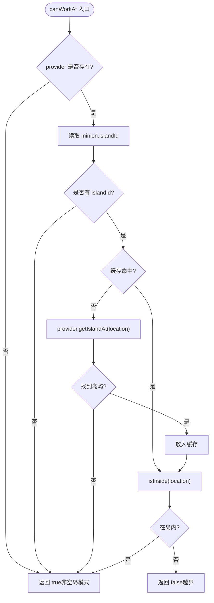
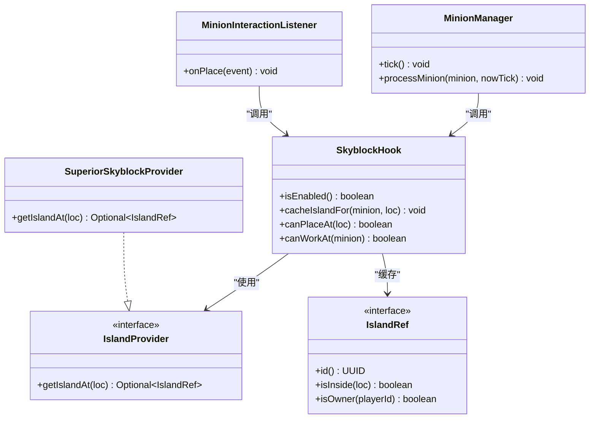

# 外部系统集成

<cite>
**本文引用的文件**
- [SkyblockHook.java](file://src/main/java/com/hcs/minions/service/hook/SkyblockHook.java)
- [IslandProvider.java](file://src/main/java/com/hcs/minions/service/hook/IslandProvider.java)
- [IslandRef.java](file://src/main/java/com/hcs/minions/service/hook/IslandRef.java)
- [SuperiorSkyblockProvider.java](file://src/main/java/com/hcs/minions/service/hook/SuperiorSkyblockProvider.java)
- [MinionInteractionListener.java](file://src/main/java/com/hcs/minions/listener/MinionInteractionListener.java)
- [MinionManager.java](file://src/main/java/com/hcs/minions/service/MinionManager.java)
- [ServiceRegistry.java](file://src/main/java/com/hcs/minions/core/ServiceRegistry.java)
- [PluginConfig.java](file://src/main/java/com/hcs/minions/config/PluginConfig.java)
- [config.yml](file://src/main/resources/config.yml)
- [Logs.java](file://src/main/java/com/hcs/minions/util/Logs.java)
- [MinionData.java](file://src/main/java/com/hcs/minions/model/MinionData.java)
</cite>

## 目录
1. [简介](#简介)
2. [项目结构](#项目结构)
3. [核心组件](#核心组件)
4. [架构总览](#架构总览)
5. [详细组件分析](#详细组件分析)
6. [依赖关系分析](#依赖关系分析)
7. [性能考量](#性能考量)
8. [故障排除指南](#故障排除指南)
9. [结论](#结论)
10. [附录](#附录)

## 简介
本文档面向 SkyMinions 插件的外部系统集成，重点说明与 SuperiorSkyblock2（SSB2）空岛服务器的集成实现，包括岛屿验证、区域限制、缓存机制与宽松策略。同时解释 SkyblockHook 抽象层设计，如何以统一接口支持多种空岛服务器；并给出配置选项、区域验证算法、第三方扩展方法以及兼容性说明与故障排除建议。

## 项目结构
SkyMinions 将“空岛联动”能力封装在 service/hook 包中，通过门面类 SkyblockHook 暴露放置与工作校验能力；具体空岛实现（如 SSB2）通过 IslandProvider 接口注入，运行时根据是否检测到目标插件动态启用。工作循环由 MinionManager 驱动，在每次 tick 中调用 SkyblockHook.canWorkAt 进行边界校验。

图表来源
- [MinionManager.java:191-250](file://src/main/java/com/hcs/minions/service/MinionManager.java#L191-L250)
- [SkyblockHook.java:19-79](file://src/main/java/com/hcs/minions/service/hook/SkyblockHook.java#L19-L79)
- [IslandProvider.java:1-14](file://src/main/java/com/hcs/minions/service/hook/IslandProvider.java#L1-L14)
- [SuperiorSkyblockProvider.java:1-48](file://src/main/java/com/hcs/minions/service/hook/SuperiorSkyblockProvider.java#L1-L48)
- [MinionInteractionListener.java:54-94](file://src/main/java/com/hcs/minions/listener/MinionInteractionListener.java#L54-L94)
- [ServiceRegistry.java:21-76](file://src/main/java/com/hcs/minions/core/ServiceRegistry.java#L21-L76)

章节来源
- [MinionManager.java:191-250](file://src/main/java/com/hcs/minions/service/MinionManager.java#L191-L250)
- [SkyblockHook.java:19-79](file://src/main/java/com/hcs/minions/service/hook/SkyblockHook.java#L19-L79)
- [MinionInteractionListener.java:54-94](file://src/main/java/com/hcs/minions/listener/MinionInteractionListener.java#L54-L94)
- [ServiceRegistry.java:21-76](file://src/main/java/com/hcs/minions/core/ServiceRegistry.java#L21-L76)

## 核心组件
- SkyblockHook：空岛联动门面，负责检测 SSB2 是否启用、缓存岛屿引用、提供放置与工作校验。
- IslandProvider：空岛提供者抽象，定义 getIslandAt(Location) 查询接口，便于替换不同空岛实现。
- IslandRef：岛屿引用抽象，封装 id、isInside、isOwner 等只读操作，避免工作循环回源 API。
- SuperiorSkyblockProvider：SSB2 的具体桥接实现，调用 SSB2 API 获取岛屿信息并包装为 IslandRef。
- MinionManager：全局调度器与工作编排，在 tick 中调用 canWorkAt 进行区域校验。
- MinionInteractionListener：处理仆从放置事件，调用 canPlaceAt 与 cacheIslandFor。
- ServiceRegistry：服务装配中心，按依赖顺序创建并共享 SkyblockHook。
- PluginConfig/config.yml：全局配置项（调度周期、最大检查数、经济、离线收益、类型配置等）。

章节来源
- [SkyblockHook.java:19-79](file://src/main/java/com/hcs/minions/service/hook/SkyblockHook.java#L19-L79)
- [IslandProvider.java:1-14](file://src/main/java/com/hcs/minions/service/hook/IslandProvider.java#L1-L14)
- [IslandRef.java:1-20](file://src/main/java/com/hcs/minions/service/hook/IslandRef.java#L1-L20)
- [SuperiorSkyblockProvider.java:1-48](file://src/main/java/com/hcs/minions/service/hook/SuperiorSkyblockProvider.java#L1-L48)
- [MinionManager.java:191-250](file://src/main/java/com/hcs/minions/service/MinionManager.java#L191-L250)
- [MinionInteractionListener.java:54-94](file://src/main/java/com/hcs/minions/listener/MinionInteractionListener.java#L54-L94)
- [ServiceRegistry.java:21-76](file://src/main/java/com/hcs/minions/core/ServiceRegistry.java#L21-L76)
- [PluginConfig.java:8-46](file://src/main/java/com/hcs/minions/config/PluginConfig.java#L8-L46)
- [config.yml:1-153](file://src/main/resources/config.yml#L1-L153)

## 架构总览
SkyMinions 采用“门面 + 提供者”的解耦设计：
- 启动时 ServiceRegistry 检测并实例化 SkyblockHook；若检测到 SSB2 已启用，则注入 SuperiorSkyblockProvider。
- 放置流程：MinionInteractionListener 拦截 BlockPlaceEvent，调用 skyblock.canPlaceAt 与 cacheIslandFor，随后交由 MinionManager.place 持久化与生成实体。
- 工作循环：MinionManager.tick 遍历所有仆从，委派到对应 region 线程执行 processMinion，其中先调用 skyblock.canWorkAt 做区域校验，再执行具体工作策略。
- 缓存机制：SkyblockHook 使用 ConcurrentHashMap<String, IslandRef> 缓存岛屿引用；工作循环仅做内存内 isInside 判断，不频繁回源 API。

图表来源
- [MinionInteractionListener.java:54-94](file://src/main/java/com/hcs/minions/listener/MinionInteractionListener.java#L54-L94)
- [SkyblockHook.java:38-52](file://src/main/java/com/hcs/minions/service/hook/SkyblockHook.java#L38-L52)
- [SuperiorSkyblockProvider.java:18-28](file://src/main/java/com/hcs/minions/service/hook/SuperiorSkyblockProvider.java#L18-L28)
- [MinionManager.java:356-373](file://src/main/java/com/hcs/minions/service/MinionManager.java#L356-L373)

## 详细组件分析

### SkyblockHook 门面与宽松策略
- 功能职责：
  - 检测 SSB2 是否启用，决定 provider 是否为空。
  - 放置时调用 cacheIslandFor，解析并缓存岛屿，写入 minion.islandId。
  - 工作循环调用 canWorkAt，仅在明确位于某空岛时校验工作点是否在岛边界内；否则放行。
- 缓存策略：
  - 使用并发哈希表缓存 IslandRef，键为岛屿 ID。
  - 重启后懒重缓存：若缓存缺失且位置可查，则重新查询并缓存。
- 宽松行为：
  - 无法确定岛屿时不限制工作，保证普通世界或岛屿删除场景下仍可运行。

图表来源
- [SkyblockHook.java:54-79](file://src/main/java/com/hcs/minions/service/hook/SkyblockHook.java#L54-L79)

章节来源
- [SkyblockHook.java:19-79](file://src/main/java/com/hcs/minions/service/hook/SkyblockHook.java#L19-L79)

### SuperiorSkyblockProvider 桥接实现
- 功能职责：
  - 调用 SSB2 API 获取 Location 对应的岛屿。
  - 异常捕获并记录日志，优雅降级为空结果，避免 NoClassDefFoundError。
  - 将 SSB2 的 Island 包装为 IslandRef，提供 id、isInside、isOwner。
- 兼容性与健壮性：
  - 只在插件检测到 SSB2 已启用时才加载该类，确保无 SSB2 环境也能正常运行。
  - 对 API 异常进行 try-catch，记录错误日志并返回 Optional.empty()。

章节来源
- [SuperiorSkyblockProvider.java:1-48](file://src/main/java/com/hcs/minions/service/hook/SuperiorSkyblockProvider.java#L1-L48)
- [Logs.java:1-33](file://src/main/java/com/hcs/minions/util/Logs.java#L1-L33)

### MinionManager 工作循环中的区域校验
- 调度与委派：
  - 全局 tick 遍历所有仆从，检查区块加载状态，委派到对应 region 线程执行完整逻辑。
- 区域校验时机：
  - 在 processMinion 中，先检查燃料与冷却，再调用 skyblock.canWorkAt 进行边界校验。
- 安全与性能：
  - 仅做纯内存与轻量坐标转换，真正的方块/实体访问均在 region 线程完成，符合 Folia 分区调度要求。

章节来源
- [MinionManager.java:191-250](file://src/main/java/com/hcs/minions/service/MinionManager.java#L191-L250)

### MinionInteractionListener 放置流程
- 事件拦截：
  - 拦截 BlockPlaceEvent，解析仆从类型与权限。
- 区域校验与缓存：
  - 调用 skyblock.canPlaceAt 进行放置前校验（当前实现始终放行，但保留扩展点）。
  - 放置成功后调用 skyblock.cacheIslandFor，写入 minion.islandId 并缓存岛屿引用。
- 后续流程：
  - 交由 MinionManager.place 持久化、生成实体并触发事件。

章节来源
- [MinionInteractionListener.java:54-94](file://src/main/java/com/hcs/minions/listener/MinionInteractionListener.java#L54-L94)
- [MinionManager.java:356-373](file://src/main/java/com/hcs/minions/service/MinionManager.java#L356-L373)

### 数据模型与持久化
- MinionData：
  - 包含 islandId 字段，用于持久化仆从所在岛屿标识，便于重启后恢复。
- 存储映射：
  - SQLite 存储层在 map 过程中读取 island_id 字段，保持与业务层一致。

章节来源
- [MinionData.java:1-29](file://src/main/java/com/hcs/minions/model/MinionData.java#L1-L29)
- [SqliteMinionStore.java:199-217](file://src/main/java/com/hcs/minions/repository/sqlite/SqliteMinionStore.java#L199-L217)

## 依赖关系分析
- 耦合与内聚：
  - SkyblockHook 与 IslandProvider/IslandRef 低耦合，便于扩展新的空岛实现。
  - MinionManager 仅依赖 SkyblockHook 的公共方法，不感知具体空岛实现。
- 外部依赖：
  - 仅在检测到 SSB2 时引入其 API，避免未安装时的类加载问题。
- 可能的循环依赖：
  - 当前设计无循环依赖；服务装配由 ServiceRegistry 集中管理。

图表来源
- [SkyblockHook.java:19-79](file://src/main/java/com/hcs/minions/service/hook/SkyblockHook.java#L19-L79)
- [IslandProvider.java:1-14](file://src/main/java/com/hcs/minions/service/hook/IslandProvider.java#L1-L14)
- [IslandRef.java:1-20](file://src/main/java/com/hcs/minions/service/hook/IslandRef.java#L1-L20)
- [SuperiorSkyblockProvider.java:1-48](file://src/main/java/com/hcs/minions/service/hook/SuperiorSkyblockProvider.java#L1-L48)
- [MinionManager.java:191-250](file://src/main/java/com/hcs/minions/service/MinionManager.java#L191-L250)
- [MinionInteractionListener.java:54-94](file://src/main/java/com/hcs/minions/listener/MinionInteractionListener.java#L54-L94)

章节来源
- [ServiceRegistry.java:21-76](file://src/main/java/com/hcs/minions/core/ServiceRegistry.java#L21-L76)

## 性能考量
- 缓存优先：
  - SkyblockHook 在工作循环中仅做内存内 isInside 判断，避免频繁 API 调用。
  - 重启后懒重缓存，减少初始开销。
- 调度优化：
  - MinionManager 使用 GlobalRegionScheduler 进行全局遍历，实际工作委派到 RegionScheduler，避免跨区访问导致的不一致。
- 检查上限：
  - 配置项 max-checks-per-cycle 强制小于 50，防止单次策略执行过多方块检查影响 TPS。
- 资源访问安全：
  - Inventory 与实体操作均在 region 线程执行，避免异步线程直接访问导致的竞态条件。

章节来源
- [config.yml:4-7](file://src/main/resources/config.yml#L4-L7)
- [MinionManager.java:191-250](file://src/main/java/com/hcs/minions/service/MinionManager.java#L191-L250)
- [SkyblockHook.java:54-79](file://src/main/java/com/hcs/minions/service/hook/SkyblockHook.java#L54-L79)

## 故障排除指南
- 常见问题定位：
  - 未检测到 SSB2：日志会输出“未检测到 SuperiorSkyblock2，空岛限制关闭”，此时不会进行区域限制。
  - SSB2 API 异常：日志会记录“SuperiorSkyblock2 查询岛屿失败”，并降级为无岛屿，不影响工作。
  - 岛屿被删除：工作循环发现缓存缺失且无法查询到岛屿时，视为不在空岛，放行工作。
- 日志与调试：
  - 使用 Logs 统一输出 info/warn/error，便于排查。
  - 开启 debug 开关可打印更多工作细节（如未找到目标 anchor、稀有掉落等）。
- 兼容性说明：
  - 未安装 SSB2 时，插件仍正常工作，仅不进行空岛区域限制。
  - 若未来接入其他空岛服务器，只需实现 IslandProvider 并在 ServiceRegistry 中注册即可。

章节来源
- [SkyblockHook.java:24-31](file://src/main/java/com/hcs/minions/service/hook/SkyblockHook.java#L24-L31)
- [SuperiorSkyblockProvider.java:18-28](file://src/main/java/com/hcs/minions/service/hook/SuperiorSkyblockProvider.java#L18-L28)
- [Logs.java:1-33](file://src/main/java/com/hcs/minions/util/Logs.java#L1-L33)
- [config.yml:10-11](file://src/main/resources/config.yml#L10-L11)

## 结论
SkyMinions 通过 SkyblockHook 抽象层与 IslandProvider 接口实现了与 SuperiorSkyblock2 的空岛集成，具备岛屿验证、区域限制与高性能缓存机制。整体设计遵循宽松策略，确保在非空岛或异常场景下仍能稳定运行。通过 ServiceRegistry 的集中装配与配置项的可控性，系统具备良好的可扩展性与兼容性。

## 附录

### 配置选项说明
- 全局调度参数：
  - tick-period：全局调度周期（tick），影响工作频率。
  - max-checks-per-cycle：单次策略执行方块检查硬上限，必须小于 50。
  - max-minions-per-player：每玩家仆从槽位上限。
  - head-texture：固定仆从头颅贴图（base64）。
  - debug：调试日志开关。
- 数据库与经济：
  - database.type：sqlite/mysql。
  - economy.enabled：是否需要 Vault。
  - economy.auto-sell-on-full：仓库满时自动售卖。
  - economy.sell-interval-ticks：自动售卖轮询间隔。
  - economy.price-multiplier：价格倍率。
- 离线收益与里程碑：
  - offline.enabled/max-hours/rate-multiplier。
  - collections.enabled/milestones/coins-base/slot-milestones。
- 仆从类型配置：
  - types.*：每种仆从的显示名、等级上限、效率、燃料、冷却、售价、产物、升级材料、半径、稀有掉落等。

章节来源
- [config.yml:1-153](file://src/main/resources/config.yml#L1-L153)
- [PluginConfig.java:8-46](file://src/main/java/com/hcs/minions/config/PluginConfig.java#L8-L46)

### 扩展开发方法
- 新增空岛服务器支持：
  - 实现 IslandProvider 接口，提供 getIslandAt(Location) 的具体逻辑。
  - 在 ServiceRegistry 中检测新插件并注入对应 Provider。
  - 可选：在 SkyblockHook 中增加开关或策略以控制行为。
- 扩展区域验证策略：
  - 可在 SkyblockHook.canPlaceAt 中增加更严格的放置限制（当前默认放行）。
  - 在 canWorkAt 中结合自定义规则（如玩家权限、世界白名单）进行校验。
- 性能优化建议：
  - 合理设置 tick-period 与 max-checks-per-cycle，平衡性能与响应速度。
  - 利用缓存减少外部 API 调用，避免热点路径阻塞。

章节来源
- [IslandProvider.java:1-14](file://src/main/java/com/hcs/minions/service/hook/IslandProvider.java#L1-L14)
- [ServiceRegistry.java:21-76](file://src/main/java/com/hcs/minions/core/ServiceRegistry.java#L21-L76)
- [SkyblockHook.java:49-52](file://src/main/java/com/hcs/minions/service/hook/SkyblockHook.java#L49-L52)