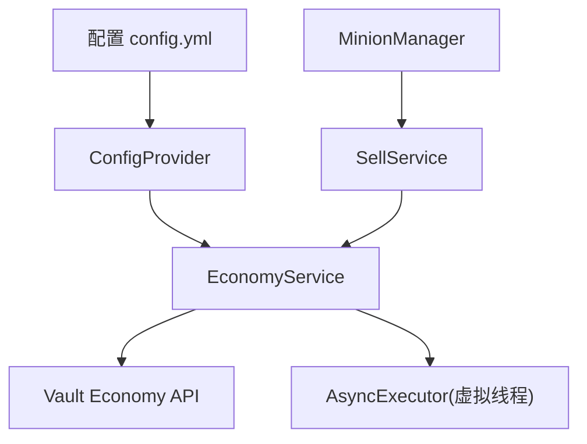
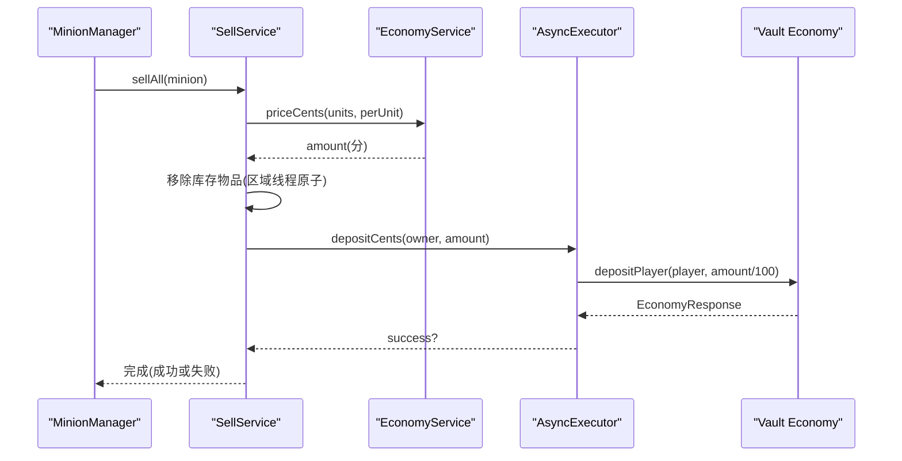
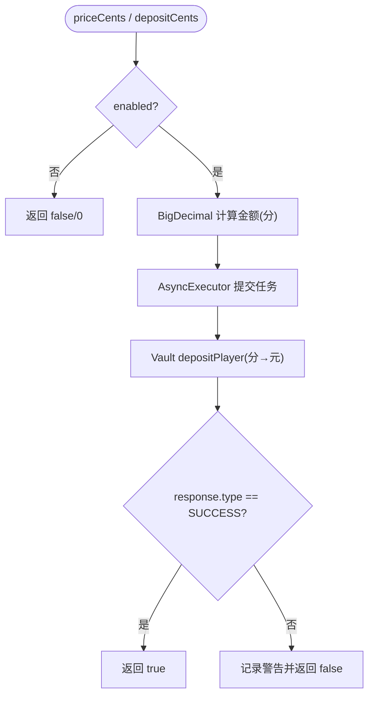
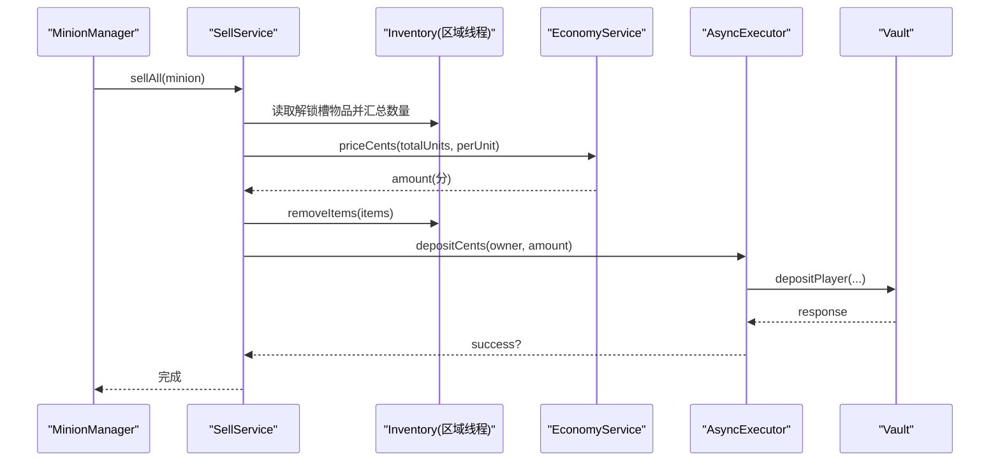
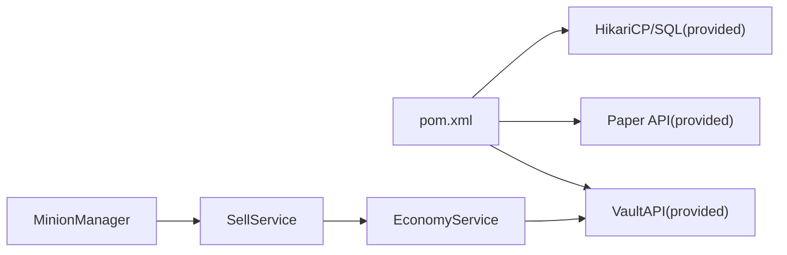

# Vault 经济系统集成

<cite>
**本文引用的文件**
- [EconomyService.java](file://src/main/java/com/hcs/minions/service/EconomyService.java)
- [SellService.java](file://src/main/java/com/hcs/minions/service/SellService.java)
- [AsyncExecutor.java](file://src/main/java/com/hcs/minions/util/AsyncExecutor.java)
- [config.yml](file://src/main/resources/config.yml)
- [messages.yml](file://src/main/resources/messages.yml)
- [MinionCommand.java](file://src/main/java/com/hcs/minions/command/MinionCommand.java)
- [pom.xml](file://pom.xml)
- [ConfigProvider.java](file://src/main/java/com/hcs/minions/config/ConfigProvider.java)
- [MinionManager.java](file://src/main/java/com/hcs/minions/service/MinionManager.java)
</cite>

## 目录
1. [简介](#简介)
2. [项目结构](#项目结构)
3. [核心组件](#核心组件)
4. [架构总览](#架构总览)
5. [详细组件分析](#详细组件分析)
6. [依赖关系分析](#依赖关系分析)
7. [性能考量](#性能考量)
8. [故障排除指南](#故障排除指南)
9. [结论](#结论)
10. [附录：配置示例与最佳实践](#附录配置示例与最佳实践)

## 简介
本文件面向服务器管理员与插件开发者，说明如何在 SkyMinions 中安装并启用 Vault 经济集成，以开启自动售卖、价格倍率等经济功能。文档涵盖 EconomyService 的实现原理、金额计算（分单位处理）、异步操作机制、与不同经济插件的兼容性、完整配置项说明以及常见问题排查和性能优化建议。

## 项目结构
SkyMinions 将经济相关能力集中在服务层，通过配置驱动行为，并通过异步执行器与 Vault 交互，确保主线程安全与高并发下的稳定性。关键路径如下：
- 配置加载：config.yml 中的 economy.* 节点被反序列化为 EconomyConfig，并由 ConfigProvider 提供不可变快照。
- 服务装配：EconomyService 负责检测 Vault 是否可用、封装加款逻辑；SellService 负责自动售卖流程；MinionManager 在轮询时触发售卖。
- 异步执行：所有 Vault 调用通过 AsyncExecutor 提交到虚拟线程池，避免阻塞主线程。

图表来源
- [config.yml:23-27](file://src/main/resources/config.yml#L23-L27)
- [ConfigProvider.java:18-31](file://src/main/java/com/hcs/minions/config/ConfigProvider.java#L18-L31)
- [EconomyService.java:31-49](file://src/main/java/com/hcs/minions/service/EconomyService.java#L31-L49)
- [SellService.java:41-79](file://src/main/java/com/hcs/minions/service/SellService.java#L41-L79)
- [MinionManager.java:318-350](file://src/main/java/com/hcs/minions/service/MinionManager.java#L318-L350)

章节来源
- [config.yml:23-27](file://src/main/resources/config.yml#L23-L27)
- [ConfigProvider.java:18-31](file://src/main/java/com/hcs/minions/config/ConfigProvider.java#L18-L31)

## 核心组件
- EconomyService：检测并获取 Vault Economy 实现，提供价格计算与加款接口，所有 Vault 调用异步执行。
- SellService：自动售卖入口，先扣物再异步加款，保证“物品已扣”与“资金到账”的一致性。
- AsyncExecutor：基于 Java 21 虚拟线程的全局异步执行器，承担 IO 类任务（Vault 加款、数据库写入）。
- MinionManager：周期性扫描仆从状态，当满足条件时触发自动售卖。

章节来源
- [EconomyService.java:17-87](file://src/main/java/com/hcs/minions/service/EconomyService.java#L17-L87)
- [SellService.java:16-80](file://src/main/java/com/hcs/minions/service/SellService.java#L16-L80)
- [AsyncExecutor.java:12-79](file://src/main/java/com/hcs/minions/util/AsyncExecutor.java#L12-L79)
- [MinionManager.java:318-350](file://src/main/java/com/hcs/minions/service/MinionManager.java#L318-L350)

## 架构总览
下图展示了从配置到售卖完成的端到端流程，包括配置热重载、自动售卖触发、价格计算、异步加款与结果回调。

图表来源
- [SellService.java:41-79](file://src/main/java/com/hcs/minions/service/SellService.java#L41-L79)
- [EconomyService.java:55-86](file://src/main/java/com/hcs/minions/service/EconomyService.java#L55-L86)
- [AsyncExecutor.java:34-56](file://src/main/java/com/hcs/minions/util/AsyncExecutor.java#L34-L56)
- [MinionManager.java:318-350](file://src/main/java/com/hcs/minions/service/MinionManager.java#L318-L350)

## 详细组件分析

### EconomyService：经济服务
- 启动检测：若配置未启用或未检测到 Vault 插件，则关闭经济功能并记录警告日志。
- 价格计算：使用 BigDecimal 精确计算“单价 × 数量 × 全局倍率 × 100”，返回分（long），避免浮点误差。
- 异步加款：通过 AsyncExecutor 提交任务，在虚拟线程中调用 Vault 的 depositPlayer，并将 cents 转换为 double 传入；成功后校验响应类型是否为 SUCCESS，否则记录警告并返回失败。
- 线程边界：Vault 调用不阻塞主线程，错误不会中断业务流。

图表来源
- [EconomyService.java:38-86](file://src/main/java/com/hcs/minions/service/EconomyService.java#L38-L86)

章节来源
- [EconomyService.java:17-87](file://src/main/java/com/hcs/minions/service/EconomyService.java#L17-L87)

### SellService：自动售卖
- 触发条件：由 MinionManager 在周期扫描中判断是否满足自动售卖（显式开关或模块）且仓库已满。
- 扣物顺序：先在区域线程读取解锁存储槽的物品并计算总价，然后立即从库存中移除对应物品，最后异步加款。此顺序修复了旧实现“先加款后扣物”的竞态问题。
- 失败处理：若加款失败，记录错误日志并返回 0，但物品已被扣除，需人工核查。

图表来源
- [SellService.java:41-79](file://src/main/java/com/hcs/minions/service/SellService.java#L41-L79)
- [MinionManager.java:318-350](file://src/main/java/com/hcs/minions/service/MinionManager.java#L318-L350)

章节来源
- [SellService.java:16-80](file://src/main/java/com/hcs/minions/service/SellService.java#L16-L80)
- [MinionManager.java:318-350](file://src/main/java/com/hcs/minions/service/MinionManager.java#L318-L350)

### AsyncExecutor：异步执行器
- 设计目标：为所有 IO 任务（Vault 加款、数据库落库、离线结算写库）提供统一的虚拟线程执行环境，严格分离主线程与异步线程边界。
- 调度策略：单线程调度器用于周期任务（如自动售卖轮询），避免为单个仆从创建定时器；虚拟线程池用于并发 IO。
- 异常处理：捕获并记录异常，防止吞掉错误导致静默失败。

章节来源
- [AsyncExecutor.java:12-79](file://src/main/java/com/hcs/minions/util/AsyncExecutor.java#L12-L79)

### 配置系统：ConfigProvider 与 EconomyConfig
- 不可变快照：ConfigProvider 持有当前生效的 PluginConfig 快照，支持热重载（/minion reload），运行时参数（效率、价格、周期等）可即时更新。
- EconomyConfig：包含 enabled、autoSellOnFull、sellIntervalTicks、priceMultiplier 等选项，控制经济功能开关、自动售卖行为与价格倍率。

章节来源
- [ConfigProvider.java:7-33](file://src/main/java/com/hcs/minions/config/ConfigProvider.java#L7-L33)
- [config.yml:23-27](file://src/main/resources/config.yml#L23-L27)

## 依赖关系分析
- 编译期依赖：VaultAPI 作为 provided 依赖，不打入 jar，运行时由服务器提供。
- 运行时依赖：Paper API、SLF4J、HikariCP、SQLite/MySQL 驱动等均为 provided，由平台或 paper-plugin.yml 管理。
- 耦合性：EconomyService 仅依赖 Vault API 与 Bukkit；SellService 依赖 EconomyService 与配置；MinionManager 通过 SellService 触发售卖，解耦良好。

图表来源
- [pom.xml:40-111](file://pom.xml#L40-L111)
- [EconomyService.java:6-11](file://src/main/java/com/hcs/minions/service/EconomyService.java#L6-L11)
- [SellService.java:22-31](file://src/main/java/com/hcs/minions/service/SellService.java#L22-L31)
- [MinionManager.java:318-350](file://src/main/java/com/hcs/minions/service/MinionManager.java#L318-L350)

章节来源
- [pom.xml:40-111](file://pom.xml#L40-L111)

## 性能考量
- 虚拟线程：Vault 加款走虚拟线程，避免阻塞主线程，提升吞吐。
- 区域线程：库存读取与修改在区域线程执行，保证 Inventory 操作的线程安全。
- 批量与限流：周期任务使用单线程调度器，避免为每个仆从创建独立定时器；max-checks-per-cycle 限制单次检查上限，防止卡顿。
- 精度与开销：价格计算使用 BigDecimal，避免浮点误差；仅在 Vault 边界转换 double，减少不必要的对象创建。

[本节为通用性能指导，无需具体文件引用]

## 故障排除指南
- Vault 未启用或未检测到：
  - 现象：控制台输出“Vault 未启用，经济功能关闭”或“未找到 Vault Economy 实现，经济功能关闭”。
  - 原因：配置 economy.enabled=false，或服务器未安装/未启用 Vault。
  - 解决：安装并启用 Vault，或在配置中启用 economy.enabled。
  - 参考位置
    - [EconomyService.java:38-49](file://src/main/java/com/hcs/minions/service/EconomyService.java#L38-L49)

- 经济操作失败（加款失败）：
  - 现象：控制台输出“Vault 加款失败: player=..., amount=..., type=...”。
  - 原因：Vault 实现返回非 SUCCESS，或玩家离线无法解析名称。
  - 影响：物品已被扣除但未到账，需人工核查。
  - 解决：检查 Vault 配置与经济插件（EssentialsX/CMI）是否正常；确认玩家在线或 UUID 有效；必要时回滚库存。
  - 参考位置
    - [EconomyService.java:73-86](file://src/main/java/com/hcs/minions/service/EconomyService.java#L73-L86)
    - [SellService.java:66-76](file://src/main/java/com/hcs/minions/service/SellService.java#L66-L76)

- 自动售卖未触发：
  - 现象：仓库满但未自动售卖。
  - 原因：未开启 auto-sell-on-full，或仆从未设置自动售卖开关，或未装备“自动售卖漏斗”模块。
  - 解决：在配置中启用 economy.auto-sell-on-full，或在 GUI 中开启自动售卖按钮，或装备相应模块。
  - 参考位置
    - [config.yml:23-27](file://src/main/resources/config.yml#L23-L27)
    - [MinionManager.java:318-350](file://src/main/java/com/hcs/minions/service/MinionManager.java#L318-L350)

- 命令重载无效：
  - 现象：修改配置后未生效。
  - 解决：执行 /minion reload 重新加载配置与文案。
  - 参考位置
    - [MinionCommand.java:125-130](file://src/main/java/com/hcs/minions/command/MinionCommand.java#L125-L130)

章节来源
- [EconomyService.java:38-86](file://src/main/java/com/hcs/minions/service/EconomyService.java#L38-L86)
- [SellService.java:66-76](file://src/main/java/com/hcs/minions/service/SellService.java#L66-L76)
- [MinionManager.java:318-350](file://src/main/java/com/hcs/minions/service/MinionManager.java#L318-L350)
- [MinionCommand.java:125-130](file://src/main/java/com/hcs/minions/command/MinionCommand.java#L125-L130)

## 结论
SkyMinions 通过 EconomyService 与 SellService 实现了稳健的 Vault 经济集成：以分为单位进行精确计价，使用虚拟线程异步加款，并在区域线程内原子扣物，确保数据一致性与主线程安全。配合可热重载的配置系统与清晰的错误日志，便于运维与排错。按本文档配置与排查，即可稳定启用自动售卖与价格倍率等功能。

[本节为总结性内容，无需具体文件引用]

## 附录：配置示例与最佳实践

### 配置项说明（economy 节）
- enabled：是否启用经济功能（需要 Vault）。默认 true。
- auto-sell-on-full：仓库满时是否自动售卖。默认 true。
- sell-interval-ticks：自动售卖轮询间隔（tick）。默认 400。
- price-multiplier：全局价格倍率。默认 1.0。

章节来源
- [config.yml:23-27](file://src/main/resources/config.yml#L23-L27)

### 与不同经济插件的兼容性
- 兼容范围：任何实现 Vault Economy 接口的插件均可工作，例如 EssentialsX、CMI、OpenEconomy 等。
- 注意事项：
  - 确保服务器已安装并启用 Vault。
  - 确保 Vault 正确对接底层经济插件（EssentialsX/CMI 等）。
  - 若出现加款失败，优先检查 Vault 与底层经济插件的日志与配置。

章节来源
- [pom.xml:55-67](file://pom.xml#L55-L67)
- [EconomyService.java:38-49](file://src/main/java/com/hcs/minions/service/EconomyService.java#L38-L49)

### 金额计算逻辑（分单位处理）
- 内部统一使用 long（分）与 BigDecimal 运算，避免浮点误差。
- 计算公式：amount_cents = units × pricePerUnit × priceMultiplier × 100。
- 仅在 Vault 边界将分转换为元（double）进行加款。

章节来源
- [EconomyService.java:55-64](file://src/main/java/com/hcs/minions/service/EconomyService.java#L55-L64)

### 异步操作机制
- 所有 Vault 调用通过 AsyncExecutor 提交到虚拟线程池，避免阻塞主线程。
- 售卖流程：先扣物（区域线程），再异步加款；加款失败记录错误日志，物品已扣需人工核查。

章节来源
- [AsyncExecutor.java:34-56](file://src/main/java/com/hcs/minions/util/AsyncExecutor.java#L34-L56)
- [SellService.java:66-76](file://src/main/java/com/hcs/minions/service/SellService.java#L66-L76)

### 最佳实践
- 生产环境建议：
  - 保持 economy.enabled=true 并确保 Vault 正常。
  - 合理设置 sell-interval-ticks，避免过于频繁导致性能压力。
  - 监控控制台日志，及时处理加款失败与 Vault 未启用告警。
  - 使用 /minion reload 热重载配置，无需重启服务器。
- 调试建议：
  - 临时提高日志级别，观察自动售卖触发与 Vault 响应。
  - 对加款失败的案例，核对玩家 UUID 与 Vault 余额变化。

[本节为通用实践指导，无需具体文件引用]