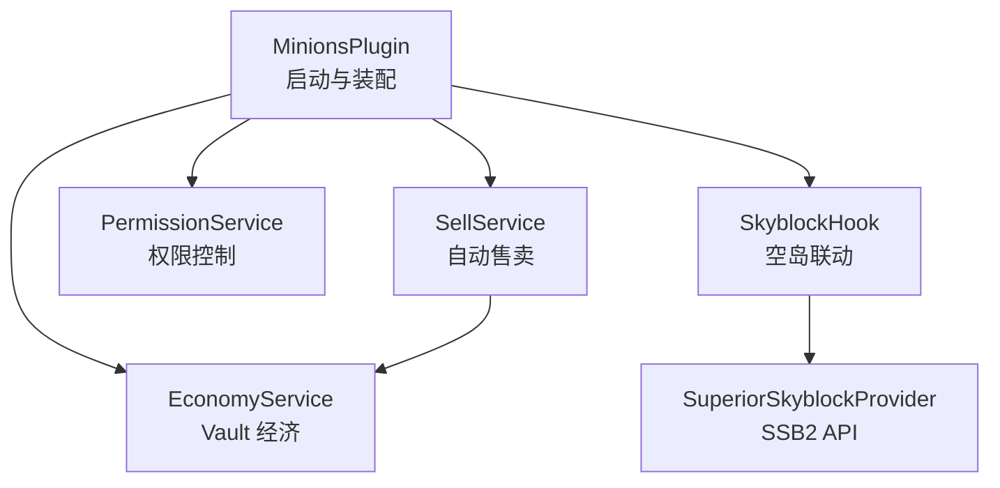
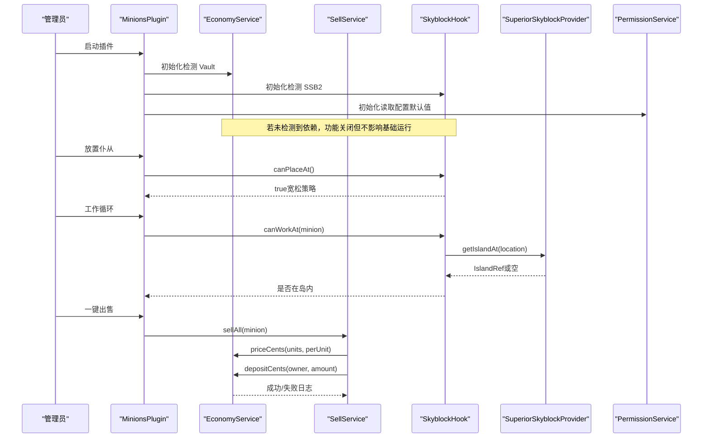
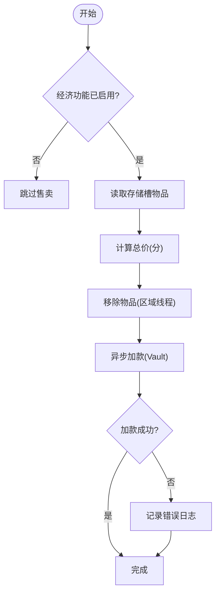
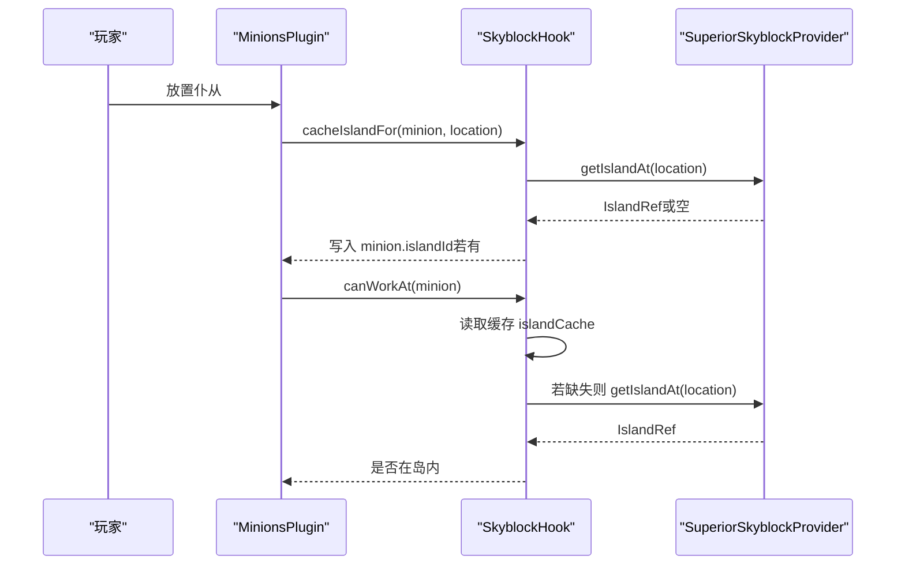
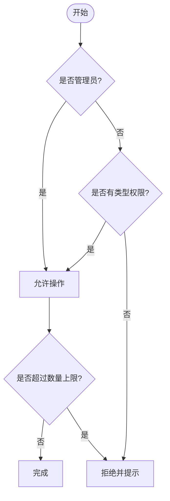
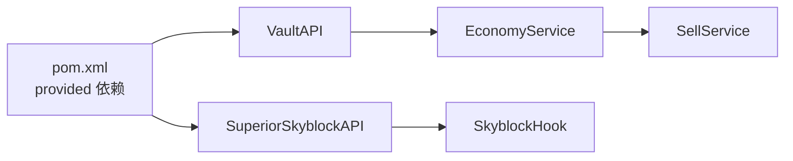

# 可选集成配置

<cite>
**本文引用的文件**
- [MinionsPlugin.java](file://src/main/java/com/hcs/minions/MinionsPlugin.java)
- [config.yml](file://src/main/resources/config.yml)
- [EconomyService.java](file://src/main/java/com/hcs/minions/service/EconomyService.java)
- [SellService.java](file://src/main/java/com/hcs/minions/service/SellService.java)
- [EconomyConfig.java](file://src/main/java/com/hcs/minions/config/EconomyConfig.java)
- [SkyblockHook.java](file://src/main/java/com/hcs/minions/service/hook/SkyblockHook.java)
- [SuperiorSkyblockProvider.java](file://src/main/java/com/hcs/minions/service/hook/SuperiorSkyblockProvider.java)
- [IslandRef.java](file://src/main/java/com/hcs/minions/service/hook/IslandRef.java)
- [PermissionService.java](file://src/main/java/com/hcs/minions/service/PermissionService.java)
- [messages.yml](file://src/main/resources/messages.yml)
- [pom.xml](file://pom.xml)
</cite>

## 目录
1. [简介](#简介)
2. [项目结构](#项目结构)
3. [核心组件](#核心组件)
4. [架构总览](#架构总览)
5. [详细组件分析](#详细组件分析)
6. [依赖关系分析](#依赖关系分析)
7. [性能与兼容性](#性能与兼容性)
8. [故障排除指南](#故障排除指南)
9. [结论](#结论)
10. [附录：最佳实践清单](#附录最佳实践清单)

## 简介
本文件面向服务器管理员，提供 SkyMinions 插件与外部系统的可选集成配置指南。重点覆盖以下可选依赖的安装与配置：
- Vault 经济系统：用于自动售卖、金币结算
- SuperiorSkyblock2 空岛服务器：用于空岛区域验证（放置与工作边界校验）
- LuckPerms 权限管理：用于权限控制（命令使用、类型限制、数量上限）

文档将说明每个集成的作用与价值、启用条件、配置示例、功能增强效果，并提供故障排除方法与不同服务器环境的最佳实践，帮助管理员按需扩展插件能力。

## 项目结构
SkyMinions 采用分层与服务化设计：主类负责生命周期管理与服务装配；各服务模块通过 ServiceRegistry 注入；可选集成以“软依赖”方式接入，未安装时自动降级为无功能模式，不影响基础运行。

图表来源
- [MinionsPlugin.java:52-114](file://src/main/java/com/hcs/minions/MinionsPlugin.java#L52-L114)
- [EconomyService.java:18-49](file://src/main/java/com/hcs/minions/service/EconomyService.java#L18-L49)
- [SkyblockHook.java:12-36](file://src/main/java/com/hcs/minions/service/hook/SkyblockHook.java#L12-L36)
- [SuperiorSkyblockProvider.java:12-28](file://src/main/java/com/hcs/minions/service/hook/SuperiorSkyblockProvider.java#L12-L28)
- [SellService.java:16-32](file://src/main/java/com/hcs/minions/service/SellService.java#L16-L32)

章节来源
- [MinionsPlugin.java:52-114](file://src/main/java/com/hcs/minions/MinionsPlugin.java#L52-L114)
- [config.yml:23-27](file://src/main/resources/config.yml#L23-L27)

## 核心组件
- EconomyService：封装 Vault 经济接口，提供加款与计价逻辑，支持异步执行与失败日志记录。
- SellService：实现自动售卖流程，先扣物后加款，避免竞态导致的刷钱漏洞。
- SkyblockHook + SuperiorSkyblockProvider：检测并桥接 SuperiorSkyblock2，进行岛屿缓存与边界校验。
- PermissionService：基于 Bukkit 权限体系，天然兼容 LuckPerms，提供管理权限、类型权限与数量上限解析。

章节来源
- [EconomyService.java:18-87](file://src/main/java/com/hcs/minions/service/EconomyService.java#L18-L87)
- [SellService.java:16-81](file://src/main/java/com/hcs/minions/service/SellService.java#L16-L81)
- [SkyblockHook.java:12-79](file://src/main/java/com/hcs/minions/service/hook/SkyblockHook.java#L12-L79)
- [SuperiorSkyblockProvider.java:12-48](file://src/main/java/com/hcs/minions/service/hook/SuperiorSkyblockProvider.java#L12-L48)
- [PermissionService.java:8-74](file://src/main/java/com/hcs/minions/service/PermissionService.java#L8-L74)

## 架构总览
下图展示可选集成的装配与调用关系，以及运行时行为：

图表来源
- [MinionsPlugin.java:52-114](file://src/main/java/com/hcs/minions/MinionsPlugin.java#L52-L114)
- [EconomyService.java:38-87](file://src/main/java/com/hcs/minions/service/EconomyService.java#L38-L87)
- [SellService.java:41-79](file://src/main/java/com/hcs/minions/service/SellService.java#L41-L79)
- [SkyblockHook.java:24-79](file://src/main/java/com/hcs/minions/service/hook/SkyblockHook.java#L24-L79)
- [SuperiorSkyblockProvider.java:18-48](file://src/main/java/com/hcs/minions/service/hook/SuperiorSkyblockProvider.java#L18-L48)

## 详细组件分析

### Vault 经济系统集成
- 作用与价值
  - 自动售卖：仓库满时或手动一键出售，按配置价格倍率结算到玩家账户。
  - 统一经济：与服务器经济系统对接，便于交易、税收与平衡。
- 启用条件
  - 服务端需安装并启用 Vault。
  - config.yml 中 economy.enabled 为 true。
- 配置要点
  - auto-sell-on-full：开启后仓库满自动售卖。
  - sell-interval-ticks：自动售卖轮询间隔。
  - price-multiplier：全局价格倍率。
- 功能增强
  - 自动售卖漏斗对齐 Hypixel Hopper 体验。
  - 异步加款，减少主线程阻塞。
- 配置示例路径
  - [config.yml:23-27](file://src/main/resources/config.yml#L23-L27)
  - [EconomyConfig.java:7-12](file://src/main/java/com/hcs/minions/config/EconomyConfig.java#L7-L12)
- 关键流程
  - 计价：priceCents(units, perUnit) 使用 BigDecimal 计算，避免浮点误差。
  - 加款：depositCents(owner, cents) 在虚拟线程异步执行，成功后返回 true。
- 流程图

图表来源
- [SellService.java:41-79](file://src/main/java/com/hcs/minions/service/SellService.java#L41-L79)
- [EconomyService.java:55-87](file://src/main/java/com/hcs/minions/service/EconomyService.java#L55-L87)

章节来源
- [EconomyService.java:18-87](file://src/main/java/com/hcs/minions/service/EconomyService.java#L18-L87)
- [SellService.java:16-81](file://src/main/java/com/hcs/minions/service/SellService.java#L16-L81)
- [config.yml:23-27](file://src/main/resources/config.yml#L23-L27)

### SuperiorSkyblock2 空岛联动
- 作用与价值
  - 放置与工作时校验位置是否位于空岛边界内，防止在非空岛区域滥用仆从产出。
  - 宽松策略：无法确定岛屿时不限制工作，保证普通世界也能正常使用。
- 启用条件
  - 服务端需安装并启用 SuperiorSkyblock2。
  - 插件启动时检测 SSB2 是否启用，启用则加载桥接实现。
- 配置要点
  - 无需额外配置项；行为由 SkyblockHook 内部处理。
- 功能增强
  - 放置时缓存一次岛屿；工作循环读缓存做边界校验，降低 API 调用开销。
  - 重启后懒重缓存，提升鲁棒性。
- 关键类与接口
  - SkyblockHook：门面，检测与缓存。
  - SuperiorSkyblockProvider：桥接 SSB2 API。
  - IslandRef：抽象岛屿引用，解耦具体实现。
- 序列图

图表来源
- [SkyblockHook.java:24-79](file://src/main/java/com/hcs/minions/service/hook/SkyblockHook.java#L24-L79)
- [SuperiorSkyblockProvider.java:18-48](file://src/main/java/com/hcs/minions/service/hook/SuperiorSkyblockProvider.java#L18-L48)
- [IslandRef.java:7-20](file://src/main/java/com/hcs/minions/service/hook/IslandRef.java#L7-L20)

章节来源
- [SkyblockHook.java:12-79](file://src/main/java/com/hcs/minions/service/hook/SkyblockHook.java#L12-L79)
- [SuperiorSkyblockProvider.java:12-48](file://src/main/java/com/hcs/minions/service/hook/SuperiorSkyblockProvider.java#L12-L48)
- [IslandRef.java:7-20](file://src/main/java/com/hcs/minions/service/hook/IslandRef.java#L7-L20)

### LuckPerms 权限控制
- 作用与价值
  - 通过 Bukkit 权限体系与 LuckPerms 无缝集成，无需硬依赖 LP。
  - 可授予的权限：
    - hcs.minions.admin：管理权限
    - hcs.minions.type.<type>：能否使用某类仆从
    - hcs.minions.limit.<n>：仆从数量上限（取最大 n，支持通配 *）
- 启用条件
  - 安装并启用 LuckPerms（或其他提供 Bukkit 权限的权限插件）。
  - 在 LP 中为组或玩家授予上述权限。
- 配置要点
  - 默认上限来自 config.yml 的 max-minions-per-player。
  - 可通过权限覆盖默认上限。
- 功能增强
  - 细粒度权限控制，便于区分玩家等级与特权。
  - 高效解析：一次性遍历生效权限集合，避免多次 hasPermission 调用。
- 消息提示
  - messages.yml 中包含权限不足、已达上限等提示文案。
- 流程图

图表来源
- [PermissionService.java:33-74](file://src/main/java/com/hcs/minions/service/PermissionService.java#L33-L74)
- [messages.yml:7-14](file://src/main/resources/messages.yml#L7-L14)

章节来源
- [PermissionService.java:8-74](file://src/main/java/com/hcs/minions/service/PermissionService.java#L8-L74)
- [messages.yml:7-14](file://src/main/resources/messages.yml#L7-L14)

## 依赖关系分析
- 编译期声明为 provided 的可选依赖：
  - VaultAPI：经济系统接口
  - SuperiorSkyblockAPI：空岛服务器接口
- 运行时行为：
  - 插件启动时检测依赖是否启用，未启用则关闭对应功能，不影响基础运行。
  - 所有 IO（数据库、Vault 加款、离线结算）通过异步执行器执行，避免阻塞主线程。

图表来源
- [pom.xml:55-74](file://pom.xml#L55-L74)
- [EconomyService.java:38-49](file://src/main/java/com/hcs/minions/service/EconomyService.java#L38-L49)
- [SkyblockHook.java:24-36](file://src/main/java/com/hcs/minions/service/hook/SkyblockHook.java#L24-L36)

章节来源
- [pom.xml:55-74](file://pom.xml#L55-L74)
- [EconomyService.java:38-49](file://src/main/java/com/hcs/minions/service/EconomyService.java#L38-L49)
- [SkyblockHook.java:24-36](file://src/main/java/com/hcs/minions/service/hook/SkyblockHook.java#L24-L36)

## 性能与兼容性
- 性能
  - 异步执行：Vault 加款、数据库落库、离线结算均在虚拟线程执行，减少主线程压力。
  - 缓存优化：空岛信息放置时缓存一次，工作循环只读缓存，降低 API 调用。
  - 计价精度：使用 BigDecimal 计算金额，避免浮点误差。
- 兼容性
  - 软依赖：未安装 Vault 或 SSB2 时，相关功能关闭但插件仍可运行。
  - 宽松策略：无法确定岛屿时不限制工作，确保普通世界可用。
  - 版本对齐：pom.xml 中 Paper 版本需与服务器实际构建号一致；SSB2 版本应与服务器运行版本匹配。

章节来源
- [AsyncExecutor.java:12-32](file://src/main/java/com/hcs/minions/util/AsyncExecutor.java#L12-L32)
- [SkyblockHook.java:49-79](file://src/main/java/com/hcs/minions/service/hook/SkyblockHook.java#L49-L79)
- [pom.xml:15-23](file://pom.xml#L15-L23)
- [pom.xml:68-74](file://pom.xml#L68-L74)

## 故障排除指南
- Vault 经济功能未生效
  - 检查服务端是否安装并启用 Vault。
  - 确认 config.yml 中 economy.enabled 为 true。
  - 查看日志中“Vault 未启用/未找到实现”的警告。
  - 参考：[EconomyService.java:38-49](file://src/main/java/com/hcs/minions/service/EconomyService.java#L38-L49)
- 自动售卖失败
  - 检查 Vault 加款响应是否为 SUCCESS。
  - 关注日志中的“售卖加款失败（物品已扣除，需人工核查）”。
  - 参考：[SellService.java:66-79](file://src/main/java/com/hcs/minions/service/SellService.java#L66-L79)
- 空岛联动无效
  - 确认 SuperiorSkyblock2 已启用。
  - 查看日志中“已启用 SuperiorSkyblock2 联动/未检测到 SSB2”。
  - 若 API 异常，会记录错误并视为无岛屿（宽松策略）。
  - 参考：[SkyblockHook.java:24-36](file://src/main/java/com/hcs/minions/service/hook/SkyblockHook.java#L24-L36)
  - 参考：[SuperiorSkyblockProvider.java:18-28](file://src/main/java/com/hcs/minions/service/hook/SuperiorSkyblockProvider.java#L18-L28)
- 权限控制不生效
  - 确认 LuckPerms 已启用并已授予相应权限。
  - 检查权限前缀是否正确：hcs.minions.admin、hcs.minions.type.<type>、hcs.minions.limit.<n>。
  - 参考：[PermissionService.java:33-74](file://src/main/java/com/hcs/minions/service/PermissionService.java#L33-L74)
- 兼容性检查
  - 核对 pom.xml 中 Paper 版本与服务器构建号一致。
  - 核对 SuperiorSkyblockAPI 版本与服务器运行版本匹配。
  - 参考：[pom.xml:15-23](file://pom.xml#L15-L23)
  - 参考：[pom.xml:68-74](file://pom.xml#L68-L74)

章节来源
- [EconomyService.java:38-87](file://src/main/java/com/hcs/minions/service/EconomyService.java#L38-L87)
- [SellService.java:66-79](file://src/main/java/com/hcs/minions/service/SellService.java#L66-L79)
- [SkyblockHook.java:24-79](file://src/main/java/com/hcs/minions/service/hook/SkyblockHook.java#L24-L79)
- [SuperiorSkyblockProvider.java:18-48](file://src/main/java/com/hcs/minions/service/hook/SuperiorSkyblockProvider.java#L18-L48)
- [PermissionService.java:33-74](file://src/main/java/com/hcs/minions/service/PermissionService.java#L33-L74)
- [pom.xml:15-23](file://pom.xml#L15-L23)
- [pom.xml:68-74](file://pom.xml#L68-L74)

## 结论
SkyMinions 通过模块化设计与软依赖机制，提供了对 Vault、SuperiorSkyblock2 与 LuckPerms 的可选集成。管理员可根据服务器环境选择启用相应功能：
- 启用 Vault 可实现自动售卖与经济结算，提升自动化与收益管理。
- 启用 SuperiorSkyblock2 可实现空岛区域验证，保障玩法公平性与规则一致性。
- 启用 LuckPerms 可实现细粒度权限控制，便于分级管理与运营。

所有集成均具备优雅降级与健壮的错误处理，确保在未安装依赖时插件仍能正常运行。建议在生产环境中结合日志与配置调优，以获得最佳性能与稳定性。

## 附录：最佳实践清单
- 经济集成
  - 确保 Vault 已启用并正确配置经济实现。
  - 合理设置 price-multiplier 与 sell-interval-ticks，平衡收益与性能。
  - 监控日志中的加款失败记录，及时处理异常。
- 空岛联动
  - 确保 SuperiorSkyblock2 已启用且版本匹配。
  - 利用宽松策略，避免非空岛环境下的误限制。
  - 关注 API 异常日志，必要时调整缓存策略。
- 权限控制
  - 在 LuckPerms 中为不同组授予合适的权限前缀。
  - 使用 hcs.minions.limit.* 通配符灵活设置上限。
  - 结合 messages.yml 自定义提示信息，提升用户体验。
- 性能与兼容性
  - 保持 Paper 版本与服务器构建号一致。
  - 使用异步执行器处理 IO 任务，避免主线程阻塞。
  - 定期审查配置与日志，及时发现问题与优化点。