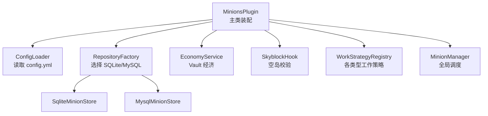
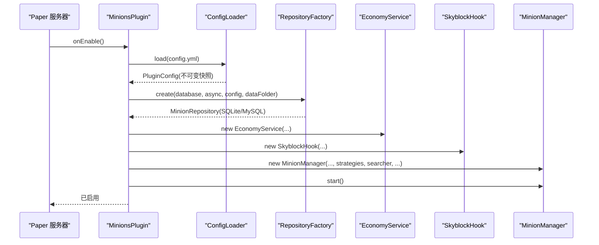
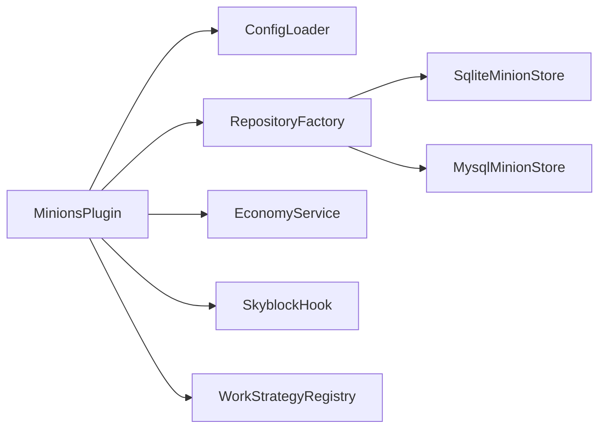

# 安装与配置

<cite>
**本文引用的文件**
- [config.yml](file://src/main/resources/config.yml)
- [paper-plugin.yml](file://src/main/resources/paper-plugin.yml)
- [pom.xml](file://pom.xml)
- [README.md](file://README.md)
- [MinionsPlugin.java](file://src/main/java/com/hcs/minions/MinionsPlugin.java)
- [ConfigLoader.java](file://src/main/java/com/hcs/minions/config/ConfigLoader.java)
- [PluginConfig.java](file://src/main/java/com/hcs/minions/config/PluginConfig.java)
- [DatabaseConfig.java](file://src/main/java/com/hcs/minions/config/DatabaseConfig.java)
- [RepositoryFactory.java](file://src/main/java/com/hcs/minions/repository/RepositoryFactory.java)
- [SqliteMinionStore.java](file://src/main/java/com/hcs/minions/repository/sqlite/SqliteMinionStore.java)
- [MysqlMinionStore.java](file://src/main/java/com/hcs/minions/repository/mysql/MysqlMinionStore.java)
- [EconomyService.java](file://src/main/java/com/hcs/minions/service/EconomyService.java)
- [SkyblockHook.java](file://src/main/java/com/hcs/minions/service/hook/SkyblockHook.java)
</cite>

## 目录
1. [简介](#简介)
2. [项目结构](#项目结构)
3. [核心组件](#核心组件)
4. [架构总览](#架构总览)
5. [详细组件分析](#详细组件分析)
6. [依赖分析](#依赖分析)
7. [性能注意事项](#性能注意事项)
8. [故障排查指南](#故障排查指南)
9. [结论](#结论)
10. [附录：配置项速查](#附录：配置项速查)

## 简介
本指南面向希望在自己的 Paper 1.21+ 服务器上部署 SkyMinions 仆从系统插件的管理员与高级玩家。内容涵盖环境要求、安装步骤、可选依赖（Vault、SuperiorSkyblock2、LuckPerms）的安装与配置，以及 config.yml 的完整配置说明（数据库、权限、经济集成、空岛联动等）。同时提供 SQLite 与 MySQL 两种数据库的配置示例，解释 paper-plugin.yml 中的依赖声明与库管理方式，并给出常见问题的解决方案与最佳实践建议。

## 项目结构
SkyMinions 采用分层与模块化设计：
- 主类负责生命周期管理与服务装配
- 配置通过强类型记录在启动时一次性加载为不可变快照
- 存储层抽象出 MinionStore 接口，支持 SQLite 与 MySQL
- 工作策略按仆从类型分离（矿工、农夫、伐木工、钓鱼、猎魔、牧民、圆石生成器）
- 可选集成 Vault 经济与 SuperiorSkyblock2 空岛校验
- 权限由 LuckPerms 接管 Bukkit 权限节点

图表来源
- [MinionsPlugin.java:51-118](file://src/main/java/com/hcs/minions/MinionsPlugin.java#L51-L118)
- [RepositoryFactory.java:20-29](file://src/main/java/com/hcs/minions/repository/RepositoryFactory.java#L20-L29)
- [SqliteMinionStore.java:22-79](file://src/main/java/com/hcs/minions/repository/sqlite/SqliteMinionStore.java#L22-L79)
- [MysqlMinionStore.java:25-92](file://src/main/java/com/hcs/minions/repository/mysql/MysqlMinionStore.java#L25-L92)
- [EconomyService.java:24-49](file://src/main/java/com/hcs/minions/service/EconomyService.java#L24-L49)
- [SkyblockHook.java:19-32](file://src/main/java/com/hcs/minions/service/hook/SkyblockHook.java#L19-L32)

章节来源
- [README.md:1-109](file://README.md#L1-L109)
- [MinionsPlugin.java:44-118](file://src/main/java/com/hcs/minions/MinionsPlugin.java#L44-L118)

## 核心组件
- 配置系统：ConfigLoader 将 YAML 反序列化为强类型 PluginConfig，运行时只读共享；缺失或非法值回退默认并告警。
- 存储层：RepositoryFactory 根据配置创建 SQLite 或 MySQL 实现，统一封装为 MinionRepository（带缓存）。
- 经济服务：EconomyService 对接 Vault，异步加款，失败不结算。
- 空岛钩子：SkyblockHook 检测 SuperiorSkyblock2，宽松策略下非空岛不限制工作，空岛内校验边界。
- 工作策略：按仆从类型注册不同策略，统一由 MinionManager 调度执行。

章节来源
- [ConfigLoader.java:30-83](file://src/main/java/com/hcs/minions/config/ConfigLoader.java#L30-L83)
- [PluginConfig.java:22-46](file://src/main/java/com/hcs/minions/config/PluginConfig.java#L22-L46)
- [RepositoryFactory.java:20-29](file://src/main/java/com/hcs/minions/repository/RepositoryFactory.java#L20-L29)
- [EconomyService.java:24-88](file://src/main/java/com/hcs/minions/service/EconomyService.java#L24-L88)
- [SkyblockHook.java:19-79](file://src/main/java/com/hcs/minions/service/hook/SkyblockHook.java#L19-L79)

## 架构总览
插件启动流程概览：
- 加载消息与配置
- 初始化异步执行器
- 创建存储仓库（SQLite/MySQL）
- 初始化经济服务与空岛钩子
- 注册各类型工作策略
- 创建管理器并启动全局调度
- 注册事件监听与命令

图表来源
- [MinionsPlugin.java:51-118](file://src/main/java/com/hcs/minions/MinionsPlugin.java#L51-L118)
- [ConfigLoader.java:30-83](file://src/main/java/com/hcs/minions/config/ConfigLoader.java#L30-L83)
- [RepositoryFactory.java:20-29](file://src/main/java/com/hcs/minions/repository/RepositoryFactory.java#L20-L29)
- [EconomyService.java:24-49](file://src/main/java/com/hcs/minions/service/EconomyService.java#L24-L49)
- [SkyblockHook.java:19-32](file://src/main/java/com/hcs/minions/service/hook/SkyblockHook.java#L19-L32)

## 详细组件分析

### 环境与安装
- 环境要求
  - JDK 21+（构建与运行）
  - Maven（用于构建）
  - Paper 1.21+ 服务器（API 版本 1.21）
- 安装步骤
  - 使用 Maven 构建：mvn clean package，产物位于 target/SkyMinions-版本号.jar
  - 将 jar 放入服务器 plugins 目录
  - 重启服务器，插件会自动生成 config.yml、messages.yml 等资源文件
  - 按需安装可选依赖：
    - Vault（经济）：安装到 plugins 目录并启用
    - SuperiorSkyblock2（空岛）：安装到 plugins 目录并启用
    - LuckPerms（权限）：安装到 plugins 目录并启用（自动接管 Bukkit 权限节点）

章节来源
- [pom.xml:15-23](file://pom.xml#L15-L23)
- [README.md:67-77](file://README.md#L67-L77)
- [paper-plugin.yml:1-13](file://src/main/resources/paper-plugin.yml#L1-L13)

### 可选依赖安装与配置
- Vault（经济）
  - 作用：自动售卖、价格倍率、金币奖励
  - 配置：config.yml 中 economy.enabled 控制是否启用；若未检测到 Vault，经济功能关闭
  - 行为：所有 Vault 调用异步执行，成功才结算
- SuperiorSkyblock2（空岛）
  - 作用：放置与工作时的岛屿边界校验（宽松策略）
  - 配置：无需额外配置，插件自动检测；未检测到则关闭空岛限制
- LuckPerms（权限）
  - 作用：管理 hcs.minions.* 权限节点
  - 配置：在 LP 中分配权限，如 hcs.minions.admin、hcs.minions.use、hcs.minions.type.*、hcs.minions.limit.<n>

章节来源
- [EconomyService.java:38-49](file://src/main/java/com/hcs/minions/service/EconomyService.java#L38-L49)
- [SkyblockHook.java:24-32](file://src/main/java/com/hcs/minions/service/hook/SkyblockHook.java#L24-L32)
- [paper-plugin.yml:24-47](file://src/main/resources/paper-plugin.yml#L24-L47)
- [README.md:49-66](file://README.md#L49-L66)

### 配置文件详解（config.yml）
- 全局调度参数
  - tick-period：全局调度周期（tick），默认 20
  - max-checks-per-cycle：单次策略执行方块检查上限，必须小于 50，默认 48
  - max-minions-per-player：每玩家仆从槽位上限，默认 5
  - head-texture：固定仆从头颅贴图（base64），留空使用默认
  - debug：调试日志开关
- 数据库配置（database）
  - type：sqlite 或 mysql
  - sqlite-file：SQLite 文件名（默认 minions.db）
  - host/port/database/user/password：MySQL 连接信息
  - pool-size：HikariCP 连接池大小（默认 4）
- 经济配置（economy）
  - enabled：是否启用经济（需要 Vault）
  - auto-sell-on-full：仓库满时自动售卖
  - sell-interval-ticks：自动售卖轮询间隔
  - price-multiplier：全局价格倍率
- 离线收益（offline）
  - enabled：是否启用离线收益
  - max-hours：离线收益最大计算时长上限（默认 48）
  - rate-multiplier：离线收益效率折扣（默认 0.5）
- Collection 里程碑（collections）
  - enabled：是否启用里程碑
  - milestones：资源累计阈值列表
  - coins-base：第 n 个里程碑基础金币
  - slot-milestones：可解锁额外槽位的里程碑序号
- 仆从类型（types）
  - miner/farmer/lumberjack/fisher/slayer/rancher/cobble：每种类型的显示名、等级、效率、燃料、冷却、售价、产物、升级材料、半径、稀有掉落及概率、目标方块等

章节来源
- [config.yml:1-153](file://src/main/resources/config.yml#L1-L153)
- [ConfigLoader.java:30-83](file://src/main/java/com/hcs/minions/config/ConfigLoader.java#L30-L83)
- [PluginConfig.java:22-46](file://src/main/java/com/hcs/minions/config/PluginConfig.java#L22-L46)

### 数据库配置示例
- SQLite
  - 适用场景：单机或小服，简单部署
  - 配置要点：
    - database.type=sqlite
    - database.sqlite-file 指定数据库文件路径
  - 特点：单连接串行写入，适合低并发
- MySQL
  - 适用场景：多服或高并发
  - 配置要点：
    - database.type=mysql
    - host/port/database/user/password 填写正确
    - pool-size 建议保持较小（默认 4），避免虚拟线程被固定
  - 特点：基于 HikariCP，连接超时收紧，预编译语句缓存开启

章节来源
- [config.yml:13-21](file://src/main/resources/config.yml#L13-L21)
- [DatabaseConfig.java:6-19](file://src/main/java/com/hcs/minions/config/DatabaseConfig.java#L6-L19)
- [MysqlMinionStore.java:64-92](file://src/main/java/com/hcs/minions/repository/mysql/MysqlMinionStore.java#L64-L92)
- [SqliteMinionStore.java:62-79](file://src/main/java/com/hcs/minions/repository/sqlite/SqliteMinionStore.java#L62-L79)

### paper-plugin.yml 依赖与库管理
- 依赖声明
  - dependencies：Vault、SuperiorSkyblock2 为软依赖（required=false），缺失不影响插件运行，仅关闭对应能力
- 库管理
  - libraries：fastutil、HikariCP、sqlite-jdbc、mysql-connector-j、protobuf-java 由 Paper 在加载插件时从 Maven Central 自动下载并挂载到插件类加载器
  - 优势：保持插件 jar 瘦小，减少打包体积

章节来源
- [paper-plugin.yml:8-23](file://src/main/resources/paper-plugin.yml#L8-L23)
- [pom.xml:76-103](file://pom.xml#L76-L103)

### 权限与命令
- 权限节点
  - hcs.minions.admin：管理权限（默认 op）
  - hcs.minions.use：使用仆从（默认 true）
  - hcs.minions.type.*：允许使用特定类型仆从
  - hcs.minions.limit.<n>：设置仆从数量上限（取拥有的最大 n）
- 命令
  - /minion give <type> <amount>：发放仆从
  - /minion upgrade <模块>：发放模块
  - /minion collection：查看收集进度与里程碑

章节来源
- [paper-plugin.yml:24-47](file://src/main/resources/paper-plugin.yml#L24-L47)
- [README.md:37-66](file://README.md#L37-L66)

## 依赖分析
- 外部依赖
  - Paper API（provided）：服务端提供，不打入 jar
  - Vault API（provided）：可选经济集成
  - SuperiorSkyblock2 API（provided）：可选空岛集成
  - fastutil/HikariCP/sqlite-jdbc/mysql-connector-j/protobuf-java：运行时由 Paper 自动下载
- 内部依赖
  - MinionsPlugin 依赖 ConfigLoader、RepositoryFactory、EconomyService、SkyblockHook、WorkStrategyRegistry 等
  - RepositoryFactory 根据配置选择 SQLite 或 MySQL 实现
  - EconomyService 依赖 Vault，未启用时降级
  - SkyblockHook 依赖 SuperiorSkyblock2，未启用时放宽限制

图表来源
- [MinionsPlugin.java:51-118](file://src/main/java/com/hcs/minions/MinionsPlugin.java#L51-L118)
- [RepositoryFactory.java:20-29](file://src/main/java/com/hcs/minions/repository/RepositoryFactory.java#L20-L29)
- [EconomyService.java:24-49](file://src/main/java/com/hcs/minions/service/EconomyService.java#L24-L49)
- [SkyblockHook.java:19-32](file://src/main/java/com/hcs/minions/service/hook/SkyblockHook.java#L19-L32)

章节来源
- [pom.xml:40-103](file://pom.xml#L40-L103)
- [paper-plugin.yml:8-23](file://src/main/resources/paper-plugin.yml#L8-L23)

## 性能注意事项
- 全局调度器每 tick 遍历一次，BlockSearcher 限流搜索（硬上限 <50）
- SQLite 写入串行，单连接 + 锁即可；MySQL 使用 HikariCP 连接池，保持小规模
- 所有 Vault 调用异步执行，避免阻塞主线程
- GUI 使用真实 Inventory，无刷物问题
- 推荐配置：max-checks-per-cycle 保持在 48 以内，pool-size 保持 4 左右

章节来源
- [README.md:82-85](file://README.md#L82-L85)
- [MysqlMinionStore.java:20-24](file://src/main/java/com/hcs/minions/repository/mysql/MysqlMinionStore.java#L20-L24)
- [EconomyService.java:55-88](file://src/main/java/com/hcs/minions/service/EconomyService.java#L55-L88)

## 故障排查指南
- 常见问题
  - Vault 未启用：经济功能关闭，自动售卖无效
  - SuperiorSkyblock2 未启用：空岛限制关闭，任何位置均可放置与工作
  - 数据库连接失败：检查 MySQL 主机、端口、用户名、密码、数据库名；SQLite 检查文件路径与权限
  - 配置错误：未知物料名会回退默认值并告警；稀有掉落未配置但设置了概率会关闭稀有掉落
- 排查步骤
  - 查看服务器日志，定位错误信息
  - 检查 config.yml 中相关配置是否正确
  - 确认可选依赖是否安装并启用
  - 对于 MySQL，检查连接池大小与超时设置

章节来源
- [EconomyService.java:38-49](file://src/main/java/com/hcs/minions/service/EconomyService.java#L38-L49)
- [SkyblockHook.java:24-32](file://src/main/java/com/hcs/minions/service/hook/SkyblockHook.java#L24-L32)
- [SqliteMinionStore.java:62-79](file://src/main/java/com/hcs/minions/repository/sqlite/SqliteMinionStore.java#L62-L79)
- [MysqlMinionStore.java:64-92](file://src/main/java/com/hcs/minions/repository/mysql/MysqlMinionStore.java#L64-L92)
- [ConfigLoader.java:116-131](file://src/main/java/com/hcs/minions/config/ConfigLoader.java#L116-L131)

## 结论
SkyMinions 提供了完整的仆从系统实现，支持多种仆从类型、升级模块、离线收益、自动售卖、空岛联动等功能。通过强类型配置与模块化设计，插件易于扩展与维护。按照本指南完成安装与配置后，可在 Paper 1.21+ 服务器上稳定运行。建议根据服务器规模选择合适的数据库与连接池配置，并合理设置权限与经济集成。

## 附录：配置项速查
- 全局
  - tick-period：调度周期（tick）
  - max-checks-per-cycle：单次检查上限（<50）
  - max-minions-per-player：每玩家仆从上限
  - head-texture：头颅贴图 base64
  - debug：调试日志开关
- 数据库
  - type：sqlite/mysql
  - sqlite-file：SQLite 文件路径
  - host/port/database/user/password：MySQL 连接信息
  - pool-size：连接池大小
- 经济
  - enabled：是否启用
  - auto-sell-on-full：仓库满自动售卖
  - sell-interval-ticks：售卖轮询间隔
  - price-multiplier：价格倍率
- 离线收益
  - enabled：是否启用
  - max-hours：最大计算时长
  - rate-multiplier：效率折扣
- Collection
  - enabled：是否启用
  - milestones：阈值列表
  - coins-base：基础金币
  - slot-milestones：可解锁槽位的里程碑序号
- 仆从类型
  - display-name：显示名
  - max-level：最大等级
  - base-efficiency/efficiency-per-level：效率
  - base-fuel-ticks/cooldown-ticks：燃料与冷却
  - sell-price-per-unit：单价
  - product：产物
  - upgrade-item/upgrade-cost：升级材料与成本
  - base-radius：工作半径
  - rare-drop/rare-drop-chance：稀有掉落与概率
  - targets：目标方块列表

章节来源
- [config.yml:1-153](file://src/main/resources/config.yml#L1-L153)