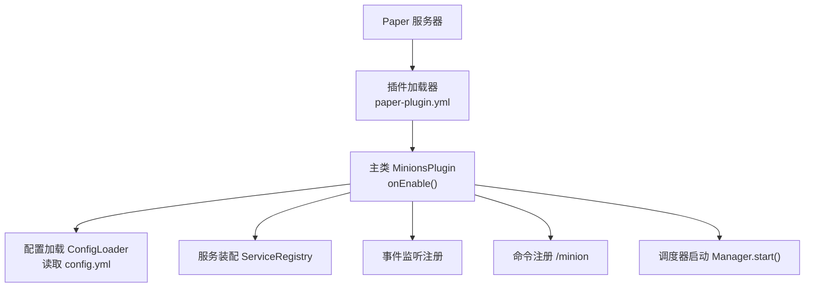
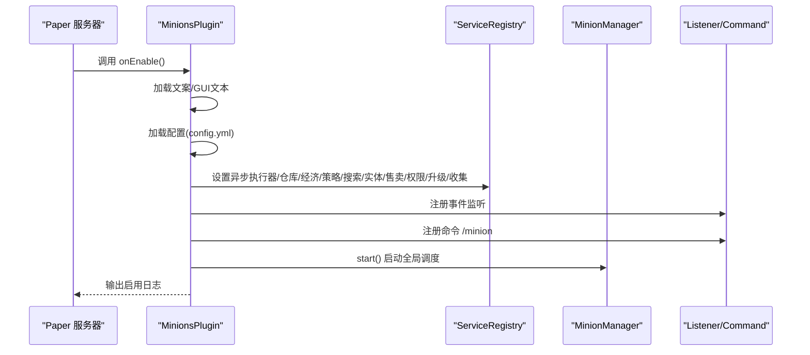
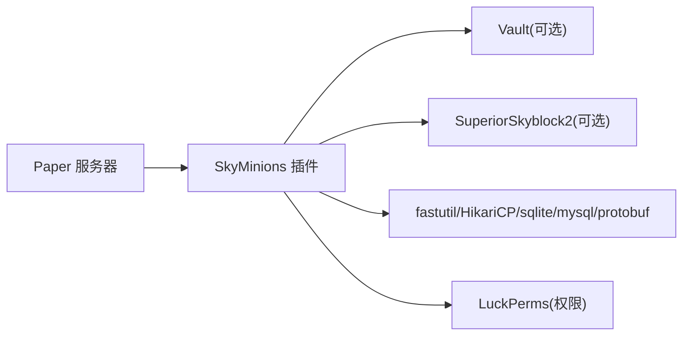

# 插件安装步骤

<cite>
**本文引用的文件**
- [pom.xml](file://pom.xml)
- [paper-plugin.yml](file://src/main/resources/paper-plugin.yml)
- [MinionsPlugin.java](file://src/main/java/com/hcs/minions/MinionsPlugin.java)
- [config.yml](file://src/main/resources/config.yml)
- [MinionCommand.java](file://src/main/java/com/hcs/minions/command/MinionCommand.java)
- [Messages.java](file://src/main/java/com/hcs/minions/util/Messages.java)
- [README.md](file://README.md)
</cite>

## 目录
1. [简介](#简介)
2. [项目结构](#项目结构)
3. [核心组件](#核心组件)
4. [架构总览](#架构总览)
5. [详细组件分析](#详细组件分析)
6. [依赖关系分析](#依赖关系分析)
7. [性能注意事项](#性能注意事项)
8. [故障排查指南](#故障排查指南)
9. [结论](#结论)
10. [附录](#附录)

## 简介
本指南面向首次安装 SkyMinions 仆从系统的新手用户，提供从下载、放置到验证的完整流程。SkyMinions 是一个基于 Paper 1.21+ 的 Minecraft 服务器插件，支持放置盔甲架小人作为“仆从”，在固定范围内自动采集/工作，并具备升级、燃料、离线收益、自动售卖、空岛联动与权限控制等功能。

## 项目结构
- 插件主类：com.hcs.minions.MinionsPlugin（负责生命周期与服务装配）
- 命令入口：/minion（管理命令，注册于 Server CommandMap）
- 配置文件：config.yml（运行时配置）、messages.yml（文案模板，启动自动生成）
- 插件描述：paper-plugin.yml（声明 API 版本、可选依赖、运行时库）
- 构建配置：pom.xml（Maven 构建、依赖声明、产物名）

图表来源
- [paper-plugin.yml:1-23](file://src/main/resources/paper-plugin.yml#L1-L23)
- [MinionsPlugin.java:52-120](file://src/main/java/com/hcs/minions/MinionsPlugin.java#L52-L120)

章节来源
- [paper-plugin.yml:1-23](file://src/main/resources/paper-plugin.yml#L1-L23)
- [MinionsPlugin.java:52-120](file://src/main/java/com/hcs/minions/MinionsPlugin.java#L52-L120)

## 核心组件
- 主类 MinionsPlugin：仅做生命周期管理与服务装配，不承载业务逻辑
- 命令 MinionCommand：实现 /minion 子命令（give、upgrade、skin、collection、reload、purge、list）
- 配置 ConfigLoader/ConfigProvider：将 config.yml 反序列化为强类型不可变快照，供各模块只读共享
- 消息 Messages：可配置的 MiniMessage 文案模板，支持热重载
- 服务层：MinionManager、EconomyService、PermissionService、OfflineRewardService 等

章节来源
- [MinionsPlugin.java:52-120](file://src/main/java/com/hcs/minions/MinionsPlugin.java#L52-L120)
- [MinionCommand.java:22-49](file://src/main/java/com/hcs/minions/command/MinionCommand.java#L22-L49)
- [Messages.java:128-144](file://src/main/java/com/hcs/minions/util/Messages.java#L128-L144)

## 架构总览
SkyMinions 采用“组合根 + 服务装配”的模式：
- onEnable 中按顺序完成：文案/GUI 文本加载 → 配置加载 → 异步执行器创建 → 仓库初始化 → 经济/空岛钩子 → 策略注册 → 搜索器/实体/售卖/权限/升级/收集服务装配 → 事件监听注册 → 命令注册 → 定期落盘 → 管理器启动
- 所有服务通过 ServiceRegistry 集中持有，避免散落的静态引用

图表来源
- [MinionsPlugin.java:52-120](file://src/main/java/com/hcs/minions/MinionsPlugin.java#L52-L120)

章节来源
- [MinionsPlugin.java:52-120](file://src/main/java/com/hcs/minions/MinionsPlugin.java#L52-L120)

## 详细组件分析

### 安装前准备与环境要求
- 服务器端：Paper 1.21+（API 版本 1.21），JDK 21+（编译目标）
- 可选依赖（软依赖，缺失不影响基础功能）：Vault（经济）、SuperiorSkyblock2（空岛）、LuckPerms（权限）
- 运行时库：fastutil、HikariCP、sqlite-jdbc、mysql-connector-j、protobuf-java（由 Paper 自动下载）

章节来源
- [pom.xml:15-23](file://pom.xml#L15-L23)
- [pom.xml:40-111](file://pom.xml#L40-L111)
- [paper-plugin.yml:8-23](file://src/main/resources/paper-plugin.yml#L8-L23)
- [README.md:72-82](file://README.md#L72-L82)

### 从 Maven 仓库下载插件
- 使用 Maven 构建：mvn clean package
- 产物路径：target/SkyMinions-1.0.0.jar（瘦 jar，不包含运行时库）
- 若需直接获取已构建产物，可从发布渠道下载对应版本的 jar

章节来源
- [pom.xml:113-130](file://pom.xml#L113-L130)
- [README.md:72-82](file://README.md#L72-L82)

### 放置到服务器 plugins 目录并重启
- 将 SkyMinions-1.0.0.jar 放入服务器的 plugins 目录
- 重启服务器或执行 /reload（推荐重启以确保依赖库正确下载与挂载）

章节来源
- [paper-plugin.yml:15-23](file://src/main/resources/paper-plugin.yml#L15-L23)

### Paper 插件加载机制与依赖检查
- paper-plugin.yml 声明 main 类、api-version、可选依赖与 libraries
- Paper 会在首次加载时根据 libraries 从 Maven Central 自动下载所需库并挂载到插件类加载器
- 可选依赖（Vault、SuperiorSkyblock2）为 softdepend，缺失时插件仍可运行，但相关能力会关闭

章节来源
- [paper-plugin.yml:1-23](file://src/main/resources/paper-plugin.yml#L1-L23)

### 验证插件是否正确安装
- 控制台输出检查：启动后应出现“SkyMinions 已启用”的日志
- 命令测试：执行 /minion list 查看在线仆从总数；执行 /minion give miner 1 发放一个 Lv.1 矿工仆从
- GUI 测试：右键放置的仆从打开真实箱子界面，进行取放/升级/切换皮肤等操作

章节来源
- [MinionsPlugin.java:119-120](file://src/main/java/com/hcs/minions/MinionsPlugin.java#L119-L120)
- [MinionCommand.java:51-68](file://src/main/java/com/hcs/minions/command/MinionCommand.java#L51-L68)
- [MinionCommand.java:70-95](file://src/main/java/com/hcs/minions/command/MinionCommand.java#L70-L95)

### 常见安装问题与解决方案
- 依赖缺失（Vault/SuperiorSkyblock2）
  - 现象：经济或空岛功能不可用
  - 解决：安装对应插件；这些为软依赖，缺失不会阻止插件加载
- 版本不兼容（Paper API）
  - 现象：无法加载或报错
  - 解决：确保服务器为 Paper 1.21+，且与插件 api-version 匹配
- 运行时库下载失败
  - 现象：启动时报错找不到 fastutil/HikariCP/sqlite/mysql 等
  - 解决：检查网络与防火墙；确认 Paper 能访问 Maven Central；必要时手动下载并放入 libs 目录（如平台支持）
- 权限问题
  - 现象：无法执行 /minion 或无法放置/操作仆从
  - 解决：授予 hcs.minions.admin（管理）与 hcs.minions.use（使用）权限；可通过 LuckPerms 分配
- 数据库连接失败（MySQL）
  - 现象：无法持久化数据
  - 解决：检查 config.yml 中 database.type=mysql 的配置项（host/port/database/user/password/pool-size）

章节来源
- [paper-plugin.yml:8-23](file://src/main/resources/paper-plugin.yml#L8-L23)
- [config.yml:13-21](file://src/main/resources/config.yml#L13-L21)
- [MinionCommand.java:47-49](file://src/main/java/com/hcs/minions/command/MinionCommand.java#L47-L49)

### 初始配置建议与最佳实践
- 基本配置（config.yml）
  - tick-period：全局调度周期（默认 20 tick）
  - max-checks-per-cycle：单次策略执行方块检查上限（必须 < 50）
  - max-minions-per-player：每玩家仆从槽位上限（默认 5）
  - database：选择 sqlite 或 mysql；sqlite-file 或 MySQL 连接信息
  - economy：开启 Vault 经济、自动售卖开关、价格倍率
  - offline：离线收益开关、最大计算时长、效率折扣
  - collections：里程碑阈值、金币奖励基数、额外槽位里程碑序号
  - types：七类仆从的工作半径、稀有掉落、升级材料、冷却时间等
- 权限建议
  - 管理员：hcs.minions.admin
  - 普通玩家：hcs.minions.use
  - 类型权限：hcs.minions.type.miner/farmer/lumberjack/rancher/cobble
  - 数量上限：hcs.minions.limit.<n>（例如 limit.20）
- 文案与 GUI 自定义
  - messages.yml：MiniMessage 模板，支持 {0}{1}… 占位符与颜色标签
  - 修改后执行 /minion reload 热重载文案与 GUI 文本
- 性能与安全
  - 保持 max-checks-per-cycle < 50，避免单 tick 过多方块检测
  - 合理设置 pool-size（HikariCP），小池更稳定
  - 使用固定工作范围 5x5，保证光照 ≥ 8，避免刷怪干扰

章节来源
- [config.yml:4-21](file://src/main/resources/config.yml#L4-L21)
- [config.yml:23-46](file://src/main/resources/config.yml#L23-L46)
- [config.yml:47-153](file://src/main/resources/config.yml#L47-L153)
- [paper-plugin.yml:24-47](file://src/main/resources/paper-plugin.yml#L24-L47)
- [Messages.java:128-144](file://src/main/java/com/hcs/minions/util/Messages.java#L128-L144)
- [MinionCommand.java:125-130](file://src/main/java/com/hcs/minions/command/MinionCommand.java#L125-L130)

## 依赖关系分析
- 服务端依赖（provided）：Paper API、SLF4J API
- 可选依赖（softdepend）：Vault、SuperiorSkyblock2
- 运行时依赖（libraries）：fastutil、HikariCP、sqlite-jdbc、mysql-connector-j、protobuf-java
- 权限与插件联动：LuckPerms（接管 Bukkit 权限）

图表来源
- [pom.xml:40-111](file://pom.xml#L40-L111)
- [paper-plugin.yml:8-23](file://src/main/resources/paper-plugin.yml#L8-L23)

章节来源
- [pom.xml:40-111](file://pom.xml#L40-L111)
- [paper-plugin.yml:8-23](file://src/main/resources/paper-plugin.yml#L8-L23)

## 性能注意事项
- 全局调度器每 20 tick 遍历一次，O(n)+O(1) 短路优化
- BlockSearcher 限流搜索（邻接+随机，硬上限 <50）
- 方块破坏与 Inventory#addItem 在主线程执行，Vault 售卖异步
- GUI 使用真实 Inventory（Bukkit 内部深拷贝，无刷物）

章节来源
- [README.md:85-90](file://README.md#L85-L90)

## 故障排查指南
- 控制台未出现“SkyMinions 已启用”
  - 检查是否成功加载 paper-plugin.yml 与主类
  - 检查是否有异常堆栈（依赖缺失、版本不兼容）
- /minion 命令无效
  - 确认拥有 hcs.minions.admin 权限
  - 确认命令已注册（Server CommandMap）
- 经济/空岛功能不可用
  - 确认已安装 Vault/SuperiorSkyblock2（软依赖）
- 数据库写入失败
  - 检查 config.yml 的 database 配置（type、host、port、database、user、password、pool-size）
- 文案显示异常
  - 检查 messages.yml 语法与 MiniMessage 标签
  - 执行 /minion reload 重新加载文案

章节来源
- [MinionsPlugin.java:119-120](file://src/main/java/com/hcs/minions/MinionsPlugin.java#L119-L120)
- [MinionCommand.java:47-49](file://src/main/java/com/hcs/minions/command/MinionCommand.java#L47-L49)
- [config.yml:13-21](file://src/main/resources/config.yml#L13-L21)
- [Messages.java:128-144](file://src/main/java/com/hcs/minions/util/Messages.java#L128-L144)

## 结论
按照本指南完成环境准备、下载与放置、重启与验证后，SkyMinions 即可正常运行。建议在正式服上线前进行最小化配置与功能测试，并根据服务器规模调整调度与数据库参数。通过权限与文案定制，可快速适配不同玩法与团队需求。

## 附录
- 常用命令
  - /minion give <类型> [等级]：发放仆从
  - /minion upgrade <模块>：发放模块
  - /minion skin：查看可用皮肤
  - /minion collection：查看资源累计与里程碑进度
  - /minion reload：重载配置与文案
  - /minion purge：清理残留仆从实体
  - /minion list：查看在线仆从总数
- 权限列表
  - hcs.minions.admin：管理权限（默认 op）
  - hcs.minions.use：使用仆从（默认 true）
  - hcs.minions.type.*：类型权限
  - hcs.minions.limit.<n>：数量上限

章节来源
- [MinionCommand.java:51-68](file://src/main/java/com/hcs/minions/command/MinionCommand.java#L51-L68)
- [paper-plugin.yml:24-47](file://src/main/resources/paper-plugin.yml#L24-L47)
- [README.md:54-71](file://README.md#L54-L71)