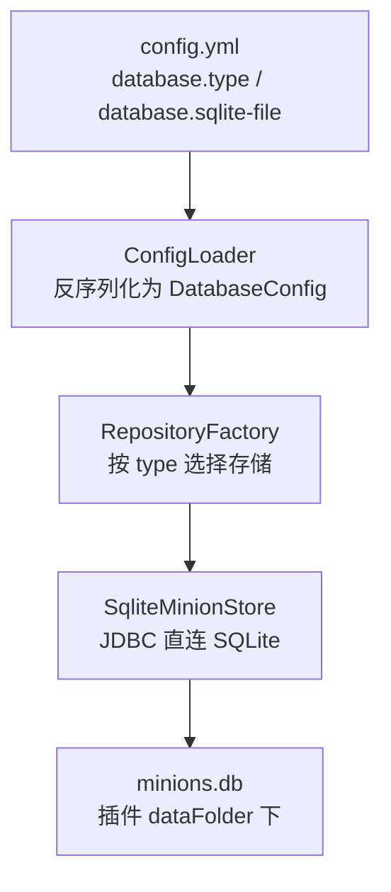
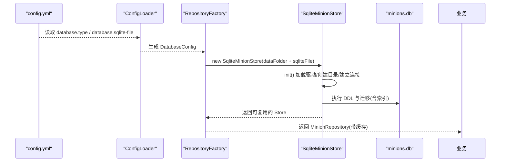
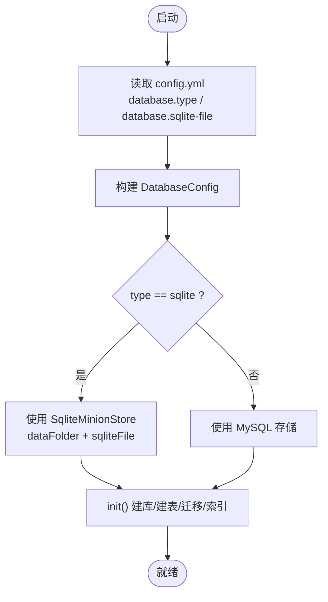
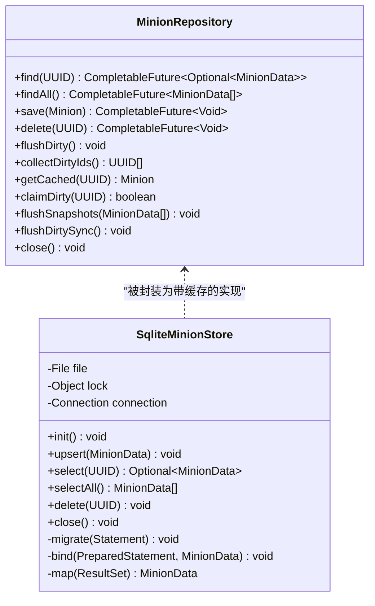

# SQLite 配置

<cite>
**本文引用的文件**
- [config.yml](file://src/main/resources/config.yml)
- [DatabaseConfig.java](file://src/main/java/com/hcs/minions/config/DatabaseConfig.java)
- [ConfigLoader.java](file://src/main/java/com/hcs/minions/config/ConfigLoader.java)
- [RepositoryFactory.java](file://src/main/java/com/hcs/minions/repository/RepositoryFactory.java)
- [SqliteMinionStore.java](file://src/main/java/com/hcs/minions/repository/sqlite/SqliteMinionStore.java)
- [MinionRepository.java](file://src/main/java/com/hcs/minions/repository/MinionRepository.java)
- [Logs.java](file://src/main/java/com/hcs/minions/util/Logs.java)
</cite>

## 目录
1. [简介](#简介)
2. [项目结构](#项目结构)
3. [核心组件](#核心组件)
4. [架构总览](#架构总览)
5. [详细组件分析](#详细组件分析)
6. [依赖关系分析](#依赖关系分析)
7. [性能考虑](#性能考虑)
8. [故障排除指南](#故障排除指南)
9. [结论](#结论)
10. [附录：配置文件示例与最佳实践](#附录配置文件示例与最佳实践)

## 简介
本指南面向小型 Minecraft 插件项目的本地数据持久化需求，聚焦于 SQLite 作为单机/测试/个人服务器的数据库方案。文档基于仓库中的实际实现，说明如何配置 sqliteFile、理解连接流程、管理数据库文件位置与权限、制定备份策略，并给出性能优化与故障排除建议。目标是让读者快速完成部署并稳定运行。

## 项目结构
本项目采用“配置加载 → 工厂装配 → 存储实现”的分层设计：
- 配置加载：从 config.yml 读取 database.type 与 database.sqlite-file 等参数，构造强类型 DatabaseConfig。
- 工厂装配：根据 type 选择 SqliteMinionStore 或 MysqlMinionStore，并初始化。
- 存储实现：SQLite 通过单连接 + 同步锁串行写入；业务层通过 MinionRepository 接口访问，对底层无感知。

图表来源
- [config.yml:13-21](file://src/main/resources/config.yml#L13-L21)
- [ConfigLoader.java:30-43](file://src/main/java/com/hcs/minions/config/ConfigLoader.java#L30-L43)
- [RepositoryFactory.java:20-28](file://src/main/java/com/hcs/minions/repository/RepositoryFactory.java#L20-L28)
- [SqliteMinionStore.java:62-79](file://src/main/java/com/hcs/minions/repository/sqlite/SqliteMinionStore.java#L62-L79)

章节来源
- [config.yml:13-21](file://src/main/resources/config.yml#L13-L21)
- [ConfigLoader.java:30-43](file://src/main/java/com/hcs/minions/config/ConfigLoader.java#L30-L43)
- [RepositoryFactory.java:20-28](file://src/main/java/com/hcs/minions/repository/RepositoryFactory.java#L20-L28)
- [SqliteMinionStore.java:62-79](file://src/main/java/com/hcs/minions/repository/sqlite/SqliteMinionStore.java#L62-L79)

## 核心组件
- DatabaseConfig：承载数据库类型与连接参数，提供 isSqlite() 判断。
- ConfigLoader：唯一接触 getConfig() 的地方，将 YAML 转为强类型对象。
- RepositoryFactory：按配置创建具体存储（SQLite/MySQL），并统一包装为带缓存的 MinionRepository。
- SqliteMinionStore：SQLite 的具体实现，负责建表、迁移、索引、CRUD 操作。
- MinionRepository：业务层使用的持久化接口，屏蔽 IO 细节。
- Logs：统一日志输出，用于错误记录与诊断。

章节来源
- [DatabaseConfig.java:6-19](file://src/main/java/com/hcs/minions/config/DatabaseConfig.java#L6-L19)
- [ConfigLoader.java:30-43](file://src/main/java/com/hcs/minions/config/ConfigLoader.java#L30-L43)
- [RepositoryFactory.java:20-28](file://src/main/java/com/hcs/minions/repository/RepositoryFactory.java#L20-L28)
- [SqliteMinionStore.java:22-79](file://src/main/java/com/hcs/minions/repository/sqlite/SqliteMinionStore.java#L22-L79)
- [MinionRepository.java:16-46](file://src/main/java/com/hcs/minions/repository/MinionRepository.java#L16-L46)
- [Logs.java:20-31](file://src/main/java/com/hcs/minions/util/Logs.java#L20-L31)

## 架构总览
下图展示了从配置到 SQLite 连接的完整调用链，以及关键的数据流向。

图表来源
- [ConfigLoader.java:30-43](file://src/main/java/com/hcs/minions/config/ConfigLoader.java#L30-L43)
- [RepositoryFactory.java:20-28](file://src/main/java/com/hcs/minions/repository/RepositoryFactory.java#L20-L28)
- [SqliteMinionStore.java:62-79](file://src/main/java/com/hcs/minions/repository/sqlite/SqliteMinionStore.java#L62-L79)

## 详细组件分析

### 配置加载与 sqliteFile 解析
- 配置项：
  - database.type：选择 sqlite 或 mysql。
  - database.sqlite-file：SQLite 文件名，默认 minions.db。
- 解析过程：
  - ConfigLoader 从 config.yml 读取上述字段，构造 DatabaseConfig。
  - RepositoryFactory 根据 cfg.isSqlite() 决定使用 SqliteMinionStore。
  - sqliteFile 与插件 dataFolder 拼接成绝对路径，确保文件位于插件数据目录下。

图表来源
- [ConfigLoader.java:30-43](file://src/main/java/com/hcs/minions/config/ConfigLoader.java#L30-L43)
- [RepositoryFactory.java:20-28](file://src/main/java/com/hcs/minions/repository/RepositoryFactory.java#L20-L28)
- [SqliteMinionStore.java:62-79](file://src/main/java/com/hcs/minions/repository/sqlite/SqliteMinionStore.java#L62-L79)

章节来源
- [config.yml:13-21](file://src/main/resources/config.yml#L13-L21)
- [ConfigLoader.java:30-43](file://src/main/java/com/hcs/minions/config/ConfigLoader.java#L30-L43)
- [RepositoryFactory.java:20-28](file://src/main/java/com/hcs/minions/repository/RepositoryFactory.java#L20-L28)

### SQLite 存储实现与数据模型
- 表结构与字段：
  - 主键 id、所有者 owner、类型 type、等级 level、经验 xp、世界 world、坐标 x/y/z、燃料 ticks、最后活跃时间 last_active、岛屿 island_id、升级 upgrade1/upgrade2、皮肤 skin、物品库存 inventory(BLOB)。
- 索引：
  - 在 owner 上创建索引 idx_minions_owner，提升按主人查询/统计的性能。
- 并发与锁：
  - 单连接 + synchronized 锁保证写入串行，避免 SQLite 并发写冲突。
- 迁移：
  - 启动时检测旧库列是否存在，缺失则自动添加 upgrade1/upgrade2/skin 列，保证向后兼容。

图表来源
- [SqliteMinionStore.java:22-218](file://src/main/java/com/hcs/minions/repository/sqlite/SqliteMinionStore.java#L22-L218)
- [MinionRepository.java:16-46](file://src/main/java/com/hcs/minions/repository/MinionRepository.java#L16-L46)

章节来源
- [SqliteMinionStore.java:22-218](file://src/main/java/com/hcs/minions/repository/sqlite/SqliteMinionStore.java#L22-L218)
- [MinionRepository.java:16-46](file://src/main/java/com/hcs/minions/repository/MinionRepository.java#L16-L46)

### 连接与生命周期
- 驱动加载：显式加载 org.sqlite.JDBC。
- 连接字符串：jdbc:sqlite:<绝对路径>，路径由 dataFolder + sqliteFile 组成。
- 目录创建：若父目录不存在则自动创建。
- 关闭：插件关闭时安全关闭连接，失败会记录日志。

章节来源
- [SqliteMinionStore.java:62-79](file://src/main/java/com/hcs/minions/repository/sqlite/SqliteMinionStore.java#L62-L79)
- [SqliteMinionStore.java:166-177](file://src/main/java/com/hcs/minions/repository/sqlite/SqliteMinionStore.java#L166-L177)

## 依赖关系分析
- 配置依赖：DatabaseConfig 由 ConfigLoader 从 config.yml 构建。
- 工厂依赖：RepositoryFactory 依赖 DatabaseConfig 与 PluginConfig，选择具体存储实现。
- 存储依赖：SqliteMinionStore 依赖 JDBC 驱动与操作系统文件系统权限。
- 日志依赖：所有异常与错误通过 Logs 输出，便于排查。

图表来源
- [ConfigLoader.java:30-43](file://src/main/java/com/hcs/minions/config/ConfigLoader.java#L30-L43)
- [RepositoryFactory.java:20-28](file://src/main/java/com/hcs/minions/repository/RepositoryFactory.java#L20-L28)
- [SqliteMinionStore.java:62-79](file://src/main/java/com/hcs/minions/repository/sqlite/SqliteMinionStore.java#L62-L79)
- [Logs.java:20-31](file://src/main/java/com/hcs/minions/util/Logs.java#L20-L31)

章节来源
- [ConfigLoader.java:30-43](file://src/main/java/com/hcs/minions/config/ConfigLoader.java#L30-L43)
- [RepositoryFactory.java:20-28](file://src/main/java/com/hcs/minions/repository/RepositoryFactory.java#L20-L28)
- [SqliteMinionStore.java:62-79](file://src/main/java/com/hcs/minions/repository/sqlite/SqliteMinionStore.java#L62-L79)
- [Logs.java:20-31](file://src/main/java/com/hcs/minions/util/Logs.java#L20-L31)

## 性能考虑
- 写入串行化：当前实现使用单连接 + 同步锁，适合 SQLite 的写入特性，避免并发写竞争。
- 索引优化：已为 owner 字段创建索引，显著提升按主人维度查询与统计的效率。
- 批量落库：上层 CachedMinionRepository 支持批量异步落库，减少频繁 IO。
- WAL 模式建议：虽然当前代码未启用 WAL，但建议在外部维护脚本中定期以只读方式检查并开启 PRAGMA journal_mode=WAL，以提升并发读性能与崩溃恢复能力。
- 查询调优：尽量使用 owner 过滤查询，避免全表扫描；必要时可在其他高频查询字段追加索引。

章节来源
- [SqliteMinionStore.java:81-109](file://src/main/java/com/hcs/minions/repository/sqlite/SqliteMinionStore.java#L81-L109)
- [MinionRepository.java:22-43](file://src/main/java/com/hcs/minions/repository/MinionRepository.java#L22-L43)

## 故障排除指南
常见症状与定位方法：
- 初始化失败：
  - 现象：启动时报错无法初始化 SQLite。
  - 原因：驱动加载失败、目录不可写、路径非法。
  - 处理：检查 dataFolder 存在性与写入权限；确认 sqliteFile 名称合法；查看日志输出。
- 连接失败：
  - 现象：运行时出现 SQLite 连接异常。
  - 原因：JDBC 驱动未加载、文件被占用。
  - 处理：确保 org.sqlite.JDBC 可用；停止可能的外部进程锁定文件；重启服务。
- 文件锁定问题：
  - 现象：写入时报锁冲突。
  - 原因：多进程同时访问同一数据库文件。
  - 处理：确保仅单一 JVM 实例持有连接；避免外部工具同时读写；必要时停机维护。
- 数据损坏修复：
  - 现象：查询或写入报损坏。
  - 处理：先备份副本；尝试使用 SQLite 官方工具进行一致性检查与修复；如不可恢复，回滚至最近备份。

日志与诊断：
- 所有错误均通过 Logs 输出，包含上下文信息，便于快速定位。
- 建议在开发环境开启 debug 开关，观察更多运行细节。

章节来源
- [SqliteMinionStore.java:62-79](file://src/main/java/com/hcs/minions/repository/sqlite/SqliteMinionStore.java#L62-L79)
- [SqliteMinionStore.java:111-177](file://src/main/java/com/hcs/minions/repository/sqlite/SqliteMinionStore.java#L111-L177)
- [Logs.java:20-31](file://src/main/java/com/hcs/minions/util/Logs.java#L20-L31)

## 结论
本项目以简洁可靠的 SQLite 实现满足小型项目单机/测试/个人服务器场景的持久化需求。通过强类型配置、工厂装配与单连接串行写入，既保证了易用性又兼顾了稳定性。配合合理的索引、备份与故障排除策略，可实现低运维成本的长期运行。

## 附录：配置文件示例与最佳实践

### 推荐配置（SQLite）
- 设置 database.type 为 sqlite。
- 设置 database.sqlite-file 为期望的文件名（例如 minions.db）。
- 保持 host/port/database/user/password/pool-size 为默认值即可（SQLite 模式下不使用这些字段）。

参考位置
- [config.yml:13-21](file://src/main/resources/config.yml#L13-L21)

### sqliteFile 路径说明
- 相对路径：sqliteFile 为文件名，最终路径 = 插件 dataFolder + sqliteFile。
- 绝对路径：不建议使用绝对路径，因为工厂会将 dataFolder 与 sqliteFile 拼接；如需自定义位置，请调整 dataFolder 或通过外部脚本管理文件。

参考位置
- [RepositoryFactory.java:20-24](file://src/main/java/com/hcs/minions/repository/RepositoryFactory.java#L20-L24)
- [SqliteMinionStore.java:62-70](file://src/main/java/com/hcs/minions/repository/sqlite/SqliteMinionStore.java#L62-L70)

### 数据库文件存储位置
- 默认位于插件 dataFolder 下，文件名为 sqliteFile 指定的名称。
- 启动时会自动创建父目录（若不存在）。

参考位置
- [RepositoryFactory.java:20-24](file://src/main/java/com/hcs/minions/repository/RepositoryFactory.java#L20-L24)
- [SqliteMinionStore.java:62-70](file://src/main/java/com/hcs/minions/repository/sqlite/SqliteMinionStore.java#L62-L70)

### 权限设置
- 确保运行用户对 dataFolder 具有读写权限。
- 避免其他进程同时打开该数据库文件，防止锁冲突。

参考位置
- [SqliteMinionStore.java:62-70](file://src/main/java/com/hcs/minions/repository/sqlite/SqliteMinionStore.java#L62-L70)

### 备份策略
- 停机备份：停止插件后复制 minions.db 到备份目录。
- 在线备份：可使用 SQLite 在线备份 API（需外部工具或扩展），或在只读模式下拷贝。
- 版本化：为每次备份增加时间戳，保留若干历史版本以便回滚。

[本节为通用实践建议，不直接引用具体代码]

### 性能优化建议
- 索引：已为 owner 创建索引；可按需为其他高频查询字段追加索引。
- WAL 模式：建议在外部维护脚本中开启 PRAGMA journal_mode=WAL，提高并发读与崩溃恢复能力。
- 查询调优：优先使用 owner 过滤；避免全表扫描；合理分页与限制结果集大小。

参考位置
- [SqliteMinionStore.java:81-109](file://src/main/java/com/hcs/minions/repository/sqlite/SqliteMinionStore.java#L81-L109)