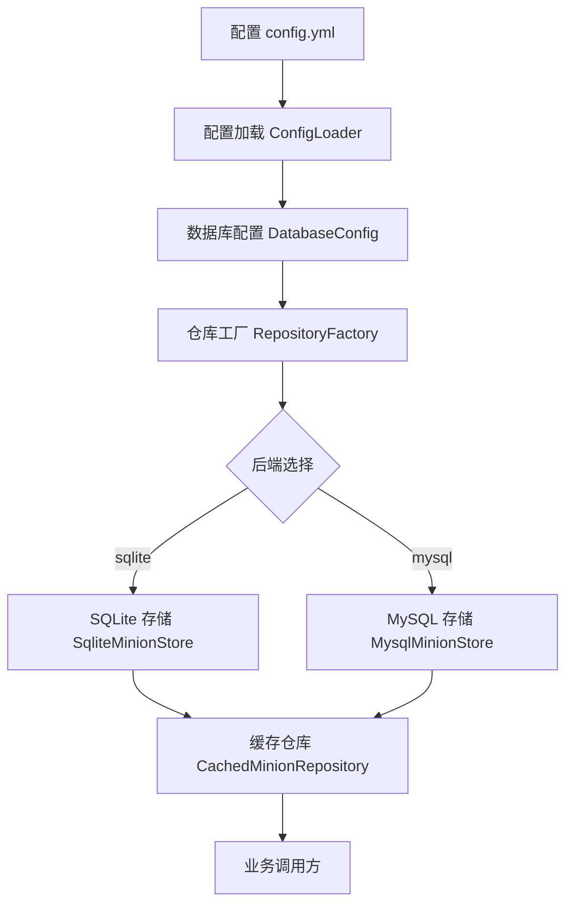
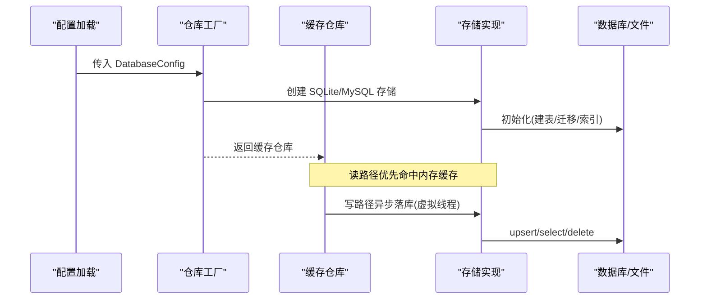
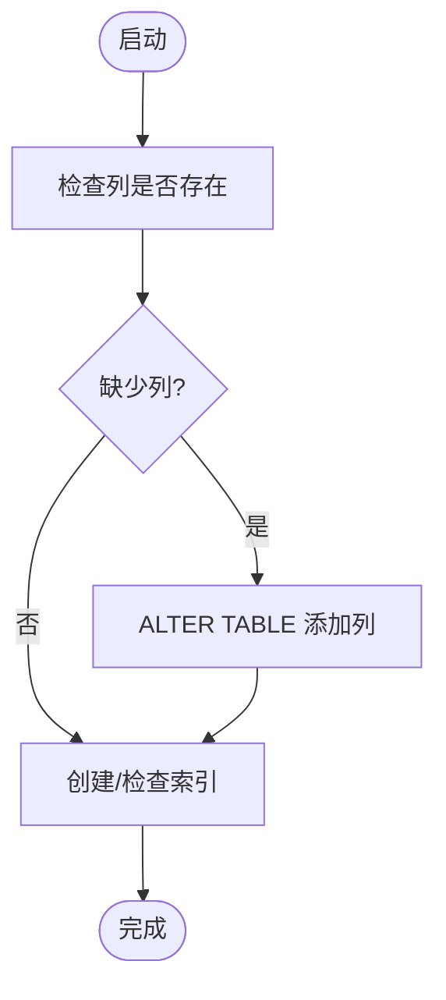
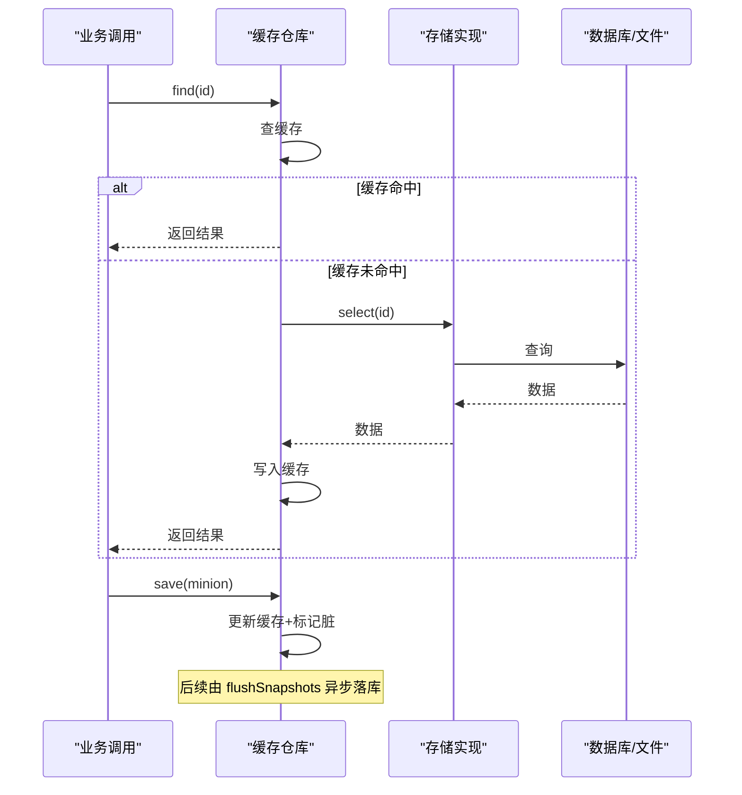
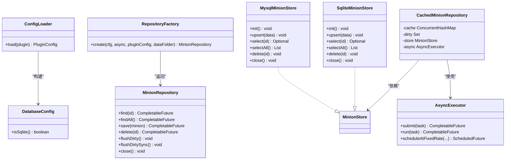

# 数据库配置

<cite>
**本文引用的文件**
- [config.yml](file://src/main/resources/config.yml)
- [DatabaseConfig.java](file://src/main/java/com/hcs/minions/config/DatabaseConfig.java)
- [ConfigLoader.java](file://src/main/java/com/hcs/minions/config/ConfigLoader.java)
- [RepositoryFactory.java](file://src/main/java/com/hcs/minions/repository/RepositoryFactory.java)
- [MinionRepository.java](file://src/main/java/com/hcs/minions/repository/MinionRepository.java)
- [CachedMinionRepository.java](file://src/main/java/com/hcs/minions/repository/CachedMinionRepository.java)
- [SqliteMinionStore.java](file://src/main/java/com/hcs/minions/repository/sqlite/SqliteMinionStore.java)
- [MysqlMinionStore.java](file://src/main/java/com/hcs/minions/repository/mysql/MysqlMinionStore.java)
- [AsyncExecutor.java](file://src/main/java/com/hcs/minions/util/AsyncExecutor.java)
</cite>

## 目录
1. [简介](#简介)
2. [项目结构](#项目结构)
3. [核心组件](#核心组件)
4. [架构总览](#架构总览)
5. [详细组件分析](#详细组件分析)
6. [依赖关系分析](#依赖关系分析)
7. [性能考虑](#性能考虑)
8. [故障排除指南](#故障排除指南)
9. [结论](#结论)
10. [附录](#附录)

## 简介
本指南面向在本项目中部署与调优数据持久层，覆盖 SQLite 与 MySQL 两种后端。内容包括：连接参数、连接池配置、表结构与迁移机制、性能优化建议、备份恢复策略，以及从小型单机到大型多服集群的推荐架构方案。文档严格基于仓库中的实现进行说明，确保可落地、可验证。

## 项目结构
本项目采用“接口 + 具体存储实现”的分层设计：
- 配置层：YAML 配置文件被加载为强类型对象，供数据访问层读取。
- 工厂层：根据配置选择 SQLite 或 MySQL 存储实现，并统一包装为带缓存的仓库。
- 仓储层：对外暴露统一的 MinionRepository 接口，内部负责内存缓存、异步落库与线程安全。
- 存储层：SQLiteMinionStore 与 MysqlMinionStore 分别实现本地文件与远程数据库的读写。

图表来源
- [config.yml:13-21](file://src/main/resources/config.yml#L13-L21)
- [ConfigLoader.java:30-43](file://src/main/java/com/hcs/minions/config/ConfigLoader.java#L30-L43)
- [RepositoryFactory.java:20-29](file://src/main/java/com/hcs/minions/repository/RepositoryFactory.java#L20-L29)
- [SqliteMinionStore.java:22-79](file://src/main/java/com/hcs/minions/repository/sqlite/SqliteMinionStore.java#L22-L79)
- [MysqlMinionStore.java:25-92](file://src/main/java/com/hcs/minions/repository/mysql/MysqlMinionStore.java#L25-L92)
- [CachedMinionRepository.java:29-42](file://src/main/java/com/hcs/minions/repository/CachedMinionRepository.java#L29-L42)

章节来源
- [config.yml:13-21](file://src/main/resources/config.yml#L13-L21)
- [ConfigLoader.java:30-43](file://src/main/java/com/hcs/minions/config/ConfigLoader.java#L30-L43)
- [RepositoryFactory.java:20-29](file://src/main/java/com/hcs/minions/repository/RepositoryFactory.java#L20-L29)

## 核心组件
- 配置模型与加载
  - DatabaseConfig：定义数据库类型、SQLite 文件路径、MySQL 主机/端口/库名/用户/密码、连接池大小等。
  - ConfigLoader：从 YAML 中读取 database.* 并构造 DatabaseConfig；提供默认值与回退逻辑。
- 仓库与存储
  - MinionRepository：对外数据访问接口，包含查找、保存、删除、批量刷新等方法。
  - CachedMinionRepository：在接口之上增加内存缓存、脏标记集合与异步落库，屏蔽 IO 细节。
  - RepositoryFactory：按配置装配具体存储（SQLite/MySQL），并返回缓存仓库实例。
- 存储实现
  - SqliteMinionStore：单连接 + 锁，DDL 建表与幂等迁移，索引优化。
  - MysqlMinionStore：基于 HikariCP 的连接池，DDL 建表与幂等迁移，预编译语句缓存。
- 异步执行器
  - AsyncExecutor：使用虚拟线程执行 IO 任务，避免阻塞主线程；提供周期调度能力。

章节来源
- [DatabaseConfig.java:6-19](file://src/main/java/com/hcs/minions/config/DatabaseConfig.java#L6-L19)
- [ConfigLoader.java:30-43](file://src/main/java/com/hcs/minions/config/ConfigLoader.java#L30-L43)
- [MinionRepository.java:16-46](file://src/main/java/com/hcs/minions/repository/MinionRepository.java#L16-L46)
- [CachedMinionRepository.java:29-42](file://src/main/java/com/hcs/minions/repository/CachedMinionRepository.java#L29-L42)
- [RepositoryFactory.java:20-29](file://src/main/java/com/hcs/minions/repository/RepositoryFactory.java#L20-L29)
- [SqliteMinionStore.java:22-79](file://src/main/java/com/hcs/minions/repository/sqlite/SqliteMinionStore.java#L22-L79)
- [MysqlMinionStore.java:25-92](file://src/main/java/com/hcs/minions/repository/mysql/MysqlMinionStore.java#L25-L92)
- [AsyncExecutor.java:19-32](file://src/main/java/com/hcs/minions/util/AsyncExecutor.java#L19-L32)

## 架构总览
下图展示了从配置到数据落库的完整链路，包括缓存、异步与存储层的协作。

图表来源
- [ConfigLoader.java:30-43](file://src/main/java/com/hcs/minions/config/ConfigLoader.java#L30-L43)
- [RepositoryFactory.java:20-29](file://src/main/java/com/hcs/minions/repository/RepositoryFactory.java#L20-L29)
- [CachedMinionRepository.java:44-80](file://src/main/java/com/hcs/minions/repository/CachedMinionRepository.java#L44-L80)
- [SqliteMinionStore.java:62-79](file://src/main/java/com/hcs/minions/repository/sqlite/SqliteMinionStore.java#L62-L79)
- [MysqlMinionStore.java:64-92](file://src/main/java/com/hcs/minions/repository/mysql/MysqlMinionStore.java#L64-L92)

## 详细组件分析

### 配置与连接参数
- YAML 配置项（database.*）
  - type：sqlite | mysql
  - sqlite-file：SQLite 文件名（位于插件数据目录）
  - host/port/database/user/password：MySQL 连接信息
  - pool-size：HikariCP 最大连接数（最小为 2）
- 配置加载
  - 通过 ConfigLoader 将 YAML 映射为 DatabaseConfig，缺失字段使用默认值。
- 运行时选择
  - RepositoryFactory 依据 DatabaseConfig.type 决定使用 SQLite 或 MySQL 存储。

章节来源
- [config.yml:13-21](file://src/main/resources/config.yml#L13-L21)
- [DatabaseConfig.java:6-19](file://src/main/java/com/hcs/minions/config/DatabaseConfig.java#L6-L19)
- [ConfigLoader.java:30-43](file://src/main/java/com/hcs/minions/config/ConfigLoader.java#L30-L43)
- [RepositoryFactory.java:20-29](file://src/main/java/com/hcs/minions/repository/RepositoryFactory.java#L20-L29)

### SQLite 快速配置
- 适用场景：小型单机、测试环境、低并发服务。
- 关键特性：
  - 单连接 + 互斥锁，写入串行化，适合低并发。
  - 自动创建数据库文件与父目录。
  - 启动时执行 DDL 与幂等迁移，自动创建 owner 索引。
- 配置要点：
  - 设置 type=sqlite，指定 sqlite-file。
  - 无需额外连接池配置。

章节来源
- [config.yml:13-21](file://src/main/resources/config.yml#L13-L21)
- [SqliteMinionStore.java:22-79](file://src/main/java/com/hcs/minions/repository/sqlite/SqliteMinionStore.java#L22-L79)
- [SqliteMinionStore.java:81-109](file://src/main/java/com/hcs/minions/repository/sqlite/SqliteMinionStore.java#L81-L109)

### MySQL 企业级配置
- 适用场景：多服共享、高并发、需要集中管理与备份恢复。
- 关键特性：
  - 基于 HikariCP 的连接池，支持预编译语句缓存。
  - 连接超时收紧，避免请求堆积。
  - 启动时执行 DDL 与幂等迁移，按需创建索引。
- 配置要点：
  - 设置 type=mysql，填写 host/port/database/user/password。
  - pool-size 建议结合并发量调整（最小为 2）。

章节来源
- [config.yml:13-21](file://src/main/resources/config.yml#L13-L21)
- [MysqlMinionStore.java:25-92](file://src/main/java/com/hcs/minions/repository/mysql/MysqlMinionStore.java#L25-L92)
- [MysqlMinionStore.java:94-130](file://src/main/java/com/hcs/minions/repository/mysql/MysqlMinionStore.java#L94-L130)

### 表结构与数据迁移
- 表名：minions
- 字段概览（关键字段）
  - id：主键（UUID 字符串）
  - owner：玩家 UUID（用于按主人查询/统计）
  - type/level/xp/world/x/y/z/fuel_ticks/last_active/island_id/upgrade1/upgrade2/skin/inventory
- 索引
  - 针对 owner 建立索引，提升按主人查询与统计性能。
- 迁移机制
  - 启动时检查 upgrade1/upgrade2/skin 列是否存在，不存在则添加。
  - SQLite 与 MySQL 均实现幂等迁移，保证多次启动安全。

图表来源
- [SqliteMinionStore.java:24-52](file://src/main/java/com/hcs/minions/repository/sqlite/SqliteMinionStore.java#L24-L52)
- [SqliteMinionStore.java:81-109](file://src/main/java/com/hcs/minions/repository/sqlite/SqliteMinionStore.java#L81-L109)
- [MysqlMinionStore.java:27-55](file://src/main/java/com/hcs/minions/repository/mysql/MysqlMinionStore.java#L27-L55)
- [MysqlMinionStore.java:94-130](file://src/main/java/com/hcs/minions/repository/mysql/MysqlMinionStore.java#L94-L130)

章节来源
- [SqliteMinionStore.java:24-52](file://src/main/java/com/hcs/minions/repository/sqlite/SqliteMinionStore.java#L24-L52)
- [SqliteMinionStore.java:81-109](file://src/main/java/com/hcs/minions/repository/sqlite/SqliteMinionStore.java#L81-L109)
- [MysqlMinionStore.java:27-55](file://src/main/java/com/hcs/minions/repository/mysql/MysqlMinionStore.java#L27-L55)
- [MysqlMinionStore.java:94-130](file://src/main/java/com/hcs/minions/repository/mysql/MysqlMinionStore.java#L94-L130)

### 读写流程与缓存策略
- 读路径
  - 优先从内存缓存获取；未命中则异步回源查询并回填缓存。
- 写路径
  - 先更新内存缓存并标记脏数据；由调度器或关闭阶段批量异步落库。
- 线程安全
  - SQLite 使用单连接 + 锁；MySQL 使用连接池 + 预编译缓存。
  - 所有阻塞 SQL 经由虚拟线程执行，避免阻塞主线程。

图表来源
- [CachedMinionRepository.java:44-80](file://src/main/java/com/hcs/minions/repository/CachedMinionRepository.java#L44-L80)
- [CachedMinionRepository.java:134-153](file://src/main/java/com/hcs/minions/repository/CachedMinionRepository.java#L134-L153)
- [SqliteMinionStore.java:111-136](file://src/main/java/com/hcs/minions/repository/sqlite/SqliteMinionStore.java#L111-L136)
- [MysqlMinionStore.java:143-165](file://src/main/java/com/hcs/minions/repository/mysql/MysqlMinionStore.java#L143-L165)

章节来源
- [CachedMinionRepository.java:44-80](file://src/main/java/com/hcs/minions/repository/CachedMinionRepository.java#L44-L80)
- [CachedMinionRepository.java:134-153](file://src/main/java/com/hcs/minions/repository/CachedMinionRepository.java#L134-L153)

### 连接池与性能调优（MySQL）
- 连接池参数
  - maximumPoolSize：最大连接数，受 pool-size 控制且最小为 2。
  - minimumIdle：空闲连接数为 0，按需创建，减少资源占用。
  - connectionTimeout：连接超时收紧，避免请求堆积。
  - 预编译语句缓存：开启并设置缓存大小，降低解析开销。
- 虚拟线程隔离
  - 所有阻塞 JDBC 调用在虚拟线程中执行，避免固定线程池导致的载体线程阻塞。
- 索引优化
  - 对 owner 字段建立索引，提升按主人查询与统计效率。

章节来源
- [MysqlMinionStore.java:64-92](file://src/main/java/com/hcs/minions/repository/mysql/MysqlMinionStore.java#L64-L92)
- [MysqlMinionStore.java:94-130](file://src/main/java/com/hcs/minions/repository/mysql/MysqlMinionStore.java#L94-L130)
- [AsyncExecutor.java:19-32](file://src/main/java/com/hcs/minions/util/AsyncExecutor.java#L19-L32)

### 不同规模服务器的推荐配置
- 小型单机（单人/小服）
  - 后端：SQLite
  - 配置：type=sqlite，sqlite-file=插件数据目录下文件
  - 特点：零运维、低延迟、无网络开销
- 中型多服（共享库）
  - 后端：MySQL
  - 连接池：pool-size=4~8（根据并发与 QPS 调整）
  - 索引：已内置 owner 索引
- 大型集群（高并发/多节点）
  - 后端：MySQL（独立数据库服务器）
  - 连接池：pool-size=8~16（结合 CPU 核数与连接上限）
  - 网络：确保低延迟与稳定连接，必要时启用 SSL（当前实现默认关闭 SSL 以兼容）

[本节为概念性建议，不直接分析具体文件]

## 依赖关系分析
- 配置到实现的装配
  - ConfigLoader 读取 YAML 生成 DatabaseConfig。
  - RepositoryFactory 根据 type 选择 SqliteMinionStore 或 MysqlMinionStore。
  - 两者均实现 MinionStore 接口，被 CachedMinionRepository 统一封装。
- 异步与线程边界
  - AsyncExecutor 提供虚拟线程执行器，所有 IO 操作在此执行，主线程保持响应。

图表来源
- [DatabaseConfig.java:6-19](file://src/main/java/com/hcs/minions/config/DatabaseConfig.java#L6-L19)
- [ConfigLoader.java:30-43](file://src/main/java/com/hcs/minions/config/ConfigLoader.java#L30-L43)
- [RepositoryFactory.java:20-29](file://src/main/java/com/hcs/minions/repository/RepositoryFactory.java#L20-L29)
- [MinionRepository.java:16-46](file://src/main/java/com/hcs/minions/repository/MinionRepository.java#L16-L46)
- [CachedMinionRepository.java:29-42](file://src/main/java/com/hcs/minions/repository/CachedMinionRepository.java#L29-L42)
- [SqliteMinionStore.java:22-79](file://src/main/java/com/hcs/minions/repository/sqlite/SqliteMinionStore.java#L22-L79)
- [MysqlMinionStore.java:25-92](file://src/main/java/com/hcs/minions/repository/mysql/MysqlMinionStore.java#L25-L92)
- [AsyncExecutor.java:19-32](file://src/main/java/com/hcs/minions/util/AsyncExecutor.java#L19-L32)

章节来源
- [RepositoryFactory.java:20-29](file://src/main/java/com/hcs/minions/repository/RepositoryFactory.java#L20-L29)
- [CachedMinionRepository.java:29-42](file://src/main/java/com/hcs/minions/repository/CachedMinionRepository.java#L29-L42)

## 性能考虑
- 读路径优化
  - 高频读取优先命中内存缓存，减少数据库压力。
- 写路径优化
  - 批量异步落库，减少频繁 IO；失败时重新置脏等待重试。
- 连接池优化（MySQL）
  - 合理设置 pool-size，避免过大导致连接耗尽或过小造成瓶颈。
  - 开启预编译语句缓存，降低 SQL 解析成本。
- 索引优化
  - 已为 owner 建立索引，提升按主人查询与统计性能。
- 线程模型
  - 虚拟线程隔离 IO，避免阻塞主线程；调度器单线程执行周期任务，避免过多定时器。

章节来源
- [CachedMinionRepository.java:44-80](file://src/main/java/com/hcs/minions/repository/CachedMinionRepository.java#L44-L80)
- [CachedMinionRepository.java:134-153](file://src/main/java/com/hcs/minions/repository/CachedMinionRepository.java#L134-L153)
- [MysqlMinionStore.java:64-92](file://src/main/java/com/hcs/minions/repository/mysql/MysqlMinionStore.java#L64-L92)
- [SqliteMinionStore.java:81-109](file://src/main/java/com/hcs/minions/repository/sqlite/SqliteMinionStore.java#L81-L109)
- [AsyncExecutor.java:58-67](file://src/main/java/com/hcs/minions/util/AsyncExecutor.java#L58-L67)

## 故障排除指南
- 常见错误与定位
  - SQLite 初始化失败：检查驱动加载、文件路径与权限。
  - MySQL 驱动未找到：确认依赖中包含 MySQL JDBC 驱动。
  - 连接超时：检查网络连通性与数据库服务状态。
  - 落库失败：查看日志中的异常堆栈，关注重试与脏标记处理。
- 排查步骤
  - 确认 config.yml 中 database.* 配置正确。
  - 检查插件数据目录是否可写（SQLite）。
  - 验证数据库账号权限与字符集设置（MySQL）。
  - 观察日志输出，定位具体失败点。

章节来源
- [SqliteMinionStore.java:62-79](file://src/main/java/com/hcs/minions/repository/sqlite/SqliteMinionStore.java#L62-L79)
- [MysqlMinionStore.java:64-92](file://src/main/java/com/hcs/minions/repository/mysql/MysqlMinionStore.java#L64-L92)
- [CachedMinionRepository.java:134-153](file://src/main/java/com/hcs/minions/repository/CachedMinionRepository.java#L134-L153)

## 结论
本项目通过清晰的配置模型、工厂装配与缓存仓库，实现了 SQLite 与 MySQL 的统一抽象与高效持久化。SQLite 适合快速上手与单机场景；MySQL 适合多服共享与企业级部署。配合合理的连接池、索引与异步落库策略，可在不同规模下获得稳定性能。建议在上线前进行压测与备份演练，确保数据一致性与可恢复性。

## 附录

### 备份与恢复策略
- SQLite
  - 停止服务后复制数据库文件进行备份；恢复时替换文件并重启服务。
- MySQL
  - 使用数据库工具导出/导入备份；确保字符集与权限一致。
- 一致性保障
  - 服务关闭前会同步冲刷脏数据，降低数据丢失风险。

章节来源
- [CachedMinionRepository.java:183-206](file://src/main/java/com/hcs/minions/repository/CachedMinionRepository.java#L183-L206)