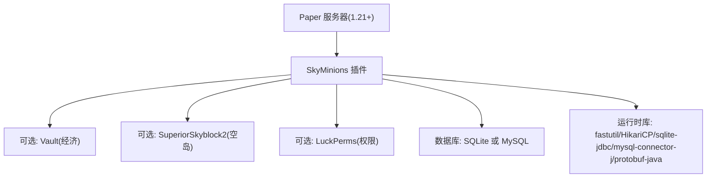

# 环境要求与依赖

<cite>
**本文引用的文件**
- [pom.xml](file://pom.xml)
- [paper-plugin.yml](file://src/main/resources/paper-plugin.yml)
- [config.yml](file://src/main/resources/config.yml)
- [README.md](file://README.md)
- [EconomyService.java](file://src/main/java/com/hcs/minions/service/EconomyService.java)
- [PermissionService.java](file://src/main/java/com/hcs/minions/service/PermissionService.java)
- [SkyblockHook.java](file://src/main/java/com/hcs/minions/service/hook/SkyblockHook.java)
- [MysqlMinionStore.java](file://src/main/java/com/hcs/minions/repository/mysql/MysqlMinionStore.java)
</cite>

## 目录
1. [简介](#简介)
2. [项目结构与环境概览](#项目结构与环境概览)
3. [核心运行环境要求](#核心运行环境要求)
4. [可选依赖与集成说明](#可选依赖与集成说明)
5. [数据库与存储后端](#数据库与存储后端)
6. [构建与打包要求](#构建与打包要求)
7. [环境检查与验证方法](#环境检查与验证方法)
8. [常见问题与排错](#常见问题与排错)
9. [结论](#结论)

## 简介
本文面向服务器管理员与插件开发者，详细说明 SkyMinions 仆从系统插件的运行时环境要求、核心与可选依赖、版本兼容性、安装配置步骤以及环境检查与验证方法。内容基于仓库中的构建配置、插件清单与源码实现整理而成，力求清晰易懂，适合不同技术水平的读者参考。

## 项目结构与环境概览
SkyMinions 是一个基于 Paper API 的 Minecraft 服务端插件，采用“瘦 jar”策略：编译期依赖通过 provided 声明，运行时依赖由 Paper 在加载插件时自动从 Maven Central 下载并挂载到类加载器。插件清单中声明了可选软依赖（Vault、SuperiorSkyblock2），并通过权限系统与 LuckPerms 联动。

图表来源
- [paper-plugin.yml:1-22](file://src/main/resources/paper-plugin.yml#L1-L22)
- [pom.xml:40-103](file://pom.xml#L40-L103)

章节来源
- [README.md:1-8](file://README.md#L1-L8)
- [paper-plugin.yml:1-22](file://src/main/resources/paper-plugin.yml#L1-L22)
- [pom.xml:15-23](file://pom.xml#L15-L23)

## 核心运行环境要求
- Java 运行时：JDK 21+（插件以 Java 21 编译）
- 服务器平台：Paper 1.21+（插件清单 api-version 为 1.21；代码与 1.21+ API 兼容）
- 网络访问：首次加载插件时需要访问 Maven Central 以自动下载运行时依赖（fastutil、HikariCP、sqlite-jdbc、mysql-connector-j、protobuf-java）

说明
- 构建目标版本由 Maven 编译器 release 设置为 21，因此需要 JDK 21+ 进行构建与运行。
- Paper 作为服务端提供 Paper API 与运行时依赖管理，插件无需将运行时库打包进 jar。

章节来源
- [pom.xml:15-23](file://pom.xml#L15-L23)
- [pom.xml:116-123](file://pom.xml#L116-L123)
- [paper-plugin.yml:1-5](file://src/main/resources/paper-plugin.yml#L1-L5)
- [README.md:67-76](file://README.md#L67-L76)

## 可选依赖与集成说明
- Vault（经济系统）
  - 作用：提供经济功能（如自动售卖、价格计算等）。
  - 兼容性：插件使用 VaultAPI 1.7，通过 Bukkit ServicesManager 获取 Economy 实现；若未启用或未找到实现，则关闭经济功能。
  - 安装：在服务端安装 Vault 插件并确保其已启用。
  - 行为：当 Vault 未启用或未找到 Economy 实现时，插件会记录警告并禁用相关能力。

- SuperiorSkyblock2（空岛服务器支持）
  - 作用：限制仆从放置与工作范围在本岛内，提升空岛玩法一致性。
  - 兼容性：插件检测 SuperiorSkyblock2 是否启用；若未检测到，则关闭空岛限制逻辑。
  - 安装：在服务端安装 SuperiorSkyblock2 插件并确保其已启用。
  - 行为：无法确定岛屿信息时不限制工作；重启后按需懒重缓存。

- LuckPerms（权限管理）
  - 作用：接管 Bukkit 权限，用于控制命令、使用类型与数量上限等。
  - 兼容性：无需硬依赖；LuckPerms 将自己注册为 Bukkit 权限提供方，插件通过 Player.hasPermission 直接判断。
  - 安装：在服务端安装 LuckPerms 并按需授予权限（例如 hcs.minions.admin、hcs.minions.type.*、hcs.minions.limit.<n>）。
  - 行为：权限解析一次性遍历生效权限集合，避免多次 hasPermission 调用。

章节来源
- [paper-plugin.yml:8-13](file://src/main/resources/paper-plugin.yml#L8-L13)
- [EconomyService.java:17-49](file://src/main/java/com/hcs/minions/service/EconomyService.java#L17-L49)
- [EconomyService.java:51-88](file://src/main/java/com/hcs/minions/service/EconomyService.java#L51-L88)
- [SkyblockHook.java:12-36](file://src/main/java/com/hcs/minions/service/hook/SkyblockHook.java#L12-L36)
- [PermissionService.java:8-18](file://src/main/java/com/hcs/minions/service/PermissionService.java#L8-L18)
- [PermissionService.java:33-73](file://src/main/java/com/hcs/minions/service/PermissionService.java#L33-L73)

## 数据库与存储后端
- 存储类型：SQLite 或 MySQL（通过配置文件选择）
- 连接池：HikariCP（默认池大小较小，避免虚拟线程被固定）
- 驱动与库：
  - SQLite：sqlite-jdbc（运行时由 Paper 自动下载）
  - MySQL：mysql-connector-j（运行时由 Paper 自动下载）
- 配置项：
  - database.type：sqlite | mysql
  - sqlite-file：SQLite 文件名
  - host/port/database/user/password：MySQL 连接参数
  - pool-size：连接池大小（建议保持小值）

说明
- 使用 MySQL 时，插件显式加载 JDBC 驱动类以确保 DriverManager 识别；初始化失败时会抛出异常并记录错误日志。
- 连接超时与预编译语句缓存等参数已在实现中设置，以提升稳定性与性能。

章节来源
- [config.yml:13-22](file://src/main/resources/config.yml#L13-L22)
- [MysqlMinionStore.java:19-24](file://src/main/java/com/hcs/minions/repository/mysql/MysqlMinionStore.java#L19-L24)
- [MysqlMinionStore.java:64-92](file://src/main/java/com/hcs/minions/repository/mysql/MysqlMinionStore.java#L64-L92)

## 构建与打包要求
- 构建工具：Maven
- Java 版本：JDK 21+
- 构建命令：mvn clean package
- 产物：target/SkyMinions-版本号.jar（瘦 jar，约 100 KB）

说明
- 所有运行时依赖在 paper-plugin.yml 的 libraries 中声明，首次加载时由 Paper 自动下载并挂载到插件类加载器，因此 jar 不包含这些库。
- 构建时使用 maven-compiler-plugin 的 release 21，确保与目标运行环境一致。

章节来源
- [README.md:67-76](file://README.md#L67-L76)
- [pom.xml:113-130](file://pom.xml#L113-L130)
- [paper-plugin.yml:15-22](file://src/main/resources/paper-plugin.yml#L15-L22)

## 环境检查与验证方法
以下方法帮助确认服务器环境是否满足插件运行要求：

- 检查 Java 版本
  - 执行 java -version，确认输出包含 21 或更高版本。
  - 依据：插件以 Java 21 编译，需要对应运行时。

- 检查 Paper 版本
  - 查看服务端启动日志或运行 /version 命令，确认 Paper 版本为 1.21+。
  - 依据：插件清单 api-version 为 1.21，且代码与 1.21+ API 兼容。

- 检查网络与 Maven Central 可达性
  - 首次加载插件时应能访问 Maven Central 以自动下载运行时依赖（fastutil、HikariCP、sqlite-jdbc、mysql-connector-j、protobuf-java）。
  - 若网络受限，请配置代理或镜像源。

- 检查可选依赖是否启用
  - Vault：确认插件已安装并启用；若未启用，插件会记录警告并关闭经济功能。
  - SuperiorSkyblock2：确认插件已安装并启用；若未启用，空岛限制逻辑关闭。
  - LuckPerms：确认插件已安装并启用；权限将通过 Bukkit 权限系统生效。

- 检查数据库连通性
  - SQLite：确认 sqlite-file 路径可写。
  - MySQL：确认 host/port/database/user/password 正确，并能建立连接；连接池大小合理（默认较小）。

- 检查权限配置
  - 在 LuckPerms 中授予必要权限（如 hcs.minions.admin、hcs.minions.type.*、hcs.minions.limit.<n>）。
  - 使用 /minion 命令测试权限是否生效。

章节来源
- [pom.xml:15-23](file://pom.xml#L15-L23)
- [paper-plugin.yml:1-5](file://src/main/resources/paper-plugin.yml#L1-L5)
- [paper-plugin.yml:15-22](file://src/main/resources/paper-plugin.yml#L15-L22)
- [EconomyService.java:38-49](file://src/main/java/com/hcs/minions/service/EconomyService.java#L38-L49)
- [SkyblockHook.java:24-36](file://src/main/java/com/hcs/minions/service/hook/SkyblockHook.java#L24-L36)
- [PermissionService.java:33-73](file://src/main/java/com/hcs/minions/service/PermissionService.java#L33-L73)
- [MysqlMinionStore.java:64-92](file://src/main/java/com/hcs/minions/repository/mysql/MysqlMinionStore.java#L64-L92)

## 常见问题与排错
- 启动时报找不到运行时依赖
  - 原因：网络不可达或 Maven Central 被阻断。
  - 处理：检查网络与代理设置；确保首次加载时可下载依赖。

- 经济功能无效
  - 原因：Vault 未启用或未找到 Economy 实现。
  - 处理：安装并启用 Vault；确认 Economy 实现可用；查看插件日志中的警告信息。

- 空岛限制未生效
  - 原因：未安装或未启用 SuperiorSkyblock2。
  - 处理：安装并启用 SuperiorSkyblock2；或在非空岛环境下接受放宽行为。

- 权限不生效
  - 原因：未在 LuckPerms 中授予相应权限。
  - 处理：在 LP 中授予 hcs.minions.admin、hcs.minions.type.*、hcs.minions.limit.<n> 等权限；使用 /minion 命令验证。

- 数据库连接失败
  - 原因：MySQL 配置错误或网络不通；SQLite 文件不可写。
  - 处理：核对数据库配置；检查连接池大小与超时；确保文件路径可写。

章节来源
- [EconomyService.java:38-49](file://src/main/java/com/hcs/minions/service/EconomyService.java#L38-L49)
- [SkyblockHook.java:24-36](file://src/main/java/com/hcs/minions/service/hook/SkyblockHook.java#L24-L36)
- [PermissionService.java:33-73](file://src/main/java/com/hcs/minions/service/PermissionService.java#L33-L73)
- [MysqlMinionStore.java:64-92](file://src/main/java/com/hcs/minions/repository/mysql/MysqlMinionStore.java#L64-L92)

## 结论
SkyMinions 插件要求 JDK 21+ 与 Paper 1.21+ 服务器，采用瘦 jar 与运行时依赖自动下载机制，简化部署。可选依赖（Vault、SuperiorSkyblock2、LuckPerms）均通过软依赖方式集成，缺失时插件仍能运行但相应功能关闭。数据库支持 SQLite 与 MySQL，建议使用较小的连接池以避免性能问题。通过本文的环境检查与验证方法，可以快速确认服务器环境是否满足插件运行要求，并在出现问题时定位与解决。