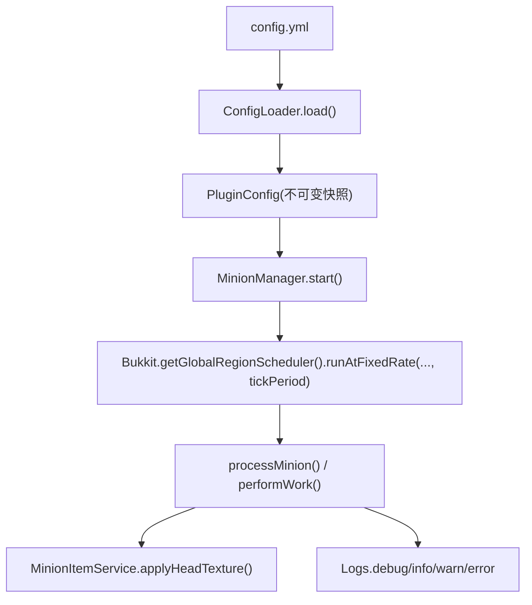
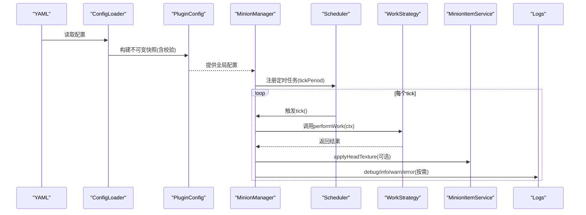
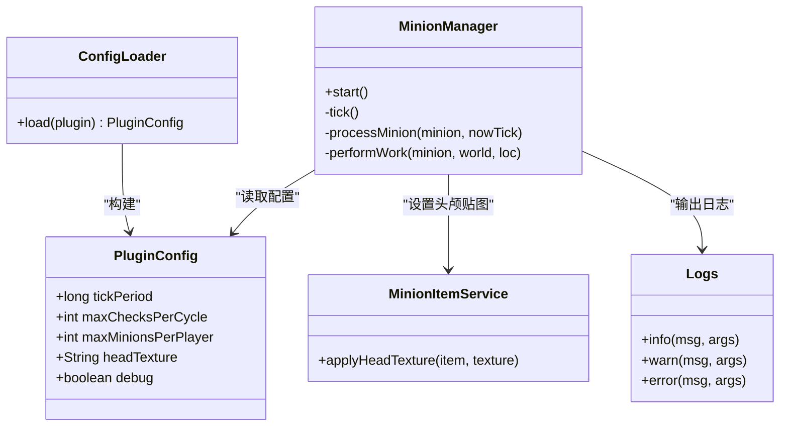

# 全局配置选项

<cite>
**本文引用的文件**
- [config.yml](file://src/main/resources/config.yml)
- [PluginConfig.java](file://src/main/java/com/hcs/minions/config/PluginConfig.java)
- [ConfigLoader.java](file://src/main/java/com/hcs/minions/config/ConfigLoader.java)
- [MinionManager.java](file://src/main/java/com/hcs/minions/service/MinionManager.java)
- [MinionItemService.java](file://src/main/java/com/hcs/minions/service/MinionItemService.java)
- [Logs.java](file://src/main/java/com/hcs/minions/util/Logs.java)
</cite>

## 目录
1. [简介](#简介)
2. [项目结构](#项目结构)
3. [核心组件](#核心组件)
4. [架构总览](#架构总览)
5. [详细组件分析](#详细组件分析)
6. [依赖关系分析](#依赖关系分析)
7. [性能考量](#性能考量)
8. [故障排查指南](#故障排查指南)
9. [结论](#结论)
10. [附录](#附录)

## 简介
本文件聚焦于仆从插件的全局配置选项，系统性说明 tick-period（调度周期）、max-checks-per-cycle（单次检查上限）、max-minions-per-player（每玩家仆从数量限制）、head-texture（仆从头颅贴图）、debug（调试日志）等关键参数的作用机制、默认值、性能影响与调优建议，并给出不同服务器规模下的推荐配置示例，解释参数间的相互影响关系。同时补充配置验证规则与错误处理机制，帮助运维人员安全、稳定地调优服务。

## 项目结构
全局配置由 YAML 配置文件定义，启动时由配置加载器解析为强类型不可变对象，供全插件只读共享。调度器以固定速率运行，依据 tick-period 控制工作节拍；每次调度中，策略执行受 max-checks-per-cycle 限制；放置仆从时受 max-minions-per-player 限制；头颅贴图通过 head-texture 覆盖；debug 开关控制调试日志输出。

图表来源
- [ConfigLoader.java:30-83](file://src/main/java/com/hcs/minions/config/ConfigLoader.java#L30-L83)
- [MinionManager.java:92-114](file://src/main/java/com/hcs/minions/service/MinionManager.java#L92-L114)
- [MinionItemService.java:71-87](file://src/main/java/com/hcs/minions/service/MinionItemService.java#L71-L87)
- [Logs.java:20-31](file://src/main/java/com/hcs/minions/util/Logs.java#L20-L31)

章节来源
- [config.yml:1-11](file://src/main/resources/config.yml#L1-L11)
- [ConfigLoader.java:30-83](file://src/main/java/com/hcs/minions/config/ConfigLoader.java#L30-L83)
- [MinionManager.java:92-114](file://src/main/java/com/hcs/minions/service/MinionManager.java#L92-L114)

## 核心组件
- 配置根对象：记录所有全局参数，构造时进行校验，确保运行时一致性。
- 配置加载器：唯一允许读取 getConfig() 的位置，负责将 YAML 反序列化为强类型对象，缺失或非法值回退到默认值并告警。
- 调度器：基于 Bukkit 的 GlobalRegionScheduler 按 tick-period 周期性触发，遍历在线区域中的仆从并委派到对应 region 线程执行工作逻辑。
- 头颅贴图服务：根据 head-texture 设置头颅物品皮肤，支持离线模式 base64 纹理。
- 日志系统：统一 SLF4J 出口，debug 开关控制调试信息输出频率与内容。

章节来源
- [PluginConfig.java:22-46](file://src/main/java/com/hcs/minions/config/PluginConfig.java#L22-L46)
- [ConfigLoader.java:30-83](file://src/main/java/com/hcs/minions/config/ConfigLoader.java#L30-L83)
- [MinionManager.java:92-114](file://src/main/java/com/hcs/minions/service/MinionManager.java#L92-L114)
- [MinionItemService.java:71-87](file://src/main/java/com/hcs/minions/service/MinionItemService.java#L71-L87)
- [Logs.java:20-31](file://src/main/java/com/hcs/minions/util/Logs.java#L20-L31)

## 架构总览
全局配置在启动阶段被一次性加载并固化，后续所有模块通过只读接口获取。调度器以固定周期驱动工作流，策略执行受单次检查上限约束，避免单 tick 内过多方块操作导致卡顿。每玩家仆从数限制在放置时校验，防止资源滥用。头颅贴图可自定义，便于主题化。调试日志可按需开启，降低生产环境开销。

图表来源
- [ConfigLoader.java:30-83](file://src/main/java/com/hcs/minions/config/ConfigLoader.java#L30-L83)
- [MinionManager.java:92-114](file://src/main/java/com/hcs/minions/service/MinionManager.java#L92-L114)
- [MinionItemService.java:71-87](file://src/main/java/com/hcs/minions/service/MinionItemService.java#L71-L87)
- [Logs.java:20-31](file://src/main/java/com/hcs/minions/util/Logs.java#L20-L31)

## 详细组件分析

### 调度周期：tick-period
- 作用机制：控制全局调度器的固定间隔（单位：tick）。调度器在每个周期遍历所有仆从，并在其所在 region 线程上执行工作逻辑。燃料衰减也按此周期扣减。
- 默认值：20 tick（即每秒一次）。
- 性能影响：
  - 较小周期（如 10）会增加 CPU 占用和区块/实体访问频率，可能在高负载下造成卡顿。
  - 较大周期（如 40）会降低响应速度，但能减少主线程压力，适合高并发或大型服。
- 调优建议：
  - 小型服（<50 在线）：保持默认或略降（15-20），提升响应性。
  - 中型服（50-200 在线）：默认或略增（20-30），平衡性能与时效。
  - 大型服（>200 在线）：适当增大（30-40），减轻调度压力。
- 关联影响：与燃料衰减节奏一致；与自动售卖轮询间隔独立，但整体吞吐会受 tick 频率影响。

章节来源
- [config.yml:5](file://src/main/resources/config.yml#L5)
- [ConfigLoader.java:73-83](file://src/main/java/com/hcs/minions/config/ConfigLoader.java#L73-L83)
- [MinionManager.java:92-114](file://src/main/java/com/hcs/minions/service/MinionManager.java#L92-L114)
- [MinionManager.java:237-244](file://src/main/java/com/hcs/minions/service/MinionManager.java#L237-L244)

### 单次检查上限：max-checks-per-cycle
- 作用机制：限制单次策略执行的方块检查硬上限，防止单 tick 内过多方块操作导致卡顿。加载器会在配置阶段对超限值进行强制回落并告警。
- 默认值：48。
- 验证规则：
  - 加载器层面：若配置值 >= 50，则强制回落至 48 并记录警告日志。
  - 构造器层面：若传入值仍 >= 50，抛出非法参数异常，阻止无效配置生效。
- 性能影响：
  - 过高会导致单 tick 内大量方块查询/修改，增加主线程负担，引发 TPS 下降。
  - 过低会降低工作效率，尤其在大规模仆从场景下产出变慢。
- 调优建议：
  - 一般场景：保持默认 48。
  - 高性能服务器：可维持默认或略增但不超过硬上限。
  - 低性能服务器：可适当降低，优先保障稳定性。
- 关联影响：与 tick-period 共同决定总体吞吐；与策略实现（如搜索半径、目标集合大小）配合使用。

章节来源
- [config.yml:6](file://src/main/resources/config.yml#L6)
- [ConfigLoader.java:63-67](file://src/main/java/com/hcs/minions/config/ConfigLoader.java#L63-L67)
- [PluginConfig.java:36-41](file://src/main/java/com/hcs/minions/config/PluginConfig.java#L36-L41)

### 每玩家仆从数量限制：max-minions-per-player
- 作用机制：限制每个玩家可放置的仆从槽位上限。实际可用槽位 = 权限上限 + Collection 里程碑加成。放置时进行计数校验，超出则拒绝放置。
- 默认值：10（加载器默认）。
- 性能影响：
  - 较高上限会增加内存占用、调度遍历成本与实体渲染压力。
  - 较低上限可保护服务器资源，但可能影响玩家体验。
- 调优建议：
  - 小型服：默认或略高（10-15），鼓励玩法。
  - 中型服：默认（10），平衡体验与性能。
  - 大型服：适度降低（5-10），结合权限与里程碑控制。
- 关联影响：与 Collection 里程碑叠加；与自动售卖、存储容量、掉落处理链路相关。

章节来源
- [config.yml:7](file://src/main/resources/config.yml#L7)
- [ConfigLoader.java:73-83](file://src/main/java/com/hcs/minions/config/ConfigLoader.java#L73-L83)
- [MinionManager.java:356-373](file://src/main/java/com/hcs/minions/service/MinionManager.java#L356-L373)

### 仆从头颅贴图：head-texture
- 作用机制：为仆从头颅物品设置皮肤纹理（base64），支持离线模式。未配置或为空时使用内置默认贴图。
- 默认值：内置默认 base64 纹理。
- 性能影响：
  - 贴图本身不直接影响性能，但频繁创建 PlayerProfile 与 URL 解析会带来少量开销。
  - 建议使用稳定的 base64 纹理，避免动态生成或网络请求。
- 调优建议：
  - 主题化服务器：替换为自定义 base64 纹理，保持一致视觉风格。
  - 生产环境：锁定稳定纹理，避免频繁变更。
- 关联影响：与服务端版本兼容性（SkullMeta 与 Profile API）；与头颅物品生成流程联动。

章节来源
- [config.yml:8-9](file://src/main/resources/config.yml#L8-L9)
- [ConfigLoader.java:22-25](file://src/main/java/com/hcs/minions/config/ConfigLoader.java#L22-L25)
- [MinionItemService.java:71-87](file://src/main/java/com/hcs/minions/service/MinionItemService.java#L71-L87)

### 调试日志：debug
- 作用机制：控制调试日志输出，包括“未找到目标”、“稀有掉落”、“工作成功掉落种类”等关键路径信息。日志输出有节流（同一仆从 5 秒内重复信息仅输出一次）。
- 默认值：false。
- 性能影响：
  - 开启后会产生额外 I/O 与字符串拼接开销，在高并发下可能影响 TPS。
  - 建议仅在问题定位或开发阶段开启。
- 调优建议：
  - 生产环境：关闭，除非需要短期诊断。
  - 测试/开发环境：开启，便于追踪行为。
- 关联影响：与日志级别、服务器日志框架配置协同；与具体策略执行情况联动。

章节来源
- [config.yml:10-11](file://src/main/resources/config.yml#L10-L11)
- [MinionManager.java:270-304](file://src/main/java/com/hcs/minions/service/MinionManager.java#L270-L304)
- [Logs.java:20-31](file://src/main/java/com/hcs/minions/util/Logs.java#L20-L31)

## 依赖关系分析
- ConfigLoader 负责读取 YAML 并构建 PluginConfig，包含 tick-period、max-checks-per-cycle、max-minions-per-player、head-texture、debug 等字段。
- MinionManager 在启动时注册全局调度任务，使用 tick-period 作为固定间隔；在工作流程中应用 max-checks-per-cycle 的限制（由策略层与加载器共同保证）；在放置时应用 max-minions-per-player 限制；在头颅物品生成时应用 head-texture；在关键路径输出 debug 日志。
- Logs 提供统一日志出口，debug 开关控制是否输出调试信息。

图表来源
- [ConfigLoader.java:30-83](file://src/main/java/com/hcs/minions/config/ConfigLoader.java#L30-L83)
- [PluginConfig.java:22-46](file://src/main/java/com/hcs/minions/config/PluginConfig.java#L22-L46)
- [MinionManager.java:92-114](file://src/main/java/com/hcs/minions/service/MinionManager.java#L92-L114)
- [MinionItemService.java:71-87](file://src/main/java/com/hcs/minions/service/MinionItemService.java#L71-L87)
- [Logs.java:20-31](file://src/main/java/com/hcs/minions/util/Logs.java#L20-L31)

## 性能考量
- tick-period：周期越小，调度越频繁，CPU 占用越高；周期越大，响应延迟增加。应根据在线人数与硬件能力选择。
- max-checks-per-cycle：单次检查上限是防卡顿的关键阈值，务必保持在硬上限以下，避免单 tick 内过多方块操作。
- max-minions-per-player：控制玩家侧资源占用，结合权限与里程碑进行精细化管控。
- head-texture：静态 base64 纹理即可，避免动态生成或网络请求。
- debug：生产环境关闭，仅在问题定位时短期开启，并注意日志节流。

## 故障排查指南
- 配置加载失败或非法值：
  - max-checks-per-cycle 超限会被强制回落并记录警告；构造器再次校验，非法值抛异常。
  - 未知物料名或配置项缺失会回退到默认值并记录警告。
- 调度异常：
  - 区块加载失败会记录错误并跳过该仆从处理。
  - 工作异常会捕获并记录错误，避免中断整体调度。
- 头颅贴图问题：
  - 若 base64 解码失败或 URL 解析失败，将回退到默认贴图或忽略设置。
- 日志定位：
  - 开启 debug 后，关注“未找到目标”、“稀有掉落”、“工作成功掉落种类”等关键信息，结合日志节流判断是否为偶发问题。

章节来源
- [ConfigLoader.java:63-67](file://src/main/java/com/hcs/minions/config/ConfigLoader.java#L63-L67)
- [PluginConfig.java:36-41](file://src/main/java/com/hcs/minions/config/PluginConfig.java#L36-L41)
- [MinionManager.java:201-206](file://src/main/java/com/hcs/minions/service/MinionManager.java#L201-L206)
- [MinionManager.java:266-269](file://src/main/java/com/hcs/minions/service/MinionManager.java#L266-L269)
- [MinionItemService.java:89-99](file://src/main/java/com/hcs/minions/service/MinionItemService.java#L89-L99)
- [Logs.java:20-31](file://src/main/java/com/hcs/minions/util/Logs.java#L20-L31)

## 结论
全局配置是仆从插件性能与行为的核心开关。tick-period 决定调度节奏，max-checks-per-cycle 防止单 tick 过载，max-minions-per-player 控制玩家资源占用，head-texture 提供外观定制，debug 辅助问题定位。合理配置这些参数，并结合服务器规模与硬件条件进行调优，可在保证稳定性的前提下最大化效率与用户体验。

## 附录

### 不同服务器规模的推荐配置示例
- 小型服（<50 在线）：
  - tick-period: 20
  - max-checks-per-cycle: 48
  - max-minions-per-player: 10-15
  - head-texture: 自定义 base64（可选）
  - debug: false（开发期可临时开启）
- 中型服（50-200 在线）：
  - tick-period: 20-30
  - max-checks-per-cycle: 48
  - max-minions-per-player: 10
  - head-texture: 固定主题纹理
  - debug: false
- 大型服（>200 在线）：
  - tick-period: 30-40
  - max-checks-per-cycle: 48（必要时略降）
  - max-minions-per-player: 5-10
  - head-texture: 固定主题纹理
  - debug: false（仅问题定位时开启）

### 参数间相互影响关系
- tick-period 与 max-checks-per-cycle：前者决定调度频率，后者限制单次工作量，二者共同决定总体吞吐与稳定性。
- max-minions-per-player 与 tick-period：仆从越多，调度遍历成本越高；在高 tick 频率下需更严格的上限控制。
- head-texture 与工作流：贴图设置发生在头颅物品生成阶段，不影响核心工作逻辑，但应避免频繁变更。
- debug 与性能：开启后会增加日志 I/O，建议仅在问题定位时短期开启。