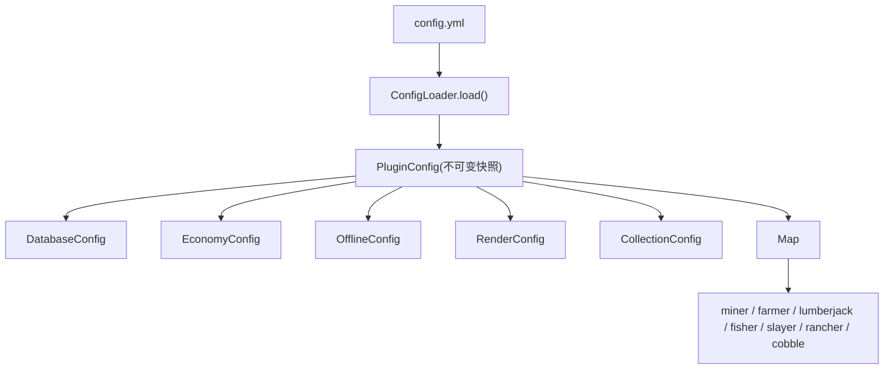
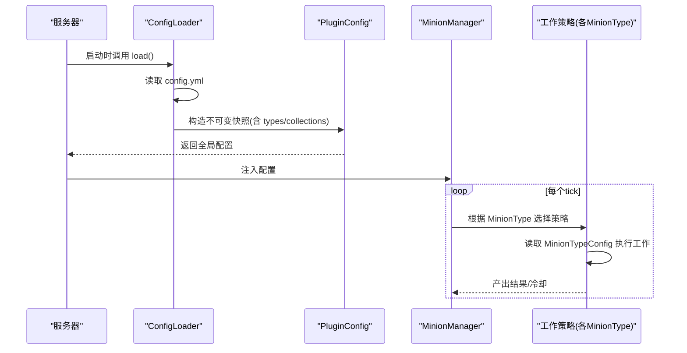
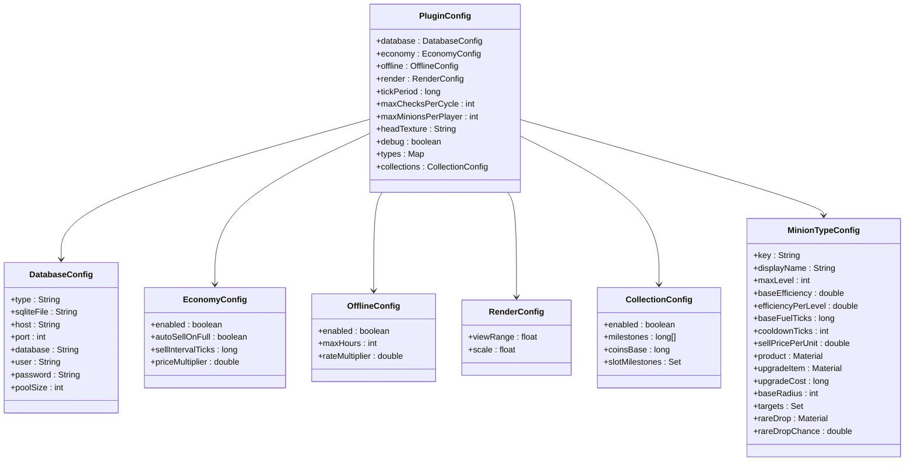

# 配置文件详解

<cite>
**本文引用的文件**
- [config.yml](file://src/main/resources/config.yml)
- [PluginConfig.java](file://src/main/java/com/hcs/minions/config/PluginConfig.java)
- [MinionTypeConfig.java](file://src/main/java/com/hcs/minions/config/MinionTypeConfig.java)
- [DatabaseConfig.java](file://src/main/java/com/hcs/minions/config/DatabaseConfig.java)
- [EconomyConfig.java](file://src/main/java/com/hcs/minions/config/EconomyConfig.java)
- [OfflineConfig.java](file://src/main/java/com/hcs/minions/config/OfflineConfig.java)
- [CollectionConfig.java](file://src/main/java/com/hcs/minions/config/CollectionConfig.java)
- [RenderConfig.java](file://src/main/java/com/hcs/minions/config/RenderConfig.java)
- [ConfigLoader.java](file://src/main/java/com/hcs/minions/config/ConfigLoader.java)
- [MinionType.java](file://src/main/java/com/hcs/minions/model/MinionType.java)
- [MinerStrategy.java](file://src/main/java/com/hcs/minions/work/miner/MinerStrategy.java)
- [FarmerStrategy.java](file://src/main/java/com/hcs/minions/work/farmer/FarmerStrategy.java)
- [LumberjackStrategy.java](file://src/main/java/com/hcs/minions/work/lumberjack/LumberjackStrategy.java)
- [FisherStrategy.java](file://src/main/java/com/hcs/minions/work/fisher/FisherStrategy.java)
- [SlayerStrategy.java](file://src/main/java/com/hcs/minions/work/slayer/SlayerStrategy.java)
</cite>

## 目录
1. [简介](#简介)
2. [项目结构](#项目结构)
3. [核心组件](#核心组件)
4. [架构总览](#架构总览)
5. [详细配置说明](#详细配置说明)
6. [依赖关系分析](#依赖关系分析)
7. [性能考量](#性能考量)
8. [故障排查指南](#故障排查指南)
9. [结论](#结论)
10. [附录：配置示例与最佳实践](#附录：配置示例与最佳实践)

## 简介
本文件为 SkyMinions 插件的配置文件详解，面向服务器管理员与运维人员。内容覆盖全局调度参数、数据库连接、经济系统集成、离线收益、Collection 里程碑系统，以及每种仆从类型（矿工、农夫、伐木工、钓鱼、猎魔、牧民、圆石）的详细配置项。文档同时提供性能影响说明、配置验证方法与错误排查建议，帮助进行精细化调优。

## 项目结构
- 配置文件位于 resources/config.yml，启动时由 ConfigLoader 一次性加载并反序列化为强类型对象 PluginConfig，之后全服只读共享。
- 各子系统通过独立的配置记录类表达：DatabaseConfig、EconomyConfig、OfflineConfig、RenderConfig、CollectionConfig、MinionTypeConfig。
- 每种仆从类型在 config.yml 的 types 节点下独立配置，并通过 MinionType 枚举与工作策略类对应。

图表来源
- [ConfigLoader.java:30-83](file://src/main/java/com/hcs/minions/config/ConfigLoader.java#L30-L83)
- [PluginConfig.java:22-45](file://src/main/java/com/hcs/minions/config/PluginConfig.java#L22-L45)

章节来源
- [config.yml:1-153](file://src/main/resources/config.yml#L1-L153)
- [ConfigLoader.java:30-83](file://src/main/java/com/hcs/minions/config/ConfigLoader.java#L30-L83)

## 核心组件
- 全局调度器周期 tick-period：控制服务轮询频率，影响 CPU 占用与响应延迟。
- 单次检查上限 max-checks-per-cycle：限制每周期内方块扫描数量，保护 TPS。
- 每玩家仆从上限 max-minions-per-player：控制资源占用与内存压力。
- 数据库配置：sqlite/mysql 切换、连接池大小等。
- 经济系统：自动售卖开关、售卖间隔、价格倍率。
- 离线收益：是否启用、最大计算时长、效率折扣。
- Collection 里程碑：阈值、金币基数、额外槽位奖励序号集合。
- 渲染配置：Display Entity 可视范围与缩放。
- 每种仆从类型的属性：效率、燃料、冷却、售价、产物、升级消耗、工作半径、稀有掉落及概率、目标方块集。

章节来源
- [PluginConfig.java:22-45](file://src/main/java/com/hcs/minions/config/PluginConfig.java#L22-L45)
- [MinionTypeConfig.java:21-63](file://src/main/java/com/hcs/minions/config/MinionTypeConfig.java#L21-L63)

## 架构总览
配置加载与使用流程如下：

图表来源
- [ConfigLoader.java:30-83](file://src/main/java/com/hcs/minions/config/ConfigLoader.java#L30-L83)
- [MinerStrategy.java:36-55](file://src/main/java/com/hcs/minions/work/miner/MinerStrategy.java#L36-L55)
- [FarmerStrategy.java:33-36](file://src/main/java/com/hcs/minions/work/farmer/FarmerStrategy.java#L33-L36)
- [LumberjackStrategy.java:39-42](file://src/main/java/com/hcs/minions/work/lumberjack/LumberjackStrategy.java#L39-L42)
- [FisherStrategy.java:34-44](file://src/main/java/com/hcs/minions/work/fisher/FisherStrategy.java#L34-L44)
- [SlayerStrategy.java:34-49](file://src/main/java/com/hcs/minions/work/slayer/SlayerStrategy.java#L34-L49)

## 详细配置说明

### 全局调度参数
- tick-period：调度器周期（tick）。值越小，轮询越频繁，CPU 占用越高；值越大，响应延迟增加。默认 20。
- max-checks-per-cycle：单次策略执行的方块检查硬上限，必须小于 50。超过会被强制回落至 48，避免卡顿。
- max-minions-per-player：每玩家仆从槽位上限。Hypixel 默认为 5，但加载器默认值为 10，可按需调整。
- head-texture：固定仆从头颅贴图 base64 纹理，留空则使用内置默认。
- debug：调试日志开关，开启后打印工作/搜索详情，用于排查问题。

章节来源
- [config.yml:4-11](file://src/main/resources/config.yml#L4-L11)
- [ConfigLoader.java:63-82](file://src/main/java/com/hcs/minions/config/ConfigLoader.java#L63-L82)
- [PluginConfig.java:36-45](file://src/main/java/com/hcs/minions/config/PluginConfig.java#L36-L45)

### 数据库配置
- type：sqlite 或 mysql。
- sqlite-file：SQLite 文件名。
- host/port/database/user/password：MySQL 连接信息。
- pool-size：HikariCP 连接池大小，小池避免虚拟线程被固定。

注意：当 type=sqlite 时，host/port 等字段可忽略；type=mysql 时需正确填写连接信息。

章节来源
- [config.yml:13-22](file://src/main/resources/config.yml#L13-L22)
- [DatabaseConfig.java:6-20](file://src/main/java/com/hcs/minions/config/DatabaseConfig.java#L6-L20)
- [ConfigLoader.java:34-43](file://src/main/java/com/hcs/minions/config/ConfigLoader.java#L34-L43)

### 经济系统集成
- enabled：是否启用 Vault 经济集成。
- auto-sell-on-full：仓库满时自动售卖（也可通过“自动售卖漏斗”模块触发）。
- sell-interval-ticks：自动售卖轮询间隔（tick）。
- price-multiplier：全局价格倍率，内部金额以分或 BigDecimal 运算，仅在 Vault 边界转换。

章节来源
- [config.yml:23-28](file://src/main/resources/config.yml#L23-L28)
- [EconomyConfig.java:7-12](file://src/main/java/com/hcs/minions/config/EconomyConfig.java#L7-L12)
- [ConfigLoader.java:45-50](file://src/main/java/com/hcs/minions/config/ConfigLoader.java#L45-L50)

### 离线收益设置
- enabled：是否启用离线收益计算。
- max-hours：离线收益最大计算时长上限，防止无上限回放导致异常。
- rate-multiplier：离线效率折扣系数。

章节来源
- [config.yml:33-37](file://src/main/resources/config.yml#L33-L37)
- [OfflineConfig.java:9-13](file://src/main/java/com/hcs/minions/config/OfflineConfig.java#L9-L13)
- [ConfigLoader.java:52-56](file://src/main/java/com/hcs/minions/config/ConfigLoader.java#L52-L56)

### Collection 里程碑系统
- enabled：是否启用里程碑奖励（关闭时仅记录累计量）。
- milestones：严格递增的阈值列表，默认包含多个档位。
- coins-base：第 n 个里程碑奖励金币 = coins-base × n。
- slot-milestones：命中这些序号（1-based）的里程碑额外奖励仆从槽位 +1，多资源可叠加。

实现要点：
- 若未配置 milestones，将回退到内置默认数组。
- reachedIndex(total) 返回已达成的最高里程碑序号（1-based），0 表示尚未达成任何里程碑。
- bonusSlotsFor(claimedMax) 计算应得的槽位加成。

章节来源
- [config.yml:38-46](file://src/main/resources/config.yml#L38-L46)
- [CollectionConfig.java:17-63](file://src/main/java/com/hcs/minions/config/CollectionConfig.java#L17-L63)
- [ConfigLoader.java:85-104](file://src/main/java/com/hcs/minions/config/ConfigLoader.java#L85-L104)

### 渲染配置
- view-range：Display Entity 可视距离，限制每个仆从的渲染半径，防无限渲染。
- scale：ItemDisplay 缩放比例。

章节来源
- [RenderConfig.java:9-12](file://src/main/java/com/hcs/minions/config/RenderConfig.java#L9-L12)
- [ConfigLoader.java:58-61](file://src/main/java/com/hcs/minions/config/ConfigLoader.java#L58-L61)

### 仆从类型配置（types.*）
每种仆从类型在 types 节点下独立配置，关键属性如下：
- display-name：显示名称（GUI/标题用）。
- max-level：最大等级。
- base-efficiency：基础效率。
- efficiency-per-level：每级效率增量。
- base-fuel-ticks：基础燃料持续时间（tick）。
- cooldown-ticks：冷却时间（tick）。
- sell-price-per-unit：单位售价。
- product：代表性产物（离线收益用）。
- upgrade-item：升级消耗材料。
- upgrade-cost：基础升级消耗（实际 = upgrade-cost × 当前等级）。
- base-radius：固定工作半径（对齐 Hypixel 5x5，不随等级变化）。
- targets：目标方块集合（部分类型为空，表示不受方块限制）。
- rare-drop：专属稀有掉落（可为空，表示关闭）。
- rare-drop-chance：稀有掉落概率（0~1，0 表示关闭）。

重要行为：
- 稀有掉落校验：若配置了 rare-drop-chance > 0 但未配置有效 rare-drop，将关闭稀有掉落并告警。
- 目标方块解析失败会记录警告并跳过该方块。
- 效率计算公式：efficiencyAt(level) = baseEfficiency + efficiencyPerLevel × max(0, level - 1)。
- 升级成本公式：upgradeCostFor(level) = upgradeCost × level。
- 工作半径：radiusFor(level) = baseRadius（固定）。

章节来源
- [config.yml:47-153](file://src/main/resources/config.yml#L47-L153)
- [MinionTypeConfig.java:21-63](file://src/main/java/com/hcs/minions/config/MinionTypeConfig.java#L21-L63)
- [ConfigLoader.java:106-152](file://src/main/java/com/hcs/minions/config/ConfigLoader.java#L106-L152)

#### 各类型特性速览
- miner（矿工）：targets 包含各类矿石与石头；适合矿脉采集。
- farmer（农夫）：targets 为成熟作物；收割后补种。
- lumberjack（伐木工）：BFS 整树砍伐，支持多种原木。
- fisher（钓鱼）：附近有水即工作，模拟钓鱼产出鱼类。
- slayer（猎魔）：战斗型，不受方块限制，随机掉落怪物素材。
- rancher（牧民）：畜牧玩法，自动管理范围内动物繁殖与宰杀。
- cobble（圆石）：生成器玩法，无圆石时在固体上方生成，下次采掉。

章节来源
- [MinionType.java:13-20](file://src/main/java/com/hcs/minions/model/MinionType.java#L13-L20)
- [MinerStrategy.java:36-55](file://src/main/java/com/hcs/minions/work/miner/MinerStrategy.java#L36-L55)
- [FarmerStrategy.java:33-36](file://src/main/java/com/hcs/minions/work/farmer/FarmerStrategy.java#L33-L36)
- [LumberjackStrategy.java:39-42](file://src/main/java/com/hcs/minions/work/lumberjack/LumberjackStrategy.java#L39-L42)
- [FisherStrategy.java:34-44](file://src/main/java/com/hcs/minions/work/fisher/FisherStrategy.java#L34-L44)
- [SlayerStrategy.java:34-49](file://src/main/java/com/hcs/minions/work/slayer/SlayerStrategy.java#L34-L49)

## 依赖关系分析
配置对象之间的依赖关系如下：

图表来源
- [PluginConfig.java:22-45](file://src/main/java/com/hcs/minions/config/PluginConfig.java#L22-L45)
- [DatabaseConfig.java:6-20](file://src/main/java/com/hcs/minions/config/DatabaseConfig.java#L6-L20)
- [EconomyConfig.java:7-12](file://src/main/java/com/hcs/minions/config/EconomyConfig.java#L7-L12)
- [OfflineConfig.java:9-13](file://src/main/java/com/hcs/minions/config/OfflineConfig.java#L9-L13)
- [RenderConfig.java:9-12](file://src/main/java/com/hcs/minions/config/RenderConfig.java#L9-L12)
- [CollectionConfig.java:17-63](file://src/main/java/com/hcs/minions/config/CollectionConfig.java#L17-L63)
- [MinionTypeConfig.java:21-63](file://src/main/java/com/hcs/minions/config/MinionTypeConfig.java#L21-L63)

章节来源
- [PluginConfig.java:22-45](file://src/main/java/com/hcs/minions/config/PluginConfig.java#L22-L45)

## 性能考量
- tick-period：降低周期可减少 CPU 占用，但会增加响应延迟；建议根据服务器负载与 TPS 需求调整。
- max-checks-per-cycle：限制每次扫描的方块数，防止长循环造成卡顿；超过 50 将被强制回落。
- max-minions-per-player：过高会导致实体与内存压力增大；建议按玩家规模与服务端能力设定。
- 数据库连接池 pool-size：过小可能成为瓶颈，过大可能浪费资源；小池避免虚拟线程被固定。
- 经济售卖间隔 sell-interval-ticks：过短会频繁交易，过长则反应迟钝；根据交易量调整。
- 离线收益 max-hours：限制回放时长，避免极端情况下的性能问题。
- 稀有掉落 rare-drop-chance：高概率会增加掉落处理开销；谨慎调高。
- 渲染 view-range：过大可能导致大量 Display Entity 渲染；建议限制合理范围。

[本节为通用性能指导，不直接分析具体代码文件]

## 故障排查指南
常见配置问题与定位方法：
- 未知目标方块：当 targets 中包含无效 Material 名称时，会记录警告并跳过；请核对拼写与版本兼容性。
- 稀有掉落未生效：若配置了 rare-drop-chance > 0 但未配置有效 rare-drop，将关闭稀有掉落并告警；请确保两者同时配置且有效。
- max-checks-per-cycle 超限：超过 50 会被强制回落至 48；如需更高上限，请评估服务器性能后再调整。
- 数据库连接失败：检查 type、host/port/database/user/password 是否正确；MySQL 需确保网络可达与权限正确。
- 经济系统不生效：确认 economy.enabled 为 true，并确保已安装并启用 Vault。
- 离线收益异常：检查 offline.enabled、max-hours 与 rate-multiplier；过大的 max-hours 可能导致计算耗时。
- 渲染异常：调整 render.view-range 与 render.scale，避免过多实体渲染。

章节来源
- [ConfigLoader.java:106-152](file://src/main/java/com/hcs/minions/config/ConfigLoader.java#L106-L152)
- [ConfigLoader.java:63-67](file://src/main/java/com/hcs/minions/config/ConfigLoader.java#L63-L67)
- [PluginConfig.java:36-45](file://src/main/java/com/hcs/minions/config/PluginConfig.java#L36-L45)

## 结论
本插件采用强类型配置与不可变快照设计，确保运行时配置安全与一致性。通过合理的调度参数、数据库与经济系统配置、离线收益与 Collection 里程碑设置，以及对每种仆从类型的精细调优，可在保证 TPS 的前提下最大化自动化收益。建议在生产环境逐步调整参数，结合日志与监控观察效果。

[本节为总结性内容，不直接分析具体代码文件]

## 附录：配置示例与最佳实践
- 最小化配置：仅启用必要功能，保持默认值，逐步放开高级选项。
- 性能优先：先调低 tick-period 与 max-checks-per-cycle，再根据负载提升。
- 经济系统：开启 auto-sell-on-full 提高资金流转，适当提高 price-multiplier 平衡物价。
- 离线收益：设置合理的 max-hours 与 rate-multiplier，避免极端回放。
- Collection 里程碑：自定义 milestones 与 slot-milestones，引导玩家进度与奖励节奏。
- 仆从类型：根据服务器生态调整 targets、rare-drop-chance 与 upgrade-cost，控制产出与难度。

[本节为概念性指导，不直接分析具体代码文件]