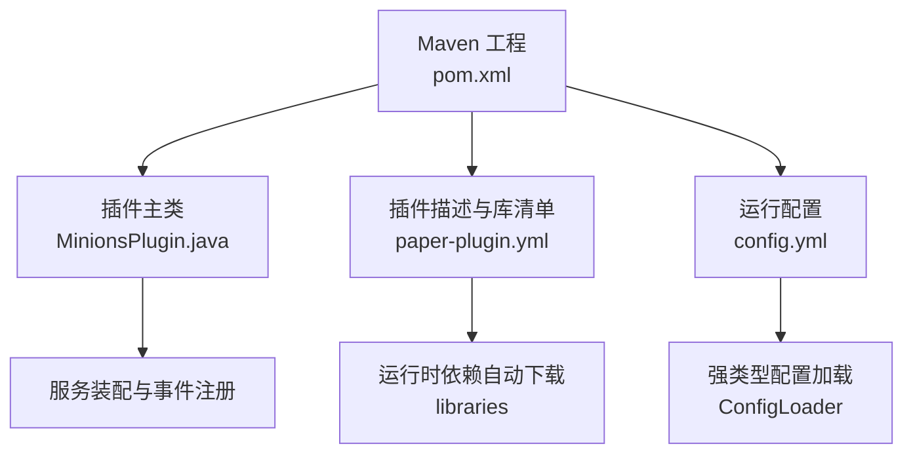
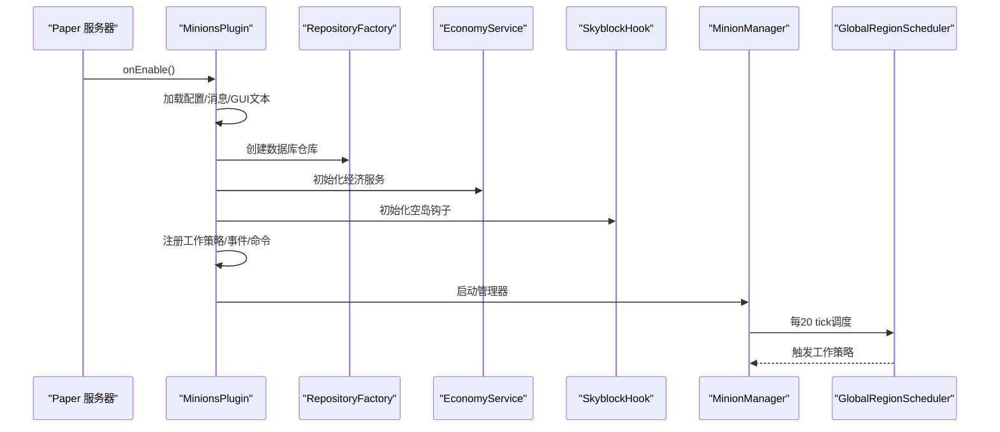
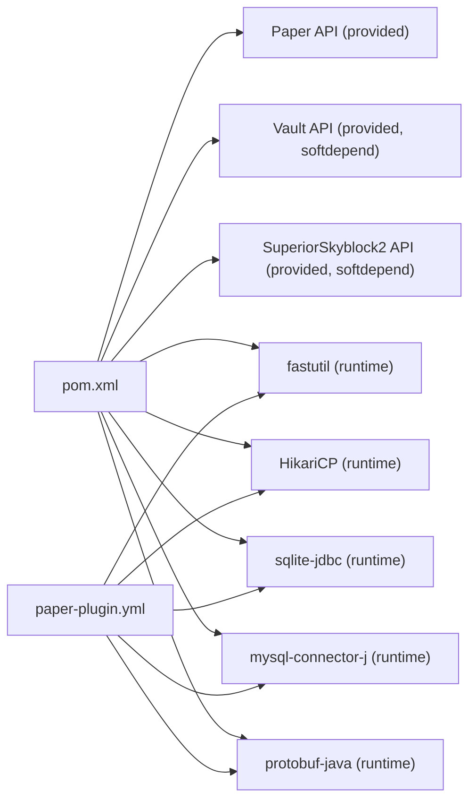

# 开发环境搭建

<cite>
**本文引用的文件**
- [pom.xml](file://pom.xml)
- [paper-plugin.yml](file://src/main/resources/paper-plugin.yml)
- [README.md](file://README.md)
- [MinionsPlugin.java](file://src/main/java/com/hcs/minions/MinionsPlugin.java)
- [config.yml](file://src/main/resources/config.yml)
- [settings.gradle.kts](file://craft-engine/settings.gradle.kts)
- [gradle.properties](file://craft-engine/gradle.properties)
</cite>

## 目录
1. [简介](#简介)
2. [项目结构](#项目结构)
3. [核心组件](#核心组件)
4. [架构总览](#架构总览)
5. [详细组件分析](#详细组件分析)
6. [依赖关系分析](#依赖关系分析)
7. [性能注意事项](#性能注意事项)
8. [故障排查指南](#故障排查指南)
9. [结论](#结论)
10. [附录](#附录)

## 简介
本指南面向首次参与 SkyMinions 插件开发的工程师，目标是帮助你在最短时间内完成本地开发环境的搭建与调试。你将了解：
- 所需工具：JDK 21+、Maven、IDE（推荐 IntelliJ IDEA）的安装与配置要点
- 项目依赖管理：Paper API、Vault API、SuperiorSkyblock2 API 等外部依赖的声明方式与运行时加载机制
- 如何克隆、导入到 IDE、解决常见依赖问题
- 项目结构与关键配置文件的作用说明
- 常见问题定位与解决方案

## 项目结构
SkyMinions 是一个基于 Paper 1.21+ 的 Minecraft 服务端插件，采用 Maven 构建，主入口为 Java 类，并通过 paper-plugin.yml 声明插件元数据与运行时依赖。项目根目录包含：
- src/main/java：插件业务代码（命令、监听器、服务、模型、仓库、工作策略等）
- src/main/resources：插件资源（配置文件、消息、插件描述）
- craft-engine：内部框架工程（Gradle 多模块），用于提供底层能力（如依赖管理、平台适配等）
- pom.xml：Maven 构建与依赖声明
- README.md：功能说明与构建指引

图表来源
- [pom.xml:1-132](file://pom.xml#L1-L132)
- [paper-plugin.yml:1-47](file://src/main/resources/paper-plugin.yml#L1-L47)
- [MinionsPlugin.java:52-120](file://src/main/java/com/hcs/minions/MinionsPlugin.java#L52-L120)
- [config.yml:1-153](file://src/main/resources/config.yml#L1-L153)

章节来源
- [pom.xml:1-132](file://pom.xml#L1-L132)
- [paper-plugin.yml:1-47](file://src/main/resources/paper-plugin.yml#L1-L47)
- [README.md:67-109](file://README.md#L67-L109)

## 核心组件
- 插件主类 MinionsPlugin：负责生命周期管理与服务装配，不承载业务逻辑；在 onEnable 中初始化配置、异步执行器、数据库仓库、经济系统、权限、升级、集合里程碑、工作策略、实体服务、售卖服务等，并注册事件与命令。
- 配置系统：通过 ConfigLoader 将 config.yml 反序列化为不可变强类型对象，全局只读共享，避免运行时 getConfig() 散落。
- 工作策略：矿工、农夫、伐木工、钓鱼、猎魔、牧民、圆石生成器等策略由 WorkStrategyRegistry 统一管理。
- 持久化：RepositoryFactory 根据配置创建 SQLite 或 MySQL 存储，支持内存缓存。
- 运行时依赖：fastutil、HikariCP、sqlite-jdbc、mysql-connector-j、protobuf-java 等通过 paper-plugin.yml 的 libraries 声明，由 Paper 在加载插件时从 Maven Central 自动下载并挂载到插件类加载器，保持产物 jar 瘦小。

章节来源
- [MinionsPlugin.java:52-120](file://src/main/java/com/hcs/minions/MinionsPlugin.java#L52-L120)
- [config.yml:1-153](file://src/main/resources/config.yml#L1-L153)
- [paper-plugin.yml:15-23](file://src/main/resources/paper-plugin.yml#L15-L23)

## 架构总览
SkyMinions 采用“组合根 + 服务装配”的模式：
- 主类仅做装配与调度，业务逻辑下沉至各 Service 与 Strategy
- 通过全局单调度器（GlobalRegionScheduler）周期性驱动工作策略
- 使用限流搜索（BlockSearcher）控制方块检查次数，保证性能
- GUI 使用真实 Inventory，避免刷物问题
- 可选软依赖 Vault、SuperiorSkyblock2，缺失时关闭对应能力

图表来源
- [MinionsPlugin.java:52-120](file://src/main/java/com/hcs/minions/MinionsPlugin.java#L52-L120)
- [README.md:80-109](file://README.md#L80-L109)

## 详细组件分析

### 环境与工具安装
- JDK 21+
  - 原因：Maven 编译目标版本为 21（maven.compiler.release=21），需安装 JDK 21 或以上版本。
  - 建议：使用官方安装包或 SDKMAN 管理多版本。
- Maven
  - 作用：构建项目、解析依赖、打包产物。
  - 建议：配置国内镜像加速（如阿里云 Maven 中央仓库镜像），减少下载失败概率。
- IDE（推荐 IntelliJ IDEA）
  - 导入步骤：打开项目根目录，IDE 会自动识别 pom.xml 并导入 Maven 工程。
  - 插件运行：可借助 Paper 提供的开发服务器进行热重载与调试。

章节来源
- [pom.xml:15-23](file://pom.xml#L15-L23)
- [README.md:67-77](file://README.md#L67-L77)

### 依赖管理说明
- 编译期依赖（provided）
  - Paper API：io.papermc.paper:paper-api:${paper.version}，scope=provided，不打入 jar。
  - SLF4J：org.slf4j:slf4j-api:2.0.13，scope=provided，由平台暴露。
  - Vault API：com.github.MilkBowl:VaultAPI:1.7，scope=provided，softdepend。
  - SuperiorSkyblock2 API：com.bgsoftware:SuperiorSkyblockAPI:2024.3，scope=provided，softdepend。
- 运行时依赖（libraries）
  - fastutil、HikariCP、sqlite-jdbc、mysql-connector-j、protobuf-java 等在 paper-plugin.yml 的 libraries 中声明，由 Paper 首次加载时从 Maven Central 自动下载并挂载到插件类加载器。
- 仓库源
  - papermc 仓库：用于获取 Paper API
  - jitpack.io：用于部分第三方依赖
  - bg-software：用于 SuperiorSkyblock2 API

章节来源
- [pom.xml:25-111](file://pom.xml#L25-L111)
- [paper-plugin.yml:15-23](file://src/main/resources/paper-plugin.yml#L15-L23)

### 克隆与导入步骤
- 克隆项目
  - 使用 Git 克隆仓库到本地目录。
- 导入到 IDE
  - 使用 IntelliJ IDEA 打开项目根目录，等待 Maven 索引完成。
- 验证依赖
  - 执行 mvn clean compile 确保依赖下载成功。
  - 若网络受限，配置 Maven 镜像或使用代理。

章节来源
- [README.md:67-77](file://README.md#L67-L77)
- [pom.xml:25-38](file://pom.xml#L25-L38)

### 关键配置文件与作用
- pom.xml
  - 定义 groupId、artifactId、version、打包方式、编译器版本、仓库源、依赖与构建插件。
- paper-plugin.yml
  - 插件名称、版本、主类、API 版本、软依赖、运行时依赖列表、权限定义。
- config.yml
  - 全局调度参数、数据库连接、经济设置、离线收益、Collection 里程碑、各仆从类型配置（显示名、等级上限、效率、燃料、冷却、售价、产物、升级材料、半径、稀有掉落等）。

章节来源
- [pom.xml:1-132](file://pom.xml#L1-L132)
- [paper-plugin.yml:1-47](file://src/main/resources/paper-plugin.yml#L1-L47)
- [config.yml:1-153](file://src/main/resources/config.yml#L1-L153)

### 外部依赖配置与软依赖处理
- Vault（经济）
  - 编译期 provided，运行时可选；未安装时插件仍可运行，仅关闭经济相关能力。
- SuperiorSkyblock2（空岛）
  - 编译期 provided，运行时可选；未安装时插件仍可运行，仅关闭空岛联动校验。
- 运行时依赖
  - 通过 paper-plugin.yml 的 libraries 声明，无需手动放入 libs 目录，Paper 自动下载并挂载。

章节来源
- [pom.xml:55-74](file://pom.xml#L55-L74)
- [paper-plugin.yml:8-23](file://src/main/resources/paper-plugin.yml#L8-L23)

### 构建与运行
- 构建命令
  - mvn clean package
  - 产物位于 target/SkyMinions-${version}.jar（瘦 jar，约 100 KB）
- 运行环境
  - 需要 Paper 1.21+ 服务器；首次加载会按 paper-plugin.yml 的 libraries 自动下载运行时依赖。
- 测试
  - 单元测试使用 JUnit Jupiter，纯逻辑测试不依赖 Bukkit 运行时。

章节来源
- [README.md:67-77](file://README.md#L67-L77)
- [pom.xml:104-111](file://pom.xml#L104-L111)
- [pom.xml:113-130](file://pom.xml#L113-L130)

## 依赖关系分析
- 直接依赖
  - Paper API（provided）
  - SLF4J API（provided）
  - Vault API（provided，softdepend）
  - SuperiorSkyblock2 API（provided，softdepend）
  - fastutil、HikariCP、sqlite-jdbc、mysql-connector-j、protobuf-java（运行时依赖，由 Paper 自动下载）
- 间接依赖
  - Craft Engine（Gradle 多模块）提供底层能力，与本插件解耦；其依赖管理通过 Gradle 与 properties 配置。

图表来源
- [pom.xml:25-111](file://pom.xml#L25-L111)
- [paper-plugin.yml:15-23](file://src/main/resources/paper-plugin.yml#L15-L23)

章节来源
- [pom.xml:25-111](file://pom.xml#L25-L111)
- [paper-plugin.yml:15-23](file://src/main/resources/paper-plugin.yml#L15-L23)

## 性能注意事项
- 全局调度器每 20 tick 遍历一次，O(n)+O(1) 短路优化，避免全量扫描。
- BlockSearcher 限流搜索（邻接+随机，硬上限 <50），防止卡顿。
- 方块破坏与 Inventory#addItem 在主线程执行，仅 Vault 售卖异步。
- GUI 使用真实 Inventory，无刷物风险。
- 数据库连接池 HikariCP 默认池大小较小，避免虚拟线程被固定线程阻塞。

章节来源
- [README.md:80-109](file://README.md#L80-L109)
- [config.yml:4-22](file://src/main/resources/config.yml#L4-L22)

## 故障排查指南
- 版本冲突
  - 现象：编译时报找不到类或方法签名不一致。
  - 处理：确认 Paper API 版本与服务器实际版本一致；必要时调整 pom.xml 中的 paper.version。
- 依赖下载失败
  - 现象：Maven 无法下载依赖或超时。
  - 处理：配置 Maven 镜像（如阿里云）或使用代理；检查网络与防火墙设置。
- 运行时依赖未加载
  - 现象：插件启动报 NoClassDefFoundError。
  - 处理：确认 paper-plugin.yml 的 libraries 已正确声明；确保 Paper 能访问 Maven Central。
- 软依赖缺失
  - 现象：Vault 或 SuperiorSkyblock2 未安装导致功能不可用。
  - 处理：插件仍会启动，但对应能力关闭；如需启用，请安装相应插件并确保版本兼容。
- 数据库连接失败
  - 现象：SQLite/MySQL 连接异常。
  - 处理：检查 config.yml 的 database 配置（类型、主机、端口、数据库、用户、密码、连接池大小）；确保数据库服务可用。

章节来源
- [pom.xml:15-23](file://pom.xml#L15-L23)
- [pom.xml:25-38](file://pom.xml#L25-L38)
- [paper-plugin.yml:15-23](file://src/main/resources/paper-plugin.yml#L15-L23)
- [config.yml:13-22](file://src/main/resources/config.yml#L13-L22)

## 结论
通过本指南，你应能顺利完成 SkyMinions 插件的开发环境搭建，理解项目的依赖管理与构建流程，掌握常见问题的排查方法。建议在本地先完成构建与基础测试，再逐步接入业务开发与调试。

## 附录
- 快速命令
  - 清理并构建：mvn clean package
  - 运行测试：mvn test
- 参考文档
  - 项目 README 提供了功能说明、权限与构建指引。

章节来源
- [README.md:67-109](file://README.md#L67-L109)