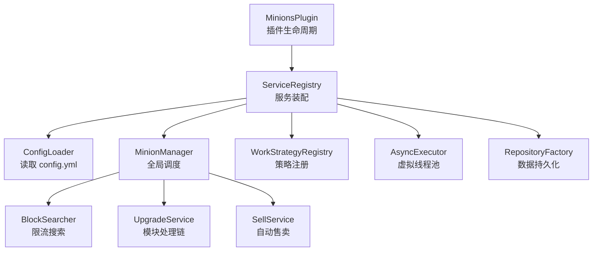
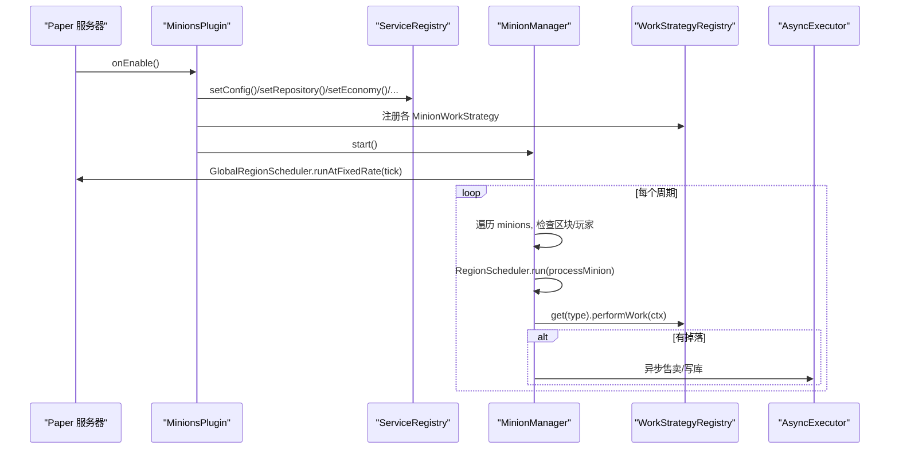
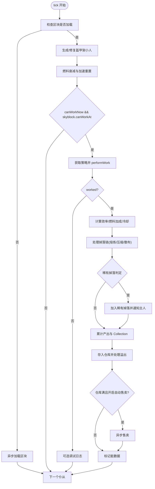
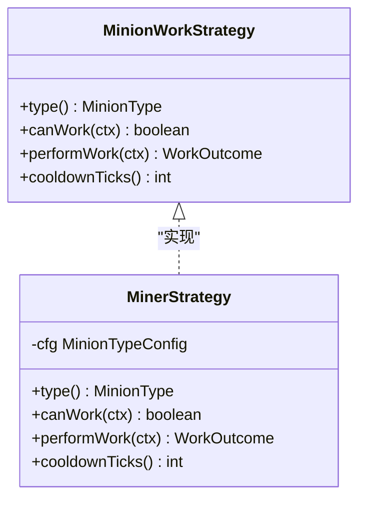
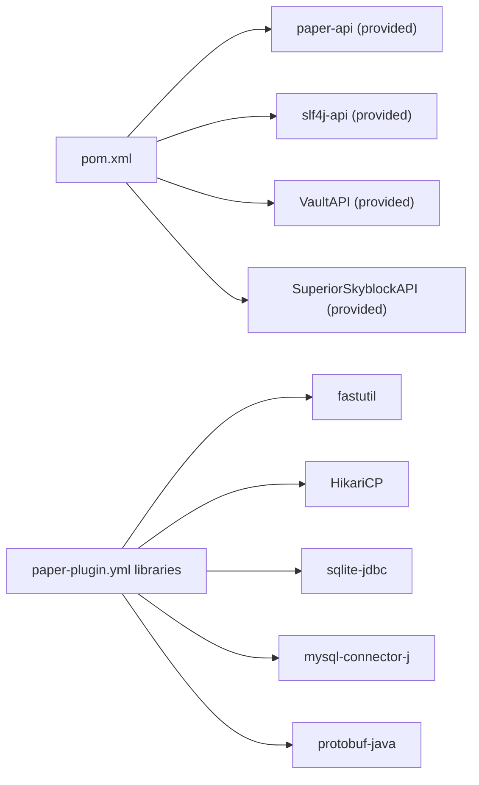

# 开发者指南

<cite>
**本文引用的文件**
- [pom.xml](file://pom.xml)
- [README.md](file://README.md)
- [paper-plugin.yml](file://src/main/resources/paper-plugin.yml)
- [config.yml](file://src/main/resources/config.yml)
- [MinionsPlugin.java](file://src/main/java/com/hcs/minions/MinionsPlugin.java)
- [ServiceRegistry.java](file://src/main/java/com/hcs/minions/core/ServiceRegistry.java)
- [ConfigLoader.java](file://src/main/java/com/hcs/minions/config/ConfigLoader.java)
- [PluginConfig.java](file://src/main/java/com/hcs/minions/config/PluginConfig.java)
- [MinionManager.java](file://src/main/java/com/hcs/minions/service/MinionManager.java)
- [MinionWorkStrategy.java](file://src/main/java/com/hcs/minions/work/MinionWorkStrategy.java)
- [MinerStrategy.java](file://src/main/java/com/hcs/minions/work/miner/MinerStrategy.java)
- [AsyncExecutor.java](file://src/main/java/com/hcs/minions/util/AsyncExecutor.java)
- [BlockSearcherTest.java](file://src/test/java/com/hcs/minions/service/BlockSearcherTest.java)
</cite>

## 目录
1. [简介](#简介)
2. [项目结构](#项目结构)
3. [核心组件](#核心组件)
4. [架构总览](#架构总览)
5. [详细组件分析](#详细组件分析)
6. [依赖关系分析](#依赖关系分析)
7. [性能考量](#性能考量)
8. [测试策略](#测试策略)
9. [调试与故障排除](#调试与故障排除)
10. [扩展开发指南](#扩展开发指南)
11. [贡献指南与代码规范](#贡献指南与代码规范)
12. [常见问题解答](#常见问题解答)
13. [结论](#结论)

## 简介
SkyMinions 是一个面向 Paper 1.21+ 的仆从系统插件，采用分层架构、全局单调度器、策略模式工作流、升级模块与离线收益等机制，提供与 Hypixel SkyBlock 风格一致的仆从体验。插件通过强类型配置、服务注册表与清晰的线程边界（主线程/区域线程/异步）实现高性能与可维护性。

## 项目结构
- 根工程使用 Maven 构建，目标 JDK 21，依赖 Paper API 1.21+，运行时依赖通过 paper-plugin.yml 的 libraries 由 Paper 自动下载。
- 源码位于 src/main/java/com/hcs/minions，资源位于 src/main/resources。
- 测试位于 src/test/java，基于 JUnit Jupiter。
- 关键入口：
  - 插件主类：com.hcs.minions.MinionsPlugin
  - 服务装配：com.hcs.minions.core.ServiceRegistry
  - 配置加载：com.hcs.minions.config.ConfigLoader → PluginConfig
  - 全局调度：com.hcs.minions.service.MinionManager
  - 工作策略：work.* 下的 MinionWorkStrategy 及具体实现
  - 异步执行：util.AsyncExecutor

图表来源
- [MinionsPlugin.java:51-118](file://src/main/java/com/hcs/minions/MinionsPlugin.java#L51-L118)
- [ServiceRegistry.java:21-149](file://src/main/java/com/hcs/minions/core/ServiceRegistry.java#L21-L149)
- [ConfigLoader.java:30-83](file://src/main/java/com/hcs/minions/config/ConfigLoader.java#L30-L83)
- [MinionManager.java:92-115](file://src/main/java/com/hcs/minions/service/MinionManager.java#L92-L115)

章节来源
- [pom.xml:1-132](file://pom.xml#L1-L132)
- [README.md:67-109](file://README.md#L67-L109)
- [paper-plugin.yml:1-47](file://src/main/resources/paper-plugin.yml#L1-L47)
- [config.yml:1-153](file://src/main/resources/config.yml#L1-L153)

## 核心组件
- 插件主类 MinionsPlugin：仅负责生命周期管理与服务装配，不承载业务逻辑。
- 服务注册表 ServiceRegistry：集中持有所有服务实例，启动时按依赖顺序注入，运行期只读共享。
- 配置系统 ConfigLoader + PluginConfig：唯一允许接触 getConfig() 的地方，反序列化为不可变快照，强制校验（如 max-checks-per-cycle < 50）。
- 全局调度 MinionManager：每 tickPeriod 遍历仆从，检查区块加载与玩家距离，委派到对应 region 线程执行工作；支持快照落库与自动售卖轮询。
- 工作策略 MinionWorkStrategy：定义 canWork / performWork / cooldownTicks，具体类型在 work.* 下实现（矿工、农夫、伐木工、钓鱼、猎魔、牧民、圆石生成器）。
- 异步执行 AsyncExecutor：基于 Java 21 虚拟线程池，承担 IO 与后台任务，严格隔离主线程/区域线程操作。

章节来源
- [MinionsPlugin.java:44-139](file://src/main/java/com/hcs/minions/MinionsPlugin.java#L44-L139)
- [ServiceRegistry.java:18-149](file://src/main/java/com/hcs/minions/core/ServiceRegistry.java#L18-L149)
- [ConfigLoader.java:16-83](file://src/main/java/com/hcs/minions/config/ConfigLoader.java#L16-L83)
- [PluginConfig.java:8-46](file://src/main/java/com/hcs/minions/config/PluginConfig.java#L8-L46)
- [MinionManager.java:39-115](file://src/main/java/com/hcs/minions/service/MinionManager.java#L39-L115)
- [MinionWorkStrategy.java:5-26](file://src/main/java/com/hcs/minions/work/MinionWorkStrategy.java#L5-L26)
- [AsyncExecutor.java:12-79](file://src/main/java/com/hcs/minions/util/AsyncExecutor.java#L12-L79)

## 架构总览
整体采用“组合根 + 服务注册表 + 策略模式”的分层架构：
- 组合根：MinionsPlugin 在 onEnable 中创建并装配各服务，注册事件监听与命令。
- 服务层：MinionManager 作为调度中枢，协调 BlockSearcher、UpgradeService、SellService、Repository 等。
- 策略层：每种仆从类型对应一个 MinionWorkStrategy 实现，统一接口便于扩展。
- 线程模型：GlobalRegionScheduler 做轻量遍历，RegionScheduler 执行区域绑定操作，AsyncExecutor 处理 IO。

图表来源
- [MinionsPlugin.java:51-118](file://src/main/java/com/hcs/minions/MinionsPlugin.java#L51-L118)
- [MinionManager.java:92-115](file://src/main/java/com/hcs/minions/service/MinionManager.java#L92-L115)
- [MinionManager.java:191-250](file://src/main/java/com/hcs/minions/service/MinionManager.java#L191-L250)
- [MinionWorkStrategy.java:10-26](file://src/main/java/com/hcs/minions/work/MinionWorkStrategy.java#L10-L26)

## 详细组件分析

### 插件主类与服务装配
- 职责：加载消息与配置，创建异步执行器、仓库、经济、钩子、策略集合、搜索器、实体服务、售卖、权限、升级、收集服务，组装 MinionManager，注册事件监听与命令，启动调度与定期落盘。
- 关键点：
  - 策略注册：为每种 MinionType 添加对应的策略工厂。
  - 调度启动：tickTask 以 tickPeriod 周期运行；snapshotAndFlush 定时批量落库；sellTask 定时扫描自动售卖。
  - 关闭流程：停止调度、保存 Collection、关闭仓库、关闭异步执行器。

章节来源
- [MinionsPlugin.java:51-139](file://src/main/java/com/hcs/minions/MinionsPlugin.java#L51-L139)

### 配置系统
- ConfigLoader：唯一访问 getConfig() 的位置，将 YAML 解析为强类型记录（DatabaseConfig/EconomyConfig/OfflineConfig/RenderConfig/CollectionConfig/MinionTypeConfig），缺失或非法值回退默认并告警。
- PluginConfig：不可变快照，构造时校验 max-checks-per-cycle < 50，并提供 type(MinionType) 便捷查询。
- 配置项示例：tick-period、max-checks-per-cycle、max-minions-per-player、head-texture、debug、database.*、economy.*、offline.*、collections.*、types.*。

章节来源
- [ConfigLoader.java:30-83](file://src/main/java/com/hcs/minions/config/ConfigLoader.java#L30-L83)
- [ConfigLoader.java:85-152](file://src/main/java/com/hcs/minions/config/ConfigLoader.java#L85-L152)
- [PluginConfig.java:8-46](file://src/main/java/com/hcs/minions/config/PluginConfig.java#L8-L46)
- [config.yml:1-153](file://src/main/resources/config.yml#L1-L153)

### 全局调度与工作编排
- MinionManager：
  - 启动：加载全部 Minion 到内存索引（id→Minion、location→id、owner→count），启动 tick 任务与 snapshot/sell 任务。
  - tick：纯内存判断（chunk 是否加载、坐标转换），对每个 minion 委派到其 region 线程执行 processMinion。
  - processMinion：按需生成盔甲架小人、燃料衰减、冷却与空岛校验、调用策略 performWork、计算效率与冷却、处理掉落与稀有掉落、写入 Collection、溢出掉落世界、触发自动售卖、标记脏数据。
  - 自动售卖：在 GlobalRegionScheduler 上遍历，逐个委派到 region 线程判断并售卖。
  - 放置/移除/GUI：管理实体生命周期、事件派发、打开真实 Inventory GUI。
  - 清理孤儿：异常关闭后清理残留盔甲架。

图表来源
- [MinionManager.java:92-115](file://src/main/java/com/hcs/minions/service/MinionManager.java#L92-L115)
- [MinionManager.java:191-250](file://src/main/java/com/hcs/minions/service/MinionManager.java#L191-L250)
- [MinionManager.java:252-327](file://src/main/java/com/hcs/minions/service/MinionManager.java#L252-L327)
- [MinionManager.java:333-350](file://src/main/java/com/hcs/minions/service/MinionManager.java#L333-L350)

章节来源
- [MinionManager.java:39-431](file://src/main/java/com/hcs/minions/service/MinionManager.java#L39-L431)

### 工作策略与矿工示例
- MinionWorkStrategy：定义 type()、canWork(ctx)、performWork(ctx)、cooldownTicks()。
- MinerStrategy：确定性螺旋搜索可采矿方块，破坏并采集掉落，返回 WorkOutcome。
- 扩展新策略：实现 MinionWorkStrategy，并在 MinionsPlugin.addStrategy 中注册。

图表来源
- [MinionWorkStrategy.java:5-26](file://src/main/java/com/hcs/minions/work/MinionWorkStrategy.java#L5-L26)
- [MinerStrategy.java:15-57](file://src/main/java/com/hcs/minions/work/miner/MinerStrategy.java#L15-L57)

章节来源
- [MinionWorkStrategy.java:5-26](file://src/main/java/com/hcs/minions/work/MinionWorkStrategy.java#L5-L26)
- [MinerStrategy.java:15-57](file://src/main/java/com/hcs/minions/work/miner/MinerStrategy.java#L15-L57)

### 异步执行与线程边界
- AsyncExecutor：基于 Java 21 虚拟线程池，提供 submit/run/scheduleAtFixedRate，用于数据库落库、Vault 售卖、离线结算等 IO 任务。
- 线程边界：
  - GlobalRegionScheduler：轻量遍历（内存/坐标/区块加载）。
  - RegionScheduler：区域绑定操作（方块/实体/Inventory）。
  - AsyncExecutor：IO 与后台任务。

章节来源
- [AsyncExecutor.java:12-79](file://src/main/java/com/hcs/minions/util/AsyncExecutor.java#L12-L79)
- [MinionManager.java:191-250](file://src/main/java/com/hcs/minions/service/MinionManager.java#L191-L250)

## 依赖关系分析
- 构建与依赖：
  - Maven 编译目标 JDK 21，依赖 Paper API 1.21+（provided），SLF4J（provided），VaultAPI/SuperiorSkyblock2（softdepend provided）。
  - 运行时依赖 fastutil/HikariCP/sqlite-jdbc/mysql-connector-j/protobuf-java 通过 paper-plugin.yml 的 libraries 自动下载。
- 内部依赖：
  - MinionsPlugin → ServiceRegistry → 各服务（Config/Repository/Economy/SkyblockHook/Strategies/Searcher/Entities/Sell/Permissions/Upgrades/Collection/Manager/Offline/ItemService）。
  - MinionManager 依赖 WorkStrategyRegistry、BlockSearcher、UpgradeService、SellService、Repository、AsyncExecutor。

图表来源
- [pom.xml:15-111](file://pom.xml#L15-L111)
- [paper-plugin.yml:15-22](file://src/main/resources/paper-plugin.yml#L15-L22)

章节来源
- [pom.xml:1-132](file://pom.xml#L1-L132)
- [paper-plugin.yml:1-47](file://src/main/resources/paper-plugin.yml#L1-L47)

## 性能考量
- 全局单调度器：每 tickPeriod 遍历一次，O(n)+O(1) 短路（未加载区块/无玩家附近直接跳过）。
- 限流搜索：BlockSearcher 单次最多检查固定数量方块（硬上限 < 50），避免卡顿。
- 线程安全：
  - 主线程/区域线程：方块破坏、Inventory 操作。
  - 异步线程：IO（数据库、经济）、离线结算。
- 快照落库：定时批量收集脏数据，在各自 region 线程生成快照后异步批量写入，避免序列化不一致。
- 自动售卖：在 GlobalRegionScheduler 上轮询，逐个委派到 region 线程判断并售卖，避免跨线程访问 Inventory。

[本节为通用性能指导，无需特定文件引用]

## 测试策略
- 单元测试：
  - 针对纯逻辑方法编写 JUnit 5 测试，例如 BlockSearcher.generateOffsets 的偏移数量、原点排除、距离排序。
  - 建议覆盖：配置解析（非法值回退）、升级成本计算、存储槽解锁规则、物品计数与匹配。
- 集成测试：
  - 建议使用 Paper 测试框架或 MockBukkit 模拟服务器环境，验证事件监听、GUI 交互、放置/拾取流程。
- 性能测试：
  - 压测多仆从并发工作场景，观察 tick 耗时、区块加载频率、数据库写入吞吐。
  - 关注 max-checks-per-cycle 调优对性能的影响。

章节来源
- [BlockSearcherTest.java:11-43](file://src/test/java/com/hcs/minions/service/BlockSearcherTest.java#L11-L43)

## 调试与故障排除
- 日志分析：
  - 启用 debug=true 打印仆从工作/搜索详情与稀有掉落触发。
  - 关注 MinionManager 中的错误日志（工作异常、区块加载失败、异步任务失败）。
- 断点调试：
  - 在 MinionManager.tick/processMinion/performWork 处设置断点，观察策略选择与工作结果。
  - 在 GUI 点击处理器（MinionGUIListener）设置断点，验证升级/燃料/模块槽位逻辑。
- 性能分析：
  - 使用 Paper/Spigot 内置 TPS 监控与 Profiler，定位高耗时路径（搜索、库存操作、数据库写入）。
  - 调整 tickPeriod、max-checks-per-cycle、数据库连接池大小。
- 常见问题：
  - 仆从不工作：检查区块是否加载、是否有玩家在附近、燃料是否耗尽、空岛限制。
  - GUI 错乱：确认刷新时机（openGui 前 refresh），避免异步修改 Inventory。
  - 数据不同步：确保 markDirty 与快照落库正常执行。

章节来源
- [MinionManager.java:261-327](file://src/main/java/com/hcs/minions/service/MinionManager.java#L261-L327)
- [AsyncExecutor.java:34-67](file://src/main/java/com/hcs/minions/util/AsyncExecutor.java#L34-L67)
- [config.yml:10-11](file://src/main/resources/config.yml#L10-L11)

## 扩展开发指南

### 添加新的仆从类型
步骤：
1. 在 config.yml 的 types 下新增配置块（display-name、max-level、base-efficiency、efficiency-per-level、base-fuel-ticks、cooldown-ticks、sell-price-per-unit、product、upgrade-item、upgrade-cost、base-radius、rare-drop、rare-drop-chance、targets）。
2. 在 work/* 下新建策略类实现 MinionWorkStrategy，实现 canWork/performWork/cooldownTicks。
3. 在 MinionsPlugin.addStrategy 中注册新策略（传入 MinionType 与工厂函数）。
4. 如需新 MinionType 枚举值，请在 model/MinionType 中添加（若存在）。

章节来源
- [config.yml:47-153](file://src/main/resources/config.yml#L47-L153)
- [MinionWorkStrategy.java:5-26](file://src/main/java/com/hcs/minions/work/MinionWorkStrategy.java#L5-L26)
- [MinionsPlugin.java:70-79](file://src/main/java/com/hcs/minions/MinionsPlugin.java#L70-L79)

### 自定义工作策略
- 参考 MinerStrategy 的实现模式：
  - 使用 ctx.searcher().find(...) 进行限流搜索。
  - 通过 BlockOps.breakAndCollect(block) 破坏并采集掉落。
  - 返回 WorkOutcome(true, xp, drops) 表示工作成功。
- 注意：
  - performWork 必须在主线程/区域线程调用。
  - 合理设置 cooldownTicks 以平衡性能与产出。

章节来源
- [MinerStrategy.java:15-57](file://src/main/java/com/hcs/minions/work/miner/MinerStrategy.java#L15-L57)
- [MinionManager.java:252-269](file://src/main/java/com/hcs/minions/service/MinionManager.java#L252-L269)

### 扩展 GUI 功能
- 在 MinionGUIListener 中处理点击事件，结合 Minion 的 storage/items 与 UpgradeService 实现交互。
- 遵循 Hypixel 风格布局：头颅居中、信息卡、升级按钮、模块槽、收集全部、自动售卖、理想布局、拾取、关闭。
- 刷新 GUI 时调用 Minion.refresh(cfg)，避免覆盖玩家放入的真燃料。

章节来源
- [MinionsPlugin.java:108-112](file://src/main/java/com/hcs/minions/MinionsPlugin.java#L108-L112)
- [Minion.java:285-321](file://src/main/java/com/hcs/minions/model/Minion.java#L285-L321)

### 扩展升级模块
- 在 UpgradeService 中处理模块链（自动熔炼/压缩/超级压缩/钻石散布/范围扩展/自动售卖漏斗）。
- 在 Minion 中管理 upgrade1/upgrade2 槽位与解锁条件（Tier 4/8）。
- 在 GUI 中渲染模块槽状态与提示。

章节来源
- [MinionManager.java:289-301](file://src/main/java/com/hcs/minions/service/MinionManager.java#L289-L301)
- [Minion.java:125-138](file://src/main/java/com/hcs/minions/model/Minion.java#L125-L138)

## 贡献指南与代码规范
- 编码标准：
  - 使用 Java 21 特性（record、虚拟线程等）。
  - 严格区分线程边界：主线程/区域线程/异步线程。
  - 配置集中管理，禁止散落 getConfig()。
- 提交规范：
  - 提交信息清晰描述变更目的与影响范围。
  - 新增功能需配套单元测试。
- 文档维护：
  - 更新 README 与配置说明。
  - 保持代码注释与 javadoc 同步。

[本节为通用规范指导，无需特定文件引用]

## 常见问题解答
- Q: 仆从不工作？
  - A: 检查区块是否加载、是否有玩家在附近、燃料是否耗尽、空岛限制是否阻止工作。
- Q: GUI 显示异常？
  - A: 确认 openGui 前调用 refresh，避免异步修改 Inventory。
- Q: 数据丢失或不同步？
  - A: 检查 markDirty 与快照落库是否正常执行，确认数据库连接池配置。
- Q: 性能卡顿？
  - A: 调整 tickPeriod、max-checks-per-cycle，优化 BlockSearcher 搜索范围，减少不必要的 Inventory 操作。

章节来源
- [MinionManager.java:191-250](file://src/main/java/com/hcs/minions/service/MinionManager.java#L191-L250)
- [config.yml:4-11](file://src/main/resources/config.yml#L4-L11)

## 结论
SkyMinions 通过清晰的分层架构、策略模式工作流、严格的线程边界与强类型配置，实现了高性能、可扩展的仆从系统。开发者可基于现有框架轻松添加新仆从类型、自定义工作策略与 GUI 功能，并通过完善的测试与调试手段保障质量。建议在扩展过程中遵循代码规范与性能最佳实践，持续优化用户体验与服务器稳定性。