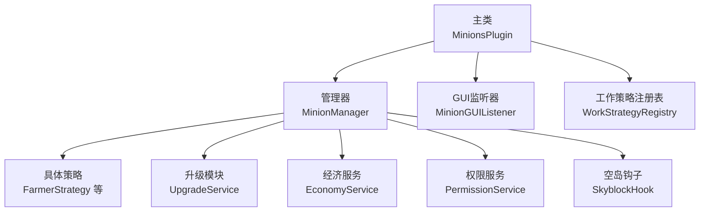
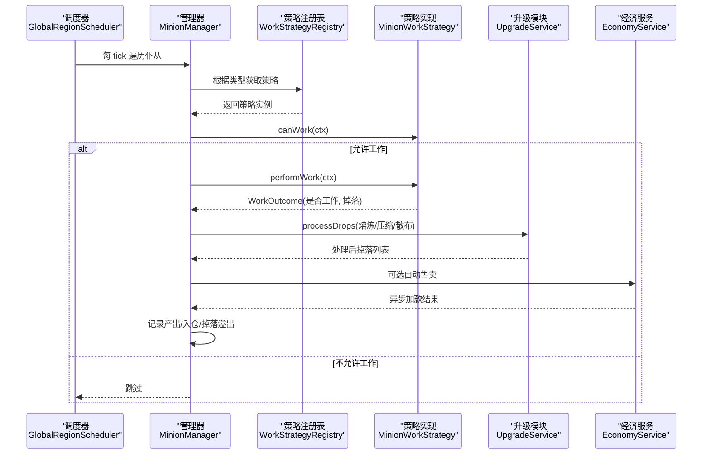
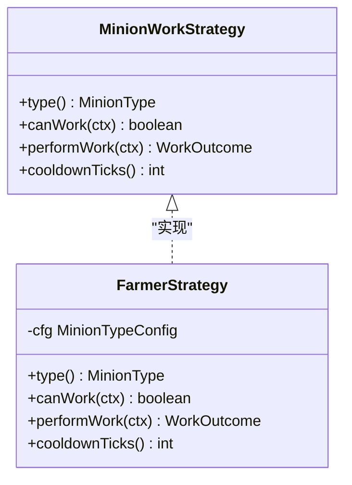
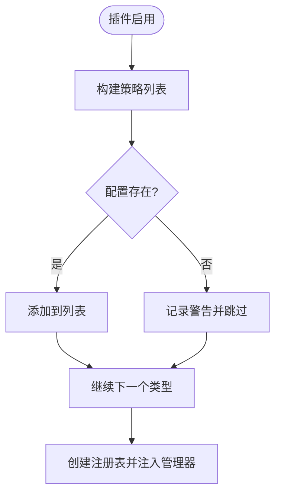
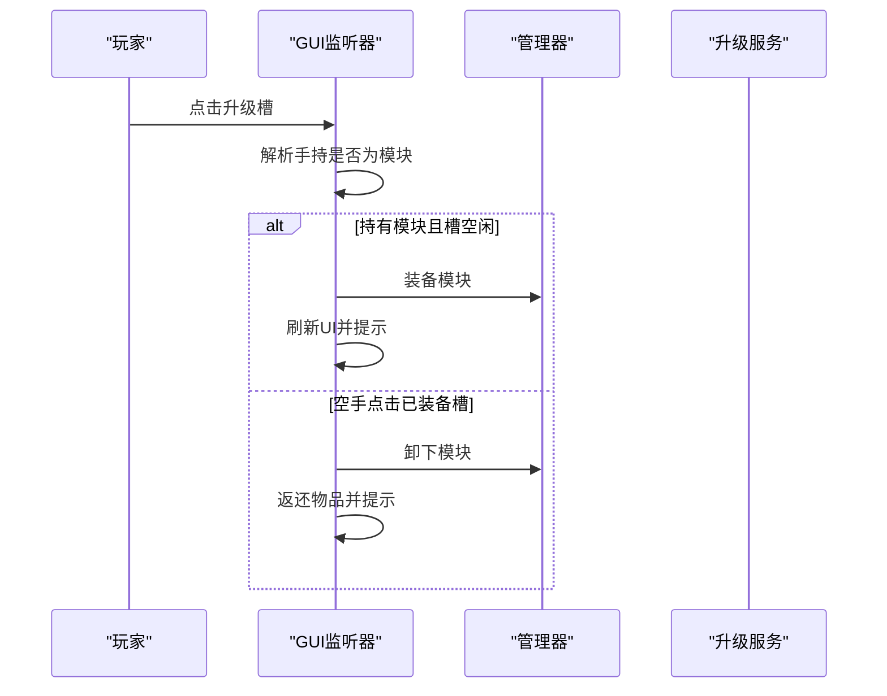
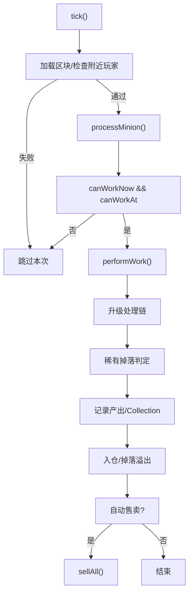
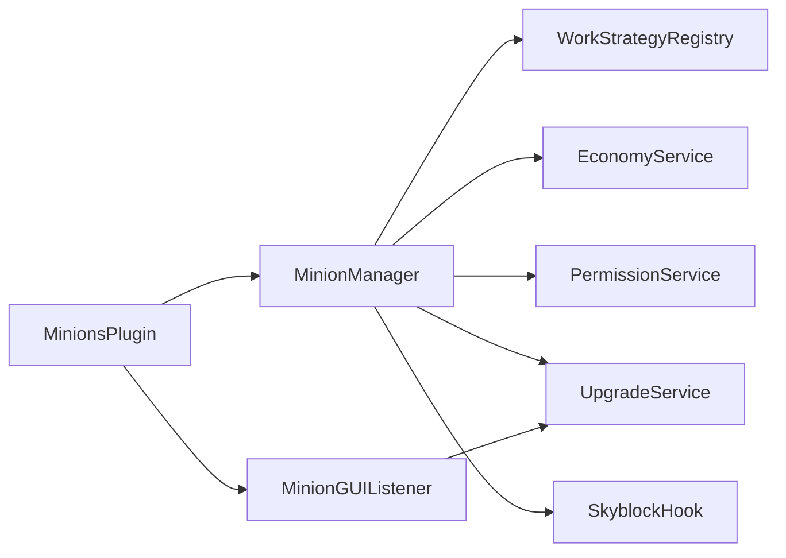

# 扩展开发指南

<cite>
**本文引用的文件**
- [MinionsPlugin.java](file://src/main/java/com/hcs/minions/MinionsPlugin.java)
- [MinionWorkStrategy.java](file://src/main/java/com/hcs/minions/work/MinionWorkStrategy.java)
- [WorkStrategyRegistry.java](file://src/main/java/com/hcs/minions/work/WorkStrategyRegistry.java)
- [MinionType.java](file://src/main/java/com/hcs/minions/model/MinionType.java)
- [MinionManager.java](file://src/main/java/com/hcs/minions/service/MinionManager.java)
- [FarmerStrategy.java](file://src/main/java/com/hcs/minions/work/farmer/FarmerStrategy.java)
- [MinionGUIListener.java](file://src/main/java/com/hcs/minions/gui/MinionGUIListener.java)
- [EconomyService.java](file://src/main/java/com/hcs/minions/service/EconomyService.java)
- [SkyblockHook.java](file://src/main/java/com/hcs/minions/service/hook/SkyblockHook.java)
- [PermissionService.java](file://src/main/java/com/hcs/minions/service/PermissionService.java)
- [UpgradeService.java](file://src/main/java/com/hcs/minions/upgrade/UpgradeService.java)
- [PluginConfig.java](file://src/main/java/com/hcs/minions/config/PluginConfig.java)
- [MinionTypeConfig.java](file://src/main/java/com/hcs/minions/config/MinionTypeConfig.java)
- [pom.xml](file://pom.xml)
</cite>

## 目录
1. [简介](#简介)
2. [项目结构](#项目结构)
3. [核心组件](#核心组件)
4. [架构总览](#架构总览)
5. [详细组件分析](#详细组件分析)
6. [依赖关系分析](#依赖关系分析)
7. [性能与兼容性](#性能与兼容性)
8. [故障排查](#故障排查)
9. [结论](#结论)
10. [附录：最佳实践清单](#附录最佳实践清单)

## 简介
本指南面向希望为 SkyMinions 插件添加新功能的开发者，重点覆盖以下目标：
- 新增仆从类型：实现 MinionWorkStrategy 接口、注册工作策略、定义配置与特性。
- 扩展 GUI：自定义界面元素、添加交互逻辑、处理用户输入。
- 集成第三方插件：Vault 经济、LuckPerms 权限、SuperiorSkyblock2 空岛限制等。
- 提供完整示例路径、错误处理、性能优化、兼容性与测试调试方法。

## 项目结构
SkyMinions 采用“主类装配 + 服务分层 + 策略模式”的架构：
- 主类负责生命周期与服务装配（命令、监听器、调度器）。
- 管理器统一编排工作循环、实体与存储。
- 工作策略按类型解耦，通过注册表查找。
- GUI 监听器集中处理玩家交互。
- 服务层封装 Vault、权限、升级模块、空岛联动等能力。

图表来源
- [MinionsPlugin.java:52-120](file://src/main/java/com/hcs/minions/MinionsPlugin.java#L52-L120)
- [MinionManager.java:92-115](file://src/main/java/com/hcs/minions/service/MinionManager.java#L92-L115)
- [MinionGUIListener.java:49-125](file://src/main/java/com/hcs/minions/gui/MinionGUIListener.java#L49-L125)

章节来源
- [MinionsPlugin.java:52-120](file://src/main/java/com/hcs/minions/MinionsPlugin.java#L52-L120)
- [MinionManager.java:92-115](file://src/main/java/com/hcs/minions/service/MinionManager.java#L92-L115)

## 核心组件
- 工作策略接口：定义 canWork / performWork / cooldownTicks，屏蔽 if-else 类型判断。
- 策略注册表：EnumMap 映射类型到策略，未注册类型抛出异常，保证开闭原则。
- 管理器：全局 tick 调度、区域线程委派、掉落处理链、自动售卖、实体管理。
- GUI 监听器：单界面 54 格交互，支持升级槽、皮肤切换、收集、拾取、关闭等。
- 服务层：经济（Vault）、权限（LuckPerms）、升级模块、空岛钩子（SuperiorSkyblock2）。

章节来源
- [MinionWorkStrategy.java:10-26](file://src/main/java/com/hcs/minions/work/MinionWorkStrategy.java#L10-L26)
- [WorkStrategyRegistry.java:14-33](file://src/main/java/com/hcs/minions/work/WorkStrategyRegistry.java#L14-L33)
- [MinionManager.java:191-322](file://src/main/java/com/hcs/minions/service/MinionManager.java#L191-L322)
- [MinionGUIListener.java:49-125](file://src/main/java/com/hcs/minions/gui/MinionGUIListener.java#L49-L125)

## 架构总览
下图展示一次工作周期从调度到策略执行、掉落处理与落盘的流程。

图表来源
- [MinionManager.java:252-322](file://src/main/java/com/hcs/minions/service/MinionManager.java#L252-L322)
- [UpgradeService.java:173-191](file://src/main/java/com/hcs/minions/upgrade/UpgradeService.java#L173-L191)
- [EconomyService.java:69-86](file://src/main/java/com/hcs/minions/service/EconomyService.java#L69-L86)

## 详细组件分析

### 新增仆从类型（实现 MinionWorkStrategy）
步骤概览：
1. 定义策略类并实现接口：type()、canWork()、performWork()、cooldownTicks()。
2. 在策略中通过 WorkContext 搜索目标方块、执行破坏与收集，返回 WorkOutcome。
3. 在主类启动时向注册表注册该策略（基于配置开关）。
4. 在配置中为该类型定义行为参数（范围、冷却、产物、稀有掉落等）。

图表来源
- [MinionWorkStrategy.java:10-26](file://src/main/java/com/hcs/minions/work/MinionWorkStrategy.java#L10-L26)
- [FarmerStrategy.java:20-71](file://src/main/java/com/hcs/minions/work/farmer/FarmerStrategy.java#L20-L71)

章节来源
- [MinionWorkStrategy.java:10-26](file://src/main/java/com/hcs/minions/work/MinionWorkStrategy.java#L10-L26)
- [FarmerStrategy.java:20-71](file://src/main/java/com/hcs/minions/work/farmer/FarmerStrategy.java#L20-L71)
- [MinionsPlugin.java:72-81](file://src/main/java/com/hcs/minions/MinionsPlugin.java#L72-L81)
- [MinionTypeConfig.java:21-64](file://src/main/java/com/hcs/minions/config/MinionTypeConfig.java#L21-L64)

### 注册工作策略
- 主类在 onEnable 中构建策略列表，依据配置逐项注册。
- 若配置缺失某类型，会记录警告并跳过注册。
- 注册表使用 EnumMap 以 O(1) 查找，未注册类型将抛异常。

图表来源
- [MinionsPlugin.java:72-81](file://src/main/java/com/hcs/minions/MinionsPlugin.java#L72-L81)
- [WorkStrategyRegistry.java:18-33](file://src/main/java/com/hcs/minions/work/WorkStrategyRegistry.java#L18-L33)

章节来源
- [MinionsPlugin.java:72-81](file://src/main/java/com/hcs/minions/MinionsPlugin.java#L72-L81)
- [WorkStrategyRegistry.java:18-33](file://src/main/java/com/hcs/minions/work/WorkStrategyRegistry.java#L18-L33)

### 定义仆从特性（配置与类型）
- MinionType 枚举承载类型键名、显示名与图标。
- MinionTypeConfig 强类型配置项：最大等级、效率曲线、燃料、冷却、售价、产物、升级材料、基础半径、目标方块集合、稀有掉落及概率。
- PluginConfig 作为不可变快照，提供 type(key) 查询，并对关键参数做校验（如 max-checks-per-cycle < 50）。

章节来源
- [MinionType.java:13-53](file://src/main/java/com/hcs/minions/model/MinionType.java#L13-L53)
- [MinionTypeConfig.java:21-64](file://src/main/java/com/hcs/minions/config/MinionTypeConfig.java#L21-L64)
- [PluginConfig.java:22-46](file://src/main/java/com/hcs/minions/config/PluginConfig.java#L22-L46)

### 扩展现有 GUI 功能
- MinionGUIListener 处理点击事件：升级槽、自动售卖开关、拾取、收集全部、皮肤切换、布局提示、关闭等。
- 可新增槽位或交互逻辑：在 onClick 中识别 slot，调用对应处理方法；必要时刷新 UI 并保存状态。
- 注意：Inventory 操作必须在区域线程进行，避免并发问题。

图表来源
- [MinionGUIListener.java:155-194](file://src/main/java/com/hcs/minions/gui/MinionGUIListener.java#L155-L194)
- [UpgradeService.java:114-140](file://src/main/java/com/hcs/minions/upgrade/UpgradeService.java#L114-L140)

章节来源
- [MinionGUIListener.java:49-125](file://src/main/java/com/hcs/minions/gui/MinionGUIListener.java#L49-L125)
- [MinionGUIListener.java:155-194](file://src/main/java/com/hcs/minions/gui/MinionGUIListener.java#L155-L194)

### 集成第三方插件
- Vault 经济：
  - 检测 Vault 是否启用，获取 Economy 服务。
  - 价格计算使用 BigDecimal 避免浮点误差，金额以“分”为单位。
  - 所有 Vault 调用在异步执行，成功后需校验响应类型。
- LuckPerms 权限：
  - 通过 Bukkit 权限系统对接 LP，无需硬依赖。
  - 支持 hcs.minions.admin、hcs.minions.type.<type>、hcs.minions.limit.<n> 等权限。
  - 数量上限通过单次遍历有效权限集合解析，避免多次 hasPermission 调用。
- SuperiorSkyblock2 空岛限制：
  - 放置时缓存岛屿 ID；工作循环读取缓存校验位置是否在岛内。
  - 宽松策略：无法确定岛屿或不处于空岛时不限制工作；重启后懒重缓存。

章节来源
- [EconomyService.java:38-86](file://src/main/java/com/hcs/minions/service/EconomyService.java#L38-L86)
- [PermissionService.java:19-74](file://src/main/java/com/hcs/minions/service/PermissionService.java#L19-L74)
- [SkyblockHook.java:19-79](file://src/main/java/com/hcs/minions/service/hook/SkyblockHook.java#L19-L79)
- [pom.xml:55-74](file://pom.xml#L55-L74)

### 工作循环与掉落处理链
- 管理器在 GlobalRegionScheduler 上遍历，仅做内存只读判断，真正触碰世界/实体的操作委派到 RegionScheduler。
- 工作前检查冷却、空岛限制；工作后计算冷却、挥动动画、升级处理链、稀有掉落、收集累计、入仓与溢出掉落、自动售卖。

图表来源
- [MinionManager.java:191-322](file://src/main/java/com/hcs/minions/service/MinionManager.java#L191-L322)
- [UpgradeService.java:173-191](file://src/main/java/com/hcs/minions/upgrade/UpgradeService.java#L173-L191)

章节来源
- [MinionManager.java:191-322](file://src/main/java/com/hcs/minions/service/MinionManager.java#L191-L322)

## 依赖关系分析
- 主类依赖：配置、仓库、经济、空岛钩子、策略注册表、实体服务、售卖、权限、升级、收集、异步执行器。
- 管理器依赖：策略注册表、搜索器、实体服务、售卖、权限、升级、收集、异步执行器。
- GUI 依赖：管理器、物品服务、实体服务、配置、升级服务。
- 服务间耦合：管理器协调各服务；策略仅依赖上下文与搜索器；升级服务纯函数化掉落处理。

图表来源
- [MinionsPlugin.java:52-120](file://src/main/java/com/hcs/minions/MinionsPlugin.java#L52-L120)
- [MinionManager.java:44-86](file://src/main/java/com/hcs/minions/service/MinionManager.java#L44-L86)
- [MinionGUIListener.java:32-47](file://src/main/java/com/hcs/minions/gui/MinionGUIListener.java#L32-L47)

章节来源
- [MinionsPlugin.java:52-120](file://src/main/java/com/hcs/minions/MinionsPlugin.java#L52-L120)
- [MinionManager.java:44-86](file://src/main/java/com/hcs/minions/service/MinionManager.java#L44-L86)
- [MinionGUIListener.java:32-47](file://src/main/java/com/hcs/minions/gui/MinionGUIListener.java#L32-L47)

## 性能与兼容性
- 线程安全与区域调度：
  - 全局 tick 只做轻量只读判断，区域绑定操作通过 RegionScheduler 委派，确保 Folia 兼容。
  - 快照落库在各自 region 线程生成数据，避免 Inventory 并发访问不一致。
- 性能优化：
  - 策略注册表使用 EnumMap，O(1) 查找。
  - 权限上限一次性遍历有效权限集合，避免多次 hasPermission。
  - 经济计算使用 BigDecimal，避免浮点误差。
  - 配置对 max-checks-per-cycle 做上限校验，防止过度扫描。
- 兼容性：
  - Vault 与 SuperiorSkyblock2 均为可选依赖，未启用时优雅降级。
  - 空岛限制采用宽松策略，非空岛不限制，重启后懒重缓存。

章节来源
- [MinionManager.java:117-160](file://src/main/java/com/hcs/minions/service/MinionManager.java#L117-L160)
- [MinionManager.java:191-215](file://src/main/java/com/hcs/minions/service/MinionManager.java#L191-L215)
- [PermissionService.java:41-74](file://src/main/java/com/hcs/minions/service/PermissionService.java#L41-L74)
- [EconomyService.java:55-86](file://src/main/java/com/hcs/minions/service/EconomyService.java#L55-L86)
- [PluginConfig.java:36-46](file://src/main/java/com/hcs/minions/config/PluginConfig.java#L36-L46)
- [SkyblockHook.java:49-79](file://src/main/java/com/hcs/minions/service/hook/SkyblockHook.java#L49-L79)

## 故障排查
- 未注册类型异常：
  - 现象：工作循环获取策略时抛出非法状态异常。
  - 排查：确认主类是否正确注册策略，配置是否存在该类型。
- 经济加款失败：
  - 现象：Vault 返回非 SUCCESS。
  - 排查：检查 Vault 是否启用、玩家名称是否可用、回调日志。
- GUI 崩溃或卡顿：
  - 现象：关闭 GUI 时出现并发修改异常。
  - 排查：确保 Inventory 操作在区域线程执行，关闭时保存状态。
- 空岛限制误判：
  - 现象：仆从无法工作。
  - 排查：确认是否处于空岛、缓存是否命中、重启后是否懒重缓存成功。

章节来源
- [WorkStrategyRegistry.java:26-33](file://src/main/java/com/hcs/minions/work/WorkStrategyRegistry.java#L26-L33)
- [EconomyService.java:69-86](file://src/main/java/com/hcs/minions/service/EconomyService.java#L69-L86)
- [MinionGUIListener.java:127-153](file://src/main/java/com/hcs/minions/gui/MinionGUIListener.java#L127-L153)
- [SkyblockHook.java:54-79](file://src/main/java/com/hcs/minions/service/hook/SkyblockHook.java#L54-L79)

## 结论
SkyMinions 通过策略模式与区域调度实现了高内聚、低耦合的可扩展架构。开发者只需实现 MinionWorkStrategy 并在主类注册，即可快速新增仆从类型；借助 GUI 监听器与服务层，可轻松扩展界面与第三方集成。遵循线程安全、性能优化与兼容性设计，可在多平台环境下稳定运行。

## 附录：最佳实践清单
- 新增仆从类型
  - 实现 MinionWorkStrategy，保持 canWork 语义清晰，performWork 只做一次限流搜索与破坏。
  - 在主类 onEnable 中按配置注册策略，缺失时记录警告。
  - 在 MinionTypeConfig 中定义产物、冷却、范围、稀有掉落等。
- GUI 扩展
  - 在 MinionGUIListener.onClick 中识别新槽位，调用对应处理方法。
  - 所有 Inventory 操作在区域线程执行，关闭时保存状态。
- 第三方集成
  - Vault：检测启用状态，异步调用并校验响应。
  - LuckPerms：通过 Bukkit 权限系统对接，避免硬依赖。
  - SuperiorSkyblock2：宽松策略，无法确定岛屿时不限制工作。
- 性能与兼容
  - 使用 EnumMap 注册表、批量落库、区域调度。
  - 配置校验与上限保护，避免过度扫描。
- 测试与调试
  - 单元测试升级模块的压缩与面积扩展算法。
  - 开启 debug 日志观察工作结果与稀有掉落触发。
  - 使用离线收益服务与 Collection 落盘验证持久化。

章节来源
- [MinionWorkStrategy.java:10-26](file://src/main/java/com/hcs/minions/work/MinionWorkStrategy.java#L10-L26)
- [MinionsPlugin.java:72-81](file://src/main/java/com/hcs/minions/MinionsPlugin.java#L72-L81)
- [MinionTypeConfig.java:21-64](file://src/main/java/com/hcs/minions/config/MinionTypeConfig.java#L21-L64)
- [MinionGUIListener.java:49-125](file://src/main/java/com/hcs/minions/gui/MinionGUIListener.java#L49-L125)
- [EconomyService.java:38-86](file://src/main/java/com/hcs/minions/service/EconomyService.java#L38-L86)
- [PermissionService.java:19-74](file://src/main/java/com/hcs/minions/service/PermissionService.java#L19-L74)
- [SkyblockHook.java:19-79](file://src/main/java/com/hcs/minions/service/hook/SkyblockHook.java#L19-L79)
- [UpgradeService.java:150-235](file://src/main/java/com/hcs/minions/upgrade/UpgradeService.java#L150-L235)