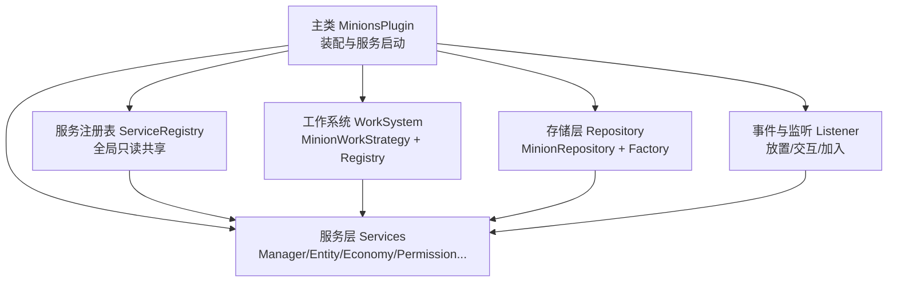
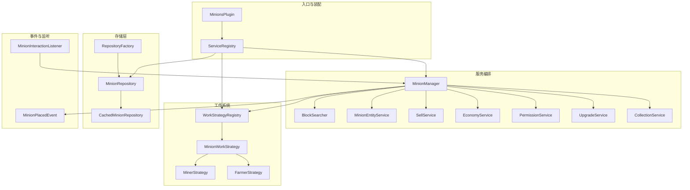
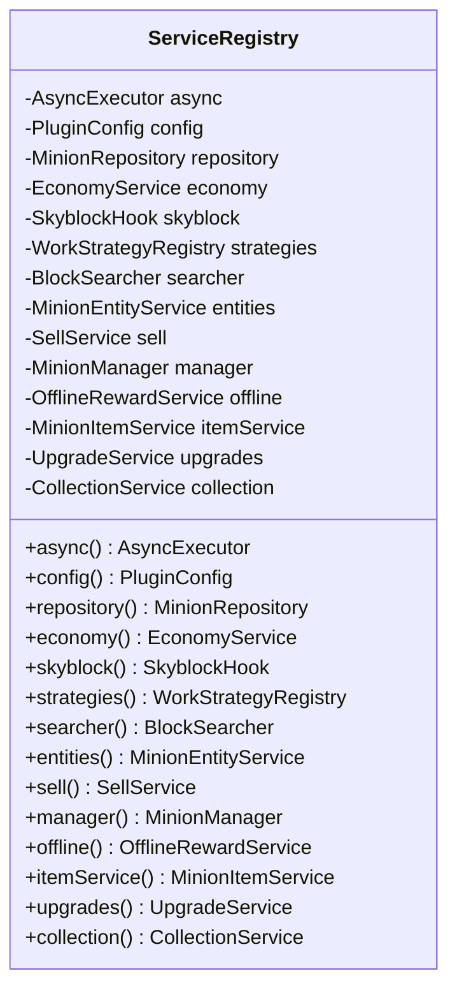
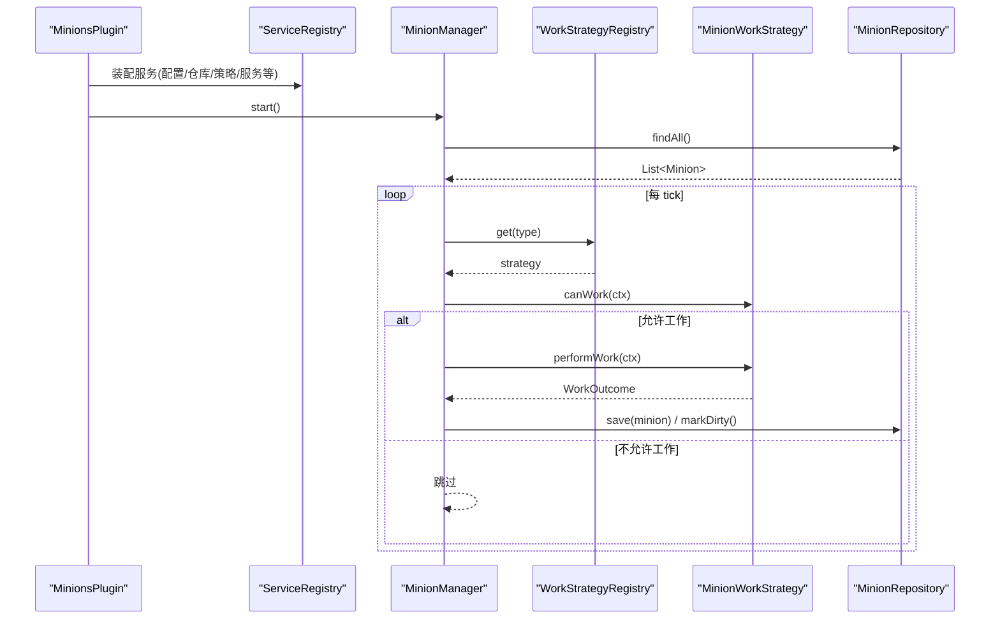
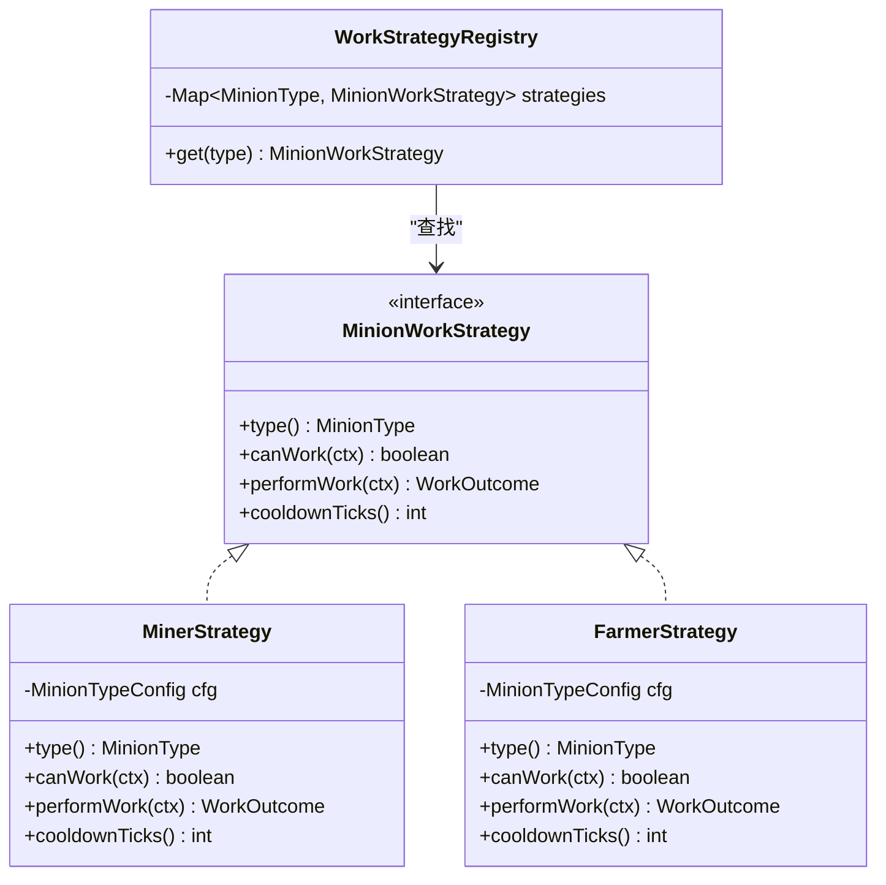
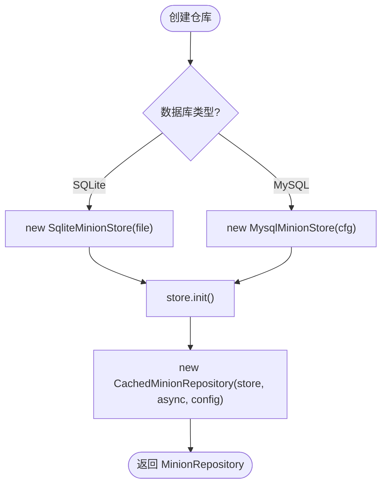
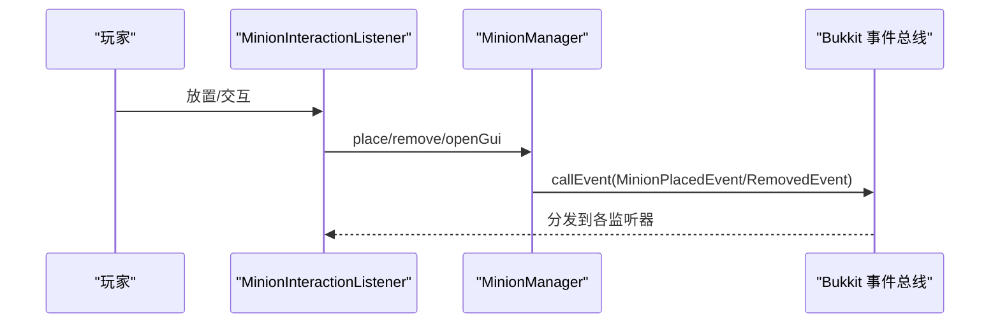
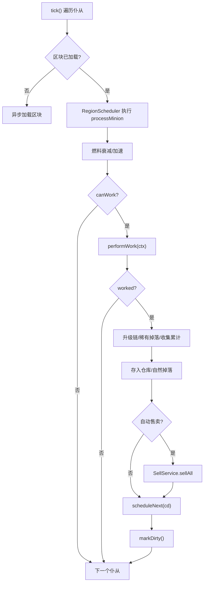
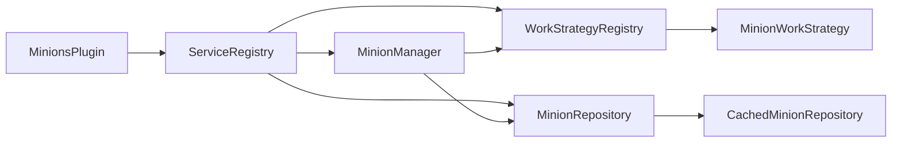

# 架构概览与设计模式

<cite>
**本文引用的文件**
- [MinionsPlugin.java](file://src/main/java/com/hcs/minions/MinionsPlugin.java)
- [ServiceRegistry.java](file://src/main/java/com/hcs/minions/core/ServiceRegistry.java)
- [MinionManager.java](file://src/main/java/com/hcs/minions/service/MinionManager.java)
- [MinionWorkStrategy.java](file://src/main/java/com/hcs/minions/work/MinionWorkStrategy.java)
- [WorkStrategyRegistry.java](file://src/main/java/com/hcs/minions/work/WorkStrategyRegistry.java)
- [RepositoryFactory.java](file://src/main/java/com/hcs/minions/repository/RepositoryFactory.java)
- [MinionRepository.java](file://src/main/java/com/hcs/minions/repository/MinionRepository.java)
- [CachedMinionRepository.java](file://src/main/java/com/hcs/minions/repository/CachedMinionRepository.java)
- [MinerStrategy.java](file://src/main/java/com/hcs/minions/work/miner/MinerStrategy.java)
- [FarmerStrategy.java](file://src/main/java/com/hcs/minions/work/farmer/FarmerStrategy.java)
- [MinionPlacedEvent.java](file://src/main/java/com/hcs/minions/event/MinionPlacedEvent.java)
- [MinionInteractionListener.java](file://src/main/java/com/hcs/minions/listener/MinionInteractionListener.java)
</cite>

## 目录
1. [简介](#简介)
2. [项目结构](#项目结构)
3. [核心组件](#核心组件)
4. [架构总览](#架构总览)
5. [详细组件分析](#详细组件分析)
6. [依赖关系分析](#依赖关系分析)
7. [性能考量](#性能考量)
8. [故障排查指南](#故障排查指南)
9. [结论](#结论)

## 简介
本文件面向希望理解 SkyMinions 插件整体设计与实现方式的开发者。文档围绕以下目标展开：
- 服务注册表模式（ServiceRegistry）的实现与作用
- 分层架构的设计思想与模块职责划分
- 策略模式在工作系统中的应用（MinionWorkStrategy 接口与具体实现）
- 工厂模式在数据存储层的使用（RepositoryFactory）
- 观察者模式在事件处理中的体现（Bukkit 事件机制）
- 包结构设计原则、模块间依赖关系与数据流向
- 通过架构图与代码级流程图帮助快速掌握核心设计理念

## 项目结构
SkyMinions 采用“按功能域分包 + 分层”的组织方式，核心层次包括：
- 入口与装配层：主类负责生命周期管理与服务装配
- 服务层：业务编排、调度、实体管理、经济、权限等
- 工作系统：策略模式驱动的不同类型仆从工作逻辑
- 存储层：统一的数据访问抽象与缓存实现
- 事件与监听：基于 Bukkit 的事件解耦通信
- 配置与工具：配置加载、异步执行器、日志与消息等

图表来源
- [MinionsPlugin.java:52-120](file://src/main/java/com/hcs/minions/MinionsPlugin.java#L52-L120)
- [ServiceRegistry.java:18-149](file://src/main/java/com/hcs/minions/core/ServiceRegistry.java#L18-L149)

章节来源
- [MinionsPlugin.java:45-142](file://src/main/java/com/hcs/minions/MinionsPlugin.java#L45-L142)
- [ServiceRegistry.java:18-149](file://src/main/java/com/hcs/minions/core/ServiceRegistry.java#L18-L149)

## 核心组件
- 服务注册表（ServiceRegistry）：组合根，集中持有所有服务实例，提供只读访问；主类在 onEnable 中按依赖顺序装配一次，运行期全局共享。
- 管理器（MinionManager）：全局单调度器，负责遍历、调度、区域线程委派、掉落处理、自动售卖、快照落库等。
- 工作系统（MinionWorkStrategy + WorkStrategyRegistry）：以策略模式将不同工作类型解耦，调度器仅面向接口编程。
- 存储层（MinionRepository + CachedMinionRepository + RepositoryFactory）：统一持久化抽象，内部带内存缓存与异步落库；工厂根据配置选择 SQLite/MySQL。
- 事件系统（MinionPlacedEvent 等）：通过自定义事件进行模块间解耦通信。
- 监听器（MinionInteractionListener）：处理放置、交互、拾取、燃料注入等玩家行为。

章节来源
- [MinionManager.java:39-86](file://src/main/java/com/hcs/minions/service/MinionManager.java#L39-L86)
- [MinionWorkStrategy.java:5-26](file://src/main/java/com/hcs/minions/work/MinionWorkStrategy.java#L5-L26)
- [WorkStrategyRegistry.java:10-33](file://src/main/java/com/hcs/minions/work/WorkStrategyRegistry.java#L10-L33)
- [MinionRepository.java:11-47](file://src/main/java/com/hcs/minions/repository/MinionRepository.java#L11-L47)
- [RepositoryFactory.java:11-30](file://src/main/java/com/hcs/minions/repository/RepositoryFactory.java#L11-L30)
- [MinionPlacedEvent.java:9-39](file://src/main/java/com/hcs/minions/event/MinionPlacedEvent.java#L9-L39)
- [MinionInteractionListener.java:31-157](file://src/main/java/com/hcs/minions/listener/MinionInteractionListener.java#L31-L157)

## 架构总览
SkyMinions 的分层设计清晰：
- 入口层：MinionsPlugin 仅做装配与生命周期管理，不承载业务逻辑
- 服务层：MinionManager 作为编排中心，协调各服务完成工作循环
- 策略层：MinionWorkStrategy 定义工作契约，WorkStrategyRegistry 提供类型到策略的映射
- 存储层：MinionRepository 抽象持久化，CachedMinionRepository 提供缓存与异步落库，RepositoryFactory 选择底层实现
- 事件层：通过 Bukkit 事件与自定义事件解耦模块间通信

图表来源
- [MinionsPlugin.java:52-120](file://src/main/java/com/hcs/minions/MinionsPlugin.java#L52-L120)
- [MinionManager.java:191-322](file://src/main/java/com/hcs/minions/service/MinionManager.java#L191-L322)
- [WorkStrategyRegistry.java:14-33](file://src/main/java/com/hcs/minions/work/WorkStrategyRegistry.java#L14-L33)
- [MinionWorkStrategy.java:10-26](file://src/main/java/com/hcs/minions/work/MinionWorkStrategy.java#L10-L26)
- [RepositoryFactory.java:20-29](file://src/main/java/com/hcs/minions/repository/RepositoryFactory.java#L20-L29)
- [MinionInteractionListener.java:54-142](file://src/main/java/com/hcs/minions/listener/MinionInteractionListener.java#L54-L142)

## 详细组件分析

### 服务注册表模式（ServiceRegistry）
- 角色：组合根，集中持有所有服务实例，提供只读访问
- 设计要点：
  - 主类在 onEnable 中按依赖顺序设置各项服务，之后全局只读共享
  - 避免运行时修改导致的状态不一致
  - 为其他模块提供稳定的依赖注入点

图表来源
- [ServiceRegistry.java:18-149](file://src/main/java/com/hcs/minions/core/ServiceRegistry.java#L18-L149)

章节来源
- [MinionsPlugin.java:52-120](file://src/main/java/com/hcs/minions/MinionsPlugin.java#L52-L120)
- [ServiceRegistry.java:18-149](file://src/main/java/com/hcs/minions/core/ServiceRegistry.java#L18-L149)

### 分层架构与数据流
- 入口层：MinionsPlugin 装配服务并启动调度器
- 服务层：MinionManager 周期遍历，委派到区域线程执行工作
- 策略层：根据 MinionType 查找对应策略，调用 canWork/performWork/cooldownTicks
- 存储层：MinionRepository 提供异步读写，CachedMinionRepository 维护内存缓存与脏标记
- 事件层：放置/移除时触发事件，监听器响应业务逻辑

图表来源
- [MinionsPlugin.java:52-120](file://src/main/java/com/hcs/minions/MinionsPlugin.java#L52-L120)
- [MinionManager.java:92-115](file://src/main/java/com/hcs/minions/service/MinionManager.java#L92-L115)
- [WorkStrategyRegistry.java:14-33](file://src/main/java/com/hcs/minions/work/WorkStrategyRegistry.java#L14-L33)
- [MinionWorkStrategy.java:10-26](file://src/main/java/com/hcs/minions/work/MinionWorkStrategy.java#L10-L26)
- [MinionRepository.java:11-47](file://src/main/java/com/hcs/minions/repository/MinionRepository.java#L11-L47)

章节来源
- [MinionManager.java:92-322](file://src/main/java/com/hcs/minions/service/MinionManager.java#L92-L322)

### 策略模式在工作系统中的应用
- 接口设计：MinionWorkStrategy 定义 type()/canWork()/performWork()/cooldownTicks()
- 注册表：WorkStrategyRegistry 使用 EnumMap 维护类型到策略的映射，支持开闭原则
- 具体实现：
  - MinerStrategy：螺旋搜索可采矿，破坏并采集掉落
  - FarmerStrategy：收割成熟作物，原地补种
- 调度：MinionManager 根据 MinionType 获取策略并执行，避免 if-else 堆砌

图表来源
- [MinionWorkStrategy.java:5-26](file://src/main/java/com/hcs/minions/work/MinionWorkStrategy.java#L5-L26)
- [WorkStrategyRegistry.java:10-33](file://src/main/java/com/hcs/minions/work/WorkStrategyRegistry.java#L10-L33)
- [MinerStrategy.java:15-57](file://src/main/java/com/hcs/minions/work/miner/MinerStrategy.java#L15-L57)
- [FarmerStrategy.java:17-71](file://src/main/java/com/hcs/minions/work/farmer/FarmerStrategy.java#L17-L71)

章节来源
- [MinerStrategy.java:15-57](file://src/main/java/com/hcs/minions/work/miner/MinerStrategy.java#L15-L57)
- [FarmerStrategy.java:17-71](file://src/main/java/com/hcs/minions/work/farmer/FarmerStrategy.java#L17-L71)
- [WorkStrategyRegistry.java:10-33](file://src/main/java/com/hcs/minions/work/WorkStrategyRegistry.java#L10-L33)

### 工厂模式在数据存储层的使用
- 工厂：RepositoryFactory.create 根据 DatabaseConfig 选择 SQLite 或 MySQL 实现
- 抽象：MinionRepository 暴露统一接口，业务层无感知底层差异
- 实现：CachedMinionRepository 提供内存缓存、脏标记、批量异步落库
- 优势：新增存储后端只需实现 MinionStore 并在工厂中注册

图表来源
- [RepositoryFactory.java:20-29](file://src/main/java/com/hcs/minions/repository/RepositoryFactory.java#L20-L29)
- [MinionRepository.java:11-47](file://src/main/java/com/hcs/minions/repository/MinionRepository.java#L11-L47)
- [CachedMinionRepository.java:19-42](file://src/main/java/com/hcs/minions/repository/CachedMinionRepository.java#L19-L42)

章节来源
- [RepositoryFactory.java:11-30](file://src/main/java/com/hcs/minions/repository/RepositoryFactory.java#L11-L30)
- [MinionRepository.java:11-47](file://src/main/java/com/hcs/minions/repository/MinionRepository.java#L11-L47)
- [CachedMinionRepository.java:19-215](file://src/main/java/com/hcs/minions/repository/CachedMinionRepository.java#L19-L215)

### 观察者模式在事件处理中的体现
- 事件：MinionPlacedEvent 等自定义事件用于模块间解耦
- 监听：MinionInteractionListener 处理放置、交互等行为，触发相应业务逻辑
- 发布：MinionManager 在放置/移除时调用 Bukkit 事件，订阅者独立扩展

图表来源
- [MinionInteractionListener.java:54-142](file://src/main/java/com/hcs/minions/listener/MinionInteractionListener.java#L54-L142)
- [MinionPlacedEvent.java:9-39](file://src/main/java/com/hcs/minions/event/MinionPlacedEvent.java#L9-L39)
- [MinionManager.java:356-383](file://src/main/java/com/hcs/minions/service/MinionManager.java#L356-L383)

章节来源
- [MinionInteractionListener.java:31-157](file://src/main/java/com/hcs/minions/listener/MinionInteractionListener.java#L31-L157)
- [MinionPlacedEvent.java:9-39](file://src/main/java/com/hcs/minions/event/MinionPlacedEvent.java#L9-L39)
- [MinionManager.java:356-383](file://src/main/java/com/hcs/minions/service/MinionManager.java#L356-L383)

### 关键流程：工作循环与落库
- 工作循环：tick 遍历所有仆从，检查区块加载与附近玩家，委派到区域线程执行 processMinion
- 策略执行：根据类型获取策略，判断 canWork，执行 performWork，计算冷却时间
- 掉落处理：升级链处理、稀有掉落、收集累计、存入仓库或自然掉落
- 自动售卖：满足条件时调用 SellService 售卖
- 落库：周期性收集脏 ID，在区域线程生成快照后批量异步落库

图表来源
- [MinionManager.java:191-322](file://src/main/java/com/hcs/minions/service/MinionManager.java#L191-L322)
- [CachedMinionRepository.java:100-153](file://src/main/java/com/hcs/minions/repository/CachedMinionRepository.java#L100-L153)

章节来源
- [MinionManager.java:191-322](file://src/main/java/com/hcs/minions/service/MinionManager.java#L191-L322)
- [CachedMinionRepository.java:100-153](file://src/main/java/com/hcs/minions/repository/CachedMinionRepository.java#L100-L153)

## 依赖关系分析
- 低耦合：服务层通过 ServiceRegistry 获取依赖，避免硬编码构造
- 高内聚：每个模块职责明确，如工作系统专注策略，存储层专注持久化
- 可扩展：新增工作类型只需实现 MinionWorkStrategy 并注册；新增存储后端只需实现 MinionStore 并在工厂注册
- 线程安全：区域线程委派确保对世界状态的操作安全；缓存与脏标记保证并发写一致性

图表来源
- [MinionsPlugin.java:52-120](file://src/main/java/com/hcs/minions/MinionsPlugin.java#L52-L120)
- [ServiceRegistry.java:18-149](file://src/main/java/com/hcs/minions/core/ServiceRegistry.java#L18-L149)
- [MinionManager.java:39-86](file://src/main/java/com/hcs/minions/service/MinionManager.java#L39-L86)
- [WorkStrategyRegistry.java:14-33](file://src/main/java/com/hcs/minions/work/WorkStrategyRegistry.java#L14-L33)
- [MinionRepository.java:11-47](file://src/main/java/com/hcs/minions/repository/MinionRepository.java#L11-L47)
- [CachedMinionRepository.java:19-42](file://src/main/java/com/hcs/minions/repository/CachedMinionRepository.java#L19-L42)

章节来源
- [MinionsPlugin.java:52-120](file://src/main/java/com/hcs/minions/MinionsPlugin.java#L52-L120)
- [ServiceRegistry.java:18-149](file://src/main/java/com/hcs/minions/core/ServiceRegistry.java#L18-L149)
- [MinionManager.java:39-86](file://src/main/java/com/hcs/minions/service/MinionManager.java#L39-L86)

## 性能考量
- 区域线程委派：所有涉及世界状态的操作均在 RegionScheduler 上执行，避免跨线程访问导致的竞态
- 内存缓存：CachedMinionRepository 使用 ConcurrentHashMap 提供 O(1) 读取，减少数据库压力
- 批量落库：脏标记集合驱动批量异步写入，降低 IO 频率
- 虚拟线程：阻塞 SQL 操作通过 AsyncExecutor 提交到虚拟线程，主线程零阻塞
- 自动售卖轮询：在 GlobalRegionScheduler 上遍历，逐个委派到区域线程判断并售卖，避免直接访问 Inventory

[本节为通用性能指导，无需特定文件引用]

## 故障排查指南
- 未注册的工作类型：WorkStrategyRegistry.get 抛出异常，需检查是否在 MinionsPlugin 中正确注册策略
- 数据丢失风险：关闭前必须关闭 GUI 并同步冲刷脏数据，避免 Inventory 中间态导致序列化不一致
- 区块未加载：tick 中会异步加载区块，若失败则记录错误日志并跳过该仆当
- 权限限制：放置受权限控制，若无权限将提示并取消放置
- 区域限制：Skyblock 钩子可能限制放置位置，需检查岛屿规则

章节来源
- [WorkStrategyRegistry.java:26-33](file://src/main/java/com/hcs/minions/work/WorkStrategyRegistry.java#L26-L33)
- [MinionManager.java:162-180](file://src/main/java/com/hcs/minions/service/MinionManager.java#L162-L180)
- [MinionInteractionListener.java:54-94](file://src/main/java/com/hcs/minions/listener/MinionInteractionListener.java#L54-L94)

## 结论
SkyMinions 通过服务注册表、策略模式、工厂模式与观察者模式的有机结合，实现了高内聚、低耦合、易扩展的分层架构。工作系统以策略为核心，存储层以缓存与异步落库提升性能，事件机制保障模块间解耦。整体设计遵循清晰的职责划分与线程安全原则，适合大规模服务器环境下的稳定运行与持续演进。