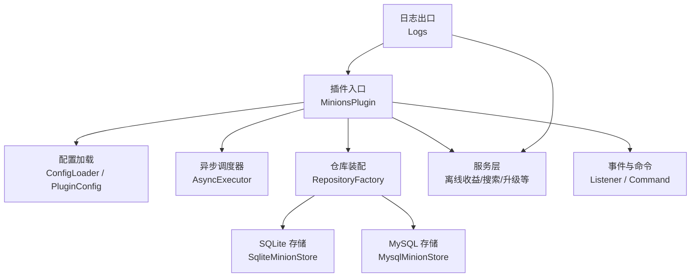
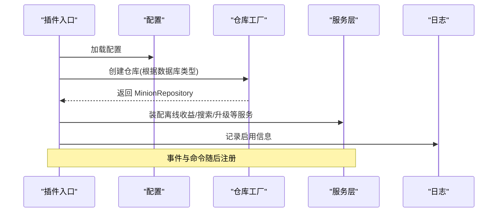
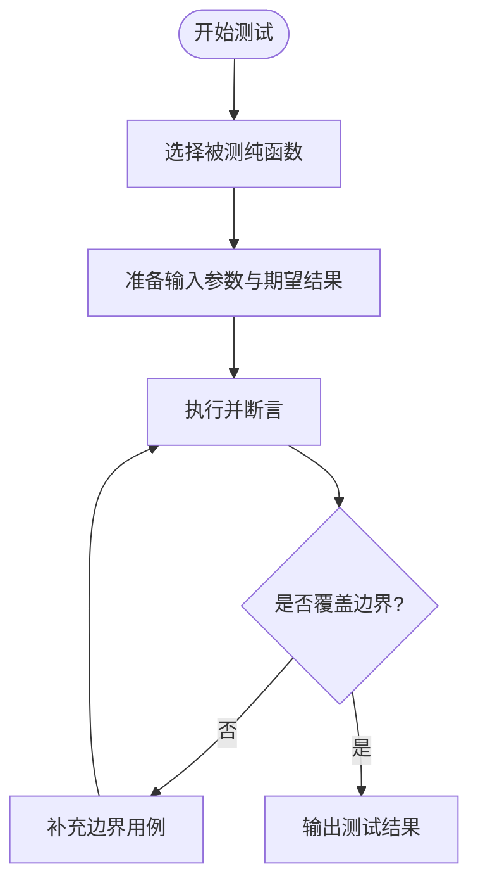
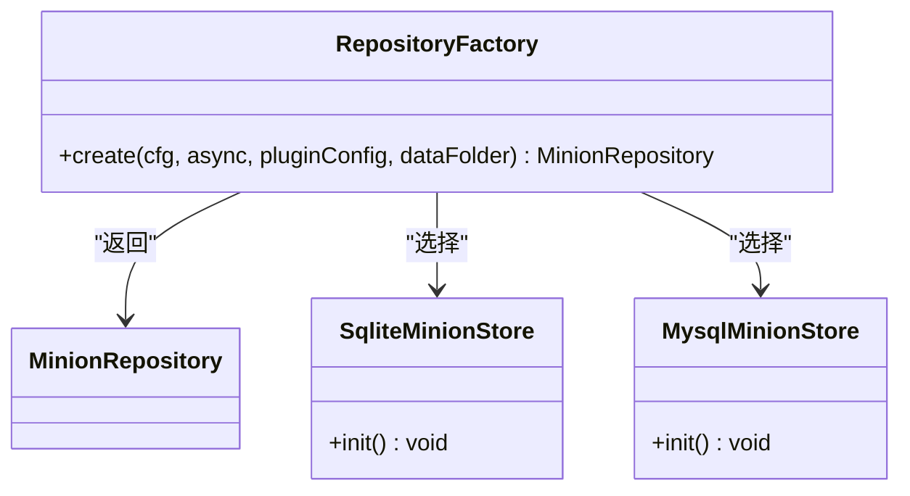
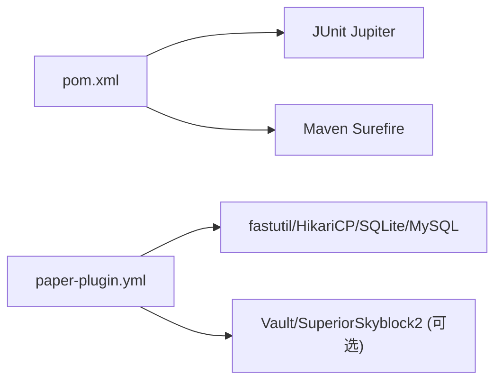

# 测试与调试

<cite>
**本文引用的文件**
- [pom.xml](file://pom.xml)
- [MinionsPlugin.java](file://src/main/java/com/hcs/minions/MinionsPlugin.java)
- [CollectionConfig.java](file://src/main/java/com/hcs/minions/config/CollectionConfig.java)
- [BlockSearcher.java](file://src/main/java/com/hcs/minions/service/BlockSearcher.java)
- [OfflineRewardService.java](file://src/main/java/com/hcs/minions/service/OfflineRewardService.java)
- [UpgradeService.java](file://src/main/java/com/hcs/minions/upgrade/UpgradeService.java)
- [Logs.java](file://src/main/java/com/hcs/minions/util/Logs.java)
- [paper-plugin.yml](file://src/main/resources/paper-plugin.yml)
- [config.yml](file://src/main/resources/config.yml)
- [DatabaseConfig.java](file://src/main/java/com/hcs/minions/config/DatabaseConfig.java)
- [RepositoryFactory.java](file://src/main/java/com/hcs/minions/repository/RepositoryFactory.java)
- [MysqlMinionStore.java](file://src/main/java/com/hcs/minions/repository/mysql/MysqlMinionStore.java)
- [SqliteMinionStore.java](file://src/main/java/com/hcs/minions/repository/sqlite/SqliteMinionStore.java)
- [CollectionConfigTest.java](file://src/test/java/com/hcs/minions/config/CollectionConfigTest.java)
- [BlockSearcherTest.java](file://src/test/java/com/hcs/minions/service/BlockSearcherTest.java)
- [OfflineRewardServiceTest.java](file://src/test/java/com/hcs/minions/service/OfflineRewardServiceTest.java)
- [UpgradeServiceTest.java](file://src/test/java/com/hcs/minions/upgrade/UpgradeServiceTest.java)
</cite>

## 目录
1. [简介](#简介)
2. [项目结构](#项目结构)
3. [核心组件](#核心组件)
4. [架构总览](#架构总览)
5. [详细组件分析](#详细组件分析)
6. [依赖关系分析](#依赖关系分析)
7. [性能考量](#性能考量)
8. [故障排查指南](#故障排查指南)
9. [结论](#结论)
10. [附录](#附录)

## 简介
本指南面向 SkyMinions 仆从系统的开发者，提供覆盖单元测试、集成测试、性能测试与调试的完整实践。内容基于仓库现有实现与测试用例，帮助你在保证代码质量的同时快速定位问题，并给出可操作的优化建议。

## 项目结构
SkyMinions 采用分层与模块化设计：
- 插件入口与装配：主类负责生命周期管理与服务装配，事件注册与命令绑定。
- 业务服务层：包含离线收益结算、方块搜索、升级处理等核心逻辑。
- 配置与资源：强类型配置对象与 YAML 配置文件，运行时只读共享。
- 数据持久化：SQLite/MySQL 双实现，统一通过工厂装配与缓存封装。
- 测试：使用 JUnit Jupiter 对纯函数与关键算法进行单测验证。

图表来源
- [MinionsPlugin.java:52-120](file://src/main/java/com/hcs/minions/MinionsPlugin.java#L52-L120)
- [RepositoryFactory.java:20-29](file://src/main/java/com/hcs/minions/repository/RepositoryFactory.java#L20-L29)
- [MysqlMinionStore.java:64-92](file://src/main/java/com/hcs/minions/repository/mysql/MysqlMinionStore.java#L64-L92)
- [SqliteMinionStore.java:1-41](file://src/main/java/com/hcs/minions/repository/sqlite/SqliteMinionStore.java#L1-L41)
- [Logs.java:1-33](file://src/main/java/com/hcs/minions/util/Logs.java#L1-L33)

章节来源
- [MinionsPlugin.java:52-120](file://src/main/java/com/hcs/minions/MinionsPlugin.java#L52-L120)
- [paper-plugin.yml:1-47](file://src/main/resources/paper-plugin.yml#L1-L47)
- [config.yml:1-153](file://src/main/resources/config.yml#L1-L153)

## 核心组件
- 插件入口与装配：集中管理配置、异步调度、仓库、服务、事件与命令的初始化与关闭流程。
- 配置系统：强类型记录（如 CollectionConfig、DatabaseConfig）配合 YAML，避免运行时散落的 getConfig()。
- 服务层：
  - 离线收益结算：按时间差批量模拟产出，限制上限与效率折扣，幂等落库。
  - 方块搜索器：两阶段螺旋扫描，近处优先、远处游标推进，单周期检查数受限。
  - 升级模块：自动熔炼/压缩/超级压缩/钻石散布的处理链，面积扩展计算。
- 日志与异常：统一 SLF4J 输出，禁止空 catch，捕获后必须记录并优雅降级。

章节来源
- [MinionsPlugin.java:52-120](file://src/main/java/com/hcs/minions/MinionsPlugin.java#L52-L120)
- [CollectionConfig.java:17-63](file://src/main/java/com/hcs/minions/config/CollectionConfig.java#L17-L63)
- [DatabaseConfig.java:1-20](file://src/main/java/com/hcs/minions/config/DatabaseConfig.java#L1-L20)
- [OfflineRewardService.java:15-100](file://src/main/java/com/hcs/minions/service/OfflineRewardService.java#L15-L100)
- [BlockSearcher.java:14-93](file://src/main/java/com/hcs/minions/service/BlockSearcher.java#L14-L93)
- [UpgradeService.java:20-237](file://src/main/java/com/hcs/minions/upgrade/UpgradeService.java#L20-L237)
- [Logs.java:1-33](file://src/main/java/com/hcs/minions/util/Logs.java#L1-L33)

## 架构总览
下图展示插件启动时的装配顺序与服务间调用关系，便于理解测试切入点与集成边界。

图表来源
- [MinionsPlugin.java:52-120](file://src/main/java/com/hcs/minions/MinionsPlugin.java#L52-L120)
- [RepositoryFactory.java:20-29](file://src/main/java/com/hcs/minions/repository/RepositoryFactory.java#L20-L29)
- [Logs.java:20-31](file://src/main/java/com/hcs/minions/util/Logs.java#L20-L31)

## 详细组件分析

### 单元测试编写与实践
- 测试框架与执行：使用 JUnit Jupiter 与 Maven Surefire 执行测试。
- 测试策略：
  - 纯函数优先：对无副作用的计算方法（如里程碑判定、离线产出折算、压缩换算、半径扩展）编写单测，确保正确性。
  - 断言方法：使用 assertEquals/assertArrayEquals/assertTrue/assertFalse 等断言覆盖边界与异常路径。
  - Mock 对象：由于当前测试聚焦纯函数，未引入外部依赖；如需测试服务层对外部 API 的调用，建议使用 Mockito 或平台提供的测试工具进行隔离。
- 已有测试要点：
  - 里程碑阈值与槽位加成：验证 reachedIndex/thresholdOf/bonusSlotsFor 的行为与防御性拷贝。
  - 方块搜索偏移生成：验证数量、排除原点、距离排序。
  - 离线产出折算：验证时间差到产出的换算、上限截断、效率缩放。
  - 升级压缩与面积扩展：验证压缩比例与半径反推逻辑。

章节来源
- [pom.xml:104-110](file://pom.xml#L104-L110)
- [pom.xml:124-128](file://pom.xml#L124-L128)
- [CollectionConfigTest.java:1-96](file://src/test/java/com/hcs/minions/config/CollectionConfigTest.java#L1-L96)
- [BlockSearcherTest.java:1-44](file://src/test/java/com/hcs/minions/service/BlockSearcherTest.java#L1-L44)
- [OfflineRewardServiceTest.java:1-33](file://src/test/java/com/hcs/minions/service/OfflineRewardServiceTest.java#L1-L33)
- [UpgradeServiceTest.java:1-45](file://src/test/java/com/hcs/minions/upgrade/UpgradeServiceTest.java#L1-L45)

### 集成测试策略
- 数据库测试：
  - SQLite：适合本地开发，单连接串行写入，适合端到端验证数据一致性。
  - MySQL：使用 HikariCP 连接池，注意连接超时与预编译语句缓存配置，建议在 CI 中提供临时 MySQL 实例。
  - 通过 RepositoryFactory 按配置切换实现，测试时可通过注入不同 Store 或使用内存数据库容器。
- 网络请求测试：本项目为服务端插件，不涉及 HTTP 客户端；若未来引入外部 API，建议使用 WireMock 或 Testcontainers 进行隔离。
- 插件间交互测试：Vault、SuperiorSkyblock2 为可选软依赖，测试时应覆盖缺失依赖场景，确保功能降级可用。

图表来源
- [RepositoryFactory.java:20-29](file://src/main/java/com/hcs/minions/repository/RepositoryFactory.java#L20-L29)
- [SqliteMinionStore.java:1-41](file://src/main/java/com/hcs/minions/repository/sqlite/SqliteMinionStore.java#L1-L41)
- [MysqlMinionStore.java:64-92](file://src/main/java/com/hcs/minions/repository/mysql/MysqlMinionStore.java#L64-L92)

章节来源
- [RepositoryFactory.java:20-29](file://src/main/java/com/hcs/minions/repository/RepositoryFactory.java#L20-L29)
- [MysqlMinionStore.java:64-92](file://src/main/java/com/hcs/minions/repository/mysql/MysqlMinionStore.java#L64-L92)
- [paper-plugin.yml:8-22](file://src/main/resources/paper-plugin.yml#L8-L22)

### 性能测试方法
- 内存使用分析：
  - 关注大对象分配：如大量 ItemStack 列表、偏移列表缓存。
  - 使用 VisualVM 或 JProfiler 在服务器环境附加进程，观察堆增长与 GC 行为。
- CPU 性能监控：
  - 重点热点：方块搜索的两阶段扫描、升级处理链、离线收益批量折算。
  - 使用 PaperMC 内置性能报告（/tps、/timings）与第三方插件（Spark）定位瓶颈。
- 并发测试：
  - 虚拟线程与 JDBC：MySQL 阻塞 IO 会使虚拟线程固定载体线程，保持小连接池（默认 4），避免堆积。
  - 通过压测脚本模拟多玩家同时离线登录与在线工作，观察延迟与吞吐。

[本节为通用指导，不直接分析具体文件]

### 调试技巧
- 日志分析：
  - 统一通过 Logs 输出，开启 debug 开关获取更详细信息。
  - 关注错误日志中的异常栈，结合上下文定位问题。
- 断点调试：
  - 在 IDE 中对关键方法设置断点（如 computeUnits、processDrops、find）。
  - 使用远程调试模式连接运行中的 Paper 服务器。
- 远程调试：
  - 在启动参数中添加 Java 调试端口，IDE 以远程方式附加。
  - 注意生产环境谨慎暴露调试端口。

章节来源
- [Logs.java:1-33](file://src/main/java/com/hcs/minions/util/Logs.java#L1-L33)
- [config.yml:10-11](file://src/main/resources/config.yml#L10-L11)

### 常用调试工具与插件
- JProfiler/VisualVM：用于内存与 CPU 分析。
- PaperMC 调试命令：/tps、/timings、/spark 等用于性能诊断。
- 日志工具：SLF4J 与 Paper 控制台输出，结合 grep/awk 过滤关键信息。

[本节为通用指导，不直接分析具体文件]

## 依赖关系分析
- 构建与测试依赖：JUnit Jupiter 与 Maven Surefire 用于单元测试执行。
- 运行时依赖：Paper API、SLF4J、fastutil、HikariCP、SQLite/MySQL 驱动由 paper-plugin.yml 的 libraries 声明，运行时由 Paper 自动下载。
- 软依赖：Vault、SuperiorSkyblock2 为可选，缺失时功能降级。

图表来源
- [pom.xml:104-110](file://pom.xml#L104-L110)
- [pom.xml:124-128](file://pom.xml#L124-L128)
- [paper-plugin.yml:8-22](file://src/main/resources/paper-plugin.yml#L8-L22)

章节来源
- [pom.xml:104-110](file://pom.xml#L104-L110)
- [pom.xml:124-128](file://pom.xml#L124-L128)
- [paper-plugin.yml:8-22](file://src/main/resources/paper-plugin.yml#L8-L22)

## 性能考量
- 方块搜索限流：单周期最大检查数硬限制（HARD_LIMIT=48），避免卡顿。
- 离线收益上限：单次结算最多折算固定单位数，防止极端情况导致长时间计算。
- 连接池大小：MySQL 连接池保持小规模，避免虚拟线程固定导致的资源耗尽。
- 升级处理链：仅做类型替换与数量换算，不修改入参，减少额外开销。

章节来源
- [BlockSearcher.java:24-32](file://src/main/java/com/hcs/minions/service/BlockSearcher.java#L24-L32)
- [OfflineRewardService.java:55-73](file://src/main/java/com/hcs/minions/service/OfflineRewardService.java#L55-L73)
- [MysqlMinionStore.java:73-84](file://src/main/java/com/hcs/minions/repository/mysql/MysqlMinionStore.java#L73-L84)
- [UpgradeService.java:173-191](file://src/main/java/com/hcs/minions/upgrade/UpgradeService.java#L173-L191)

## 故障排查指南
- 常见问题与定位：
  - 数据库初始化失败：检查 MySQL 驱动加载与连接参数，查看错误日志。
  - 离线收益未发放：确认 lastActive 更新与幂等逻辑，核对时间差与上限。
  - 方块搜索无结果：检查 chunk 加载状态与目标 Predicate 条件。
  - 升级效果异常：核对升级类型与映射表，确认处理链顺序。
- 日志与异常：
  - 所有异常必须记录并优雅降级，避免吞异常。
  - 使用 Logs.error 输出异常栈，结合上下文定位根因。

章节来源
- [MysqlMinionStore.java:64-92](file://src/main/java/com/hcs/minions/repository/mysql/MysqlMinionStore.java#L64-L92)
- [OfflineRewardService.java:29-81](file://src/main/java/com/hcs/minions/service/OfflineRewardService.java#L29-L81)
- [BlockSearcher.java:34-66](file://src/main/java/com/hcs/minions/service/BlockSearcher.java#L34-L66)
- [UpgradeService.java:173-191](file://src/main/java/com/hcs/minions/upgrade/UpgradeService.java#L173-L191)
- [Logs.java:20-31](file://src/main/java/com/hcs/minions/util/Logs.java#L20-L31)

## 结论
通过严格的单元测试覆盖纯函数与关键算法，结合集成测试验证数据持久化与插件交互，辅以性能测试与系统化调试手段，可有效保障 SkyMinions 的代码质量与稳定性。建议在持续集成中自动化执行测试，并在生产环境启用结构化日志与性能监控。

## 附录
- 配置项参考：
  - 全局调度：tick-period、max-checks-per-cycle、max-minions-per-player。
  - 数据库：type、sqlite-file、host/port/database/user/password、pool-size。
  - 离线收益：enabled、max-hours、rate-multiplier。
  - 收集里程碑：enabled、milestones、coins-base、slot-milestones。
  - 各类型仆从：display-name、base-efficiency、cooldown-ticks、product、targets 等。

章节来源
- [config.yml:4-153](file://src/main/resources/config.yml#L4-L153)