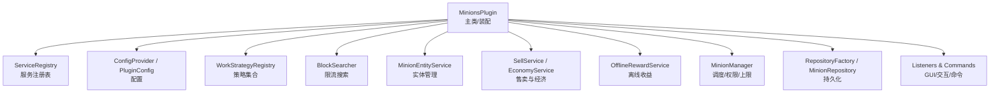
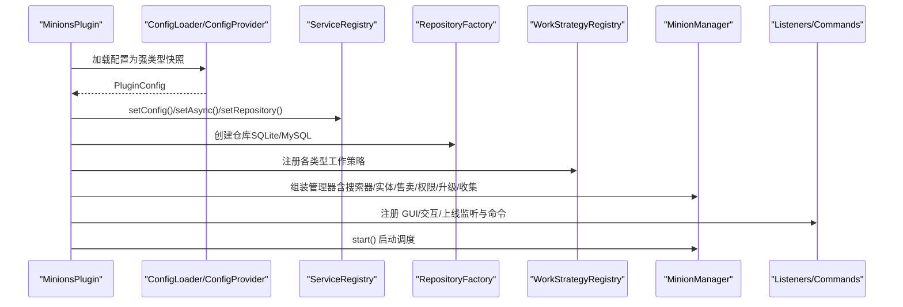
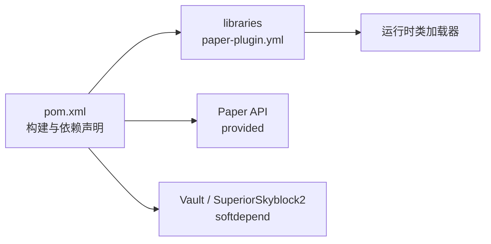

# 贡献指南

<cite>
**本文引用的文件**
- [README.md](file://README.md)
- [pom.xml](file://pom.xml)
- [paper-plugin.yml](file://src/main/resources/paper-plugin.yml)
- [config.yml](file://src/main/resources/config.yml)
- [MinionsPlugin.java](file://src/main/java/com/hcs/minions/MinionsPlugin.java)
- [CollectionConfigTest.java](file://src/test/java/com/hcs/minions/config/CollectionConfigTest.java)
</cite>

## 目录
1. [简介](#简介)
2. [项目结构](#项目结构)
3. [核心组件](#核心组件)
4. [架构总览](#架构总览)
5. [详细组件分析](#详细组件分析)
6. [依赖分析](#依赖分析)
7. [性能注意事项](#性能注意事项)
8. [故障排查指南](#故障排查指南)
9. [结论](#结论)
10. [附录](#附录)

## 简介
本贡献指南面向希望参与 SkyMinions（Hypixel 风格仆从系统）插件开发的社区贡献者。文档涵盖代码规范、Git 工作流、文档维护、测试要求、代码审查流程与质量检查工具，以及社区行为准则与沟通方式。目标是让新贡献者快速上手，同时保证提交质量与可维护性。

## 项目结构
SkyMinions 采用分层与职责分离的设计：主类仅负责装配与生命周期管理；业务逻辑分布在 service、work、model、repository 等包中；配置通过强类型记录加载并全局只读共享；事件监听器处理交互与 GUI；命令入口统一注册。

图表来源
- [MinionsPlugin.java:52-120](file://src/main/java/com/hcs/minions/MinionsPlugin.java#L52-L120)

章节来源
- [README.md:85-113](file://README.md#L85-L113)
- [MinionsPlugin.java:45-120](file://src/main/java/com/hcs/minions/MinionsPlugin.java#L45-L120)

## 核心组件
- 主类与装配：主类集中创建并注入各服务，避免在启动过程中散落业务逻辑。
- 配置系统：使用强类型记录一次性反序列化配置，运行时不可变共享，禁止散落的 getConfig()。
- 工作策略：按仆从类型注册不同策略，便于扩展与维护。
- 调度与限流：全局单调度器周期性执行，配合 BlockSearcher 的硬上限控制单次检查数量。
- 持久化：通过 Repository 抽象支持 SQLite/MySQL，并提供内存缓存层。
- 事件与命令：GUI 点击、玩家交互、上线结算与命令入口均通过监听器与命令处理器统一管理。

章节来源
- [MinionsPlugin.java:52-120](file://src/main/java/com/hcs/minions/MinionsPlugin.java#L52-L120)
- [config.yml:1-153](file://src/main/resources/config.yml#L1-L153)

## 架构总览
下图展示了插件启动时的装配顺序与关键依赖关系，体现“主类装配 + 服务解耦 + 策略扩展”的架构思想。

图表来源
- [MinionsPlugin.java:52-120](file://src/main/java/com/hcs/minions/MinionsPlugin.java#L52-L120)

## 详细组件分析

### 配置与数据模型
- 配置加载：启动时一次性加载 config.yml 到强类型记录，提供只读访问。
- 关键配置项：调度周期、单次检查上限、每玩家上限、数据库连接池、经济模块开关、离线收益参数、Collection 里程碑阈值与奖励、各类型仆从的工作半径/效率/稀有掉落概率等。
- 数据模型：Minion/MinionData/MinionType 等用于运行时状态与持久化快照。

建议
- 新增配置项时，优先以强类型 record 形式暴露，并在配置文件中给出默认值与注释。
- 对敏感或可调参数（如 pool-size、max-checks-per-cycle）提供合理范围校验与日志提示。

章节来源
- [config.yml:1-153](file://src/main/resources/config.yml#L1-L153)
- [README.md:85-113](file://README.md#L85-L113)

### 工作策略与调度
- 策略模式：每种仆从类型对应一个工作策略，便于扩展新类型。
- 调度机制：全局单调度器每固定 tick 遍历一次，结合 BlockSearcher 的硬上限（<50）限制单次方块检查数量，确保性能稳定。
- 限流与短路：搜索采用邻接+随机策略，具备短路优化。

建议
- 新增策略需实现统一接口，并在主类装配阶段注册。
- 对耗时操作进行异步化处理，避免阻塞主线程。

章节来源
- [MinionsPlugin.java:72-84](file://src/main/java/com/hcs/minions/MinionsPlugin.java#L72-L84)
- [README.md:87-89](file://README.md#L87-L89)

### 持久化与缓存
- 仓库抽象：RepositoryFactory 根据配置选择 SQLite 或 MySQL 实现。
- 缓存层：内存缓存减少重复 IO，提升读取性能。
- 落盘策略：Collection 定期落盘（例如每 60 秒），关闭时强制保存。

建议
- 对数据库连接池大小进行调优，避免虚拟线程被固定池占用过多资源。
- 对异常路径增加重试与降级策略，保障可用性。

章节来源
- [MinionsPlugin.java:64-65](file://src/main/java/com/hcs/minions/MinionsPlugin.java#L64-L65)
- [MinionsPlugin.java:116-118](file://src/main/java/com/hcs/minions/MinionsPlugin.java#L116-L118)

### GUI、事件与命令
- GUI 监听：真实 Inventory 实现，避免刷物问题。
- 交互监听：放置、右键、拾取等行为统一由监听器处理。
- 命令入口：统一注册命令，便于权限管理与帮助信息展示。

建议
- GUI 文案与布局通过模板驱动，保持可配置性与一致性。
- 所有用户可见文本应支持本地化与占位符替换。

章节来源
- [MinionsPlugin.java:110-114](file://src/main/java/com/hcs/minions/MinionsPlugin.java#L110-L114)
- [README.md:37-40](file://README.md#L37-L40)

### 测试与断言
- 单元测试：针对纯函数逻辑（如 Collection 里程碑阈值计算）编写用例，覆盖边界与越界情况。
- 测试框架：使用 JUnit Jupiter，不依赖 Bukkit 运行时，便于 CI 快速执行。

建议
- 新增功能需配套单元测试，至少覆盖正常路径与异常路径。
- 对复杂算法（如阈值跨越、槽位加成）提供充分断言。

章节来源
- [CollectionConfigTest.java:1-96](file://src/test/java/com/hcs/minions/config/CollectionConfigTest.java#L1-L96)
- [pom.xml:104-110](file://pom.xml#L104-L110)

## 依赖分析
- 构建与运行：基于 Maven，Java 21 编译目标；Paper API 作为 provided 依赖；可选依赖 Vault、SuperiorSkyblock2。
- 运行时库：fastutil、HikariCP、sqlite-jdbc、mysql-connector-j、protobuf-java 等通过 paper-plugin.yml 的 libraries 声明，由 Paper 自动下载。
- 插件元数据：paper-plugin.yml 定义名称、版本、主类、API 版本、软依赖与权限。

图表来源
- [pom.xml:15-110](file://pom.xml#L15-L110)
- [paper-plugin.yml:1-47](file://src/main/resources/paper-plugin.yml#L1-L47)

章节来源
- [pom.xml:15-110](file://pom.xml#L15-L110)
- [paper-plugin.yml:1-47](file://src/main/resources/paper-plugin.yml#L1-L47)

## 性能注意事项
- 调度周期与检查上限：tick-period 与 max-checks-per-cycle 直接影响服务器负载，应根据服务器规模调整。
- 搜索限流：BlockSearcher 单次检查硬上限 <50，避免长任务阻塞。
- 异步化：非关键路径（如售卖）异步执行，减少主线程压力。
- 连接池：HikariCP 池大小不宜过大，避免占用过多线程资源。

章节来源
- [config.yml:4-7](file://src/main/resources/config.yml#L4-L7)
- [README.md:87-89](file://README.md#L87-L89)

## 故障排查指南
- 配置错误：若缺少某类型配置，主类会记录警告并跳过该策略注册。
- 数据库连接：检查 HikariCP 配置与网络连通性，必要时降低池大小。
- 权限问题：确认 LuckPerms 权限是否授予正确，命令与 GUI 行为受权限控制。
- 日志定位：开启 debug 模式打印工作/搜索详情，辅助定位问题。

章节来源
- [MinionsPlugin.java:123-130](file://src/main/java/com/hcs/minions/MinionsPlugin.java#L123-L130)
- [config.yml:10-11](file://src/main/resources/config.yml#L10-L11)

## 结论
SkyMinions 通过清晰的装配流程、强类型配置、策略模式与限流调度，实现了高性能与可扩展的仆从系统。贡献者在遵循本指南的规范与流程后，可有效提升代码质量与协作效率。

## 附录

### 代码规范与编码标准
- 命名约定
  - 类名使用大驼峰，方法/变量使用小驼峰。
  - 常量全大写加下划线分隔。
  - 包名小写，按功能域划分（service、work、model、repository 等）。
- 注释规范
  - 公共类与方法需提供清晰注释，说明职责、参数与返回值。
  - 复杂逻辑处添加行内注释解释意图与约束。
  - 配置项需在配置文件顶部给出说明与默认值。
- 格式化规则
  - 统一使用 IDE 格式化设置（建议启用 Google Java Style 或等效规则）。
  - 控制语句与循环体使用花括号，即使单行也保留。
  - 每行长度不超过 120 字符，必要时换行。
- 日志与错误
  - 使用统一的日志门面（SLF4J），区分 INFO/WARN/ERROR。
  - 对外部依赖调用增加异常捕获与友好提示。
- 配置与资源
  - 新增配置项需同步更新配置文件与文档。
  - 资源文件（语言、GUI 模板）变更需保持向后兼容。

### Git 工作流程
- 分支策略
  - main：稳定发布分支，仅接受合并请求。
  - develop：集成开发分支，日常开发在此进行。
  - feature/*：新功能分支，完成后发起 PR 至 develop。
  - hotfix/*：紧急修复分支，直接合并至 main 并回推到 develop。
- 提交信息规范
  - 格式：<类型>(<范围>): <简述>
  - 类型：feat、fix、docs、style、refactor、test、chore
  - 示例：feat(config): 新增 Collection 里程碑阈值配置
- Pull Request 流程
  - 创建 PR 前确保本地测试通过。
  - PR 描述包含变更动机、影响范围、测试覆盖说明。
  - 至少一名维护者审查通过后合并。

### 文档维护指南
- README 更新
  - 新增功能需在 README 的功能列表与使用说明中体现。
  - 变更行为需注明兼容性影响与迁移步骤。
- API 文档
  - 公共接口需补充 Javadoc，说明用途、参数与返回值。
  - 配置项变更需同步更新配置说明。
- 示例代码
  - 示例需与当前版本保持一致，避免过时用法。
  - 示例变更后需验证可运行。

### 测试要求
- 新增功能测试
  - 每个新功能需至少包含一个正向用例与一个异常用例。
  - 对复杂逻辑（如阈值计算、奖励叠加）提供边界用例。
- 回归测试
  - 修改公共接口或核心逻辑时，需运行全部相关测试。
  - 对已知问题修复需补充回归用例。
- 性能基准测试
  - 对调度与搜索路径进行基准测试，确保性能不退化。
  - 基准结果纳入 PR 描述。

### 代码审查流程与质量检查
- 审查要点
  - 正确性：逻辑是否符合预期，边界条件是否处理。
  - 可读性：命名与注释是否清晰，复杂度是否可控。
  - 可维护性：是否遵循分层与职责分离，是否易于扩展。
  - 安全性：输入校验、权限检查、资源释放。
- 质量检查工具
  - 编译与测试：mvn clean package、mvn test
  - 静态检查：建议引入 SpotBugs/Checkstyle（可在后续迭代加入）
  - 覆盖率：建议引入 JaCoCo（可在后续迭代加入）

### 社区行为准则与沟通方式
- 尊重与包容：尊重不同背景与观点，避免人身攻击。
- 有效沟通：在 Issue 与 PR 中清晰描述问题与建议方案。
- 反馈及时：维护者应及时回应与评审，贡献者需耐心跟进。
- 渠道：GitHub Issues/PR 为主要协作渠道；讨论聚焦于技术内容。