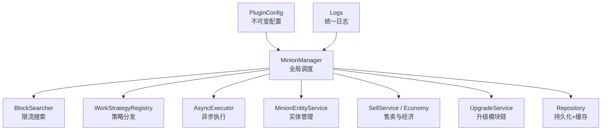
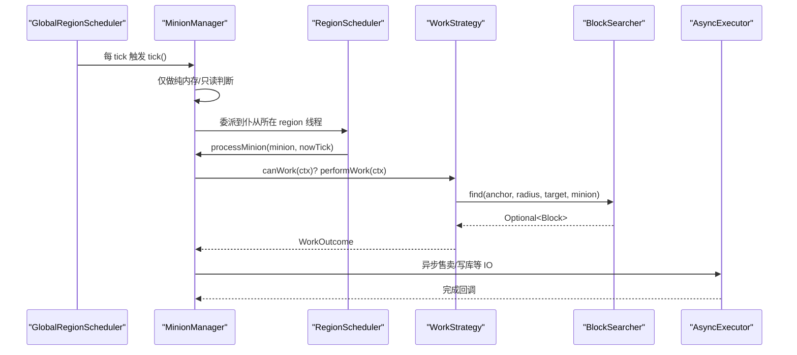
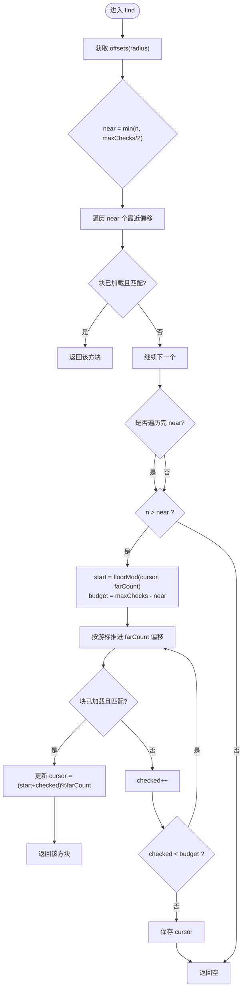
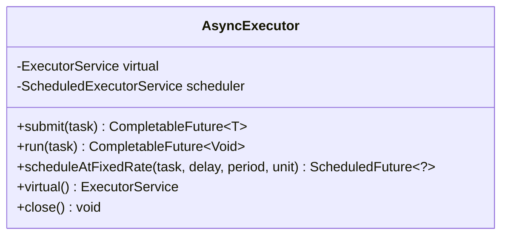
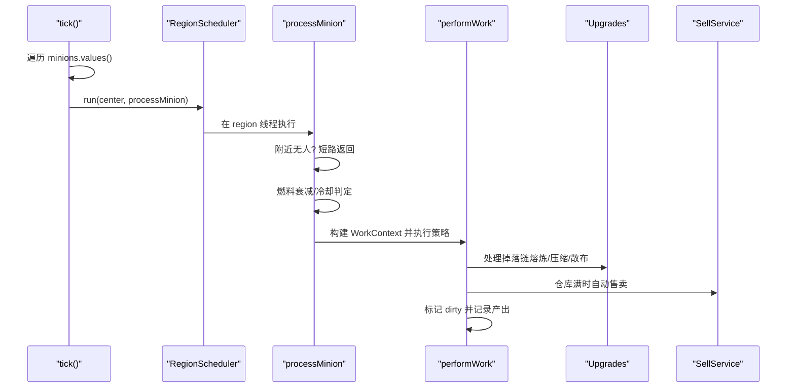
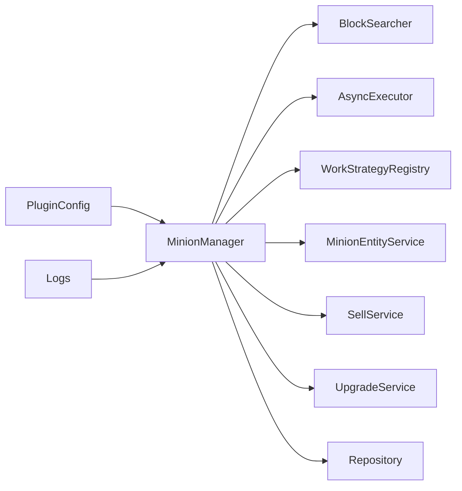

# 性能优化与最佳实践

<cite>
**本文引用的文件**
- [BlockSearcher.java](file://src/main/java/com/hcs/minions/service/BlockSearcher.java)
- [AsyncExecutor.java](file://src/main/java/com/hcs/minions/util/AsyncExecutor.java)
- [MinionManager.java](file://src/main/java/com/hcs/minions/service/MinionManager.java)
- [PluginConfig.java](file://src/main/java/com/hcs/minions/config/PluginConfig.java)
- [config.yml](file://src/main/resources/config.yml)
- [Logs.java](file://src/main/java/com/hcs/minions/util/Logs.java)
- [README.md](file://README.md)
- [pom.xml](file://pom.xml)
- [BlockSearcherTest.java](file://src/test/java/com/hcs/minions/service/BlockSearcherTest.java)
</cite>

## 目录
1. [简介](#简介)
2. [项目结构](#项目结构)
3. [核心组件](#核心组件)
4. [架构总览](#架构总览)
5. [详细组件分析](#详细组件分析)
6. [依赖关系分析](#依赖关系分析)
7. [性能考量](#性能考量)
8. [故障诊断指南](#故障诊断指南)
9. [结论](#结论)
10. [附录：配置与部署建议](#附录：配置与部署建议)

## 简介
本文件面向 SkyMinions 的性能优化与开发最佳实践，聚焦以下关键主题：
- BlockSearcher 的限流搜索算法（邻接优先、随机采样推进、硬上限控制）
- AsyncExecutor 异步执行框架（虚拟线程、任务调度、错误处理）
- MinionManager 全局调度器设计（O(n)+O(1) 复杂度优化、短路机制、内存管理）
- 性能监控与调优方法（日志分析、指标采集、瓶颈识别）
- 服务器配置与部署最佳实践
- 性能测试方法与故障诊断流程

## 项目结构
SkyMinions 采用分层与职责分离的设计：
- 服务层：MinionManager（全局调度）、BlockSearcher（限流搜索）、各类业务服务
- 工具层：AsyncExecutor（异步执行）、Logs（统一日志）
- 配置层：强类型不可变配置快照（PluginConfig + config.yml）
- 工作策略：按仆从类型实现的工作编排（work/*）
- 持久化：Repository 抽象与缓存

图表来源
- [MinionManager.java:44-86](file://src/main/java/com/hcs/minions/service/MinionManager.java#L44-L86)
- [BlockSearcher.java:14-32](file://src/main/java/com/hcs/minions/service/BlockSearcher.java#L14-L32)
- [AsyncExecutor.java:12-32](file://src/main/java/com/hcs/minions/util/AsyncExecutor.java#L12-L32)
- [PluginConfig.java:8-21](file://src/main/java/com/hcs/minions/config/PluginConfig.java#L8-L21)
- [Logs.java:6-18](file://src/main/java/com/hcs/minions/util/Logs.java#L6-L18)

章节来源
- [README.md:80-108](file://README.md#L80-L108)

## 核心组件
- BlockSearcher：两阶段螺旋扫描，近处每周期必查，远处游标推进，单次检查数受硬上限约束。
- AsyncExecutor：基于 Java 21 虚拟线程的异步执行器，提供提交任务、无返回值任务、周期调度能力，并集中记录异常。
- MinionManager：全局单调度器，tick 遍历所有仆从，区域线程委派工作逻辑；维护 O(1) 查询索引与所有者计数；支持快照落库与自动售卖轮询。
- PluginConfig：启动时一次性反序列化为不可变快照，强制 max-checks-per-cycle < 50，避免热点路径失控。
- Logs：统一 SLF4J 日志出口，禁止吞异常。

章节来源
- [BlockSearcher.java:14-32](file://src/main/java/com/hcs/minions/service/BlockSearcher.java#L14-L32)
- [AsyncExecutor.java:12-32](file://src/main/java/com/hcs/minions/util/AsyncExecutor.java#L12-L32)
- [MinionManager.java:44-86](file://src/main/java/com/hcs/minions/service/MinionManager.java#L44-L86)
- [PluginConfig.java:8-21](file://src/main/java/com/hcs/minions/config/PluginConfig.java#L8-L21)
- [Logs.java:6-18](file://src/main/java/com/hcs/minions/util/Logs.java#L6-L18)

## 架构总览
SkyMinions 的核心运行循环由 MinionManager 驱动，使用 Paper 的 GlobalRegionScheduler 进行全局 tick 遍历，并在每个仆从所在 region 线程上执行具体工作。BlockSearcher 为工作策略提供“限流”的方块查找能力；AsyncExecutor 承担 IO 与后台任务；PluginConfig 提供运行时只读配置；Logs 贯穿全链路记录。

图表来源
- [MinionManager.java:191-214](file://src/main/java/com/hcs/minions/service/MinionManager.java#L191-L214)
- [MinionManager.java:217-322](file://src/main/java/com/hcs/minions/service/MinionManager.java#L217-L322)
- [BlockSearcher.java:34-66](file://src/main/java/com/hcs/minions/service/BlockSearcher.java#L34-L66)
- [AsyncExecutor.java:34-67](file://src/main/java/com/hcs/minions/util/AsyncExecutor.java#L34-L67)

## 详细组件分析

### BlockSearcher：限流搜索算法
- 两阶段扫描
  - 阶段一：每个周期检查最近的 maxChecks/2 个偏移，确保“新出现”的近处目标立刻命中。
  - 阶段二：在剩余偏移中按游标推进，保证远处目标最终被扫到；游标保存在 minion 中以跨周期延续。
- 硬上限控制
  - HARD_LIMIT 常量限制最大检查次数；构造时强制将 maxChecks 钳制在 [1, HARD_LIMIT]。
  - 配置层 PluginConfig 强制 max-checks-per-cycle < 50，防止热点路径失控。
- 偏移生成与排序
  - generateOffsets 生成半径 r 的立方体偏移列表，排除原点并按距离升序排序，便于就近优先。
- 线程安全与缓存
  - 偏移列表通过 ConcurrentHashMap 按半径缓存，避免重复计算。

图表来源
- [BlockSearcher.java:34-66](file://src/main/java/com/hcs/minions/service/BlockSearcher.java#L34-L66)
- [BlockSearcher.java:68-91](file://src/main/java/com/hcs/minions/service/BlockSearcher.java#L68-L91)
- [PluginConfig.java:36-41](file://src/main/java/com/hcs/minions/config/PluginConfig.java#L36-L41)

章节来源
- [BlockSearcher.java:14-91](file://src/main/java/com/hcs/minions/service/BlockSearcher.java#L14-L91)
- [BlockSearcherTest.java:11-43](file://src/test/java/com/hcs/minions/service/BlockSearcherTest.java#L11-L43)
- [PluginConfig.java:8-21](file://src/main/java/com/hcs/minions/config/PluginConfig.java#L8-L21)

### AsyncExecutor：异步执行框架
- 虚拟线程池
  - 使用 Java 21 的 newVirtualThreadPerTaskExecutor 创建轻量级线程池，适合大量短生命周期 IO 任务。
- 任务提交与异常处理
  - submit/run 包装 Callable/Runnable，捕获异常并通过 Logs.error 记录后抛出 RuntimeException，避免异常丢失。
- 周期调度
  - scheduleAtFixedRate 使用单线程 ScheduledExecutorService 执行周期性任务（如脏数据批量落库、自动售卖轮询），内部异常同样记录。
- 资源关闭
  - close 顺序关闭 scheduler 与 virtual 线程池，确保优雅退出。

图表来源
- [AsyncExecutor.java:19-79](file://src/main/java/com/hcs/minions/util/AsyncExecutor.java#L19-L79)

章节来源
- [AsyncExecutor.java:12-79](file://src/main/java/com/hcs/minions/util/AsyncExecutor.java#L12-L79)
- [Logs.java:6-31](file://src/main/java/com/hcs/minions/util/Logs.java#L6-L31)

### MinionManager：全局调度器与 O(n)+O(1) 优化
- 全局遍历与短路
  - tick() 遍历 minions.values()，对未加载区块异步加载并跳过；若附近无玩家则短路不执行工作。
- 区域线程委派
  - 所有触碰方块/实体的操作通过 RegionScheduler 在对应 region 线程执行，满足 Folia 线程模型要求。
- O(1) 查询与计数
  - byLocation 用于位置到 ID 的快速映射；ownerCount 维护“主人 -> 仆从数”，避免 stream 计数带来的 O(n)。
- 快照落库
  - snapshotAndFlush 收集脏标记，按 region 线程生成快照，再异步批量写入数据库，避免 GUI 并发导致的中间态不一致。
- 自动售卖
  - sweepAutoSell 在全局调度器遍历，逐个委派到 region 线程判断并售卖，避免直接访问 Inventory。
- 实体自愈
  - 盔甲架按需生成或校验有效性，区块卸载后自动重建。

图表来源
- [MinionManager.java:191-214](file://src/main/java/com/hcs/minions/service/MinionManager.java#L191-L214)
- [MinionManager.java:217-322](file://src/main/java/com/hcs/minions/service/MinionManager.java#L217-L322)
- [MinionManager.java:333-350](file://src/main/java/com/hcs/minions/service/MinionManager.java#L333-L350)

章节来源
- [MinionManager.java:44-86](file://src/main/java/com/hcs/minions/service/MinionManager.java#L44-L86)
- [MinionManager.java:117-160](file://src/main/java/com/hcs/minions/service/MinionManager.java#L117-L160)
- [MinionManager.java:191-350](file://src/main/java/com/hcs/minions/service/MinionManager.java#L191-L350)

## 依赖关系分析
- MinionManager 依赖：
  - BlockSearcher：提供限流搜索能力
  - AsyncExecutor：异步 IO 与周期任务
  - WorkStrategyRegistry：策略分发
  - MinionEntityService：实体生成/销毁
  - SellService/Economy：售卖与经济
  - UpgradeService：掉落处理链
  - Repository：持久化与缓存
- 配置依赖：
  - PluginConfig 提供 tickPeriod、maxChecksPerCycle、economy.sellIntervalTicks 等关键参数
- 日志依赖：
  - Logs 统一输出，便于集中分析与告警

图表来源
- [MinionManager.java:44-86](file://src/main/java/com/hcs/minions/service/MinionManager.java#L44-L86)
- [PluginConfig.java:8-21](file://src/main/java/com/hcs/minions/config/PluginConfig.java#L8-L21)
- [Logs.java:6-18](file://src/main/java/com/hcs/minions/util/Logs.java#L6-L18)

章节来源
- [MinionManager.java:44-86](file://src/main/java/com/hcs/minions/service/MinionManager.java#L44-L86)
- [PluginConfig.java:8-21](file://src/main/java/com/hcs/minions/config/PluginConfig.java#L8-L21)

## 性能考量
- 搜索复杂度与限流
  - BlockSearcher 单次检查数受 maxChecksPerCycle 限制，且 HARD_LIMIT 提供硬上限；generateOffsets 按距离排序，优先命中近处目标，降低平均延迟。
  - 单元测试验证偏移数量与排序正确性，保障算法稳定性。
- 调度复杂度
  - MinionManager.tick() 为 O(n) 遍历，配合 ownerCount O(1) 查询与附近无人短路，整体开销可控。
- 异步与线程模型
  - 使用虚拟线程承载 IO 密集型任务，减少阻塞；区域线程严格隔离，避免跨线程访问 Bukkit 状态。
- 配置约束
  - PluginConfig 强制 max-checks-per-cycle < 50，避免热点路径失控；tickPeriod 与 sellIntervalTicks 可调节全局吞吐。
- 内存与对象复用
  - 偏移列表按半径缓存；快照批量落库减少频繁 IO；GUI 使用真实 Inventory 避免额外拷贝。

章节来源
- [BlockSearcher.java:14-91](file://src/main/java/com/hcs/minions/service/BlockSearcher.java#L14-L91)
- [BlockSearcherTest.java:11-43](file://src/test/java/com/hcs/minions/service/BlockSearcherTest.java#L11-L43)
- [MinionManager.java:191-350](file://src/main/java/com/hcs/minions/service/MinionManager.java#L191-L350)
- [PluginConfig.java:36-41](file://src/main/java/com/hcs/minions/config/PluginConfig.java#L36-L41)
- [config.yml:4-11](file://src/main/resources/config.yml#L4-L11)

## 故障诊断指南
- 日志分析
  - 统一通过 Logs 输出 info/warn/error；开启 debug 模式可打印工作详情与稀有掉落事件，辅助定位问题。
- 常见异常
  - 异步任务异常会被捕获并记录，随后抛出 RuntimeException；调用方需正确处理 CompletableFuture 异常，避免静默失败。
  - 区块加载失败会记录错误日志并跳过当前仆从工作。
- 调试建议
  - 调整 tickPeriod 与 max-checks-per-cycle 观察 TPS 变化；
  - 关注“未找到目标”的调试日志，结合坐标与半径排查布局问题；
  - 使用快照落库流程中的 claimDirty 与 flushSnapshots 确认脏数据一致性。

章节来源
- [Logs.java:6-31](file://src/main/java/com/hcs/minions/util/Logs.java#L6-L31)
- [AsyncExecutor.java:34-67](file://src/main/java/com/hcs/minions/util/AsyncExecutor.java#L34-L67)
- [MinionManager.java:201-206](file://src/main/java/com/hcs/minions/service/MinionManager.java#L201-L206)
- [MinionManager.java:266-280](file://src/main/java/com/hcs/minions/service/MinionManager.java#L266-L280)

## 结论
SkyMinions 通过“全局单调度器 + 区域线程委派”的架构，结合 BlockSearcher 的限流搜索与 AsyncExecutor 的虚拟线程异步执行，实现了高吞吐、低延迟的仆从系统。PluginConfig 的强约束与 Logs 的统一出口保障了运行时的稳定性与可观测性。合理配置 tickPeriod、max-checks-per-cycle 与售卖间隔，可在不同规模服中取得良好性能表现。

## 附录：配置与部署建议
- 服务器版本与依赖
  - 建议使用 Paper 1.21+，以启用 Display Entities 与 GlobalRegionScheduler；
  - 可选依赖 Vault（经济）、SuperiorSkyblock2（空岛）、LuckPerms（权限）。
- 关键配置项
  - tick-period：全局调度周期（tick），影响遍历频率；
  - max-checks-per-cycle：单次策略执行的方块检查硬上限，必须 < 50；
  - economy.auto-sell-on-full：仓库满自动售卖开关；
  - economy.sell-interval-ticks：自动售卖轮询间隔；
  - offline.enabled/rate-multiplier/max-hours：离线收益开关、效率折扣与时长上限；
  - collections：里程碑阈值、金币基数与槽位加成序号。
- 构建与部署
  - 使用 Maven 构建，产物为 SkyMinions-${version}.jar；
  - 运行时依赖（fastutil/HikariCP/sqlite-jdbc/mysql-connector-j）由 paper-plugin.yml 的 libraries 自动下载；
  - 数据库连接池 pool-size 建议小池以避免虚拟线程被固定。

章节来源
- [README.md:67-77](file://README.md#L67-L77)
- [config.yml:4-46](file://src/main/resources/config.yml#L4-L46)
- [pom.xml:15-23](file://pom.xml#L15-L23)
- [pom.xml:76-103](file://pom.xml#L76-L103)