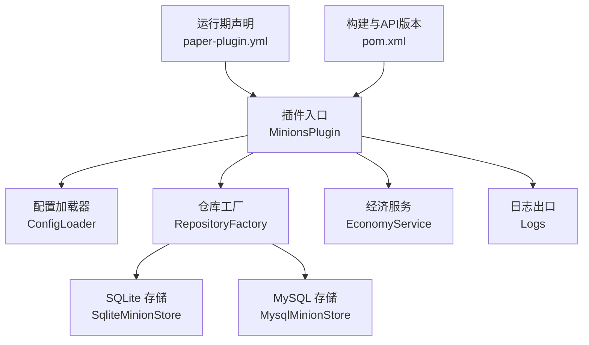
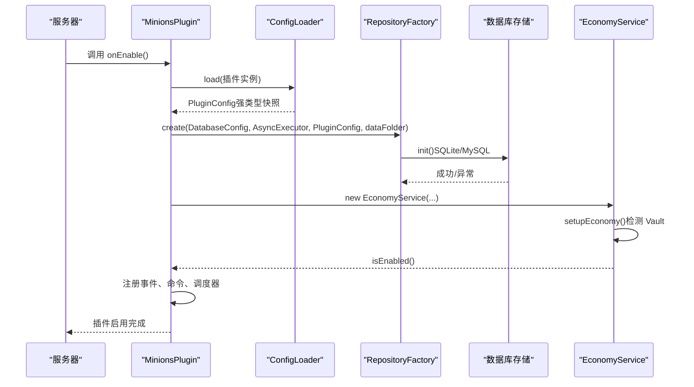
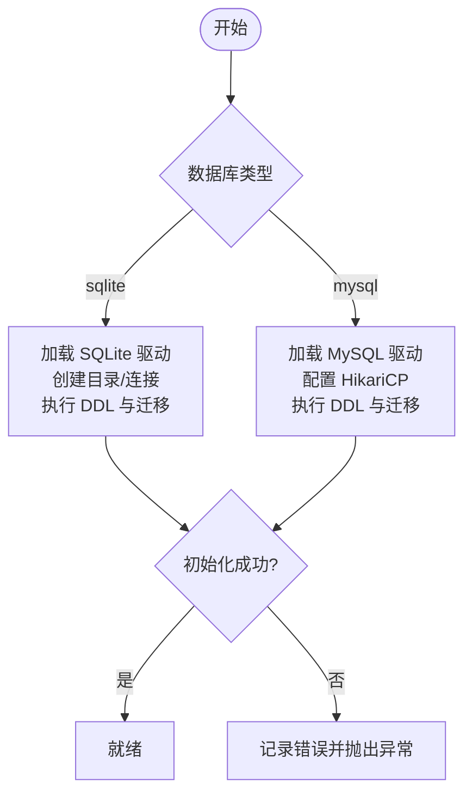
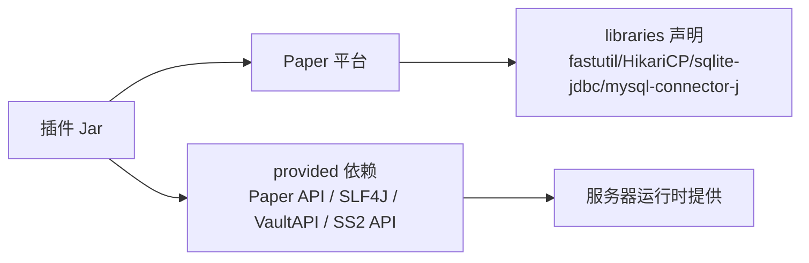

# 安装与配置问题

<cite>
**本文引用的文件**
- [MinionsPlugin.java](file://src/main/java/com/hcs/minions/MinionsPlugin.java)
- [ConfigLoader.java](file://src/main/java/com/hcs/minions/config/ConfigLoader.java)
- [config.yml](file://src/main/resources/config.yml)
- [paper-plugin.yml](file://src/main/resources/paper-plugin.yml)
- [pom.xml](file://pom.xml)
- [EconomyService.java](file://src/main/java/com/hcs/minions/service/EconomyService.java)
- [RepositoryFactory.java](file://src/main/java/com/hcs/minions/repository/RepositoryFactory.java)
- [SqliteMinionStore.java](file://src/main/java/com/hcs/minions/repository/sqlite/SqliteMinionStore.java)
- [MysqlMinionStore.java](file://src/main/java/com/hcs/minions/repository/mysql/MysqlMinionStore.java)
- [Logs.java](file://src/main/java/com/hcs/minions/util/Logs.java)
- [README.md](file://README.md)
</cite>

## 目录
1. [简介](#简介)
2. [项目结构](#项目结构)
3. [核心组件](#核心组件)
4. [架构总览](#架构总览)
5. [详细组件分析](#详细组件分析)
6. [依赖关系分析](#依赖关系分析)
7. [性能注意事项](#性能注意事项)
8. [故障排查指南](#故障排查指南)
9. [结论](#结论)
10. [附录](#附录)

## 简介
本文件面向服务器管理员，聚焦 SkyMinions 插件在安装与配置阶段的常见问题与解决方案。内容涵盖：
- 前置条件检查：Paper/Purpur 版本、JDK、权限系统（LuckPerms）、可选依赖（Vault、SuperiorSkyblock2）
- 配置文件校验：YAML 格式、字段含义、默认值与回退策略
- 数据库连接：SQLite 与 MySQL 的初始化流程、常见错误与修复
- Vault API 集成：启用开关、服务发现失败时的降级行为
- 错误信息对照表：启动失败、配置加载错误、依赖缺失等问题的定位步骤
- 环境检查工具与方法：如何快速确认服务器环境是否满足要求

## 项目结构
SkyMinions 采用分层与模块化设计：
- 主类负责生命周期管理与服务装配
- 配置通过强类型记录对象一次性加载并全局共享
- 数据访问层抽象为接口，运行时根据配置选择 SQLite 或 MySQL
- 经济系统与空岛联动为可选能力，缺失时自动降级
- 日志统一走 SLF4J，便于在 Paper 平台集中查看

图表来源
- [MinionsPlugin.java:52-120](file://src/main/java/com/hcs/minions/MinionsPlugin.java#L52-L120)
- [ConfigLoader.java:30-83](file://src/main/java/com/hcs/minions/config/ConfigLoader.java#L30-L83)
- [RepositoryFactory.java:20-29](file://src/main/java/com/hcs/minions/repository/RepositoryFactory.java#L20-L29)
- [paper-plugin.yml:1-23](file://src/main/resources/paper-plugin.yml#L1-L23)
- [pom.xml:15-23](file://pom.xml#L15-L23)

章节来源
- [MinionsPlugin.java:52-120](file://src/main/java/com/hcs/minions/MinionsPlugin.java#L52-L120)
- [paper-plugin.yml:1-23](file://src/main/resources/paper-plugin.yml#L1-L23)
- [pom.xml:15-23](file://pom.xml#L15-L23)

## 核心组件
- 插件入口与装配：主类在 onEnable 中加载配置、创建异步执行器、装配仓库、经济、工作策略、GUI 监听、命令等，并在 onDisable 中安全关闭资源
- 配置系统：唯一允许接触 getConfig() 的地方，将 YAML 反序列化为强类型记录；对非法或缺失字段提供默认值与告警
- 数据持久化：按配置选择 SQLite 或 MySQL，统一封装为带缓存的仓库接口
- 经济系统：可选依赖 Vault；未启用或未找到实现时关闭经济功能并记录警告
- 日志：统一使用 SLF4J，避免吞异常，捕获后必须记录并优雅降级

章节来源
- [MinionsPlugin.java:52-120](file://src/main/java/com/hcs/minions/MinionsPlugin.java#L52-L120)
- [ConfigLoader.java:30-83](file://src/main/java/com/hcs/minions/config/ConfigLoader.java#L30-L83)
- [EconomyService.java:38-49](file://src/main/java/com/hcs/minions/service/EconomyService.java#L38-L49)
- [Logs.java:20-31](file://src/main/java/com/hcs/minions/util/Logs.java#L20-L31)

## 架构总览
下图展示了插件启动时的关键装配顺序与依赖关系，帮助理解配置加载、数据库初始化、经济服务检测的流程。

图表来源
- [MinionsPlugin.java:52-120](file://src/main/java/com/hcs/minions/MinionsPlugin.java#L52-L120)
- [ConfigLoader.java:30-83](file://src/main/java/com/hcs/minions/config/ConfigLoader.java#L30-L83)
- [RepositoryFactory.java:20-29](file://src/main/java/com/hcs/minions/repository/RepositoryFactory.java#L20-L29)
- [SqliteMinionStore.java:62-79](file://src/main/java/com/hcs/minions/repository/sqlite/SqliteMinionStore.java#L62-L79)
- [MysqlMinionStore.java:64-92](file://src/main/java/com/hcs/minions/repository/mysql/MysqlMinionStore.java#L64-L92)
- [EconomyService.java:38-49](file://src/main/java/com/hcs/minions/service/EconomyService.java#L38-L49)

## 详细组件分析

### 配置加载与校验
- 加载时机：插件启用时由 ConfigLoader 读取 config.yml 并转换为强类型记录
- 字段回退：对缺失或非法值提供默认值，并输出警告日志
- 关键校验点：
  - max-checks-per-cycle 超过硬上限会被强制回落
  - types.targets 中的未知方块名会记录警告并忽略
  - rare-drop-chance 未配合有效 rare-drop 时会关闭稀有掉落
- 建议：
  - 保持 YAML 缩进正确，键名大小写一致
  - 修改 Material 名称时使用大写且确保存在于当前服务端版本
  - 若不确定某字段含义，参考默认配置并谨慎调整

章节来源
- [ConfigLoader.java:63-83](file://src/main/java/com/hcs/minions/config/ConfigLoader.java#L63-L83)
- [ConfigLoader.java:106-152](file://src/main/java/com/hcs/minions/config/ConfigLoader.java#L106-L152)
- [config.yml:1-153](file://src/main/resources/config.yml#L1-L153)

### 数据库连接与初始化
- SQLite：
  - 驱动加载、数据目录创建、建表与迁移
  - 写入串行，单连接加锁保证一致性
  - 常见错误：路径无权限、JDBC 驱动缺失、磁盘空间不足
- MySQL：
  - 显式加载驱动，HikariCP 连接池初始化，DDL 执行与迁移
  - 连接超时收紧，避免虚拟线程固定导致堆积
  - 常见错误：网络不可达、认证失败、字符集不匹配、索引重复

图表来源
- [SqliteMinionStore.java:62-79](file://src/main/java/com/hcs/minions/repository/sqlite/SqliteMinionStore.java#L62-L79)
- [MysqlMinionStore.java:64-92](file://src/main/java/com/hcs/minions/repository/mysql/MysqlMinionStore.java#L64-L92)

章节来源
- [RepositoryFactory.java:20-29](file://src/main/java/com/hcs/minions/repository/RepositoryFactory.java#L20-L29)
- [SqliteMinionStore.java:62-79](file://src/main/java/com/hcs/minions/repository/sqlite/SqliteMinionStore.java#L62-L79)
- [MysqlMinionStore.java:64-92](file://src/main/java/com/hcs/minions/repository/mysql/MysqlMinionStore.java#L64-L92)

### Vault 经济系统集成
- 启用条件：
  - economy.enabled 为 true
  - 服务器已启用 Vault 插件
  - Vault 提供了 Economy 服务实现
- 行为：
  - 任一条件不满足则关闭经济功能并记录警告
  - 所有 Vault 调用在异步环境中执行，成功后需校验响应类型
- 建议：
  - 确保 Vault 与对应经济插件（如 EssentialsX Economy）已安装并启用
  - 若仅用于售卖，可暂时关闭 economy.enabled 以验证其他功能

章节来源
- [EconomyService.java:38-49](file://src/main/java/com/hcs/minions/service/EconomyService.java#L38-L49)
- [EconomyService.java:69-86](file://src/main/java/com/hcs/minions/service/EconomyService.java#L69-L86)
- [config.yml:23-27](file://src/main/resources/config.yml#L23-L27)

### 权限设置与兼容性
- 权限定义：
  - 管理权限、使用权限、各类型仆从使用权限、数量上限权限
- 兼容说明：
  - LuckPerms 会自动接管这些 Bukkit 权限
  - 可通过 LP 为组或玩家授予相应权限
- 建议：
  - 为新玩家默认授予 use 权限
  - 通过 limit.<n> 控制不同组的最大仆从数
  - 结合 Collection 里程碑解锁额外槽位

章节来源
- [paper-plugin.yml:24-47](file://src/main/resources/paper-plugin.yml#L24-L47)
- [README.md:49-66](file://README.md#L49-L66)

## 依赖关系分析
- 运行时依赖声明在 paper-plugin.yml 的 libraries 中，由 Paper 首次加载时从 Maven Central 下载并挂载到插件类加载器
- 编译期依赖在 pom.xml 中声明为 provided，不打入 jar，保持瘦包
- 可选依赖：
  - Vault：经济系统，未启用时功能降级
  - SuperiorSkyblock2：空岛联动，未启用时不影响基础功能

图表来源
- [paper-plugin.yml:15-23](file://src/main/resources/paper-plugin.yml#L15-L23)
- [pom.xml:40-111](file://pom.xml#L40-L111)

章节来源
- [paper-plugin.yml:15-23](file://src/main/resources/paper-plugin.yml#L15-L23)
- [pom.xml:40-111](file://pom.xml#L40-L111)

## 性能注意事项
- 全局调度周期与单次检查上限：
  - tick-period 控制调度频率
  - max-checks-per-cycle 有硬上限保护，防止过度扫描影响 TPS
- 数据库连接池：
  - MySQL 使用 HikariCP，连接池规模较小以避免虚拟线程固定
  - 连接超时收紧，减少阻塞时间
- 建议：
  - 在高负载服务器下调大 tick-period 或降低 max-checks-per-cycle
  - 合理设置 MySQL 连接池大小，避免过多连接造成数据库压力

章节来源
- [config.yml:4-11](file://src/main/resources/config.yml#L4-L11)
- [ConfigLoader.java:63-67](file://src/main/java/com/hcs/minions/config/ConfigLoader.java#L63-L67)
- [MysqlMinionStore.java:73-84](file://src/main/java/com/hcs/minions/repository/mysql/MysqlMinionStore.java#L73-L84)

## 故障排查指南

### 启动失败
- 症状：插件无法启用或立即禁用
- 可能原因：
  - 数据库初始化失败（SQLite/MySQL）
  - 缺少必要运行时库（由 libraries 声明）
  - 配置文件严重错误导致加载异常
- 处理步骤：
  - 查看服务器控制台日志，搜索“初始化失败”“无法初始化”等关键字
  - 确认 SQLite 文件路径存在且可写，或 MySQL 地址、端口、用户名、密码正确
  - 确认 Paper 能下载并加载 libraries 中声明的依赖
  - 临时关闭 economy.enabled 以排除经济相关干扰

章节来源
- [SqliteMinionStore.java:62-79](file://src/main/java/com/hcs/minions/repository/sqlite/SqliteMinionStore.java#L62-L79)
- [MysqlMinionStore.java:64-92](file://src/main/java/com/hcs/minions/repository/mysql/MysqlMinionStore.java#L64-L92)
- [paper-plugin.yml:15-23](file://src/main/resources/paper-plugin.yml#L15-L23)

### 配置加载错误
- 症状：配置项无效、行为不符合预期
- 可能原因：
  - YAML 语法错误（缩进、引号、键名拼写）
  - 使用了不存在或版本不匹配的 Material
  - 数值越界（如 max-checks-per-cycle 过大）
- 处理步骤：
  - 使用 YAML 校验工具检查语法
  - 核对 Material 名称大小写与版本支持
  - 关注日志中的“未知物料名”“超过硬上限”等警告
  - 恢复默认配置逐项对比，定位差异

章节来源
- [ConfigLoader.java:63-83](file://src/main/java/com/hcs/minions/config/ConfigLoader.java#L63-L83)
- [ConfigLoader.java:106-152](file://src/main/java/com/hcs/minions/config/ConfigLoader.java#L106-L152)
- [config.yml:1-153](file://src/main/resources/config.yml#L1-L153)

### 依赖缺失
- 症状：经济功能不可用、空岛联动失效
- 可能原因：
  - Vault 未安装或未启用
  - SuperiorSkyblock2 未安装或未启用
  - 运行时库未正确加载
- 处理步骤：
  - 检查服务器插件列表，确认 Vault/SS2 已启用
  - 查看日志中“未启用”“未找到实现”等警告
  - 确认 paper-plugin.yml 的 libraries 未被拦截或缓存污染
  - 重启服务器以触发依赖下载与加载

章节来源
- [EconomyService.java:38-49](file://src/main/java/com/hcs/minions/service/EconomyService.java#L38-L49)
- [paper-plugin.yml:8-13](file://src/main/resources/paper-plugin.yml#L8-L13)
- [paper-plugin.yml:15-23](file://src/main/resources/paper-plugin.yml#L15-L23)

### 数据库连接问题
- SQLite：
  - 检查 data 目录权限与磁盘空间
  - 确认 sqlite-jdbc 已被加载
  - 查看日志中“SQLite 初始化失败”“连接关闭失败”等错误
- MySQL：
  - 检查网络连通性与防火墙
  - 确认账号权限与字符集配置
  - 查看日志中“MySQL 初始化失败”“连接超时”等错误

章节来源
- [SqliteMinionStore.java:62-79](file://src/main/java/com/hcs/minions/repository/sqlite/SqliteMinionStore.java#L62-L79)
- [MysqlMinionStore.java:64-92](file://src/main/java/com/hcs/minions/repository/mysql/MysqlMinionStore.java#L64-L92)

### 权限相关问题
- 症状：玩家无法放置或使用特定类型仆从
- 处理步骤：
  - 使用 LP 检查玩家是否拥有 hcs.minions.use 及对应类型权限
  - 检查 limit.<n> 是否限制了最大数量
  - 确认权限生效并刷新用户权限缓存

章节来源
- [paper-plugin.yml:24-47](file://src/main/resources/paper-plugin.yml#L24-L47)
- [README.md:49-66](file://README.md#L49-L66)

### 错误信息对照表
- 启动失败
  - 关键词：“初始化失败”“无法初始化”
  - 定位：数据库初始化、依赖加载
  - 解决：检查数据库配置、确认 libraries 加载
- 配置加载错误
  - 关键词：“未知物料名”“超过硬上限”
  - 定位：Material 名称、数值范围
  - 解决：修正配置、恢复默认对比
- 依赖缺失
  - 关键词：“未启用”“未找到实现”
  - 定位：Vault/SS2、运行时库
  - 解决：安装并启用依赖、重启服务器
- 权限问题
  - 关键词：权限拒绝、命令不可用
  - 定位：LP 权限分配
  - 解决：授予权限并刷新

章节来源
- [Logs.java:20-31](file://src/main/java/com/hcs/minions/util/Logs.java#L20-L31)
- [ConfigLoader.java:106-152](file://src/main/java/com/hcs/minions/config/ConfigLoader.java#L106-L152)
- [EconomyService.java:38-49](file://src/main/java/com/hcs/minions/service/EconomyService.java#L38-L49)

### 服务器环境检查工具与方法
- 版本检查：
  - 确认 Paper 版本与 pom.xml 中 api-version 对齐
  - 确认 JDK 版本满足编译与运行要求
- 依赖检查：
  - 查看插件列表，确认 Vault、SS2 状态
  - 检查控制台是否有依赖加载失败的日志
- 权限检查：
  - 使用 LP 命令查询用户权限
  - 测试最小权限集合是否能正常使用
- 数据库检查：
  - SQLite：检查文件是否存在、可写
  - MySQL：测试连接、账号权限、字符集

章节来源
- [pom.xml:15-23](file://pom.xml#L15-L23)
- [paper-plugin.yml:1-13](file://src/main/resources/paper-plugin.yml#L1-L13)
- [README.md:67-77](file://README.md#L67-L77)

## 结论
SkyMinions 的安装与配置关键在于：
- 使用支持的 Paper/Purpur 版本与 JDK
- 正确配置数据库与权限
- 按需启用 Vault 与空岛联动
- 通过日志与默认配置快速定位问题
遵循本文的步骤与对照表，可高效解决大多数安装与配置问题。

## 附录
- 常用命令与权限示例请参考 README
- 如需进一步调试，可开启 debug 模式并收集完整日志

章节来源
- [README.md:37-66](file://README.md#L37-L66)
- [config.yml:10-11](file://src/main/resources/config.yml#L10-L11)