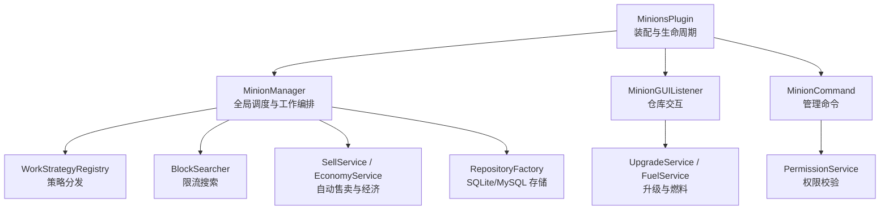
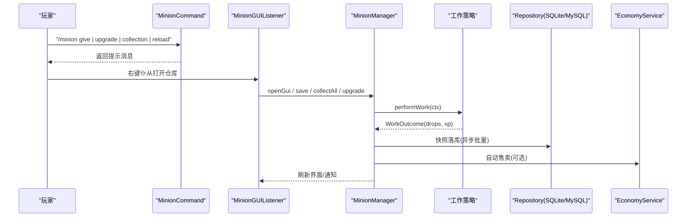
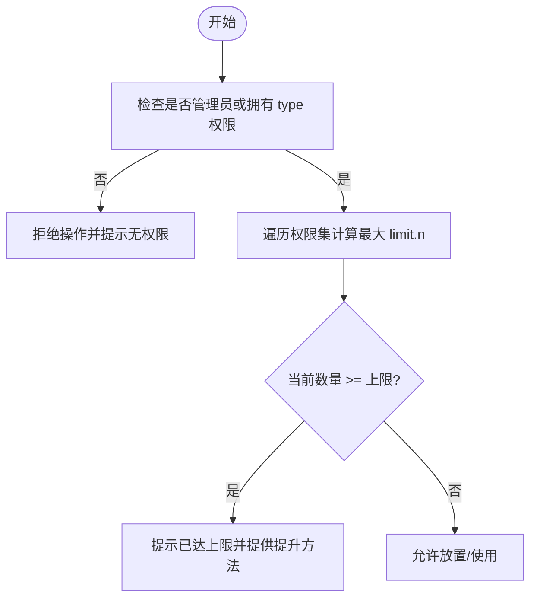
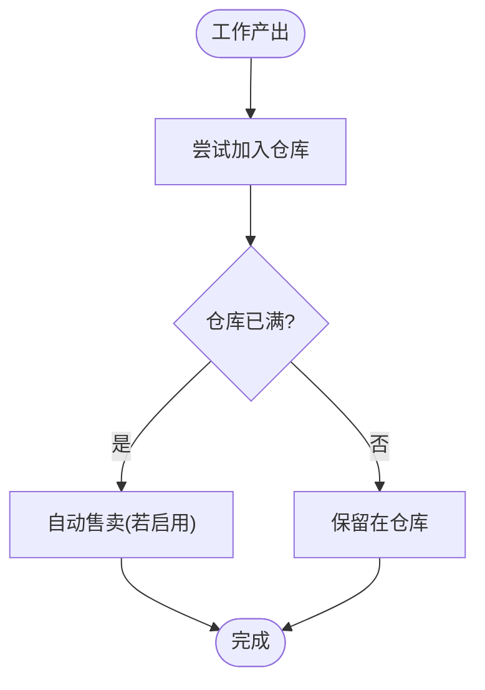
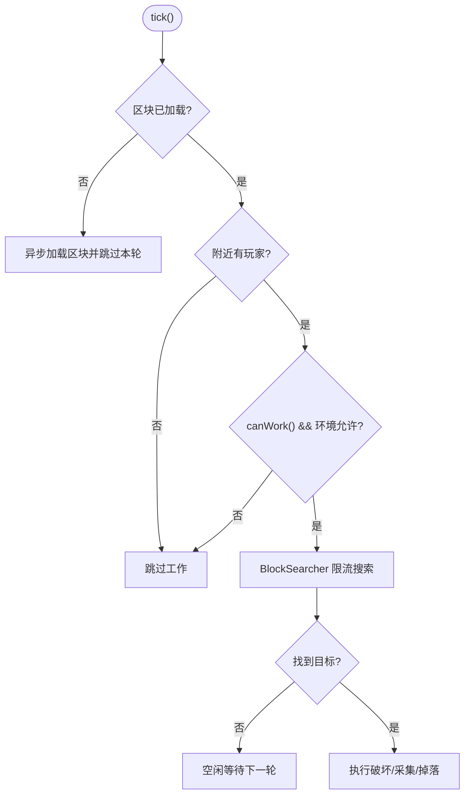
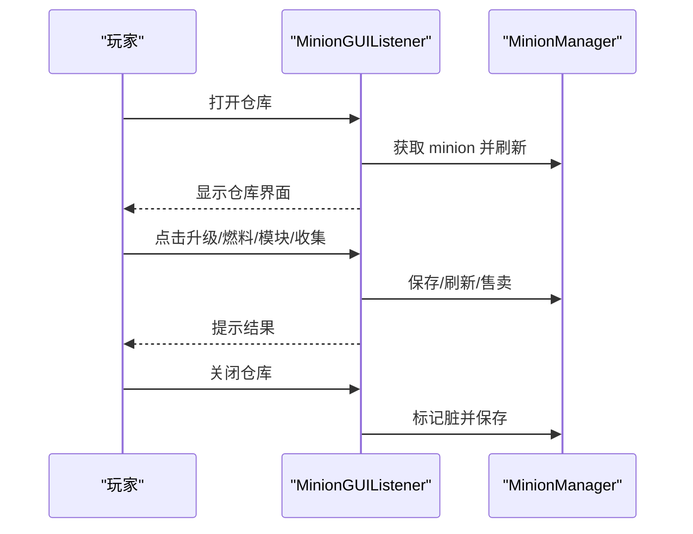
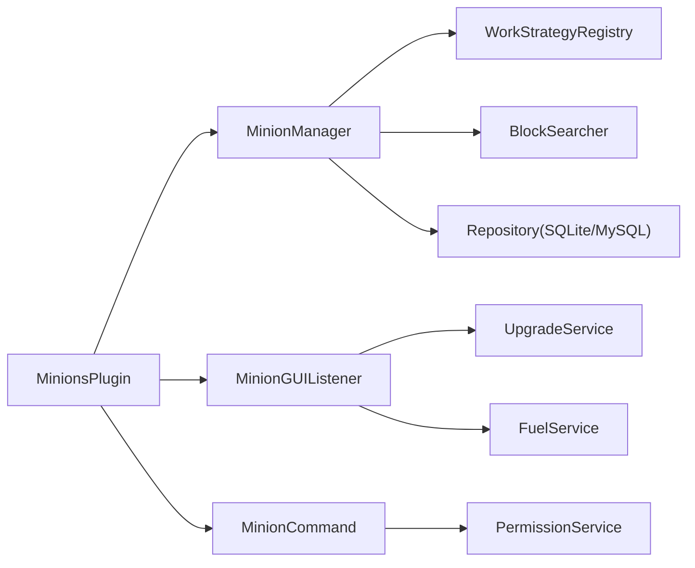

# 常见问题解决方案

<cite>
**本文引用的文件**
- [README.md](file://README.md)
- [config.yml](file://src/main/resources/config.yml)
- [messages.yml](file://src/main/resources/messages.yml)
- [MinionsPlugin.java](file://src/main/java/com/hcs/minions/MinionsPlugin.java)
- [MinionCommand.java](file://src/main/java/com/hcs/minions/command/MinionCommand.java)
- [PermissionService.java](file://src/main/java/com/hcs/minions/service/PermissionService.java)
- [MinionGUIListener.java](file://src/main/java/com/hcs/minions/gui/MinionGUIListener.java)
- [MinionManager.java](file://src/main/java/com/hcs/minions/service/MinionManager.java)
- [BlockSearcher.java](file://src/main/java/com/hcs/minions/service/BlockSearcher.java)
- [MysqlMinionStore.java](file://src/main/java/com/hcs/minions/repository/mysql/MysqlMinionStore.java)
- [DatabaseConfig.java](file://src/main/java/com/hcs/minions/config/DatabaseConfig.java)
- [Logs.java](file://src/main/java/com/hcs/minions/util/Logs.java)
</cite>

## 目录
1. [简介](#简介)
2. [项目结构](#项目结构)
3. [核心组件](#核心组件)
4. [架构总览](#架构总览)
5. [详细组件分析](#详细组件分析)
6. [依赖关系分析](#依赖关系分析)
7. [性能注意事项](#性能注意事项)
8. [故障排除指南](#故障排除指南)
9. [结论](#结论)
10. [附录](#附录)

## 简介
本文件面向 SkyMinions（硬核生存仆从系统）用户与服主，整理高频问题与快速解决步骤，覆盖权限、物品丢失、仆从不工作、GUI无法打开等场景。提供从简单到复杂的诊断流程、错误消息对照表、社区支持渠道与反馈模板，并给出定期更新建议，确保内容长期有效。

## 项目结构
SkyMinions 采用“插件主类装配 + 服务分层 + 策略模式”的结构：
- 主类负责加载配置、注册事件与命令、启动调度器
- 管理器负责全局 tick 遍历、工作编排、自动售卖与离线收益
- GUI 监听处理仓库交互（升级、燃料、模块、皮肤、收集、关闭）
- 权限服务对接 LuckPerms，解析数量上限
- 数据库层支持 SQLite/MySQL，使用连接池与异步落库
- 工作策略按类型实现（矿工/农夫/伐木/钓鱼/猎魔/牧民/圆石），通过 BlockSearcher 限流搜索目标方块

图表来源
- [MinionsPlugin.java:52-120](file://src/main/java/com/hcs/minions/MinionsPlugin.java#L52-L120)
- [MinionManager.java:92-115](file://src/main/java/com/hcs/minions/service/MinionManager.java#L92-L115)
- [MinionGUIListener.java:50-131](file://src/main/java/com/hcs/minions/gui/MinionGUIListener.java#L50-L131)
- [MinionCommand.java:51-68](file://src/main/java/com/hcs/minions/command/MinionCommand.java#L51-L68)
- [BlockSearcher.java:14-37](file://src/main/java/com/hcs/minions/service/BlockSearcher.java#L14-L37)
- [MysqlMinionStore.java:64-92](file://src/main/java/com/hcs/minions/repository/mysql/MysqlMinionStore.java#L64-L92)

章节来源
- [README.md:1-114](file://README.md#L1-L114)
- [MinionsPlugin.java:52-120](file://src/main/java/com/hcs/minions/MinionsPlugin.java#L52-L120)

## 核心组件
- MinionsPlugin：统一装配服务、注册事件/命令、启动调度与定时任务
- MinionManager：全局 tick 遍历、区域线程委派工作、自动售卖、离线收益、清理孤儿实体
- MinionGUIListener：仓库点击/拖拽/关闭事件处理，升级、燃料、模块、皮肤、收集、布局指引
- PermissionService：LuckPerms 权限集成，解析 hcs.minions.limit.* 最大上限
- BlockSearcher：两阶段螺旋扫描，限制每周期检查数，避免卡顿
- 数据库层：SQLite/MySQL 初始化、DDL、迁移、连接池、异常日志

章节来源
- [MinionsPlugin.java:52-120](file://src/main/java/com/hcs/minions/MinionsPlugin.java#L52-L120)
- [MinionManager.java:92-115](file://src/main/java/com/hcs/minions/service/MinionManager.java#L92-L115)
- [MinionGUIListener.java:50-131](file://src/main/java/com/hcs/minions/gui/MinionGUIListener.java#L50-L131)
- [PermissionService.java:33-74](file://src/main/java/com/hcs/minions/service/PermissionService.java#L33-L74)
- [BlockSearcher.java:14-37](file://src/main/java/com/hcs/minions/service/BlockSearcher.java#L14-L37)
- [MysqlMinionStore.java:64-92](file://src/main/java/com/hcs/minions/repository/mysql/MysqlMinionStore.java#L64-L92)

## 架构总览
下图展示关键调用链：玩家操作 → 命令/GUI → 管理器 → 策略执行 → 存储/经济/集合累计。

图表来源
- [MinionCommand.java:51-68](file://src/main/java/com/hcs/minions/command/MinionCommand.java#L51-L68)
- [MinionGUIListener.java:50-131](file://src/main/java/com/hcs/minions/gui/MinionGUIListener.java#L50-L131)
- [MinionManager.java:217-322](file://src/main/java/com/hcs/minions/service/MinionManager.java#L217-L322)
- [MysqlMinionStore.java:64-92](file://src/main/java/com/hcs/minions/repository/mysql/MysqlMinionStore.java#L64-L92)

## 详细组件分析

### 权限与数量上限
- 权限前缀：hcs.minions.admin、hcs.minions.type.<type>、hcs.minions.limit.<n>
- 数量上限计算：一次性遍历生效权限，取最大 n；支持通配 * 上限为固定最大值
- 常见错误：未授予 type 权限导致无法放置或使用；limit 未设置或过小导致“已达上限”

图表来源
- [PermissionService.java:33-74](file://src/main/java/com/hcs/minions/service/PermissionService.java#L33-L74)
- [messages.yml:9-14](file://src/main/resources/messages.yml#L9-L14)

章节来源
- [PermissionService.java:33-74](file://src/main/java/com/hcs/minions/service/PermissionService.java#L33-L74)
- [messages.yml:9-14](file://src/main/resources/messages.yml#L9-L14)

### 物品丢失排查
- 掉落入仓逻辑：工作产出先尝试放入真实仓库，溢出则掉落到世界
- 自动售卖触发：开启 autoSell 或装备“自动售卖漏斗”，且仓库满时触发
- 离线收益：下线后按时间差结算，上限 48 小时，效率折扣可配置
- 常见问题：仓库满自动售卖导致物品消失；溢出掉落被其他玩家拾取；离线收益未到账

图表来源
- [MinionManager.java:289-322](file://src/main/java/com/hcs/minions/service/MinionManager.java#L289-L322)
- [config.yml:23-27](file://src/main/resources/config.yml#L23-L27)
- [config.yml:33-37](file://src/main/resources/config.yml#L33-L37)

章节来源
- [MinionManager.java:289-322](file://src/main/java/com/hcs/minions/service/MinionManager.java#L289-L322)
- [config.yml:23-27](file://src/main/resources/config.yml#L23-L27)
- [config.yml:33-37](file://src/main/resources/config.yml#L33-L37)

### 仆从不工作
- 工作条件：附近区块已加载、有玩家在扫描半径内、燃料/冷却/环境允许
- 搜索限流：每周期最多检查固定次数，避免全图扫描造成卡顿
- 常见问题：区块未加载、无玩家在线、目标方块不在范围内、燃料耗尽、策略不可工作

图表来源
- [MinionManager.java:191-250](file://src/main/java/com/hcs/minions/service/MinionManager.java#L191-L250)
- [BlockSearcher.java:14-37](file://src/main/java/com/hcs/minions/service/BlockSearcher.java#L14-L37)

章节来源
- [MinionManager.java:191-250](file://src/main/java/com/hcs/minions/service/MinionManager.java#L191-L250)
- [BlockSearcher.java:14-37](file://src/main/java/com/hcs/minions/service/BlockSearcher.java#L14-L37)

### GUI 无法打开或交互异常
- 打开方式：右键仆从打开真实 Inventory（Bukkit 内部深拷贝，无刷物）
- 交互保护：非主人禁止操作；按钮槽不可拖入；关闭时兜底燃料结算
- 常见问题：GUI 不显示、点击无效、拖拽失败、关闭后燃料未结算

图表来源
- [MinionGUIListener.java:50-161](file://src/main/java/com/hcs/minions/gui/MinionGUIListener.java#L50-L161)
- [MinionManager.java:386-395](file://src/main/java/com/hcs/minions/service/MinionManager.java#L386-L395)

章节来源
- [MinionGUIListener.java:50-161](file://src/main/java/com/hcs/minions/gui/MinionGUIListener.java#L50-L161)
- [MinionManager.java:386-395](file://src/main/java/com/hcs/minions/service/MinionManager.java#L386-L395)

## 依赖关系分析
- 插件主类依赖配置加载、服务装配、事件与命令注册
- 管理器依赖策略注册表、搜索器、实体服务、售卖服务、权限服务、集合服务
- GUI 监听依赖管理器、物品服务、实体服务、升级服务
- 数据库层依赖 HikariCP 连接池与驱动加载

图表来源
- [MinionsPlugin.java:52-120](file://src/main/java/com/hcs/minions/MinionsPlugin.java#L52-L120)
- [MinionManager.java:44-86](file://src/main/java/com/hcs/minions/service/MinionManager.java#L44-L86)
- [MinionGUIListener.java:33-48](file://src/main/java/com/hcs/minions/gui/MinionGUIListener.java#L33-L48)
- [MinionCommand.java:28-49](file://src/main/java/com/hcs/minions/command/MinionCommand.java#L28-L49)

章节来源
- [MinionsPlugin.java:52-120](file://src/main/java/com/hcs/minions/MinionsPlugin.java#L52-L120)
- [MinionManager.java:44-86](file://src/main/java/com/hcs/minions/service/MinionManager.java#L44-L86)
- [MinionGUIListener.java:33-48](file://src/main/java/com/hcs/minions/gui/MinionGUIListener.java#L33-L48)
- [MinionCommand.java:28-49](file://src/main/java/com/hcs/minions/command/MinionCommand.java#L28-L49)

## 性能注意事项
- 全局调度器每 tick 遍历所有仆从，仅做内存只读判断，真正方块/实体/Inventory 操作委派到区域线程
- BlockSearcher 限制每周期检查数，避免全图扫描导致卡顿
- 自动售卖改为区域线程轮询，避免异步访问 Inventory
- 快照落库批量异步，减少主线程压力
- 数据库连接池大小适中，避免虚拟线程被固定

章节来源
- [MinionManager.java:191-215](file://src/main/java/com/hcs/minions/service/MinionManager.java#L191-L215)
- [BlockSearcher.java:14-37](file://src/main/java/com/hcs/minions/service/BlockSearcher.java#L14-L37)
- [MinionManager.java:333-350](file://src/main/java/com/hcs/minions/service/MinionManager.java#L333-L350)
- [MinionManager.java:117-160](file://src/main/java/com/hcs/minions/service/MinionManager.java#L117-L160)
- [MysqlMinionStore.java:64-92](file://src/main/java/com/hcs/minions/repository/mysql/MysqlMinionStore.java#L64-L92)

## 故障排除指南

### 权限问题
症状
- 提示“没有权限使用该仆从”
- 放置失败，提示“已达上限”

排查步骤
1. 确认玩家是否拥有 hcs.minions.type.<类型> 权限
2. 检查 hcs.minions.limit.<n> 是否设置，取最大 n 作为上限
3. 若使用 LuckPerms，确认组继承与显式拒绝权限
4. 使用 /minion list 查看在线仆从总数，结合权限上限判断

对应消息
- “你没有权限使用该仆从”
- “仆从数量已达上限”

章节来源
- [PermissionService.java:33-74](file://src/main/java/com/hcs/minions/service/PermissionService.java#L33-L74)
- [messages.yml:9-14](file://src/main/resources/messages.yml#L9-L14)

### 物品丢失
症状
- 仓库满后物品消失
- 离线收益未到账
- 掉落被他人拾取

排查步骤
1. 检查 config.yml 中 economy.auto-sell-on-full 是否开启
2. 检查是否装备了“自动售卖漏斗”模块
3. 查看离线收益配置 max-hours 与 rate-multiplier
4. 在工作点附近寻找掉落物品
5. 使用 /minion collection 查看资源累计与里程碑进度

对应消息
- “已取出全部产物”
- “离线收益已到账”

章节来源
- [MinionManager.java:289-322](file://src/main/java/com/hcs/minions/service/MinionManager.java#L289-L322)
- [config.yml:23-27](file://src/main/resources/config.yml#L23-L27)
- [config.yml:33-37](file://src/main/resources/config.yml#L33-L37)
- [messages.yml:50-60](file://src/main/resources/messages.yml#L50-L60)

### 仆从不工作
症状
- 仆从长时间空闲
- 工作范围无产出

排查步骤
1. 确认区块已加载且有玩家在线（扫描半径内）
2. 检查燃料状态与冷却时间
3. 检查工作范围是否包含目标方块（如矿石、作物、树木、水）
4. 开启 debug 模式查看调试日志
5. 使用 /minion reload 重载配置与文案

对应消息
- “调试: 仆从未找到目标”
- “已重新加载配置与文案”

章节来源
- [MinionManager.java:191-250](file://src/main/java/com/hcs/minions/service/MinionManager.java#L191-L250)
- [BlockSearcher.java:14-37](file://src/main/java/com/hcs/minions/service/BlockSearcher.java#L14-L37)
- [MinionCommand.java:125-130](file://src/main/java/com/hcs/minions/command/MinionCommand.java#L125-L130)
- [messages.yml:35-46](file://src/main/resources/messages.yml#L35-L46)

### GUI 无法打开或交互异常
症状
- 右键仆从无反应
- 点击升级/燃料/模块无效
- 关闭 GUI 后燃料未结算

排查步骤
1. 确认右键的是仆从实体而非普通方块
2. 检查是否为该仆从的主人
3. 观察关闭 GUI 时的燃料兜底逻辑
4. 查看是否有拖拽冲突（按钮槽不可拖入）
5. 使用 /minion reload 重载 GUI 文案

对应消息
- “已装备模块”
- “已卸下模块”
- “皮肤已切换”

章节来源
- [MinionGUIListener.java:50-161](file://src/main/java/com/hcs/minions/gui/MinionGUIListener.java#L50-L161)
- [messages.yml:21-34](file://src/main/resources/messages.yml#L21-L34)

### 数据库连接失败（MySQL）
症状
- 服务器启动时报错“未找到 MySQL JDBC 驱动”
- 初始化失败，抛出“无法初始化 MySQL”

排查步骤
1. 检查 paper-plugin.yml 的 libraries 是否包含 mysql-connector-j
2. 确认 config.yml 中 database.type=mysql 及 host/port/database/user/password 正确
3. 检查 HikariCP 连接池参数与超时设置
4. 查看 Logs.error 输出定位具体异常

对应消息
- “未找到 MySQL JDBC 驱动”
- “无法初始化 MySQL”

章节来源
- [MysqlMinionStore.java:64-92](file://src/main/java/com/hcs/minions/repository/mysql/MysqlMinionStore.java#L64-L92)
- [DatabaseConfig.java:6-20](file://src/main/java/com/hcs/minions/config/DatabaseConfig.java#L6-L20)
- [Logs.java:20-31](file://src/main/java/com/hcs/minions/util/Logs.java#L20-L31)

### 错误消息对照表
- 无权限：no-permission
- 空岛限制：must-place-on-island
- 数量上限：limit-reached
- 非本人仆从：not-your-minion
- 仅玩家命令：player-only
- 未知子命令：unknown-command
- 燃料相关：permanent-fuel-equipped / fuel-added
- 升级相关：max-level / upgrade-slot-locked / upgrade-slot-occupied / upgrade-slot-empty / upgrade-failed / upgrade-success
- 自动售卖：auto-sell-toggled
- 模块相关：upgrade-equipped / upgrade-removed
- 皮肤相关：skin-changed
- 命令帮助：usage / usage-give / usage-upgrade
- 等级输入：level-must-be-number
- 类型/模块未知：unknown-type / unknown-upgrade
- 发放成功：given-minion / given-upgrade
- 在线统计：total-minions
- 重载成功：config-reloaded
- 清理残留：purged
- 可用皮肤：available-skins / skin-tip
- Collection：collection-empty / collection-header / collection-entry / collection-next / collection-complete / collection-slot-bonus / milestone-reached / milestone-slot-bonus
- 稀有掉落：rare-drop
- 理想布局：layout-header / layout-range / layout-tip-center / layout-tip-light / layout-tip-shared
- 离线收益：offline-reward

章节来源
- [messages.yml:7-74](file://src/main/resources/messages.yml#L7-L74)

### 社区支持与反馈
- 社区渠道：建议使用官方论坛、Discord、GitHub Issues 提交问题
- 反馈模板：
  - 插件版本与服务端版本
  - 问题描述与复现步骤
  - 相关配置片段（config.yml、messages.yml）
  - 服务器日志（含错误堆栈）
  - 截图或录屏（GUI、掉落、权限面板）
- 求助指南：先自查权限与配置，再提供最小复现环境与日志

[本节为通用指导，无需代码来源]

### 定期更新建议
- 每次服务端版本更新后，检查 messages.yml 与 config.yml 兼容性
- 关注 GitHub Releases 中的变更说明
- 根据玩家反馈调整 GUI 文案与默认配置
- 定期备份 minions.db 或 MySQL 数据

[本节为通用指导，无需代码来源]

## 结论
通过分层的架构设计与严格的线程安全控制，SkyMinions 在高并发环境下仍能保持稳定。针对常见问题，建议优先从权限、配置、区块加载与玩家在线状态入手排查，并结合日志与调试模式定位深层问题。持续更新文档与配置，有助于提升用户体验与运维效率。

[本节为总结性内容，无需代码来源]

## 附录
- 构建与运行：需要 JDK 21+ 与 Maven；产物位于 target/SkyMinions-*.jar
- 运行时依赖：fastutil/HikariCP/sqlite-jdbc/mysql-connector-j 由 Paper 自动下载
- 命令参考：/minion give | upgrade | skin | collection | reload | purge | list

章节来源
- [README.md:72-82](file://README.md#L72-L82)
- [MinionCommand.java:51-68](file://src/main/java/com/hcs/minions/command/MinionCommand.java#L51-L68)