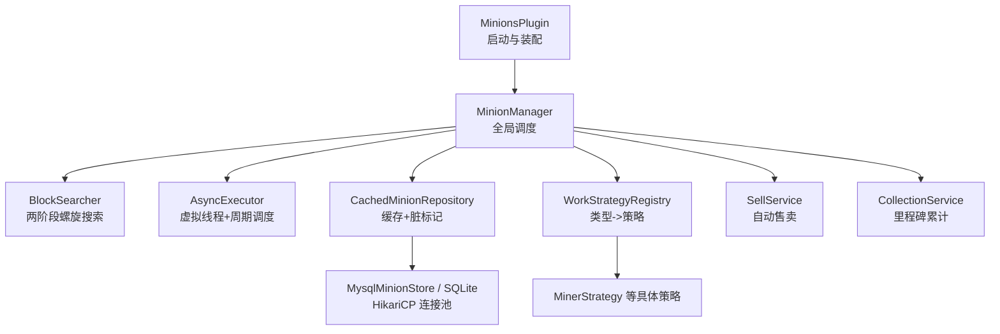
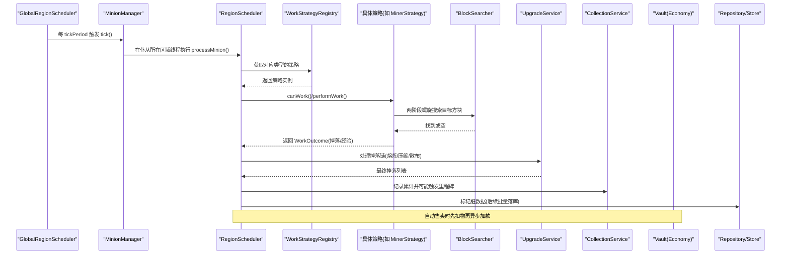
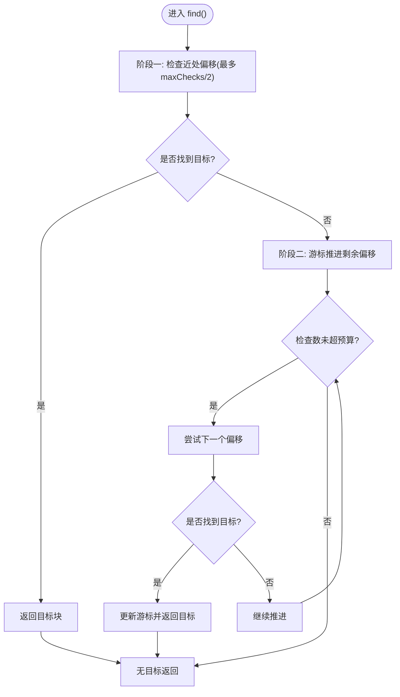
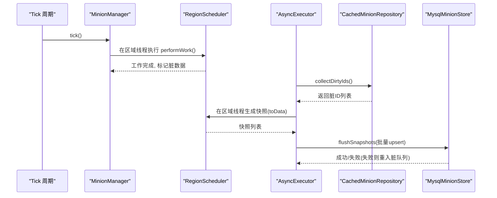
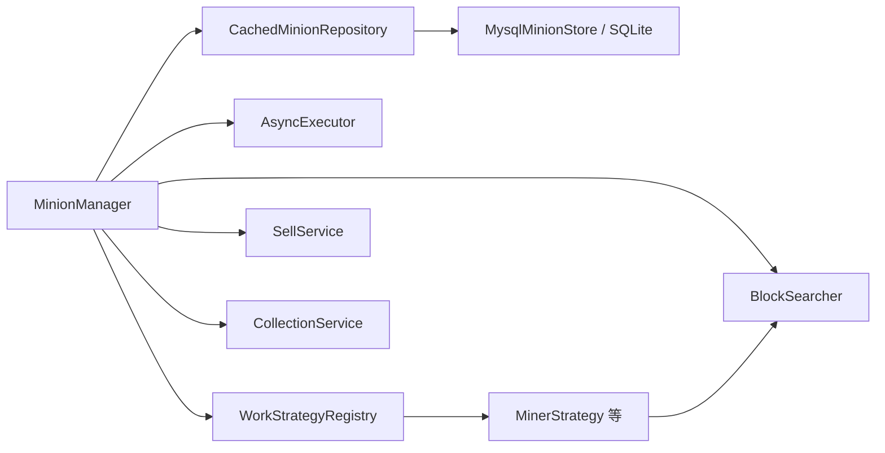

# 性能优化与调优

<cite>
**本文引用的文件**
- [MinionsPlugin.java](file://src/main/java/com/hcs/minions/MinionsPlugin.java)
- [MinionManager.java](file://src/main/java/com/hcs/minions/service/MinionManager.java)
- [BlockSearcher.java](file://src/main/java/com/hcs/minions/service/BlockSearcher.java)
- [AsyncExecutor.java](file://src/main/java/com/hcs/minions/util/AsyncExecutor.java)
- [CachedMinionRepository.java](file://src/main/java/com/hcs/minions/repository/CachedMinionRepository.java)
- [MysqlMinionStore.java](file://src/main/java/com/hcs/minions/repository/mysql/MysqlMinionStore.java)
- [PluginConfig.java](file://src/main/java/com/hcs/minions/config/PluginConfig.java)
- [config.yml](file://src/main/resources/config.yml)
- [MinionWorkStrategy.java](file://src/main/java/com/hcs/minions/work/MinionWorkStrategy.java)
- [WorkContext.java](file://src/main/java/com/hcs/minions/work/WorkContext.java)
- [WorkStrategyRegistry.java](file://src/main/java/com/hcs/minions/work/WorkStrategyRegistry.java)
- [MinerStrategy.java](file://src/main/java/com/hcs/minions/work/miner/MinerStrategy.java)
- [SellService.java](file://src/main/java/com/hcs/minions/service/SellService.java)
- [CollectionService.java](file://src/main/java/com/hcs/minions/service/CollectionService.java)
</cite>

## 目录
1. [简介](#简介)
2. [项目结构](#项目结构)
3. [核心组件](#核心组件)
4. [架构总览](#架构总览)
5. [详细组件分析](#详细组件分析)
6. [依赖关系分析](#依赖关系分析)
7. [性能考量](#性能考量)
8. [故障排查指南](#故障排查指南)
9. [结论](#结论)
10. [附录](#附录)

## 简介
本指南面向服务器管理员，聚焦 SkyMinions 插件在高并发、大规模环境下的性能优化。内容覆盖：
- 仆从搜索算法优化（两阶段螺旋扫描、硬上限控制）
- 异步任务调度（虚拟线程、全局调度器与区域调度器边界）
- 数据库查询优化（连接池、批量落库、脏数据快照）
- 系统级优化（JVM、Paper/Folia 配置、硬件建议）
- 监控与基准（内存、CPU、网络延迟、回归检测）
- 大规模部署最佳实践与扩展性考虑

## 项目结构
SkyMinions 采用“主类装配 + 服务分层 + 策略模式”的结构：
- 主类负责生命周期与服务装配，不承载业务逻辑
- MinionManager 作为全局调度中心，协调工作流、实体、售卖、升级等
- BlockSearcher 提供限流的两阶段螺旋搜索
- AsyncExecutor 统一封装虚拟线程与周期调度
- Repository 层带缓存与脏标记，批量异步落库
- WorkStrategyRegistry 将类型到策略的映射集中管理

图表来源
- [MinionsPlugin.java:52-120](file://src/main/java/com/hcs/minions/MinionsPlugin.java#L52-L120)
- [MinionManager.java:92-115](file://src/main/java/com/hcs/minions/service/MinionManager.java#L92-L115)
- [BlockSearcher.java:14-32](file://src/main/java/com/hcs/minions/service/BlockSearcher.java#L14-L32)
- [AsyncExecutor.java:19-32](file://src/main/java/com/hcs/minions/util/AsyncExecutor.java#L19-L32)
- [CachedMinionRepository.java:19-42](file://src/main/java/com/hcs/minions/repository/CachedMinionRepository.java#L19-L42)
- [MysqlMinionStore.java:64-92](file://src/main/java/com/hcs/minions/repository/mysql/MysqlMinionStore.java#L64-L92)
- [WorkStrategyRegistry.java:10-24](file://src/main/java/com/hcs/minions/work/WorkStrategyRegistry.java#L10-L24)
- [MinerStrategy.java:15-55](file://src/main/java/com/hcs/minions/work/miner/MinerStrategy.java#L15-L55)
- [SellService.java:16-41](file://src/main/java/com/hcs/minions/service/SellService.java#L16-L41)
- [CollectionService.java:21-47](file://src/main/java/com/hcs/minions/service/CollectionService.java#L21-L47)

章节来源
- [MinionsPlugin.java:52-120](file://src/main/java/com/hcs/minions/MinionsPlugin.java#L52-L120)
- [config.yml:4-27](file://src/main/resources/config.yml#L4-L27)

## 核心组件
- 全局调度与编排：MinionManager 使用 GlobalRegionScheduler 周期性遍历所有仆从，按区域线程委派实际工作；对 Inventory/方块/实体的访问严格在 RegionScheduler 执行，保证 Folia 兼容与线程安全。
- 搜索算法：BlockSearcher 实现“近处每周期必查 + 远处游标推进”的两阶段螺旋扫描，单次检查数受 maxChecksPerCycle 限制（强制 < 50）。
- 异步与调度：AsyncExecutor 基于 Java 21 虚拟线程执行 IO（数据库、Vault），并提供单线程周期调度器用于批量落库与轮询。
- 数据持久化：CachedMinionRepository 维护内存缓存与脏标记集合，收集脏 ID 后在 region 线程生成快照并批量异步写入；失败重试并重新置脏。
- 策略注册：WorkStrategyRegistry 以 EnumMap 存储类型到策略的映射，避免 if-else 分支，新增类型只需注册新策略。
- 售卖与里程碑：SellService 先扣物再异步加款，杜绝刷钱窗口；CollectionService 累计资源产出并在跨阈值时发放金币与槽位加成。

章节来源
- [MinionManager.java:186-250](file://src/main/java/com/hcs/minions/service/MinionManager.java#L186-L250)
- [BlockSearcher.java:14-66](file://src/main/java/com/hcs/minions/service/BlockSearcher.java#L14-L66)
- [AsyncExecutor.java:19-79](file://src/main/java/com/hcs/minions/util/AsyncExecutor.java#L19-L79)
- [CachedMinionRepository.java:19-153](file://src/main/java/com/hcs/minions/repository/CachedMinionRepository.java#L19-L153)
- [WorkStrategyRegistry.java:10-33](file://src/main/java/com/hcs/minions/work/WorkStrategyRegistry.java#L10-L33)
- [SellService.java:34-79](file://src/main/java/com/hcs/minions/service/SellService.java#L34-L79)
- [CollectionService.java:121-162](file://src/main/java/com/hcs/minions/service/CollectionService.java#L121-L162)

## 架构总览
下图展示关键路径：tick 周期 -> 区域线程委派 -> 策略执行 -> 搜索 -> 掉落处理 -> 升级链 -> 售卖/里程碑 -> 异步落库。

图表来源
- [MinionManager.java:191-250](file://src/main/java/com/hcs/minions/service/MinionManager.java#L191-L250)
- [MinerStrategy.java:36-55](file://src/main/java/com/hcs/minions/work/miner/MinerStrategy.java#L36-L55)
- [BlockSearcher.java:34-66](file://src/main/java/com/hcs/minions/service/BlockSearcher.java#L34-L66)
- [SellService.java:41-79](file://src/main/java/com/hcs/minions/service/SellService.java#L41-L79)
- [CachedMinionRepository.java:100-153](file://src/main/java/com/hcs/minions/repository/CachedMinionRepository.java#L100-L153)

## 详细组件分析

### 仆从搜索算法优化（BlockSearcher）
- 两阶段螺旋扫描：阶段一优先检查最近偏移，确保新出现的目标立即命中；阶段二推进游标逐步覆盖远处偏移，保证公平性与最终可达性。
- 硬上限保护：maxChecksPerCycle 强制小于 50，防止单周期 CPU 峰值过高。
- 偏移缓存：按半径预计算并按距离排序，减少重复计算。
- 区块加载判断：仅对已加载区块进行目标判定，避免无效 IO。

图表来源
- [BlockSearcher.java:34-66](file://src/main/java/com/hcs/minions/service/BlockSearcher.java#L34-L66)
- [BlockSearcher.java:68-91](file://src/main/java/com/hcs/minions/service/BlockSearcher.java#L68-L91)

章节来源
- [BlockSearcher.java:14-91](file://src/main/java/com/hcs/minions/service/BlockSearcher.java#L14-L91)
- [PluginConfig.java:22-41](file://src/main/java/com/hcs/minions/config/PluginConfig.java#L22-L41)
- [config.yml:5-7](file://src/main/resources/config.yml#L5-L7)

### 异步任务调度（AsyncExecutor + MinionManager）
- 虚拟线程执行 IO：数据库读写、Vault 加款等阻塞操作通过虚拟线程执行，避免占用主线程。
- 周期调度：单线程调度器用于批量落库与自动售卖轮询，避免为每个仆从创建定时器。
- 区域线程隔离：Inventory/方块/实体操作严格在 RegionScheduler 执行，保证线程安全与 Folia 兼容。
- 快照落库：收集脏 ID -> 在区域线程生成快照 -> 批量异步写入 -> 失败重试并重新置脏。

图表来源
- [MinionManager.java:124-160](file://src/main/java/com/hcs/minions/service/MinionManager.java#L124-L160)
- [AsyncExecutor.java:34-67](file://src/main/java/com/hcs/minions/util/AsyncExecutor.java#L34-L67)
- [CachedMinionRepository.java:100-153](file://src/main/java/com/hcs/minions/repository/CachedMinionRepository.java#L100-L153)
- [MysqlMinionStore.java:64-92](file://src/main/java/com/hcs/minions/repository/mysql/MysqlMinionStore.java#L64-L92)

章节来源
- [MinionManager.java:92-160](file://src/main/java/com/hcs/minions/service/MinionManager.java#L92-L160)
- [AsyncExecutor.java:19-79](file://src/main/java/com/hcs/minions/util/AsyncExecutor.java#L19-L79)
- [CachedMinionRepository.java:19-153](file://src/main/java/com/hcs/minions/repository/CachedMinionRepository.java#L19-L153)

### 数据库查询优化（Repository/Store）
- 连接池：MySQL 使用 HikariCP，设置合理最大池大小、最小空闲、连接超时与预处理语句缓存，避免虚拟线程被固定导致拥塞。
- 批量落库：通过脏标记与快照机制，减少频繁单条写入，降低锁竞争与事务开销。
- 缓存命中：首次加载后读路径走内存缓存，O(1) 平均查找，显著降低回源频率。
- 失败重试：写入失败时重新置脏，等待下一轮重试，保障数据一致性。

章节来源
- [MysqlMinionStore.java:64-92](file://src/main/java/com/hcs/minions/repository/mysql/MysqlMinionStore.java#L64-L92)
- [CachedMinionRepository.java:44-80](file://src/main/java/com/hcs/minions/repository/CachedMinionRepository.java#L44-L80)
- [CachedMinionRepository.java:134-153](file://src/main/java/com/hcs/minions/repository/CachedMinionRepository.java#L134-L153)

### 工作策略与上下文（MinionWorkStrategy / WorkContext）
- 策略接口抽象：canWork/performWork/cooldownTicks 三方法解耦类型判断与工作执行。
- 上下文传递：WorkContext 仅包含必要信息（Minion、World、Anchor、半径、随机源、搜索器），避免反向耦合 Manager。
- 注册表：WorkStrategyRegistry 用 EnumMap 存储策略，新增类型无需修改调度逻辑。

章节来源
- [MinionWorkStrategy.java:5-26](file://src/main/java/com/hcs/minions/work/MinionWorkStrategy.java#L5-L26)
- [WorkContext.java:10-21](file://src/main/java/com/hcs/minions/work/WorkContext.java#L10-L21)
- [WorkStrategyRegistry.java:10-33](file://src/main/java/com/hcs/minions/work/WorkStrategyRegistry.java#L10-L33)
- [MinerStrategy.java:15-55](file://src/main/java/com/hcs/minions/work/miner/MinerStrategy.java#L15-L55)

### 自动售卖与里程碑（SellService / CollectionService）
- 售卖顺序：先扣物（区域线程原子读取 Inventory），成功后异步加款，杜绝中间态导致的刷钱漏洞。
- 里程碑：累计资源产出，跨阈值时发放金币与槽位加成；文件落盘由外部定期触发，避免频繁 IO。

章节来源
- [SellService.java:34-79](file://src/main/java/com/hcs/minions/service/SellService.java#L34-L79)
- [CollectionService.java:121-162](file://src/main/java/com/hcs/minions/service/CollectionService.java#L121-L162)
- [CollectionService.java:218-238](file://src/main/java/com/hcs/minions/service/CollectionService.java#L218-L238)

## 依赖关系分析
- MinionManager 依赖 BlockSearcher、WorkStrategyRegistry、AsyncExecutor、Repository、Entity/Sell/Upgrade/Collection 等服务，形成“调度中心”角色。
- Repository 依赖 Store 实现（MySQL/SQLite），并通过 AsyncExecutor 执行 IO。
- Strategy 依赖 BlockSearcher 与 WorkContext，保持低耦合与可测试性。
- Config 为不可变快照，全局只读共享，避免运行时配置漂移。

图表来源
- [MinionManager.java:48-86](file://src/main/java/com/hcs/minions/service/MinionManager.java#L48-L86)
- [CachedMinionRepository.java:31-42](file://src/main/java/com/hcs/minions/repository/CachedMinionRepository.java#L31-L42)
- [MysqlMinionStore.java:64-92](file://src/main/java/com/hcs/minions/repository/mysql/MysqlMinionStore.java#L64-L92)
- [WorkStrategyRegistry.java:10-24](file://src/main/java/com/hcs/minions/work/WorkStrategyRegistry.java#L10-L24)
- [MinerStrategy.java:15-55](file://src/main/java/com/hcs/minions/work/miner/MinerStrategy.java#L15-L55)

章节来源
- [MinionManager.java:48-86](file://src/main/java/com/hcs/minions/service/MinionManager.java#L48-L86)
- [WorkStrategyRegistry.java:10-33](file://src/main/java/com/hcs/minions/work/WorkStrategyRegistry.java#L10-L33)

## 性能考量
- 搜索算法
  - 调整 max-checks-per-cycle：根据服务器 TPS 与玩家密度调小该值，确保单周期 CPU 占用稳定；默认 48，必须 < 50。
  - 半径与目标集：缩小工作半径与精简 targets 列表可减少无效校验。
- 异步与调度
  - 使用 GlobalRegionScheduler 做全局遍历，RegionScheduler 做区域绑定操作，避免跨线程访问状态。
  - 周期任务集中在单线程调度器，避免为每个仆从创建定时器。
- 数据库
  - MySQL 连接池大小适中（默认 4），开启预处理语句缓存，缩短连接超时，避免虚拟线程固定。
  - 利用脏标记与批量落库，降低写放大与锁竞争。
- 配置
  - tick-period：增大周期可降低遍历频率，但会延长响应时间；需权衡 TPS 与实时性。
  - economy.sell-interval-ticks：自动售卖间隔不宜过短，避免频繁 Inventory 访问。
- 内存与 GC
  - 避免在热点路径创建大量临时对象；合理使用缓存与复用随机源。
  - 监控堆使用与 GC 停顿，必要时调整 JVM 参数。
- 网络与 NMS
  - 减少不必要的网络包发送（如频繁实体更新）；利用 Paper/Folia 的线程模型降低同步成本。

[本节为通用指导，不直接分析具体文件]

## 故障排查指南
- 调试日志
  - 开启 debug 开关，观察“未找到目标”与“工作成功”日志，定位搜索范围与冷却问题。
- 常见异常
  - 异步任务失败：查看 AsyncExecutor 日志，确认 IO 异常与重试情况。
  - 数据库写入失败：检查 HikariCP 连接池与 SQL 错误，确认重试机制是否生效。
  - 售卖加款失败：确认 Vault 集成与权限，核对物品扣除与加款顺序。
- 实体清理
  - 使用孤儿实体清理功能，移除内存中不存在但世界残留的盔甲架。

章节来源
- [config.yml:10-11](file://src/main/resources/config.yml#L10-L11)
- [AsyncExecutor.java:34-67](file://src/main/java/com/hcs/minions/util/AsyncExecutor.java#L34-L67)
- [MysqlMinionStore.java:64-92](file://src/main/java/com/hcs/minions/repository/mysql/MysqlMinionStore.java#L64-L92)
- [SellService.java:66-79](file://src/main/java/com/hcs/minions/service/SellService.java#L66-L79)
- [MinionManager.java:397-413](file://src/main/java/com/hcs/minions/service/MinionManager.java#L397-L413)

## 结论
SkyMinions 通过两阶段螺旋搜索、严格的区域线程边界、虚拟线程异步 IO 与批量落库，实现了高吞吐与低延迟的工作循环。配合合理的配置与系统级调优，可在大规模服务器环境下保持稳定性能。建议持续监控关键指标，结合基准测试与回归检测，确保变更不会引入性能退化。

[本节为总结，不直接分析具体文件]

## 附录

### 系统级优化建议
- 服务器软件
  - 使用 Paper/Folia 以获得更好的线程模型与性能优化。
  - 合理设置 tick-period 与 chunk 加载策略，避免全图常驻。
- JVM 参数
  - 启用 ZGC/G1GC 并根据堆大小调整；设置合适的堆上限与元空间。
  - 启用 JIT 预热与编译选项，减少冷启动抖动。
- 硬件
  - 高主频 CPU 对 Minecraft 更友好；SSD 提升磁盘 IO 性能。
  - 充足内存以避免频繁 GC；网络带宽与延迟影响客户端体验。

[本节为通用指导，不直接分析具体文件]

### 监控与基准
- 内存使用
  - 监控堆使用、GC 次数与停顿；关注大对象分配热点。
- CPU 占用
  - 使用采样器定位热点方法（如搜索、策略执行、IO）。
- 网络延迟
  - 监控 TPS、网络往返时间与丢包率；优化实体与数据包发送频率。
- 基准测试
  - 设计场景：不同仆从数量、工作半径、目标集；测量 TPS 下降与响应时间。
- 回归检测
  - 将关键指标纳入 CI 流程，对比基线版本，发现性能退化及时回滚。

[本节为通用指导，不直接分析具体文件]