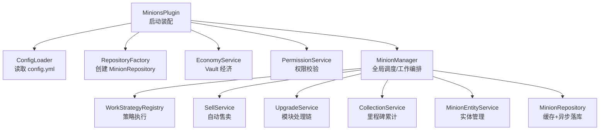
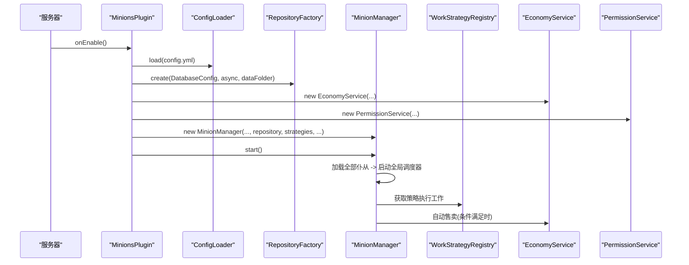
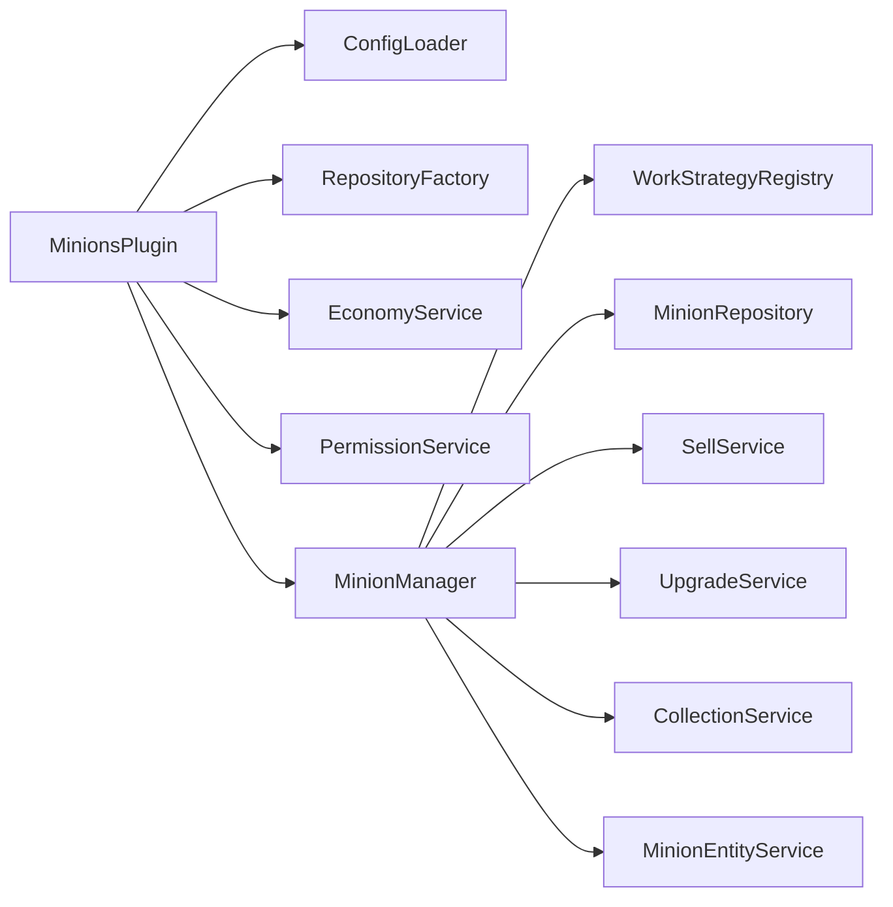

# 故障排除与常见问题

<cite>
**本文引用的文件**
- [MinionsPlugin.java](file://src/main/java/com/hcs/minions/MinionsPlugin.java)
- [config.yml](file://src/main/resources/config.yml)
- [ConfigLoader.java](file://src/main/java/com/hcs/minions/config/ConfigLoader.java)
- [DatabaseConfig.java](file://src/main/java/com/hcs/minions/config/DatabaseConfig.java)
- [RepositoryFactory.java](file://src/main/java/com/hcs/minions/repository/RepositoryFactory.java)
- [MinionRepository.java](file://src/main/java/com/hcs/minions/repository/MinionRepository.java)
- [MinionManager.java](file://src/main/java/com/hcs/minions/service/MinionManager.java)
- [EconomyService.java](file://src/main/java/com/hcs/minions/service/EconomyService.java)
- [PermissionService.java](file://src/main/java/com/hcs/minions/service/PermissionService.java)
- [Logs.java](file://src/main/java/com/hcs/minions/util/Logs.java)
- [Messages.java](file://src/main/java/com/hcs/minions/util/Messages.java)
- [MinionCommand.java](file://src/main/java/com/hcs/minions/command/MinionCommand.java)
</cite>

## 目录
1. [简介](#简介)
2. [项目结构](#项目结构)
3. [核心组件](#核心组件)
4. [架构总览](#架构总览)
5. [详细组件分析](#详细组件分析)
6. [依赖关系分析](#依赖关系分析)
7. [性能注意事项](#性能注意事项)
8. [故障排除指南](#故障排除指南)
9. [结论](#结论)
10. [附录](#附录)

## 简介
本指南面向 SkyMinions 插件的使用者与服主，聚焦安装、运行、配置、数据库连接、权限、性能等常见问题的定位与解决。文档基于代码实现梳理了日志体系、关键调度路径、数据持久化与经济模块的交互边界，并提供可操作的诊断步骤与优化建议。

## 项目结构
SkyMinions 采用“启动装配 + 服务分层”的组织方式：
- 启动入口负责加载配置、装配服务、注册事件与命令、启动全局调度器。
- 服务层按职责拆分：管理器、经济、权限、仓库、升级、离线收益等。
- 配置集中加载为强类型对象，运行时只读共享。
- 日志统一通过 SLF4J 输出，便于在 Paper 平台统一查看。

图表来源
- [MinionsPlugin.java:51-118](file://src/main/java/com/hcs/minions/MinionsPlugin.java#L51-L118)
- [MinionManager.java:92-115](file://src/main/java/com/hcs/minions/service/MinionManager.java#L92-L115)

章节来源
- [MinionsPlugin.java:51-118](file://src/main/java/com/hcs/minions/MinionsPlugin.java#L51-L118)
- [config.yml:1-153](file://src/main/resources/config.yml#L1-L153)

## 核心组件
- 配置加载：唯一允许访问 getConfig() 的地方，将 YAML 反序列化为强类型记录，缺失或非法值回退默认并告警。
- 数据仓库：抽象出 MinionRepository，内部包含内存缓存与异步落库；根据配置选择 SQLite 或 MySQL。
- 管理器：MinionManager 维护仆从集合、全局 tick 调度、区域线程委派、自动售卖轮询、快照落库。
- 经济服务：可选 Vault 集成，所有金额计算使用 BigDecimal，仅在 Vault 边界转换 double，失败不结算。
- 权限服务：基于 Bukkit 权限（LuckPerms 等），支持数量上限与类型限制。
- 日志系统：统一 SLF4J 出口，禁止空 catch 吞异常。

章节来源
- [ConfigLoader.java:30-83](file://src/main/java/com/hcs/minions/config/ConfigLoader.java#L30-L83)
- [RepositoryFactory.java:20-29](file://src/main/java/com/hcs/minions/repository/RepositoryFactory.java#L20-L29)
- [MinionRepository.java:16-46](file://src/main/java/com/hcs/minions/repository/MinionRepository.java#L16-L46)
- [MinionManager.java:92-115](file://src/main/java/com/hcs/minions/service/MinionManager.java#L92-L115)
- [EconomyService.java:38-86](file://src/main/java/com/hcs/minions/service/EconomyService.java#L38-L86)
- [PermissionService.java:33-73](file://src/main/java/com/hcs/minions/service/PermissionService.java#L33-L73)
- [Logs.java:10-31](file://src/main/java/com/hcs/minions/util/Logs.java#L10-L31)

## 架构总览
下图展示了插件启动到工作循环的关键调用链，以及各组件之间的依赖关系。

图表来源
- [MinionsPlugin.java:51-118](file://src/main/java/com/hcs/minions/MinionsPlugin.java#L51-L118)
- [MinionManager.java:92-115](file://src/main/java/com/hcs/minions/service/MinionManager.java#L92-L115)

## 详细组件分析

### 配置与日志
- 配置项包括全局调度周期、最大检查次数、每玩家仆从上限、数据库、经济、离线收益、收集里程碑与各类型参数。
- 配置加载时对非法物料名、未知目标方块等进行告警并回退默认值。
- 日志统一通过 SLF4J，提供 info/warn/error 方法，错误堆栈会原样输出。

章节来源
- [config.yml:4-153](file://src/main/resources/config.yml#L4-L153)
- [ConfigLoader.java:63-83](file://src/main/java/com/hcs/minions/config/ConfigLoader.java#L63-L83)
- [ConfigLoader.java:106-151](file://src/main/java/com/hcs/minions/config/ConfigLoader.java#L106-L151)
- [Logs.java:20-31](file://src/main/java/com/hcs/minions/util/Logs.java#L20-L31)

### 数据持久化与缓存
- RepositoryFactory 根据配置选择 SQLite 或 MySQL 存储，并初始化后包装为带缓存的实现。
- MinionRepository 暴露异步接口，业务层无需感知 IO；管理器周期性收集脏 ID 并在对应 region 线程生成快照后批量落库。
- 关闭时同步冲刷剩余脏数据，避免丢失。

章节来源
- [RepositoryFactory.java:20-29](file://src/main/java/com/hcs/minions/repository/RepositoryFactory.java#L20-L29)
- [MinionRepository.java:16-46](file://src/main/java/com/hcs/minions/repository/MinionRepository.java#L16-L46)
- [MinionManager.java:124-160](file://src/main/java/com/hcs/minions/service/MinionManager.java#L124-L160)
- [MinionManager.java:162-180](file://src/main/java/com/hcs/minions/service/MinionManager.java#L162-L180)

### 工作循环与线程模型
- 全局调度器以固定周期遍历所有仆从，仅做纯内存与线程安全的只读判断。
- 真正触碰方块/实体/Inventory 的操作通过 RegionScheduler 委派到对应区域线程，确保 Folia 兼容。
- 区块未加载时异步加载；附近无玩家则跳过工作。
- 工作失败或找不到目标时，调试模式下会限频打印原因。

章节来源
- [MinionManager.java:186-215](file://src/main/java/com/hcs/minions/service/MinionManager.java#L186-L215)
- [MinionManager.java:217-250](file://src/main/java/com/hcs/minions/service/MinionManager.java#L217-L250)
- [MinionManager.java:252-322](file://src/main/java/com/hcs/minions/service/MinionManager.java#L252-L322)

### 经济模块与自动售卖
- 经济功能可选，需启用 Vault；若未找到实现则关闭并告警。
- 价格计算使用 BigDecimal，避免浮点误差；Vault 调用在虚拟线程异步执行，成功才结算。
- 自动售卖可在 GUI 开关或通过「自动售卖漏斗」模块触发；轮询在 GlobalRegionScheduler 上执行，逐个委派到 region 线程判断并售卖。

章节来源
- [EconomyService.java:38-86](file://src/main/java/com/hcs/minions/service/EconomyService.java#L38-L86)
- [MinionManager.java:324-350](file://src/main/java/com/hcs/minions/service/MinionManager.java#L324-L350)

### 权限与数量上限
- 管理员权限 hcs.minions.admin；类型权限 hcs.minions.type.<type>。
- 数量上限通过 hcs.minions.limit.<n> 或通配 * 授予；解析一次有效权限集，避免多次 hasPermission 调用。
- 最终上限 = 权限上限 + Collection 里程碑槽位加成。

章节来源
- [PermissionService.java:21-73](file://src/main/java/com/hcs/minions/service/PermissionService.java#L21-L73)
- [MinionManager.java:356-364](file://src/main/java/com/hcs/minions/service/MinionManager.java#L356-L364)

### 命令与文案
- /minion 子命令：give、upgrade、skin、collection、reload、purge、list。
- 文案支持热重载，缺失键回退内置默认；MiniMessage 渲染失败会记录警告。
- 常用运维命令：reload 重载配置与文案；purge 清理残留实体；list 统计在线仆从数。

章节来源
- [MinionCommand.java:50-174](file://src/main/java/com/hcs/minions/command/MinionCommand.java#L50-L174)
- [Messages.java:128-144](file://src/main/java/com/hcs/minions/util/Messages.java#L128-L144)
- [Messages.java:279-299](file://src/main/java/com/hcs/minions/util/Messages.java#L279-L299)

## 依赖关系分析
- MinionsPlugin 依赖 ConfigLoader、RepositoryFactory、EconomyService、PermissionService、MinionManager 等。
- MinionManager 依赖 WorkStrategyRegistry、BlockSearcher、MinionEntityService、SellService、UpgradeService、CollectionService、MinionRepository。
- EconomyService 依赖 Vault（可选）。
- 所有 IO 操作通过 Repository 抽象，业务层解耦。

图表来源
- [MinionsPlugin.java:51-118](file://src/main/java/com/hcs/minions/MinionsPlugin.java#L51-L118)
- [MinionManager.java:44-86](file://src/main/java/com/hcs/minions/service/MinionManager.java#L44-L86)

章节来源
- [MinionsPlugin.java:51-118](file://src/main/java/com/hcs/minions/MinionsPlugin.java#L51-L118)
- [MinionManager.java:44-86](file://src/main/java/com/hcs/minions/service/MinionManager.java#L44-L86)

## 性能注意事项
- 全局调度周期与单次检查上限：tick-period 控制调度频率；max-checks-per-cycle 必须小于 50，超过会被强制回落。
- 区块加载：未加载区块异步加载，避免阻塞；附近无玩家时跳过工作。
- Inventory 访问：必须在 region 线程进行，管理器已严格区分全局与区域线程。
- 自动售卖：轮询间隔可调，过小会增加全服扫描开销。
- 数据库连接池：pool-size 影响并发能力，小服建议保持较小池以避免虚拟线程被固定。

章节来源
- [config.yml:4-22](file://src/main/resources/config.yml#L4-L22)
- [ConfigLoader.java:63-67](file://src/main/java/com/hcs/minions/config/ConfigLoader.java#L63-L67)
- [MinionManager.java:191-215](file://src/main/java/com/hcs/minions/service/MinionManager.java#L191-L215)
- [MinionManager.java:324-350](file://src/main/java/com/hcs/minions/service/MinionManager.java#L324-L350)

## 故障排除指南

### 一、安装问题
- 症状：插件无法加载或命令不可用。
- 可能原因：
  - 缺少依赖（如 Vault 未启用但经济功能开启）。
  - 配置文件格式错误或字段缺失导致加载失败。
- 排查步骤：
  - 查看启动日志中是否有“Vault 未启用/未找到实现”的警告。
  - 检查 config.yml 的 database、economy、types 等关键段是否完整。
  - 使用 /minion reload 重载配置与文案，确认生效。
- 相关位置
  - 经济模块检测与告警
  - 配置加载与回退逻辑

章节来源
- [EconomyService.java:38-49](file://src/main/java/com/hcs/minions/service/EconomyService.java#L38-L49)
- [ConfigLoader.java:30-83](file://src/main/java/com/hcs/minions/config/ConfigLoader.java#L30-L83)
- [MinionCommand.java:124-128](file://src/main/java/com/hcs/minions/command/MinionCommand.java#L124-L128)

### 二、数据库连接问题
- 症状：启动时报错、仆从加载失败、数据不持久化。
- 可能原因：
  - 数据库类型配置错误（sqlite/mysql）。
  - MySQL 主机、端口、库名、用户、密码不正确。
  - 连接池过大导致资源竞争。
- 排查步骤：
  - 确认 database.type 与 sqlite-file/host/port/database/user/password/pool-size。
  - 观察启动日志中的“仆从加载失败”错误堆栈。
  - 重启后检查是否出现连接超时或认证失败。
- 相关位置
  - 数据库配置对象
  - 仓库工厂装配
  - 管理器加载流程

章节来源
- [DatabaseConfig.java:6-20](file://src/main/java/com/hcs/minions/config/DatabaseConfig.java#L6-L20)
- [RepositoryFactory.java:20-29](file://src/main/java/com/hcs/minions/repository/RepositoryFactory.java#L20-L29)
- [MinionManager.java:92-115](file://src/main/java/com/hcs/minions/service/MinionManager.java#L92-L115)

### 三、权限不足
- 症状：无法放置/操作仆从、提示达到上限。
- 可能原因：
  - 未授予 hcs.minions.admin 或 hcs.minions.type.<type>。
  - 未设置 hcs.minions.limit.<n> 或通配 *。
- 排查步骤：
  - 在权限系统中为组或玩家添加相应权限。
  - 使用 /minion list 查看当前在线仆从数，结合权限上限判断。
  - 检查 Collection 里程碑是否提供额外槽位加成。
- 相关位置
  - 权限服务解析
  - 放置时的上限计算

章节来源
- [PermissionService.java:33-73](file://src/main/java/com/hcs/minions/service/PermissionService.java#L33-L73)
- [MinionManager.java:356-364](file://src/main/java/com/hcs/minions/service/MinionManager.java#L356-L364)

### 四、性能问题
- 症状：服务器卡顿、仆从不工作、产出低。
- 可能原因：
  - tick-period 过小导致频繁调度。
  - max-checks-per-cycle 过大被强制回落，仍可能过高。
  - 自动售卖轮询间隔过短。
  - 区块未加载或附近无玩家。
- 排查步骤：
  - 调整 tick-period 与 max-checks-per-cycle。
  - 增大 sell-interval-ticks 降低轮询频率。
  - 观察日志中“异步区块加载失败”和“未找到目标”的调试信息。
- 相关位置
  - 全局调度与区域线程委派
  - 自动售卖轮询

章节来源
- [config.yml:4-22](file://src/main/resources/config.yml#L4-L22)
- [MinionManager.java:191-215](file://src/main/java/com/hcs/minions/service/MinionManager.java#L191-L215)
- [MinionManager.java:324-350](file://src/main/java/com/hcs/minions/service/MinionManager.java#L324-L350)

### 五、配置错误
- 症状：某些功能不生效、物品名报错、稀有掉落无效。
- 可能原因：
  - types.* 下的 targets/product/upgrade-item/rare-drop 名称错误。
  - rare-drop-chance 设置了但 rare-drop 为空。
- 排查步骤：
  - 修正物料名为大写且存在的 Material。
  - 确保 rare-drop 与 chance 同时有效。
  - 使用 /minion reload 重载配置。
- 相关位置
  - 配置加载与物料解析
  - 稀有掉落判定

章节来源
- [ConfigLoader.java:106-151](file://src/main/java/com/hcs/minions/config/ConfigLoader.java#L106-L151)
- [MinionManager.java:289-304](file://src/main/java/com/hcs/minions/service/MinionManager.java#L289-L304)

### 六、运行问题（工作异常）
- 症状：仆从不工作、无掉落、GUI 打开失败。
- 可能原因：
  - 区块未加载或附近无玩家。
  - 策略 canWork 返回 false。
  - 工作过程中抛出异常。
- 排查步骤：
  - 开启 debug=true 查看“未找到目标 anchor”的调试日志。
  - 检查工作半径与目标方块列表是否合理。
  - 查看错误堆栈定位具体策略异常。
- 相关位置
  - 工作前检查与区域线程委派
  - 异常捕获与日志

章节来源
- [MinionManager.java:217-250](file://src/main/java/com/hcs/minions/service/MinionManager.java#L217-L250)
- [MinionManager.java:252-281](file://src/main/java/com/hcs/minions/service/MinionManager.java#L252-L281)

### 七、经济模块问题
- 症状：自动售卖不生效、加款失败。
- 可能原因：
  - Vault 未启用或未找到实现。
  - 加款响应非 SUCCESS。
- 排查步骤：
  - 确认 Vault 已启用并正确配置经济插件。
  - 查看日志中“Vault 加款失败”的详细信息。
  - 检查 price-multiplier 与 sell-interval-ticks。
- 相关位置
  - 经济模块检测与异步加款

章节来源
- [EconomyService.java:38-86](file://src/main/java/com/hcs/minions/service/EconomyService.java#L38-L86)

### 八、日志分析方法
- 日志级别：info/warn/error 分别用于正常、警告、错误；错误会附带堆栈。
- 关键信息识别：
  - “仆从加载失败”：数据库或初始化问题。
  - “异步区块加载失败”：区块加载异常。
  - “Vault 加款失败”：经济模块异常。
  - “未知目标方块/物料名”：配置错误。
- 技巧：
  - 开启 debug=true 获取更详细的调试输出。
  - 使用 /minion reload 重载配置与文案，验证变更。
  - 关注 RegionScheduler 与 GlobalRegionScheduler 的调用路径，避免在主线程外访问 Inventory。

章节来源
- [Logs.java:20-31](file://src/main/java/com/hcs/minions/util/Logs.java#L20-L31)
- [MinionManager.java:92-115](file://src/main/java/com/hcs/minions/service/MinionManager.java#L92-L115)
- [MinionManager.java:201-205](file://src/main/java/com/hcs/minions/service/MinionManager.java#L201-L205)
- [EconomyService.java:73-86](file://src/main/java/com/hcs/minions/service/EconomyService.java#L73-L86)
- [ConfigLoader.java:116-131](file://src/main/java/com/hcs/minions/config/ConfigLoader.java#L116-L131)

### 九、问题诊断工具与方法
- 命令调试：
  - /minion reload：重载配置与文案。
  - /minion purge：清理残留盔甲架实体。
  - /minion list：统计在线仆从总数。
- 配置检查：
  - 核对 database、economy、types、collections 等关键段。
  - 调整 tick-period、max-checks-per-cycle、sell-interval-ticks。
- 性能监控：
  - 观察日志中区块加载与工作失败频率。
  - 评估自动售卖轮询对服务器的影响。
  - 根据规模调整数据库连接池大小。

章节来源
- [MinionCommand.java:124-174](file://src/main/java/com/hcs/minions/command/MinionCommand.java#L124-L174)
- [config.yml:4-22](file://src/main/resources/config.yml#L4-L22)
- [MinionManager.java:324-350](file://src/main/java/com/hcs/minions/service/MinionManager.java#L324-L350)

### 十、解决方案汇总
- 安装问题：确保依赖（Vault）启用，修复配置错误，使用 /minion reload。
- 数据库问题：修正连接参数，检查 pool-size，查看加载失败堆栈。
- 权限问题：授予 admin/type/limit 权限，结合 Collection 里程碑加成。
- 性能问题：调大 tick-period、限制 max-checks-per-cycle、增大 sell-interval-ticks。
- 配置问题：修正物料名与稀有掉落配置，确保 rare-drop 与 chance 匹配。
- 运行问题：开启 debug，检查区块加载与目标方块，定位策略异常。
- 经济问题：启用 Vault，检查加款响应，调整价格倍率与轮询间隔。

章节来源
- [MinionsPlugin.java:51-118](file://src/main/java/com/hcs/minions/MinionsPlugin.java#L51-L118)
- [MinionManager.java:92-115](file://src/main/java/com/hcs/minions/service/MinionManager.java#L92-L115)
- [EconomyService.java:38-86](file://src/main/java/com/hcs/minions/service/EconomyService.java#L38-L86)
- [PermissionService.java:33-73](file://src/main/java/com/hcs/minions/service/PermissionService.java#L33-L73)
- [ConfigLoader.java:106-151](file://src/main/java/com/hcs/minions/config/ConfigLoader.java#L106-L151)

## 结论
SkyMinions 通过强类型配置、统一日志、区域线程安全的工作循环与异步持久化，提供了稳定且可扩展的仆从系统。遇到问题时，优先检查配置与日志，再结合命令与性能参数进行调优。经济模块需依赖 Vault，权限与数量上限可通过权限系统与 Collection 里程碑灵活控制。

## 附录
- 社区支持与反馈渠道：请在插件发布页或官方论坛提交问题，附上服务器版本、插件版本、config.yml 与相关日志片段。
- 最佳实践：
  - 保持配置最小化与清晰注释。
  - 定期使用 /minion purge 清理残留实体。
  - 根据服务器规模调整调度周期与数据库连接池。
  - 开启 debug 仅用于问题定位，生产环境建议关闭以减少日志量。