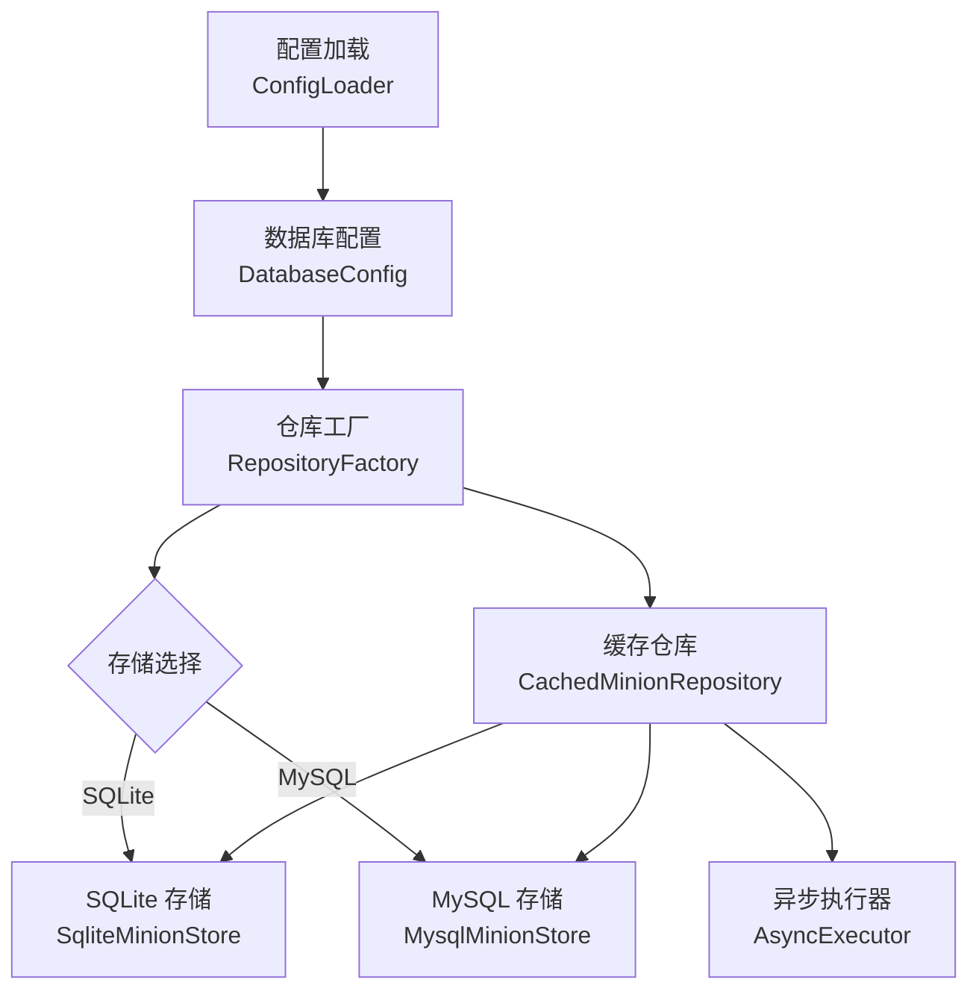
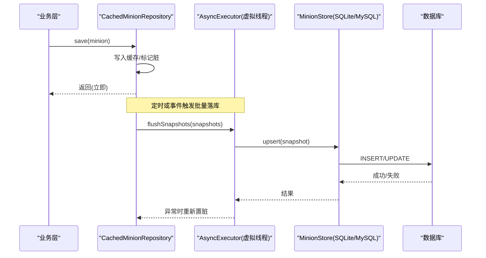
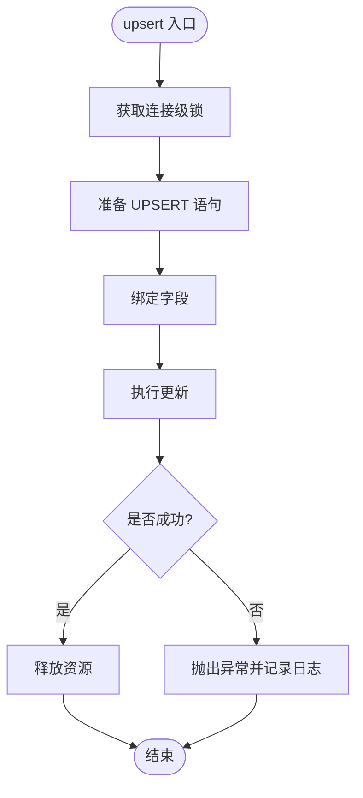
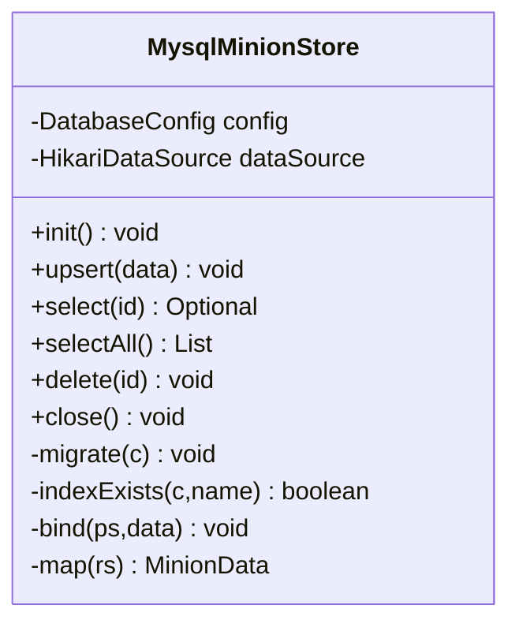
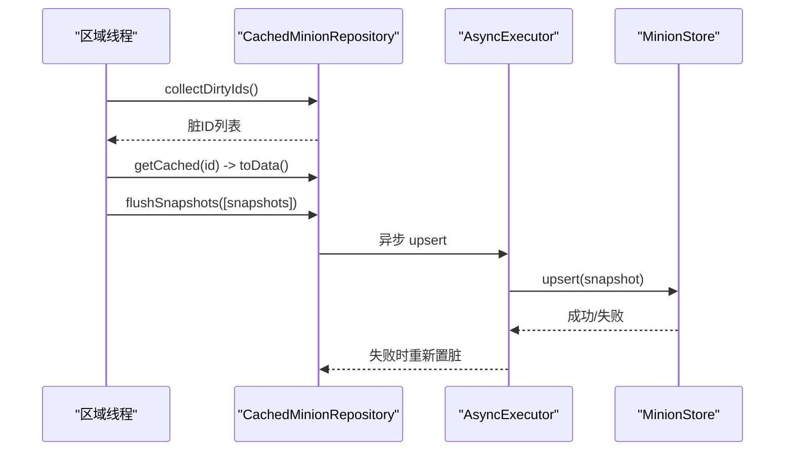
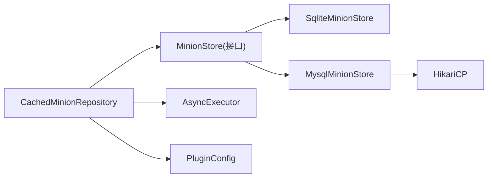

# 数据库问题诊断

<cite>
**本文引用的文件**
- [config.yml](file://src/main/resources/config.yml)
- [DatabaseConfig.java](file://src/main/java/com/hcs/minions/config/DatabaseConfig.java)
- [ConfigLoader.java](file://src/main/java/com/hcs/minions/config/ConfigLoader.java)
- [RepositoryFactory.java](file://src/main/java/com/hcs/minions/repository/RepositoryFactory.java)
- [MinionStore.java](file://src/main/java/com/hcs/minions/repository/MinionStore.java)
- [MinionRepository.java](file://src/main/java/com/hcs/minions/repository/MinionRepository.java)
- [CachedMinionRepository.java](file://src/main/java/com/hcs/minions/repository/CachedMinionRepository.java)
- [SqliteMinionStore.java](file://src/main/java/com/hcs/minions/repository/sqlite/SqliteMinionStore.java)
- [MysqlMinionStore.java](file://src/main/java/com/hcs/minions/repository/mysql/MysqlMinionStore.java)
- [AsyncExecutor.java](file://src/main/java/com/hcs/minions/util/AsyncExecutor.java)
</cite>

## 目录
1. [简介](#简介)
2. [项目结构](#项目结构)
3. [核心组件](#核心组件)
4. [架构总览](#架构总览)
5. [详细组件分析](#详细组件分析)
6. [依赖关系分析](#依赖关系分析)
7. [性能考虑](#性能考虑)
8. [故障排查指南](#故障排查指南)
9. [结论](#结论)
10. [附录](#附录)

## 简介
本文件面向 SQLite 与 MySQL 两类数据持久化场景，提供系统化的问题诊断与修复方法。内容覆盖连接池配置、连接超时处理、事务与并发控制、数据同步与一致性校验、备份恢复策略、数据迁移、监控指标、慢查询分析与索引优化等。文档基于仓库中实际实现进行说明，确保可操作性和可追溯性。

## 项目结构
本项目采用“接口 + 具体存储实现”的分层设计：
- 配置层：从 YAML 加载数据库类型、SQLite 文件路径、MySQL 连接参数与连接池大小。
- 工厂层：根据配置装配 SQLite 或 MySQL 的底层存储，并包装为带缓存的仓库。
- 仓储层：对外暴露统一的 MinionRepository 接口，内部维护内存缓存与脏标记集合，异步批量落库。
- 存储层：分别实现 SQLite（单连接+锁）与 MySQL（HikariCP 连接池）。
- 异步执行器：使用虚拟线程隔离阻塞 IO，避免主线程阻塞。

图表来源
- [ConfigLoader.java:30-83](file://src/main/java/com/hcs/minions/config/ConfigLoader.java#L30-L83)
- [RepositoryFactory.java:20-29](file://src/main/java/com/hcs/minions/repository/RepositoryFactory.java#L20-L29)
- [SqliteMinionStore.java:22-79](file://src/main/java/com/hcs/minions/repository/sqlite/SqliteMinionStore.java#L22-L79)
- [MysqlMinionStore.java:25-92](file://src/main/java/com/hcs/minions/repository/mysql/MysqlMinionStore.java#L25-L92)
- [CachedMinionRepository.java:29-42](file://src/main/java/com/hcs/minions/repository/CachedMinionRepository.java#L29-L42)
- [AsyncExecutor.java:19-32](file://src/main/java/com/hcs/minions/util/AsyncExecutor.java#L19-L32)

章节来源
- [config.yml:13-22](file://src/main/resources/config.yml#L13-L22)
- [ConfigLoader.java:30-83](file://src/main/java/com/hcs/minions/config/ConfigLoader.java#L30-L83)
- [RepositoryFactory.java:20-29](file://src/main/java/com/hcs/minions/repository/RepositoryFactory.java#L20-L29)

## 核心组件
- 配置对象 DatabaseConfig：强类型描述数据库类型、SQLite 文件、MySQL 主机/端口/库名/用户/密码与连接池大小；提供 isSqlite() 判断。
- 配置加载 ConfigLoader：从 config.yml 读取 database.* 字段并构造 DatabaseConfig，默认值与边界检查在加载阶段完成。
- 仓库工厂 RepositoryFactory：按配置创建 SqliteMinionStore 或 MysqlMinionStore，并统一包装为 CachedMinionRepository。
- 存储接口 MinionStore：定义 init/upsert/select/selectAll/delete/close 等阻塞式方法，仅被仓储层调用。
- 仓储接口 MinionRepository：对外暴露 find/save/delete/flushDirty/flushSnapshots/flushDirtySync 等异步与同步落库能力。
- 缓存仓储 CachedMinionRepository：ConcurrentHashMap 缓存 + 脏标记集合 + 虚拟线程异步落库；两阶段落库保证 Inventory 访问线程安全。
- 异步执行器 AsyncExecutor：基于 Java 21 虚拟线程池，所有 IO 任务通过它提交，避免主线程阻塞。

章节来源
- [DatabaseConfig.java:6-20](file://src/main/java/com/hcs/minions/config/DatabaseConfig.java#L6-L20)
- [ConfigLoader.java:30-83](file://src/main/java/com/hcs/minions/config/ConfigLoader.java#L30-L83)
- [RepositoryFactory.java:20-29](file://src/main/java/com/hcs/minions/repository/RepositoryFactory.java#L20-L29)
- [MinionStore.java:13-27](file://src/main/java/com/hcs/minions/repository/MinionStore.java#L13-L27)
- [MinionRepository.java:16-47](file://src/main/java/com/hcs/minions/repository/MinionRepository.java#L16-L47)
- [CachedMinionRepository.java:29-42](file://src/main/java/com/hcs/minions/repository/CachedMinionRepository.java#L29-L42)
- [AsyncExecutor.java:19-32](file://src/main/java/com/hcs/minions/util/AsyncExecutor.java#L19-L32)

## 架构总览
下图展示请求到落库的完整链路：业务调用仓储接口，仓储先更新内存缓存与脏标记，再由异步执行器调度到底层存储；SQLite 使用单连接加锁，MySQL 使用 HikariCP 连接池。

图表来源
- [CachedMinionRepository.java:74-80](file://src/main/java/com/hcs/minions/repository/CachedMinionRepository.java#L74-L80)
- [CachedMinionRepository.java:134-153](file://src/main/java/com/hcs/minions/repository/CachedMinionRepository.java#L134-L153)
- [SqliteMinionStore.java:112-121](file://src/main/java/com/hcs/minions/repository/sqlite/SqliteMinionStore.java#L112-L121)
- [MysqlMinionStore.java:144-152](file://src/main/java/com/hcs/minions/repository/mysql/MysqlMinionStore.java#L144-L152)
- [AsyncExecutor.java:34-56](file://src/main/java/com/hcs/minions/util/AsyncExecutor.java#L34-L56)

## 详细组件分析

### SQLite 存储实现
- 初始化：加载驱动、创建/检查文件目录、建立连接、建表与幂等迁移（补充列、创建 owner 索引）。
- 并发模型：单连接 + synchronized 临界区保护所有写/读操作，避免 SQLite 写入串行导致的竞争。
- 数据模型：minions 表包含 id、owner、type、level、xp、world、坐标、燃料、最后活跃时间、岛屿 ID、升级槽位、皮肤、库存二进制等字段。
- 迁移策略：通过 PRAGMA table_info 检测缺失列后 ALTER TABLE 补齐；创建 idx_minions_owner 提升按 owner 查询性能。
- 错误处理：捕获异常并记录日志，抛出运行时异常以便上层重试或告警。

图表来源
- [SqliteMinionStore.java:112-121](file://src/main/java/com/hcs/minions/repository/sqlite/SqliteMinionStore.java#L112-L121)
- [SqliteMinionStore.java:81-109](file://src/main/java/com/hcs/minions/repository/sqlite/SqliteMinionStore.java#L81-L109)

章节来源
- [SqliteMinionStore.java:22-79](file://src/main/java/com/hcs/minions/repository/sqlite/SqliteMinionStore.java#L22-L79)
- [SqliteMinionStore.java:81-109](file://src/main/java/com/hcs/minions/repository/sqlite/SqliteMinionStore.java#L81-L109)
- [SqliteMinionStore.java:112-164](file://src/main/java/com/hcs/minions/repository/sqlite/SqliteMinionStore.java#L112-L164)

### MySQL 存储实现
- 连接池：使用 HikariCP，JDBC URL 指定字符集与 SSL 选项；最大池大小取配置 pool-size 与最小值 2 的较大者；最小空闲为 0；连接超时 5 秒；启用预编译语句缓存。
- 初始化：显式加载 MySQL 驱动，建表与幂等迁移（补充列、创建 owner 索引），若索引已存在则跳过。
- 并发模型：每个 SQL 操作从连接池借出连接，自动归还；无全局锁，依赖数据库行级锁与唯一键冲突处理。
- 错误处理：捕获异常并记录日志，抛出运行时异常供上层重试或告警。

图表来源
- [MysqlMinionStore.java:25-92](file://src/main/java/com/hcs/minions/repository/mysql/MysqlMinionStore.java#L25-L92)
- [MysqlMinionStore.java:94-141](file://src/main/java/com/hcs/minions/repository/mysql/MysqlMinionStore.java#L94-L141)
- [MysqlMinionStore.java:144-198](file://src/main/java/com/hcs/minions/repository/mysql/MysqlMinionStore.java#L144-L198)

章节来源
- [MysqlMinionStore.java:25-92](file://src/main/java/com/hcs/minions/repository/mysql/MysqlMinionStore.java#L25-L92)
- [MysqlMinionStore.java:94-141](file://src/main/java/com/hcs/minions/repository/mysql/MysqlMinionStore.java#L94-L141)
- [MysqlMinionStore.java:144-198](file://src/main/java/com/hcs/minions/repository/mysql/MysqlMinionStore.java#L144-L198)

### 缓存仓储与异步落库
- 缓存策略：ConcurrentHashMap 保存 Minion 对象，find/findAll 优先命中缓存；未命中时异步回源并回填。
- 脏标记与批量落库：save 仅更新缓存与脏集合；由调度器或 region 线程收集脏 ID，生成快照后批量异步 upsert；失败时重新置脏等待重试。
- 线程安全：Inventory 访问严格限定在主线程或 region 线程；异步线程只负责 IO，避免竞态导致的数据丢失。
- 关闭流程：onDisable 前同步冲刷脏数据，再关闭底层存储，防止连接池关闭后异步写失败丢数据。

图表来源
- [CachedMinionRepository.java:100-117](file://src/main/java/com/hcs/minions/repository/CachedMinionRepository.java#L100-L117)
- [CachedMinionRepository.java:134-153](file://src/main/java/com/hcs/minions/repository/CachedMinionRepository.java#L134-L153)
- [CachedMinionRepository.java:190-213](file://src/main/java/com/hcs/minions/repository/CachedMinionRepository.java#L190-L213)

章节来源
- [CachedMinionRepository.java:44-87](file://src/main/java/com/hcs/minions/repository/CachedMinionRepository.java#L44-L87)
- [CachedMinionRepository.java:100-171](file://src/main/java/com/hcs/minions/repository/CachedMinionRepository.java#L100-L171)
- [CachedMinionRepository.java:190-213](file://src/main/java/com/hcs/minions/repository/CachedMinionRepository.java#L190-L213)

### 配置与工厂装配
- 配置来源：config.yml 的 database.* 段，包括 type、sqlite-file、host、port、database、user、password、pool-size。
- 类型判断：DatabaseConfig.isSqlite() 决定走 SQLite 还是 MySQL 分支。
- 工厂装配：RepositoryFactory.create 根据配置实例化对应 Store 并 init，再包装为 CachedMinionRepository。

章节来源
- [config.yml:13-22](file://src/main/resources/config.yml#L13-L22)
- [DatabaseConfig.java:6-20](file://src/main/java/com/hcs/minions/config/DatabaseConfig.java#L6-L20)
- [ConfigLoader.java:30-83](file://src/main/java/com/hcs/minions/config/ConfigLoader.java#L30-L83)
- [RepositoryFactory.java:20-29](file://src/main/java/com/hcs/minions/repository/RepositoryFactory.java#L20-L29)

## 依赖关系分析
- 耦合度：仓储层对存储层解耦良好，通过 MinionStore 接口屏蔽差异；工厂集中装配，便于扩展新存储。
- 直接依赖：
  - CachedMinionRepository 依赖 MinionStore、AsyncExecutor、PluginConfig。
  - MysqlMinionStore 依赖 HikariCP、DatabaseConfig。
  - SqliteMinionStore 依赖 JDBC 驱动与 File。
- 外部集成点：
  - MySQL 连接池属性（连接超时、预编译缓存、池大小）。
  - SQLite 文件路径与权限。
  - 插件配置加载器（YAML 到强类型对象）。

图表来源
- [MinionRepository.java:16-47](file://src/main/java/com/hcs/minions/repository/MinionRepository.java#L16-L47)
- [MinionStore.java:13-27](file://src/main/java/com/hcs/minions/repository/MinionStore.java#L13-L27)
- [MysqlMinionStore.java:25-92](file://src/main/java/com/hcs/minions/repository/mysql/MysqlMinionStore.java#L25-L92)
- [SqliteMinionStore.java:22-79](file://src/main/java/com/hcs/minions/repository/sqlite/SqliteMinionStore.java#L22-L79)

章节来源
- [MinionRepository.java:16-47](file://src/main/java/com/hcs/minions/repository/MinionRepository.java#L16-L47)
- [MinionStore.java:13-27](file://src/main/java/com/hcs/minions/repository/MinionStore.java#L13-L27)

## 性能考虑
- SQLite 性能要点
  - 单连接串行写入，synchronized 保护避免竞争；适合单机小并发场景。
  - 已创建 owner 索引，按主人查询/统计避免全表扫描。
  - 建议定期备份文件，避免频繁大事务写入造成 WAL 膨胀。
- MySQL 性能要点
  - HikariCP 连接池：最大池大小受配置 pool-size 限制，默认至少 2；连接超时 5 秒，避免堆积。
  - 开启预编译语句缓存（cachePrepStmts=true，prepStmtCacheSize=128），减少解析开销。
  - 已创建 owner 索引，提升按 owner 查询效率。
  - 虚拟线程 + 小连接池：避免固定载体线程导致线程膨胀。
- 缓存与批量落库
  - 内存缓存降低重复读取；脏标记集合驱动批量 upsert，减少网络往返。
  - 失败重入：落库异常时重新置脏，等待后续周期重试，提高最终一致性。

章节来源
- [SqliteMinionStore.java:81-109](file://src/main/java/com/hcs/minions/repository/sqlite/SqliteMinionStore.java#L81-L109)
- [MysqlMinionStore.java:73-92](file://src/main/java/com/hcs/minions/repository/mysql/MysqlMinionStore.java#L73-L92)
- [MysqlMinionStore.java:125-128](file://src/main/java/com/hcs/minions/repository/mysql/MysqlMinionStore.java#L125-L128)
- [CachedMinionRepository.java:134-153](file://src/main/java/com/hcs/minions/repository/CachedMinionRepository.java#L134-L153)

## 故障排查指南

### 连接与连接池问题（MySQL）
- 现象
  - 启动时报“未找到 MySQL JDBC 驱动”。
  - 连接超时或无法获取连接。
- 定位步骤
  - 检查 config.yml 的 database.type/host/port/database/user/password/pool-size。
  - 确认 HikariCP 配置：最大池大小、连接超时、预编译缓存。
  - 验证 MySQL 服务可达性与账号权限。
- 修复建议
  - 修正连接字符串与认证信息。
  - 调整 pool-size 与 connectionTimeout，避免在高并发下耗尽连接。
  - 如出现驱动类缺失，确保打包 shade 不覆盖 META-INF/services。

章节来源
- [MysqlMinionStore.java:64-92](file://src/main/java/com/hcs/minions/repository/mysql/MysqlMinionStore.java#L64-L92)
- [config.yml:13-22](file://src/main/resources/config.yml#L13-L22)

### SQLite 文件与权限问题
- 现象
  - 初始化失败、无法创建文件或目录。
- 定位步骤
  - 检查 sqlite-file 路径与父目录是否存在、是否有写权限。
  - 查看日志中的初始化错误堆栈。
- 修复建议
  - 确保插件数据目录可写。
  - 清理损坏的 .db 文件并重启重建（注意备份）。

章节来源
- [SqliteMinionStore.java:62-79](file://src/main/java/com/hcs/minions/repository/sqlite/SqliteMinionStore.java#L62-L79)

### 事务与并发冲突
- 现象
  - 并发写入导致数据不一致或丢失。
- 机制说明
  - SQLite：单连接 + 锁，天然串行化写入；避免并发竞争。
  - MySQL：利用 ON DUPLICATE KEY UPDATE 与唯一键约束保证幂等；连接池独立连接，依赖数据库锁。
- 排查建议
  - 核对主键/唯一键设计，确保 upsert 语义正确。
  - 观察脏标记与批量落库路径，避免多线程同时修改同一对象。
  - 关注关闭时的同步冲刷，防止进程退出丢数据。

章节来源
- [SqliteMinionStore.java:112-164](file://src/main/java/com/hcs/minions/repository/sqlite/SqliteMinionStore.java#L112-L164)
- [MysqlMinionStore.java:144-191](file://src/main/java/com/hcs/minions/repository/mysql/MysqlMinionStore.java#L144-L191)
- [CachedMinionRepository.java:190-213](file://src/main/java/com/hcs/minions/repository/CachedMinionRepository.java#L190-L213)

### 数据同步与一致性
- 现象
  - 内存与磁盘不一致，或下线后数据丢失。
- 机制说明
  - save 仅更新缓存与脏标记；批量落库由调度器或 region 线程触发。
  - 关闭前同步冲刷，确保连接池关闭前数据落地。
- 排查建议
  - 检查调度器是否正常触发 flushSnapshots。
  - 观察异常重入逻辑：失败时是否重新置脏。
  - 在 onDisable 前关闭 GUI，避免冲刷期间玩家交互导致中间态。

章节来源
- [CachedMinionRepository.java:74-80](file://src/main/java/com/hcs/minions/repository/CachedMinionRepository.java#L74-L80)
- [CachedMinionRepository.java:134-153](file://src/main/java/com/hcs/minions/repository/CachedMinionRepository.java#L134-L153)
- [CachedMinionRepository.java:190-213](file://src/main/java/com/hcs/minions/repository/CachedMinionRepository.java#L190-L213)

### 数据完整性校验
- 建议
  - 定期导出 SQLite 文件或使用 mysqldump 导出 MySQL 数据。
  - 校验关键字段：id 唯一性、owner 索引有效性、inventory 二进制完整性。
  - 对比内存快照与数据库记录，发现不一致及时修复。

章节来源
- [SqliteMinionStore.java:81-109](file://src/main/java/com/hcs/minions/repository/sqlite/SqliteMinionStore.java#L81-L109)
- [MysqlMinionStore.java:94-141](file://src/main/java/com/hcs/minions/repository/mysql/MysqlMinionStore.java#L94-L141)

### 备份恢复策略
- SQLite
  - 停止服务或锁定文件后进行拷贝备份；或使用 WAL 模式下的在线备份工具。
  - 恢复时替换 .db 文件并确保权限正确。
- MySQL
  - 使用 mysqldump 或企业备份工具定期全量/增量备份。
  - 恢复时先停写，再导入数据，最后验证索引与数据一致性。

[本节为通用实践说明，不直接分析具体文件]

### 数据迁移工具
- 内置迁移
  - SQLite：启动时检测缺失列并 ALTER TABLE 补齐；创建 owner 索引。
  - MySQL：启动时检测缺失列与索引，必要时补齐。
- 建议
  - 迁移脚本幂等，支持重复执行。
  - 迁移前后记录版本与变更日志。

章节来源
- [SqliteMinionStore.java:81-109](file://src/main/java/com/hcs/minions/repository/sqlite/SqliteMinionStore.java#L81-L109)
- [MysqlMinionStore.java:94-141](file://src/main/java/com/hcs/minions/repository/mysql/MysqlMinionStore.java#L94-L141)

### 监控指标与慢查询分析
- 指标建议
  - 连接池：活跃连接数、等待获取连接次数、连接超时次数。
  - 落库：批量 upsert 成功率、失败重试次数、平均耗时。
  - 缓存命中率：find/findAll 命中比例。
- 慢查询
  - 开启 MySQL 慢查询日志，分析全表扫描与缺失索引。
  - 检查 owner 索引是否生效，避免按 owner 查询时全表扫描。
  - 对高频查询添加必要索引，避免过度索引影响写入。

章节来源
- [MysqlMinionStore.java:73-92](file://src/main/java/com/hcs/minions/repository/mysql/MysqlMinionStore.java#L73-L92)
- [MysqlMinionStore.java:125-128](file://src/main/java/com/hcs/minions/repository/mysql/MysqlMinionStore.java#L125-L128)

### 索引优化方法
- 已有索引
  - owner 索引用于按主人查询/统计，避免全表扫描。
- 优化建议
  - 针对高频过滤条件（如 world、type）评估是否需要复合索引。
  - 监控索引使用率，删除无用索引以减少写入开销。
  - 定期 ANALYZE 表以更新统计信息。

章节来源
- [SqliteMinionStore.java:107-109](file://src/main/java/com/hcs/minions/repository/sqlite/SqliteMinionStore.java#L107-L109)
- [MysqlMinionStore.java:125-128](file://src/main/java/com/hcs/minions/repository/mysql/MysqlMinionStore.java#L125-L128)

## 结论
本项目通过清晰的接口分层、缓存与异步落库机制，有效降低了数据库访问对主线程的影响，并在 SQLite 与 MySQL 两种后端上提供了稳定的持久化能力。结合合理的连接池配置、幂等迁移、索引优化与监控手段，可显著提升系统的可靠性与性能。建议在上线前完成连接测试、迁移演练与备份恢复验证，持续跟踪关键指标并及时调优。

## 附录
- 配置项参考
  - database.type：sqlite | mysql
  - database.sqlite-file：SQLite 文件名
  - database.host/port/database/user/password：MySQL 连接参数
  - database.pool-size：HikariCP 最大池大小
- 关键路径
  - 配置加载：ConfigLoader.load
  - 存储装配：RepositoryFactory.create
  - 落库流程：CachedMinionRepository.flushSnapshots
  - 关闭流程：CachedMinionRepository.close

章节来源
- [config.yml:13-22](file://src/main/resources/config.yml#L13-L22)
- [ConfigLoader.java:30-83](file://src/main/java/com/hcs/minions/config/ConfigLoader.java#L30-L83)
- [RepositoryFactory.java:20-29](file://src/main/java/com/hcs/minions/repository/RepositoryFactory.java#L20-L29)
- [CachedMinionRepository.java:134-153](file://src/main/java/com/hcs/minions/repository/CachedMinionRepository.java#L134-L153)
- [CachedMinionRepository.java:208-213](file://src/main/java/com/hcs/minions/repository/CachedMinionRepository.java#L208-L213)