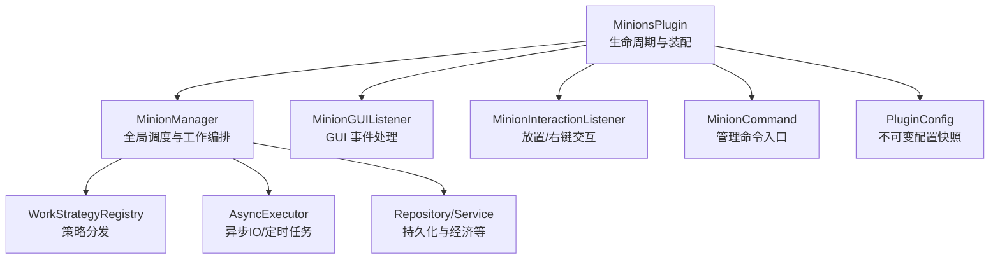
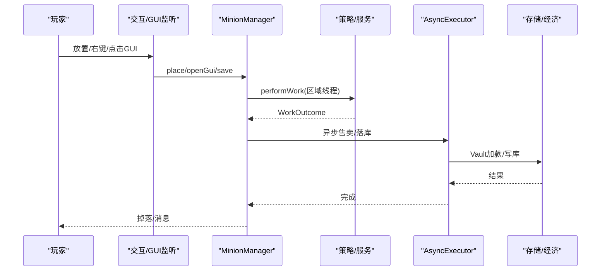
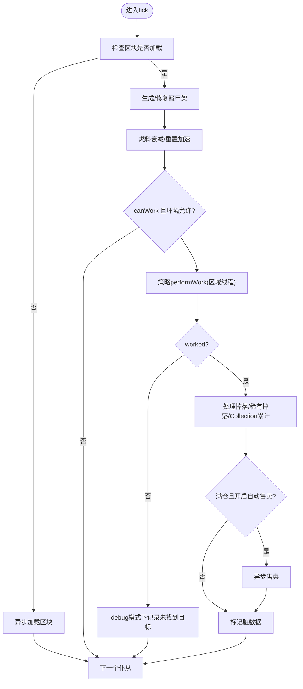
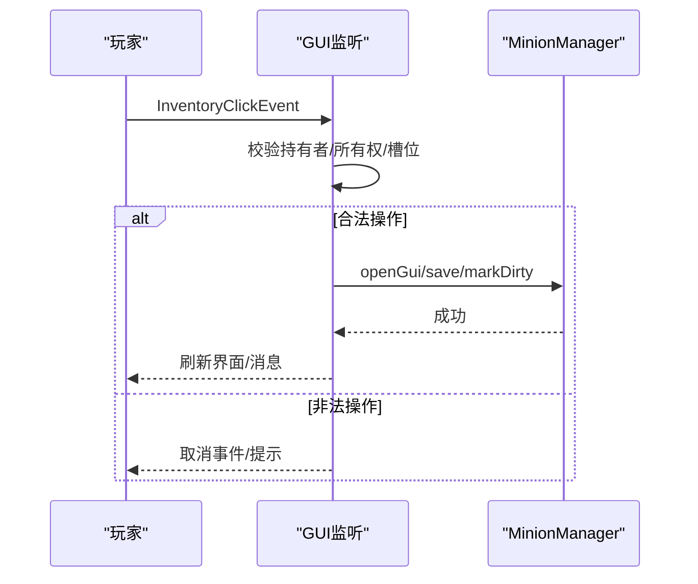
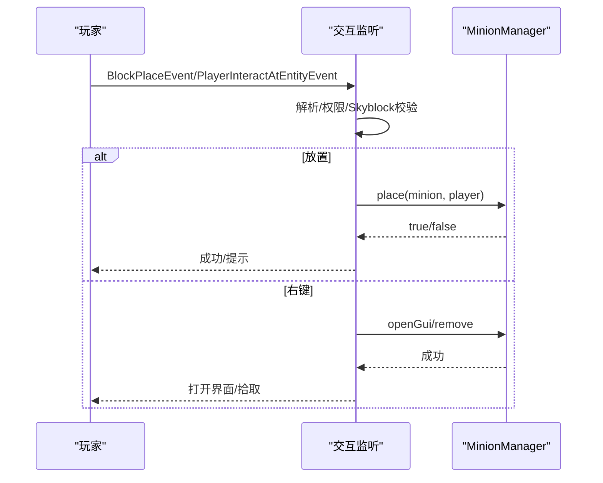
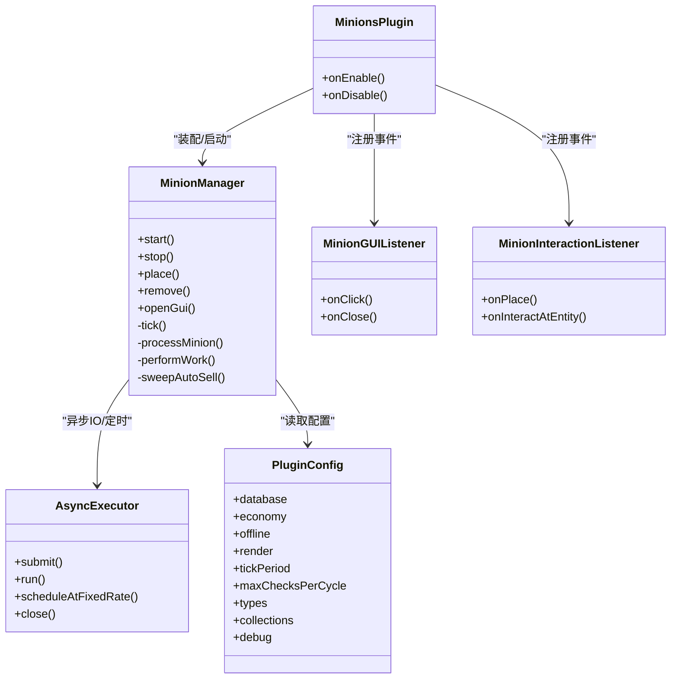

# 运行时错误处理

<cite>
**本文引用的文件**
- [MinionsPlugin.java](file://src/main/java/com/hcs/minions/MinionsPlugin.java)
- [MinionManager.java](file://src/main/java/com/hcs/minions/service/MinionManager.java)
- [MinionGUIListener.java](file://src/main/java/com/hcs/minions/gui/MinionGUIListener.java)
- [MinionInteractionListener.java](file://src/main/java/com/hcs/minions/listener/MinionInteractionListener.java)
- [MinionCommand.java](file://src/main/java/com/hcs/minions/command/MinionCommand.java)
- [Logs.java](file://src/main/java/com/hcs/minions/util/Logs.java)
- [AsyncExecutor.java](file://src/main/java/com/hcs/minions/util/AsyncExecutor.java)
- [PluginConfig.java](file://src/main/java/com/hcs/minions/config/PluginConfig.java)
- [config.yml](file://src/main/resources/config.yml)
</cite>

## 目录
1. [简介](#简介)
2. [项目结构](#项目结构)
3. [核心组件](#核心组件)
4. [架构总览](#架构总览)
5. [详细组件分析](#详细组件分析)
6. [依赖关系分析](#依赖关系分析)
7. [性能与稳定性考量](#性能与稳定性考量)
8. [故障排查指南](#故障排查指南)
9. [结论](#结论)
10. [附录：调试命令与日志技巧](#附录：调试命令与日志技巧)

## 简介
本指南面向 SkyMinions 插件的运维与开发者，聚焦运行时的错误处理与排障。内容覆盖仆从工作异常、GUI 界面错误、事件监听失效等核心问题；解释日志级别配置与日志分析方法（含关键错误识别、堆栈跟踪分析与性能瓶颈定位）；提供可操作的调试命令与工具使用方法（如 /minion reload、/minion purge、/minion list 等），并给出内存泄漏检测、线程阻塞诊断等高级调试技术建议。

## 项目结构
SkyMinions 采用“主类装配 + 服务化 + 策略模式”的分层设计：
- 主类负责生命周期管理与服务装配、事件注册、调度器启动。
- MinionManager 作为全局单例调度器，编排仆从工作、自动售卖、快照落库等。
- GUI 与交互监听分别处理仓库界面与放置/右键交互。
- 异步执行器统一承载 IO 与后台任务，避免在主线程阻塞。
- 配置以不可变快照形式注入，集中管理 tick 周期、检查上限、调试开关等。

图表来源
- [MinionsPlugin.java:52-120](file://src/main/java/com/hcs/minions/MinionsPlugin.java#L52-L120)
- [MinionManager.java:92-115](file://src/main/java/com/hcs/minions/service/MinionManager.java#L92-L115)
- [MinionGUIListener.java:49-125](file://src/main/java/com/hcs/minions/gui/MinionGUIListener.java#L49-L125)
- [MinionInteractionListener.java:54-142](file://src/main/java/com/hcs/minions/listener/MinionInteractionListener.java#L54-L142)
- [MinionCommand.java:51-68](file://src/main/java/com/hcs/minions/command/MinionCommand.java#L51-L68)
- [PluginConfig.java:22-45](file://src/main/java/com/hcs/minions/config/PluginConfig.java#L22-L45)

章节来源
- [MinionsPlugin.java:52-120](file://src/main/java/com/hcs/minions/MinionsPlugin.java#L52-L120)
- [config.yml:4-11](file://src/main/resources/config.yml#L4-L11)

## 核心组件
- 日志系统：统一通过 SLF4J 输出 info/warn/error，禁止业务代码空 catch 吞异常。
- 异步执行器：基于虚拟线程的异步执行与单线程调度器，所有 IO 与周期任务经此执行，异常统一记录。
- 管理器：MinionManager 负责加载、tick 遍历、区域线程委派工作、自动售卖、快照落库、实体生成/回收。
- GUI 监听：处理仓库点击、升级、皮肤切换、收集、关闭时燃料应用与保存。
- 交互监听：处理放置仆从、右键打开 GUI、潜行拾取、手持燃料补给。
- 命令：/minion give/upgrade/skin/collection/reload/purge/list，用于发放、升级、查看集合、重载配置、清理孤儿、统计数量。

章节来源
- [Logs.java:6-31](file://src/main/java/com/hcs/minions/util/Logs.java#L6-L31)
- [AsyncExecutor.java:12-79](file://src/main/java/com/hcs/minions/util/AsyncExecutor.java#L12-L79)
- [MinionManager.java:39-115](file://src/main/java/com/hcs/minions/service/MinionManager.java#L39-L115)
- [MinionGUIListener.java:29-153](file://src/main/java/com/hcs/minions/gui/MinionGUIListener.java#L29-L153)
- [MinionInteractionListener.java:31-142](file://src/main/java/com/hcs/minions/listener/MinionInteractionListener.java#L31-L142)
- [MinionCommand.java:22-68](file://src/main/java/com/hcs/minions/command/MinionCommand.java#L22-L68)

## 架构总览
下图展示关键运行时流程：主类启动后注册事件与命令，管理器启动全局 tick 与自动售卖轮询；工作逻辑在区域线程安全执行；异步任务处理 IO；GUI 与交互监听响应玩家操作。

图表来源
- [MinionManager.java:191-322](file://src/main/java/com/hcs/minions/service/MinionManager.java#L191-L322)
- [AsyncExecutor.java:34-67](file://src/main/java/com/hcs/minions/util/AsyncExecutor.java#L34-L67)
- [MinionGUIListener.java:49-153](file://src/main/java/com/hcs/minions/gui/MinionGUIListener.java#L49-L153)
- [MinionInteractionListener.java:54-142](file://src/main/java/com/hcs/minions/listener/MinionInteractionListener.java#L54-L142)

## 详细组件分析

### 仆从工作异常（核心路径）
- 触发点：全局 tick 遍历 -> 区域线程委派 -> 策略执行 -> 产出处理 -> 自动售卖 -> 标记脏数据。
- 常见异常：
  - 区块未加载或坐标转换失败：跳过该仆当次工作。
  - 策略执行异常：捕获并记录错误日志，避免中断后续仆从。
  - 无目标/冷却中：根据 debug 开关输出调试信息。
- 恢复机制：
  - 盔甲架按需生成/自愈。
  - 燃料衰减与加速逻辑保证工作节奏。
  - 自动售卖在满足条件时触发。

图表来源
- [MinionManager.java:191-322](file://src/main/java/com/hcs/minions/service/MinionManager.java#L191-L322)

章节来源
- [MinionManager.java:191-322](file://src/main/java/com/hcs/minions/service/MinionManager.java#L191-L322)

### GUI 界面错误
- 典型问题：
  - 持有者不匹配或仆从不存在：关闭 GUI 防止状态不一致。
  - 非所有者操作：取消事件，保护权限边界。
  - 槽位锁定：解锁前禁止访问。
  - 关闭时燃料应用与保存：确保燃料生效与数据持久化。
- 恢复与防护：
  - 严格校验持有者与所有权。
  - 对非法点击直接取消事件。
  - 关闭时统一刷新并保存。

图表来源
- [MinionGUIListener.java:49-153](file://src/main/java/com/hcs/minions/gui/MinionGUIListener.java#L49-L153)

章节来源
- [MinionGUIListener.java:49-153](file://src/main/java/com/hcs/minions/gui/MinionGUIListener.java#L49-L153)

### 事件监听失效
- 放置监听：解析物品类型、权限校验、Skyblock 区域限制、创建 Minion 并调用 manager.place。
- 右键监听：区分潜行拾取、手持燃料补给、打开 GUI。
- 常见问题：
  - 权限不足：返回提示信息。
  - 不在岛屿范围：阻止放置。
  - 非所有者交互：拒绝打开 GUI。
- 恢复与防护：
  - 使用高优先级监听并确保取消事件。
  - 严格参数校验与上下文判断。

图表来源
- [MinionInteractionListener.java:54-142](file://src/main/java/com/hcs/minions/listener/MinionInteractionListener.java#L54-L142)

章节来源
- [MinionInteractionListener.java:54-142](file://src/main/java/com/hcs/minions/listener/MinionInteractionListener.java#L54-L142)

### 命令与调试入口
- /minion give <type> [level]：发放指定类型的仆从物品。
- /minion upgrade <module>：发放升级模块。
- /minion skin：列出可用皮肤。
- /minion collection：查看采集进度与里程碑奖励。
- /minion reload：重载配置与文本资源。
- /minion purge：清理孤儿实体。
- /minion list：统计当前在线仆从总数。

章节来源
- [MinionCommand.java:51-176](file://src/main/java/com/hcs/minions/command/MinionCommand.java#L51-L176)

## 依赖关系分析
- MinionsPlugin 依赖各服务与监听器，完成装配与启动。
- MinionManager 依赖策略注册表、搜索器、实体服务、售卖服务、权限服务、异步执行器、升级服务、采集服务。
- GUI 与交互监听依赖管理器与服务，确保状态一致性与线程安全。
- 异步执行器为 IO 与周期任务提供隔离的执行环境。

图表来源
- [MinionsPlugin.java:52-120](file://src/main/java/com/hcs/minions/MinionsPlugin.java#L52-L120)
- [MinionManager.java:70-115](file://src/main/java/com/hcs/minions/service/MinionManager.java#L70-L115)
- [MinionGUIListener.java:40-47](file://src/main/java/com/hcs/minions/gui/MinionGUIListener.java#L40-L47)
- [MinionInteractionListener.java:44-52](file://src/main/java/com/hcs/minions/listener/MinionInteractionListener.java#L44-L52)
- [AsyncExecutor.java:19-79](file://src/main/java/com/hcs/minions/util/AsyncExecutor.java#L19-L79)
- [PluginConfig.java:22-45](file://src/main/java/com/hcs/minions/config/PluginConfig.java#L22-L45)

章节来源
- [MinionsPlugin.java:52-120](file://src/main/java/com/hcs/minions/MinionsPlugin.java#L52-L120)
- [MinionManager.java:70-115](file://src/main/java/com/hcs/minions/service/MinionManager.java#L70-L115)
- [AsyncExecutor.java:19-79](file://src/main/java/com/hcs/minions/util/AsyncExecutor.java#L19-L79)
- [PluginConfig.java:22-45](file://src/main/java/com/hcs/minions/config/PluginConfig.java#L22-L45)

## 性能与稳定性考量
- 线程边界清晰：方块破坏/掉落物生成仅在区域线程执行；IO 与售卖在异步线程执行。
- 批量快照落库：按 region 线程生成快照，避免并发读写导致的数据不一致。
- 检查上限保护：配置强制 max-checks-per-cycle < 50，防止单次策略执行过长。
- 自动售卖间隔可调：避免频繁访问 Inventory 造成卡顿。
- 调试开关：debug 模式仅用于排查，生产环境建议关闭以减少日志开销。

章节来源
- [MinionManager.java:117-160](file://src/main/java/com/hcs/minions/service/MinionManager.java#L117-L160)
- [PluginConfig.java:36-41](file://src/main/java/com/hcs/minions/config/PluginConfig.java#L36-L41)
- [config.yml:4-11](file://src/main/resources/config.yml#L4-L11)

## 故障排查指南

### 日志级别与输出位置
- 日志出口：统一通过 Logs 类输出到 SLF4J（Paper 平台暴露 slf4j-api）。
- 级别说明：
  - info：常规运行信息（如已加载仆从数、放置日志）。
  - warn：潜在问题（如配置缺失类型）。
  - error：严重错误（如异步任务失败、工作异常、区块加载失败）。
- 配置文件：config.yml 中的 debug 开关控制详细调试日志输出。

章节来源
- [Logs.java:6-31](file://src/main/java/com/hcs/minions/util/Logs.java#L6-L31)
- [config.yml:10-11](file://src/main/resources/config.yml#L10-L11)

### 关键错误识别与堆栈跟踪
- 异步任务失败：关注“异步任务执行失败”日志及堆栈，定位具体任务与异常原因。
- 仆从工作异常：关注“仆从工作异常”日志，包含 minion id 与 type，便于快速定位。
- 区块加载失败：关注“异步区块加载失败”，检查世界名与 chunk 坐标。
- GUI 相关：若出现界面错乱，优先检查持有者与所有权校验逻辑。

章节来源
- [AsyncExecutor.java:34-67](file://src/main/java/com/hcs/minions/util/AsyncExecutor.java#L34-L67)
- [MinionManager.java:260-269](file://src/main/java/com/hcs/minions/service/MinionManager.java#L260-L269)
- [MinionManager.java:201-205](file://src/main/java/com/hcs/minions/service/MinionManager.java#L201-L205)

### 性能瓶颈定位
- 检查 tick 周期与 max-checks-per-cycle：过大将导致单周期负载过高。
- 观察自动售卖间隔：过短会频繁访问 Inventory。
- 监控 debug 日志：开启后可追踪未找到目标、稀有掉落等细节。
- 使用服务器性能工具（如 Spark、Timings）结合日志定位热点。

章节来源
- [config.yml:4-11](file://src/main/resources/config.yml#L4-L11)
- [MinionManager.java:101-110](file://src/main/java/com/hcs/minions/service/MinionManager.java#L101-L110)

### 内存泄漏与线程阻塞诊断
- 内存泄漏迹象：
  - 长时间运行后内存持续增长。
  - 孤儿实体未清理：使用 /minion purge 清理残留盔甲架。
  - 检查 Collection 定期落盘是否正常（默认 60 秒一次）。
- 线程阻塞迹象：
  - 主线程卡顿：确认是否在区域线程外访问了 Inventory/World。
  - 异步任务堆积：检查 AsyncExecutor 的周期任务是否抛出异常被吞掉。
- 建议：
  - 启用 debug 模式短期排查。
  - 使用 JProfiler/VisualVM 抓取堆转储，分析对象保留链。
  - 使用线程转储（thread dump）定位阻塞线程。

章节来源
- [MinionManager.java:162-180](file://src/main/java/com/hcs/minions/service/MinionManager.java#L162-L180)
- [MinionsPlugin.java:116-118](file://src/main/java/com/hcs/minions/MinionsPlugin.java#L116-L118)
- [AsyncExecutor.java:58-67](file://src/main/java/com/hcs/minions/util/AsyncExecutor.java#L58-L67)

## 结论
SkyMinions 通过清晰的线程边界、统一的日志与异步执行器、以及健壮的事件与 GUI 处理，提供了稳定的仆从工作体验。运维时应重点关注日志中的错误信息、合理配置 tick 周期与检查上限，并使用提供的命令进行日常维护与调试。对于复杂问题，结合服务器性能工具与高级调试技术可有效定位与解决。

## 附录：调试命令与日志技巧

### 常用命令
- /minion reload：重载配置与文本资源，适用于修改 config.yml 或 messages.yml 后即时生效。
- /minion purge：清理孤儿实体，适用于异常关闭后残留盔甲架。
- /minion list：统计当前仆从总数，用于快速了解在线规模。
- /minion give <type> [level]：发放仆从物品，便于测试不同策略。
- /minion upgrade <module>：发放升级模块，验证升级链效果。
- /minion skin：列出可用皮肤，便于 UI 测试。
- /minion collection：查看采集进度与里程碑奖励，验证 Collection 功能。

### 日志分析技巧
- 开启 debug：在 config.yml 中将 debug 设为 true，获取更详细的调试信息。
- 关注 error 日志：优先处理“异步任务执行失败”“仆从工作异常”“异步区块加载失败”。
- 结合时间戳：定位问题发生的时间段，关联服务器负载与玩家行为。
- 过滤关键词：使用服务器日志过滤器搜索“SkyMinions”“MinionManager”“AsyncExecutor”等关键字。

章节来源
- [MinionCommand.java:51-176](file://src/main/java/com/hcs/minions/command/MinionCommand.java#L51-L176)
- [config.yml:10-11](file://src/main/resources/config.yml#L10-L11)
- [Logs.java:20-31](file://src/main/java/com/hcs/minions/util/Logs.java#L20-L31)