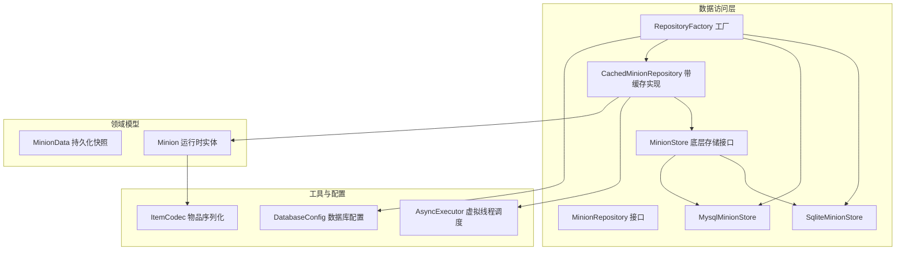
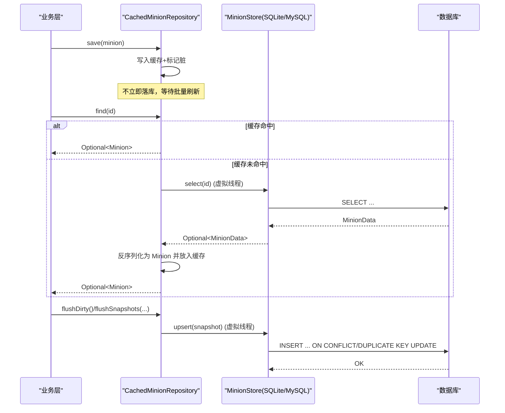
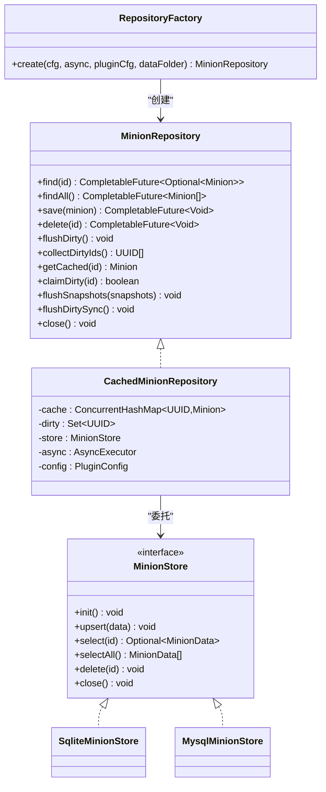
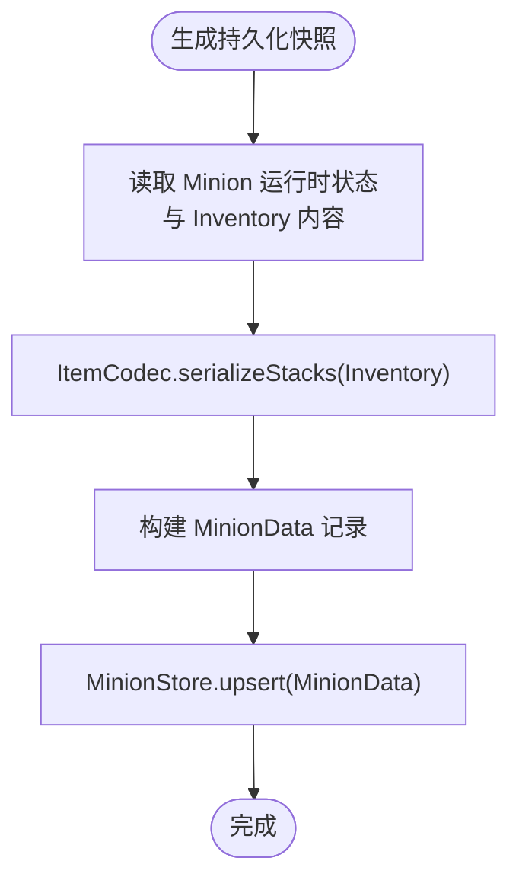
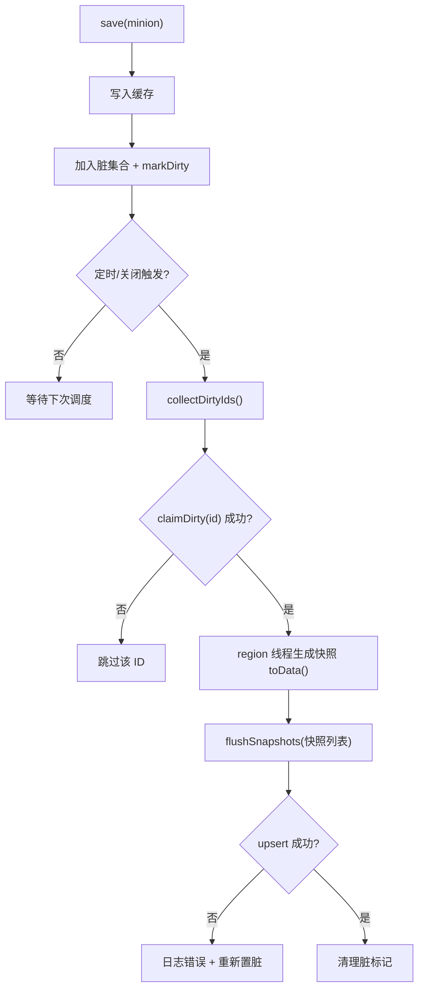
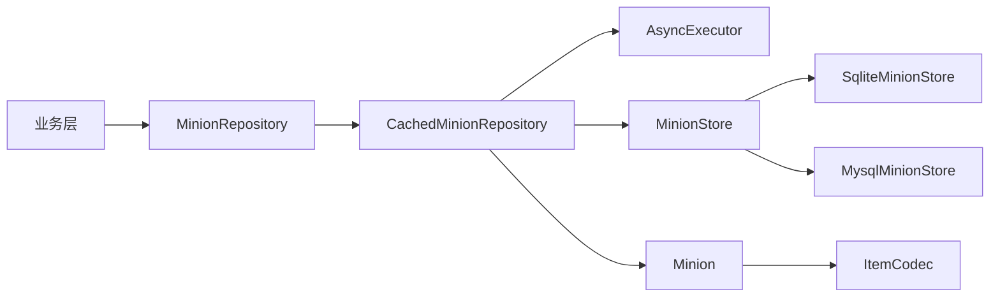

# 数据存储与持久化

<cite>
**本文引用的文件**
- [MinionRepository.java](file://src/main/java/com/hcs/minions/repository/MinionRepository.java)
- [RepositoryFactory.java](file://src/main/java/com/hcs/minions/repository/RepositoryFactory.java)
- [CachedMinionRepository.java](file://src/main/java/com/hcs/minions/repository/CachedMinionRepository.java)
- [MinionStore.java](file://src/main/java/com/hcs/minions/repository/MinionStore.java)
- [SqliteMinionStore.java](file://src/main/java/com/hcs/minions/repository/sqlite/SqliteMinionStore.java)
- [MysqlMinionStore.java](file://src/main/java/com/hcs/minions/repository/mysql/MysqlMinionStore.java)
- [MinionData.java](file://src/main/java/com/hcs/minions/model/MinionData.java)
- [Minion.java](file://src/main/java/com/hcs/minions/model/Minion.java)
- [DatabaseConfig.java](file://src/main/java/com/hcs/minions/config/DatabaseConfig.java)
- [ItemCodec.java](file://src/main/java/com/hcs/minions/util/ItemCodec.java)
- [AsyncExecutor.java](file://src/main/java/com/hcs/minions/util/AsyncExecutor.java)
- [config.yml](file://src/main/resources/config.yml)
</cite>

## 目录
1. [简介](#简介)
2. [项目结构](#项目结构)
3. [核心组件](#核心组件)
4. [架构总览](#架构总览)
5. [详细组件分析](#详细组件分析)
6. [依赖关系分析](#依赖关系分析)
7. [性能考量](#性能考量)
8. [故障排除指南](#故障排除指南)
9. [结论](#结论)
10. [附录：配置与迁移](#附录：配置与迁移)

## 简介
本文件系统性阐述 SkyMinions 的数据存储与持久化体系，围绕 Repository 模式展开，覆盖 MinionRepository 接口、RepositoryFactory 工厂、SQLite/MySQL 实现、数据模型与序列化、内存缓存与一致性、HikariCP 连接池、事务与性能优化、迁移策略、备份恢复思路以及配置与排障要点。目标是让读者在不深入源码的情况下也能理解并正确使用该数据层。

## 项目结构
数据层位于 repository 包下，采用“接口 + 工厂 + 具体实现”的分层设计；model 包定义传输对象与运行时实体；util 提供异步执行与序列化等通用能力；config 提供数据库配置。

图表来源
- [RepositoryFactory.java:20-29](file://src/main/java/com/hcs/minions/repository/RepositoryFactory.java#L20-L29)
- [CachedMinionRepository.java:31-42](file://src/main/java/com/hcs/minions/repository/CachedMinionRepository.java#L31-L42)
- [MinionStore.java:13-27](file://src/main/java/com/hcs/minions/repository/MinionStore.java#L13-L27)
- [SqliteMinionStore.java:22-23](file://src/main/java/com/hcs/minions/repository/sqlite/SqliteMinionStore.java#L22-L23)
- [MysqlMinionStore.java:25-25](file://src/main/java/com/hcs/minions/repository/mysql/MysqlMinionStore.java#L25-L25)
- [MinionData.java:11-28](file://src/main/java/com/hcs/minions/model/MinionData.java#L11-L28)
- [Minion.java:168-170](file://src/main/java/com/hcs/minions/model/Minion.java#L168-L170)
- [AsyncExecutor.java:19-32](file://src/main/java/com/hcs/minions/util/AsyncExecutor.java#L19-L32)
- [DatabaseConfig.java:6-20](file://src/main/java/com/hcs/minions/config/DatabaseConfig.java#L6-L20)

章节来源
- [RepositoryFactory.java:20-29](file://src/main/java/com/hcs/minions/repository/RepositoryFactory.java#L20-L29)
- [config.yml:13-22](file://src/main/resources/config.yml#L13-L22)

## 核心组件
- MinionRepository：业务层唯一依赖的持久化入口，封装内存缓存与异步落库，对外暴露 find/save/delete/findAll/flushDirty/collectDirtyIds/claimDirty/flushSnapshots/flushDirtySync/close 等方法。
- RepositoryFactory：根据 DatabaseConfig 选择 SQLite 或 MySQL 实现，初始化底层存储，并返回带缓存的 CachedMinionRepository。
- MinionStore：底层存储抽象（阻塞式），由 SQLite/MySQL 实现，仅被仓库通过虚拟线程调用。
- CachedMinionRepository：基于 ConcurrentHashMap 的内存缓存与脏标记集合，结合 AsyncExecutor 将 IO 下沉到虚拟线程，提供两阶段落库（收集 ID -> 生成快照 -> 批量 upsert）。
- SqliteMinionStore / MysqlMinionStore：分别使用 JDBC 直连与 HikariCP 连接池，负责 DDL、索引、幂等迁移、upsert/selectAll/select/delete。
- MinionData：纯数据的持久化快照（record），包含 inventory BLOB。
- Minion：运行时实体，持有 Bukkit Inventory 及状态，提供 toData() 生成快照、markDirty()/tryClaimFlush() 等协作方法。
- ItemCodec：Bukkit ItemStack 列表序列化为字节数组，用于 BLOB 存储。
- AsyncExecutor：基于 Java 21 虚拟线程的全局异步执行器，所有 IO 任务统一提交。
- DatabaseConfig：强类型数据库配置（类型、SQLite 文件路径、MySQL 连接参数、连接池大小）。

章节来源
- [MinionRepository.java:16-46](file://src/main/java/com/hcs/minions/repository/MinionRepository.java#L16-L46)
- [RepositoryFactory.java:20-29](file://src/main/java/com/hcs/minions/repository/RepositoryFactory.java#L20-L29)
- [MinionStore.java:13-27](file://src/main/java/com/hcs/minions/repository/MinionStore.java#L13-L27)
- [CachedMinionRepository.java:29-42](file://src/main/java/com/hcs/minions/repository/CachedMinionRepository.java#L29-L42)
- [SqliteMinionStore.java:22-23](file://src/main/java/com/hcs/minions/repository/sqlite/SqliteMinionStore.java#L22-L23)
- [MysqlMinionStore.java:25-25](file://src/main/java/com/hcs/minions/repository/mysql/MysqlMinionStore.java#L25-L25)
- [MinionData.java:11-28](file://src/main/java/com/hcs/minions/model/MinionData.java#L11-L28)
- [Minion.java:168-170](file://src/main/java/com/hcs/minions/model/Minion.java#L168-L170)
- [ItemCodec.java:40-54](file://src/main/java/com/hcs/minions/util/ItemCodec.java#L40-L54)
- [AsyncExecutor.java:19-32](file://src/main/java/com/hcs/minions/util/AsyncExecutor.java#L19-L32)
- [DatabaseConfig.java:6-20](file://src/main/java/com/hcs/minions/config/DatabaseConfig.java#L6-L20)

## 架构总览
数据流从业务层进入 MinionRepository，命中内存缓存则直接返回；未命中时通过 AsyncExecutor 在虚拟线程中调用 MinionStore 查询并回填缓存。写操作先入缓存并标记脏，再由调度器或关闭流程触发两阶段落库：先在 region 线程生成不可变快照（避免并发修改 Inventory），再异步批量 upsert。

图表来源
- [CachedMinionRepository.java:44-80](file://src/main/java/com/hcs/minions/repository/CachedMinionRepository.java#L44-L80)
- [CachedMinionRepository.java:134-153](file://src/main/java/com/hcs/minions/repository/CachedMinionRepository.java#L134-L153)
- [SqliteMinionStore.java:112-121](file://src/main/java/com/hcs/minions/repository/sqlite/SqliteMinionStore.java#L112-L121)
- [MysqlMinionStore.java:144-152](file://src/main/java/com/hcs/minions/repository/mysql/MysqlMinionStore.java#L144-L152)

## 详细组件分析

### Repository 模式与工厂
- MinionRepository 定义了统一的读写与刷新接口，屏蔽底层存储细节。
- RepositoryFactory 依据 DatabaseConfig.type 创建对应 MinionStore，并包装为 CachedMinionRepository，业务层对底层实现零感知。
- 工厂职责单一：装配与初始化，不包含业务逻辑。

图表来源
- [MinionRepository.java:16-46](file://src/main/java/com/hcs/minions/repository/MinionRepository.java#L16-L46)
- [RepositoryFactory.java:20-29](file://src/main/java/com/hcs/minions/repository/RepositoryFactory.java#L20-L29)
- [CachedMinionRepository.java:29-42](file://src/main/java/com/hcs/minions/repository/CachedMinionRepository.java#L29-L42)
- [MinionStore.java:13-27](file://src/main/java/com/hcs/minions/repository/MinionStore.java#L13-L27)
- [SqliteMinionStore.java:22-23](file://src/main/java/com/hcs/minions/repository/sqlite/SqliteMinionStore.java#L22-L23)
- [MysqlMinionStore.java:25-25](file://src/main/java/com/hcs/minions/repository/mysql/MysqlMinionStore.java#L25-L25)

章节来源
- [RepositoryFactory.java:20-29](file://src/main/java/com/hcs/minions/repository/RepositoryFactory.java#L20-L29)
- [MinionRepository.java:16-46](file://src/main/java/com/hcs/minions/repository/MinionRepository.java#L16-L46)

### 数据模型与序列化
- MinionData 是纯数据记录，字段全部为原始类型，便于 SQL 映射；inventory 以 byte[] 形式存储，作为 BLOB。
- Minion 是运行时实体，持有 Bukkit Inventory 与可变状态；toData() 通过 ItemCodec.serializeStacks 将库存序列化为字节数组。
- ItemCodec 使用 Bukkit 的 serializeAsBytes/deserializeBytes 逐项序列化，保证跨版本兼容性与安全性。

图表来源
- [MinionData.java:11-28](file://src/main/java/com/hcs/minions/model/MinionData.java#L11-L28)
- [Minion.java:168-170](file://src/main/java/com/hcs/minions/model/Minion.java#L168-L170)
- [ItemCodec.java:40-54](file://src/main/java/com/hcs/minions/util/ItemCodec.java#L40-L54)
- [SqliteMinionStore.java:179-197](file://src/main/java/com/hcs/minions/repository/sqlite/SqliteMinionStore.java#L179-L197)
- [MysqlMinionStore.java:200-218](file://src/main/java/com/hcs/minions/repository/mysql/MysqlMinionStore.java#L200-L218)

章节来源
- [MinionData.java:11-28](file://src/main/java/com/hcs/minions/model/MinionData.java#L11-L28)
- [Minion.java:168-170](file://src/main/java/com/hcs/minions/model/Minion.java#L168-L170)
- [ItemCodec.java:40-54](file://src/main/java/com/hcs/minions/util/ItemCodec.java#L40-L54)

### 缓存机制与一致性
- 内存缓存：ConcurrentHashMap<UUID, Minion> 提供 O(1) 平均查找，读路径优先命中缓存。
- 脏标记：ConcurrentHashMap.newKeySet 维护待落库 ID；save 后加入 dirty 并 markDirty。
- 两阶段落库：
  - 阶段一 collectDirtyIds：仅收集 ID，不触碰 Inventory，任意线程安全。
  - 阶段二 flushSnapshots：在 region 线程生成快照（toData），再异步批量 upsert。
- 一致性保障：
  - claimDirty 使用 CAS 认领脏标记，避免重复落库。
  - flushDirtySync 在主线程关闭前同步冲刷，确保无丢失。
  - 异常重试：upsert 失败时重新置脏，等待后续周期重试。

图表来源
- [CachedMinionRepository.java:74-80](file://src/main/java/com/hcs/minions/repository/CachedMinionRepository.java#L74-L80)
- [CachedMinionRepository.java:100-132](file://src/main/java/com/hcs/minions/repository/CachedMinionRepository.java#L100-L132)
- [CachedMinionRepository.java:134-153](file://src/main/java/com/hcs/minions/repository/CachedMinionRepository.java#L134-L153)
- [CachedMinionRepository.java:190-212](file://src/main/java/com/hcs/minions/repository/CachedMinionRepository.java#L190-L212)

章节来源
- [CachedMinionRepository.java:29-42](file://src/main/java/com/hcs/minions/repository/CachedMinionRepository.java#L29-L42)
- [CachedMinionRepository.java:74-80](file://src/main/java/com/hcs/minions/repository/CachedMinionRepository.java#L74-L80)
- [CachedMinionRepository.java:100-153](file://src/main/java/com/hcs/minions/repository/CachedMinionRepository.java#L100-L153)
- [CachedMinionRepository.java:190-212](file://src/main/java/com/hcs/minions/repository/CachedMinionRepository.java#L190-L212)

### 数据库连接池与事务
- SQLite：单连接 + 内部 synchronized 锁，适合轻量本地存储；DDL 与索引在 init 时创建。
- MySQL：基于 HikariCP 的连接池，默认最大池大小受配置控制（至少 2），连接超时收紧，预编译语句缓存开启以提升性能。
- 事务：当前实现以单条 upsert 为单位，未显式包裹事务块；若需多表原子性，可在上层封装事务或使用数据库级事务。

章节来源
- [SqliteMinionStore.java:62-79](file://src/main/java/com/hcs/minions/repository/sqlite/SqliteMinionStore.java#L62-L79)
- [MysqlMinionStore.java:64-92](file://src/main/java/com/hcs/minions/repository/mysql/MysqlMinionStore.java#L64-L92)
- [MysqlMinionStore.java:73-84](file://src/main/java/com/hcs/minions/repository/mysql/MysqlMinionStore.java#L73-L84)

### 性能优化
- 虚拟线程隔离 IO：所有阻塞 JDBC 调用通过 AsyncExecutor 提交至虚拟线程，主线程零阻塞。
- 缓存命中优先：read 路径先查内存缓存，减少 DB 压力。
- 批量 upsert：按快照批量写入，降低网络与锁竞争。
- 索引：owner 列建立索引，加速按主人查询/统计。
- 连接池调优：HikariCP 小池 + 短超时 + 预编译缓存，避免虚拟线程固定导致的资源膨胀。

章节来源
- [AsyncExecutor.java:19-32](file://src/main/java/com/hcs/minions/util/AsyncExecutor.java#L19-L32)
- [CachedMinionRepository.java:44-72](file://src/main/java/com/hcs/minions/repository/CachedMinionRepository.java#L44-L72)
- [SqliteMinionStore.java:107-109](file://src/main/java/com/hcs/minions/repository/sqlite/SqliteMinionStore.java#L107-L109)
- [MysqlMinionStore.java:125-128](file://src/main/java/com/hcs/minions/repository/mysql/MysqlMinionStore.java#L125-L128)
- [MysqlMinionStore.java:73-84](file://src/main/java/com/hcs/minions/repository/mysql/MysqlMinionStore.java#L73-L84)

### 数据迁移策略
- SQLite：启动时检查表结构，缺失 upgrade1/upgrade2/skin 列则 ALTER TABLE 补齐；同时确保 owner 索引存在。
- MySQL：通过 information_schema 检查列与索引是否存在，不存在则添加；DDL 幂等执行。
- 迁移过程在 init 中执行，保证插件重启后的兼容性。

章节来源
- [SqliteMinionStore.java:81-109](file://src/main/java/com/hcs/minions/repository/sqlite/SqliteMinionStore.java#L81-L109)
- [MysqlMinionStore.java:94-130](file://src/main/java/com/hcs/minions/repository/mysql/MysqlMinionStore.java#L94-L130)

### 备份与恢复建议
- SQLite：直接复制 minions.db 文件进行备份；恢复时替换文件并确保进程已停止。
- MySQL：使用 mysqldump 导出/导入；或在应用层提供备份命令（可选扩展）。
- 注意：备份期间应尽量避免写入，或接受短暂不一致。

[本节为通用实践说明，不直接引用具体代码]

### 错误处理方案
- 异步任务异常：AsyncExecutor 捕获并记录日志，防止吞异常导致静默失败。
- 落库异常：CachedMinionRepository 捕获 upsert 异常，记录错误并将对应 minion 重新置脏，等待重试。
- 关闭路径：flushDirtySync 在 close 前同步冲刷，避免连接池关闭后异步写失败丢数据。

章节来源
- [AsyncExecutor.java:34-67](file://src/main/java/com/hcs/minions/util/AsyncExecutor.java#L34-L67)
- [CachedMinionRepository.java:134-153](file://src/main/java/com/hcs/minions/repository/CachedMinionRepository.java#L134-L153)
- [CachedMinionRepository.java:190-212](file://src/main/java/com/hcs/minions/repository/CachedMinionRepository.java#L190-L212)

## 依赖关系分析
- 耦合度：业务层仅依赖 MinionRepository 接口，低耦合；具体存储实现通过工厂注入。
- 内聚性：每个存储实现专注自身方言与连接管理；缓存与调度集中在 CachedMinionRepository。
- 外部依赖：Bukkit API（Inventory）、HikariCP（MySQL）、JDBC（SQLite/MySQL）。
- 循环依赖：无。

图表来源
- [RepositoryFactory.java:20-29](file://src/main/java/com/hcs/minions/repository/RepositoryFactory.java#L20-L29)
- [CachedMinionRepository.java:29-42](file://src/main/java/com/hcs/minions/repository/CachedMinionRepository.java#L29-L42)
- [MinionStore.java:13-27](file://src/main/java/com/hcs/minions/repository/MinionStore.java#L13-L27)
- [Minion.java:168-170](file://src/main/java/com/hcs/minions/model/Minion.java#L168-L170)

章节来源
- [RepositoryFactory.java:20-29](file://src/main/java/com/hcs/minions/repository/RepositoryFactory.java#L20-L29)
- [CachedMinionRepository.java:29-42](file://src/main/java/com/hcs/minions/repository/CachedMinionRepository.java#L29-L42)

## 性能考量
- 读路径：缓存命中率决定整体延迟；首次加载会全量 selectAll 并填充缓存。
- 写路径：批量 upsert 减少锁竞争；虚拟线程隔离 IO，避免主线程卡顿。
- 连接池：MySQL 小池 + 短超时 + 预编译缓存，平衡吞吐与资源占用。
- 索引：owner 索引提升按用户查询效率。
- 内存：ConcurrentHashMap 与脏集合开销可控；Inventory 仅在 region 线程访问，避免并发拷贝成本。

[本节为通用性能讨论，不直接引用具体代码]

## 故障排除指南
- 无法连接 MySQL：
  - 检查 host/port/database/user/password 配置是否正确。
  - 确认 HikariCP 连接池大小与超时设置合理。
  - 查看日志中是否抛出驱动类未找到或连接超时。
- SQLite 初始化失败：
  - 检查数据目录权限与磁盘空间。
  - 查看 DDL 执行与迁移是否报错。
- 数据未持久化：
  - 确认 save 后脏标记是否被认领并成功 upsert。
  - 关注 flushDirty/flushSnapshots 调用时机与异常日志。
- 性能问题：
  - 提高缓存命中率（减少频繁重建）。
  - 调整 HikariCP 池大小与超时。
  - 检查是否有全表扫描（确认索引存在）。

章节来源
- [MysqlMinionStore.java:64-92](file://src/main/java/com/hcs/minions/repository/mysql/MysqlMinionStore.java#L64-L92)
- [SqliteMinionStore.java:62-79](file://src/main/java/com/hcs/minions/repository/sqlite/SqliteMinionStore.java#L62-L79)
- [CachedMinionRepository.java:134-153](file://src/main/java/com/hcs/minions/repository/CachedMinionRepository.java#L134-L153)

## 结论
SkyMinions 的数据层以 Repository 模式为核心，结合内存缓存、虚拟线程异步 IO、两阶段落库与幂等迁移，实现了高可用、高性能且易于扩展的持久化方案。SQLite 适用于单机场景，MySQL 通过 HikariCP 支持集群部署。通过清晰的接口与工厂解耦，业务层无需关心底层存储细节，便于未来引入更多存储后端。

[本节为总结性内容，不直接引用具体代码]

## 附录：配置与迁移
- 数据库配置（config.yml）：
  - type：sqlite | mysql
  - sqlite-file：SQLite 文件名
  - host/port/database/user/password：MySQL 连接信息
  - pool-size：HikariCP 连接池大小（建议小池，避免虚拟线程固定）
- 迁移：
  - 插件启动时自动补齐缺失列与索引，保证向后兼容。
  - 建议在升级前备份数据库。

章节来源
- [config.yml:13-22](file://src/main/resources/config.yml#L13-L22)
- [SqliteMinionStore.java:81-109](file://src/main/java/com/hcs/minions/repository/sqlite/SqliteMinionStore.java#L81-L109)
- [MysqlMinionStore.java:94-130](file://src/main/java/com/hcs/minions/repository/mysql/MysqlMinionStore.java#L94-L130)