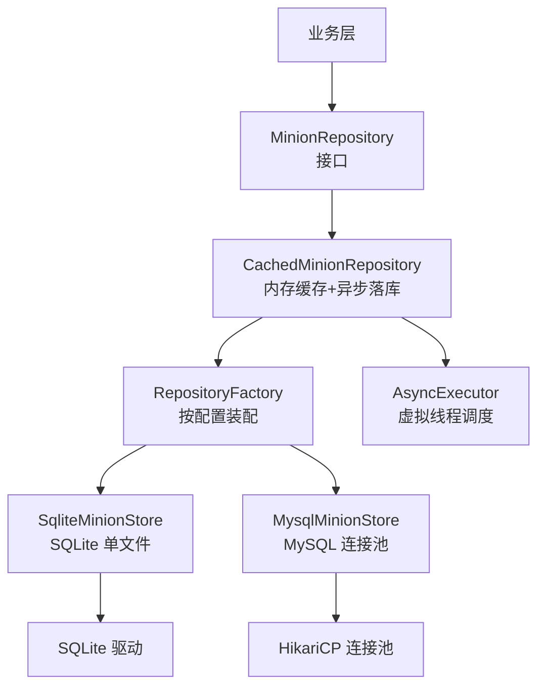
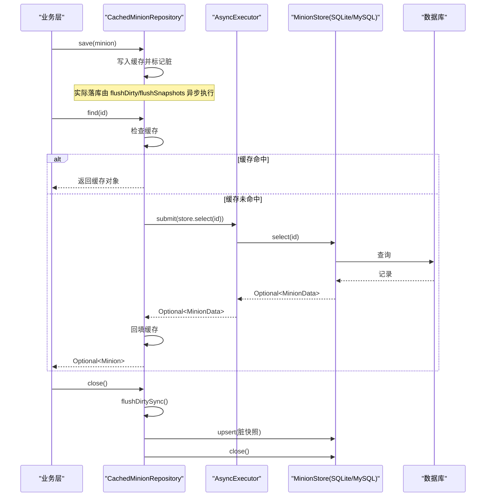
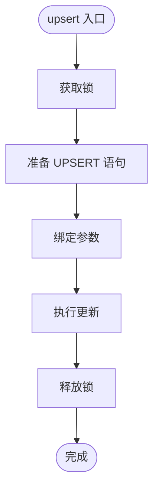
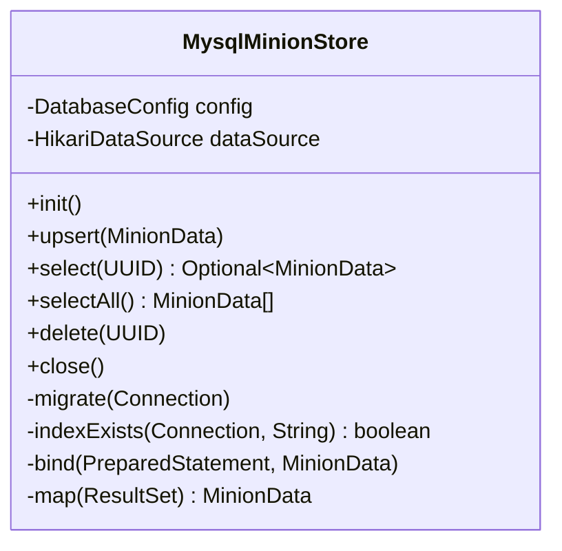
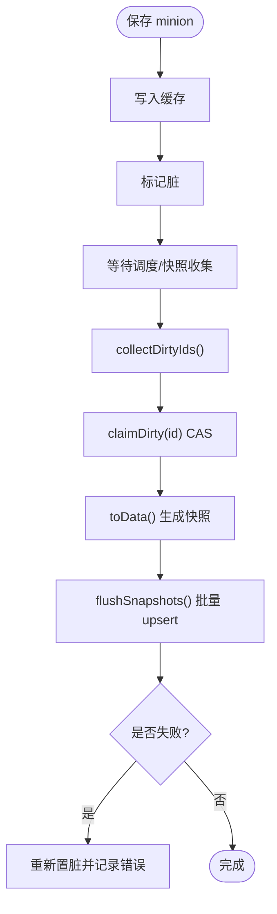
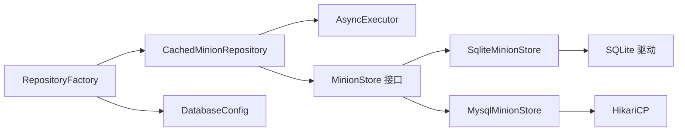

# 数据库存储实现

<cite>
**本文引用的文件**
- [MinionStore.java](file://src/main/java/com/hcs/minions/repository/MinionStore.java)
- [MinionRepository.java](file://src/main/java/com/hcs/minions/repository/MinionRepository.java)
- [CachedMinionRepository.java](file://src/main/java/com/hcs/minions/repository/CachedMinionRepository.java)
- [RepositoryFactory.java](file://src/main/java/com/hcs/minions/repository/RepositoryFactory.java)
- [SqliteMinionStore.java](file://src/main/java/com/hcs/minions/repository/sqlite/SqliteMinionStore.java)
- [MysqlMinionStore.java](file://src/main/java/com/hcs/minions/repository/mysql/MysqlMinionStore.java)
- [DatabaseConfig.java](file://src/main/java/com/hcs/minions/config/DatabaseConfig.java)
- [config.yml](file://src/main/resources/config.yml)
- [MinionData.java](file://src/main/java/com/hcs/minions/model/MinionData.java)
- [AsyncExecutor.java](file://src/main/java/com/hcs/minions/util/AsyncExecutor.java)
</cite>

## 目录
1. [简介](#简介)
2. [项目结构](#项目结构)
3. [核心组件](#核心组件)
4. [架构总览](#架构总览)
5. [详细组件分析](#详细组件分析)
6. [依赖关系分析](#依赖关系分析)
7. [性能与适用场景](#性能与适用场景)
8. [配置与最佳实践](#配置与最佳实践)
9. [故障排除指南](#故障排除指南)
10. [结论](#结论)

## 简介
本文件面向插件的“数据库存储层”，系统性对比 SQLite 与 MySQL 两种后端的具体实现，解释其设计取舍、并发模型、数据一致性保障、索引与查询优化、迁移策略、备份恢复方案以及运维建议。重点说明：
- SqliteMinionStore 的轻量级设计：嵌入式单文件、零配置部署、串行写入与锁保护。
- MysqlMinionStore 的企业级特性：连接池管理、并发控制、可扩展性与分布式支持能力。
- 统一抽象 MinionStore 与带缓存仓库 CachedMinionRepository 如何屏蔽底层差异，为业务提供无感知异步落库与内存缓存。

## 项目结构
存储层采用“接口 + 多实现 + 工厂 + 缓存包装”的分层组织：
- 接口层：MinionStore（阻塞式 IO）、MinionRepository（异步缓存访问）。
- 实现层：SqliteMinionStore、MysqlMinionStore。
- 装配层：RepositoryFactory 根据配置选择具体实现并包装为缓存仓库。
- 配置层：DatabaseConfig 强类型配置；config.yml 提供运行时配置。
- 数据模型：MinionData 作为持久化传输对象。
- 异步执行：AsyncExecutor 基于虚拟线程调度所有 IO 任务。

图表来源
- [RepositoryFactory.java:20-29](file://src/main/java/com/hcs/minions/repository/RepositoryFactory.java#L20-L29)
- [CachedMinionRepository.java:29-42](file://src/main/java/com/hcs/minions/repository/CachedMinionRepository.java#L29-L42)
- [SqliteMinionStore.java:22-23](file://src/main/java/com/hcs/minions/repository/sqlite/SqliteMinionStore.java#L22-L23)
- [MysqlMinionStore.java:25-26](file://src/main/java/com/hcs/minions/repository/mysql/MysqlMinionStore.java#L25-L26)

章节来源
- [RepositoryFactory.java:1-31](file://src/main/java/com/hcs/minions/repository/RepositoryFactory.java#L1-L31)
- [config.yml:13-22](file://src/main/resources/config.yml#L13-L22)

## 核心组件
- MinionStore：定义 init/upsert/select/selectAll/delete/close 等阻塞式数据库操作，仅被缓存仓库通过虚拟线程调用。
- MinionRepository：对外暴露异步 API（CompletableFuture），内部维护内存缓存与脏标记集合，负责批量异步落库与快照提交。
- CachedMinionRepository：实现写穿（write-through）策略，save 先入缓存并标记脏，由调度器或 region 线程生成快照后批量 upsert；关闭时同步冲刷确保数据不丢失。
- RepositoryFactory：依据 DatabaseConfig.type 创建对应 Store，并统一包装为 CachedMinionRepository。
- AsyncExecutor：基于 Java 21 虚拟线程的全局异步执行器，隔离 IO 与主线程/区域线程。

章节来源
- [MinionStore.java:9-27](file://src/main/java/com/hcs/minions/repository/MinionStore.java#L9-L27)
- [MinionRepository.java:11-47](file://src/main/java/com/hcs/minions/repository/MinionRepository.java#L11-L47)
- [CachedMinionRepository.java:19-42](file://src/main/java/com/hcs/minions/repository/CachedMinionRepository.java#L19-L42)
- [RepositoryFactory.java:11-29](file://src/main/java/com/hcs/minions/repository/RepositoryFactory.java#L11-L29)
- [AsyncExecutor.java:12-32](file://src/main/java/com/hcs/minions/util/AsyncExecutor.java#L12-L32)

## 架构总览
整体采用“缓存优先 + 异步落库”的架构：
- 读路径：优先命中内存缓存；未命中则异步回源，结果回填缓存。
- 写路径：先更新内存并标记脏；由调度器或 region 线程收集快照后批量异步 upsert；失败重试并重新置脏。
- 关闭路径：同步冲刷脏数据，再关闭底层 Store，避免连接池关闭后异步写失败丢数据。

图表来源
- [CachedMinionRepository.java:44-87](file://src/main/java/com/hcs/minions/repository/CachedMinionRepository.java#L44-L87)
- [CachedMinionRepository.java:134-153](file://src/main/java/com/hcs/minions/repository/CachedMinionRepository.java#L134-L153)
- [CachedMinionRepository.java:190-213](file://src/main/java/com/hcs/minions/repository/CachedMinionRepository.java#L190-L213)
- [SqliteMinionStore.java:112-164](file://src/main/java/com/hcs/minions/repository/sqlite/SqliteMinionStore.java#L112-L164)
- [MysqlMinionStore.java:144-191](file://src/main/java/com/hcs/minions/repository/mysql/MysqlMinionStore.java#L144-L191)

## 详细组件分析

### SQLite 实现：SqliteMinionStore
- 设计要点
  - 单连接 + 互斥锁：SQLite 写入天然串行，使用 synchronized(lock) 保证并发安全。
  - 单文件存储：通过 File 指定数据库文件位置，自动创建父目录，零配置启动。
  - 表结构与迁移：DDL 定义 minions 表；migrate 幂等添加 upgrade1/upgrade2/skin 列，并创建 owner 索引。
  - 查询与写入：upsert 使用 INSERT ... ON CONFLICT DO UPDATE；select/selectAll/delete 均走 PreparedStatement。
- 优势
  - 部署简单：无需外部数据库服务，适合单机或小规模服务器。
  - 资源占用低：单连接、小内存开销。
- 限制
  - 高并发写入受限：受限于 SQLite 的锁机制与磁盘 IO。
  - 不适合多进程共享同一文件的高并发场景。

图表来源
- [SqliteMinionStore.java:112-121](file://src/main/java/com/hcs/minions/repository/sqlite/SqliteMinionStore.java#L112-L121)

章节来源
- [SqliteMinionStore.java:18-23](file://src/main/java/com/hcs/minions/repository/sqlite/SqliteMinionStore.java#L18-L23)
- [SqliteMinionStore.java:24-52](file://src/main/java/com/hcs/minions/repository/sqlite/SqliteMinionStore.java#L24-L52)
- [SqliteMinionStore.java:62-109](file://src/main/java/com/hcs/minions/repository/sqlite/SqliteMinionStore.java#L62-L109)
- [SqliteMinionStore.java:112-164](file://src/main/java/com/hcs/minions/repository/sqlite/SqliteMinionStore.java#L112-L164)

### MySQL 实现：MysqlMinionStore
- 设计要点
  - 连接池：基于 HikariCP，设置最大池大小、最小空闲、连接超时、预编译语句缓存等。
  - 显式加载驱动：解决 shade 覆盖问题，确保 DriverManager 识别 MySQL 驱动。
  - 表结构与迁移：DDL 与 SQLite 一致；migrate 幂等添加列并创建 owner 索引，同时检测索引是否存在。
  - 查询与写入：upsert 使用 INSERT ... ON DUPLICATE KEY UPDATE；select/selectAll/delete 走连接池获取连接。
- 优势
  - 高并发与扩展性：连接池支撑并发请求，可横向扩展至独立数据库集群。
  - 企业级特性：连接复用、预编译缓存、超时控制、监控友好。
- 注意事项
  - 虚拟线程固定载体：mysql-connector-j 的阻塞调用会固定虚拟线程载体，因此保持较小连接池以避免堆积。

图表来源
- [MysqlMinionStore.java:25-26](file://src/main/java/com/hcs/minions/repository/mysql/MysqlMinionStore.java#L25-L26)
- [MysqlMinionStore.java:64-92](file://src/main/java/com/hcs/minions/repository/mysql/MysqlMinionStore.java#L64-L92)
- [MysqlMinionStore.java:94-141](file://src/main/java/com/hcs/minions/repository/mysql/MysqlMinionStore.java#L94-L141)
- [MysqlMinionStore.java:144-198](file://src/main/java/com/hcs/minions/repository/mysql/MysqlMinionStore.java#L144-L198)

章节来源
- [MysqlMinionStore.java:19-26](file://src/main/java/com/hcs/minions/repository/mysql/MysqlMinionStore.java#L19-L26)
- [MysqlMinionStore.java:64-92](file://src/main/java/com/hcs/minions/repository/mysql/MysqlMinionStore.java#L64-L92)
- [MysqlMinionStore.java:94-141](file://src/main/java/com/hcs/minions/repository/mysql/MysqlMinionStore.java#L94-L141)
- [MysqlMinionStore.java:144-198](file://src/main/java/com/hcs/minions/repository/mysql/MysqlMinionStore.java#L144-L198)

### 缓存仓库：CachedMinionRepository
- 并发模型
  - 内存缓存：ConcurrentHashMap，O(1) 平均查找，高频读取无锁。
  - 脏标记：ConcurrentHashMap.newKeySet，驱动批量异步落库。
  - 异步 IO：所有阻塞 SQL 经由 AsyncExecutor（虚拟线程）执行，主线程零阻塞。
- 关键流程
  - find：缓存命中直接返回；未命中异步回源并回填缓存。
  - save：写入缓存并标记脏，实际落库延迟到 flushDirty/flushSnapshots。
  - delete：移除缓存并异步删除。
  - flushDirty/flushSnapshots：两阶段落库，region 线程生成快照后批量 upsert；失败重试并重新置脏。
  - close：关闭前同步冲刷脏数据，再关闭 Store。

图表来源
- [CachedMinionRepository.java:74-87](file://src/main/java/com/hcs/minions/repository/CachedMinionRepository.java#L74-L87)
- [CachedMinionRepository.java:100-132](file://src/main/java/com/hcs/minions/repository/CachedMinionRepository.java#L100-L132)
- [CachedMinionRepository.java:134-153](file://src/main/java/com/hcs/minions/repository/CachedMinionRepository.java#L134-L153)

章节来源
- [CachedMinionRepository.java:19-42](file://src/main/java/com/hcs/minions/repository/CachedMinionRepository.java#L19-L42)
- [CachedMinionRepository.java:44-87](file://src/main/java/com/hcs/minions/repository/CachedMinionRepository.java#L44-L87)
- [CachedMinionRepository.java:100-153](file://src/main/java/com/hcs/minions/repository/CachedMinionRepository.java#L100-L153)
- [CachedMinionRepository.java:190-213](file://src/main/java/com/hcs/minions/repository/CachedMinionRepository.java#L190-L213)

## 依赖关系分析
- 装配依赖：RepositoryFactory 依赖 DatabaseConfig 与 PluginConfig，选择 SqliteMinionStore 或 MysqlMinionStore，并包装为 CachedMinionRepository。
- 运行依赖：
  - SQLite：org.sqlite.JDBC 驱动，单文件存储。
  - MySQL：com.mysql.cj.jdbc.Driver 与 HikariCP 连接池。
- 异步依赖：CachedMinionRepository 依赖 AsyncExecutor 进行虚拟线程调度。
- 数据模型：MinionData 作为持久化传输对象，字段映射到 minions 表。

图表来源
- [RepositoryFactory.java:20-29](file://src/main/java/com/hcs/minions/repository/RepositoryFactory.java#L20-L29)
- [CachedMinionRepository.java:29-42](file://src/main/java/com/hcs/minions/repository/CachedMinionRepository.java#L29-L42)
- [SqliteMinionStore.java:62-79](file://src/main/java/com/hcs/minions/repository/sqlite/SqliteMinionStore.java#L62-L79)
- [MysqlMinionStore.java:64-92](file://src/main/java/com/hcs/minions/repository/mysql/MysqlMinionStore.java#L64-L92)

章节来源
- [RepositoryFactory.java:1-31](file://src/main/java/com/hcs/minions/repository/RepositoryFactory.java#L1-L31)
- [DatabaseConfig.java:1-21](file://src/main/java/com/hcs/minions/config/DatabaseConfig.java#L1-L21)
- [AsyncExecutor.java:12-32](file://src/main/java/com/hcs/minions/util/AsyncExecutor.java#L12-L32)

## 性能与适用场景
- SQLite
  - 特点：单文件、单连接、串行写入、锁保护；适合小规模、单机部署。
  - 性能特征：低延迟读、写入受锁与磁盘 IO 限制；owner 索引加速按主人查询。
  - 适用场景：小型服务器、开发测试环境、对运维复杂度敏感的场景。
- MySQL
  - 特点：连接池、预编译缓存、超时控制；适合高并发与分布式部署。
  - 性能特征：连接复用降低握手成本；合理池大小避免虚拟线程固定导致堆积；owner 索引加速统计与查询。
  - 适用场景：大型服务器、多实例共享数据、需要横向扩展与集中管理的场景。
- 通用优化
  - 索引：minions.owner 建立索引，避免全表扫描。
  - 查询：upsert 减少重复插入与更新逻辑；selectById 精确查询。
  - 缓存：内存缓存降低热点读压力；批量异步落库减少频繁 IO。

章节来源
- [SqliteMinionStore.java:81-109](file://src/main/java/com/hcs/minions/repository/sqlite/SqliteMinionStore.java#L81-L109)
- [MysqlMinionStore.java:94-141](file://src/main/java/com/hcs/minions/repository/mysql/MysqlMinionStore.java#L94-L141)
- [CachedMinionRepository.java:19-42](file://src/main/java/com/hcs/minions/repository/CachedMinionRepository.java#L19-L42)

## 配置与最佳实践
- 配置项（config.yml）
  - database.type：sqlite 或 mysql。
  - database.sqlite-file：SQLite 文件名。
  - database.host/port/database/user/password：MySQL 连接信息。
  - database.pool-size：HikariCP 连接池大小（默认 4，避免虚拟线程被固定）。
- 最佳实践
  - SQLite
    - 将数据库文件置于稳定可写的目录；定期备份整个 .db 文件。
    - 避免多进程同时写入同一文件；如需并发，考虑 MySQL。
  - MySQL
    - 合理设置 pool-size 与连接超时；启用预编译语句缓存。
    - 为 owner 字段建立索引；监控慢查询与连接池使用情况。
  - 通用
    - 使用 RepositoryFactory 统一装配，业务层只依赖 MinionRepository。
    - 关闭插件前务必调用 close()，确保同步冲刷脏数据。
    - 关注日志中的异常与重试提示，及时处理失败落库。

章节来源
- [config.yml:13-22](file://src/main/resources/config.yml#L13-L22)
- [MysqlMinionStore.java:73-84](file://src/main/java/com/hcs/minions/repository/mysql/MysqlMinionStore.java#L73-L84)
- [CachedMinionRepository.java:190-213](file://src/main/java/com/hcs/minions/repository/CachedMinionRepository.java#L190-L213)

## 故障排除指南
- 初始化失败
  - SQLite：检查驱动加载与文件路径权限；查看日志中“SQLite 初始化失败”。
  - MySQL：检查驱动类名、JDBC URL、用户名密码与网络连通；查看日志中“MySQL 初始化失败”。
- 落库失败
  - 观察日志“仆从落库失败，已重新置脏等待重试”；确认数据库连接与事务状态。
  - 对于 MySQL，检查连接池是否耗尽、是否有慢查询或死锁。
- 关闭时丢数据
  - 确保在 onDisable 路径调用 close()，内部会同步冲刷脏数据；若仍丢数据，检查是否有未处理的异步任务。
- 性能问题
  - 增加 MySQL 连接池大小或调整超时；检查索引是否生效；减少全表扫描。
  - 对于 SQLite，评估写入频率与磁盘 IO；必要时迁移到 MySQL。

章节来源
- [SqliteMinionStore.java:62-79](file://src/main/java/com/hcs/minions/repository/sqlite/SqliteMinionStore.java#L62-L79)
- [MysqlMinionStore.java:64-92](file://src/main/java/com/hcs/minions/repository/mysql/MysqlMinionStore.java#L64-L92)
- [CachedMinionRepository.java:134-153](file://src/main/java/com/hcs/minions/repository/CachedMinionRepository.java#L134-L153)
- [CachedMinionRepository.java:190-213](file://src/main/java/com/hcs/minions/repository/CachedMinionRepository.java#L190-L213)

## 结论
本存储层通过统一的 MinionStore 接口与 CachedMinionRepository 缓存包装，实现了 SQLite 与 MySQL 的后端可插拔切换。SQLite 适合轻量、单机场景；MySQL 适合高并发与企业级部署。通过内存缓存、异步落库、索引优化与迁移脚本，系统在易用性、性能与可靠性之间取得平衡。建议根据实际负载与运维能力选择合适的后端，并遵循配置与排障指南以确保稳定运行。