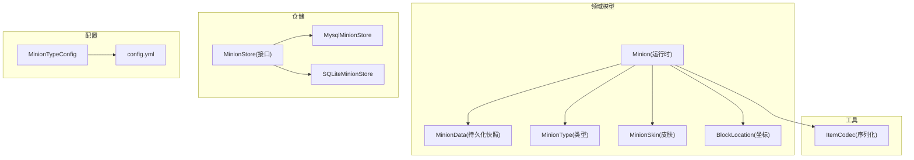
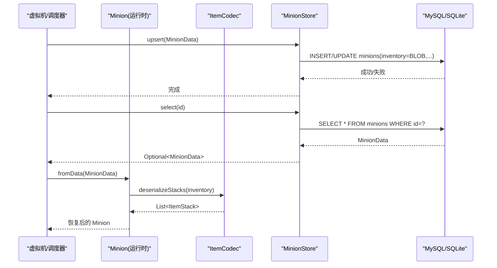
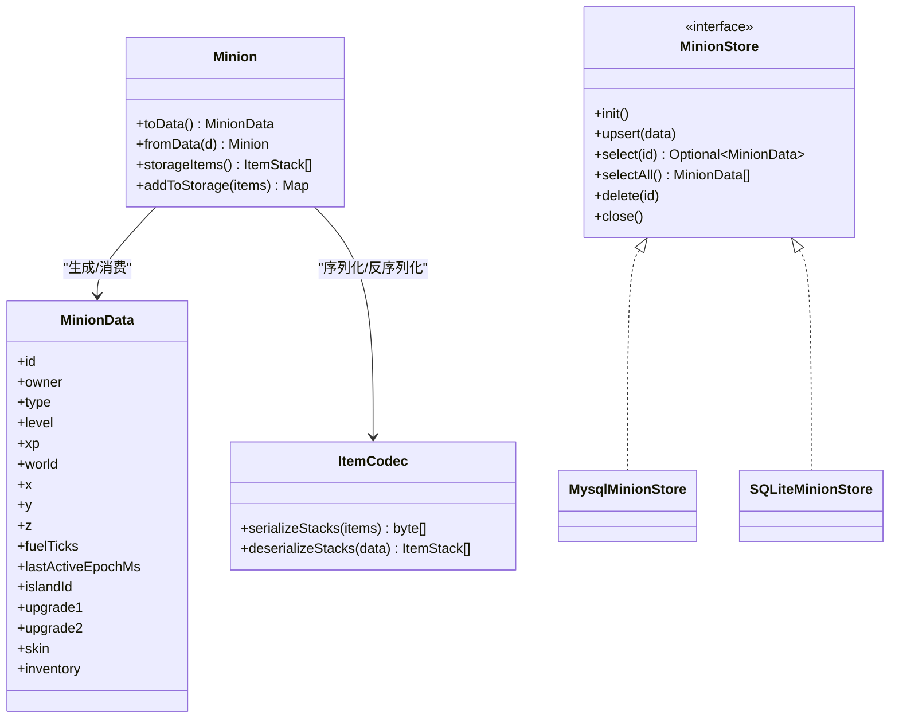
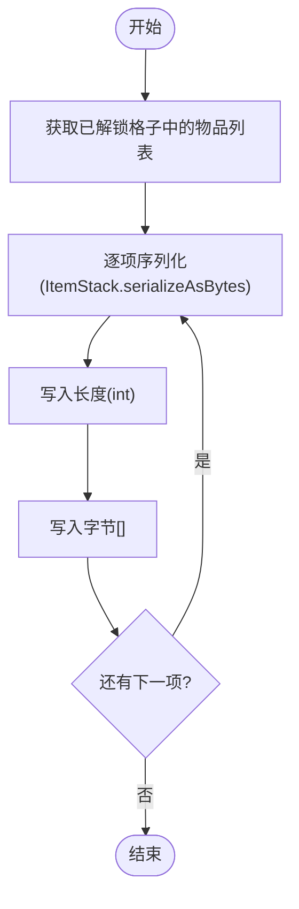
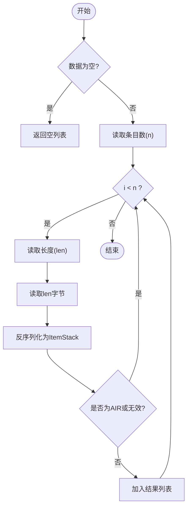
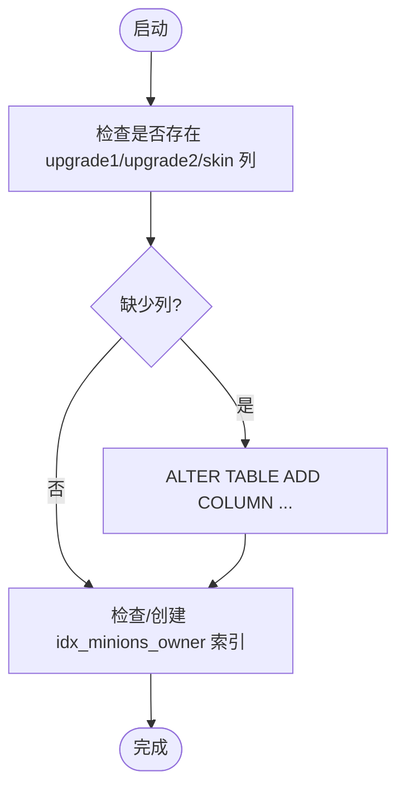

# 数据模型设计

<cite>
**本文引用的文件**
- [MinionData.java](file://src/main/java/com/hcs/minions/model/MinionData.java)
- [Minion.java](file://src/main/java/com/hcs/minions/model/Minion.java)
- [MinionType.java](file://src/main/java/com/hcs/minions/model/MinionType.java)
- [MinionSkin.java](file://src/main/java/com/hcs/minions/model/MinionSkin.java)
- [BlockLocation.java](file://src/main/java/com/hcs/minions/model/BlockLocation.java)
- [ItemCodec.java](file://src/main/java/com/hcs/minions/util/ItemCodec.java)
- [MinionStore.java](file://src/main/java/com/hcs/minions/repository/MinionStore.java)
- [MysqlMinionStore.java](file://src/main/java/com/hcs/minions/repository/mysql/MysqlMinionStore.java)
- [SQLiteMinionStore.java](file://src/main/java/com/hcs/minions/repository/sqlite/SQLiteMinionStore.java)
- [MinionTypeConfig.java](file://src/main/java/com/hcs/minions/config/MinionTypeConfig.java)
- [config.yml](file://src/main/resources/config.yml)
</cite>

## 目录
1. [简介](#简介)
2. [项目结构](#项目结构)
3. [核心组件](#核心组件)
4. [架构总览](#架构总览)
5. [详细组件分析](#详细组件分析)
6. [依赖关系分析](#依赖关系分析)
7. [性能考量](#性能考量)
8. [故障排查指南](#故障排查指南)
9. [结论](#结论)
10. [附录：序列化与迁移示例](#附录：序列化与迁移示例)

## 简介
本文件聚焦 SkyMinions 的数据模型设计，围绕 MinionData 持久化模型、Minion 运行时模型、MinionType 枚举、BLOB 存储方案（物品栏序列化）、数据验证与完整性约束、以及数据演进与迁移策略进行系统化说明。目标是让读者在不深入代码细节的情况下，也能理解仆从数据的结构、流转与扩展方式。

## 项目结构
SkyMinions 将“领域模型”“持久化接口”“数据库实现”“配置”分层组织：
- 领域模型：Minion（运行时）、MinionData（持久化快照）、MinionType/MinionSkin（类型与皮肤枚举）、BlockLocation（坐标）
- 工具层：ItemCodec（物品序列化工具）
- 仓储层：MinionStore（抽象接口），MySQL/SQLite 具体实现
- 配置层：MinionTypeConfig + config.yml（类型行为与数值规则）

图表来源
- [Minion.java:718-743](file://src/main/java/com/hcs/minions/model/Minion.java#L718-L743)
- [ItemCodec.java:39-77](file://src/main/java/com/hcs/minions/util/ItemCodec.java#L39-L77)
- [MysqlMinionStore.java:27-55](file://src/main/java/com/hcs/minions/repository/mysql/MysqlMinionStore.java#L27-L55)
- [SQLiteMinionStore.java:24-52](file://src/main/java/com/hcs/minions/repository/sqlite/SQLiteMinionStore.java#L24-L52)
- [MinionTypeConfig.java:21-63](file://src/main/java/com/hcs/minions/config/MinionTypeConfig.java#L21-L63)
- [config.yml:47-153](file://src/main/resources/config.yml#L47-L153)

章节来源
- [Minion.java:718-743](file://src/main/java/com/hcs/minions/model/Minion.java#L718-L743)
- [MinionData.java:11-28](file://src/main/java/com/hcs/minions/model/MinionData.java#L11-L28)
- [MinionStore.java:13-27](file://src/main/java/com/hcs/minions/repository/MinionStore.java#L13-L27)
- [MysqlMinionStore.java:27-55](file://src/main/java/com/hcs/minions/repository/mysql/MysqlMinionStore.java#L27-L55)
- [SQLiteMinionStore.java:24-52](file://src/main/java/com/hcs/minions/repository/sqlite/SQLiteMinionStore.java#L24-L52)
- [MinionTypeConfig.java:21-63](file://src/main/java/com/hcs/minions/config/MinionTypeConfig.java#L21-L63)
- [config.yml:47-153](file://src/main/resources/config.yml#L47-L153)

## 核心组件
- MinionData：纯记录型持久化快照，字段均为原始类型或基础对象，便于 SQL 映射；inventory 为 BLOB，承载物品栏数据。
- Minion：运行时模型，封装 GUI、状态机、工作调度、升级模块、皮肤等；提供 toData()/fromData() 与 MinionData 双向转换。
- MinionType/MinionSkin：类型与皮肤枚举，提供 key/displayName/icon 等元信息，支持 fromKey 反向解析。
- BlockLocation：跨世界不可变坐标，用于持久化与索引键。
- ItemCodec：基于 Bukkit ItemStack 的字节序列化/反序列化，采用“长度+字节”格式，保证安全深拷贝。
- MinionStore：统一存储接口；MySQL/SQLite 分别实现 DDL、UPSERT、迁移与索引。
- MinionTypeConfig + config.yml：定义每种类型的效率曲线、冷却、产物、稀有掉落概率、升级成本与工作半径等。

章节来源
- [MinionData.java:11-28](file://src/main/java/com/hcs/minions/model/MinionData.java#L11-L28)
- [Minion.java:718-743](file://src/main/java/com/hcs/minions/model/Minion.java#L718-L743)
- [MinionType.java:13-52](file://src/main/java/com/hcs/minions/model/MinionType.java#L13-L52)
- [MinionSkin.java:12-53](file://src/main/java/com/hcs/minions/model/MinionSkin.java#L12-L53)
- [BlockLocation.java:12-40](file://src/main/java/com/hcs/minions/model/BlockLocation.java#L12-L40)
- [ItemCodec.java:39-77](file://src/main/java/com/hcs/minions/util/ItemCodec.java#L39-L77)
- [MinionStore.java:13-27](file://src/main/java/com/hcs/minions/repository/MinionStore.java#L13-L27)
- [MinionTypeConfig.java:21-63](file://src/main/java/com/hcs/minions/config/MinionTypeConfig.java#L21-L63)
- [config.yml:47-153](file://src/main/resources/config.yml#L47-L153)

## 架构总览
Minion 在运行期维护可变状态（等级、燃料、位置、模块槽、皮肤、统计等），并通过 ItemCodec 将物品栏序列化为 byte[] 写入 MinionData；MinionData 通过 MinionStore 持久化到 MySQL/SQLite。加载时由 fromData 重建 Minion 实例并恢复物品栏。

图表来源
- [Minion.java:718-743](file://src/main/java/com/hcs/minions/model/Minion.java#L718-L743)
- [ItemCodec.java:39-77](file://src/main/java/com/hcs/minions/util/ItemCodec.java#L39-L77)
- [MysqlMinionStore.java:143-180](file://src/main/java/com/hcs/minions/repository/mysql/MysqlMinionStore.java#L143-L180)
- [SQLiteMinionStore.java:111-152](file://src/main/java/com/hcs/minions/repository/sqlite/SQLiteMinionStore.java#L111-L152)

## 详细组件分析

### MinionData 持久化模型
- 字段与类型
  - id/owner：UUID，主键与所有者标识
  - type：字符串键，对应 MinionType.key()
  - level/xp：等级与经验
  - world/x/y/z：方块坐标，配合 BlockLocation
  - fuelTicks/lastActiveEpochMs：燃料剩余刻数与最后活跃时间
  - islandId：岛屿/分区标识
  - upgrade1/upgrade2：升级模块键，对应 MinionUpgradeType.key()
  - skin：皮肤键，对应 MinionSkin.key()
  - inventory：byte[]，物品栏 BLOB
- 设计要点
  - 全原始类型/基础对象，避免 ORM 耦合
  - 通过 Minion.toData() 生成，确保只包含必要持久化字段
  - 通过 Minion.fromData() 重建运行时对象，缺失值有回退逻辑

章节来源
- [MinionData.java:11-28](file://src/main/java/com/hcs/minions/model/MinionData.java#L11-L28)
- [Minion.java:718-743](file://src/main/java/com/hcs/minions/model/Minion.java#L718-L743)

### Minion 运行时模型与持久化映射
- 映射关系
  - 等级、位置、燃料、时间戳、岛屿ID、升级模块、皮肤直接映射
  - 物品栏通过 serializeStorageItems -> ItemCodec.serializeStacks 转为 BLOB
  - 加载时通过 ItemCodec.deserializeStacks 还原为 List<ItemStack> 并填充到 GUI 存储区
- 状态转换与脏标记
  - 所有变更调用 markDirty()，由上层定时 flush 触发 toData()->upsert
  - tryClaimFlush() 原子性获取脏标记，避免重复落盘
- GUI 与存储布局
  - 固定 54 格 GUI，存储区按等级解锁格子数
  - 燃料槽使用 PDC 标记区分“提示卡”和真实燃料

章节来源
- [Minion.java:152-216](file://src/main/java/com/hcs/minions/model/Minion.java#L152-L216)
- [Minion.java:279-286](file://src/main/java/com/hcs/minions/model/Minion.java#L279-L286)
- [Minion.java:390-417](file://src/main/java/com/hcs/minions/model/Minion.java#L390-L417)
- [Minion.java:702-743](file://src/main/java/com/hcs/minions/model/Minion.java#L702-L743)

### MinionType 枚举设计
- 内置类型：矿工、农夫、伐木工、钓鱼郎、猎魔人、牧民、圆石匠
- 每个类型携带 key/displayName/icon，供 GUI 与掉落展示
- 通过 fromKey 做容错解析，未知键可回退默认类型
- 实际行为（效率、冷却、产物、稀有掉落、目标方块集合）由 MinionTypeConfig 与 config.yml 驱动，而非硬编码

章节来源
- [MinionType.java:13-52](file://src/main/java/com/hcs/minions/model/MinionType.java#L13-L52)
- [MinionTypeConfig.java:21-63](file://src/main/java/com/hcs/minions/config/MinionTypeConfig.java#L21-L63)
- [config.yml:47-153](file://src/main/resources/config.yml#L47-L153)

### BLOB 存储方案（物品栏）
- 序列化格式
  - 条目数量(int) + 循环：每条 (长度int + 字节[])
  - 单条使用 Bukkit ItemStack.serializeAsBytes() 输出
  - 空条目写长度为 0 的字节数组
- 反序列化
  - 读取条目数，逐条读取长度与字节，反序列化为 ItemStack
  - 过滤 AIR 与无效项，返回 List<ItemStack>
- 安全性与一致性
  - 所有出入仓库的 ItemStack 必须 deepCopy，防止引用泄漏导致刷物
  - 异常降级：序列化失败返回空数组，反序列化失败返回空列表并记录日志
- 压缩与加密
  - 当前未实现压缩与加密；如需扩展可在 ItemCodec 中增加可选压缩/加密层，并在版本字段中声明兼容策略

章节来源
- [ItemCodec.java:39-77](file://src/main/java/com/hcs/minions/util/ItemCodec.java#L39-L77)
- [Minion.java:171-173](file://src/main/java/com/hcs/minions/model/Minion.java#L171-L173)

### 数据验证规则、业务约束与完整性检查
- 类型校验
  - MinionType.fromKey / MinionSkin.fromKey / MinionUpgradeType.fromKey 均对 null 做防御，未知键回退默认或空
- 范围与阈值
  - 等级至少为 1（构造时 Math.max(1, level)）
  - 稀有掉落概率非负（配置构造时 <0 归零）
  - 最大检查上限、每玩家仆从上限等在配置中限定
- 完整性
  - 坐标使用 BlockLocation 不可变 record，天然具备 equals/hashCode，适合作为索引键
  - 存储区格子按 unlockedSlots() 限制访问，越界格子以锁定玻璃占位
- 事务与幂等
  - UPSERT 语句保证重复保存幂等
  - SQLite 通过 synchronized 串行化写入，MySQL 通过连接池与短超时控制并发

章节来源
- [Minion.java:93-105](file://src/main/java/com/hcs/minions/model/Minion.java#L93-L105)
- [MinionTypeConfig.java:39-44](file://src/main/java/com/hcs/minions/config/MinionTypeConfig.java#L39-L44)
- [config.yml:4-11](file://src/main/resources/config.yml#L4-L11)
- [MysqlMinionStore.java:46-55](file://src/main/java/com/hcs/minions/repository/mysql/MysqlMinionStore.java#L46-L55)
- [SQLiteMinionStore.java:43-52](file://src/main/java/com/hcs/minions/repository/sqlite/SQLiteMinionStore.java#L43-L52)

### 数据模型演进策略、向后兼容与迁移
- 表结构演进
  - 新增列（如 upgrade1/upgrade2/skin）通过启动时 migrate() 检测并补齐，保证旧库平滑升级
  - 创建 owner 索引提升按主人查询性能
- 兼容性
  - 反序列化时对未知类型/皮肤/模块使用回退策略（例如未知类型回退 MINER）
  - 物品栏反序列化忽略 AIR 与无效项，避免损坏数据
- 迁移建议
  - 新增字段优先 nullable，并提供默认值
  - 对 BLOB 内容增加版本号前缀，以便未来升级反序列化逻辑
  - 大表迁移建议在低峰期执行，并保留回滚脚本

章节来源
- [MysqlMinionStore.java:94-130](file://src/main/java/com/hcs/minions/repository/mysql/MysqlMinionStore.java#L94-L130)
- [SQLiteMinionStore.java:81-109](file://src/main/java/com/hcs/minions/repository/sqlite/SQLiteMinionStore.java#L81-L109)
- [Minion.java:730-743](file://src/main/java/com/hcs/minions/model/Minion.java#L730-L743)

## 依赖关系分析

图表来源
- [Minion.java:718-743](file://src/main/java/com/hcs/minions/model/Minion.java#L718-L743)
- [ItemCodec.java:39-77](file://src/main/java/com/hcs/minions/util/ItemCodec.java#L39-L77)
- [MinionStore.java:13-27](file://src/main/java/com/hcs/minions/repository/MinionStore.java#L13-L27)
- [MysqlMinionStore.java:25-55](file://src/main/java/com/hcs/minions/repository/mysql/MysqlMinionStore.java#L25-L55)
- [SQLiteMinionStore.java:22-52](file://src/main/java/com/hcs/minions/repository/sqlite/SQLiteMinionStore.java#L22-L52)

章节来源
- [Minion.java:718-743](file://src/main/java/com/hcs/minions/model/Minion.java#L718-L743)
- [MinionStore.java:13-27](file://src/main/java/com/hcs/minions/repository/MinionStore.java#L13-L27)

## 性能考量
- 存储层
  - MySQL 使用 HikariCP 小连接池（默认 4），短超时，避免虚拟线程被阻塞放大
  - SQLite 串行写入，单连接 + 锁，适合单机场景
- 内存与 CPU
  - 物品栏序列化仅遍历已解锁格子，减少不必要 IO
  - 反序列化跳过 AIR 与无效项，降低无用对象创建
- 索引
  - 按 owner 建索引，加速按主人查询与统计
- 可扩展点
  - 若 BLOB 体积增长明显，可在 ItemCodec 中加入可选压缩（如 Zstd/LZ4）与版本头，读写两端同时升级

章节来源
- [MysqlMinionStore.java:73-91](file://src/main/java/com/hcs/minions/repository/mysql/MysqlMinionStore.java#L73-L91)
- [SQLiteMinionStore.java:111-121](file://src/main/java/com/hcs/minions/repository/sqlite/SQLiteMinionStore.java#L111-L121)
- [ItemCodec.java:39-77](file://src/main/java/com/hcs/minions/util/ItemCodec.java#L39-L77)

## 故障排查指南
- 物品栏反序列化失败
  - 现象：反序列化抛出异常后返回空列表
  - 处理：检查 inventory BLOB 是否损坏；必要时清空该字段并重新同步
  - 参考路径：[ItemCodec.deserializeStacks:56-77](file://src/main/java/com/hcs/minions/util/ItemCodec.java#L56-L77)
- 数据库初始化失败
  - 现象：驱动未找到或连接失败
  - 处理：确认 JDBC 驱动依赖与连接参数；查看日志中的错误堆栈
  - 参考路径：[MysqlMinionStore.init:64-91](file://src/main/java/com/hcs/minions/repository/mysql/MysqlMinionStore.java#L64-L91)、[SQLiteMinionStore.init:62-79](file://src/main/java/com/hcs/minions/repository/sqlite/SQLiteMinionStore.java#L62-L79)
- 迁移失败
  - 现象：新增列或索引创建失败
  - 处理：检查权限与表结构；手动执行 ALTER/CREATE INDEX 后重启
  - 参考路径：[MysqlMinionStore.migrate:94-130](file://src/main/java/com/hcs/minions/repository/mysql/MysqlMinionStore.java#L94-L130)、[SQLiteMinionStore.migrate:81-109](file://src/main/java/com/hcs/minions/repository/sqlite/SQLiteMinionStore.java#L81-L109)
- 数据不一致
  - 现象：GUI 显示与实际存储不符
  - 处理：确认 markDirty/tryClaimFlush 流程；检查是否有并发修改未落盘
  - 参考路径：[Minion.markDirty/tryClaimFlush:702-716](file://src/main/java/com/hcs/minions/model/Minion.java#L702-L716)

章节来源
- [ItemCodec.java:56-77](file://src/main/java/com/hcs/minions/util/ItemCodec.java#L56-L77)
- [MysqlMinionStore.java:64-91](file://src/main/java/com/hcs/minions/repository/mysql/MysqlMinionStore.java#L64-L91)
- [SQLiteMinionStore.java:62-79](file://src/main/java/com/hcs/minions/repository/sqlite/SQLiteMinionStore.java#L62-L79)
- [MysqlMinionStore.java:94-130](file://src/main/java/com/hcs/minions/repository/mysql/MysqlMinionStore.java#L94-L130)
- [SQLiteMinionStore.java:81-109](file://src/main/java/com/hcs/minions/repository/sqlite/SQLiteMinionStore.java#L81-L109)
- [Minion.java:702-716](file://src/main/java/com/hcs/minions/model/Minion.java#L702-L716)

## 结论
SkyMinions 的数据模型以“运行时模型与持久化快照分离”为核心，Minion 负责复杂状态与交互，MinionData 专注稳定、可映射的字段集。物品栏通过 ItemCodec 以紧凑的二进制格式持久化，结合数据库层的幂等 UPSERT 与迁移机制，保证了数据一致性与可演进性。类型与行为通过枚举与配置解耦，便于扩展新仆从类型与模块。

## 附录：序列化与迁移示例

### 序列化流程图（物品栏）

图表来源
- [Minion.java:171-173](file://src/main/java/com/hcs/minions/model/Minion.java#L171-L173)
- [ItemCodec.java:39-54](file://src/main/java/com/hcs/minions/util/ItemCodec.java#L39-L54)

### 反序列化流程图（物品栏）

图表来源
- [ItemCodec.java:56-77](file://src/main/java/com/hcs/minions/util/ItemCodec.java#L56-L77)

### 数据库迁移流程（新增列与索引）

图表来源
- [MysqlMinionStore.java:94-130](file://src/main/java/com/hcs/minions/repository/mysql/MysqlMinionStore.java#L94-L130)
- [SQLiteMinionStore.java:81-109](file://src/main/java/com/hcs/minions/repository/sqlite/SQLiteMinionStore.java#L81-L109)