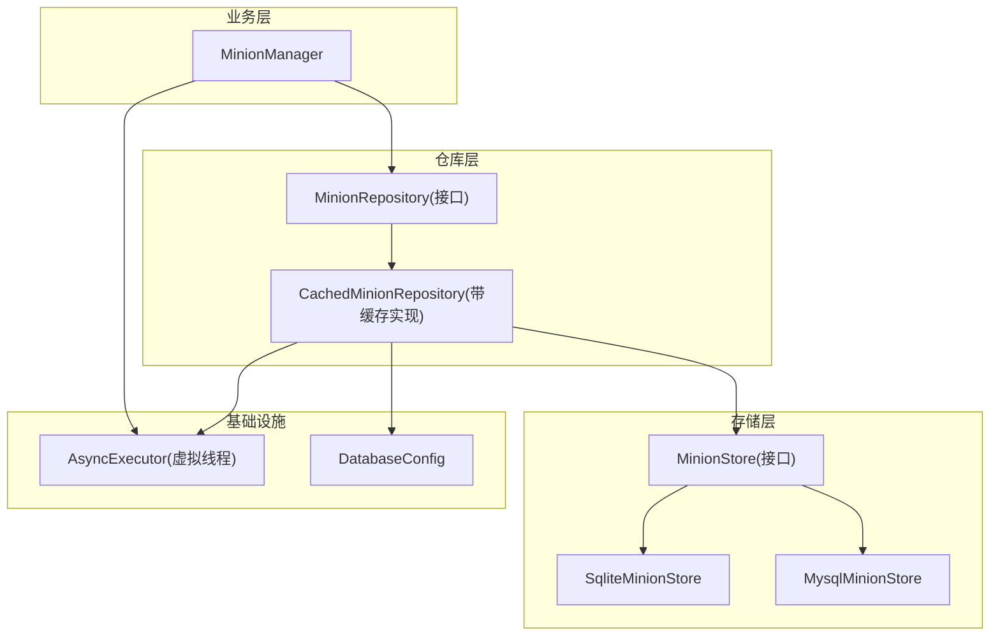
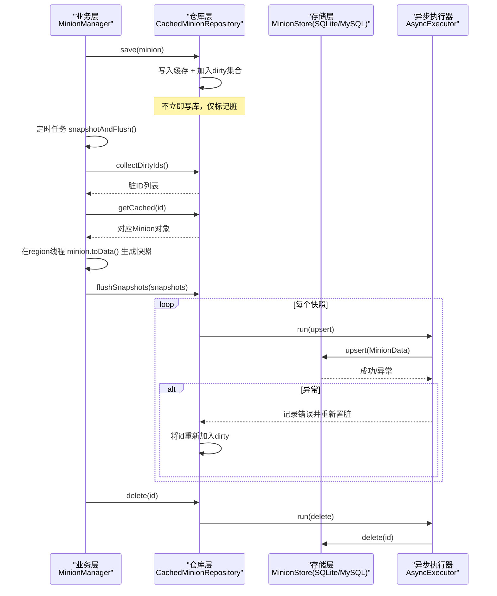
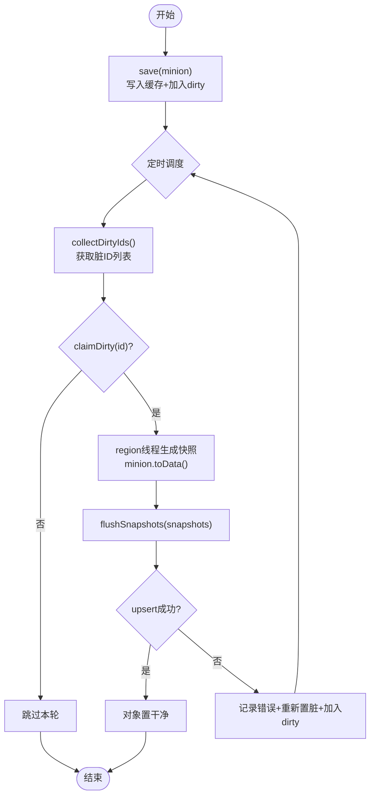
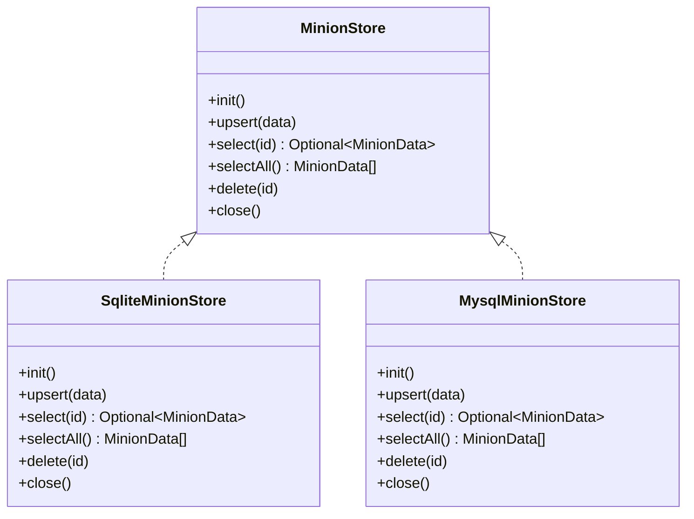
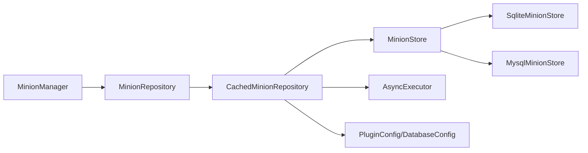

# 数据访问层设计

<cite>
**本文引用的文件**
- [MinionRepository.java](file://src/main/java/com/hcs/minions/repository/MinionRepository.java)
- [CachedMinionRepository.java](file://src/main/java/com/hcs/minions/repository/CachedMinionRepository.java)
- [RepositoryFactory.java](file://src/main/java/com/hcs/minions/repository/RepositoryFactory.java)
- [MinionStore.java](file://src/main/java/com/hcs/minions/repository/MinionStore.java)
- [MysqlMinionStore.java](file://src/main/java/com/hcs/minions/repository/mysql/MysqlMinionStore.java)
- [SqliteMinionStore.java](file://src/main/java/com/hcs/minions/repository/sqlite/SqliteMinionStore.java)
- [DatabaseConfig.java](file://src/main/java/com/hcs/minions/config/DatabaseConfig.java)
- [AsyncExecutor.java](file://src/main/java/com/hcs/minions/util/AsyncExecutor.java)
- [MinionManager.java](file://src/main/java/com/hcs/minions/service/MinionManager.java)
- [Minion.java](file://src/main/java/com/hcs/minions/model/Minion.java)
- [MinionData.java](file://src/main/java/com/hcs/minions/model/MinionData.java)
</cite>

## 目录
1. [简介](#简介)
2. [项目结构](#项目结构)
3. [核心组件](#核心组件)
4. [架构总览](#架构总览)
5. [详细组件分析](#详细组件分析)
6. [依赖关系分析](#依赖关系分析)
7. [性能考量](#性能考量)
8. [故障排查指南](#故障排查指南)
9. [结论](#结论)
10. [附录：使用示例与最佳实践](#附录使用示例与最佳实践)

## 简介
本文件系统性阐述 SkyMinions 的数据访问层设计，重点围绕 Repository 模式在插件中的实现。内容涵盖 MinionRepository 接口的设计理念与异步 CRUD、RepositoryFactory 的工厂装配、内存缓存层（ConcurrentHashMap + 脏标记）与一致性策略、以及基于虚拟线程的异步落库（write-through 模式、批量优化、事务与关闭期同步冲刷）。同时提供调用时序图、类关系图与流程图，帮助读者快速理解并正确使用该数据访问层。

## 项目结构
数据访问层位于 repository 包下，采用“接口 + 带缓存的实现 + 底层存储抽象 + 具体数据库实现”的分层组织方式；配置通过 DatabaseConfig 注入；异步执行由 AsyncExecutor 统一调度；业务侧通过 MinionManager 触发快照与落库流程。

图表来源
- [MinionRepository.java:16-46](file://src/main/java/com/hcs/minions/repository/MinionRepository.java#L16-L46)
- [CachedMinionRepository.java:29-42](file://src/main/java/com/hcs/minions/repository/CachedMinionRepository.java#L29-L42)
- [MinionStore.java:13-26](file://src/main/java/com/hcs/minions/repository/MinionStore.java#L13-L26)
- [MysqlMinionStore.java:25-92](file://src/main/java/com/hcs/minions/repository/mysql/MysqlMinionStore.java#L25-L92)
- [SqliteMinionStore.java:22-79](file://src/main/java/com/hcs/minions/repository/sqlite/SqliteMinionStore.java#L22-L79)
- [AsyncExecutor.java:19-32](file://src/main/java/com/hcs/minions/util/AsyncExecutor.java#L19-L32)
- [DatabaseConfig.java:6-20](file://src/main/java/com/hcs/minions/config/DatabaseConfig.java#L6-L20)
- [MinionManager.java:92-115](file://src/main/java/com/hcs/minions/service/MinionManager.java#L92-L115)

章节来源
- [MinionRepository.java:16-46](file://src/main/java/com/hcs/minions/repository/MinionRepository.java#L16-L46)
- [RepositoryFactory.java:15-29](file://src/main/java/com/hcs/minions/repository/RepositoryFactory.java#L15-L29)
- [CachedMinionRepository.java:29-42](file://src/main/java/com/hcs/minions/repository/CachedMinionRepository.java#L29-L42)
- [MinionStore.java:13-26](file://src/main/java/com/hcs/minions/repository/MinionStore.java#L13-L26)
- [MysqlMinionStore.java:25-92](file://src/main/java/com/hcs/minions/repository/mysql/MysqlMinionStore.java#L25-L92)
- [SqliteMinionStore.java:22-79](file://src/main/java/com/hcs/minions/repository/sqlite/SqliteMinionStore.java#L22-L79)
- [DatabaseConfig.java:6-20](file://src/main/java/com/hcs/minions/config/DatabaseConfig.java#L6-L20)
- [AsyncExecutor.java:19-32](file://src/main/java/com/hcs/minions/util/AsyncExecutor.java#L19-L32)
- [MinionManager.java:92-115](file://src/main/java/com/hcs/minions/service/MinionManager.java#L92-L115)

## 核心组件
- MinionRepository：面向业务的持久化入口，定义 find、findAll、save、delete、flushDirty、collectDirtyIds、getCached、claimDirty、flushSnapshots、flushDirtySync、close 等异步/同步方法，屏蔽 IO 细节并提供内存缓存与脏标记能力。
- CachedMinionRepository：基于 ConcurrentHashMap 的内存缓存实现，维护 dirty 集合驱动批量异步落库；所有阻塞 SQL 通过 AsyncExecutor 在虚拟线程中执行；提供两阶段落库（收集 ID -> region 线程生成快照 -> 批量 upsert）。
- MinionStore：底层存储接口，定义 init、upsert、select、selectAll、delete、close；SQLite 与 MySQL 分别实现。
- RepositoryFactory：根据 DatabaseConfig 动态创建 SqliteMinionStore 或 MysqlMinionStore，并包装为 CachedMinionRepository 返回给业务层。
- AsyncExecutor：封装 Java 21 虚拟线程池与单线程调度器，承担所有 IO 与周期任务。
- MinionManager：负责启动时加载、全局 tick、定时快照与落库、关闭期同步冲刷，确保 Inventory 访问在 region 线程安全进行。

章节来源
- [MinionRepository.java:16-46](file://src/main/java/com/hcs/minions/repository/MinionRepository.java#L16-L46)
- [CachedMinionRepository.java:29-215](file://src/main/java/com/hcs/minions/repository/CachedMinionRepository.java#L29-L215)
- [MinionStore.java:13-26](file://src/main/java/com/hcs/minions/repository/MinionStore.java#L13-L26)
- [RepositoryFactory.java:15-29](file://src/main/java/com/hcs/minions/repository/RepositoryFactory.java#L15-L29)
- [AsyncExecutor.java:19-80](file://src/main/java/com/hcs/minions/util/AsyncExecutor.java#L19-L80)
- [MinionManager.java:92-180](file://src/main/java/com/hcs/minions/service/MinionManager.java#L92-L180)

## 架构总览
下图展示从业务到存储的完整调用链，包括异步落库的两阶段流程与失败重试机制。

图表来源
- [MinionManager.java:124-160](file://src/main/java/com/hcs/minions/service/MinionManager.java#L124-L160)
- [CachedMinionRepository.java:74-153](file://src/main/java/com/hcs/minions/repository/CachedMinionRepository.java#L74-L153)
- [MysqlMinionStore.java:143-151](file://src/main/java/com/hcs/minions/repository/mysql/MysqlMinionStore.java#L143-L151)
- [SqliteMinionStore.java:111-121](file://src/main/java/com/hcs/minions/repository/sqlite/SqliteMinionStore.java#L111-L121)
- [AsyncExecutor.java:46-56](file://src/main/java/com/hcs/minions/util/AsyncExecutor.java#L46-L56)

## 详细组件分析

### MinionRepository 接口设计
- 设计理念：业务层只依赖接口，不感知 IO 与缓存细节；所有写操作先入缓存并标记脏，再由调度器批量异步落库；读操作优先命中缓存，未命中则异步回源并回填缓存。
- 核心方法：
  - find / findAll：异步读取，命中缓存直接返回，否则异步查询并回填。
  - save：写入缓存、加入 dirty、设置对象级脏标记，不立即写库。
  - delete：移除缓存与 dirty，异步删除底层数据。
  - flushDirty / flushDirtySync：兜底冲刷；sync 版本用于关闭期主线程安全落库。
  - collectDirtyIds / claimDirty：两阶段落库的 ID 收集与认领（CAS），避免重复落库。
  - flushSnapshots：接收 region 线程生成的快照，批量异步 upsert，失败重试。
  - close：关闭前同步冲刷，再关闭底层存储。

章节来源
- [MinionRepository.java:16-46](file://src/main/java/com/hcs/minions/repository/MinionRepository.java#L16-L46)

### CachedMinionRepository 内存缓存与一致性
- 数据结构：
  - cache：ConcurrentHashMap<UUID, Minion>，O(1) 平均查找，高频读取无锁。
  - dirty：ConcurrentHashMap.newKeySet()，记录需要落库的 ID。
- 一致性保证：
  - 写路径：save 先更新缓存并标记脏，后续由调度器在 region 线程生成快照后批量 upsert。
  - 认领机制：claimDirty 使用 tryClaimFlush 原子 CAS 将对象级脏标记从 true 置为 false，成功后从 dirty 移除，确保同一轮不落库两次。
  - 失败重试：upsert 抛异常时，重新将对象置脏并加入 dirty，等待下次调度重试。
  - 关闭期：flushDirtySync 在主线程遍历 dirty 同步 upsert，确保连接关闭前数据不丢失。
- 并发模型：
  - 所有阻塞 SQL 通过 AsyncExecutor 在虚拟线程执行，主线程零阻塞。
  - 快照生成严格在 region 线程进行，避免对 Bukkit Inventory 的并发访问。

图表来源
- [CachedMinionRepository.java:74-153](file://src/main/java/com/hcs/minions/repository/CachedMinionRepository.java#L74-L153)
- [MinionManager.java:124-160](file://src/main/java/com/hcs/minions/service/MinionManager.java#L124-L160)
- [Minion.java:702-716](file://src/main/java/com/hcs/minions/model/Minion.java#L702-L716)

章节来源
- [CachedMinionRepository.java:29-215](file://src/main/java/com/hcs/minions/repository/CachedMinionRepository.java#L29-L215)
- [Minion.java:702-728](file://src/main/java/com/hcs/minions/model/Minion.java#L702-L728)

### RepositoryFactory 工厂模式
- 作用：根据 DatabaseConfig.type 选择 SQLite 或 MySQL 实现，初始化底层存储，并包装为 CachedMinionRepository 返回。
- 优点：业务层完全解耦于具体存储实现；新增存储类型只需扩展工厂逻辑。

章节来源
- [RepositoryFactory.java:15-29](file://src/main/java/com/hcs/minions/repository/RepositoryFactory.java#L15-L29)
- [DatabaseConfig.java:6-20](file://src/main/java/com/hcs/minions/config/DatabaseConfig.java#L6-L20)

### MinionStore 与具体实现
- MinionStore：定义 init、upsert、select、selectAll、delete、close 等阻塞式方法，仅被 CachedMinionRepository 通过虚拟线程调用。
- SqliteMinionStore：单连接 + 内部锁串行化写入；DDL 与迁移脚本幂等；owner 列建索引加速按主人查询。
- MysqlMinionStore：基于 HikariCP 连接池；DDL 与迁移脚本幂等；连接超时收紧，预编译语句缓存开启；owner 列建索引。

图表来源
- [MinionStore.java:13-26](file://src/main/java/com/hcs/minions/repository/MinionStore.java#L13-L26)
- [SqliteMinionStore.java:22-79](file://src/main/java/com/hcs/minions/repository/sqlite/SqliteMinionStore.java#L22-L79)
- [MysqlMinionStore.java:25-92](file://src/main/java/com/hcs/minions/repository/mysql/MysqlMinionStore.java#L25-L92)

章节来源
- [MinionStore.java:13-26](file://src/main/java/com/hcs/minions/repository/MinionStore.java#L13-L26)
- [SqliteMinionStore.java:22-218](file://src/main/java/com/hcs/minions/repository/sqlite/SqliteMinionStore.java#L22-L218)
- [MysqlMinionStore.java:25-239](file://src/main/java/com/hcs/minions/repository/mysql/MysqlMinionStore.java#L25-L239)

### 异步落库策略（Write-through 与批量优化）
- Write-through 模式：save 先写缓存并标记脏，随后由调度器批量异步落库；读路径优先命中缓存，未命中异步回源并回填。
- 批量优化：
  - 收集阶段：collectDirtyIds 仅返回 ID，不触碰 Inventory。
  - 快照阶段：在各自 region 线程生成 MinionData 快照，避免跨线程访问 Inventory。
  - 落库阶段：flushSnapshots 逐个异步 upsert，失败重试并重新置脏。
- 事务处理：
  - SQLite：单连接 + 内部锁串行化，天然串行事务语义。
  - MySQL：每条 upsert 独立提交；如需强一致可在上层封装事务（当前实现以逐条 upsert 为主）。
- 关闭期保障：flushDirtySync 在主线程同步冲刷，确保连接关闭前数据不丢失。

章节来源
- [CachedMinionRepository.java:74-215](file://src/main/java/com/hcs/minions/repository/CachedMinionRepository.java#L74-L215)
- [MinionManager.java:124-180](file://src/main/java/com/hcs/minions/service/MinionManager.java#L124-L180)
- [SqliteMinionStore.java:111-177](file://src/main/java/com/hcs/minions/repository/sqlite/SqliteMinionStore.java#L111-L177)
- [MysqlMinionStore.java:143-198](file://src/main/java/com/hcs/minions/repository/mysql/MysqlMinionStore.java#L143-L198)

### 数据模型与传输对象
- Minion：运行时对象，持有 GUI、状态、工作调度等；提供 toData() 生成持久化快照。
- MinionData：纯数据记录，包含 id、owner、type、level、坐标、燃料、升级、皮肤、序列化后的 inventory 字节数组；便于 SQL 映射与网络传输。

章节来源
- [Minion.java:718-728](file://src/main/java/com/hcs/minions/model/Minion.java#L718-L728)
- [MinionData.java:11-28](file://src/main/java/com/hcs/minions/model/MinionData.java#L11-L28)

## 依赖关系分析
- 耦合与内聚：
  - MinionRepository 与业务层松耦合，仅暴露稳定接口。
  - CachedMinionRepository 内聚了缓存、脏标记、异步落库逻辑，职责清晰。
  - MinionStore 抽象出底层存储差异，SQLite/MySQL 高内聚实现。
- 直接/间接依赖：
  - MinionManager 依赖 MinionRepository 与 AsyncExecutor。
  - CachedMinionRepository 依赖 MinionStore、AsyncExecutor、PluginConfig。
  - 具体 Store 依赖 JDBC/HikariCP。
- 外部集成点：
  - 数据库：SQLite 文件、MySQL 远程库。
  - 调度：Bukkit GlobalRegionScheduler 与 RegionScheduler。
  - 异步：Java 21 虚拟线程。

图表来源
- [MinionManager.java:92-115](file://src/main/java/com/hcs/minions/service/MinionManager.java#L92-L115)
- [CachedMinionRepository.java:29-42](file://src/main/java/com/hcs/minions/repository/CachedMinionRepository.java#L29-L42)
- [MinionStore.java:13-26](file://src/main/java/com/hcs/minions/repository/MinionStore.java#L13-L26)
- [RepositoryFactory.java:20-29](file://src/main/java/com/hcs/minions/repository/RepositoryFactory.java#L20-L29)

章节来源
- [MinionManager.java:92-180](file://src/main/java/com/hcs/minions/service/MinionManager.java#L92-L180)
- [CachedMinionRepository.java:29-215](file://src/main/java/com/hcs/minions/repository/CachedMinionRepository.java#L29-L215)
- [RepositoryFactory.java:15-29](file://src/main/java/com/hcs/minions/repository/RepositoryFactory.java#L15-L29)

## 性能考量
- 缓存命中率：ConcurrentHashMap 提供 O(1) 读取，减少数据库压力；首次加载后后续读取几乎无 IO。
- 异步 IO：所有阻塞 SQL 走虚拟线程，主线程零阻塞，提升响应性。
- 批量落库：两阶段收集 ID 与快照，降低频繁小写带来的开销；失败重试避免数据丢失。
- 连接池与超时：MySQL 使用 HikariCP，合理设置最大池大小与连接超时，避免资源耗尽。
- 索引优化：owner 字段建立索引，加速按主人查询与统计。
- 关闭期冲刷：flushDirtySync 确保服务关闭前数据持久化，避免重启丢数据。

[本节为通用性能讨论，不直接分析具体文件]

## 故障排查指南
- 常见问题定位：
  - 落库失败：查看日志中“仆从落库失败”提示，确认是否因网络/权限/SQL 错误导致；系统会自动重试并重新置脏。
  - 数据不一致：检查是否在非 region 线程访问 Inventory；确保快照生成在 region 线程。
  - 关闭期丢数据：确认 onDisable 路径调用了 flushDirtySync，并在关闭前关闭所有打开的 GUI。
- 关键日志位置：
  - 异步任务失败：AsyncExecutor 捕获并记录异常。
  - 存储异常：各 Store 的 upsert/select/delete 抛出异常时记录错误。
  - 直接调用 flushDirty 警告：应改用 MinionManager 的快照收集路径以保证线程安全。

章节来源
- [CachedMinionRepository.java:135-153](file://src/main/java/com/hcs/minions/repository/CachedMinionRepository.java#L135-L153)
- [CachedMinionRepository.java:155-171](file://src/main/java/com/hcs/minions/repository/CachedMinionRepository.java#L155-L171)
- [AsyncExecutor.java:34-67](file://src/main/java/com/hcs/minions/util/AsyncExecutor.java#L34-L67)
- [MysqlMinionStore.java:143-198](file://src/main/java/com/hcs/minions/repository/mysql/MysqlMinionStore.java#L143-L198)
- [SqliteMinionStore.java:111-177](file://src/main/java/com/hcs/minions/repository/sqlite/SqliteMinionStore.java#L111-L177)

## 结论
SkyMinions 的数据访问层通过 Repository 模式实现了清晰的层次分离与稳定的业务接口；借助 ConcurrentHashMap 与脏标记机制，结合两阶段异步落库，既保证了高性能又确保了数据一致性；RepositoryFactory 提供了灵活的存储后端切换能力；AsyncExecutor 的虚拟线程模型有效隔离了 IO 与主线程，提升了整体吞吐与响应性。配合 MinionManager 的 region 线程安全调度，整个数据流在复杂多线程环境下依然稳健可靠。

[本节为总结性内容，不直接分析具体文件]

## 附录：使用示例与最佳实践
- 初始化与装配：
  - 通过 RepositoryFactory.create 传入 DatabaseConfig、AsyncExecutor、PluginConfig 与 dataFolder，获得 MinionRepository 实例。
  - 在插件启动时调用 start，完成数据加载与定时任务注册。
- 基本 CRUD 使用：
  - 保存：调用 repository.save(minion)，对象会进入缓存并标记脏，后续由调度器批量落库。
  - 查询：repository.find(id) 或 repository.findAll()，优先命中缓存，未命中异步回源。
  - 删除：repository.delete(id)，异步删除底层数据并从缓存移除。
- 关闭期保障：
  - 在 stop/onDisable 中先关闭所有 GUI，再调用 repository.flushDirtySync()，最后关闭存储。
- 最佳实践：
  - 不要直接在异步线程访问 Inventory；务必在 region 线程生成快照。
  - 避免频繁小写，利用 save 的脏标记与批量落库机制。
  - 监控日志中的失败重试，及时处理底层存储问题。

章节来源
- [RepositoryFactory.java:20-29](file://src/main/java/com/hcs/minions/repository/RepositoryFactory.java#L20-L29)
- [MinionManager.java:92-115](file://src/main/java/com/hcs/minions/service/MinionManager.java#L92-L115)
- [MinionManager.java:162-180](file://src/main/java/com/hcs/minions/service/MinionManager.java#L162-L180)
- [CachedMinionRepository.java:74-215](file://src/main/java/com/hcs/minions/repository/CachedMinionRepository.java#L74-L215)