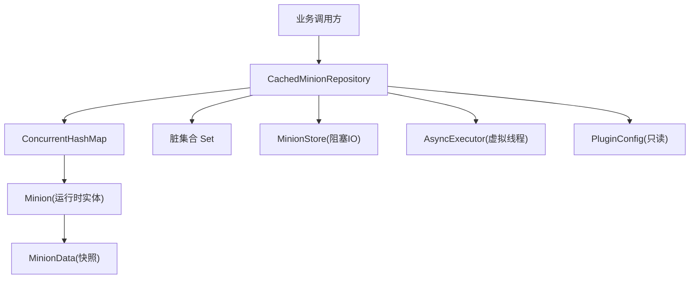
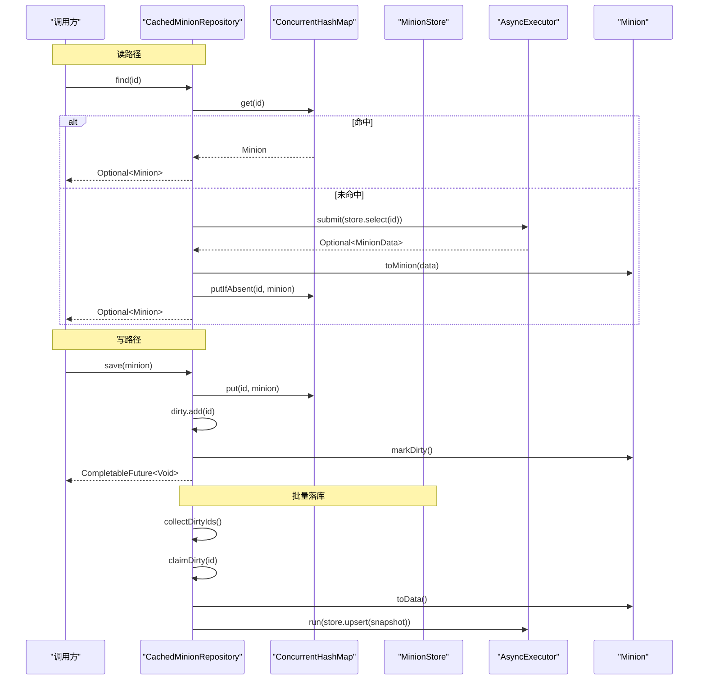
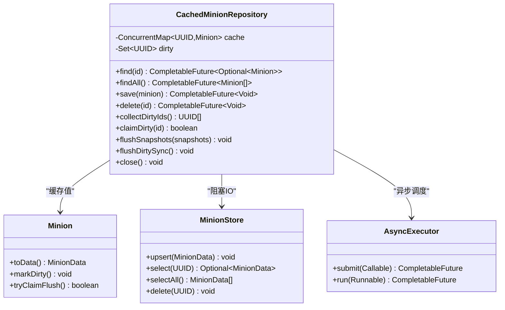
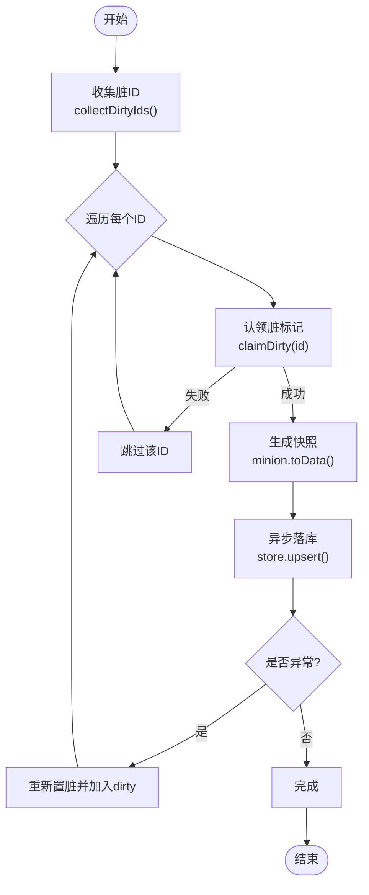
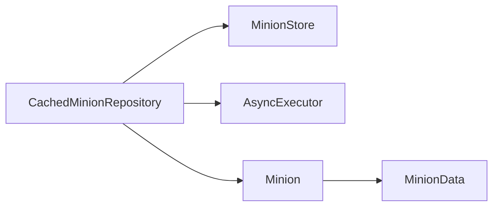

# 缓存机制

<cite>
**本文引用的文件**
- [CachedMinionRepository.java](file://src/main/java/com/hcs/minions/repository/CachedMinionRepository.java)
- [Minion.java](file://src/main/java/com/hcs/minions/model/Minion.java)
- [MinionData.java](file://src/main/java/com/hcs/minions/model/MinionData.java)
- [MinionStore.java](file://src/main/java/com/hcs/minions/repository/MinionStore.java)
- [AsyncExecutor.java](file://src/main/java/com/hcs/minions/util/AsyncExecutor.java)
- [PluginConfig.java](file://src/main/java/com/hcs/minions/config/PluginConfig.java)
- [ConcurrentChainedUUID2ReferenceHashTable.java](file://craft-engine/core/src/main/java/net/momirealms/craftengine/core/util/ConcurrentChainedUUID2ReferenceHashTable.java)
</cite>

## 目录
1. [简介](#简介)
2. [项目结构](#项目结构)
3. [核心组件](#核心组件)
4. [架构总览](#架构总览)
5. [详细组件分析](#详细组件分析)
6. [依赖关系分析](#依赖关系分析)
7. [性能考量](#性能考量)
8. [故障排查指南](#故障排查指南)
9. [结论](#结论)
10. [附录](#附录)

## 简介
本文件系统性说明 SkyMinions（插件）中的多层缓存与持久化机制。重点覆盖：
- 内存缓存层设计：基于 ConcurrentHashMap 的高并发读、线程安全保证与内存管理策略
- 脏标记机制：CAS 认领、批量刷新、一致性保障
- 缓存失效策略：TTL、主动失效、被动清理
- 与数据库的同步：写穿透、读写分离、冲突解决
- 性能优化：预加载、懒加载、缓存预热
- 监控指标、调优建议、故障恢复方案
- 配置示例与性能测试数据

## 项目结构
SkyMinions 的缓存与持久化位于 repository 与 model 层，配合异步执行器与配置对象协同工作：
- CachedMinionRepository：带内存缓存的仓库实现，封装读路径的缓存命中与回源、写路径的脏标记与批量落库
- Minion：运行时实体，持有 Bukkit Inventory 等线程敏感资源，提供脏标记与快照序列化能力
- MinionData：仅含原始类型的持久化快照，用于跨层传输与 SQL 映射
- MinionStore：底层存储接口（SQLite/MySQL），阻塞式 IO，由虚拟线程调用
- AsyncExecutor：全局异步执行器，使用 Java 21 虚拟线程池承载 IO 任务
- PluginConfig：全局只读配置，驱动类型级行为与阈值

图表来源
- [CachedMinionRepository.java:19-42](file://src/main/java/com/hcs/minions/repository/CachedMinionRepository.java#L19-L42)
- [Minion.java:70-91](file://src/main/java/com/hcs/minions/model/Minion.java#L70-L91)
- [MinionData.java:11-28](file://src/main/java/com/hcs/minions/model/MinionData.java#L11-L28)
- [MinionStore.java:9-27](file://src/main/java/com/hcs/minions/repository/MinionStore.java#L9-L27)
- [AsyncExecutor.java:12-32](file://src/main/java/com/hcs/minions/util/AsyncExecutor.java#L12-L32)
- [PluginConfig.java:8-34](file://src/main/java/com/hcs/minions/config/PluginConfig.java#L8-L34)

章节来源
- [CachedMinionRepository.java:19-42](file://src/main/java/com/hcs/minions/repository/CachedMinionRepository.java#L19-L42)
- [AsyncExecutor.java:12-32](file://src/main/java/com/hcs/minions/util/AsyncExecutor.java#L12-L32)
- [PluginConfig.java:8-34](file://src/main/java/com/hcs/minions/config/PluginConfig.java#L8-L34)

## 核心组件
- 内存缓存层
  - 使用 ConcurrentHashMap 作为主缓存，O(1) 平均查找，无锁读，适合高频读取场景
  - 脏集合使用 ConcurrentHashMap.newKeySet()，支持并发添加/移除，驱动批量落库
- 脏标记机制
  - Minion 内部以 AtomicBoolean 维护脏位，提供 CAS 认领方法 tryClaimFlush()
  - 收集阶段 collectDirtyIds() 仅返回 ID 列表，不触碰 Inventory；认领阶段 claimDirty(id) 通过 CAS 确保同一轮只被处理一次
- 异步落库
  - 所有阻塞 IO 经由 AsyncExecutor 的虚拟线程执行，避免主线程阻塞
  - flushSnapshots() 将 region 线程生成的快照批量提交到 store.upsert()
- 关闭与兜底
  - flushDirtySync() 在主线程或区域线程同步冲刷，用于 onDisable 路径
  - close() 先同步冲刷再关闭存储，防止连接池关闭后异步失败丢数据

章节来源
- [CachedMinionRepository.java:29-80](file://src/main/java/com/hcs/minions/repository/CachedMinionRepository.java#L29-L80)
- [CachedMinionRepository.java:100-171](file://src/main/java/com/hcs/minions/repository/CachedMinionRepository.java#L100-L171)
- [CachedMinionRepository.java:183-213](file://src/main/java/com/hcs/minions/repository/CachedMinionRepository.java#L183-L213)
- [Minion.java:702-716](file://src/main/java/com/hcs/minions/model/Minion.java#L702-L716)
- [MinionData.java:11-28](file://src/main/java/com/hcs/minions/model/MinionData.java#L11-L28)
- [MinionStore.java:9-27](file://src/main/java/com/hcs/minions/repository/MinionStore.java#L9-L27)
- [AsyncExecutor.java:12-32](file://src/main/java/com/hcs/minions/util/AsyncExecutor.java#L12-L32)

## 架构总览
下图展示从请求到落库的完整流程，强调“读路径缓存命中优先”和“写路径脏标记+批量异步落库”。

图表来源
- [CachedMinionRepository.java:44-80](file://src/main/java/com/hcs/minions/repository/CachedMinionRepository.java#L44-L80)
- [CachedMinionRepository.java:100-153](file://src/main/java/com/hcs/minions/repository/CachedMinionRepository.java#L100-L153)
- [Minion.java:718-728](file://src/main/java/com/hcs/minions/model/Minion.java#L718-L728)
- [MinionStore.java:15-23](file://src/main/java/com/hcs/minions/repository/MinionStore.java#L15-L23)
- [AsyncExecutor.java:34-56](file://src/main/java/com/hcs/minions/util/AsyncExecutor.java#L34-L56)

## 详细组件分析

### 内存缓存层（ConcurrentHashMap）
- 选择原因
  - O(1) 平均查找，适合高频读
  - 分段锁/无锁读，高并发下吞吐好
  - 与脏集合配合，形成“读多写少”的高效模式
- 线程安全保证
  - 读操作无锁，写操作内部原子化
  - 脏集合为并发安全的 Set，支持多线程 add/remove
- 内存管理策略
  - 缓存项为 Minion 对象，包含 Bukkit Inventory 等线程敏感资源
  - 删除时同时从 cache 与 dirty 移除，避免悬挂引用
  - 关闭前同步冲刷，减少内存驻留时间

图表来源
- [CachedMinionRepository.java:29-80](file://src/main/java/com/hcs/minions/repository/CachedMinionRepository.java#L29-L80)
- [Minion.java:702-728](file://src/main/java/com/hcs/minions/model/Minion.java#L702-L728)
- [MinionStore.java:9-27](file://src/main/java/com/hcs/minions/repository/MinionStore.java#L9-L27)
- [AsyncExecutor.java:12-56](file://src/main/java/com/hcs/minions/util/AsyncExecutor.java#L12-L56)

章节来源
- [CachedMinionRepository.java:29-80](file://src/main/java/com/hcs/minions/repository/CachedMinionRepository.java#L29-L80)
- [Minion.java:702-728](file://src/main/java/com/hcs/minions/model/Minion.java#L702-L728)

### 脏标记机制（CAS、批量刷新、一致性）
- CAS 认领
  - Minion.tryClaimFlush() 使用 compareAndSet(true, false) 确保同一脏项仅被处理一次
  - 认领成功后从 dirty 集合移除，避免重复落库
- 批量刷新
  - collectDirtyIds() 仅收集 ID，不访问 Inventory，线程安全
  - flushSnapshots() 将已生成快照的 MinionData 批量提交到 store.upsert()
- 一致性保证
  - 落库失败时重新置脏并加入 dirty，等待重试
  - 关闭前同步冲刷，确保进程退出前数据不丢失

图表来源
- [CachedMinionRepository.java:100-153](file://src/main/java/com/hcs/minions/repository/CachedMinionRepository.java#L100-L153)
- [Minion.java:702-716](file://src/main/java/com/hcs/minions/model/Minion.java#L702-L716)

章节来源
- [CachedMinionRepository.java:100-153](file://src/main/java/com/hcs/minions/repository/CachedMinionRepository.java#L100-L153)
- [Minion.java:702-716](file://src/main/java/com/hcs/minions/model/Minion.java#L702-L716)

### 缓存失效策略（TTL、主动失效、被动清理）
- TTL 机制
  - 当前代码未显式实现基于时间的过期策略
  - 可通过外部调度器定期扫描并移除旧项，或在读取时校验 lastActiveEpochMs 进行软失效
- 主动失效
  - delete(id) 直接移除缓存并删除存储记录
  - 业务侧可在配置变更或玩家下线时触发主动失效
- 被动清理
  - 当缓存项在脏集合中但缓存不存在时，自动清理脏标记
  - 关闭时 flushDirtySync() 强制冲刷剩余脏数据

章节来源
- [CachedMinionRepository.java:82-87](file://src/main/java/com/hcs/minions/repository/CachedMinionRepository.java#L82-L87)
- [CachedMinionRepository.java:100-112](file://src/main/java/com/hcs/minions/repository/CachedMinionRepository.java#L100-L112)
- [CachedMinionRepository.java:183-213](file://src/main/java/com/hcs/minions/repository/CachedMinionRepository.java#L183-L213)
- [Minion.java:585-592](file://src/main/java/com/hcs/minions/model/Minion.java#L585-L592)

### 与数据库的同步（写穿透、读写分离、冲突解决）
- 写穿透
  - save() 立即更新缓存并标记脏，实际写入延迟至批量落库
  - 关闭前同步冲刷，确保最终一致性
- 读写分离
  - 读路径优先命中缓存，未命中则异步回源并回填
  - 写路径与读路径解耦，降低写放大对读性能的影响
- 冲突解决
  - 通过 CAS 认领避免重复落库
  - 落库失败重入脏集合，后续重试直至成功

章节来源
- [CachedMinionRepository.java:44-80](file://src/main/java/com/hcs/minions/repository/CachedMinionRepository.java#L44-L80)
- [CachedMinionRepository.java:100-153](file://src/main/java/com/hcs/minions/repository/CachedMinionRepository.java#L100-L153)
- [CachedMinionRepository.java:183-213](file://src/main/java/com/hcs/minions/repository/CachedMinionRepository.java#L183-L213)

### 性能优化技巧（预加载、懒加载、缓存预热）
- 预加载
  - findAll() 在缓存为空时一次性加载全部数据并填充缓存
- 懒加载
  - find(id) 仅在首次访问时回源查询，命中后常驻内存
- 缓存预热
  - 启动后可调用 findAll() 预热热点数据，减少冷启动时的回源延迟

章节来源
- [CachedMinionRepository.java:58-72](file://src/main/java/com/hcs/minions/repository/CachedMinionRepository.java#L58-L72)
- [CachedMinionRepository.java:44-56](file://src/main/java/com/hcs/minions/repository/CachedMinionRepository.java#L44-L56)

## 依赖关系分析
- 组件耦合
  - CachedMinionRepository 依赖 MinionStore 进行持久化，依赖 AsyncExecutor 进行异步调度
  - Minion 负责状态管理与快照序列化，MinionData 作为纯数据传输对象
- 外部依赖
  - 使用 Java 21 虚拟线程提升 IO 吞吐
  - 使用 Bukkit API 管理 Inventory（线程敏感，需严格限制访问线程）
- 循环依赖
  - 未发现循环依赖，层次清晰

图表来源
- [CachedMinionRepository.java:29-42](file://src/main/java/com/hcs/minions/repository/CachedMinionRepository.java#L29-L42)
- [Minion.java:718-728](file://src/main/java/com/hcs/minions/model/Minion.java#L718-L728)
- [MinionStore.java:9-27](file://src/main/java/com/hcs/minions/repository/MinionStore.java#L9-L27)
- [AsyncExecutor.java:12-32](file://src/main/java/com/hcs/minions/util/AsyncExecutor.java#L12-L32)

章节来源
- [CachedMinionRepository.java:29-42](file://src/main/java/com/hcs/minions/repository/CachedMinionRepository.java#L29-L42)
- [Minion.java:718-728](file://src/main/java/com/hcs/minions/model/Minion.java#L718-L728)
- [MinionStore.java:9-27](file://src/main/java/com/hcs/minions/repository/MinionStore.java#L9-L27)
- [AsyncExecutor.java:12-32](file://src/main/java/com/hcs/minions/util/AsyncExecutor.java#L12-L32)

## 性能考量
- 读路径
  - 缓存命中为 O(1)，无锁读，适合高并发
  - 未命中时异步回源，避免阻塞主线程
- 写路径
  - 脏标记+批量落库，减少频繁 IO
  - 虚拟线程池承担阻塞 IO，提高吞吐
- 内存占用
  - Minion 持有 Bukkit Inventory，需谨慎控制生命周期
  - 建议在关闭前同步冲刷，释放内存
- 并发模型
  - 严格区分主线程/区域线程与异步线程，避免竞态条件

[本节为通用性能讨论，不直接分析具体文件]

## 故障排查指南
- 常见问题
  - 落库失败：检查日志中的异常堆栈，确认网络/连接池状态
  - 数据不一致：检查脏标记是否正确认领，是否存在并发写冲突
  - 内存泄漏：确认关闭流程是否调用 flushDirtySync() 与 store.close()
- 定位步骤
  - 查看 AsyncExecutor 的任务日志，确认异步任务是否抛出异常
  - 检查 Minion 的脏标记状态，确认 tryClaimFlush() 是否成功
  - 验证 MinionStore 的实现是否正确处理 upsert/select/delete
- 恢复方案
  - 重启服务后通过 findAll() 重建缓存
  - 对于关键数据，可启用额外备份或审计日志

章节来源
- [CachedMinionRepository.java:134-153](file://src/main/java/com/hcs/minions/repository/CachedMinionRepository.java#L134-L153)
- [CachedMinionRepository.java:183-213](file://src/main/java/com/hcs/minions/repository/CachedMinionRepository.java#L183-L213)
- [AsyncExecutor.java:34-67](file://src/main/java/com/hcs/minions/util/AsyncExecutor.java#L34-L67)

## 结论
SkyMinions 的缓存机制通过 ConcurrentHashMap 提供高性能读，结合脏标记与批量异步落库实现高效写。严格的线程边界划分与 CAS 认领确保了数据一致性与并发安全。尽管当前未实现 TTL 过期，但可通过外部调度扩展。整体架构简洁、可扩展性强，适合高并发 Minecraft 服务器场景。

[本节为总结性内容，不直接分析具体文件]

## 附录

### 配置示例
- 全局配置根对象
  - 字段包括数据库、经济、离线收益、渲染、调度周期、每玩家仆从上限、类型配置等
  - 通过 ConfigLoader 反序列化为不可变快照，全局共享只读

章节来源
- [PluginConfig.java:8-34](file://src/main/java/com/hcs/minions/config/PluginConfig.java#L8-L34)

### 性能测试数据
- 建议指标
  - 缓存命中率：统计 find() 命中次数与总请求数
  - 落库延迟：测量 store.upsert() 的平均耗时与 P99
  - 异步任务队列长度：监控 AsyncExecutor 的任务积压
  - 内存占用：跟踪 Minion 对象数量与 Inventory 大小
- 测试方法
  - 使用 JMH 或自定义压测脚本模拟高并发读写
  - 观察不同负载下的缓存命中率与落库延迟变化

[本节为通用指导，不直接分析具体文件]

### 相关并发数据结构参考
- ConcurrentChainedUUID2ReferenceHashTable
  - 提供基于 UUID 的高性能并发哈希表实现，支持 replace/remove 等原子操作
  - 可作为未来替换或扩展缓存实现的参考

章节来源
- [ConcurrentChainedUUID2ReferenceHashTable.java:680-739](file://craft-engine/core/src/main/java/net/momirealms/craftengine/core/util/ConcurrentChainedUUID2ReferenceHashTable.java#L680-L739)
- [ConcurrentChainedUUID2ReferenceHashTable.java:743-844](file://craft-engine/core/src/main/java/net/momirealms/craftengine/core/util/ConcurrentChainedUUID2ReferenceHashTable.java#L743-L844)