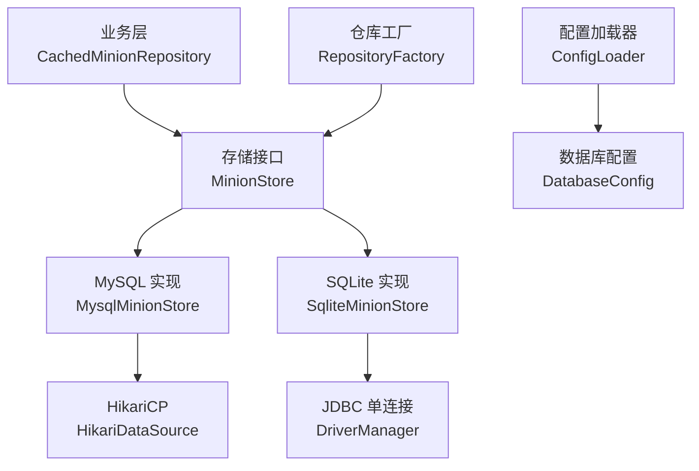
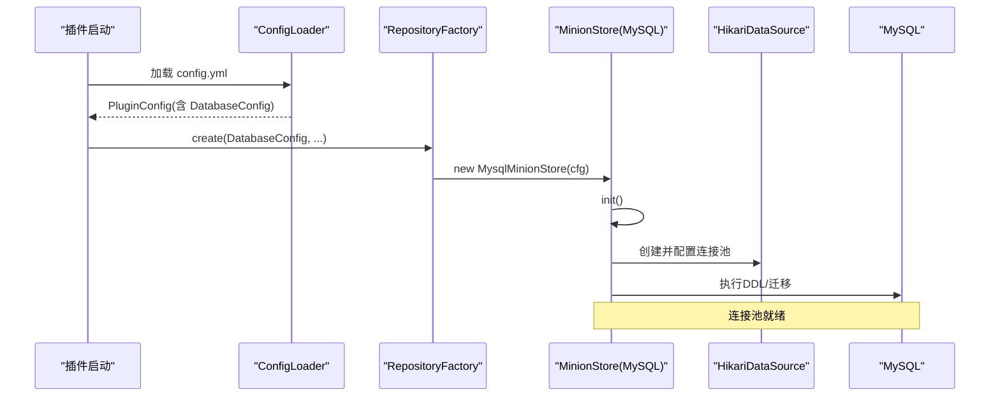
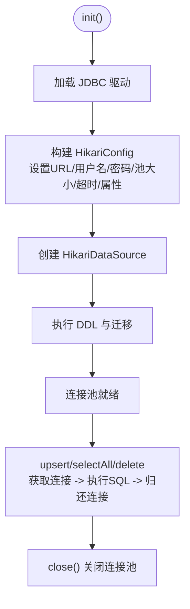
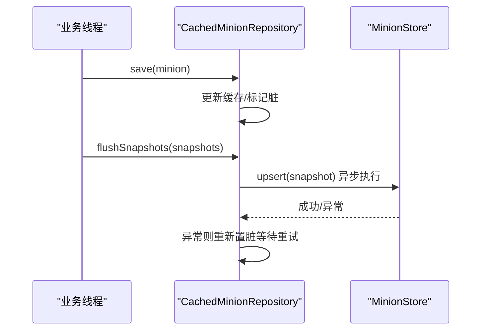
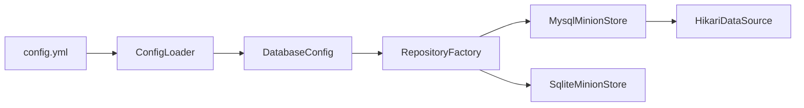

# 连接池管理

<cite>
**本文引用的文件**
- [config.yml](file://src/main/resources/config.yml)
- [ConfigLoader.java](file://src/main/java/com/hcs/minions/config/ConfigLoader.java)
- [DatabaseConfig.java](file://src/main/java/com/hcs/minions/config/DatabaseConfig.java)
- [RepositoryFactory.java](file://src/main/java/com/hcs/minions/repository/RepositoryFactory.java)
- [MinionStore.java](file://src/main/java/com/hcs/minions/repository/MinionStore.java)
- [MysqlMinionStore.java](file://src/main/java/com/hcs/minions/repository/mysql/MysqlMinionStore.java)
- [SqliteMinionStore.java](file://src/main/java/com/hcs/minions/repository/sqlite/SqliteMinionStore.java)
- [CachedMinionRepository.java](file://src/main/java/com/hcs/minions/repository/CachedMinionRepository.java)
</cite>

## 目录
1. [简介](#简介)
2. [项目结构](#项目结构)
3. [核心组件](#核心组件)
4. [架构总览](#架构总览)
5. [详细组件分析](#详细组件分析)
6. [依赖关系分析](#依赖关系分析)
7. [性能考虑](#性能考虑)
8. [故障排查指南](#故障排查指南)
9. [结论](#结论)
10. [附录](#附录)

## 简介
本文件聚焦 SkyMinions 中的数据库连接池管理，重点解析基于 HikariCP 的 MySQL 连接池实现与 SQLite 单连接策略。文档覆盖配置参数、生命周期管理、性能调优、错误处理、多后端差异、监控与诊断方法，并提供可操作的配置示例与最佳实践建议。

## 项目结构
SkyMinions 将数据访问抽象为 MinionStore 接口，MySQL 使用 HikariCP 连接池，SQLite 使用单连接加锁；上层通过 RepositoryFactory 装配具体实现，并由 CachedMinionRepository 提供内存缓存与异步落库能力。配置由 ConfigLoader 从 config.yml 加载为强类型对象，供数据层读取。

图表来源
- [MysqlMinionStore.java:64-92](file://src/main/java/com/hcs/minions/repository/mysql/MysqlMinionStore.java#L64-L92)
- [SqliteMinionStore.java:62-79](file://src/main/java/com/hcs/minions/repository/sqlite/SqliteMinionStore.java#L62-L79)
- [RepositoryFactory.java:20-29](file://src/main/java/com/hcs/minions/repository/RepositoryFactory.java#L20-L29)
- [ConfigLoader.java:30-43](file://src/main/java/com/hcs/minions/config/ConfigLoader.java#L30-L43)

章节来源
- [config.yml:13-22](file://src/main/resources/config.yml#L13-L22)
- [ConfigLoader.java:30-43](file://src/main/java/com/hcs/minions/config/ConfigLoader.java#L30-L43)
- [RepositoryFactory.java:20-29](file://src/main/java/com/hcs/minions/repository/RepositoryFactory.java#L20-L29)

## 核心组件
- 配置模型：DatabaseConfig 描述后端类型、连接信息与 pool-size；PluginConfig 聚合全局配置。
- 存储接口：MinionStore 定义 init/upsert/selectAll/delete/close 等阻塞式操作。
- MySQL 实现：MysqlMinionStore 基于 HikariCP 构建连接池，设置最大连接数、空闲连接、超时、预编译语句缓存等。
- SQLite 实现：SqliteMinionStore 使用单连接 + 同步锁，避免并发写冲突。
- 仓库层：CachedMinionRepository 提供内存缓存、脏标记与异步落库（虚拟线程），在关闭时同步冲刷。

章节来源
- [DatabaseConfig.java:6-19](file://src/main/java/com/hcs/minions/config/DatabaseConfig.java#L6-L19)
- [MinionStore.java:13-27](file://src/main/java/com/hcs/minions/repository/MinionStore.java#L13-L27)
- [MysqlMinionStore.java:64-92](file://src/main/java/com/hcs/minions/repository/mysql/MysqlMinionStore.java#L64-L92)
- [SqliteMinionStore.java:62-79](file://src/main/java/com/hcs/minions/repository/sqlite/SqliteMinionStore.java#L62-L79)
- [CachedMinionRepository.java:19-28](file://src/main/java/com/hcs/minions/repository/CachedMinionRepository.java#L19-L28)

## 架构总览
下图展示从配置到连接池初始化、再到请求执行的完整链路。

图表来源
- [ConfigLoader.java:30-43](file://src/main/java/com/hcs/minions/config/ConfigLoader.java#L30-L43)
- [RepositoryFactory.java:20-29](file://src/main/java/com/hcs/minions/repository/RepositoryFactory.java#L20-L29)
- [MysqlMinionStore.java:64-92](file://src/main/java/com/hcs/minions/repository/mysql/MysqlMinionStore.java#L64-L92)

## 详细组件分析

### HikariCP 连接池配置与生命周期（MySQL）
- 关键参数
  - 最大连接数：maximumPoolSize = max(2, pool-size)，避免过小导致争用。
  - 最小空闲连接：minimumIdle = 0，按需创建，减少空闲资源占用。
  - 连接超时：connectionTimeout = 5000ms，快速失败，防止堆积。
  - 预编译语句缓存：cachePrepStmts=true，prepStmtCacheSize=128，提升重复 SQL 性能。
  - 连接 URL：包含字符集与安全相关参数。
- 生命周期
  - 初始化：显式加载驱动、构建 HikariConfig、创建 HikariDataSource、执行 DDL 与迁移。
  - 使用：每次 upsert/selectAll/delete 通过 try-with-resources 获取连接并自动归还。
  - 销毁：close() 调用 dataSource.close() 释放连接池资源。

图表来源
- [MysqlMinionStore.java:64-92](file://src/main/java/com/hcs/minions/repository/mysql/MysqlMinionStore.java#L64-L92)
- [MysqlMinionStore.java:143-198](file://src/main/java/com/hcs/minions/repository/mysql/MysqlMinionStore.java#L143-L198)

章节来源
- [MysqlMinionStore.java:64-92](file://src/main/java/com/hcs/minions/repository/mysql/MysqlMinionStore.java#L64-L92)
- [MysqlMinionStore.java:143-198](file://src/main/java/com/hcs/minions/repository/mysql/MysqlMinionStore.java#L143-L198)

### SQLite 单连接与并发控制
- 设计要点
  - 单连接 + synchronized 临界区，确保写入串行化，避免 SQLite 并发写冲突。
  - 初始化时创建表与索引，支持幂等迁移。
  - 关闭时安全关闭连接。
- 适用场景
  - 单机或轻量部署，写入量不大且对一致性要求高。

章节来源
- [SqliteMinionStore.java:62-79](file://src/main/java/com/hcs/minions/repository/sqlite/SqliteMinionStore.java#L62-L79)
- [SqliteMinionStore.java:111-177](file://src/main/java/com/hcs/minions/repository/sqlite/SqliteMinionStore.java#L111-L177)

### 仓库层与异步落库（CachedMinionRepository）
- 并发模型
  - 内存缓存：ConcurrentHashMap 提供 O(1) 读。
  - 脏标记：Set<UUID> 记录变更，批量异步落库。
  - 异步执行：所有阻塞 SQL 通过 AsyncExecutor（虚拟线程）提交，主线程零阻塞。
- 落库流程
  - save() 仅更新缓存与脏标记。
  - flushSnapshots() 批量提交 toData() 快照至 store.upsert()。
  - close() 前同步冲刷，避免连接池关闭后异步写失败丢数据。

图表来源
- [CachedMinionRepository.java:74-87](file://src/main/java/com/hcs/minions/repository/CachedMinionRepository.java#L74-L87)
- [CachedMinionRepository.java:134-153](file://src/main/java/com/hcs/minions/repository/CachedMinionRepository.java#L134-L153)
- [CachedMinionRepository.java:208-213](file://src/main/java/com/hcs/minions/repository/CachedMinionRepository.java#L208-L213)

章节来源
- [CachedMinionRepository.java:19-28](file://src/main/java/com/hcs/minions/repository/CachedMinionRepository.java#L19-L28)
- [CachedMinionRepository.java:74-87](file://src/main/java/com/hcs/minions/repository/CachedMinionRepository.java#L74-L87)
- [CachedMinionRepository.java:134-153](file://src/main/java/com/hcs/minions/repository/CachedMinionRepository.java#L134-L153)
- [CachedMinionRepository.java:208-213](file://src/main/java/com/hcs/minions/repository/CachedMinionRepository.java#L208-L213)

## 依赖关系分析
- 配置依赖：ConfigLoader 从 config.yml 读取 database.* 与 pool-size，构造 DatabaseConfig。
- 装配依赖：RepositoryFactory 根据 type 选择 SqliteMinionStore 或 MysqlMinionStore，并调用 init()。
- 运行时依赖：MySQL 路径依赖 HikariCP；SQLite 路径依赖 JDBC 单连接。

图表来源
- [ConfigLoader.java:30-43](file://src/main/java/com/hcs/minions/config/ConfigLoader.java#L30-L43)
- [RepositoryFactory.java:20-29](file://src/main/java/com/hcs/minions/repository/RepositoryFactory.java#L20-L29)
- [MysqlMinionStore.java:64-92](file://src/main/java/com/hcs/minions/repository/mysql/MysqlMinionStore.java#L64-L92)

章节来源
- [config.yml:13-22](file://src/main/resources/config.yml#L13-L22)
- [ConfigLoader.java:30-43](file://src/main/java/com/hcs/minions/config/ConfigLoader.java#L30-L43)
- [RepositoryFactory.java:20-29](file://src/main/java/com/hcs/minions/repository/RepositoryFactory.java#L20-L29)

## 性能考虑
- 连接池规模
  - maximumPoolSize 至少为 2，避免过小造成争用；结合 pool-size 配置，按实际并发调整。
  - minimumIdle 设为 0，按需创建连接，降低空闲资源消耗。
- 超时与快速失败
  - connectionTimeout 设置为较短值（如 5000ms），避免请求堆积与级联延迟。
- 语句缓存
  - 启用 cachePrepStmts 并设置 prepStmtCacheSize，提高重复 SQL 执行效率。
- 虚拟线程与阻塞 IO
  - 注释指出 mysql-connector-j 的阻塞调用会固定载体线程，因此保持小连接池，不随仆从数量放大。
- 缓存与批写
  - 使用内存缓存与脏标记批量落库，减少频繁 IO；关闭时同步冲刷保证数据一致性。

[本节为通用性能指导，无需特定文件引用]

## 故障排查指南
- 初始化失败
  - MySQL 驱动未找到：检查类路径是否包含驱动；代码中显式加载驱动类。
  - DDL/迁移失败：查看日志输出，确认权限与表结构兼容性。
- 连接超时
  - 若频繁出现连接超时，检查网络、数据库负载与连接池大小；适当增大 maximumPoolSize 或优化查询。
- 写入失败与重试
  - 异步落库失败会将对应条目重新置脏，等待后续重试；关注日志定位失败原因。
- SQLite 并发写
  - 单连接 + 同步锁已保证串行写；若仍出现异常，检查外部进程是否独占文件句柄。

章节来源
- [MysqlMinionStore.java:64-92](file://src/main/java/com/hcs/minions/repository/mysql/MysqlMinionStore.java#L64-L92)
- [SqliteMinionStore.java:62-79](file://src/main/java/com/hcs/minions/repository/sqlite/SqliteMinionStore.java#L62-L79)
- [CachedMinionRepository.java:134-153](file://src/main/java/com/hcs/minions/repository/CachedMinionRepository.java#L134-L153)

## 结论
SkyMinions 通过 MinionStore 抽象统一了 MySQL 与 SQLite 的数据访问；MySQL 使用 HikariCP 进行连接池管理，采用“小池 + 短超时 + 语句缓存”的策略以适配虚拟线程与阻塞 IO；SQLite 使用单连接加锁保障一致性。配合内存缓存与异步落库，系统在可用性与性能之间取得平衡。生产环境建议依据实际并发与数据库能力调优连接池参数，并结合日志与监控持续优化。

[本节为总结性内容，无需特定文件引用]

## 附录

### 配置项说明（数据库与连接池）
- database.type：sqlite | mysql
- database.sqlite-file：SQLite 文件名
- database.host / port / database / user / password：MySQL 连接信息
- database.pool-size：HikariCP 连接池基础大小（最终最大连接数为 max(2, pool-size)）

章节来源
- [config.yml:13-22](file://src/main/resources/config.yml#L13-L22)
- [ConfigLoader.java:30-43](file://src/main/java/com/hcs/minions/config/ConfigLoader.java#L30-L43)
- [DatabaseConfig.java:6-19](file://src/main/java/com/hcs/minions/config/DatabaseConfig.java#L6-L19)

### 最佳实践建议
- 连接池
  - 初始 pool-size 建议 4；在高并发下逐步上调 maximumPoolSize，观察连接等待与 CPU 使用。
  - 保持 minimumIdle=0，避免空闲连接浪费。
  - 连接超时不宜过长，快速失败有助于系统弹性。
- 语句缓存
  - 开启预编译语句缓存，合理设置缓存大小，避免过大内存占用。
- 缓存与落库
  - 充分利用内存缓存与批量落库，减少 IO 压力；确保关闭时同步冲刷。
- 监控与诊断
  - 关注初始化与落库日志；必要时增加慢查询与连接池指标采集（如连接获取耗时、活跃连接数）。
  - 针对 MySQL，检查索引与查询计划，避免全表扫描。

[本节为通用实践建议，无需特定文件引用]