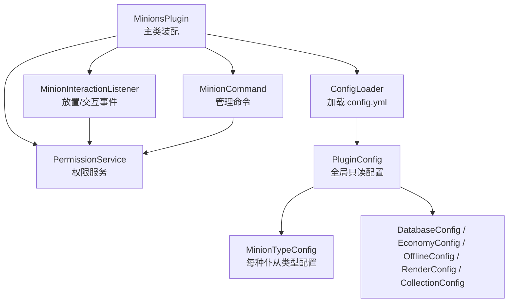
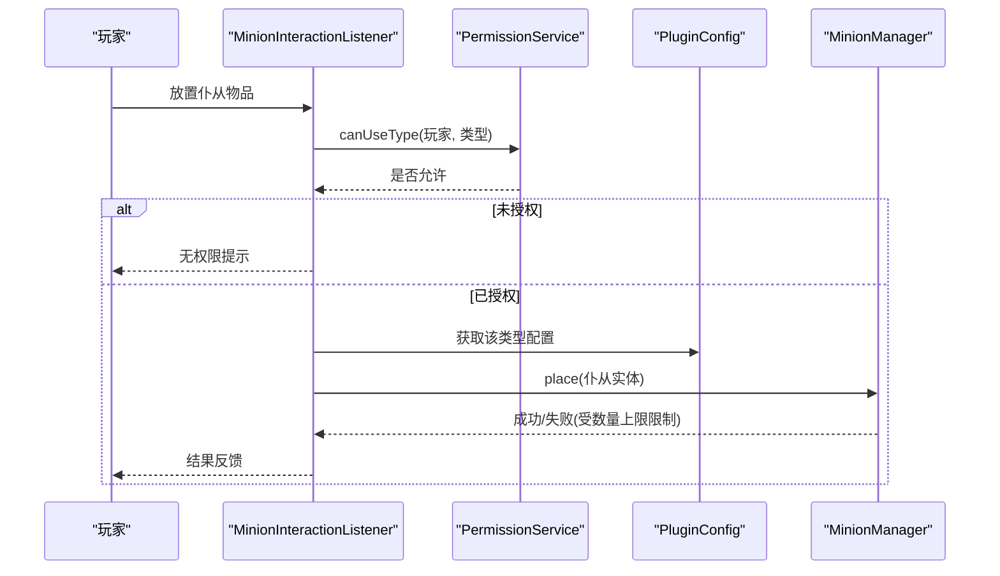
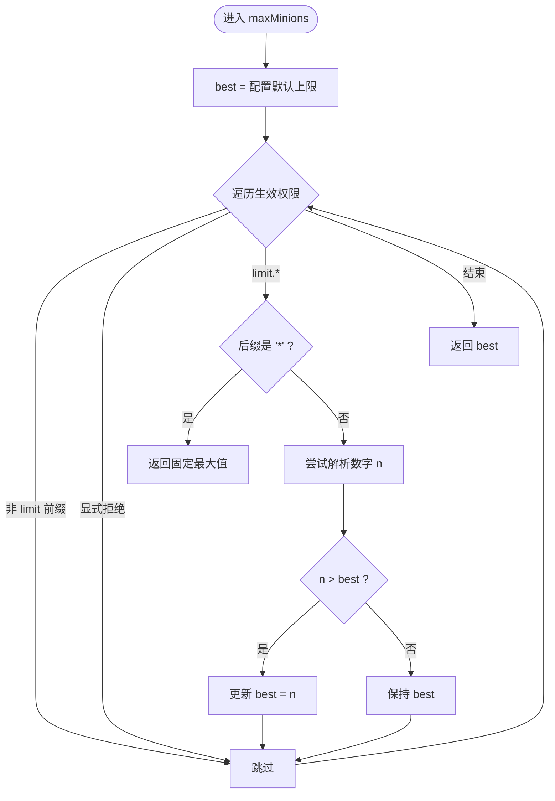
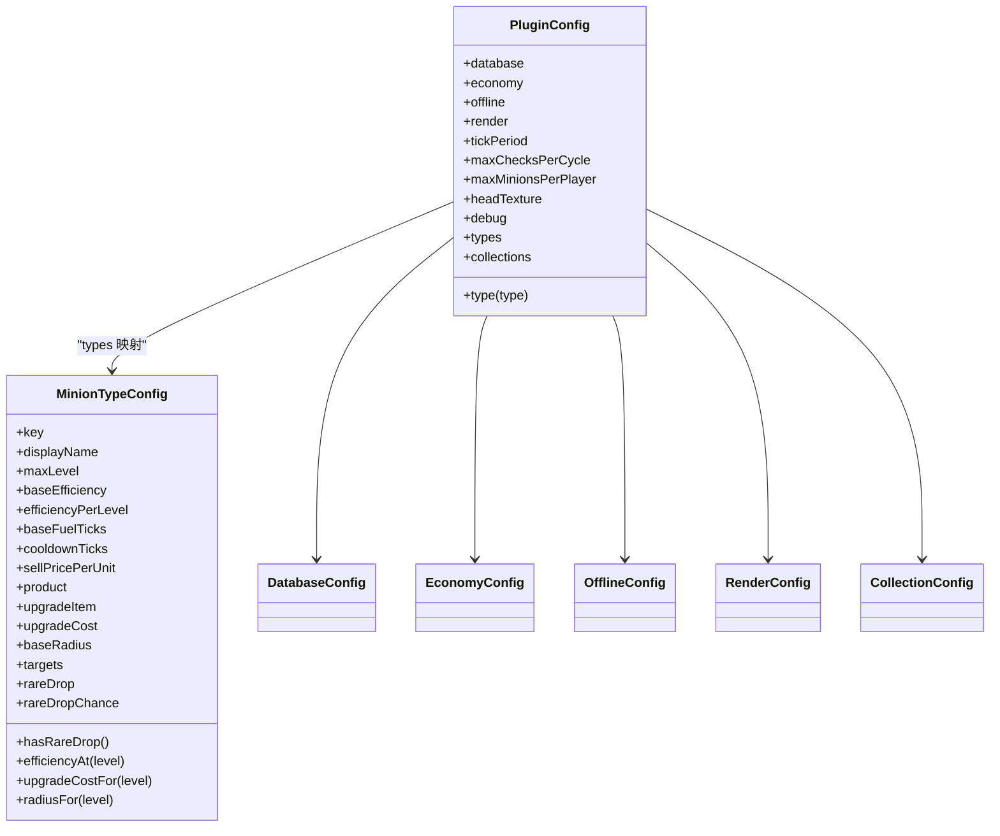
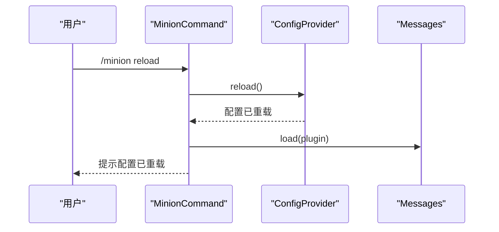
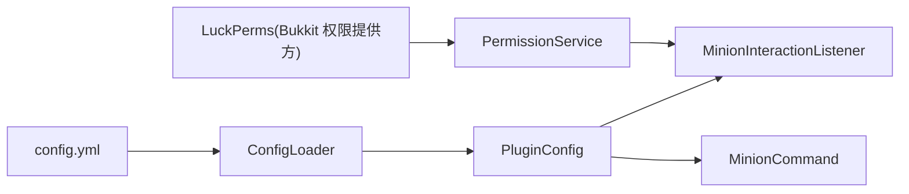

# 权限与配置管理

<cite>
**本文引用的文件**
- [MinionsPlugin.java](file://src/main/java/com/hcs/minions/MinionsPlugin.java)
- [PermissionService.java](file://src/main/java/com/hcs/minions/service/PermissionService.java)
- [MinionInteractionListener.java](file://src/main/java/com/hcs/minions/listener/MinionInteractionListener.java)
- [MinionCommand.java](file://src/main/java/com/hcs/minions/command/MinionCommand.java)
- [ConfigLoader.java](file://src/main/java/com/hcs/minions/config/ConfigLoader.java)
- [PluginConfig.java](file://src/main/java/com/hcs/minions/config/PluginConfig.java)
- [MinionTypeConfig.java](file://src/main/java/com/hcs/minions/config/MinionTypeConfig.java)
- [DatabaseConfig.java](file://src/main/java/com/hcs/minions/config/DatabaseConfig.java)
- [EconomyConfig.java](file://src/main/java/com/hcs/minions/config/EconomyConfig.java)
- [OfflineConfig.java](file://src/main/java/com/hcs/minions/config/OfflineConfig.java)
- [RenderConfig.java](file://src/main/java/com/hcs/minions/config/RenderConfig.java)
- [CollectionConfig.java](file://src/main/java/com/hcs/minions/config/CollectionConfig.java)
- [config.yml](file://src/main/resources/config.yml)
</cite>

## 目录
1. [简介](#简介)
2. [项目结构](#项目结构)
3. [核心组件](#核心组件)
4. [架构总览](#架构总览)
5. [详细组件分析](#详细组件分析)
6. [依赖关系分析](#依赖关系分析)
7. [性能考量](#性能考量)
8. [故障排除指南](#故障排除指南)
9. [结论](#结论)
10. [附录](#附录)

## 简介
本文面向 SkyMinions 插件的权限系统与配置管理系统，聚焦以下目标：
- 详细说明 LuckPerms 权限集成方式、权限节点体系与检查逻辑。
- 解释动态权限更新机制（基于 Bukkit 生效权限集合）。
- 全面介绍强类型 record 配置系统、配置验证与热重载能力。
- 分类说明基础配置、高级配置、调试配置等的作用与用法。
- 提供权限配置示例与最佳实践，并给出常见问题排查方案。

## 项目结构
SkyMinions 将“权限”和“配置”解耦为独立服务与数据模型：
- 权限由 PermissionService 统一封装，通过 Bukkit 权限接口与 LuckPerms 联动。
- 配置由 ConfigLoader 在启动时一次性加载为不可变快照 PluginConfig，并通过 ServiceRegistry 注入各模块。
- 命令与事件监听器在入口处进行权限校验与配置读取。

图表来源
- [MinionsPlugin.java:51-118](file://src/main/java/com/hcs/minions/MinionsPlugin.java#L51-L118)
- [ConfigLoader.java:30-83](file://src/main/java/com/hcs/minions/config/ConfigLoader.java#L30-L83)
- [PluginConfig.java:22-45](file://src/main/java/com/hcs/minions/config/PluginConfig.java#L22-L45)

章节来源
- [MinionsPlugin.java:51-118](file://src/main/java/com/hcs/minions/MinionsPlugin.java#L51-L118)
- [ConfigLoader.java:30-83](file://src/main/java/com/hcs/minions/config/ConfigLoader.java#L30-L83)

## 核心组件
- 权限服务：封装管理员判断、类型使用许可、数量上限计算。
- 配置加载器：唯一允许接触 getConfig() 的地方，负责 YAML 到强类型记录的转换与默认值回退。
- 配置根对象：不可变快照，集中暴露所有配置项，供全插件只读访问。
- 事件与命令：在入口点执行权限校验与配置读取，保证安全与一致性。

章节来源
- [PermissionService.java:19-74](file://src/main/java/com/hcs/minions/service/PermissionService.java#L19-L74)
- [ConfigLoader.java:16-83](file://src/main/java/com/hcs/minions/config/ConfigLoader.java#L16-L83)
- [PluginConfig.java:8-45](file://src/main/java/com/hcs/minions/config/PluginConfig.java#L8-L45)

## 架构总览
下图展示了权限检查与配置读取在关键路径上的协作关系。

图表来源
- [MinionInteractionListener.java:54-94](file://src/main/java/com/hcs/minions/listener/MinionInteractionListener.java#L54-L94)
- [PermissionService.java:33-74](file://src/main/java/com/hcs/minions/service/PermissionService.java#L33-L74)
- [PluginConfig.java:22-45](file://src/main/java/com/hcs/minions/config/PluginConfig.java#L22-L45)

## 详细组件分析

### 权限系统（LuckPerms 集成）
- 权限节点设计
  - hcs.minions.admin：管理员权限，拥有者可以绕过类型限制与数量限制。
  - hcs.minions.type.<type>：授予使用某类仆从的能力（如 miner、farmer 等）。
  - hcs.minions.limit.<n>：授予最大仆从数量上限；支持通配符 hcs.minions.limit.*。
- 权限检查逻辑
  - 管理员判定：直接检查 admin 节点。
  - 类型使用判定：管理员或具备对应 type 节点即允许。
  - 数量上限判定：遍历玩家生效权限集合，解析 limit 前缀的最大 n；若存在 * 则返回固定上限；否则回退到配置默认值。
- 动态权限更新
  - 基于 Bukkit 的 Player#getEffectivePermissions() 一次性扫描，无需硬依赖 LuckPerms；LP 会将自己注册为权限提供方，其继承与组权限自动反映在生效集合中。
  - 修改 LP 组或玩家权限后，下一次调用即可生效，无需重启。

图表来源
- [PermissionService.java:41-74](file://src/main/java/com/hcs/minions/service/PermissionService.java#L41-L74)

章节来源
- [PermissionService.java:19-74](file://src/main/java/com/hcs/minions/service/PermissionService.java#L19-L74)
- [MinionInteractionListener.java:54-94](file://src/main/java/com/hcs/minions/listener/MinionInteractionListener.java#L54-L94)

### 配置管理系统（强类型 record、验证与热重载）
- 强类型记录
  - PluginConfig：全局只读快照，包含数据库、经济、离线收益、渲染、调度周期、每玩家上限、头贴图、调试开关、各类型配置、里程碑配置等。
  - MinionTypeConfig：每种仆从类型的强类型配置，包含效率、燃料、冷却、售价、产物、升级材料、稀有掉落等。
  - 其他子配置：DatabaseConfig、EconomyConfig、OfflineConfig、RenderConfig、CollectionConfig。
- 配置验证
  - 构造时强制约束：例如 max-checks-per-cycle 必须小于 50，否则抛出异常。
  - 加载期回退与告警：缺失或非法字段回退到默认值并输出警告日志。
- 热重载
  - 通过 ConfigProvider.reload() 实现运行时重载；命令 /minion reload 触发消息与配置重新加载。
  - 注意：当前实现以“重新加载配置对象”为主，业务层需确保对配置变更的兼容处理。

图表来源
- [PluginConfig.java:22-45](file://src/main/java/com/hcs/minions/config/PluginConfig.java#L22-L45)
- [MinionTypeConfig.java:21-63](file://src/main/java/com/hcs/minions/config/MinionTypeConfig.java#L21-L63)
- [DatabaseConfig.java:6-20](file://src/main/java/com/hcs/minions/config/DatabaseConfig.java#L6-L20)
- [EconomyConfig.java:7-12](file://src/main/java/com/hcs/minions/config/EconomyConfig.java#L7-L12)
- [OfflineConfig.java:9-13](file://src/main/java/com/hcs/minions/config/OfflineConfig.java#L9-L13)
- [RenderConfig.java:9-12](file://src/main/java/com/hcs/minions/config/RenderConfig.java#L9-L12)
- [CollectionConfig.java:17-63](file://src/main/java/com/hcs/minions/config/CollectionConfig.java#L17-L63)

章节来源
- [ConfigLoader.java:30-83](file://src/main/java/com/hcs/minions/config/ConfigLoader.java#L30-L83)
- [PluginConfig.java:22-45](file://src/main/java/com/hcs/minions/config/PluginConfig.java#L22-L45)
- [MinionTypeConfig.java:21-63](file://src/main/java/com/hcs/minions/config/MinionTypeConfig.java#L21-L63)
- [MinionCommand.java:124-128](file://src/main/java/com/hcs/minions/command/MinionCommand.java#L124-L128)

### 权限与配置的典型工作流
- 放置仆从流程
  - 拦截放置事件，解析物品类型。
  - 调用权限服务检查类型使用许可。
  - 读取配置获取该类型的基础参数（如默认燃料、半径等）。
  - 调用管理器放置，受数量上限限制。
- 管理命令流程
  - 命令本身受 hcs.minions.admin 保护。
  - reload 子命令触发配置热重载。

图表来源
- [MinionCommand.java:124-128](file://src/main/java/com/hcs/minions/command/MinionCommand.java#L124-L128)

章节来源
- [MinionInteractionListener.java:54-94](file://src/main/java/com/hcs/minions/listener/MinionInteractionListener.java#L54-L94)
- [MinionCommand.java:124-128](file://src/main/java/com/hcs/minions/command/MinionCommand.java#L124-L128)

## 依赖关系分析
- 权限系统依赖 Bukkit 权限接口，天然兼容 LuckPerms；不引入硬依赖。
- 配置系统依赖 ConfigLoader 与强类型 record；业务层仅通过 ServiceRegistry 获取只读快照。
- 事件与命令作为入口，组合权限服务与配置对象完成业务决策。

图表来源
- [PermissionService.java:19-74](file://src/main/java/com/hcs/minions/service/PermissionService.java#L19-L74)
- [ConfigLoader.java:30-83](file://src/main/java/com/hcs/minions/config/ConfigLoader.java#L30-L83)
- [MinionInteractionListener.java:54-94](file://src/main/java/com/hcs/minions/listener/MinionInteractionListener.java#L54-L94)
- [MinionCommand.java:124-128](file://src/main/java/com/hcs/minions/command/MinionCommand.java#L124-L128)

章节来源
- [PermissionService.java:19-74](file://src/main/java/com/hcs/minions/service/PermissionService.java#L19-L74)
- [ConfigLoader.java:30-83](file://src/main/java/com/hcs/minions/config/ConfigLoader.java#L30-L83)

## 性能考量
- 权限上限计算优化：避免逐 n 调用 hasPermission，改为单次遍历生效权限集合，显著降低 LP 查询开销。
- 配置只读快照：启动时构建不可变对象，避免并发读写与重复解析。
- 调度与检查上限：max-checks-per-cycle 强制上限，防止策略执行阻塞服务器线程。

[本节为通用性能建议，不直接分析具体文件]

## 故障排除指南
- 无法放置仆从
  - 检查是否具备 hcs.minions.type.<type> 或 hcs.minions.admin。
  - 确认数量上限未被超过（查看 hcs.minions.limit.* 或配置默认值）。
- 数量上限未按预期提升
  - 确认已授予 hcs.minions.limit.<n> 且 n 为有效整数；通配符 hcs.minions.limit.* 会启用固定上限。
  - 确认 LP 组/权限已正确应用，并在下一次操作时生效。
- 配置未生效
  - 使用 /minion reload 触发热重载。
  - 检查 config.yml 中的字段名与类型是否正确；非法或缺失字段会回退默认值并输出警告。
- 调试信息
  - 开启 debug 选项可打印更多运行细节，便于定位问题。

章节来源
- [MinionInteractionListener.java:54-94](file://src/main/java/com/hcs/minions/listener/MinionInteractionListener.java#L54-L94)
- [PermissionService.java:41-74](file://src/main/java/com/hcs/minions/service/PermissionService.java#L41-L74)
- [MinionCommand.java:124-128](file://src/main/java/com/hcs/minions/command/MinionCommand.java#L124-L128)
- [ConfigLoader.java:63-67](file://src/main/java/com/hcs/minions/config/ConfigLoader.java#L63-L67)

## 结论
SkyMinions 通过“权限服务 + 强类型配置”的组合，实现了与 LuckPerms 无缝集成的细粒度权限控制与高内聚的配置管理。权限检查高效、配置加载健壮，配合热重载与严格验证，既保证了运维灵活性，又提升了稳定性与可维护性。

[本节为总结性内容，不直接分析具体文件]

## 附录

### 权限节点与作用速查
- hcs.minions.admin：管理员权限，用于管理与绕过限制。
- hcs.minions.type.<type>：允许使用指定类型的仆从（如 miner、farmer、lumberjack、fisher、slayer、rancher、cobble）。
- hcs.minions.limit.<n>：设置最大仆从数量上限；支持 hcs.minions.limit.* 通配。

章节来源
- [PermissionService.java:12-17](file://src/main/java/com/hcs/minions/service/PermissionService.java#L12-L17)
- [MinionType.java:13-20](file://src/main/java/com/hcs/minions/model/MinionType.java#L13-L20)

### 配置项分类与作用
- 基础配置
  - tick-period：全局调度周期（tick）。
  - max-checks-per-cycle：单次策略执行的方块检查上限（必须 < 50）。
  - max-minions-per-player：每玩家默认仆从槽位上限。
  - head-texture：固定仆从头颅贴图（base64）。
  - debug：调试开关。
- 高级配置
  - database：数据库类型、连接信息与连接池大小。
  - economy：经济系统开关、自动售卖、价格倍率等。
  - offline：离线收益开关、最大时长与效率折扣。
  - render：Display Entity 渲染范围与缩放。
  - collections：采集里程碑阈值、金币基数与额外槽位奖励序号。
- 类型配置（types）
  - 每种仆从类型的名称、等级上限、效率、燃料、冷却、售价、产物、升级材料与成本、工作半径、稀有掉落与概率、目标方块列表等。

章节来源
- [config.yml:1-153](file://src/main/resources/config.yml#L1-L153)
- [PluginConfig.java:22-45](file://src/main/java/com/hcs/minions/config/PluginConfig.java#L22-L45)
- [MinionTypeConfig.java:21-63](file://src/main/java/com/hcs/minions/config/MinionTypeConfig.java#L21-L63)

### 权限配置示例与最佳实践
- 示例
  - 给管理员组授予 hcs.minions.admin。
  - 给普通玩家授予 hcs.minions.type.miner 与 hcs.minions.type.farmer。
  - 给 VIP 组授予 hcs.minions.limit.10，给高级玩家授予 hcs.minions.limit.20。
  - 如需极大上限，可授予 hcs.minions.limit.*。
- 最佳实践
  - 优先使用类型权限精细控制可用仆从种类。
  - 使用 limit 权限分层管理不同群体的槽位上限。
  - 避免过度依赖通配符，尽量明确授予具体数值以提升可审计性。
  - 结合 /minion collection 查看里程碑奖励带来的额外槽位加成。

章节来源
- [PermissionService.java:12-17](file://src/main/java/com/hcs/minions/service/PermissionService.java#L12-L17)
- [MinionCommand.java:135-158](file://src/main/java/com/hcs/minions/command/MinionCommand.java#L135-L158)