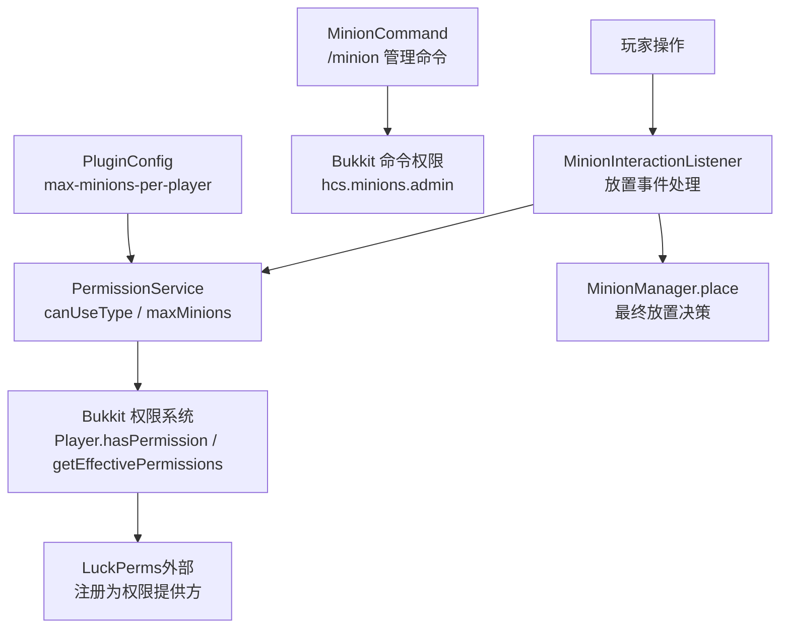
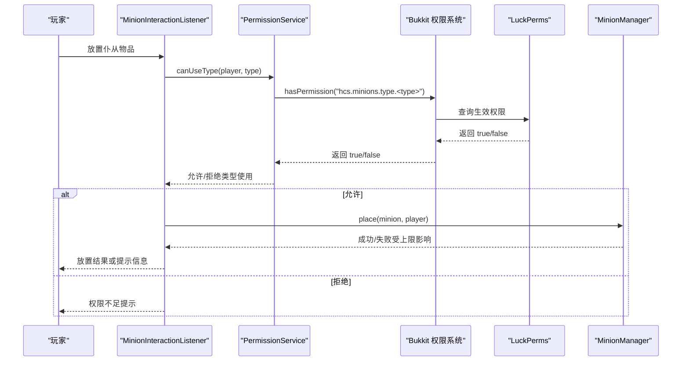
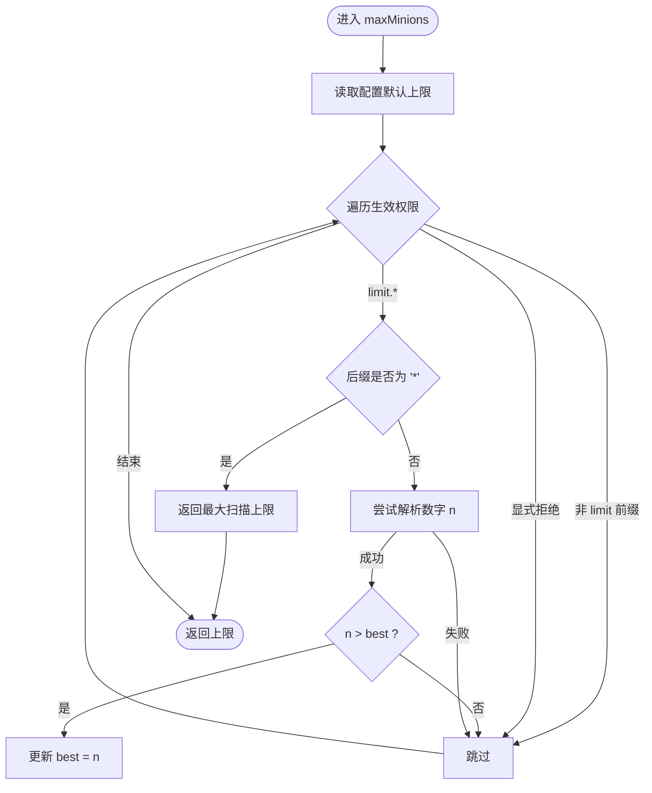
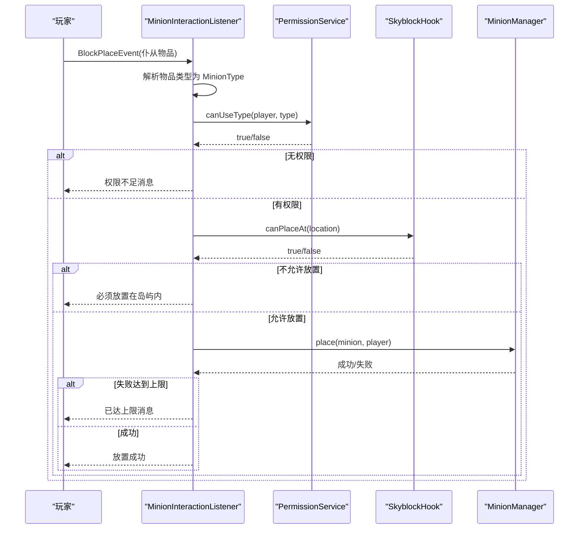
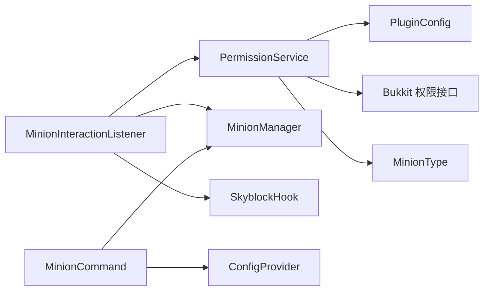

# 权限系统

<cite>
**本文引用的文件**
- [PermissionService.java](file://src/main/java/com/hcs/minions/service/PermissionService.java)
- [MinionInteractionListener.java](file://src/main/java/com/hcs/minions/listener/MinionInteractionListener.java)
- [MinionCommand.java](file://src/main/java/com/hcs/minions/command/MinionCommand.java)
- [PluginConfig.java](file://src/main/java/com/hcs/minions/config/PluginConfig.java)
- [config.yml](file://src/main/resources/config.yml)
- [Messages.java](file://src/main/java/com/hcs/minions/util/Messages.java)
- [MinionType.java](file://src/main/java/com/hcs/minions/model/MinionType.java)
</cite>

## 目录
1. [简介](#简介)
2. [项目结构](#项目结构)
3. [核心组件](#核心组件)
4. [架构总览](#架构总览)
5. [详细组件分析](#详细组件分析)
6. [依赖关系分析](#依赖关系分析)
7. [性能考量](#性能考量)
8. [故障排除指南](#故障排除指南)
9. [结论](#结论)
10. [附录：配置与最佳实践](#附录配置与最佳实践)

## 简介
本章节概述 SkyMinions 的权限管理机制。该插件通过 Bukkit 权限系统与 LuckPerms 无缝集成，无需硬依赖即可使用 LP 的组与权限体系。权限节点分为三类：管理权限、类型使用权限、数量限制权限；并通过通配符支持灵活扩展。权限检查覆盖管理员判断、类型验证、数量上限计算等关键环节，确保在放置仆从时进行安全且高性能的校验。

## 项目结构
与权限系统直接相关的代码主要分布在服务层、监听器、命令与配置模块中：
- 服务层：权限服务负责统一权限判定与上限计算
- 监听器：在放置事件中进行权限与上限检查
- 命令：管理命令受管理员权限保护
- 配置：默认上限与全局参数由配置文件提供
- 消息：错误提示中包含权限相关引导信息
- 模型：类型键用于构建类型权限节点

图表来源
- [MinionInteractionListener.java:54-94](file://src/main/java/com/hcs/minions/listener/MinionInteractionListener.java#L54-L94)
- [PermissionService.java:33-73](file://src/main/java/com/hcs/minions/service/PermissionService.java#L33-L73)
- [MinionCommand.java:47-68](file://src/main/java/com/hcs/minions/command/MinionCommand.java#L47-L68)
- [PluginConfig.java:22-45](file://src/main/java/com/hcs/minions/config/PluginConfig.java#L22-L45)

章节来源
- [MinionInteractionListener.java:54-94](file://src/main/java/com/hcs/minions/listener/MinionInteractionListener.java#L54-L94)
- [PermissionService.java:33-73](file://src/main/java/com/hcs/minions/service/PermissionService.java#L33-L73)
- [MinionCommand.java:47-68](file://src/main/java/com/hcs/minions/command/MinionCommand.java#L47-L68)
- [PluginConfig.java:22-45](file://src/main/java/com/hcs/minions/config/PluginConfig.java#L22-L45)

## 核心组件
- 权限服务：封装管理员判断、类型使用权限验证、数量上限计算，并兼容 LuckPerms 的生效权限集合
- 放置监听器：在放置事件中执行权限与位置校验，并在达到上限时阻止放置
- 管理命令：受管理员权限保护，用于发放仆从、升级、皮肤、重载等
- 配置：提供默认上限与全局调度参数，作为权限未授予时的回退值
- 消息：向玩家反馈权限不足或已达上限等信息，包含权限提升指引

章节来源
- [PermissionService.java:8-73](file://src/main/java/com/hcs/minions/service/PermissionService.java#L8-L73)
- [MinionInteractionListener.java:31-94](file://src/main/java/com/hcs/minions/listener/MinionInteractionListener.java#L31-L94)
- [MinionCommand.java:22-68](file://src/main/java/com/hcs/minions/command/MinionCommand.java#L22-L68)
- [PluginConfig.java:8-45](file://src/main/java/com/hcs/minions/config/PluginConfig.java#L8-L45)
- [Messages.java:77-81](file://src/main/java/com/hcs/minions/util/Messages.java#L77-L81)

## 架构总览
SkyMinions 的权限架构基于 Bukkit 权限抽象，LuckPerms 作为权限提供方将自身注册到 Bukkit 权限系统中。插件不直接调用 LP API，而是通过 Player.hasPermission 和 getEffectivePermissions 获取最终生效权限，从而获得 LP 的继承、作用域、条件等能力。

图表来源
- [MinionInteractionListener.java:54-94](file://src/main/java/com/hcs/minions/listener/MinionInteractionListener.java#L54-L94)
- [PermissionService.java:37-39](file://src/main/java/com/hcs/minions/service/PermissionService.java#L37-L39)

## 详细组件分析

### 权限服务 PermissionService
- 管理员权限判断：检查是否拥有 hcs.minions.admin
- 类型使用权限：检查是否拥有 hcs.minions.type.<type>，其中 <type> 来自 MinionType.key()
- 数量上限计算：遍历玩家的生效权限集合，解析所有 hcs.minions.limit.<n>，取最大值；若存在 hcs.minions.limit.* 通配，则返回固定上限常量；否则回退到配置中的默认上限

图表来源
- [PermissionService.java:49-73](file://src/main/java/com/hcs/minions/service/PermissionService.java#L49-L73)

章节来源
- [PermissionService.java:8-73](file://src/main/java/com/hcs/minions/service/PermissionService.java#L8-L73)
- [MinionType.java:13-20](file://src/main/java/com/hcs/minions/model/MinionType.java#L13-L20)

### 放置监听器 MinionInteractionListener
- 拦截放置事件，识别仆从物品并提取类型
- 调用权限服务进行类型权限校验
- 校验放置位置（空岛钩子）
- 构造 Minion 对象并调用管理器进行放置
- 若管理器返回失败（通常因达到上限），向玩家发送“已达上限”的消息

图表来源
- [MinionInteractionListener.java:54-94](file://src/main/java/com/hcs/minions/listener/MinionInteractionListener.java#L54-L94)

章节来源
- [MinionInteractionListener.java:31-94](file://src/main/java/com/hcs/minions/listener/MinionInteractionListener.java#L31-L94)

### 管理命令 MinionCommand
- 命令名称：/minion
- 权限要求：hcs.minions.admin
- 功能：发放仆从、发放升级模块、查看皮肤、资源累计、重载配置、清理残留、统计在线仆从数

章节来源
- [MinionCommand.java:22-68](file://src/main/java/com/hcs/minions/command/MinionCommand.java#L22-L68)

### 配置 PluginConfig 与 config.yml
- 全局默认上限：max-minions-per-player 作为权限未授予时的回退值
- 其他配置项：数据库、经济、离线收益、渲染、调度周期、每种类型的独立配置等

章节来源
- [PluginConfig.java:8-45](file://src/main/java/com/hcs/minions/config/PluginConfig.java#L8-L45)
- [config.yml:1-153](file://src/main/resources/config.yml#L1-L153)

### 消息 Messages
- 权限不足、已达上限等消息包含权限提升指引，便于玩家理解如何增加上限

章节来源
- [Messages.java:77-81](file://src/main/java/com/hcs/minions/util/Messages.java#L77-L81)

## 依赖关系分析
- PermissionService 依赖 PluginConfig 提供默认上限，依赖 Bukkit 权限接口与 MinionType 构建类型节点
- MinionInteractionListener 依赖 PermissionService、MinionManager、SkyblockHook、PluginConfig
- MinionCommand 依赖 ConfigProvider、MinionItemService、MinionManager、UpgradeService、CollectionService、JavaPlugin
- 所有权限检查最终委托给 Bukkit 权限系统，LuckPerms 作为外部提供者被透明接入

图表来源
- [PermissionService.java:3-7](file://src/main/java/com/hcs/minions/service/PermissionService.java#L3-L7)
- [MinionInteractionListener.java:37-52](file://src/main/java/com/hcs/minions/listener/MinionInteractionListener.java#L37-L52)
- [MinionCommand.java:30-48](file://src/main/java/com/hcs/minions/command/MinionCommand.java#L30-L48)

章节来源
- [PermissionService.java:3-7](file://src/main/java/com/hcs/minions/service/PermissionService.java#L3-L7)
- [MinionInteractionListener.java:37-52](file://src/main/java/com/hcs/minions/listener/MinionInteractionListener.java#L37-L52)
- [MinionCommand.java:30-48](file://src/main/java/com/hcs/minions/command/MinionCommand.java#L30-L48)

## 性能考量
- 旧实现逐 n 调用 hasPermission（最多 512 次），新实现改为单次遍历 getEffectivePermissions，显著降低权限检查开销
- 通配符 hcs.minions.limit.* 立即返回固定上限，避免进一步解析
- 显式拒绝的权限不参与计算，减少无效分支
- 配置默认上限作为回退值，避免额外查询

章节来源
- [PermissionService.java:41-73](file://src/main/java/com/hcs/minions/service/PermissionService.java#L41-L73)

## 故障排除指南
- 权限不足：确认玩家在 LuckPerms 中已授予 hcs.minions.type.<type> 或 hcs.minions.admin
- 已达上限：检查是否授予了更高的 hcs.minions.limit.<n> 或 hcs.minions.limit.*；同时确认配置中的默认上限
- 放置失败：确认空岛钩子允许在该位置放置；检查权限与上限
- 文案提示：messages.yml 中的 limit-reached 会提示如何提升上限，可按提示调整 LP 权限

章节来源
- [MinionInteractionListener.java:65-91](file://src/main/java/com/hcs/minions/listener/MinionInteractionListener.java#L65-L91)
- [Messages.java:77-81](file://src/main/java/com/hcs/minions/util/Messages.java#L77-L81)

## 结论
SkyMinions 的权限系统以 Bukkit 权限为核心，借助 LuckPerms 的成熟权限管理能力，实现了简洁、高效且可扩展的权限控制。通过管理员权限、类型权限与数量限制权限的组合，配合通配符支持与性能优化，能够满足不同服务器规模下的精细化权限需求。

## 附录：配置与最佳实践
- 权限节点说明
  - hcs.minions.admin：管理权限，用于访问 /minion 管理命令
  - hcs.minions.type.<type>：类型使用权限，<type> 对应 MinionType.key()，如 miner、farmer、lumberjack、fisher、slayer、rancher、cobble
  - hcs.minions.limit.<n>：数量限制权限，授予后可将上限提升至 n；多个 limit 权限取最大值
  - hcs.minions.limit.*：通配符，表示极大上限（固定常量），适用于高级用户或管理员
- 配置示例
  - 在 LuckPerms 中为组或玩家授予上述权限节点
  - 在 config.yml 中设置 max-minions-per-player 作为默认上限
- 最佳实践
  - 普通玩家授予基础类型权限与较低 limit
  - VIP 玩家授予更多类型权限与更高 limit
  - 管理员授予 admin 与 limit.* 以获得最大灵活性
  - 使用 messages.yml 自定义提示文案，提升用户体验

章节来源
- [MinionType.java:13-20](file://src/main/java/com/hcs/minions/model/MinionType.java#L13-L20)
- [config.yml:7-7](file://src/main/resources/config.yml#L7-L7)
- [PermissionService.java:12-17](file://src/main/java/com/hcs/minions/service/PermissionService.java#L12-L17)