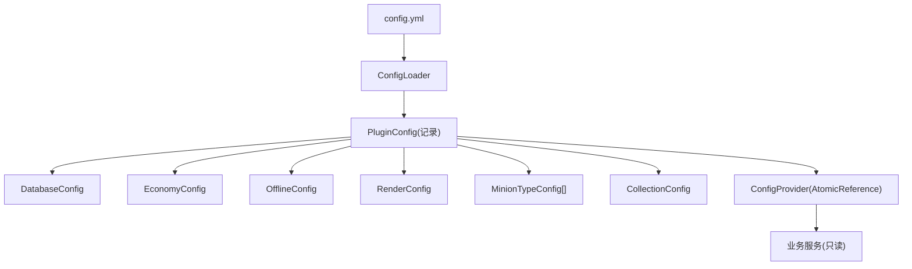
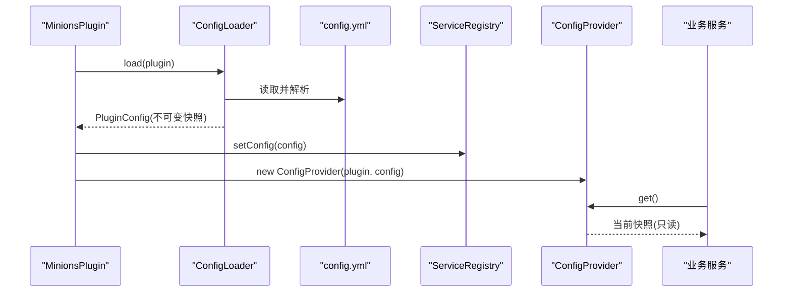
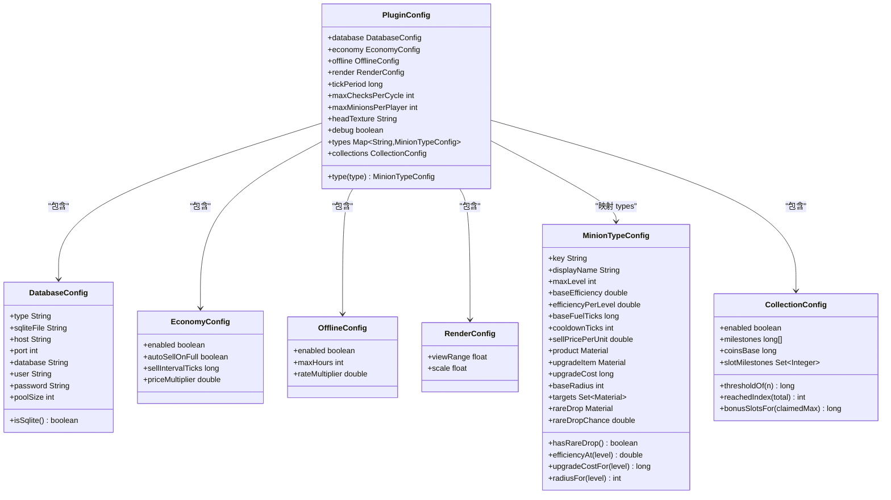
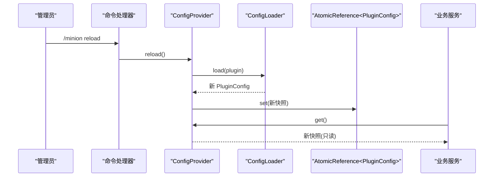
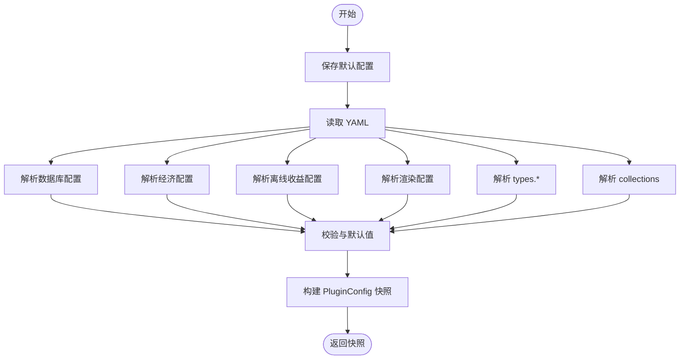
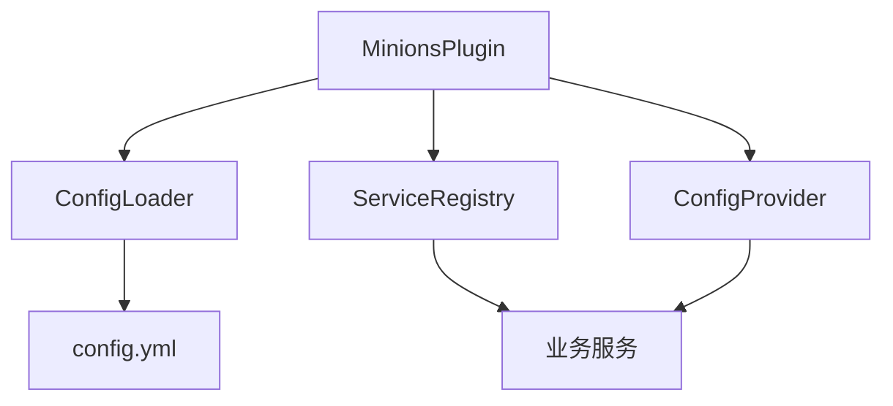

# 配置管理

<cite>
**本文引用的文件**
- [PluginConfig.java](file://src/main/java/com/hcs/minions/config/PluginConfig.java)
- [ConfigLoader.java](file://src/main/java/com/hcs/minions/config/ConfigLoader.java)
- [ConfigProvider.java](file://src/main/java/com/hcs/minions/config/ConfigProvider.java)
- [DatabaseConfig.java](file://src/main/java/com/hcs/minions/config/DatabaseConfig.java)
- [EconomyConfig.java](file://src/main/java/com/hcs/minions/config/EconomyConfig.java)
- [OfflineConfig.java](file://src/main/java/com/hcs/minions/config/OfflineConfig.java)
- [RenderConfig.java](file://src/main/java/com/hcs/minions/config/RenderConfig.java)
- [MinionTypeConfig.java](file://src/main/java/com/hcs/minions/config/MinionTypeConfig.java)
- [CollectionConfig.java](file://src/main/java/com/hcs/minions/config/CollectionConfig.java)
- [config.yml](file://src/main/resources/config.yml)
- [MinionsPlugin.java](file://src/main/java/com/hcs/minions/MinionsPlugin.java)
- [ServiceRegistry.java](file://src/main/java/com/hcs/minions/core/ServiceRegistry.java)
</cite>

## 目录
1. [简介](#简介)
2. [项目结构](#项目结构)
3. [核心组件](#核心组件)
4. [架构总览](#架构总览)
5. [详细组件分析](#详细组件分析)
6. [依赖关系分析](#依赖关系分析)
7. [性能考量](#性能考量)
8. [故障排除指南](#故障排除指南)
9. [结论](#结论)
10. [附录：配置项参考](#附录配置项参考)

## 简介
本文件系统性介绍 SkyMinions 的配置系统架构与实现。该插件采用强类型 record 配置模型，通过 ConfigLoader 将 YAML 配置文件一次性反序列化为不可变的 PluginConfig 快照，并由 ConfigProvider 提供原子替换能力以支持运行时热重载。所有业务模块仅通过只读接口访问配置，确保线程安全与一致性。文档涵盖配置分类、验证机制、默认值处理、迁移策略、热重载流程、加载器实现细节以及完整的配置项参考和故障排除建议。

## 项目结构
SkyMinions 的配置系统围绕一组强类型 record 对象组织，对应 config.yml 中的不同配置段。根对象为 PluginConfig，包含数据库、经济、离线收益、渲染、调度参数、每玩家仆从上限、头纹理、调试开关、各仆从类型配置与 Collection 里程碑配置等。

图表来源
- [ConfigLoader.java:30-83](file://src/main/java/com/hcs/minions/config/ConfigLoader.java#L30-L83)
- [PluginConfig.java:22-45](file://src/main/java/com/hcs/minions/config/PluginConfig.java#L22-L45)
- [ConfigProvider.java:15-32](file://src/main/java/com/hcs/minions/config/ConfigProvider.java#L15-L32)

章节来源
- [config.yml:1-153](file://src/main/resources/config.yml#L1-L153)
- [PluginConfig.java:22-45](file://src/main/java/com/hcs/minions/config/PluginConfig.java#L22-L45)
- [ConfigLoader.java:30-83](file://src/main/java/com/hcs/minions/config/ConfigLoader.java#L30-L83)

## 核心组件
- 强类型记录（record）配置：DatabaseConfig、EconomyConfig、OfflineConfig、RenderConfig、MinionTypeConfig、CollectionConfig、PluginConfig。它们提供编译期类型安全与不可变语义，避免运行时类型错误。
- 配置加载器 ConfigLoader：唯一允许直接读取插件配置的入口，负责解析 YAML、校验与回退默认值、构建不可变快照。
- 配置提供者 ConfigProvider：持有当前生效的 PluginConfig 快照，支持原子替换以实现热重载。
- 主类 MinionsPlugin：在 onEnable 中完成配置加载与服务装配；命令层通过 ConfigProvider 触发 reload。
- 服务注册表 ServiceRegistry：集中注入并暴露各服务，使业务代码通过统一入口获取配置。

章节来源
- [ConfigLoader.java:16-83](file://src/main/java/com/hcs/minions/config/ConfigLoader.java#L16-L83)
- [ConfigProvider.java:7-32](file://src/main/java/com/hcs/minions/config/ConfigProvider.java#L7-L32)
- [MinionsPlugin.java:52-120](file://src/main/java/com/hcs/minions/MinionsPlugin.java#L52-L120)
- [ServiceRegistry.java:18-52](file://src/main/java/com/hcs/minions/core/ServiceRegistry.java#L18-L52)

## 架构总览
配置系统在启动时由 ConfigLoader 解析 config.yml，生成强类型的 PluginConfig 快照。该快照被注入到 ServiceRegistry，并通过 ConfigProvider 暴露给需要动态更新的组件（如售卖、收集、实体渲染等）。当管理员执行重载命令时，ConfigProvider.reload() 会重新调用 ConfigLoader.load() 生成新快照并以原子方式替换旧快照，从而在不重启服务器的情况下更新运行时参数。

图表来源
- [MinionsPlugin.java:57-60](file://src/main/java/com/hcs/minions/MinionsPlugin.java#L57-L60)
- [ConfigLoader.java:30-83](file://src/main/java/com/hcs/minions/config/ConfigLoader.java#L30-L83)
- [ConfigProvider.java:15-32](file://src/main/java/com/hcs/minions/config/ConfigProvider.java#L15-L32)

## 详细组件分析

### 强类型记录配置设计
- 设计理念：使用 Java record 定义配置对象，字段类型明确、构造即不可变，天然具备线程安全性。通过 Map.copyOf/Set.copyOf 等手段对集合进行不可变封装，防止外部修改。
- 类型安全：所有配置项在编译期确定类型，避免字符串路径拼写错误与运行时类型转换异常。
- 可组合性：PluginConfig 聚合多个子配置，便于分层管理与职责分离。

图表来源
- [PluginConfig.java:22-45](file://src/main/java/com/hcs/minions/config/PluginConfig.java#L22-L45)
- [DatabaseConfig.java:6-20](file://src/main/java/com/hcs/minions/config/DatabaseConfig.java#L6-L20)
- [EconomyConfig.java:7-12](file://src/main/java/com/hcs/minions/config/EconomyConfig.java#L7-L12)
- [OfflineConfig.java:9-13](file://src/main/java/com/hcs/minions/config/OfflineConfig.java#L9-L13)
- [RenderConfig.java:9-12](file://src/main/java/com/hcs/minions/config/RenderConfig.java#L9-L12)
- [MinionTypeConfig.java:21-63](file://src/main/java/com/hcs/minions/config/MinionTypeConfig.java#L21-L63)
- [CollectionConfig.java:17-63](file://src/main/java/com/hcs/minions/config/CollectionConfig.java#L17-L63)

章节来源
- [PluginConfig.java:22-45](file://src/main/java/com/hcs/minions/config/PluginConfig.java#L22-L45)
- [MinionTypeConfig.java:21-63](file://src/main/java/com/hcs/minions/config/MinionTypeConfig.java#L21-L63)
- [CollectionConfig.java:17-63](file://src/main/java/com/hcs/minions/config/CollectionConfig.java#L17-L63)

### 配置文件的结构与组织
config.yml 按功能域划分：
- 全局调度参数：tick-period、max-checks-per-cycle、max-minions-per-player、head-texture、debug
- 数据库：database.type、sqlite-file、host、port、database、user、password、pool-size
- 经济：economy.enabled、auto-sell-on-full、sell-interval-ticks、price-multiplier
- 离线收益：offline.enabled、max-hours、rate-multiplier
- Collection 里程碑：collections.enabled、milestones、coins-base、slot-milestones
- 仆从类型：types.*（miner/farmer/lumberjack/fisher/slayer/rancher/cobble），每个类型包含显示名、等级上限、效率、燃料、冷却、售价、产物、升级材料、工作半径、稀有掉落及概率、目标方块列表等

章节来源
- [config.yml:4-153](file://src/main/resources/config.yml#L4-L153)

### 配置验证机制
- 数据校验：
  - max-checks-per-cycle 必须小于 50，否则强制回落至 48 并告警。
  - rare-drop-chance 若 >0 但无有效 rare-drop，则关闭稀有掉落并告警。
  - 未知物料名或目标方块会被忽略并告警，同时回退到默认值。
- 默认值处理：
  - 缺失的配置项均提供合理默认值（例如数据库类型 sqlite、端口 3306、价格倍率 1.0、离线收益折扣 0.5 等）。
  - 未提供的里程碑阈值使用内置默认数组。
- 配置迁移：
  - 通过 saveDefaultConfig() 保证首次运行生成默认配置；后续版本可通过保留默认键与兼容逻辑实现平滑迁移。
  - 对于可选字段（如 rare-drop），空值视为关闭，避免破坏性变更。

章节来源
- [ConfigLoader.java:63-67](file://src/main/java/com/hcs/minions/config/ConfigLoader.java#L63-L67)
- [ConfigLoader.java:116-132](file://src/main/java/com/hcs/minions/config/ConfigLoader.java#L116-L132)
- [ConfigLoader.java:158-180](file://src/main/java/com/hcs/minions/config/ConfigLoader.java#L158-L180)
- [PluginConfig.java:36-41](file://src/main/java/com/hcs/minions/config/PluginConfig.java#L36-L41)

### 配置热重载机制
- 容器：ConfigProvider 使用 AtomicReference 持有当前生效的 PluginConfig 快照。
- 重载流程：
  - 调用 reload() 时重新执行 ConfigLoader.load() 生成新快照。
  - 通过 ref.set(next) 原子替换，所有通过 get() 读取的服务立即看到最新配置。
  - 无需重启服务器即可更新效率、价格、周期等运行时参数。
- 使用场景：售卖间隔、价格倍率、调度周期、渲染范围等可在运行时调整。

图表来源
- [ConfigProvider.java:23-32](file://src/main/java/com/hcs/minions/config/ConfigProvider.java#L23-L32)
- [ConfigLoader.java:30-83](file://src/main/java/com/hcs/minions/config/ConfigLoader.java#L30-L83)

章节来源
- [ConfigProvider.java:7-32](file://src/main/java/com/hcs/minions/config/ConfigProvider.java#L7-L32)
- [ConfigLoader.java:30-83](file://src/main/java/com/hcs/minions/config/ConfigLoader.java#L30-L83)

### 配置加载器实现原理
- 解析流程：
  - 调用 plugin.saveDefaultConfig() 确保存在默认配置。
  - 读取 FileConfiguration，逐项解析为强类型对象。
  - 对集合与枚举进行安全转换，非法值记录警告并回退。
- 错误处理：
  - 对未知物料名、非法目标方块、超出硬上限的参数进行告警与回退。
  - 对可选字段（如稀有掉落）采用 null 安全处理。
- 性能优化：
  - 一次性加载并构建不可变快照，避免重复解析。
  - 使用 LinkedHashMap 保持 types 顺序，便于调试与展示。
  - 对集合进行不可变封装，减少拷贝与同步开销。

图表来源
- [ConfigLoader.java:30-83](file://src/main/java/com/hcs/minions/config/ConfigLoader.java#L30-L83)
- [ConfigLoader.java:85-152](file://src/main/java/com/hcs/minions/config/ConfigLoader.java#L85-L152)
- [ConfigLoader.java:154-181](file://src/main/java/com/hcs/minions/config/ConfigLoader.java#L154-L181)

章节来源
- [ConfigLoader.java:30-83](file://src/main/java/com/hcs/minions/config/ConfigLoader.java#L30-L83)
- [ConfigLoader.java:85-152](file://src/main/java/com/hcs/minions/config/ConfigLoader.java#L85-L152)
- [ConfigLoader.java:154-181](file://src/main/java/com/hcs/minions/config/ConfigLoader.java#L154-L181)

## 依赖关系分析
- 主类 MinionsPlugin 在 onEnable 中完成配置加载与服务装配，并将配置注入 ServiceRegistry。
- 业务服务通过 ServiceRegistry 或 ConfigProvider 获取配置，避免直接访问插件配置。
- ConfigLoader 依赖 Bukkit 的 FileConfiguration 与 Material 枚举进行解析与校验。
- ConfigProvider 依赖 AtomicReference 实现线程安全的快照替换。

图表来源
- [MinionsPlugin.java:52-120](file://src/main/java/com/hcs/minions/MinionsPlugin.java#L52-L120)
- [ServiceRegistry.java:18-52](file://src/main/java/com/hcs/minions/core/ServiceRegistry.java#L18-L52)
- [ConfigProvider.java:15-32](file://src/main/java/com/hcs/minions/config/ConfigProvider.java#L15-L32)

章节来源
- [MinionsPlugin.java:52-120](file://src/main/java/com/hcs/minions/MinionsPlugin.java#L52-L120)
- [ServiceRegistry.java:18-52](file://src/main/java/com/hcs/minions/core/ServiceRegistry.java#L18-L52)

## 性能考量
- 一次性加载：启动时解析 YAML 并构建不可变快照，避免运行时重复 IO 与解析。
- 原子替换：热重载通过 AtomicReference 原子切换快照，读多写少场景下几乎零锁开销。
- 集合不可变：Map/Set 使用不可变副本，避免并发修改与额外同步。
- 硬上限保护：max-checks-per-cycle 限制单次检查数量，防止极端配置导致性能退化。
- 连接池大小：数据库 pool-size 默认较小，避免虚拟线程被固定线程池阻塞。

[本节为通用性能指导，不直接分析具体文件]

## 故障排除指南
- 配置项缺失或类型错误：
  - 现象：日志中出现“未知物料名”“未知目标方块”等警告。
  - 处理：检查 config.yml 中对应字段拼写与取值范围，必要时恢复默认值。
- 性能问题：
  - 现象：服务器卡顿或 tick 延迟。
  - 处理：降低 max-checks-per-cycle，调整 sell-interval-ticks，检查数据库连接池大小。
- 稀有掉落无效：
  - 现象：配置了 rare-drop-chance 但无掉落。
  - 处理：确保 rare-drop 为有效材质名称，否则将被忽略并关闭稀有掉落。
- 热重载后未生效：
  - 现象：修改配置后未立即生效。
  - 处理：确认通过命令触发 reload，并检查日志是否输出新快照信息。

章节来源
- [ConfigLoader.java:116-132](file://src/main/java/com/hcs/minions/config/ConfigLoader.java#L116-L132)
- [ConfigLoader.java:158-180](file://src/main/java/com/hcs/minions/config/ConfigLoader.java#L158-L180)
- [ConfigProvider.java:27-32](file://src/main/java/com/hcs/minions/config/ConfigProvider.java#L27-L32)

## 结论
SkyMinions 的配置系统通过强类型 record、不可变快照与原子替换实现了高内聚、低耦合、线程安全的配置管理。ConfigLoader 负责解析与校验，ConfigProvider 提供热重载能力，业务服务仅消费只读配置，整体架构清晰且易于维护。配合完善的默认值与错误回退机制，管理员可以安全地调整运行时参数而无需重启服务器。

[本节为总结性内容，不直接分析具体文件]

## 附录：配置项参考
以下为 config.yml 中主要配置项的作用、取值范围、默认值与示例说明（基于实际配置与加载逻辑整理）：

- 全局调度参数
  - tick-period：全局调度周期（tick），默认 20。
  - max-checks-per-cycle：单次策略执行方块检查硬上限，必须 < 50，默认 48。
  - max-minions-per-player：每玩家仆从槽位上限，默认 10。
  - head-texture：固定仆从头颅贴图 base64 纹理，留空时使用内置默认。
  - debug：调试日志开关，true 时打印工作/搜索详情。

- 数据库配置
  - database.type：sqlite 或 mysql。
  - database.sqlite-file：SQLite 文件名，默认 minions.db。
  - database.host：MySQL 主机地址，默认 127.0.0.1。
  - database.port：MySQL 端口，默认 3306。
  - database.database：数据库名，默认 minions。
  - database.user：用户名，默认 root。
  - database.password：密码，默认空。
  - database.pool-size：HikariCP 连接池大小，默认 4。

- 经济配置
  - economy.enabled：启用经济/售卖，默认 true。
  - economy.auto-sell-on-full：仓库满自动售卖，默认 true。
  - economy.sell-interval-ticks：自动售卖轮询间隔，默认 400。
  - economy.price-multiplier：全局价格倍率，默认 1.0。

- 离线收益配置
  - offline.enabled：启用离线收益，默认 true。
  - offline.max-hours：最大计算时长上限，默认 48。
  - offline.rate-multiplier：离线效率折扣，默认 0.5。

- Collection 里程碑
  - collections.enabled：启用里程碑奖励，默认 true。
  - collections.milestones：里程碑阈值数组，默认 [50, 100, 250, 500, 1000, 2500, 5000, 10000]。
  - collections.coins-base：金币奖励基数，默认 100。
  - collections.slot-milestones：命中这些序号的里程碑额外奖励仆从槽位，默认 [3, 5, 7]。

- 仆从类型（types.*）
  - display-name：显示名称。
  - max-level：最大等级，默认 11。
  - base-efficiency：基础效率，默认 1.0。
  - efficiency-per-level：每级效率增量，默认 0.1。
  - base-fuel-ticks：基础燃料时间（tick），默认 72000。
  - cooldown-ticks：冷却时间（tick），默认 20。
  - sell-price-per-unit：单位售价，默认 1.0。
  - product：代表性产物（离线收益用），默认 COBBLESTONE。
  - upgrade-item：升级消耗材料，默认同 product。
  - upgrade-cost：基础消耗，默认 64。
  - base-radius：固定工作半径，默认 2（5x5 区域）。
  - targets：目标方块列表，为空表示不受限制。
  - rare-drop：专属稀有掉落，可为空。
  - rare-drop-chance：稀有掉落概率（0~1），默认 0.0。

章节来源
- [config.yml:4-153](file://src/main/resources/config.yml#L4-L153)
- [ConfigLoader.java:30-83](file://src/main/java/com/hcs/minions/config/ConfigLoader.java#L30-L83)
- [MinionTypeConfig.java:21-63](file://src/main/java/com/hcs/minions/config/MinionTypeConfig.java#L21-L63)
- [CollectionConfig.java:17-63](file://src/main/java/com/hcs/minions/config/CollectionConfig.java#L17-L63)