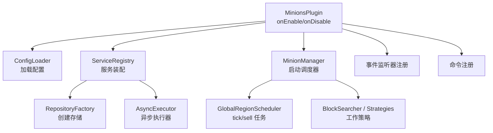
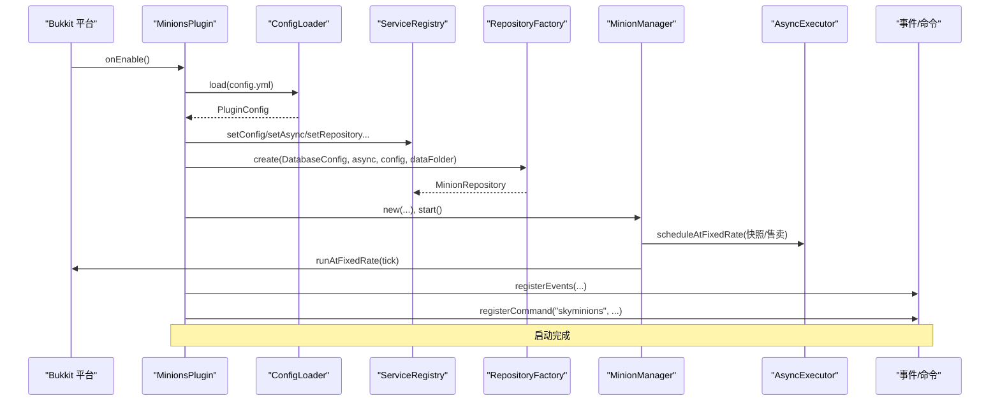
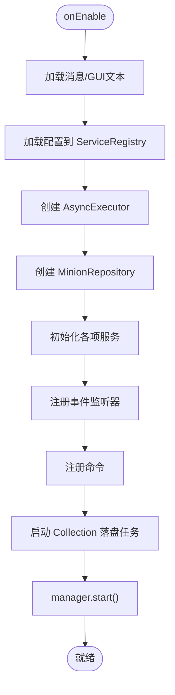
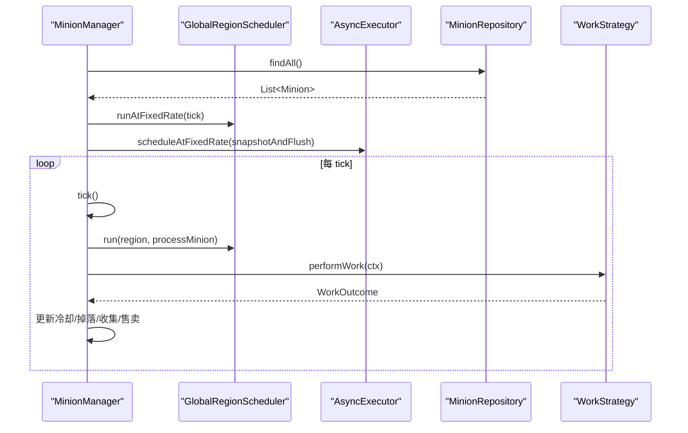
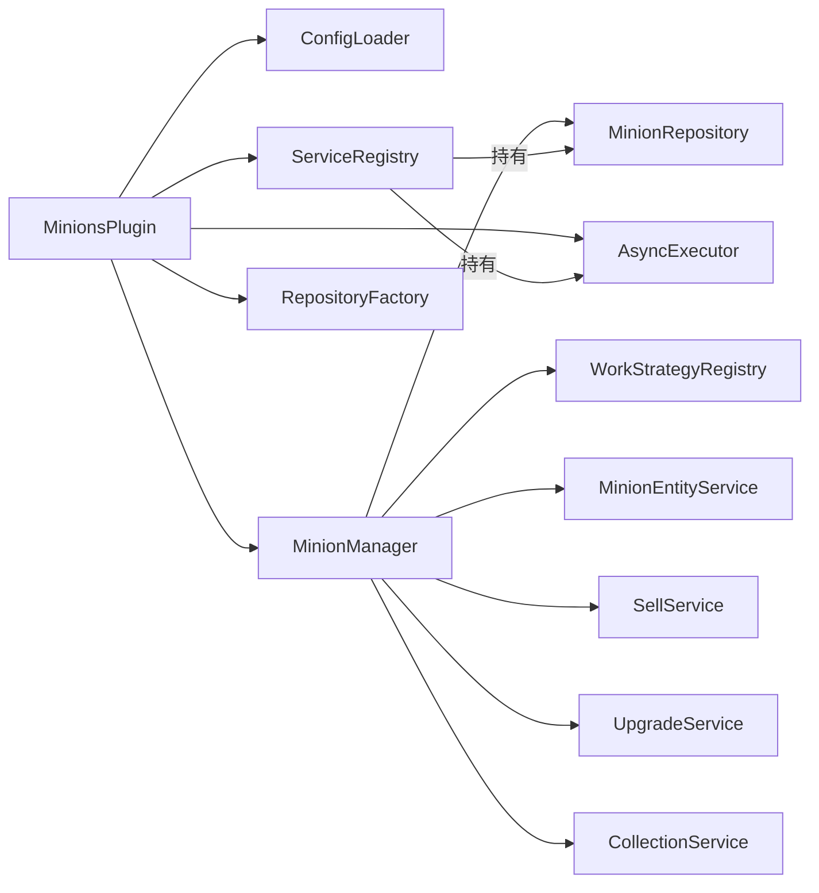
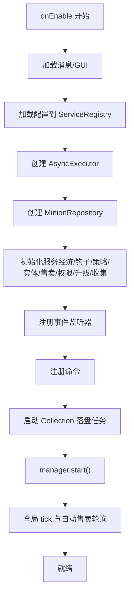
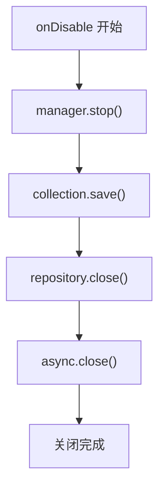

# 插件生命周期管理

<cite>
**本文引用的文件**
- [MinionsPlugin.java](file://src/main/java/com/hcs/minions/MinionsPlugin.java)
- [ServiceRegistry.java](file://src/main/java/com/hcs/minions/core/ServiceRegistry.java)
- [ConfigLoader.java](file://src/main/java/com/hcs/minions/config/ConfigLoader.java)
- [MinionManager.java](file://src/main/java/com/hcs/minions/service/MinionManager.java)
- [AsyncExecutor.java](file://src/main/java/com/hcs/minions/util/AsyncExecutor.java)
- [RepositoryFactory.java](file://src/main/java/com/hcs/minions/repository/RepositoryFactory.java)
- [MinionInteractionListener.java](file://src/main/java/com/hcs/minions/listener/MinionInteractionListener.java)
- [PlayerJoinListener.java](file://src/main/java/com/hcs/minions/listener/PlayerJoinListener.java)
- [paper-plugin.yml](file://src/main/resources/paper-plugin.yml)
- [config.yml](file://src/main/resources/config.yml)
- [pom.xml](file://pom.xml)
</cite>

## 目录
1. [简介](#简介)
2. [项目结构](#项目结构)
3. [核心组件](#核心组件)
4. [架构总览](#架构总览)
5. [详细组件分析](#详细组件分析)
6. [依赖关系分析](#依赖关系分析)
7. [性能考量](#性能考量)
8. [故障排查指南](#故障排查指南)
9. [结论](#结论)
10. [附录](#附录)

## 简介
本文聚焦于 SkyMinions 插件的生命周期管理，围绕主类 MinionsPlugin 的 onEnable/onDisable、配置加载、服务注册、事件监听器绑定、调度器启动与关闭时的资源清理进行系统化说明。同时给出与其他 Minecraft 服务器插件（Vault、SuperiorSkyblock2）的集成方式、依赖检查与兼容性处理策略，并提供最佳实践与常见问题解决方案。

## 项目结构
- 入口与装配：MinionsPlugin 作为 JavaPlugin 实现，仅负责生命周期管理与服务装配；业务逻辑下沉至 Service 层。
- 配置系统：ConfigLoader 唯一允许访问 getConfig()，将 YAML 反序列化为强类型不可变配置对象，供全插件只读共享。
- 服务注册表：ServiceRegistry 作为组合根，集中持有所有服务实例，避免全局散乱单例。
- 调度与异步：MinionManager 使用 Paper GlobalRegionScheduler 驱动全局 tick 循环；AsyncExecutor 提供基于虚拟线程的异步执行与定时任务。
- 存储抽象：RepositoryFactory 根据配置选择 SQLite/MySQL 并包装为带缓存的 MinionRepository。
- 事件与交互：监听器统一在 onEnable 中注册，包括放置/交互、玩家上线离线收益等。
- 外部依赖：通过 paper-plugin.yml 声明可选软依赖 Vault、SuperiorSkyblock2；运行时库由 Paper 自动下载挂载。

图表来源
- [MinionsPlugin.java:52-120](file://src/main/java/com/hcs/minions/MinionsPlugin.java#L52-L120)
- [ConfigLoader.java:30-83](file://src/main/java/com/hcs/minions/config/ConfigLoader.java#L30-L83)
- [ServiceRegistry.java:21-149](file://src/main/java/com/hcs/minions/core/ServiceRegistry.java#L21-L149)
- [MinionManager.java:92-115](file://src/main/java/com/hcs/minions/service/MinionManager.java#L92-L115)
- [RepositoryFactory.java:20-28](file://src/main/java/com/hcs/minions/repository/RepositoryFactory.java#L20-L28)
- [AsyncExecutor.java:24-32](file://src/main/java/com/hcs/minions/util/AsyncExecutor.java#L24-L32)

章节来源
- [MinionsPlugin.java:52-120](file://src/main/java/com/hcs/minions/MinionsPlugin.java#L52-L120)
- [paper-plugin.yml:1-22](file://src/main/resources/paper-plugin.yml#L1-L22)
- [config.yml:1-153](file://src/main/resources/config.yml#L1-L153)

## 核心组件
- MinionsPlugin：生命周期入口，按依赖顺序装配服务、注册事件与命令、启动调度器。
- ServiceRegistry：组合根，集中持有配置、存储、经济、钩子、策略、实体、售卖、权限、升级、收集、异步执行器等。
- ConfigLoader：YAML -> 强类型配置的转换器，包含校验与回退逻辑。
- MinionManager：全局单调度器，负责仆从加载、tick 遍历、区域线程委派工作、自动售卖、快照落库、停止与清理。
- AsyncExecutor：基于 Java 21 虚拟线程的异步执行器与单线程调度器，封装异常日志与关闭。
- RepositoryFactory：按配置选择 SQLite/MySQL 并返回带缓存的仓库实现。
- 监听器：MinionInteractionListener（放置/交互）、PlayerJoinListener（上线离线结算）。

章节来源
- [ServiceRegistry.java:21-149](file://src/main/java/com/hcs/minions/core/ServiceRegistry.java#L21-L149)
- [ConfigLoader.java:30-83](file://src/main/java/com/hcs/minions/config/ConfigLoader.java#L30-L83)
- [MinionManager.java:92-180](file://src/main/java/com/hcs/minions/service/MinionManager.java#L92-L180)
- [AsyncExecutor.java:19-80](file://src/main/java/com/hcs/minions/util/AsyncExecutor.java#L19-L80)
- [RepositoryFactory.java:20-28](file://src/main/java/com/hcs/minions/repository/RepositoryFactory.java#L20-L28)
- [MinionInteractionListener.java:54-142](file://src/main/java/com/hcs/minions/listener/MinionInteractionListener.java#L54-L142)
- [PlayerJoinListener.java:26-33](file://src/main/java/com/hcs/minions/listener/PlayerJoinListener.java#L26-L33)

## 架构总览
插件采用“入口装配 + 服务分层 + 调度分离”的架构：
- 入口装配：onEnable 内完成配置加载、服务构建与注册、事件与命令绑定、调度器启动。
- 服务分层：各 Service 职责单一，通过 ServiceRegistry 注入依赖，避免耦合。
- 调度分离：全局 tick 在 GlobalRegionScheduler 上运行，但触碰世界状态的操作均委派到具体 Region 线程，保证 Folia 兼容。
- 异步 IO：数据库写入、Vault 加款、离线结算写库等 IO 操作通过 AsyncExecutor 的虚拟线程池执行，降低主线程压力。

图表来源
- [MinionsPlugin.java:52-120](file://src/main/java/com/hcs/minions/MinionsPlugin.java#L52-L120)
- [ConfigLoader.java:30-83](file://src/main/java/com/hcs/minions/config/ConfigLoader.java#L30-L83)
- [RepositoryFactory.java:20-28](file://src/main/java/com/hcs/minions/repository/RepositoryFactory.java#L20-L28)
- [MinionManager.java:92-115](file://src/main/java/com/hcs/minions/service/MinionManager.java#L92-L115)
- [AsyncExecutor.java:58-67](file://src/main/java/com/hcs/minions/util/AsyncExecutor.java#L58-L67)

## 详细组件分析

### MinionsPlugin：生命周期与装配
- onEnable 流程
  - 加载消息与 GUI 文本资源。
  - 通过 ConfigLoader 加载并固化配置，设置到 ServiceRegistry。
  - 创建 AsyncExecutor 并注册到 ServiceRegistry。
  - 通过 RepositoryFactory 创建数据库仓库并注册。
  - 初始化 EconomyService、SkyblockHook、工作策略集合、BlockSearcher、实体服务、售卖服务、权限服务、升级服务、收集服务。
  - 组装 MinionManager 并注册到 ServiceRegistry。
  - 注册三个事件监听器与一个命令。
  - 启动 Collection 定期落盘任务。
  - 调用 manager.start() 启动全局调度与自动售卖轮询。
- onDisable 流程
  - 停止管理器（取消 tick 与售卖任务）。
  - 保存 Collection 数据。
  - 关闭数据库连接。
  - 关闭异步执行器（释放虚拟线程池与调度器）。

图表来源
- [MinionsPlugin.java:52-120](file://src/main/java/com/hcs/minions/MinionsPlugin.java#L52-L120)

章节来源
- [MinionsPlugin.java:52-120](file://src/main/java/com/hcs/minions/MinionsPlugin.java#L52-L120)
- [MinionsPlugin.java:133-140](file://src/main/java/com/hcs/minions/MinionsPlugin.java#L133-L140)

### 配置加载与校验
- ConfigLoader 是唯一接触 getConfig() 的地方，将 YAML 转换为强类型记录，缺失或非法值时回退默认并告警。
- 关键校验点
  - max-checks-per-cycle 超过硬上限会强制回落并警告。
  - 未知 Material 名称会回退默认并记录警告。
  - 稀有掉落未配置有效材质时关闭该特性。
- 输出：不可变的 PluginConfig，供全插件只读共享，避免运行时修改导致不一致。

章节来源
- [ConfigLoader.java:30-83](file://src/main/java/com/hcs/minions/config/ConfigLoader.java#L30-L83)
- [ConfigLoader.java:86-104](file://src/main/java/com/hcs/minions/config/ConfigLoader.java#L86-L104)
- [ConfigLoader.java:106-152](file://src/main/java/com/hcs/minions/config/ConfigLoader.java#L106-L152)
- [ConfigLoader.java:158-181](file://src/main/java/com/hcs/minions/config/ConfigLoader.java#L158-L181)

### 服务注册与依赖注入
- ServiceRegistry 作为组合根，集中持有所有服务实例，遵循“构造时注入、运行时只读”的原则。
- 依赖顺序
  - 先配置与异步执行器。
  - 再存储仓库。
  - 然后业务服务（经济、钩子、策略、搜索、实体、售卖、权限、升级、收集）。
  - 最后管理器与离线奖励服务。
- 好处：避免循环依赖，便于测试替换与扩展。

章节来源
- [ServiceRegistry.java:21-149](file://src/main/java/com/hcs/minions/core/ServiceRegistry.java#L21-L149)
- [MinionsPlugin.java:61-108](file://src/main/java/com/hcs/minions/MinionsPlugin.java#L61-L108)

### 调度器与任务管理
- MinionManager.start()
  - 异步加载全部仆从数据，填充内存索引。
  - 使用 GlobalRegionScheduler 启动全局 tick 任务（周期来自配置）。
  - 使用 AsyncExecutor 启动快照落库任务（每 5 秒）。
  - 使用 GlobalRegionScheduler 启动自动售卖轮询（间隔可配）。
- 工作执行
  - tick 遍历内存中的仆从，检查区块加载与附近玩家。
  - 将实际工作委派到对应 Region 线程，确保 Inventory/World 访问安全。
  - 执行工作策略，计算冷却时间，生成掉落，更新收集统计，必要时触发自动售卖。
- 停止流程
  - 取消 tick 与售卖任务。
  - 关闭所有打开的 GUI，避免并发冲突。
  - 同步刷新脏数据，销毁实体，清空内存索引。

图表来源
- [MinionManager.java:92-115](file://src/main/java/com/hcs/minions/service/MinionManager.java#L92-L115)
- [MinionManager.java:191-215](file://src/main/java/com/hcs/minions/service/MinionManager.java#L191-L215)
- [MinionManager.java:217-322](file://src/main/java/com/hcs/minions/service/MinionManager.java#L217-L322)
- [AsyncExecutor.java:58-67](file://src/main/java/com/hcs/minions/util/AsyncExecutor.java#L58-L67)

章节来源
- [MinionManager.java:92-180](file://src/main/java/com/hcs/minions/service/MinionManager.java#L92-L180)
- [MinionManager.java:191-350](file://src/main/java/com/hcs/minions/service/MinionManager.java#L191-L350)

### 事件监听器绑定
- 放置与交互：MinionInteractionListener
  - 拦截放置，解析仆从类型、权限、岛屿限制，创建 Minion 并交由管理器放置。
  - 右键盔甲架：潜行拾取、手持燃料补能、打开仓库。
- 玩家上线：PlayerJoinListener
  - 批量结算离线收益，避免逐 tick 回放带来的性能问题。

章节来源
- [MinionInteractionListener.java:54-142](file://src/main/java/com/hcs/minions/listener/MinionInteractionListener.java#L54-L142)
- [PlayerJoinListener.java:26-33](file://src/main/java/com/hcs/minions/listener/PlayerJoinListener.java#L26-L33)

### 存储与数据一致性
- RepositoryFactory 根据配置选择 SQLite/MySQL，并包装为带缓存的 MinionRepository。
- 快照落库机制
  - 异步任务收集脏 ID，逐个在对应 Region 线程生成快照（避免并发读写 Inventory 的不一致）。
  - 完成后批量 flush，减少锁竞争与 IO 次数。
- 停止时同步刷新脏数据，确保数据不丢失。

章节来源
- [RepositoryFactory.java:20-28](file://src/main/java/com/hcs/minions/repository/RepositoryFactory.java#L20-L28)
- [MinionManager.java:117-160](file://src/main/java/com/hcs/minions/service/MinionManager.java#L117-L160)
- [MinionManager.java:162-180](file://src/main/java/com/hcs/minions/service/MinionManager.java#L162-L180)

### 与其他插件的集成
- Vault（经济）
  - 通过 paper-plugin.yml 声明为可选软依赖；EconomyService 在启用时对接 Vault。
  - 若未安装 Vault，相关功能可降级或禁用。
- SuperiorSkyblock2（岛屿限制）
  - 通过 SkyblockHook 检查放置与工作位置是否在岛屿范围内。
  - 同样为可选软依赖，缺失时不影响基础功能。
- 运行时库
  - 通过 paper-plugin.yml 的 libraries 声明 fastutil、HikariCP、sqlite-jdbc、mysql-connector-j、protobuf-java，由 Paper 自动下载并挂载，保持插件 jar 轻量。

章节来源
- [paper-plugin.yml:8-22](file://src/main/resources/paper-plugin.yml#L8-L22)
- [pom.xml:55-74](file://pom.xml#L55-L74)
- [pom.xml:80-103](file://pom.xml#L80-L103)

## 依赖关系分析
- 模块内依赖
  - MinionsPlugin 依赖 ConfigLoader、ServiceRegistry、MinionManager、AsyncExecutor、RepositoryFactory、监听器与命令。
  - MinionManager 依赖配置、存储、策略、实体、售卖、权限、升级、收集、异步执行器。
  - 存储抽象由 RepositoryFactory 根据配置选择实现。
- 外部依赖
  - Paper API（provided），Vault/SuperiorSkyblock2（provided，softdepend）。
  - 运行时库通过 Paper 的 libraries 机制加载。

图表来源
- [MinionsPlugin.java:52-120](file://src/main/java/com/hcs/minions/MinionsPlugin.java#L52-L120)
- [MinionManager.java:48-86](file://src/main/java/com/hcs/minions/service/MinionManager.java#L48-L86)
- [ServiceRegistry.java:21-149](file://src/main/java/com/hcs/minions/core/ServiceRegistry.java#L21-L149)
- [RepositoryFactory.java:20-28](file://src/main/java/com/hcs/minions/repository/RepositoryFactory.java#L20-L28)

章节来源
- [MinionsPlugin.java:52-120](file://src/main/java/com/hcs/minions/MinionsPlugin.java#L52-L120)
- [MinionManager.java:48-86](file://src/main/java/com/hcs/minions/service/MinionManager.java#L48-L86)
- [ServiceRegistry.java:21-149](file://src/main/java/com/hcs/minions/core/ServiceRegistry.java#L21-L149)
- [RepositoryFactory.java:20-28](file://src/main/java/com/hcs/minions/repository/RepositoryFactory.java#L20-L28)

## 性能考量
- 全局调度器
  - 使用 GlobalRegionScheduler 控制 tick 频率，避免频繁 GC 与上下文切换。
  - 每次 tick 只做纯内存与线程安全的只读判断，真正区域操作委派到 Region 线程。
- 异步 IO
  - 数据库写入、Vault 加款、离线结算写库走虚拟线程池，降低主线程阻塞。
  - 单线程调度器用于周期性任务，避免为每个仆从创建独立定时器。
- 快照落库
  - 批量收集脏 ID，在各自 Region 线程生成快照后统一 flush，减少锁竞争与 IO 次数。
- 内存索引
  - 使用 ConcurrentHashMap 维护仆从与位置索引，O(1) 查询，避免全量 stream 计数。
- 自动售卖
  - 仅在满足条件时触发，且通过 GlobalRegionScheduler 轮询，避免在主线程密集操作 Inventory。

[本节为通用性能建议，不直接分析具体文件]

## 故障排查指南
- 启动失败
  - 检查 paper-plugin.yml 的 dependencies 是否满足（Vault、SuperiorSkyblock2 为可选，缺失时对应能力关闭）。
  - 检查 config.yml 的 database.type、连接参数是否正确。
- 调度器未运行
  - 确认 MinionManager.start() 已调用，tickTask 与 sellTask 未被提前取消。
  - 查看日志中“全局调度器已启动”的输出。
- 数据不同步
  - 关注 snapshotAndFlush 是否成功执行，是否存在 region 线程异常。
  - 停止时是否调用了 repository.flushDirtySync()。
- 权限与放置限制
  - 确认 LuckPerms 权限 hcs.minions.type.* 与 hcs.minions.limit.* 正确配置。
  - 检查 SkyblockHook.canPlaceAt 是否阻止了放置。
- 自动售卖不生效
  - 检查 shouldAutoSell 条件（autoSell 开关或升级模块）与 isStorageFull 判断。
  - 确认 sellIntervalTicks 配置合理。

章节来源
- [MinionsPlugin.java:52-120](file://src/main/java/com/hcs/minions/MinionsPlugin.java#L52-L120)
- [MinionManager.java:92-180](file://src/main/java/com/hcs/minions/service/MinionManager.java#L92-L180)
- [MinionInteractionListener.java:54-142](file://src/main/java/com/hcs/minions/listener/MinionInteractionListener.java#L54-L142)
- [paper-plugin.yml:8-22](file://src/main/resources/paper-plugin.yml#L8-L22)
- [config.yml:13-27](file://src/main/resources/config.yml#L13-L27)

## 结论
本插件以 MinionsPlugin 为生命周期入口，采用清晰的服务分层与组合根模式，结合 Paper 的全局与区域调度器以及 Java 21 虚拟线程，实现了高性能、可扩展且易于维护的仆从系统。配置加载严格校验与回退，存储层抽象屏蔽底层差异，事件监听与命令注册集中管理。对外通过可选软依赖与运行时库机制，灵活适配多种服务器环境。遵循本文的最佳实践与排查步骤，可有效保障插件稳定运行与持续演进。

[本节为总结性内容，不直接分析具体文件]

## 附录

### 启动流程图（代码级映射）

图表来源
- [MinionsPlugin.java:52-120](file://src/main/java/com/hcs/minions/MinionsPlugin.java#L52-L120)
- [MinionManager.java:92-115](file://src/main/java/com/hcs/minions/service/MinionManager.java#L92-L115)

### 关闭流程图（代码级映射）

图表来源
- [MinionsPlugin.java:133-140](file://src/main/java/com/hcs/minions/MinionsPlugin.java#L133-L140)
- [MinionManager.java:162-180](file://src/main/java/com/hcs/minions/service/MinionManager.java#L162-L180)
- [AsyncExecutor.java:74-78](file://src/main/java/com/hcs/minions/util/AsyncExecutor.java#L74-L78)