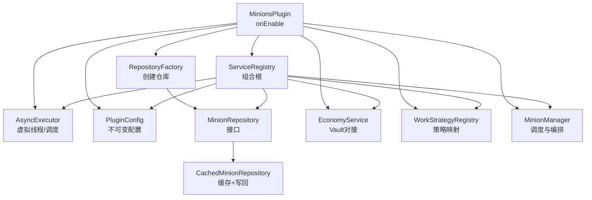
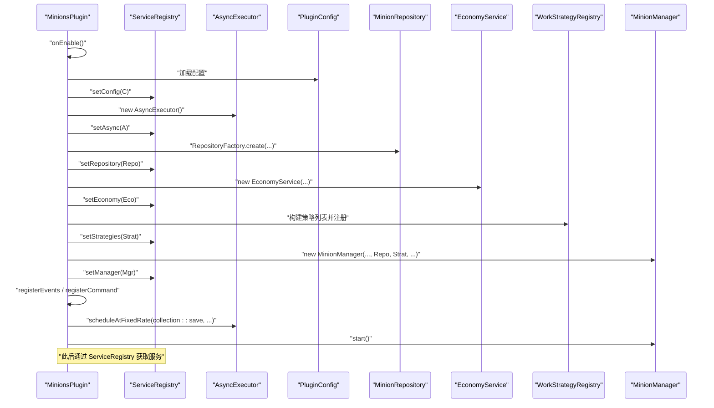
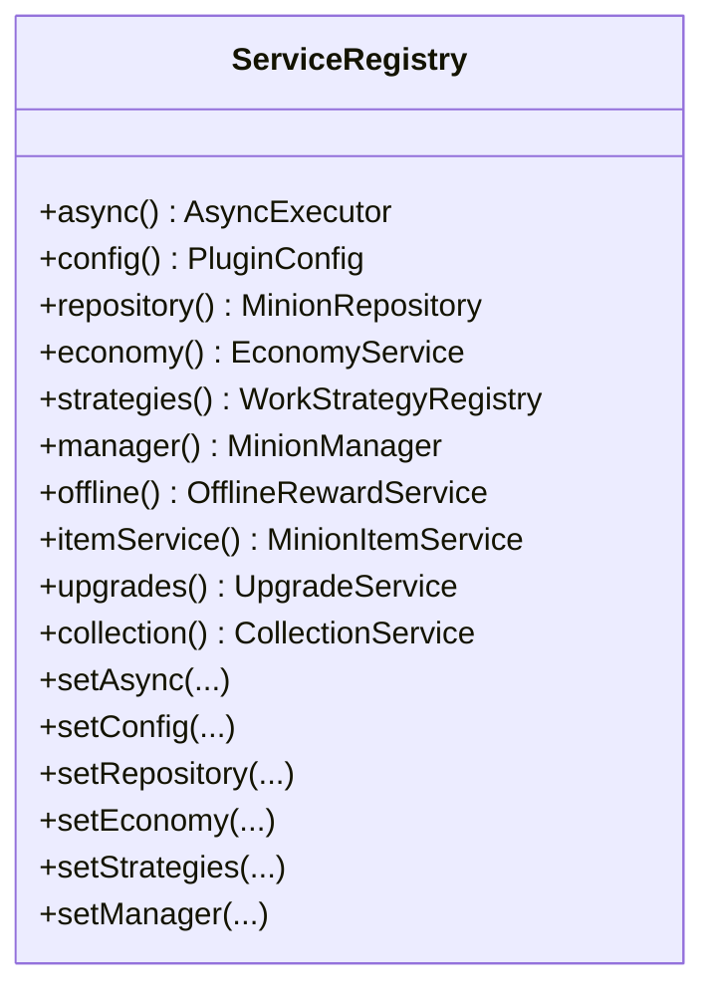
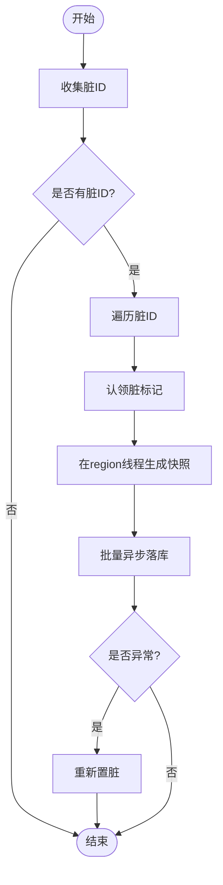
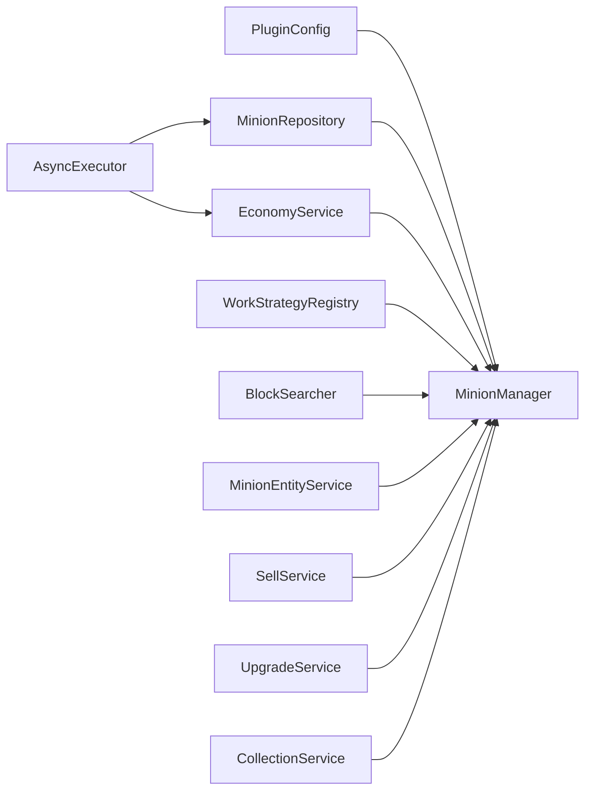

# 服务注册表模式

<cite>
**本文引用的文件**
- [ServiceRegistry.java](file://src/main/java/com/hcs/minions/core/ServiceRegistry.java)
- [MinionsPlugin.java](file://src/main/java/com/hcs/minions/MinionsPlugin.java)
- [AsyncExecutor.java](file://src/main/java/com/hcs/minions/util/AsyncExecutor.java)
- [PluginConfig.java](file://src/main/java/com/hcs/minions/config/PluginConfig.java)
- [MinionRepository.java](file://src/main/java/com/hcs/minions/repository/MinionRepository.java)
- [CachedMinionRepository.java](file://src/main/java/com/hcs/minions/repository/CachedMinionRepository.java)
- [RepositoryFactory.java](file://src/main/java/com/hcs/minions/repository/RepositoryFactory.java)
- [EconomyService.java](file://src/main/java/com/hcs/minions/service/EconomyService.java)
- [WorkStrategyRegistry.java](file://src/main/java/com/hcs/minions/work/WorkStrategyRegistry.java)
- [MinionManager.java](file://src/main/java/com/hcs/minions/service/MinionManager.java)
</cite>

## 目录
1. [简介](#简介)
2. [项目结构](#项目结构)
3. [核心组件](#核心组件)
4. [架构总览](#架构总览)
5. [详细组件分析](#详细组件分析)
6. [依赖关系分析](#依赖关系分析)
7. [性能与线程安全](#性能与线程安全)
8. [故障排查指南](#故障排查指南)
9. [结论](#结论)
10. [附录：使用与扩展实践](#附录使用与扩展实践)

## 简介
本插件采用“服务注册表（组合根）”模式组织启动期装配与运行时访问。ServiceRegistry 作为全局唯一的服务容器，在插件 onEnable 阶段按依赖顺序一次性创建并注入所有服务；之后以只读共享的方式被各模块通过 ServiceRegistry 获取。该设计实现了：
- 明确的依赖注入顺序与生命周期管理
- 全局单例式的服务访问入口
- 清晰的职责边界：主类仅负责装配与调度，业务逻辑下沉到服务层
- 对 Folia/区域线程的友好隔离：关键 IO 与 Inventory 操作严格限定在正确线程

## 项目结构
- 组合根：ServiceRegistry 持有全部服务实例并提供只读访问器
- 装配入口：MinionsPlugin.onEnable 中按依赖顺序创建并设置服务
- 基础设施：
  - AsyncExecutor：虚拟线程异步执行与周期调度
  - PluginConfig：不可变配置快照，全局只读
  - MinionRepository：数据访问抽象，实现带缓存的写回策略
- 业务服务：
  - EconomyService：经济系统对接（Vault），金额计算与加款
  - WorkStrategyRegistry：工作策略注册表（开闭原则）
  - MinionManager：仆从调度、工作编排、自动售卖、实体管理
  - 其他服务：BlockSearcher、SellService、UpgradeService、CollectionService 等

图表来源
- [MinionsPlugin.java:52-118](file://src/main/java/com/hcs/minions/MinionsPlugin.java#L52-L118)
- [ServiceRegistry.java:21-149](file://src/main/java/com/hcs/minions/core/ServiceRegistry.java#L21-L149)
- [RepositoryFactory.java:20-29](file://src/main/java/com/hcs/minions/repository/RepositoryFactory.java#L20-L29)

章节来源
- [MinionsPlugin.java:52-118](file://src/main/java/com/hcs/minions/MinionsPlugin.java#L52-L118)
- [ServiceRegistry.java:21-149](file://src/main/java/com/hcs/minions/core/ServiceRegistry.java#L21-L149)

## 核心组件
- ServiceRegistry：组合根，集中持有所有服务实例，提供 getter/setter 完成装配；运行期只读访问
- MinionsPlugin：插件主类，仅负责生命周期管理与服务装配，不承载业务逻辑
- AsyncExecutor：统一异步执行与周期调度，基于 Java 21 虚拟线程，避免阻塞主线程
- PluginConfig：不可变配置对象，启动时加载一次，全局共享只读
- MinionRepository：持久化抽象，内部实现包含内存缓存与异步落库，业务层无感知 IO
- EconomyService：经济服务，封装 Vault 调用，金额计算使用 BigDecimal，加款走异步
- WorkStrategyRegistry：工作策略注册表，类型到策略的只读映射，新增类型无需修改已有代码
- MinionManager：核心调度器，维护仆从集合、定时任务、工作编排、自动售卖、实体生成/销毁

章节来源
- [ServiceRegistry.java:21-149](file://src/main/java/com/hcs/minions/core/ServiceRegistry.java#L21-L149)
- [MinionsPlugin.java:52-118](file://src/main/java/com/hcs/minions/MinionsPlugin.java#L52-L118)
- [AsyncExecutor.java:19-79](file://src/main/java/com/hcs/minions/util/AsyncExecutor.java#L19-L79)
- [PluginConfig.java:22-45](file://src/main/java/com/hcs/minions/config/PluginConfig.java#L22-L45)
- [MinionRepository.java:16-46](file://src/main/java/com/hcs/minions/repository/MinionRepository.java#L16-L46)
- [EconomyService.java:24-87](file://src/main/java/com/hcs/minions/service/EconomyService.java#L24-L87)
- [WorkStrategyRegistry.java:14-33](file://src/main/java/com/hcs/minions/work/WorkStrategyRegistry.java#L14-L33)
- [MinionManager.java:44-115](file://src/main/java/com/hcs/minions/service/MinionManager.java#L44-L115)

## 架构总览
服务注册表模式在本项目中的体现：
- 组合根 ServiceRegistry 集中声明所有服务字段与访问器，形成单一装配点
- 主类 MinionsPlugin.onEnable 按依赖顺序创建并注入服务，确保依赖先于消费者存在
- 运行期通过 ServiceRegistry 获取服务，避免散落的静态或全局变量
- 生命周期由主类统一管理：onEnable 装配，onDisable 停止调度、保存数据、关闭资源

图表来源
- [MinionsPlugin.java:52-118](file://src/main/java/com/hcs/minions/MinionsPlugin.java#L52-L118)
- [ServiceRegistry.java:21-149](file://src/main/java/com/hcs/minions/core/ServiceRegistry.java#L21-L149)

## 详细组件分析

### ServiceRegistry：组合根与服务容器
- 设计要点
  - 集中声明所有服务字段与 setter/getter，形成单一装配点
  - 运行期只读访问：外部通过 getter 获取服务，禁止再修改
  - 明确依赖顺序：由主类在 onEnable 中按依赖先后 set
- 线程安全性
  - 自身为普通类，无并发写入需求；所有服务实例在 onEnable 期间构造完毕
  - 对外暴露的 getter 返回不可变引用或线程安全的服务对象

图表来源
- [ServiceRegistry.java:21-149](file://src/main/java/com/hcs/minions/core/ServiceRegistry.java#L21-L149)

章节来源
- [ServiceRegistry.java:21-149](file://src/main/java/com/hcs/minions/core/ServiceRegistry.java#L21-L149)

### MinionsPlugin：装配与生命周期管理
- 职责边界
  - 仅负责：加载配置、创建服务、注册事件/命令、启动/停止调度
  - 不包含：任何业务逻辑（如工作处理、售卖逻辑）
- 装配顺序
  - 配置 -> 异步执行器 -> 仓库 -> 经济服务 -> 策略注册表 -> 搜索器 -> 实体服务 -> 售卖服务 -> 升级服务 -> 收集服务 -> 管理器 -> 离线奖励 -> 物品服务
  - 最后注册事件、命令，启动管理器，开启定期落盘任务

章节来源
- [MinionsPlugin.java:52-118](file://src/main/java/com/hcs/minions/MinionsPlugin.java#L52-L118)

### AsyncExecutor：异步执行与调度
- 能力
  - 提交异步任务（有返回值/无返回值）
  - 周期调度（固定速率）
  - 暴露虚拟线程池供需要 Executor 的组件使用
- 线程模型
  - 使用 Java 21 虚拟线程执行器，避免阻塞主线程
  - 单线程调度器用于周期任务，避免为每个仆从单独开定时器

章节来源
- [AsyncExecutor.java:19-79](file://src/main/java/com/hcs/minions/util/AsyncExecutor.java#L19-L79)

### PluginConfig：不可变配置
- 特点
  - 启动时一次性反序列化，内部 Map 做不可变快照
  - 校验硬限制（如 maxChecksPerCycle < 50）
  - 提供 type(key) 便捷访问每种仆从的配置

章节来源
- [PluginConfig.java:22-45](file://src/main/java/com/hcs/minions/config/PluginConfig.java#L22-L45)

### MinionRepository：数据访问抽象与缓存写回
- 抽象能力
  - find/findAll/save/delete/flushDirty/collectDirtyIds/flushSnapshots/close
- 实现特性（CachedMinionRepository）
  - ConcurrentHashMap 缓存，O(1) 读取
  - 脏标记集合驱动批量异步落库
  - 两阶段落库：region 线程生成快照 -> 异步批量 upsert
  - 失败重试：落库异常重新置脏等待下次刷新

图表来源
- [CachedMinionRepository.java:99-153](file://src/main/java/com/hcs/minions/repository/CachedMinionRepository.java#L99-L153)

章节来源
- [MinionRepository.java:16-46](file://src/main/java/com/hcs/minions/repository/MinionRepository.java#L16-L46)
- [CachedMinionRepository.java:29-215](file://src/main/java/com/hcs/minions/repository/CachedMinionRepository.java#L29-L215)
- [RepositoryFactory.java:20-29](file://src/main/java/com/hcs/minions/repository/RepositoryFactory.java#L20-L29)

### EconomyService：经济服务
- 功能
  - 检测 Vault 是否启用，未启用则关闭经济功能
  - 价格计算使用 BigDecimal，避免浮点误差
  - 加款异步执行，成功后才视为结算成功
- 线程安全
  - 所有 Vault 调用在虚拟线程中执行，避免阻塞主线程

章节来源
- [EconomyService.java:24-87](file://src/main/java/com/hcs/minions/service/EconomyService.java#L24-L87)

### WorkStrategyRegistry：工作策略注册表
- 设计
  - 类型到策略的只读映射（EnumMap）
  - 新增类型只需注册新策略，符合开闭原则
  - 未注册类型抛出异常，便于早期发现配置错误

章节来源
- [WorkStrategyRegistry.java:14-33](file://src/main/java/com/hcs/minions/work/WorkStrategyRegistry.java#L14-L33)

### MinionManager：调度与编排
- 职责
  - 维护仆从集合（ConcurrentHashMap）
  - 全局调度器（GlobalRegionScheduler）周期性 tick
  - 在每个仆从所在 region 线程执行工作逻辑
  - 自动售卖轮询（region 线程内判断并售卖）
  - 实体生成/销毁、孤儿清理
- 线程安全
  - 所有涉及 Inventory 的操作均在 region 线程执行
  - 快照生成与落库分离，避免竞态

章节来源
- [MinionManager.java:44-115](file://src/main/java/com/hcs/minions/service/MinionManager.java#L44-L115)
- [MinionManager.java:117-180](file://src/main/java/com/hcs/minions/service/MinionManager.java#L117-L180)
- [MinionManager.java:186-350](file://src/main/java/com/hcs/minions/service/MinionManager.java#L186-L350)

## 依赖关系分析
- 装配依赖顺序（由主类保证）
  - PluginConfig -> AsyncExecutor -> MinionRepository -> EconomyService -> WorkStrategyRegistry -> BlockSearcher -> MinionEntityService -> SellService -> UpgradeService -> CollectionService -> MinionManager -> OfflineRewardService -> MinionItemService
- 服务间耦合
  - MinionManager 依赖 Repository、Strategies、Searcher、Entities、Sell、SkyblockHook、Permissions、AsyncExecutor、Upgrades、Collection
  - EconomyService 依赖 AsyncExecutor 与 Bukkit/Vault
  - Repository 依赖 AsyncExecutor 与底层存储（SQLite/MySQL）

图表来源
- [MinionsPlugin.java:52-118](file://src/main/java/com/hcs/minions/MinionsPlugin.java#L52-L118)
- [MinionManager.java:70-86](file://src/main/java/com/hcs/minions/service/MinionManager.java#L70-L86)

章节来源
- [MinionsPlugin.java:52-118](file://src/main/java/com/hcs/minions/MinionsPlugin.java#L52-L118)
- [MinionManager.java:70-86](file://src/main/java/com/hcs/minions/service/MinionManager.java#L70-L86)

## 性能与线程安全
- 性能优化
  - 虚拟线程异步执行 IO，避免阻塞主线程
  - 内存缓存减少数据库查询
  - 批量落库降低 IO 次数
  - EnumMap 存储策略，键为枚举无需装箱
- 线程安全设计
  - 配置不可变，避免并发修改
  - 仓库使用 ConcurrentHashMap 与原子集合
  - 快照生成在 region 线程，落库异步执行
  - 周期任务使用单线程调度器，避免竞争
- 注意事项
  - 严禁在异步线程直接访问 Bukkit Inventory
  - 关闭前需关闭 GUI，避免冲刷期间读到中间态

章节来源
- [AsyncExecutor.java:19-79](file://src/main/java/com/hcs/minions/util/AsyncExecutor.java#L19-L79)
- [CachedMinionRepository.java:29-215](file://src/main/java/com/hcs/minions/repository/CachedMinionRepository.java#L29-L215)
- [MinionManager.java:117-180](file://src/main/java/com/hcs/minions/service/MinionManager.java#L117-L180)

## 故障排查指南
- 常见问题定位
  - Vault 未启用：检查 EconomyService 初始化日志，确认经济功能已关闭
  - 策略未注册：WorkStrategyRegistry.get 抛出异常，检查配置与策略注册
  - 落库失败：查看 CachedMinionRepository 日志，确认是否重新置脏
  - Inventory 访问异常：确认是否在 region 线程执行
- 建议排查步骤
  - 打开 debug 配置，观察仆从工作与掉落
  - 检查周期任务是否正常触发（集合落盘、自动售卖）
  - 关注 onDisable 路径是否正确关闭资源

章节来源
- [EconomyService.java:38-49](file://src/main/java/com/hcs/minions/service/EconomyService.java#L38-L49)
- [WorkStrategyRegistry.java:26-33](file://src/main/java/com/hcs/minions/work/WorkStrategyRegistry.java#L26-L33)
- [CachedMinionRepository.java:135-153](file://src/main/java/com/hcs/minions/repository/CachedMinionRepository.java#L135-L153)
- [MinionManager.java:162-180](file://src/main/java/com/hcs/minions/service/MinionManager.java#L162-L180)

## 结论
本项目通过服务注册表模式实现了清晰的服务装配与生命周期管理。ServiceRegistry 作为组合根，将依赖注入顺序显式化；MinionsPlugin 仅负责装配与调度，业务逻辑下沉至服务层。结合虚拟线程异步执行、内存缓存与 region 线程隔离，系统在性能与线程安全方面具备良好表现。新增服务时，只需在 ServiceRegistry 中添加字段与访问器，并在主类按依赖顺序装配即可。

## 附录：使用与扩展实践
- 获取已注册服务
  - 通过 ServiceRegistry 提供的 getter 获取任意服务实例（例如：async、config、repository、economy、strategies、manager 等）
  - 示例路径参考：[ServiceRegistry.java:38-149](file://src/main/java/com/hcs/minions/core/ServiceRegistry.java#L38-L149)
- 使用已注册服务的典型场景
  - 异步任务提交：使用 AsyncExecutor.submit/run/scheduleAtFixedRate
  - 配置读取：通过 ServiceRegistry.config() 获取不可变配置
  - 数据访问：通过 ServiceRegistry.repository() 进行查找与保存
  - 经济操作：通过 ServiceRegistry.economy() 计算价格与加款
  - 工作策略：通过 ServiceRegistry.strategies() 获取对应类型的策略
  - 调度与管理：通过 ServiceRegistry.manager() 进行仆从管理
  - 示例路径参考：
    - [MinionsPlugin.java:59-118](file://src/main/java/com/hcs/minions/MinionsPlugin.java#L59-L118)
    - [MinionManager.java:92-115](file://src/main/java/com/hcs/minions/service/MinionManager.java#L92-L115)
- 扩展新服务的最佳实践
  - 在 ServiceRegistry 中添加字段与 getter/setter
  - 在主类 onEnable 中按依赖顺序创建并 set 到 registry
  - 确保新服务遵循线程安全约定（IO 异步、Inventory 在 region 线程）
  - 在 onDisable 中正确释放资源（关闭连接、取消任务）
  - 示例路径参考：
    - [ServiceRegistry.java:21-149](file://src/main/java/com/hcs/minions/core/ServiceRegistry.java#L21-L149)
    - [MinionsPlugin.java:52-118](file://src/main/java/com/hcs/minions/MinionsPlugin.java#L52-L118)