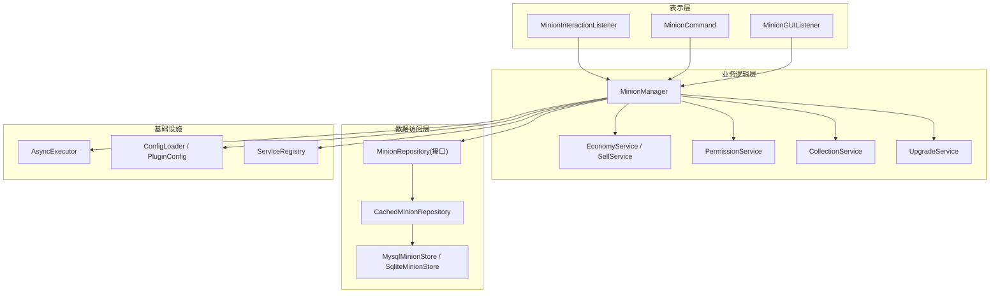
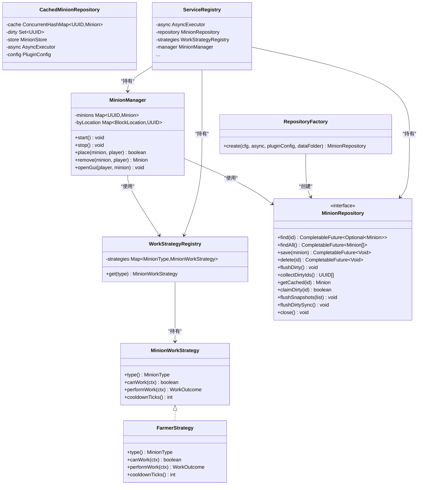
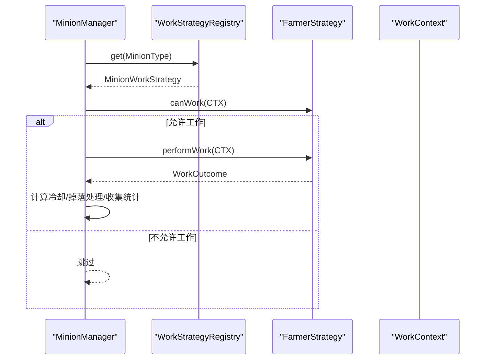
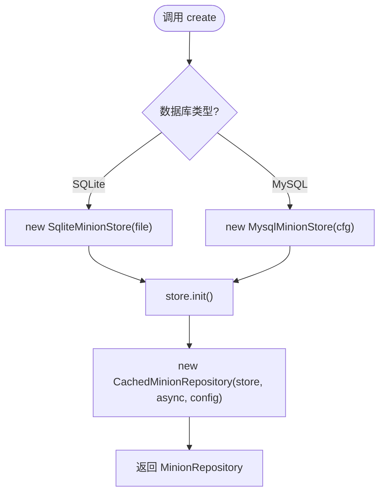
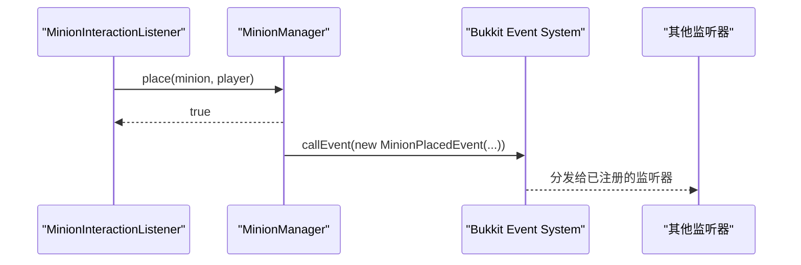
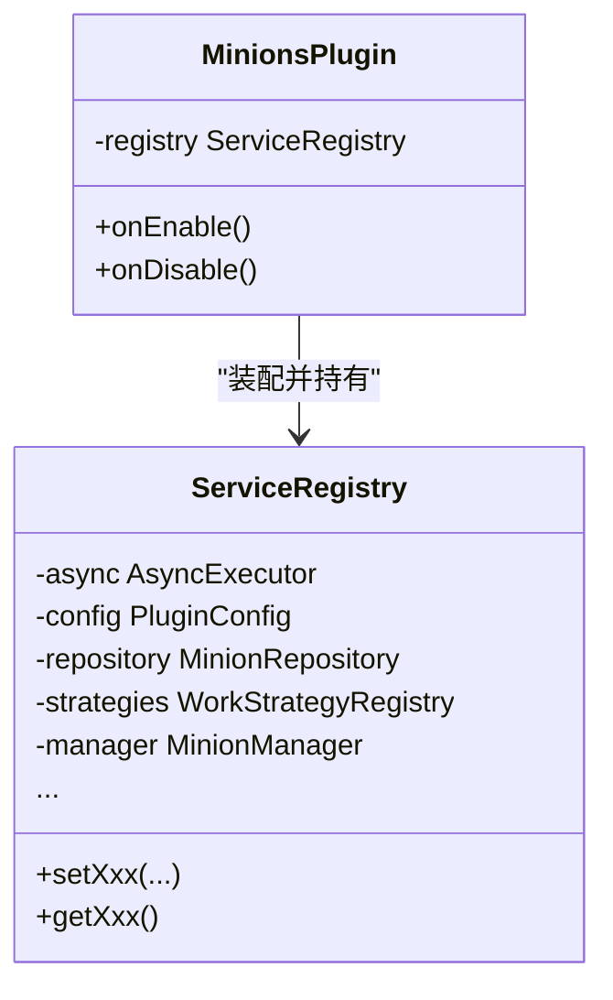
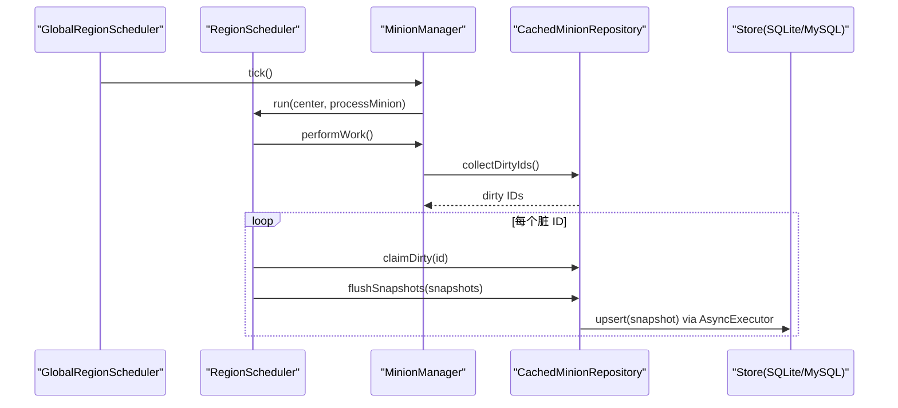
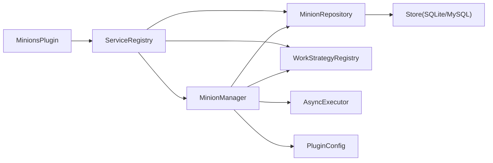

# 架构模式与设计原则

<cite>
**本文引用的文件**
- [MinionsPlugin.java](file://src/main/java/com/hcs/minions/MinionsPlugin.java)
- [ServiceRegistry.java](file://src/main/java/com/hcs/minions/core/ServiceRegistry.java)
- [WorkStrategyRegistry.java](file://src/main/java/com/hcs/minions/work/WorkStrategyRegistry.java)
- [MinionWorkStrategy.java](file://src/main/java/com/hcs/minions/work/MinionWorkStrategy.java)
- [RepositoryFactory.java](file://src/main/java/com/hcs/minions/repository/RepositoryFactory.java)
- [MinionRepository.java](file://src/main/java/com/hcs/minions/repository/MinionRepository.java)
- [CachedMinionRepository.java](file://src/main/java/com/hcs/minions/repository/CachedMinionRepository.java)
- [MinionManager.java](file://src/main/java/com/hcs/minions/service/MinionManager.java)
- [AsyncExecutor.java](file://src/main/java/com/hcs/minions/util/AsyncExecutor.java)
- [MinionPlacedEvent.java](file://src/main/java/com/hcs/minions/event/MinionPlacedEvent.java)
- [FarmerStrategy.java](file://src/main/java/com/hcs/minions/work/farmer/FarmerStrategy.java)
- [MinionInteractionListener.java](file://src/main/java/com/hcs/minions/listener/MinionInteractionListener.java)
- [ConfigLoader.java](file://src/main/java/com/hcs/minions/config/ConfigLoader.java)
- [pom.xml](file://pom.xml)
</cite>

## 目录
1. [简介](#简介)
2. [项目结构](#项目结构)
3. [核心组件](#核心组件)
4. [架构总览](#架构总览)
5. [详细组件分析](#详细组件分析)
6. [依赖关系分析](#依赖关系分析)
7. [性能考量](#性能考量)
8. [故障排查指南](#故障排查指南)
9. [结论](#结论)
10. [附录](#附录)

## 简介
本插件采用分层架构与多种经典设计模式，实现“仆从系统”的放置、工作、掉落处理、售卖、离线结算等能力。通过策略模式扩展不同工作类型，通过工厂模式屏蔽存储实现差异，通过观察者模式解耦事件传播，通过单例式服务注册表集中装配依赖；同时以接口抽象实现依赖倒置，达到高内聚、低耦合的目标。异步模型基于 Java 21 虚拟线程与 Paper 调度器，确保主线程安全与并发吞吐。

## 项目结构
- 表示层：Bukkit 事件监听器（放置、交互）、命令入口、GUI 监听
- 业务逻辑层：MinionManager 编排工作流，各 Service 封装领域能力（经济、权限、实体、集合统计等）
- 数据访问层：MinionRepository 接口 + CachedMinionRepository 缓存 + Store 实现（SQLite/MySQL）
- 基础设施：配置加载、异步执行器、日志、消息、工具类
- 扩展点：策略注册表、Hook（如 Skyblock）、升级模块

图表来源
- [MinionInteractionListener.java:54-94](file://src/main/java/com/hcs/minions/listener/MinionInteractionListener.java#L54-L94)
- [MinionManager.java:92-115](file://src/main/java/com/hcs/minions/service/MinionManager.java#L92-L115)
- [MinionRepository.java:16-47](file://src/main/java/com/hcs/minions/repository/MinionRepository.java#L16-L47)
- [CachedMinionRepository.java:29-42](file://src/main/java/com/hcs/minions/repository/CachedMinionRepository.java#L29-L42)
- [RepositoryFactory.java:20-29](file://src/main/java/com/hcs/minions/repository/RepositoryFactory.java#L20-L29)
- [AsyncExecutor.java:19-32](file://src/main/java/com/hcs/minions/util/AsyncExecutor.java#L19-L32)
- [ConfigLoader.java:30-83](file://src/main/java/com/hcs/minions/config/ConfigLoader.java#L30-L83)
- [ServiceRegistry.java:21-37](file://src/main/java/com/hcs/minions/core/ServiceRegistry.java#L21-L37)

章节来源
- [MinionsPlugin.java:52-120](file://src/main/java/com/hcs/minions/MinionsPlugin.java#L52-L120)
- [pom.xml:40-111](file://pom.xml#L40-L111)

## 核心组件
- 服务注册表 ServiceRegistry：组合根，集中装配并全局只读共享所有服务，避免散落的静态单例，保证生命周期可控。
- 策略注册表 WorkStrategyRegistry：将 MinionType 到 MinionWorkStrategy 的映射集中管理，新增类型无需修改调用方，符合开闭原则。
- 仓库工厂 RepositoryFactory：根据配置选择 SQLite 或 MySQL 存储，统一包装为带缓存的 MinionRepository，业务层对底层存储零感知。
- 管理器 MinionManager：全局单调度器，负责遍历、委派区域线程执行工作、生成快照落库、自动售卖、实体管理等核心流程。
- 异步执行器 AsyncExecutor：基于 Java 21 虚拟线程池与单线程调度器，承担 IO、Vault 加款、离线结算等非主线程任务。
- 事件 MinionPlacedEvent：自定义 Bukkit Event，用于模块间解耦的事件传播。

章节来源
- [ServiceRegistry.java:18-37](file://src/main/java/com/hcs/minions/core/ServiceRegistry.java#L18-L37)
- [WorkStrategyRegistry.java:10-33](file://src/main/java/com/hcs/minions/work/WorkStrategyRegistry.java#L10-L33)
- [RepositoryFactory.java:11-29](file://src/main/java/com/hcs/minions/repository/RepositoryFactory.java#L11-L29)
- [MinionManager.java:39-86](file://src/main/java/com/hcs/minions/service/MinionManager.java#L39-L86)
- [AsyncExecutor.java:12-32](file://src/main/java/com/hcs/minions/util/AsyncExecutor.java#L12-L32)
- [MinionPlacedEvent.java:9-39](file://src/main/java/com/hcs/minions/event/MinionPlacedEvent.java#L9-L39)

## 架构总览
本项目遵循清晰的分层与职责分离：
- 表示层：仅处理用户输入与事件分发，不承载复杂业务
- 业务层：编排工作流、协调服务、维护状态
- 数据层：提供持久化与缓存，隐藏 IO 细节
- 基础设施：配置、异步、日志、消息等横切关注点

图表来源
- [MinionWorkStrategy.java:5-26](file://src/main/java/com/hcs/minions/work/MinionWorkStrategy.java#L5-L26)
- [FarmerStrategy.java:17-70](file://src/main/java/com/hcs/minions/work/farmer/FarmerStrategy.java#L17-L70)
- [WorkStrategyRegistry.java:10-33](file://src/main/java/com/hcs/minions/work/WorkStrategyRegistry.java#L10-L33)
- [MinionRepository.java:16-47](file://src/main/java/com/hcs/minions/repository/MinionRepository.java#L16-L47)
- [CachedMinionRepository.java:29-42](file://src/main/java/com/hcs/minions/repository/CachedMinionRepository.java#L29-L42)
- [RepositoryFactory.java:11-29](file://src/main/java/com/hcs/minions/repository/RepositoryFactory.java#L11-L29)
- [MinionManager.java:39-86](file://src/main/java/com/hcs/minions/service/MinionManager.java#L39-L86)
- [ServiceRegistry.java:18-37](file://src/main/java/com/hcs/minions/core/ServiceRegistry.java#L18-L37)

## 详细组件分析

### 策略模式：WorkStrategyRegistry 与 MinionWorkStrategy
- 目标：消除 if-else 类型判断，新增工作类型只需实现接口并注册
- 实现要点：
  - 接口定义统一行为 canWork/performWork/cooldownTicks
  - 枚举键映射到具体策略，读取时 O(1) 查找
  - 不可变映射，防止运行时篡改
- 应用场景：农夫、矿工、伐木工、钓鱼、刷怪塔、牧场、合成台等

图表来源
- [MinionManager.java:252-322](file://src/main/java/com/hcs/minions/service/MinionManager.java#L252-L322)
- [WorkStrategyRegistry.java:18-32](file://src/main/java/com/hcs/minions/work/WorkStrategyRegistry.java#L18-L32)
- [MinionWorkStrategy.java:5-26](file://src/main/java/com/hcs/minions/work/MinionWorkStrategy.java#L5-L26)
- [FarmerStrategy.java:38-54](file://src/main/java/com/hcs/minions/work/farmer/FarmerStrategy.java#L38-L54)

章节来源
- [WorkStrategyRegistry.java:10-33](file://src/main/java/com/hcs/minions/work/WorkStrategyRegistry.java#L10-L33)
- [MinionWorkStrategy.java:5-26](file://src/main/java/com/hcs/minions/work/MinionWorkStrategy.java#L5-L26)
- [FarmerStrategy.java:17-70](file://src/main/java/com/hcs/minions/work/farmer/FarmerStrategy.java#L17-L70)
- [MinionManager.java:252-322](file://src/main/java/com/hcs/minions/service/MinionManager.java#L252-L322)

### 工厂模式：RepositoryFactory
- 目标：按配置选择 SQLite 或 MySQL 存储，统一返回带缓存的实现
- 实现要点：
  - 对外暴露 MinionRepository 接口，业务层无感知底层
  - 内部构造具体 Store 并初始化，再包装为缓存层
- 优势：新增存储实现只需扩展工厂分支，不影响上层

图表来源
- [RepositoryFactory.java:20-29](file://src/main/java/com/hcs/minions/repository/RepositoryFactory.java#L20-L29)

章节来源
- [RepositoryFactory.java:11-29](file://src/main/java/com/hcs/minions/repository/RepositoryFactory.java#L11-L29)
- [MinionRepository.java:16-47](file://src/main/java/com/hcs/minions/repository/MinionRepository.java#L16-L47)

### 观察者模式：Bukkit 事件系统
- 目标：模块间解耦，事件驱动的业务扩展点
- 实现要点：
  - 自定义事件 MinionPlacedEvent，在放置成功后触发
  - 监听器订阅事件，进行后续处理（如统计、通知、联动）
- 优势：新增功能无需改动放置流程代码

图表来源
- [MinionInteractionListener.java:54-94](file://src/main/java/com/hcs/minions/listener/MinionInteractionListener.java#L54-L94)
- [MinionManager.java:356-374](file://src/main/java/com/hcs/minions/service/MinionManager.java#L356-L374)
- [MinionPlacedEvent.java:9-39](file://src/main/java/com/hcs/minions/event/MinionPlacedEvent.java#L9-L39)

章节来源
- [MinionPlacedEvent.java:9-39](file://src/main/java/com/hcs/minions/event/MinionPlacedEvent.java#L9-L39)
- [MinionInteractionListener.java:54-94](file://src/main/java/com/hcs/minions/listener/MinionInteractionListener.java#L54-L94)
- [MinionManager.java:356-374](file://src/main/java/com/hcs/minions/service/MinionManager.java#L356-L374)

### 单例模式：ServiceRegistry（组合根）
- 目标：集中装配依赖，全局只读共享，避免散落的全局变量
- 实现要点：
  - 在 onEnable 中按依赖顺序一次性装配
  - 提供 getter 供各组件获取，运行期不可变
- 优势：便于测试替换、生命周期管理、依赖追踪

图表来源
- [MinionsPlugin.java:50-120](file://src/main/java/com/hcs/minions/MinionsPlugin.java#L50-L120)
- [ServiceRegistry.java:18-37](file://src/main/java/com/hcs/minions/core/ServiceRegistry.java#L18-L37)

章节来源
- [MinionsPlugin.java:50-120](file://src/main/java/com/hcs/minions/MinionsPlugin.java#L50-L120)
- [ServiceRegistry.java:18-37](file://src/main/java/com/hcs/minions/core/ServiceRegistry.java#L18-L37)

### 依赖倒置原则与接口抽象
- 业务层仅依赖 MinionRepository 接口，不关心 SQLite/MySQL 实现
- 工作逻辑仅依赖 MinionWorkStrategy 接口，不关心具体策略
- 通过接口抽象降低耦合，提升可测试性与可扩展性

章节来源
- [MinionRepository.java:16-47](file://src/main/java/com/hcs/minions/repository/MinionRepository.java#L16-L47)
- [MinionWorkStrategy.java:5-26](file://src/main/java/com/hcs/minions/work/MinionWorkStrategy.java#L5-L26)

### 异步编程模型与并发策略
- 虚拟线程：AsyncExecutor 使用 Executors.newVirtualThreadPerTaskExecutor() 执行 IO、Vault 加款、离线结算等任务
- 调度边界：方块破坏、掉落物生成、Inventory 操作严格在主线程或区域线程执行；全局遍历仅在 GlobalRegionScheduler 做轻量判断，具体工作委派到 RegionScheduler
- 快照落库：两阶段写入——先收集脏 ID，再在各自 region 线程生成快照后批量异步落库，避免竞态与数据不一致

图表来源
- [MinionManager.java:92-115](file://src/main/java/com/hcs/minions/service/MinionManager.java#L92-L115)
- [MinionManager.java:124-160](file://src/main/java/com/hcs/minions/service/MinionManager.java#L124-L160)
- [CachedMinionRepository.java:100-153](file://src/main/java/com/hcs/minions/repository/CachedMinionRepository.java#L100-L153)
- [AsyncExecutor.java:34-67](file://src/main/java/com/hcs/minions/util/AsyncExecutor.java#L34-L67)

章节来源
- [AsyncExecutor.java:12-32](file://src/main/java/com/hcs/minions/util/AsyncExecutor.java#L12-L32)
- [MinionManager.java:186-215](file://src/main/java/com/hcs/minions/service/MinionManager.java#L186-L215)
- [CachedMinionRepository.java:100-153](file://src/main/java/com/hcs/minions/repository/CachedMinionRepository.java#L100-L153)

## 依赖关系分析
- 松耦合：
  - 业务层通过接口依赖数据层与工作策略
  - 工厂模式隔离存储实现
  - 事件系统解耦模块间通信
- 内聚性：
  - MinionManager 聚合工作编排、实体管理、售卖、升级等核心流程
  - Repository 层封装缓存、脏标记、批量落库
- 外部依赖：
  - Paper API（provided），Vault、SuperiorSkyblockAPI 可选
  - HikariCP、SQLite/MySQL 驱动由平台提供

图表来源
- [MinionsPlugin.java:50-120](file://src/main/java/com/hcs/minions/MinionsPlugin.java#L50-L120)
- [ServiceRegistry.java:18-37](file://src/main/java/com/hcs/minions/core/ServiceRegistry.java#L18-L37)
- [MinionManager.java:39-86](file://src/main/java/com/hcs/minions/service/MinionManager.java#L39-L86)
- [RepositoryFactory.java:20-29](file://src/main/java/com/hcs/minions/repository/RepositoryFactory.java#L20-L29)

章节来源
- [pom.xml:40-111](file://pom.xml#L40-L111)
- [MinionsPlugin.java:50-120](file://src/main/java/com/hcs/minions/MinionsPlugin.java#L50-L120)

## 性能考量
- 虚拟线程：大量 IO 任务使用虚拟线程，减少线程切换开销，提高吞吐
- 区域调度：避免跨线程访问区块/实体/Inventory，减少锁竞争与竞态
- 缓存与批量：内存缓存 + 脏标记 + 批量落库，降低数据库压力
- 限流与半径：每周期最大检查数限制，避免全图扫描导致卡顿
- 资源释放：onDisable 关闭调度器、刷新数据、清理实体，避免泄漏

[本节为通用性能讨论，不直接分析具体文件]

## 故障排查指南
- 未注册策略异常：当查询到未知 MinionType 时会抛出非法状态异常，需检查配置与策略注册
- 异步任务失败：异步执行器捕获异常并记录日志，需检查任务实现与依赖服务可用性
- 落库失败：失败会重新置脏等待重试，若持续失败需检查数据库连接与权限
- GUI 竞态：关闭前需关闭所有打开的 GUI，避免冲刷期间读到中间态

章节来源
- [WorkStrategyRegistry.java:26-32](file://src/main/java/com/hcs/minions/work/WorkStrategyRegistry.java#L26-L32)
- [AsyncExecutor.java:34-67](file://src/main/java/com/hcs/minions/util/AsyncExecutor.java#L34-L67)
- [CachedMinionRepository.java:134-153](file://src/main/java/com/hcs/minions/repository/CachedMinionRepository.java#L134-L153)
- [MinionManager.java:162-180](file://src/main/java/com/hcs/minions/service/MinionManager.java#L162-L180)

## 结论
本项目通过清晰的层次划分与多种设计模式，实现了高内聚、低耦合的可扩展架构。策略模式使工作类型易于扩展；工厂模式屏蔽存储差异；观察者模式解耦事件传播；单例式服务注册表集中装配依赖。异步模型结合虚拟线程与区域调度，在保证主线程安全的前提下提升了并发性能。整体设计兼顾了可维护性、可测试性与高性能。

[本节为总结性内容，不直接分析具体文件]

## 附录
- 配置加载：ConfigLoader 将 YAML 反序列化为强类型配置，缺失值回退默认并告警
- 构建与依赖：pom.xml 声明 Paper API、Vault、SuperiorSkyblockAPI 等依赖，均为 provided 或 test scope

章节来源
- [ConfigLoader.java:30-83](file://src/main/java/com/hcs/minions/config/ConfigLoader.java#L30-L83)
- [pom.xml:40-111](file://pom.xml#L40-L111)